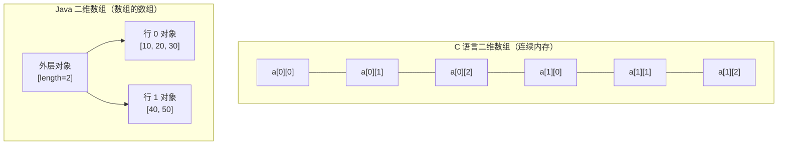

# 10 数组

> 前置知识：[[java/1入门/09_循环结构|09 循环结构]]
> 本章目标：掌握数组的声明与初始化、数组作为对象的本质、Arrays 工具类、二维不规则数组、越界异常，以及数组传参的引用语义。

## 概述

Java 数组「长得像 C，本质是对象」。语法上 `int[] a = new int[10]` 与 C 相近；但数组自带 `length`、有默认值、越界会抛异常而不是静默踩内存。此外标准库提供了 Arrays 工具类，把 C 里需要手写或调 qsort 的常见操作全部内置。

## 声明与初始化三种方式

```java
public class ArrayInit {
    public static void main(String[] args) {
        // ===== 方式一：静态初始化 —— 声明的同时给出全部元素 =====
        int[] a = {1, 2, 3, 4, 5};
        int[] b = new int[]{1, 2, 3};      // 与上一行等价，这种写法可用于赋值语句右侧

        // ===== 方式二：动态初始化 —— 指定长度，元素取默认值 =====
        int[] c = new int[5];              // 全部为 0

        // ===== 方式三：先声明后分配 =====
        String[] names;
        names = new String[3];             // 默认值 null

        // 注意两个语法细节：
        // int d[5];          // C 风格声明在 Java 中不合法！大小不能写在 [] 里
        // int e[10];         // 同上
        // var f = {1, 2};    // 不合法：var 推断不出 {1,2} 的类型
        // var g = new int[]{1, 2};   // 合法

        System.out.println(a.length);      // length 是属性不是方法！C 要自己记住大小
        System.out.println(names[0]);      // null
        System.out.println(c[4]);          // 0
    }
}
```

| 对比项 | C | Java |
|--------|---|------|
| 大小位置 | `int a[5];` | `int[] a = new int[5];` |
| 栈上分配 | 是（局部数组） | 否，数组永远是堆对象 |
| 获得长度 | 手动传参 / `sizeof(a)/sizeof(a[0])` | `a.length` |
| 初始化列表 | `= {1,2,3}` | 相同（但赋值语句中需 `new int[]{1,2,3}`） |
| 越界访问 | 未定义行为 | 抛异常 |

## 数组是对象

```java
public class ArrayIsObject {
    public static void main(String[] args) {
        int[] arr = new int[3];

        // 数组有类型、有字段、可以 instanceof——它就是对象
        System.out.println(arr.getClass());        // class [I （[ 表示数组，I 表示 int）
        System.out.println(arr.length);            // 对象的 final 字段
        Object o = arr;                            // 可以赋给 Object
        System.out.println(o instanceof int[]);    // true

        // 变量存的是引用，赋值只是复制引用：
        int[] x = {1, 2, 3};
        int[] y = x;              // y 和 x 指向同一个数组！
        y[0] = 999;
        System.out.println(x[0]); // 999 —— C 中指针行为类似，但 Java 无指针运算

        // 复制内容必须显式拷贝：
        int[] z = java.util.Arrays.copyOf(x, x.length);
        z[0] = 1;
        System.out.println(x[0] + " " + z[0]);     // 999 1

        // 内存布局示意：
        //
        // ```mermaid
        // flowchart LR
        //     X["变量 x"] --> R["堆上的数组对象\n[length=3 | 999 | 2 | 3 ]"]
        //     Y["变量 y"] --> R
        //     Z["变量 z"] --> R2["堆上的另一个数组\n[ 1 | 2 | 3 ]"]
        // ```
    }
}
```

`length` vs C 的 `sizeof`：C 中数组退化为指针后长度信息丢失，必须额外传参；Java 把长度作为对象的 final 字段随身携带。

## 默认值规则

数组分配时每个元素自动初始化为该类型的默认值（与成员变量规则一致）：

| 元素类型 | 默认值 |
|----------|--------|
| byte/short/int/long | 0 |
| float/double | 0.0 |
| char | '\u0000' |
| boolean | false |
| 引用类型（String 等） | null |

```java
public class DefaultValues {
    public static void main(String[] args) {
        double[] ds = new double[2];
        boolean[] bs = new boolean[2];
        String[] ss = new String[2];

        System.out.println(ds[0]);       // 0.0
        System.out.println(bs[1]);       // false
        System.out.println(ss[1]);       // null

        // 局部数组变量本身仍须初始化后才能使用：
        // int[] notInit;
        // notInit[0] = 1;               // 编译错误：可能尚未初始化
    }
}
```

## Arrays 工具类

C 里排序要写比较回调给 qsort，查找要手写循环；Java 的 `java.util.Arrays` 一站式搞定：

```java
import java.util.Arrays;

public class ArraysUtil {
    public static void main(String[] args) {
        int[] arr = {42, 7, 19, 3, 88};

        // 打印：直接 println(arr) 打印的是 [I@哈希码，必须用 toString
        System.out.println(Arrays.toString(arr));   // [42, 7, 19, 3, 88]

        // 排序：双基准快排（基本类型）/ TimSort（对象类型）
        Arrays.sort(arr);
        System.out.println(Arrays.toString(arr));   // [3, 7, 19, 42, 88]

        // 二分查找：前提是已排序，找到返回下标，找不到返回 -(插入点)-1
        int idx = Arrays.binarySearch(arr, 19);     // 2
        int miss = Arrays.binarySearch(arr, 20);    // -4（应插在下标 3）
        System.out.println(idx + " " + miss);

        // 填充与区间填充
        int[] filled = new int[5];
        Arrays.fill(filled, 7);
        Arrays.fill(filled, 1, 3, 9);               // 下标 [1,3) 填 9
        System.out.println(Arrays.toString(filled)); // [7, 9, 9, 7, 7]

        // 复制：copyOf 可扩容/缩容，copyOfRange 取区间
        int[] copy1 = Arrays.copyOf(arr, 8);         // 多出部分补 0
        int[] copy2 = Arrays.copyOfRange(arr, 1, 4); // 下标 [1,4)
        System.out.println(Arrays.toString(copy1));
        System.out.println(Arrays.toString(copy2));

        // 比较：equals 按内容比较（== 只比引用）
        System.out.println(Arrays.equals(arr, copy2)); // false
        int[][] deep = {{1, 2}, {3}};
        int[][] deep2 = {{1, 2}, {3}};
        System.out.println(Arrays.equals(deep, deep2));        // false！只比较一层引用
        System.out.println(Arrays.deepEquals(deep, deep2));    // true 递归比较内容

        // 对象数组自定义排序（lambda 回调，比 C 的函数指针友好）：
        String[] words = {"banana", "apple", "pear"};
        Arrays.sort(words, (s1, s2) -> s2.compareTo(s1));      // 按字典序逆序
        System.out.println(Arrays.toString(words));
    }
}
```

| 任务 | C 写法 | Java 写法 |
|------|--------|-----------|
| 排序 | `qsort(a, n, size, cmp)` 手写比较函数 | `Arrays.sort(a)` |
| 二分查找 | 手写或 bsearch | `Arrays.binarySearch(a, key)` |
| 复制 | `memcpy` | `Arrays.copyOf` |
| 内容比较 | 手写循环 / memcmp | `Arrays.equals` |
| 打印 | 手写循环 | `Arrays.toString` |

## 二维数组与不规则数组

Java 的二维数组本质是「数组的数组」，每一行可以是不同长度（jagged array）：

```java
public class TwoDArray {
    public static void main(String[] args) {
        // 规则二维数组：3 行 4 列
        int[][] matrix = new int[3][4];
        matrix[1][2] = 99;

        // 静态初始化
        int[][] grid = {
            {1, 2, 3},
            {4, 5, 6},
            {7, 8, 9}
        };

        // ===== 不规则数组：先定行数，再逐行分配不同长度 =====
        int[][] tri = new int[4][];         // 只指定行数，列数留空
        for (int i = 0; i < tri.length; i++) {
            tri[i] = new int[i + 1];        // 第 i 行有 i+1 个元素
            for (int j = 0; j <= i; j++) {
                tri[i][j] = (i + 1) * (j + 1);
            }
        }
        for (int[] row : tri) {
            System.out.println(java.util.Arrays.toString(row));
        }

        // 行数与列数分开获取：
        System.out.println(grid.length);        // 3 —— 行数
        System.out.println(grid[0].length);     // 3 —— 第一行的列数

        // C 中 int a[3][4] 是连续内存块，a[i][j] 地址 = 基址 + (i*4+j)*元素大小；
        // Java 的 [i][j] 是两次引用跳转，且各行不保证相邻：
    }
}
```

两种内存布局对比：



## 数组越界异常

```java
public class BoundsCheck {
    public static void main(String[] args) {
        int[] arr = new int[3];

        // arr[3] = 1;   // 抛 ArrayIndexOutOfBoundsException，JVM 即时拦截
        try {
            int x = arr[5];
        } catch (ArrayIndexOutOfBoundsException e) {
            System.out.println("捕获越界: " + e.getMessage());   // Index 5 out of bounds...
        }

        // 负下标同样被拦截（C 中负下标是指针运算，静默踩内存）：
        // arr[-1];

        // 安全遍历的惯用法——永远以 length 为上界：
        for (int i = 0; i < arr.length; i++) {
            arr[i] = i;
        }
    }
}
```

| 场景 | C | Java |
|------|---|------|
| 读越界位置 | 未定义行为，可能读到垃圾值 | 抛 `ArrayIndexOutOfBoundsException` |
| 写越界位置 | **缓冲区溢出**，安全漏洞头号来源 | 异常，进程状态不被破坏 |
| 性能代价 | 零检查 | 每次访问有边界检查（JIT 可优化掉） |

Java 用微小性能代价换取了整类内存安全漏洞的根除。

## 数组作为方法参数

```java
import java.util.Arrays;

public class ArrayParam {
    public static void main(String[] args) {
        int[] data = {3, 1, 2};

        // 传的是数组引用的副本——方法内修改会影响原数组（类似 C 传指针）
        sortIt(data);
        System.out.println(Arrays.toString(data));   // [1, 2, 3] 原数组变了！

        // 但让参数指向新数组不影响原引用：
        replace(data);
        System.out.println(Arrays.toString(data));   // 还是 [1, 2, 3]

        // 可变参数 varargs（语法糖：编译后就是数组）：
        System.out.println(sum(1, 2, 3));            // 6
        System.out.println(sum(4, 5, 6, 7));         // 22
        int[] nums = {10, 20};
        System.out.println(sum(nums));               // 可以直接传数组
    }

    // 排序：原地修改调用者的数组
    static void sortIt(int[] a) {
        Arrays.sort(a);
    }

    // 让参数指向新数组，只改变参数副本本身
    static void replace(int[] a) {
        a = new int[]{9, 9, 9};
    }

    // 可变参数：等价于 sum(int[] values)
    static int sum(int... values) {
        int total = 0;
        for (int v : values) total += v;
        return total;
    }
}
```

记忆模型：**参数传递永远传「值」**，只不过这个值是引用的拷贝。通过拷贝引用可以改对象内容，但不能让原变量指向别的对象。

## 命令行 args 数组

```java
public class CmdArgs {
    public static void main(String[] args) {
        // 与 C 的 argc/argv 对比：
        // C:  int main(int argc, char* argv[])  —— argv[0] 是程序名
        // Java: args 里只有真正的参数，没有程序名，也不需要 argc（用 args.length）
        System.out.println("参数个数: " + args.length);
        for (int i = 0; i < args.length; i++) {
            System.out.println("args[" + i + "] = " + args[i]);
        }
        // 运行示例：java CmdArgs hello 123 world
        // 注意所有参数都是 String，数字需要自行解析：
        if (args.length > 1) {
            int n = Integer.parseInt(args[1]);      // "123" -> 123
            System.out.println("第二个参数转整数: " + (n * 2));
        }
    }
}
```

## 综合示例

```java
import java.util.Arrays;
import java.util.Random;

/**
 * 综合演示：随机成绩统计
 * 涉及动态初始化、遍历、Arrays 工具类、增强 for、不规则数组分组
 */
public class ScoreStatistics {
    public static void main(String[] args) {
        Random random = new Random(42);              // 固定种子便于复现
        int[] scores = new int[30];

        // 动态初始化 + 填充随机分数 [40, 100]
        for (int i = 0; i < scores.length; i++) {
            scores[i] = random.nextInt(61) + 40;
        }
        System.out.println("全部成绩: " + Arrays.toString(scores));

        // 统计：最大/最小/平均
        int max = scores[0], min = scores[0], sum = 0;
        for (int s : scores) {
            if (s > max) max = s;
            if (s < min) min = s;
            sum += s;
        }
        System.out.printf("最高 %d, 最低 %d, 平均 %.1f%n",
                max, min, (double) sum / scores.length);

        // 排序后取中位数
        Arrays.sort(scores);
        double median = scores.length % 2 == 1
                ? scores[scores.length / 2]
                : (scores[scores.length / 2 - 1] + scores[scores.length / 2]) / 2.0;
        System.out.println("中位数: " + median);

        // 不规则数组按档位分组：不及格 / 及格 / 良好 / 优秀
        int[][] groups = new int[4][];
        int[] counts = new int[4];
        for (int s : scores) {
            if (s < 60) counts[0]++;
            else if (s < 70) counts[1]++;
            else if (s < 85) counts[2]++;
            else counts[3]++;
        }
        for (int g = 0; g < 4; g++) {
            groups[g] = new int[counts[g]];          // 按统计结果分配各档长度
        }
        int[] pos = new int[4];
        for (int s : scores) {
            int g = s < 60 ? 0 : s < 70 ? 1 : s < 85 ? 2 : 3;
            groups[g][pos[g]++] = s;
        }
        String[] names = {"不及格", "及格", "良好", "优秀"};
        for (int g = 0; g < 4; g++) {
            System.out.println(names[g] + ": " + Arrays.toString(groups[g]));
        }
    }
}
```

## 本章要点回顾

- 三种初始化方式；大小写在 `[]` 外；`length` 属性替代 C 的 sizeof 技巧
- 数组是堆上的对象，赋值复制引用，复制内容要用 `Arrays.copyOf`
- 元素自动获得默认值（数值 0、boolean false、引用 null）
- Arrays 工具类覆盖排序/查找/复制/比较/打印，替代 C 的 qsort/memcpy 手工活
- 二维数组是不规则的「数组的数组」，与 C 的连续内存布局不同
- 越界抛异常而非未定义行为；方法传参传引用副本，可改内容不可换对象

## LeetCode 巩固

- [最大子数组和](https://leetcode.cn/problems/maximum-subarray/) —— Kadane 算法，一遍循环维护当前与历史最大和
- [旋转数组](https://leetcode.cn/problems/rotate-array/) —— 三次区间反转实现 O(1) 空间轮转
- [两个数组的交集](https://leetcode.cn/problems/intersection-of-two-arrays/) —— 双数组遍历配合去重思路
- [移动零](https://leetcode.cn/problems/move-zeroes/) —— 快慢双指针原地操作数组

---

- 下一章：[[java/1入门/11_字符串|11 字符串]]
- 相关：[[java/1入门/09_循环结构|09 循环结构]]
