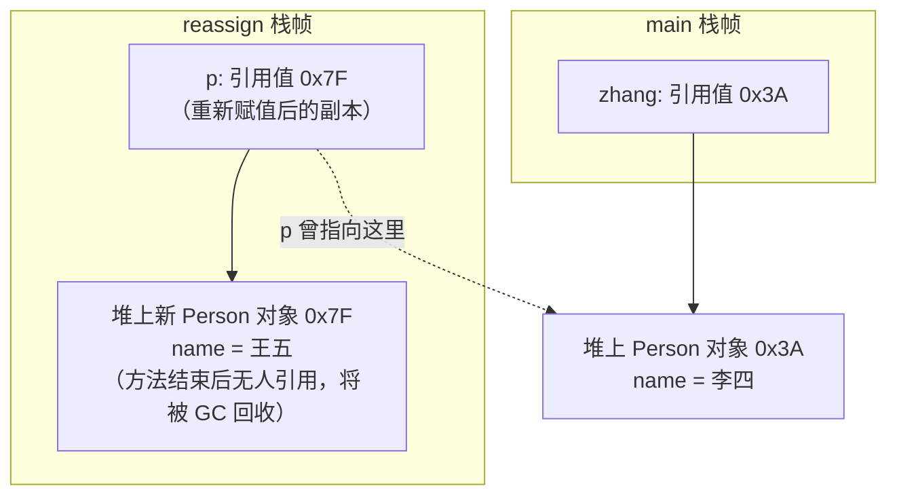
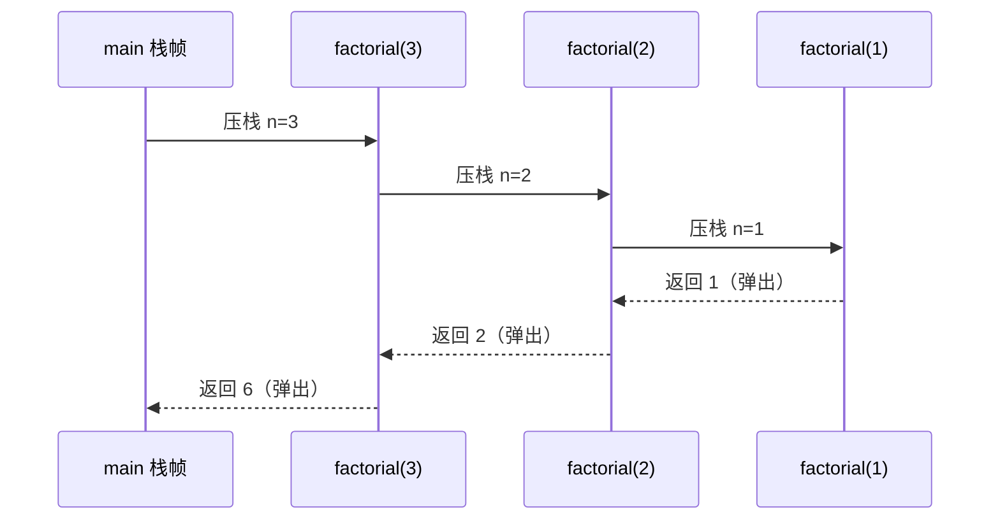

# 12 方法

> 前置知识：[[java/1入门/11_字符串|11 字符串]]
> 本章目标：掌握方法的定义与调用、理解 Java 只有值传递这一关键语义、方法重载、可变参数、递归与栈帧、static 方法与工具类写法。这些概念在 C 中大多有对应物，但细节差异极大——尤其是参数传递，是 C 程序员转 Java 最大的坑之一。

## 概述

在 C 里，「函数」是第一公民，函数可以独立于任何结构存在。Java 没有「全局函数」这个概念：所有方法必须定义在类的内部。你可以把 Java 的方法理解为「C 函数 + 一个隐含的所属对象参数」，编译器会帮你把 `obj.method(a)` 翻译成类似 `method(obj, a)` 的形式。

本章先讲清「方法长什么样、怎么被调用」，再逐个击破与 C 差异最大的四个点：值传递语义、重载、可变参数、递归栈帧。

## 方法定义：必须在类内

```java
public class MethodBasic {
    // 定义在类内的方法 —— C 中等价于"挂在结构体上的操作函数"
    // 修饰符 返回类型 方法名(参数列表) { ... }
    static int add(int a, int b) {
        return a + b;
    }

    // 无返回值用 void，对应 C 的 void
    static void greet(String name) {
        System.out.println("你好, " + name);
    }

    // main 是程序入口，签名固定：public static void main(String[] args)
    public static void main(String[] args) {
        int sum = add(3, 5);       // 调用同类中的 static 方法
        greet("张三");
        System.out.println(sum);   // 8

        // C 中函数靠头文件原型声明后才能提前使用；
        // Java 无头文件，但方法顺序无所谓——编译器两遍扫描，
        // 在 add 定义之前调用它也完全合法。
    }
}
```

| 对比项 | C | Java |
|--------|---|------|
| 存在位置 | 文件顶层，可有全局函数 | 必须在类内 |
| 声明原型 | 头文件 .h 中声明 | 无头文件，无前置声明 |
| 隐式返回类型 | C89 允许省略 int（危险） | 不允许，必须显式写返回类型 |
| 默认参数 `f(int x=0)` | 不支持（C23 前） | 同样不支持，用重载模拟 |

## 参数传递：Java 只有值传递

这是本章最重要的知识点。结论先给出：

- 基本类型传参：拷贝值本身，方法内修改不影响外部（与 C 一致）
- 对象传参：拷贝的是**引用的副本**，两个引用指向同一个对象，所以方法内能修改对象的字段，但**无法让外部变量指向另一个对象**

```java
public class PassByValue {
    static void changePrimitive(int x) {
        x = 100;                   // 改的是副本，与 C 相同
    }

    static void changeField(Person p) {
        p.name = "李四";           // 通过引用副本找到堆上的对象并改字段 —— 生效！
    }

    static void reassign(Person p) {
        p = new Person();          // 让"引用的副本"指向新对象 —— 不影响外部！
        p.name = "王五";
    }

    public static void main(String[] args) {
        int n = 10;
        changePrimitive(n);
        System.out.println(n);     // 10，没变

        Person zhang = new Person();
        zhang.name = "张三";

        changeField(zhang);
        System.out.println(zhang.name);   // 李四 —— 字段被改了！

        reassign(zhang);
        System.out.println(zhang.name);   // 李四 —— 没有变成王五！
    }
}

class Person {
    String name;
}
```

为什么 `reassign` 没生效？看内存图：



关键点：`p` 只是 `zhang` 的一个副本，`p = new Person()` 只是把副本指向别处，`zhang` 依然指着原对象。这与 C 完全同构：

```c
/* C 中的等价物 */
void reassign(struct Person *p) {
    p = malloc(sizeof(struct Person)); /* 只改了形参指针本身 */
}
/* 想真正让调用方换对象，C 要传二级指针：
   void reassign(struct Person **pp);
   Java 中没有二级指针语法，只能用返回值或包装类解决 */
```

| 场景 | C 视角 | Java 实际行为 |
|------|--------|--------------|
| 传 `int` | 拷贝 4 字节 | 相同，拷贝值 |
| 传数组 | 传指针（首地址） | 拷贝引用，内容共享 |
| 传结构体 | **整体按位拷贝** | Java 对象不能按值传，永远是引用拷贝 |
| 方法内交换两个 int | 传 `int*` 可行 | **做不到**，用数组或返回值绕过 |

## 方法重载 Overload：同名不同参

同一个类中可以定义多个**同名但参数列表不同**的方法，编译器根据实参在编译期静态决定调用哪个版本。C 中同名函数直接冲突，只能起 `atoi`、`atof` 这种带类型前缀的名字；C++ 与 Java 一样支持重载。

```java
public class OverloadDemo {
    // 三个重载：参数个数或类型不同即可
    static int max(int a, int b) {
        return a >= b ? a : b;
    }

    static double max(double a, double b) {
        return a >= b ? a : b;
    }

    static int max(int a, int b, int c) {
        return max(max(a, b), c);      // 重载之间可以互相复用
    }

    public static void main(String[] args) {
        System.out.println(max(3, 5));         // 匹配 (int, int)
        System.out.println(max(2.5, 1.8));     // 匹配 (double, double)
        System.out.println(max(1, 9, 4));      // 匹配 (int, int, int)

        // 注意：返回值类型不参与重载判定！
        // static int f() {...} 和 static double f() {...} 不能共存，
        // 因为调用 f(); 时编译器无从判断要哪个。
        //
        // 两个重载仅参数名不同也不行：
        // static void g(int a) 与 static void g(int b) 是重复定义。
    }
}
```

重载解析规则：先精确匹配，找不到再自动拓宽（int 到 long 到 double），最后才考虑装箱和可变参数。这也带来一个经典陷阱：

```java
public class OverloadTrap {
    static void show(int x)      { System.out.println("int: " + x); }
    static void show(long x)     { System.out.println("long: " + x); }
    static void show(Integer x)  { System.out.println("Integer: " + x); }
    static void show(Object x)   { System.out.println("Object: " + x); }
    static void show(int... x)   { System.out.println("varargs"); }

    public static void main(String[] args) {
        show(5);            // int —— 精确匹配优先
        show(5L);           // long —— int 自动拓宽为 long
        short s = 5;
        show(s);            // int！short 先拓宽为 int，而不是装箱成 Integer
        Integer box = 5;
        show(box);          // Integer —— 已装箱就匹配包装类
        show();             // varargs —— 其他都不匹配时才轮到可变参数
    }
}
// 解析优先级：精确匹配 > 自动拓宽 > 装箱 > 可变参数
```

## 可变参数 int... nums

Java 5 引入的可变参数语法，用于「参数个数不定」的场景。`System.out.printf` 就是最典型的应用。

```java
public class VarArgs {
    // int... nums 本质就是 int[] nums，编译器帮你在调用点打包数组
    static int sum(int... nums) {
        int total = 0;
        for (int n : nums) {          // nums 就是个普通数组
            total += n;
        }
        return total;
    }

    // 可变参数必须是最后一个参数，且一个方法最多只能有一个
    static void log(String level, String... msgs) {
        System.out.print(level + ": ");
        for (String m : msgs) {
            System.out.print(m + " ");
        }
        System.out.println();
    }

    public static void main(String[] args) {
        System.out.println(sum());             // 0，打包成空数组
        System.out.println(sum(1));            // 1
        System.out.println(sum(1, 2, 3, 4));   // 10，等价于 sum(new int[]{1,2,3,4})

        // 已经有现成数组可以直接传，不会二次包装：
        int[] arr = {7, 8, 9};
        System.out.println(sum(arr));          // 24

        log("INFO", "启动", "端口", "8080");
        System.out.printf("%s=%d%n", "count", 42);
    }
}
```

C 用 `<stdarg.h>` 手工遍历参数栈实现同样的功能，但没有类型安全：

| 对比项 | C（stdarg.h） | Java 可变参数 |
|--------|---------------|---------------|
| 声明 | `int sum(int count, ...)` | `int sum(int... nums)` |
| 个数获取 | 手动传 count 或约定哨兵值 | `nums.length` |
| 取值 | `va_start/va_arg/va_end` 宏 | 直接当数组下标访问 |
| 类型检查 | 无，取错类型即未定义行为 | 编译期保证元素类型一致 |
| 本质 | 访问调用栈 | 编译器生成 `new T[]{...}` |

## 递归与栈帧

每次方法调用都会在 JVM 虚拟机栈上压入一个栈帧（存放局部变量表、操作数栈、返回地址），方法返回则弹出栈帧。递归就是不断压栈的过程——深度过大时会抛 `StackOverflowError`，对应 C 的栈溢出段错误，但 Java 给了明确的错误信号而不是静默踩坏内存。



```java
public class RecursionDemo {
    // 阶乘：n! = n * (n-1)!
    static long factorial(int n) {
        if (n <= 1) {              // 递归出口，必须有，否则无限压栈
            return 1;
        }
        return n * factorial(n - 1);
    }

    // 尾递归版：结果通过参数累积，不再依赖栈上回乘
    // 注意：JVM 目前不做尾调用优化（不像部分 Scheme/Lua 实现），
    // 所以尾递归只是风格更好，并不会真的省栈空间！
    static long factTail(int n, long acc) {
        if (n <= 1) {
            return acc;
        }
        return factTail(n - 1, acc * n);
    }

    // 斐波那契：展示朴素递归的指数爆炸问题
    static long fibNaive(int n) {
        if (n <= 1) {
            return n;
        }
        return fibNaive(n - 1) + fibNaive(n - 2);   // 大量重复计算，O(2^n)
    }

    // 记忆化版：用数组缓存已算过的结果，降到 O(n)
    static long fibMemo(int n, long[] memo) {
        if (n <= 1) {
            return n;
        }
        if (memo[n] != 0) {         // 算过就直接取
            return memo[n];
        }
        memo[n] = fibMemo(n - 1, memo) + fibMemo(n - 2, memo);
        return memo[n];
    }

    public static void main(String[] args) {
        System.out.println(factorial(10));                  // 3628800
        System.out.println(factTail(10, 1));                // 3628800
        System.out.println(fibMemo(50, new long[51]));      // 12586269025

        // 试试 fibNaive(50)：慢到怀疑人生。
        // 再试试 factorial(-1) 改成无出口的写法：StackOverflowError
        long start = System.currentTimeMillis();
        fibNaive(30);
        System.out.println("fibNaive(30) 耗时 " + (System.currentTimeMillis() - start) + " ms");
    }
}
```

| 对比项 | C | Java |
|--------|---|------|
| 栈溢出表现 | 段错误 Segmentation fault | StackOverflowError |
| 默认栈大小 | 通常 1-8 MB（ulimit 可调） | 主线程约 512KB-1MB（-Xss 可调） |
| 尾调用优化 | GCC/Clang 开优化时常做 | JVM 不做 |
| 栈帧内容 | 编译器布局，不可移植 | 规范定义：局部变量表+操作数栈 |

## static 方法与工具类

`static` 方法属于类而不属于任何对象，可以直接用「类名.方法名」调用，不需要先 `new` 一个实例。前面所有例子里的 `main` 都是 static 方法——因为程序启动时还没有任何对象。

static 方法的限制：

- 不能直接访问本类的实例字段和实例方法（没有 `this`）
- 不能被重写（可以被隐藏，见 [[java/1入门/14_继承与多态|继承与多态]]）

把一组相关静态方法收进一个 final 类、私有化构造器防止实例化，就是标准的**工具类**写法。C 里这对应「一个 .h 声明 + .c 实现的函数库」：

```java
public class MathUtils {
    // 私有构造器：禁止 new MathUtils()，工具类不该有实例
    private MathUtils() {
        throw new AssertionError("工具类不允许实例化");
    }

    // 判断素数
    public static boolean isPrime(int n) {
        if (n < 2) {
            return false;
        }
        for (int i = 2; (long) i * i <= n; i++) {   // 只试除到根号 n
            if (n % i == 0) {
                return false;
            }
        }
        return true;
    }

    // 最大公约数：辗转相除法，与 C 写法完全一致
    public static int gcd(int a, int b) {
        while (b != 0) {
            int t = a % b;
            a = b;
            b = t;
        }
        return a;
    }

    // 可变参数求平均值
    public static double average(double... values) {
        if (values.length == 0) {
            throw new IllegalArgumentException("至少需要一个值");
        }
        double sum = 0;
        for (double v : values) {
            sum += v;
        }
        return sum / values.length;
    }
}
```

```java
public class UseMathUtils {
    public static void main(String[] args) {
        // 类名直接调用，无需创建对象 —— 与 C 调库函数体验一致
        System.out.println(MathUtils.isPrime(97));     // true
        System.out.println(MathUtils.gcd(48, 18));     // 6
        System.out.println(MathUtils.average(1, 2, 3)); // 2.0

        // JDK 自带的 Math 就是最常用的工具类：
        System.out.println(Math.max(3, 7));
        System.out.println(Math.abs(-42));
        System.out.println(Math.pow(2, 10));
    }
}
```

什么时候不用 static？只要方法需要读写对象的实例状态（字段），就必须是实例方法。static 是「与对象无关的计算逻辑」，滥用 static 会退化为「面向过程地写 Java」。

## 本章要点回顾

- 所有方法必须在类内；Java 无全局函数、无头文件、无前置声明
- Java 只有值传递：基本类型拷贝值，对象拷贝引用副本；改字段生效，重新赋值不生效
- 重载是编译期按参数列表静态分派；返回值不参与判定；解析顺序为精确匹配、拓宽、装箱、可变参数
- 可变参数本质是数组，对标 stdarg.h 但类型安全
- 递归每层一个栈帧，过深抛 StackOverflowError；JVM 不做尾调用优化
- 工具类 = final 类 + 私有构造器 + 全 static 方法，对标 C 的函数库

## LeetCode 巩固

- [斐波那契数](https://leetcode.cn/problems/fibonacci-number/) —— 先写朴素递归再写记忆化，亲身体会指数复杂度到线性
- [x 的平方根](https://leetcode.cn/problems/sqrtx/) —— 二分查找实现，练习带返回值的静态方法组织
- [Pow(x, n)](https://leetcode.cn/problems/powx-n/) —— 快速幂递归，注意负指数与溢出处理

---

- 返回目录：[[java/1入门/06_变量与数据类型|06 变量与数据类型]]
- 相关：[[java/1入门/13_类与对象|13 类与对象]]（实例方法与 this 的完整讲解）


