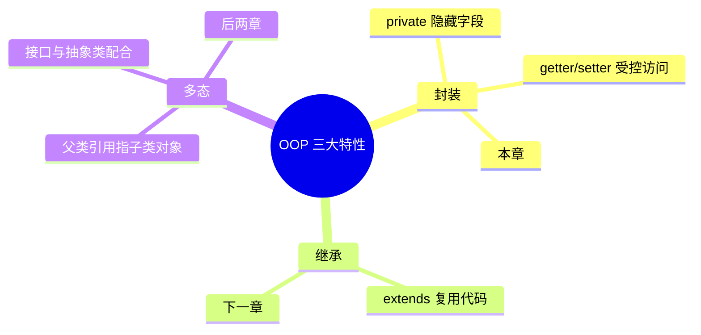
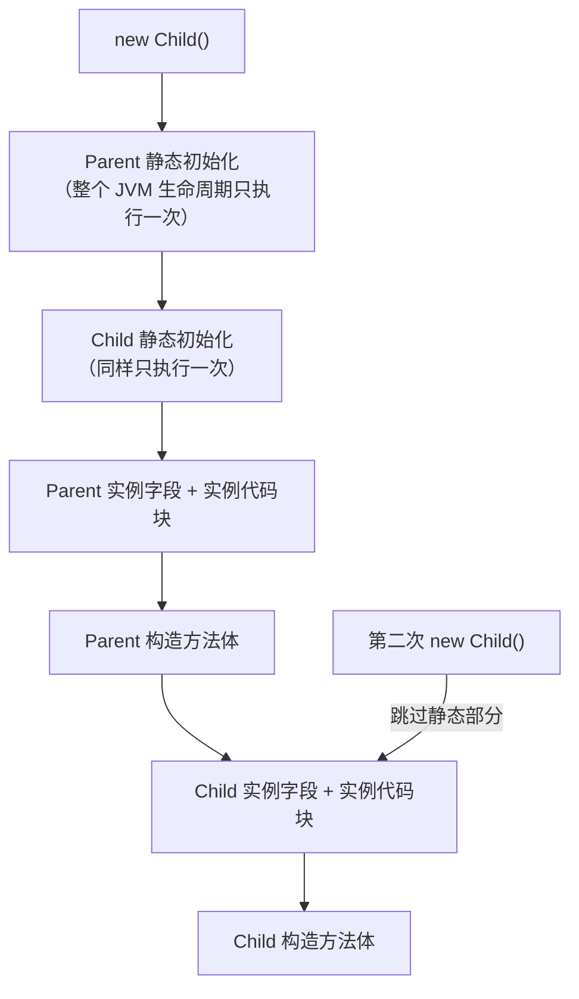

# 13 类与对象

> 前置知识：[[java/1入门/12_方法|12 方法]]
> 本章目标：理解类与对象的本质、构造方法、封装、JavaBean 规范，掌握 record 记录类这一「最像 C struct」的语法，弄清字段默认值与初始化顺序，初步认识 GC 与 package 组织。学完本章你就能用面向对象的方式组织程序了。

## 概述

C 的 `struct` 只是一堆字段的内存布局，行为要靠独立的函数；C 程序员常用「struct + 一组以结构体指针为首参的函数」模拟面向对象。Java 把数据和操作数据的方法**绑定**在一起形成类（class），用类生成对象（object）。OOP 三大特性在本章和后两章展开：



## class 与 new

```java
public class ClassBasic {
    public static void main(String[] args) {
        // 声明变量 + new 创建对象：两步
        Student stu;                    // 此时只是引用，不指向任何对象
        stu = new Student("张三", 20);  // 在堆上分配对象，返回引用

        Student stu2 = new Student("李四", 22);   // 常见的一步写法
        System.out.println(stu.name + " " + stu.age);
        stu.introduce();                // 调用对象的方法

        // 对象不能像 C struct 一样整体赋值拷贝：
        Student stu3 = stu2;            // 只是复制了引用！两个名字同一个对象
        stu3.age = 99;
        System.out.println(stu2.age);   // 99 —— 被"连带"修改了
    }
}

class Student {
    String name;
    int age;

    Student(String name, int age) {     // 构造方法，下一节详讲
        this.name = name;
        this.age = age;
    }

    void introduce() {
        System.out.println("我是 " + name + "，今年 " + age + " 岁");
    }
}
```

C 中用函数指针在 struct 里挂方法的写法，Java 直接内置了：

| 对比项 | C 手工模拟 | Java 内置 |
|--------|-----------|-----------|
| 数据 | `struct Student` | 字段 |
| 行为 | 函数指针成员或独立函数 | 方法 |
| 「this」 | 显式传 `Student* self` | 隐式 `this` 引用 |
| 创建 | `malloc(sizeof(struct Student))` | `new Student(...)` |
| 初始化 | 手写 init 函数，忘调即脏数据 | 构造方法强制初始化 |
| 释放 | `free(p)` | GC 自动回收 |

## 字段 vs 局部变量默认值

这是高频考点：**字段有默认值，局部变量必须先赋值再用**。

```java
public class DefaultValue {
    static boolean flag;       // 类的字段
    static int count;
    static String text;

    public static void main(String[] args) {
        System.out.println(flag);   // false
        System.out.println(count);  // 0
        System.out.println(text);   // null —— 引用类型默认 null，不是空串！

        // int x;  System.out.println(x);   // 编译错误！局部变量没有默认值
        // C 中局部变量不初始化是未定义行为（读垃圾值），Java 直接编译报错，
        // 数组和对象的字段例外——它们由 JVM 清零初始化。
    }
}
```

| 类型 | 默认值 | C 局部变量的值 |
|------|--------|---------------|
| byte/short/int/long | 0 | 未定义（垃圾值） |
| float/double | 0.0 | 未定义 |
| char | '\u0000' | 未定义 |
| boolean | false | 无对应类型 |
| 引用类型 | null | 野指针 |

## 构造方法、重载与 this

构造方法与类同名、无返回类型（连 void 都不能写），在 `new` 时自动调用。

```java
public class ConstructorDemo {
    public static void main(String[] args) {
        Point p1 = new Point();          // 调无参构造 (0, 0)
        Point p2 = new Point(5);         // 调一参构造 (5, 5)
        Point p3 = new Point(3, 4);      // 调两参构造 (3, 4)
        Point p4 = new Point(p3);        // 拷贝构造，模仿 C 的结构体按值复制
        System.out.println(p3.x + "," + p3.y);   // 3,4
        p4.x = 100;
        System.out.println(p3.x);        // 3 —— 拷贝互不影响
    }
}

class Point {
    int x;
    int y;

    Point() {
        this(0, 0);          // this(...) 调用另一个构造方法，必须是第一行
    }

    Point(int x) {
        this(x, x);          // 复用两参构造，减少重复
    }

    Point(int x, int y) {
        this.x = x;          // 参数名遮蔽字段名时，必须用 this.x 区分
        this.y = y;
    }

    // 拷贝构造：C 结构体赋值是按位拷贝，Java 对象需要自己实现
    Point(Point other) {
        this.x = other.x;
        this.y = other.y;
    }
}
```

要点：

- 如果你**一个构造方法都不写**，编译器送你一个隐式无参构造
- 但只要你写了任何带参构造，隐式无参构造就消失——再想 `new Point()` 必须显式补上
- `this(...)` 只能在构造方法第一行，且一个构造只能调用一次

## 封装：private + getter/setter

字段直接暴露（如上面 `stu.age = 99`）无法做合法性校验。封装就是把字段设为 private，通过公开方法受控访问。

```java
public class EncapsulationDemo {
    public static void main(String[] args) {
        BankAccount acc = new BankAccount();
        acc.deposit(1000);
        acc.withdraw(300);
        System.out.println(acc.getBalance());   // 700

        // acc.balance = -9999;     // 编译错误：balance 是 private
        acc.deposit(-50);           // 存入负数？被拦截了，余额不变
        System.out.println(acc.getBalance());   // 仍是 700
    }
}

class BankAccount {
    private double balance;     // 外部不可直接访问

    public void deposit(double amount) {
        if (amount <= 0) {
            return;             // setter/setter 是加业务规则的关口
        }
        balance += amount;
    }

    public boolean withdraw(double amount) {
        if (amount <= 0 || amount > balance) {
            return false;
        }
        balance -= amount;
        return true;
    }

    public double getBalance() {
        return balance;         // 只读访问
    }
}
```

## JavaBean 规范

JavaBean 是 Java 生态约定俗成的数据类规范，框架（Spring、MyBatis 等）靠反射按这套命名找属性：

- 类是 public、有 public 无参构造
- 字段全部 private
- 通过 `getXxx()` / `setXxx()` 访问（boolean 用 `isXxx()`）
- 实现 Serializable（见 [[java/1入门/17_文件IO|文件 IO]]）

```java
public class UserBean implements java.io.Serializable {
    @java.io.Serial
    private static final long serialVersionUID = 1L;

    private String username;
    private boolean active;

    public UserBean() { }                       // 规范要求无参构造

    public String getUsername() {               // 读方法 get 前缀
        return username;
    }

    public void setUsername(String username) {  // 写方法 set 前缀
        this.username = username;
    }

    public boolean isActive() {                 // boolean 用 is 前缀
        return active;
    }

    public void setActive(boolean active) {
        this.active = active;
    }
}
```

## record 记录类：最像 C struct 的东西

Java 16 正式引入 record。它就是「纯数据载体」的语法糖——一行声明自动生成构造器、getter、equals、hashCode、toString，字段全部 final（不可变）。这是 Java 里最接近 C struct 按值语义的东西：

```java
// 声明一行搞定：自动有 Point(int x, int y) 构造器和 x() y() 访问器
record PointRecord(int x, int y) { }

public class RecordDemo {
    public static void main(String[] args) {
        PointRecord p = new PointRecord(3, 4);

        System.out.println(p.x());        // 3 —— 访问器没有 get 前缀
        System.out.println(p);            // PointRecord[x=3, y=4] 自动 toString

        // 自动 equals：按所有字段的值比较
        System.out.println(p.equals(new PointRecord(3, 4)));   // true

        // p.x = 10;      // 编译错误！record 字段是 final 不可变
        // 要"修改"只能造一个新的 —— 类似 C 中结构体整体赋值出新副本：
        PointRecord moved = new PointRecord(p.x() + 1, p.y());
    }
}
```

| 对比项 | C struct | Java record |
|--------|----------|-------------|
| 声明成本 | 极低 | 同样极低（一行） |
| 可变性 | 随意改字段 | 全部 final |
| 相等判断 | 手写 memcmp 或逐字段 | 自动生成按值 equals |
| 赋值/传参 | **按值拷贝** | 仍是引用传递，但不可变所以安全 |

什么时候用 record？坐标、金额、配置项等「不可变数据」。需要大量可变状态的业务实体仍用传统 JavaBean。

## static 成员

static 成员属于类本身，被该类所有对象**共享**，通过类名访问：

```java
public class StaticDemo {
    public static void main(String[] args) {
        Counter.increment();
        Counter.increment();
        Counter.increment();
        System.out.println(Counter.getTotal());       // 3
        System.out.println(Counter.MAX_LIMIT);        // 常量直接类名访问
        new Counter().print();                        // 实例方法内部读 static 也合法
    }
}

class Counter {
    static final int MAX_LIMIT = 1000;   // static final = 类级常量
    private static int total;            // 所有实例共享一份

    static void increment() {            // 静态计数场景不需要 this
        total++;
    }

    static int getTotal() {
        return total;
    }

    void print() {
        // 实例方法可以访问 static 成员，反过来不行
        System.out.println("当前总数 " + total);
    }
}
```

记忆口诀：**static 方法不能访问实例成员**——因为不经过对象调用，根本没有 `this` 可用。

## 初始化顺序

一个类被首次使用时发生的事，顺序固定：

1. 父类静态字段与静态代码块（仅首次加载类时执行一次）
2. 子类静态字段与静态代码块
3. 每次 `new` 时：父类实例字段与实例代码块、父类构造方法
4. 子类实例字段与实例代码块、子类构造方法



```java
public class InitOrder {
    public static void main(String[] args) {
        System.out.println("--- 第一次 new ---");
        new Child();
        System.out.println("--- 第二次 new ---");
        new Child();
    }
}

class Parent {
    static { System.out.println("1. Parent 静态块"); }
    { System.out.println("3. Parent 实例块"); }     // 实例代码块，每次 new 都执行

    Parent() {
        System.out.println("4. Parent 构造方法");
    }
}

class Child extends Parent {
    static int s = init("2. Child 静态字段");
    int i = init("5. Child 实例字段");

    static int init(String msg) {
        System.out.println(msg);
        return 0;
    }

    Child() {
        System.out.println("6. Child 构造方法");
    }
}
```

## 堆上分配与 GC 初识

C 程序员最关心的两个问题：

- **对象在哪分配？** C 中栈还是堆由你选（局部变量 vs malloc）；Java 对象一律在堆上分配，变量里只存引用。JIT 的逃逸分析有时会把未逃逸的对象优化成栈上标量替换，但那是透明优化，语法层面无感知。
- **谁负责释放？** C 用 free，忘了就内存泄漏；Java 由垃圾回收器自动回收不可达对象。你唯一要做的是**不再持有引用**。

```java
public class GcFirstLook {
    public static void main(String[] args) {
        makeGarbage();
        System.out.println("makeGarbage 已返回，里面的对象已不可达");

        System.gc();   // 只是"建议"，GC 时机完全由 JVM 决定
        // 没有 free，没有 delete，也没有智能指针——这就是 Java
    }

    static void makeGarbage() {
        for (int i = 0; i < 1000000; i++) {
            new String("临时对象 " + i);   // 创建后立刻失去引用，等待 GC 回收
        }
        // 方法返回后局部引用出栈，这批对象全部变成"垃圾"
    }
}
```

深挖 GC 分代算法、各种回收器，见 [[java/2深入/06_JVM内存模型|JVM 内存模型]]。

## package 与 import

package 是类的命名空间和目录组织方式，解决 C 中「头文件全局命名空间污染」问题：

```java
// 文件必须放在 com/rootstack/demo/ 目录下，包名与目录严格对应
package com.rootstack.demo;

// import 引入其他包的类；java.lang.* 默认自动导入，所以 System 不用导
import java.util.ArrayList;
import java.util.List;
// import java.sql.Date;   // 若同时要 util.Date 就得全限定名二选一

public class PackageDemo {
    public static void main(String[] args) {
        List<String> list = new ArrayList<>();          // import 过的简短写法
        java.util.Date d1 = new java.util.Date();       // 全限定名避免歧义
        System.out.println(list.size() + " " + d1.getTime());
    }
}
```

| 对比项 | C | Java |
|--------|---|------|
| 组织单位 | 文件 + 头文件 | 包（目录层级） |
| 冲突处理 | static 函数限文件内 / 命名前缀 | 包名隔离 + import 选择 |
| 可见性控制 | 无（链接器符号可见性除外） | public/private/protected/默认 |

编译运行带包名的类：

```bash
javac -d out com/rootstack/demo/PackageDemo.java   # -d 让 class 文件按包目录落位
java -cp out com.rootstack.demo.PackageDemo        # 运行时用完整类名
```

## jar 打包初步

jar 就是把一堆 class 和资源打成的 zip 包（对应 C 世界静态库 .a 的分发角色）：

```bash
# 打包：-c create -v 显示过程 -f 输出名 -e 指定入口 main 类
jar --create --verbose --file myapp.jar --main-class com.rootstack.demo.PackageDemo -C out .

# 直接运行 jar（manifest 里记录了 Main-Class）
java -jar myapp.jar

# 查看内容
jar --list --file myapp.jar
```

依赖管理与 Maven/Gradle 属于 [[java/3工程化|工程化篇]] 内容，这里只需知道 jar 的本质即可。

## 本章要点回顾

- 类 = 数据 + 行为的绑定；`new` 在堆上创建对象并返回引用
- 字段有默认值，局部变量没初始化就编译报错——比 C 的垃圾值安全得多
- 构造方法负责强制初始化，支持重载与 `this(...)` 链式复用
- 封装：private 字段 + getter/setter 是加校验规则的关口；JavaBean 规范是框架世界的通用语言
- record 是不可变纯数据类，一行顶五件套，语义上最接近 C struct
- static 属于类不属于实例；初始化顺序为静态先于实例、父类先于子类
- 对象在堆上分配，GC 免去手工 free；package 解决命名冲突，jar 用于打包分发

## LeetCode 巩固

- [用栈实现队列](https://leetcode.cn/problems/implement-queue-using-stacks/) —— 设计一个类封装双栈逻辑，练习成员组织与方法分工
- [最小栈](https://leetcode.cn/problems/min-stack/) —— 类内维护辅助状态，体会封装下不变量的维护
- [设计循环队列](https://leetcode.cn/problems/design-circular-queue/) —— 数组 + 首尾指针的经典类设计，C 数据结构知识的无缝迁移

---

- 返回目录：[[java/1入门/06_变量与数据类型|06 变量与数据类型]]
- 相关：[[java/1入门/14_继承与多态|14 继承与多态]]（三大特性的第二步）

