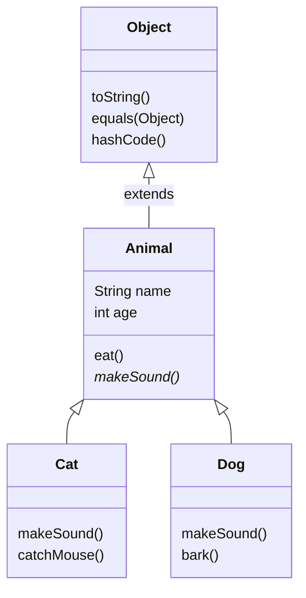
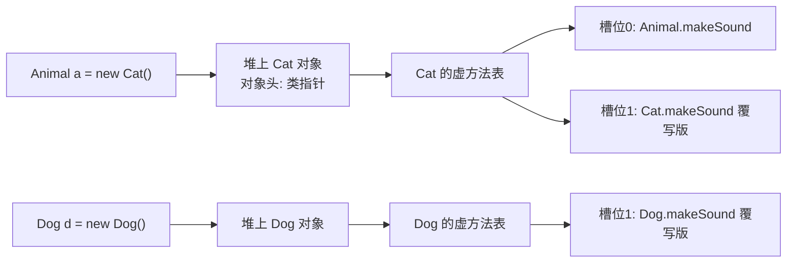

# 14 继承与多态

> 前置知识：[[java/1入门/13_类与对象|13 类与对象]]
> 本章目标：掌握 extends 继承、super、方法重写与 @Override，理解多态的运行机制（动态绑定/虚方法表），学会 instanceof 安全转型，掌握 Object 核心方法重写与四种访问修饰符。你将看到：Java 用单继承+接口把 C++ 多继承的菱形问题从语言层面堵死。

## 概述

继承解决「代码复用 + 建立类型关系」；多态让同一句调用在不同对象上产生不同行为——这正是 C 中函数指针表手工模拟的效果，但 Java 由编译器和 JVM 自动完成。

## extends 单继承

Java 只允许**一个直接父类**（对比 C++ 的多继承），所有没写 extends 的类默认继承 Object：

```java
public class InheritBasic {
    public static void main(String[] args) {
        Dog d = new Dog("旺财", 2, "金毛");
        d.eat();            // 继承自 Animal 的方法，直接可用
        d.bark();           // 子类新增方法
        System.out.println(d.describe());
    }
}

class Animal {
    String name;
    int age;

    Animal(String name, int age) {
        this.name = name;
        this.age = age;
    }

    void eat() {
        System.out.println(name + " 在吃东西");
    }

    String describe() {
        return name + "，" + age + " 岁";
    }
}

class Dog extends Animal {          // 单一直接父类
    String breed;

    Dog(String name, int age, String breed) {
        super(name, age);           // 调用父类构造方法，必须是子类构造第一行
        this.breed = breed;
    }

    void bark() {
        System.out.println(name + " 汪汪叫");
    }
}
```

| 对比项 | C++ | Java |
|--------|-----|------|
| 直接父类数量 | 多个 | **仅一个** |
| 菱形继承问题 | 存在，需虚继承解决 | 语言层面不存在 |
| 默认继承方式 | private（易错） | 无此概念，写法唯一 |
| 析构链 | 手动虚析构 | GC 统一处理 |



## super 与方法重写

子类可以**重写**（override）父类方法，提供自己的实现。`super.method()` 显式调用父类版本：

```java
public class OverrideDemo {
    public static void main(String[] args) {
        Animal a = new Bird();
        a.makeSound();      // 鸟在啾啾叫 —— 调的是子类版本！这就是动态绑定
        new Bird().testSuperCall();
    }
}

class Animal {
    void makeSound() {
        System.out.println("动物发出声音");
    }
}

class Bird extends Animal {
    // 重写父类方法：签名必须一致，访问权限只能放大不能缩小
    @Override               // 注解让编译器帮你检查"确实重写了"，强烈建议永远加上
    void makeSound() {
        System.out.println("鸟在啾啾叫");
    }

    void testSuperCall() {
        super.makeSound();  // 复用父类逻辑 —— 对应 C 里手动调用基函数指针保存的原实现
        this.makeSound();   // 本类版本
    }
}
```

@Override 的价值：如果拼写错误（如写成 `makeSound2`）或参数不匹配，加了注解会**编译报错**而不是悄悄变成一个新方法。

### 重写 vs 重载

两者中文名只差一字，语义完全不同，务必分清：

| 维度 | 重载 Overload | 重写 Override |
|------|--------------|--------------|
| 发生位置 | 同一个类中 | 父子类之间 |
| 参数列表 | **必须不同** | 必须相同 |
| 返回类型 | 可以不同 | 相同或为其子类型 |
| 分派时机 | 编译期静态确定 | 运行期动态绑定 |
| 访问权限 | 无要求 | 子类不能更严格 |
| 异常声明 | 无要求 | 子类不能抛更大受检异常 |
| C 类比 | 无（同名冲突） | 改函数指针表项 |

## 多态：父类引用指向子类对象

```java
public class PolymorphismDemo {
    public static void main(String[] args) {
        // 左边是父类型引用，右边是子类型对象 —— 完全合法且常用
        Animal[] zoo = {
            new Animal("无名"),
            new Cat("咪咪"),
            new Dog("旺财")
        };

        for (Animal a : zoo) {
            a.makeSound();     // 同一行代码，三种输出！
        }
        feedAll(zoo);
    }

    // 关键收益：这个方法不用为每种动物写一遍
    static void feedAll(Animal[] animals) {
        for (Animal a : animals) {
            a.makeSound();     // 运行时按实际对象类型分派
        }
    }
}

class Animal {
    String name;
    Animal(String name) { this.name = name; }
    void makeSound() {
        System.out.println(name + ": ...");
    }
}

class Cat extends Animal {
    Cat(String name) { super(name); }
    @Override
    void makeSound() { System.out.println(name + ": 喵"); }
}

class Dog extends Animal {
    Dog(String name) { super(name); }
    @Override
    void makeSound() { System.out.println(name + ": 汪"); }
}
```

C 里要达到同样效果需要手工搭函数指针表：

```c
/* C 模拟多态：vtable 要自己维护，极易出错 */
struct AnimalVTable {
    void (*make_sound)(void *self);
};
void feed_all(struct Animal **animals, struct AnimalVTable **tables, int n) {
    for (int i = 0; i < n; i++) {
        tables[i]->make_sound(animals[i]);   /* 手工查表 */
    }
}
```

## 动态绑定原理：虚方法表

JVM 为每个类生成一张虚方法表（vtable），表中是该类各虚方法的实际入口地址。对象头部存着指向其类元数据的指针，调用 `a.makeSound()` 时 JVM 两步定位：先通过对象头找到 vtable，再按槽位取地址调用。



要点：

- 子类重写某方法时，只是替换了 vtable 中对应槽位的入口地址，**槽位序号不变**——所以调用处字节码不变，行为却变了
- 这与 C++ vtable 机制本质相同；区别是 C++ 只有 virtual 方法入表，而 Java 实例方法默认都是「虚方法」，无需 virtual 关键字
- static 方法按静态类型分派（不入表）、final 方法可直接内联、private 方法也不参与动态绑定

## final：类、方法与继承的限制

- `final class`：不能被继承（如 String）。对应 C++ 的 `class X final`，防止子类破坏不可变语义
- `final void method()`：不能被重写，但类还能被继承。JVM 可放心内联优化
- `final` 字段/局部变量：只能赋值一次，与 C 的 const 类似

```java
final class SecureConfig {
    // 敏感配置类不希望被"继承后篡改行为"
}

// class Hacker extends SecureConfig { }   // 编译错误

class Base {
    final void template() {
        step1();
        step2();
    }
    private void step1() { System.out.println("固定步骤1"); }
    protected void step2() { System.out.println("可定制步骤2"); }
}
```

## 转型与 instanceof

```java
public class CastDemo {
    public static void main(String[] args) {
        Animal a = new Dog("旺财");       // 向上转型，永远安全，自动进行
        a.makeSound();

        // a.bark();                      // 编译错误！静态类型 Animal 没有该方法
        if (a instanceof Dog) {           // 运行时检查实际类型
            Dog d = (Dog) a;              // 向下转型需显式强转，同 C 的指针转换
            d.bark();                     // 现在可以调 Dog 特有方法了
        }

        // Java 16+ 的模式匹配：判断和转型一步完成，推荐写法
        if (a instanceof Dog d2) {
            d2.bark();
        }

        Animal fish = new Animal("鱼");
        try {
            Cat c = (Cat) fish;           // 实际是 Animal，向下转成 Cat 失败
        } catch (ClassCastException e) {
            System.out.println("转错了: " + e.getMessage());
        }
    }
}
```

| 对比项 | C | Java |
|--------|---|------|
| 指针强转 | 任意转，错了就是未定义行为 | 类型不符抛 ClassCastException |
| 类型检查 | 无运行时信息（RTTI 需自建） | instanceof / getClass 原生支持 |
| 安全性 | 信任程序员 | JVM 兜底 |

原则：**先 instanceof 再转型**；频繁 instanceof 说明设计有问题——应该给父类加方法或用接口。

## Object 通用方法与重写

所有类的最终父类是 Object，其中最常重写的是 toString、equals、hashCode：

```java
import java.util.Objects;

public class ObjectMethods {
    public static void main(String[] args) {
        Money m1 = new Money(100, "CNY");
        Money m2 = new Money(100, "CNY");

        System.out.println(m1);                    // Money{amount=100, currency='CNY'}
        System.out.println(m1.equals(m2));         // true —— 重写后按值比较
        System.out.println(m1 == m2);              // false —— == 永远比引用地址

        // 不重写 equals 的后果：放进 HashMap 后按值查找会找不到！
        java.util.Map<Money, String> map = new java.util.HashMap<>();
        map.put(m1, "一百元");
        System.out.println(map.get(new Money(100, "CNY")));   // 一百元
    }
}

class Money {
    private final long amount;
    private final String currency;

    Money(long amount, String currency) {
        this.amount = amount;
        this.currency = currency;
    }

    @Override
    public String toString() {
        return "Money{amount=" + amount + ", currency='" + currency + "'}";
    }

    @Override
    public boolean equals(Object o) {
        if (this == o) return true;              // 自反快路径
        if (!(o instanceof Money m)) return false;  // 类型检查 + 模式匹配
        return amount == m.amount && Objects.equals(currency, m.currency);
    }

    @Override
    public int hashCode() {
        return Objects.hash(amount, currency);   // equals 相等则 hashCode 必须相等
    }
}
```

三条铁律：

- `==` 比引用是否同一对象；equals 重写后比内容
- **重写 equals 必须同时重写 hashCode**，否则哈希集合行为错乱
- toString 不重写会输出 `Money@1b6d3586` 这种「类名@十六进制地址」

## 组合优于继承

继承是「是一个」（Dog is an Animal）；组合是「有一个」（Car has an Engine）。继承把子类焊死在父类实现细节上，父类一改子类可能全崩；组合只依赖对方暴露的接口，松耦合：

```java
public class CompositionDemo {
    public static void main(String[] args) {
        Car car = new Car(new ElectricEngine());
        car.start();                        // 电机启动: 嗡嗡嗡
        car.swapEngine(new GasEngine());
        car.start();                        // 引擎点火: 轰隆隆
    }
}

interface Engine {
    void ignite();
}

class ElectricEngine implements Engine {
    public void ignite() { System.out.println("电机启动: 嗡嗡嗡"); }
}

class GasEngine implements Engine {
    public void ignite() { System.out.println("引擎点火: 轰隆隆"); }
}

class Car {
    private Engine engine;                  // 组合：持有一个引擎而不是"是一台引擎"

    Car(Engine engine) {
        this.engine = engine;
    }

    void swapEngine(Engine newEngine) {     // 运行时可替换 —— 继承做不到
        this.engine = newEngine;
    }

    void start() {
        engine.ignite();                    // 行为委托给内部对象
    }
}
```

经验法则：只有真正的 is-a 关系且需要多态时才用 extends，否则优先组合。

## 四种访问修饰符总结

| 修饰符 | 同类 | 同包 | 子类 | 任意位置 | C 类比 |
|--------|:----:|:----:|:----:|:----:|--------|
| private | 是 | 否 | 否 | 否 | static 函数限文件内 |
| （默认/包私有） | 是 | 是 | 否 | 否 | 无对应概念 |
| protected | 是 | 是 | 是 | 否 | 无对应概念 |
| public | 是 | 是 | 是 | 是 | extern |

使用建议：字段一律 private；方法对外能力用 public，内部协作默认不写修饰符；protected 仅在明确要被子类扩展的框架代码中使用。

## 本章要点回顾

- 单继承 + 所有类最终继承 Object；super 完成父类构造与方法复用
- 重写发生在父子类间靠动态绑定分派，重载发生在一个类内编译期分派
- 多态 = 父类引用指向子类对象，JVM 经 vtable 按实际类型分派，等价于 C++ virtual 但默认开启
- 向上转型自由，向下转型必须 instanceof 先验证
- 重写 equals 必须连带重写 hashCode；toString 影响日志可读性
- 能用组合就不用继承；四种访问权限按最小可见原则选择

## LeetCode 巩固

- [二叉树的前序遍历](https://leetcode.cn/problems/binary-tree-preorder-traversal/) —— TreeNode 就是典型类层次入口，练习递归遍历
- [对称二叉树](https://leetcode.cn/problems/symmetric-tree/) —— 双参数递归体会方法抽象，理解递归栈帧
- [二叉树的最大深度](https://leetcode.cn/problems/maximum-depth-of-binary-tree/) —— 最小面向对象建模 + 递归返回值设计

---

- 返回目录：[[java/1入门/06_变量与数据类型|06 变量与数据类型]]
- 相关：[[java/1入门/15_接口与抽象类|15 接口与抽象类]]（突破单继承限制的正确姿势）

