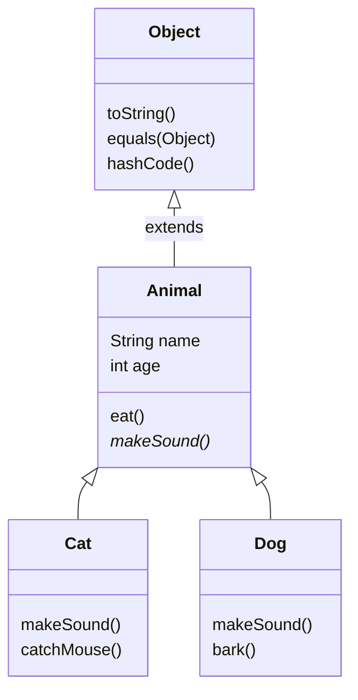
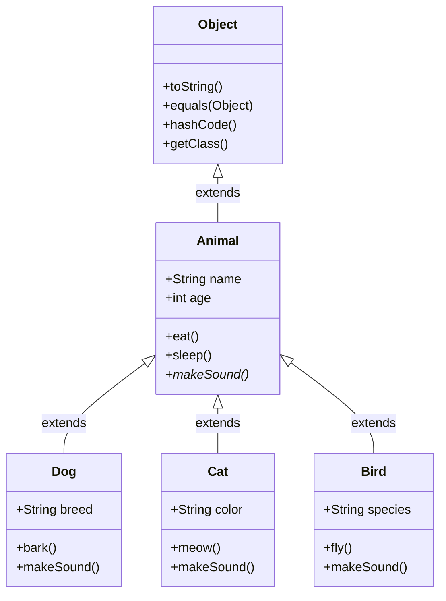
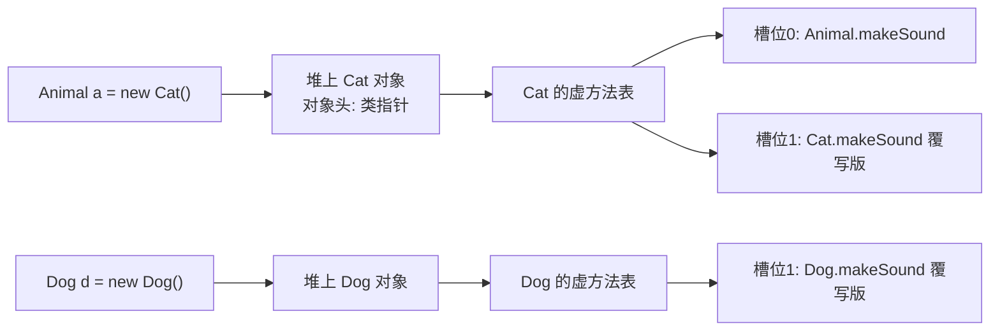

# 14 继承与多态

> 前置知识：[[java/1入门/13_类与对象|13 类与对象]]
> 本章目标：掌握 extends 继承、super、方法重写与 @Override，理解多态的运行机制（动态绑定/虚方法表），学会 instanceof 安全转型，掌握 Object 核心方法重写与四种访问修饰符。你将看到：Java 用单继承+接口把 C++ 多继承的菱形问题从语言层面堵死。

## 概述

继承解决「代码复用 + 建立类型关系」；多态让同一句调用在不同对象上产生不同行为——这正是 C 中函数指针表手工模拟的效果，但 Java 由编译器和 JVM 自动完成。

## extends 单继承

Java 只允许**一个直接父类**（对比 C++ 的多继承），所有没写 extends 的类默认继承 Object：

```java
public class InheritBasic {
    public static void main(String[] args) {
        Dog d = new Dog("旺财", 2, "金毛");
        d.eat();            // 继承自 Animal 的方法，直接可用
        d.bark();           // 子类新增方法
        System.out.println(d.describe());
    }
}

class Animal {
    String name;
    int age;

    Animal(String name, int age) {
        this.name = name;
        this.age = age;
    }

    void eat() {
        System.out.println(name + " 在吃东西");
    }

    String describe() {
        return name + "，" + age + " 岁";
    }
}

class Dog extends Animal {          // 单一直接父类
    String breed;

    Dog(String name, int age, String breed) {
        super(name, age);           // 调用父类构造方法，必须是子类构造第一行
        this.breed = breed;
    }

    void bark() {
        System.out.println(name + " 汪汪叫");
    }
}
```

### 继承关系图

下图展示了典型的继承层次结构：

![[../../assets/java/继承关系.png]]

**图解**：

- **Object 是所有类的根父类**：Java 中每个类都直接或间接继承 Object，所以 `toString()`、`equals()`、`hashCode()` 等方法每个对象都有
- **Employee 是 Salary 的父类**：Employee 定义了 `name`、`address`、`number` 三个字段和 `mailCheck()` 方法；Salary 在此基础上新增了 `salary` 字段和 `computePay()` 方法
- **继承的含义**：子类**自动拥有**父类的所有字段和方法（private 除外，只能通过 getter/setter 访问），子类可以**新增**字段和方法，也可以**重写**父类方法

### 子类继承了什么

| 成员类型 | 父类 private | 父类 public/protected/默认 |
|----------|:------------:|:--------------------------:|
| 字段 | ❌ 不能直接访问 | ✅ 直接继承 |
| 方法 | ❌ 不能直接调用 | ✅ 直接继承（可重写） |
| 构造方法 | ❌ 不能继承 | ❌ 不能继承（但可通过 super 调用） |

```java
class Employee {
    public String name;        // 子类可直接访问
    protected int age;         // 子类可直接访问
    double salary;             // 子类可直接访问（同包）
    private String password;   // 子类不能直接访问！

    public void publicMethod() { }
    protected void protectedMethod() { }
    private void privateMethod() { }
}

class Salary extends Employee {
    void test() {
        name = "张三";         // ✅ public，直接访问
        age = 25;             // ✅ protected，直接访问
        salary = 5000;        // ✅ 默认，同包直接访问
        // password = "xxx";  // ❌ 编译错误！private 成员不可见

        publicMethod();       // ✅
        protectedMethod();    // ✅
        // privateMethod();   // ❌ 编译错误！
    }
}
```

### 构造方法链

子类构造方法**必须**调用父类构造方法（显式或隐式），因为父类字段需要父类构造方法来初始化：

```java
class Animal {
    String name;

    Animal(String name) {           // 父类构造方法
        this.name = name;
        System.out.println("Animal 构造完成");
    }
}

class Dog extends Animal {
    String breed;

    Dog(String name, String breed) {
        super(name);                // 必须第一行调用父类构造
        this.breed = breed;
        System.out.println("Dog 构造完成");
    }
}

// 输出：Animal 构造完成 → Dog 构造完成
// 顺序：先父类，后子类（分层初始化）
```

**为什么必须先调父类构造？** 因为子类可能依赖父类字段。如果不先初始化父类，子类访问 `this.name` 会拿到 null 或 0。

**隐式 super() 的存在**：如果你不写 `super(...)` 也不写 `this(...)`，编译器会自动插入一个无参 `super()` 调用。这就是为什么父类必须有无参构造——否则编译报错。

| 对比项 | C++ | Java |
|--------|-----|------|
| 直接父类数量 | 多个 | **仅一个** |
| 菱形继承问题 | 存在，需虚继承解决 | 语言层面不存在 |
| 默认继承方式 | private（易错） | 无此概念，写法唯一 |
| 析构链 | 手动虚析构 | GC 统一处理 |



## super 与方法重写

子类可以**重写**（override）父类方法，提供自己的实现。`super.method()` 显式调用父类版本：

```java
public class OverrideDemo {
    public static void main(String[] args) {
        Animal a = new Bird();
        a.makeSound();      // 鸟在啾啾叫 —— 调的是子类版本！这就是动态绑定
        new Bird().testSuperCall();
    }
}

class Animal {
    void makeSound() {
        System.out.println("动物发出声音");
    }
}

class Bird extends Animal {
    // 重写父类方法：签名必须一致，访问权限只能放大不能缩小
    @Override               // 注解让编译器帮你检查"确实重写了"，强烈建议永远加上
    void makeSound() {
        System.out.println("鸟在啾啾叫");
    }

    void testSuperCall() {
        super.makeSound();  // 复用父类逻辑 —— 对应 C 里手动调用基函数指针保存的原实现
        this.makeSound();   // 本类版本
    }
}
```

@Override 的价值：如果拼写错误（如写成 `makeSound2`）或参数不匹配，加了注解会**编译报错**而不是悄悄变成一个新方法。

### 重写 vs 重载

两者中文名只差一字，语义完全不同，务必分清：

| 维度 | 重载 Overload | 重写 Override |
|------|--------------|--------------|
| 发生位置 | 同一个类中 | 父子类之间 |
| 参数列表 | **必须不同** | 必须相同 |
| 返回类型 | 可以不同 | 相同或为其子类型 |
| 分派时机 | 编译期静态确定 | 运行期动态绑定 |
| 访问权限 | 无要求 | 子类不能更严格 |
| 异常声明 | 无要求 | 子类不能抛更大受检异常 |
| C 类比 | 无（同名冲突） | 改函数指针表项 |

## 子类与父类的关系详解

理解子类和父类之间的关系是掌握面向对象的关键。以下从多个维度详细解释。

### is-a 关系：继承的本质

继承表达的是 **"是一个"（is-a）** 关系：
- Dog **是一个** Animal ✅
- Cat **是一个** Animal ✅
- Employee **是一个** Object ✅

**判断标准**：如果能说"B 是一种 A"，那么 B 应该继承 A。反之，如果只是"B 有一个 A"，应该用组合而非继承。

```java
// ✅ 正确的 is-a 关系
class Dog extends Animal { }      // Dog 是一种 Animal
class Cat extends Animal { }      // Cat 是一种 Animal

// ❌ 错误的 is-a 关系（应该用组合）
class Engine { }
class Car extends Engine { }      // ❌ Car 不是一种 Engine，Car 有一个 Engine
class Car {
    private Engine engine;        // ✅ 组合：Car 持有一个 Engine
}
```

### 父类引用指向子类对象（向上转型）

```java
Animal a = new Dog("旺财");    // 向上转型：Dog → Animal
a.eat();                       // ✅ 调用继承自 Animal 的方法
a.bark();                      // ❌ 编译错误！静态类型 Animal 没有 bark() 方法
```

**为什么向上转型是安全的？** 因为子类**一定拥有**父类的所有方法（继承保证），所以用父类类型引用子类对象，调用的任何方法都是子类"会的"。

**向上转型的用途**：
1. **方法参数**：`feed(Animal a)` 可以接受任何 Animal 子类
2. **数组/集合**：`Animal[] zoo = {new Dog(), new Cat()}` 存储多种子类
3. **返回类型**：`Animal create(String type)` 返回不同子类

### 向下转型与 instanceof

```java
Animal a = new Dog("旺财");
Dog d = (Dog) a;        // 向下转型：Animal → Dog
d.bark();               // ✅ 现在可以调 Dog 特有方法了

Animal c = new Cat("咪咪");
Dog d2 = (Dog) c;       // ❌ 运行时抛出 ClassCastException！
```

**为什么向下转型不安全？** 因为父类引用可能指向任何子类对象。`Animal a` 可能指向 Dog、Cat 或其他子类，强转成 Dog 不一定对。

**安全做法**：先用 `instanceof` 检查实际类型：

```java
if (a instanceof Dog) {
    Dog d = (Dog) a;    // 安全：确认是 Dog 才转
    d.bark();
}
```

### 多态：同一个方法，不同行为

```java
public class PolymorphismDemo {
    public static void main(String[] args) {
        Animal[] zoo = {
            new Animal("无名"),
            new Cat("咪咪"),
            new Dog("旺财")
        };

        for (Animal a : zoo) {
            a.makeSound();     // 同一行代码，三种输出！
        }
    }
}
// 输出：
// 无名: ...
// 咪咪: 喵
// 旺财: 汪
```

**多态的本质**：运行时根据对象的**实际类型**（而非引用的静态类型）决定调用哪个方法。这是通过虚方法表（vtable）实现的。

### super 关键字的两种用法

| 用法 | 说明 | 示例 |
|------|------|------|
| `super()` | 调用父类**构造方法**（必须在子类构造第一行） | `super(name, age)` |
| `super.method()` | 调用父类**被重写的方法** | `super.makeSound()` |

```java
class Bird extends Animal {
    @Override
    void makeSound() {
        super.makeSound();  // 先执行父类版本
        System.out.println("鸟在啾啾叫");  // 再执行子类版本
    }
}
```

### 字段隐藏（不推荐）

子类可以定义与父类**同名**的字段，但这不是重写，而是**隐藏**（hiding）：

```java
class Parent {
    String name = "Parent";
}

class Child extends Parent {
    String name = "Child";  // 隐藏父类字段，不是重写
}

Parent p = new Child();
System.out.println(p.name);  // 输出 "Parent" —— 用引用的静态类型决定！
```

**为什么字段隐藏不推荐？** 因为字段没有多态行为，容易造成混淆。方法有多态，字段没有——这是一个常见的面试陷阱。

### 构造方法的执行顺序

```java
class Animal {
    Animal() {
        System.out.println("1. Animal 构造");
    }
}

class Dog extends Animal {
    Dog() {
        super();            // 隐式调用，即使不写也会自动插入
        System.out.println("2. Dog 构造");
    }
}

// new Dog() 的输出：
// 1. Animal 构造
// 2. Dog �构造
```

**顺序规则**：
1. 先执行父类构造（初始化父类部分）
2. 再执行子类构造（初始化子类部分）
3. 这个顺序不可颠倒——因为子类可能依赖父类字段

### 完整的继承关系图



**图解**：
- **Object** 是所有类的根父类，提供 toString/equals/hashCode 等通用方法
- **Animal** 是抽象的中间层，定义了 name/age 字段和 eat/sleep/makeSound 方法
- **Dog/Cat/Bird** 是具体子类，各自新增特有字段和方法，并重写 makeSound

## 多态：父类引用指向子类对象

```java
public class PolymorphismDemo {
    public static void main(String[] args) {
        // 左边是父类型引用，右边是子类型对象 —— 完全合法且常用
        Animal[] zoo = {
            new Animal("无名"),
            new Cat("咪咪"),
            new Dog("旺财")
        };

        for (Animal a : zoo) {
            a.makeSound();     // 同一行代码，三种输出！
        }
        feedAll(zoo);
    }

    // 关键收益：这个方法不用为每种动物写一遍
    static void feedAll(Animal[] animals) {
        for (Animal a : animals) {
            a.makeSound();     // 运行时按实际对象类型分派
        }
    }
}

class Animal {
    String name;
    Animal(String name) { this.name = name; }
    void makeSound() {
        System.out.println(name + ": ...");
    }
}

class Cat extends Animal {
    Cat(String name) { super(name); }
    @Override
    void makeSound() { System.out.println(name + ": 喵"); }
}

class Dog extends Animal {
    Dog(String name) { super(name); }
    @Override
    void makeSound() { System.out.println(name + ": 汪"); }
}
```

C 里要达到同样效果需要手工搭函数指针表：

```c
/* C 模拟多态：vtable 要自己维护，极易出错 */
struct AnimalVTable {
    void (*make_sound)(void *self);
};
void feed_all(struct Animal **animals, struct AnimalVTable **tables, int n) {
    for (int i = 0; i < n; i++) {
        tables[i]->make_sound(animals[i]);   /* 手工查表 */
    }
}
```

## 动态绑定原理：虚方法表

JVM 为每个类生成一张虚方法表（vtable），表中是该类各虚方法的实际入口地址。对象头部存着指向其类元数据的指针，调用 `a.makeSound()` 时 JVM 两步定位：先通过对象头找到 vtable，再按槽位取地址调用。



要点：

- 子类重写某方法时，只是替换了 vtable 中对应槽位的入口地址，**槽位序号不变**——所以调用处字节码不变，行为却变了
- 这与 C++ vtable 机制本质相同；区别是 C++ 只有 virtual 方法入表，而 Java 实例方法默认都是「虚方法」，无需 virtual 关键字
- static 方法按静态类型分派（不入表）、final 方法可直接内联、private 方法也不参与动态绑定

## final：类、方法与继承的限制

- `final class`：不能被继承（如 String）。对应 C++ 的 `class X final`，防止子类破坏不可变语义
- `final void method()`：不能被重写，但类还能被继承。JVM 可放心内联优化
- `final` 字段/局部变量：只能赋值一次，与 C 的 const 类似

```java
final class SecureConfig {
    // 敏感配置类不希望被"继承后篡改行为"
}

// class Hacker extends SecureConfig { }   // 编译错误

class Base {
    final void template() {
        step1();
        step2();
    }
    private void step1() { System.out.println("固定步骤1"); }
    protected void step2() { System.out.println("可定制步骤2"); }
}
```

## 转型与 instanceof

```java
public class CastDemo {
    public static void main(String[] args) {
        Animal a = new Dog("旺财");       // 向上转型，永远安全，自动进行
        a.makeSound();

        // a.bark();                      // 编译错误！静态类型 Animal 没有该方法
        if (a instanceof Dog) {           // 运行时检查实际类型
            Dog d = (Dog) a;              // 向下转型需显式强转，同 C 的指针转换
            d.bark();                     // 现在可以调 Dog 特有方法了
        }

        // Java 16+ 的模式匹配：判断和转型一步完成，推荐写法
        if (a instanceof Dog d2) {
            d2.bark();
        }

        Animal fish = new Animal("鱼");
        try {
            Cat c = (Cat) fish;           // 实际是 Animal，向下转成 Cat 失败
        } catch (ClassCastException e) {
            System.out.println("转错了: " + e.getMessage());
        }
    }
}
```

| 对比项 | C | Java |
|--------|---|------|
| 指针强转 | 任意转，错了就是未定义行为 | 类型不符抛 ClassCastException |
| 类型检查 | 无运行时信息（RTTI 需自建） | instanceof / getClass 原生支持 |
| 安全性 | 信任程序员 | JVM 兜底 |

原则：**先 instanceof 再转型**；频繁 instanceof 说明设计有问题——应该给父类加方法或用接口。

## Object 通用方法与重写

所有类的最终父类是 Object，其中最常重写的是 toString、equals、hashCode：

```java
import java.util.Objects;

public class ObjectMethods {
    public static void main(String[] args) {
        Money m1 = new Money(100, "CNY");
        Money m2 = new Money(100, "CNY");

        System.out.println(m1);                    // Money{amount=100, currency='CNY'}
        System.out.println(m1.equals(m2));         // true —— 重写后按值比较
        System.out.println(m1 == m2);              // false —— == 永远比引用地址

        // 不重写 equals 的后果：放进 HashMap 后按值查找会找不到！
        java.util.Map<Money, String> map = new java.util.HashMap<>();
        map.put(m1, "一百元");
        System.out.println(map.get(new Money(100, "CNY")));   // 一百元
    }
}

class Money {
    private final long amount;
    private final String currency;

    Money(long amount, String currency) {
        this.amount = amount;
        this.currency = currency;
    }

    @Override
    public String toString() {
        return "Money{amount=" + amount + ", currency='" + currency + "'}";
    }

    @Override
    public boolean equals(Object o) {
        if (this == o) return true;              // 自反快路径
        if (!(o instanceof Money m)) return false;  // 类型检查 + 模式匹配
        return amount == m.amount && Objects.equals(currency, m.currency);
    }

    @Override
    public int hashCode() {
        return Objects.hash(amount, currency);   // equals 相等则 hashCode 必须相等
    }
}
```

三条铁律：

- `==` 比引用是否同一对象；equals 重写后比内容
- **重写 equals 必须同时重写 hashCode**，否则哈希集合行为错乱
- toString 不重写会输出 `Money@1b6d3586` 这种「类名@十六进制地址」

## 组合优于继承

继承是「是一个」（Dog is an Animal）；组合是「有一个」（Car has an Engine）。继承把子类焊死在父类实现细节上，父类一改子类可能全崩；组合只依赖对方暴露的接口，松耦合：

```java
public class CompositionDemo {
    public static void main(String[] args) {
        Car car = new Car(new ElectricEngine());
        car.start();                        // 电机启动: 嗡嗡嗡
        car.swapEngine(new GasEngine());
        car.start();                        // 引擎点火: 轰隆隆
    }
}

interface Engine {
    void ignite();
}

class ElectricEngine implements Engine {
    public void ignite() { System.out.println("电机启动: 嗡嗡嗡"); }
}

class GasEngine implements Engine {
    public void ignite() { System.out.println("引擎点火: 轰隆隆"); }
}

class Car {
    private Engine engine;                  // 组合：持有一个引擎而不是"是一台引擎"

    Car(Engine engine) {
        this.engine = engine;
    }

    void swapEngine(Engine newEngine) {     // 运行时可替换 —— 继承做不到
        this.engine = newEngine;
    }

    void start() {
        engine.ignite();                    // 行为委托给内部对象
    }
}
```

经验法则：只有真正的 is-a 关系且需要多态时才用 extends，否则优先组合。

## 四种访问修饰符总结

| 修饰符 | 同类 | 同包 | 子类 | 任意位置 | C 类比 |
|--------|:----:|:----:|:----:|:----:|--------|
| private | 是 | 否 | 否 | 否 | static 函数限文件内 |
| （默认/包私有） | 是 | 是 | 否 | 否 | 无对应概念 |
| protected | 是 | 是 | 是 | 否 | 无对应概念 |
| public | 是 | 是 | 是 | 是 | extern |

使用建议：字段一律 private；方法对外能力用 public，内部协作默认不写修饰符；protected 仅在明确要被子类扩展的框架代码中使用。

---

## 深入：方法分派机制与多态的 JVM 实现

### 方法分派的完整路径

当 JVM 执行 `a.makeSound()` 时，底层发生了什么？

```
字节码: invokevirtual #xx   // 指向常量池中的方法符号引用
  ↓
1. 从 a 引用指向的堆对象头部，通过 Klass Pointer 找到方法区的类元数据
2. 在类元数据中查找虚方法表 (vtable)
3. 按方法的 vtable 槽位索引（编译期已确定）取到实际方法入口地址
4. 跳转执行
```

**为什么是 invokevirtual 而不是 invokestatic？** 因为 `makeSound()` 是实例方法，需要在运行时根据实际类型分派。字节码指令的选择在编译期就确定了——`a` 的静态类型是 `Animal`，Animal 有 makeSound 方法，所以用 invokevirtual。

**非虚方法的优化路径。** static 方法用 invokestatic（编译期直接绑定目标地址）、private 方法用 invokespecial（明确不需要查 vtable）、final 方法虽然用 invokevirtual 但 JVM 可以在 JIT 时内联——因为 final 方法不可能被重写，目标地址编译期已知。

### 为什么 Java 的实例方法默认是"虚"的

C++ 中，非 virtual 方法编译期静态绑定，virtual 方法才走 vtable。Java 没有 virtual 关键字修饰普通方法，所有实例方法默认都是虚分派。

**原因：简化语言设计。** Java 诞生时的目标是"比 C++ 更简单"。C++ 程序员最常见的 bug 之一是忘记加 virtual 导致多态失效——`Base* p = new Derived(); p->method()` 调的却是 Base 的版本。Java 通过默认全虚消除了这个陷阱。代价是 vtable 更大（所有实例方法都要入表），但 JVM 的 JIT 编译器（C2）会在运行时做去虚拟化（devirtualization）：如果实际类型与静态类型一致（比如 `new Dog()` 直接赋值给 `Dog d`），JIT 能识别到没有其他子类重写该方法，直接内联为直接调用，性能几乎等同 C++ 静态绑定。

### instanceof 模式匹配（Java 16+）

```java
// 传统写法
if (a instanceof Dog) {
    Dog d = (Dog) a;       // 重复的类型信息
    d.bark();
}

// Java 16+ 模式匹配
if (a instanceof Dog d) {
    d.bark();              // d 已经是 Dog 类型，无需强转
}
```

**为什么这是语言进步？** 传统 instanceof + 强转有两个问题：一是**类型信息冗余**（写了两次 Dog），二是**容易遗漏检查**（有人直接 `(Dog) a` 不做 instanceof 就强转）。模式匹配让「判断 + 绑定」原子化，编译器保证 d 只在 if 块内可见，不可能在未判断时使用。

更强大的用法——**模式匹配配合逻辑运算符**：

```java
// Java 16+: 模式变量在 && 后的 scope 内可用
if (a instanceof Dog d && d.isGoodBoy()) {
    System.out.println(d.getName());   // d 在两个条件里都可用
}

// 但 || 不行——两个分支是互斥的，编译器无法确定 d 是否已绑定
// if (a instanceof Dog d || a instanceof Cat c) { ... }  // 编译错误
```

### 协变返回类型

```java
class Builder {
    Builder withName(String name) { /* ... */ return this; }
}

class UserBuilder extends Builder {
    @Override
    UserBuilder withName(String name) {  // 返回类型是 UserBuilder 而非 Builder
        /* ... */
        return this;
    }
}
```

Java 5 起允许重写方法的返回类型是被重写方法返回类型的子类（协变返回）。这在**链式调用**中极为实用：`userBuilder.withName("张三").withAge(20)` 直接返回 `UserBuilder` 类型，不需要额外强转。

**为什么 C++ 也支持协变返回？** 因为从类型理论上看，子类方法返回更具体的类型是类型安全的——调用方期望 Builder，实际得到 UserBuilder（子类型），里氏替换原则成立。JVM 在字节码层面怎么处理？实际上编译器会生成一个桥方法：`Builder withName(String)` 返回 Builder 内部强转为 UserBuilder 再返回，确保多态调用签名一致。

### 为什么 Java 不支持多继承

```java
// 假设 Java 支持多继承（实际禁止）
class A {
    void hello() { System.out.println("A"); }
}
class B {
    void hello() { System.out.println("B"); }
}
// class C extends A, B { }   // 如果允许，C.hello() 调谁的？——菱形问题
```

**菱形问题的本质：** C++ 用虚继承解决，但虚继承引入了虚基类指针、构造顺序不确定性等复杂性。Java 的设计哲学是**宁可牺牲表达力也要消除歧义**。

**单继承 + 接口的组合为什么更好？** 接口只能声明方法签名（Java 8 前），不能提供实例字段或方法实现，所以不存在状态冲突。即使 Java 8 引入了 default 方法，接口也要求如果两个 default 方法签名冲突，子类**必须显式重写**解决歧义——编译器不会替你选。

```java
interface Flyable {
    default void move() { System.out.println("飞行"); }
}

interface Swimmable {
    default void move() { System.out.println("游泳"); }
}

class Duck implements Flyable, Swimmable {
    @Override
    public void move() {
        Flyable.super.move();   // 显式选择，编译器强制你做决定
    }
}
```

**工程收益：** 单继承让 Java 的类层次是严格的树状结构（每个类只有一个父类），vtable 只需一份线性数组。多继承会让 vtable 变成有向图（需要解决菱形路径），JIT 的去虚拟化和内联优化都会大幅变复杂。

---

## 本章要点回顾

- 单继承 + 所有类最终继承 Object；super 完成父类构造与方法复用
- 重写发生在父子类间靠动态绑定分派，重载发生在一个类内编译期分派
- 多态 = 父类引用指向子类对象，JVM 经 vtable 按实际类型分派，等价于 C++ virtual 但默认开启
- 向上转型自由，向下转型必须 instanceof 先验证
- 重写 equals 必须连带重写 hashCode；toString 影响日志可读性
- 能用组合就不用继承；四种访问权限按最小可见原则选择
- Java 默认全虚方法是安全设计，JIT 去虚拟化弥补性能
- 单继承 + 接口消除了菱形问题，让类层次保持树状，JIT 优化更高效

---

- 返回目录：[[java/1入门/06_变量与数据类型|06 变量与数据类型]]
- 相关：[[java/1入门/15_接口与抽象类|15 接口与抽象类]]（突破单继承限制的正确姿势）

---

## 练习

| 题号 | 题目 | 链接 | 知识点 |
|------|------|------|--------|
| P1022 | 计算器的改良 | https://www.luogu.com.cn/problem/P1022 | 继承、多态 |
