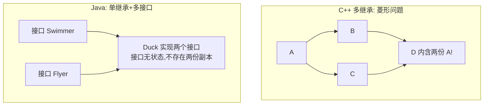
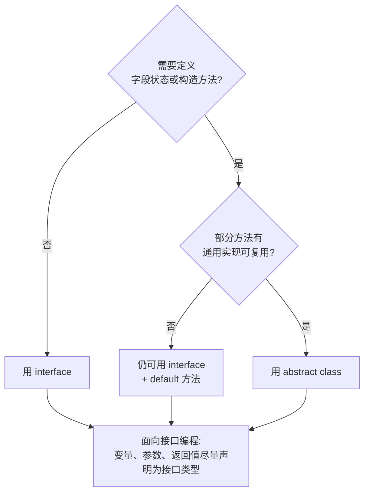

# 15 接口与抽象类

> 前置知识：[[java/1入门/14_继承与多态|14 继承与多态]]
> 本章目标：掌握 abstract 抽象类、interface 接口、多实现如何解决菱形问题，学会 Comparable/Comparator 排序、函数式接口与 Lambda 初步，理解增强 for 底层的 Iterable/Iterator 协议，建立「面向接口编程」的思维。

## 概述

继承只能有一个父类，但「能力」往往需要多个：一个类既要能比较又要能序列化还能被遍历。Java 的答案是**接口**——只声明「会做什么」，不关心「是什么」。这对应 C 中「约定一组函数指针签名」的协议思想，但由编译器强制检查。

## 抽象类 abstract

抽象类是「不完整的类」：可以包含抽象方法（只有声明没有实现），不能被实例化。对应 C++ 的纯虚函数：

```java
public class AbstractDemo {
    public static void main(String[] args) {
        // Shape s = new Shape();      // 编译错误！抽象类不能实例化
        Shape c = new Circle(2);
        Shape r = new Rect(3, 4);
        System.out.printf("圆面积 %.2f%n", c.area());     // 12.57
        System.out.printf("矩形面积 %.2f%n", r.area());   // 12.00
    }
}

abstract class Shape {              // 抽象类
    String name;

    Shape(String name) {            // 可以有构造方法和字段——供子类 super 调用
        this.name = name;
    }

    abstract double area();         // 抽象方法：只有签名，分号结尾，无方法体

    void describe() {               // 也可以有普通方法（与纯接口的区别）
        System.out.println(name + " 面积 = " + area());
    }
}

class Circle extends Shape {
    double radius;

    Circle(double radius) {
        super("圆");
        this.radius = radius;
    }

    @Override
    double area() {
        return Math.PI * radius * radius;
    }
}

class Rect extends Shape {
    double w, h;

    Rect(double w, double h) {
        super("矩形");
        this.w = w;
        this.h = h;
    }

    @Override
    double area() {
        return w * h;
    }
}
```

| 对比项 | C++ | Java |
|--------|-----|------|
| 纯虚函数 | `virtual double area() = 0;` | `abstract double area();` |
| 含纯虚函数的类 | 自动成为抽象类 | 必须显式写 abstract |
| 抽象类能否有数据成员和实现 | 能 | 同样能 |
| 是否可有构造方法 | 有（供派生链调用） | 有 |

## interface 全解

接口比抽象类更纯粹：默认所有方法 public abstract，所有字段 public static final。**一个类可以实现多个接口**——这正是突破单继承限制的方式：

```java
public class InterfaceDemo {
    public static void main(String[] args) {
        Duck d = new Duck();
        d.fly();
        d.swim();
        d.breathe();

        // 接口也是类型：可以声明接口变量指向实现对象
        Flyer f = d;       // 向上转型为接口类型
        f.fly();
    }
}

// 一个类可实现多个接口，用逗号分隔 —— C++ 多继承做不到的安全版本
class Duck implements Flyer, Swimmer, Animal {
    public void fly()    { System.out.println("鸭子扑棱着飞"); }
    public void swim()   { System.out.println("鸭子划水游"); }
    public void breathe(){ System.out.println("鸭子用肺呼吸"); }
}

interface Flyer {
    void fly();                        // 默认就是 public abstract
}

interface Swimmer {
    void swim();
}

interface Animal {
    void breathe();

    int LUNGS = 2;                     // 字段自动是 public static final 常量
    // private int x;                  // 普通实例字段不允许！接口没有状态
}
```

### 多实现解决菱形问题

C++ 多继承的经典灾难：D 同时继承 B 和 C，而 B、C 都继承 A，导致 D 里有两份 A（需 virtual 继承补救）。Java 用「单继承 + 多接口」从结构上杜绝了这个问题：



即使两个接口有同名 default 方法，Java 也强制你在实现类中重写来解决冲突：

```java
interface A {
    default String hello() { return "A"; }
}

interface B {
    default String hello() { return "B"; }
}

// 实现 A 和 B 却不重写 hello() 会编译错误：
// class AB implements A, B { }          // 错误！必须解决冲突
class AB implements A, B {
    @Override
    public String hello() {               // 显式重写消歧义
        return "AB 合成: " + A.super.hello() + B.super.hello();
    }
}
```

## default 默认方法

Java 8 起接口可以有带实现的 default 方法。动机：给已有接口加新方法时不破坏千千万万的旧实现类（Collection 接口新增 stream() 就是靠这个）：

```java
public class DefaultMethodDemo {
    public static void main(String[] args) {
        new LegacyPrinter().print("hello");
        new FancyPrinter().print("hello");
    }
}

interface Printable {
    void print(String msg);                       // 抽象方法，实现类必须写

    default void printTwice(String msg) {         // 默认方法带实现
        print(msg);
        print(msg);
    }
}

// 只实现了抽象方法，免费获得 printTwice
class LegacyPrinter implements Printable {
    public void print(String msg) { System.out.println("[旧] " + msg); }
}

// 也可以覆盖默认方法
class FancyPrinter implements Printable {
    public void print(String msg) { System.out.println("[新] >> " + msg); }

    @Override
    public void printTwice(String msg) {
        System.out.println("[新] 双倍输出:");
        Printable.super.printTwice(msg);          // 复用接口默认实现
    }
}
```

## 函数式接口与 Lambda 初步

只有一个抽象方法的接口叫**函数式接口**，可以用 Lambda 表达式实现——这是 Java 对「函数是一等公民」的妥协版支持，类似 C 的函数指针但类型安全：

```java
import java.util.Arrays;
import java.util.List;

@FunctionalInterface                 // 注解强制检查"只有一个抽象方法"
interface IntOperation {
    int apply(int a, int b);

    // int extra();                  // 再加一个就不再是函数式接口，注解报错
}

public class LambdaDemo {
    public static void main(String[] args) {
        // 匿名内部类写法（Lambda 之前的传统方式）
        IntOperation addOld = new IntOperation() {
            public int apply(int a, int b) { return a + b; }
        };

        // Lambda 写法：(参数) -> 表达式，参数类型可推断时省略
        IntOperation add    = (a, b) -> a + b;
        IntOperation mul    = (a, b) -> a * b;
        IntOperation max    = Integer::max;      // 方法引用：直接复用现成静态方法

        System.out.println(add.apply(3, 4));     // 7
        System.out.println(mul.apply(3, 4));     // 12
        System.out.println(max.apply(3, 4));     // 4
        System.out.println(addOld.apply(1, 2));  // 3

        // JDK 自带四大函数式接口（java.util.function 包）：
        java.util.function.Predicate<String> isEmpty = String::isEmpty;
        java.util.function.Function<String, Integer> len = String::length;
        java.util.function.Supplier<List<String>> maker = java.util.ArrayList::new;
        java.util.function.Consumer<String> printer = System.out::println;
        printer.accept("长度=" + len.apply("hello") + " 空?" + isEmpty.test(""));
        printer.accept("新建列表大小=" + maker.get().size());
    }
}
```

## Comparator 排序实战：自然序与定制序

接口最经典的实战场景是排序。Comparable 定义「自然顺序」（类自己实现），Comparator 定义「外部定制顺序」（调用方按需传入）：

```java
import java.util.ArrayList;
import java.util.Arrays;
import java.util.Comparator;
import java.util.List;

public class SortDemo {
    public static void main(String[] args) {
        List<Student> list = new ArrayList<>(Arrays.asList(
            new Student("张三", 88),
            new Student("李四", 95),
            new Student("王五", 72),
            new Student("赵六", 88)
        ));

        // 自然序：按成绩（Student 实现了 Comparable）
        list.sort(null);
        System.out.println("自然序(分数): " + list);

        // 定制序一：按姓名排序，Lambda 实现 Comparator
        Comparator<Student> byName = (s1, s2) -> s1.name.compareTo(s2.name);
        list.sort(byName);
        System.out.println("按姓名: " + list);

        // 定制序二：Comparator.comparing 链式组合 + thenComparing 多级排序
        list.sort(
            Comparator.comparingInt((Student s) -> -s.score)   // 分数降序
                      .thenComparing(s -> s.name)              // 同分按姓名
        );
        System.out.println("多级排序: " + list);

        // 数组同样适用
        int[] nums = {5, 3, 9, 1};
        Arrays.sort(nums);
        System.out.println(Arrays.toString(nums));
    }
}

class Student implements Comparable<Student> {
    String name;
    int score;

    Student(String name, int score) {
        this.name = name;
        this.score = score;
    }

    @Override
    public int compareTo(Student other) {
        // 约定：负数表示 this 排前面，正数排后面，0 相等
        return Integer.compare(this.score, other.score);   // 升序
    }

    @Override
    public String toString() {
        return name + "(" + score + ")";
    }
}
```

C 里对应 qsort 的比较函数指针——但 qsort 没有类型检查（void* 强转错类型即灾难），Java 的泛型 Comparator 编译期就能查出来。

| 对比项 | C qsort | Java sort |
|--------|---------|-----------|
| 比较逻辑 | 函数指针 `int (*)(const void*, const void*)` | Comparable/Comparator |
| 类型安全 | 无，void* 全靠自觉 | 泛型编译期保证 |
| 稳定性 | 标准未规定 | 对象排序保证稳定 |

## Iterable 与 Iterator：增强 for 的底层协议

任何实现了 `Iterable<E>` 的对象都能用增强 for 遍历——编译器把它脱糖成 iterator() 调用加 while 循环。理解这个协议就理解了集合框架的统一入口：

```java
import java.util.Iterator;
import java.util.NoSuchElementException;

public class IterableDemo {
    public static void main(String[] args) {
        Countdown c = new Countdown(5);
        for (int n : c) {                 // 自定义类也能被增强 for 遍历！
            System.out.print(n + " ");    // 5 4 3 2 1
        }
        System.out.println();

        // 增强for的等价底层形式：
        Iterator<Integer> it = c.iterator();
        while (it.hasNext()) {
            System.out.print(it.next() + " ");
        }
        System.out.println();

        // 手动迭代时若要删除元素，必须用 iterator.remove()
        // 否则抛 ConcurrentModificationException（fail-fast 机制）
    }
}

// 实现Iterable<Integer>表示"我能产生一个Integer迭代器"
class Countdown implements Iterable<Integer> {
    private final int from;

    Countdown(int from) {
        this.from = from;
    }

    @Override
    public Iterator<Integer> iterator() {
        return new Iterator<>() {         // 匿名内部类实现迭代器
            private int current = from;

            public boolean hasNext() {
                return current > 0;       // 还有元素吗
            }

            public Integer next() {
                if (current <= 0) {
                    throw new NoSuchElementException();
                }
                return current--;         // 返回当前并前进
            }
        };
    }
}
```

C 里遍历容器靠 `for (p = head; p; p = p->next)` 手工推进指针；Iterator 把这套指针操作封装成了标准协议。

## 标记接口

不含任何方法的接口，仅用于给类「贴标签」，运行期可用 instanceof 检测：

```java
// JDK 经典标记接口
// java.io.Serializable —— 允许被序列化
// java.lang.Cloneable  —— 允许被克隆
// java.util.RandomAccess —— 支持 O(1) 随机访问

public class MarkerDemo {
    public static void main(String[] args) {
        Object doc = new ExportableDoc();
        if (doc instanceof java.io.Serializable) {   // 检测标签
            System.out.println("该对象可序列化");
        }
    }
}

interface Auditable { }                    // 自定义空标记接口

class ExportableDoc implements Auditable { }
```

现代替代方案是注解（见 [[java/2深入/02_注解与反射|注解与反射]]），但标准库中标记接口仍大量存在。

## 接口 vs 抽象类：如何选择



| 维度 | 抽象类 | 接口 |
|------|--------|------|
| 关系语义 | is-a（是什么） | can-do（能做什么） |
| 数量限制 | 只能继承一个 | 可实现多个 |
| 字段 | 任意 | 只能常量 |
| 构造方法 | 有 | 无 |
| 方法实现 | 都可以 | abstract/default/static |
| 典型例子 | AbstractList | List, Comparable, Runnable |

经验法则：「模板复用骨架代码」用抽象类（如 AbstractList 已实现 size/isEmpty 等）；「声明能力契约」用接口。两者也常配合：接口定契约 + 抽象类做骨架实现。

## 本章要点回顾

- 抽象类是不完整的父类（对标 C++ 纯虚函数），接口是纯能力契约
- 单继承 + 多实现从语言层面消除了 C++ 菱形继承问题；default 方法冲突必须显式重写
- 接口字段天然 public static final；default 方法让接口可以平滑演进
- 函数式接口 + Lambda 是类型安全的函数指针；四大内置接口 Predicate/Function/Supplier/Consumer 覆盖绝大多数场景
- Comparable 自然序、Comparator 定制序，比 qsort 的函数指针安全得多
- 增强 for 的本质是 Iterable.iterator() 协议；标记接口给类贴运行期标签
- 面向接口编程：依赖抽象而非具体实现

## LeetCode 巩固

- [用队列实现栈](https://leetcode.cn/problems/implement-stack-using-queues/) —— 用 Deque 接口引用持有实现类，体会面向接口编程
- [LRU 缓存](https://leetcode.cn/problems/lru-cache/) —— 综合运用 LinkedHashMap 或手写双向链表 + 哈希的设计题
- [数组序号转换](https://leetcode.cn/problems/rank-transform-of-an-array/) —— 排序后映射下标，练习 Comparator 定制序实战

---

- 返回目录：[[java/1入门/06_变量与数据类型|06 变量与数据类型]]
- 相关：[[java/1入门/14_继承与多态|14 继承与多态]]（多态机制是接口分派的底层支撑）

