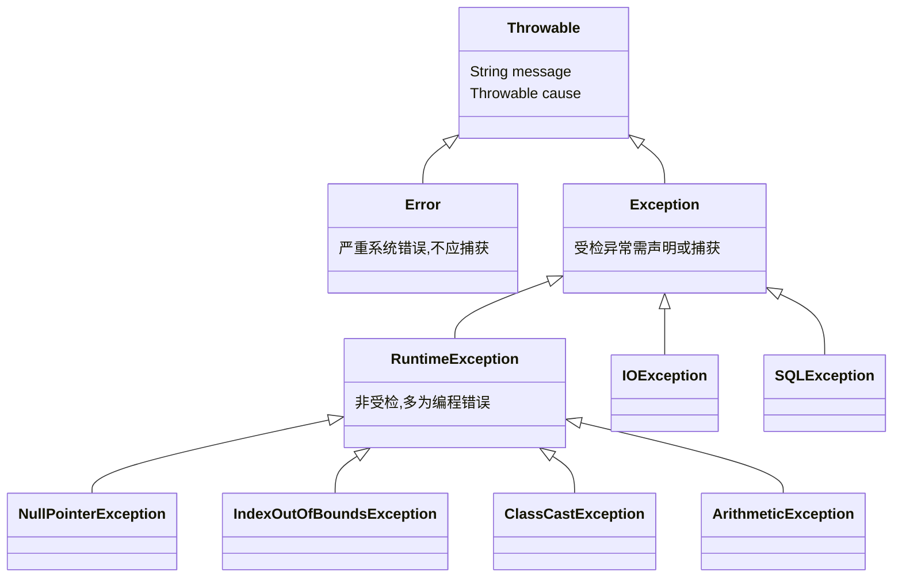

# 16 异常处理

> 前置知识：[[java/1入门/13_类与对象|13 类与对象]]
> 本章目标：掌握 try-catch-finally、受检与非受检异常这一 Java 独有概念、throws 声明与 throw 抛出、自定义异常、try-with-resources 自动资源管理、异常链与最佳实践。你将看到：异常机制把 C 里「每个函数调用点都要检查返回码」的负担交给了语言。

## 概述

C 处理错误的主流方式是返回码 + errno，调用方**必须记得检查**，漏查就带病运行；C++ 有异常但很多团队禁用。Java 则把异常作为语言级强制机制：错误沿调用栈自动向上传播（无需层层 if 判断），受检异常还强制调用方处理或声明。先看全景：



- **Error**：JVM 级严重问题（OutOfMemoryError、StackOverflowError），程序不应尝试捕获
- **RuntimeException 及其子类（非受检）**：编程错误（空指针、越界），编译器不强制处理
- **其他 Exception（受检）**：外部条件失败（文件不存在、网络断开），编译器**强制**你 catch 或 throws

## try-catch-finally

```java
public class TryCatchDemo {
    public static void main(String[] args) {
        int[] arr = {1, 2, 3};

        // 多个 catch 从小到大排列，子类异常放前面
        try {
            System.out.println(arr[5]);            // 会抛越界
            int r = 10 / 0;                        // 这行不会执行到
        } catch (ArrayIndexOutOfBoundsException e) {
            System.out.println("越界: " + e.getMessage());   // 越界: Index 5 out of bounds...
        } catch (ArithmeticException e) {
            System.out.println("算术错误: " + e.getMessage());
        } catch (Exception e) {                    // 兜底捕获，必须放最后
            System.out.println("未知异常: " + e);
        }

        // finally 无论是否抛异常都会执行 —— 对应 C 的 goto cleanup 模式
        try {
            returnFromTry();
        } finally {
            System.out.println("finally 总会执行");
        }
    }

    static void returnFromTry() {
        try {
            System.out.println("try 内 return");
            return;                                // 即使 return，finally 仍先执行
        } finally {
            System.out.println("return 前先执行 finally");
        }
    }
}
```

### finally 含 return 的坑

finally 中写 return 会**吞掉异常并覆盖正常返回值**，这是著名反模式：

```java
public class FinallyTrap {
    @SuppressWarnings("finally")
    static int bad() {
        try {
            int x = 1 / 0;              // ArithmeticException
            return 1;
        } finally {
            return -1;                  // 异常被无声吞掉！调用方完全不知道出错
        }
    }

    static int good() {
        try {
            int x = 1 / 0;
            return 1;
        } finally {
            System.out.println("清理工作");   // finally 只做清理，不碰返回值
        }
        // 异常正常向上传播，调用方能感知错误
    }

    public static void main(String[] args) {
        System.out.println(bad());      // -1 —— 异常凭空消失
        good();                         // 清理后异常照常抛出
    }
}
```

规则：finally 只做资源释放类收尾；现代 Java 更推荐直接用 try-with-resources，多数场景连 finally 都不用写。

## 受检 vs 非受检异常

这是 C/C++ 完全不存在的概念：

| 维度 | 受检异常（checked） | 非受检异常（unchecked） |
|------|--------------------|-----------------------|
| 继承自 | Exception（不含 RuntimeException） | RuntimeException / Error |
| 编译器强制 | 必须 catch 或 throws，否则编译不过 | 不强制 |
| 表达含义 | 可预期的外部故障，应恢复 | 编程缺陷或致命错误 |
| 典型代表 | IOException、SQLException、ClassNotFoundException | NPE、越界、IllegalArgument |
| C 类比 | 无对应物（最接近「必须检查的 errno」） | 无对应物 |

设计哲学：受检异常把「这个调用可能失败」写进方法签名，编译器逐个检查调用链——代价是代码啰嗦和「为应付编译器而吞异常」的滥用，因此新式框架多偏爱非受检异常。

## throws 声明与 throw 抛出

throw 抛出一个异常对象；throws 在方法签名上声明可能抛出的受检异常：

```java
public class ThrowDemo {
    public static void main(String[] args) {
        try {
            setAge(-5);                        // 调用方必须面对这个受检异常
        } catch (IllegalArgumentException e) { // 它是非受检的,catch 只是选择处理
            System.out.println("捕获: " + e.getMessage());
        }

        try {
            loadConfig("app.conf");            // 受检异常,这里必须 catch
        } catch (java.io.IOException e) {
            System.out.println("配置加载失败: " + e.getMessage());
        }
    }

    static void setAge(int age) {
        if (age < 0 || age > 150) {
            // throw 抛出异常对象，立即中断当前流程
            throw new IllegalArgumentException("年龄非法: " + age);
        }
        System.out.println("年龄设置为 " + age);
    }

    // throws 把受检异常"上报"给调用方处理 —— 类似 errno 但写进了签名
    static String loadConfig(String path) throws java.io.IOException {
        java.nio.file.Path p = java.nio.file.Path.of(path);
        if (!java.nio.file.Files.exists(p)) {
            throw new java.io.FileNotFoundException(path + " 不存在");
        }
        return java.nio.file.Files.readString(p);
    }
}
```

## 自定义异常

业务代码通常定义自己的异常层次，继承 Exception 得到受检、继承 RuntimeException 得到非受检：

```java
public class CustomException {
    public static void main(String[] args) {
        try {
            withdraw(1000, 5000);
        } catch (InsufficientBalanceException e) {
            System.out.println("业务失败: " + e.getMessage());
            System.out.println("缺口金额: " + e.getShortage());   // 携带业务数据
            e.printStackTrace();
        }
    }

    static void withdraw(long account, double amount) throws InsufficientBalanceException {
        double balance = 3000;
        if (amount > balance) {
            // 自定义异常可以携带结构化的业务信息,比裸返回码表达力强得多
            throw new InsufficientBalanceException(
                "账户 " + account + " 余额不足", amount - balance);
        }
    }
}

// 受检:调用方被强制考虑"余额不足"这一正常业务分支
class InsufficientBalanceException extends Exception {
    private final double shortage;

    public InsufficientBalanceException(String message, double shortage) {
        super(message);
        this.shortage = shortage;
    }

    public double getShortage() {
        return shortage;
    }
}
```

## 异常链 cause

底层异常往往需要包装成更高层语义再抛出，同时保留原始现场：

```java
import java.sql.SQLException;

public class ChainDemo {
    public static void main(String[] args) {
        try {
            service();
        } catch (ServiceException e) {
            System.out.println("顶层看到: " + e.getMessage());
            Throwable root = e.getCause();                 // 追溯原始原因
            System.out.println("根因是: " + root);
        }
    }

    static void service() throws ServiceException {
        try {
            dao();
        } catch (SQLException e) {
            // 把底层技术细节包装成业务语义,cause 保留完整因果链
            throw new ServiceException("用户数据加载失败", e);
        }
    }

    static void dao() throws SQLException {
        throw new SQLException("connection reset");
    }
}

class ServiceException extends Exception {
    public ServiceException(String message, Throwable cause) {
        super(message, cause);          // 关键：把原异常挂到 cause 上
    }
}
```

C 的 errno 是全局变量，多层调用会互相覆盖；Java 异常链把每层上下文完整串成链表，打印堆栈时全部可见。

## try-with-resources 自动关资源

C 忘记 fclose 导致文件句柄泄漏是最常见的资源 bug。Java 7 起用 try-with-resources 让编译器自动生成关闭逻辑，任何实现 AutoCloseable 的对象都适用：

```java
import java.io.BufferedReader;
import java.io.FileReader;
import java.io.IOException;

public class TryWithResources {
    public static void main(String[] args) {
        String firstLine = readFirstLine("data.txt");
        System.out.println(firstLine != null ? firstLine : "文件为空或不存在");

        // 多个资源分号分隔,关闭顺序与声明相反(后开的先关)
        try (var in = new java.io.ByteArrayInputStream(new byte[]{1, 2});
             var out = new java.io.ByteArrayOutputStream()) {
            out.transferTo(out);
        } catch (IOException e) {
            e.printStackTrace();
        }
    }

    static String readFirstLine(String path) {
        // 括号内声明的资源在 try 结束时自动 close() —— 无论正常结束还是抛异常
        // 等价于 C 中精心编写的 goto cleanup / 双 fclose 防御代码
        try (BufferedReader reader = new BufferedReader(new FileReader(path))) {
            return reader.readLine();
        } catch (IOException e) {
            System.out.println("读取失败: " + e.getMessage());
            return null;
        }
        // 不需要 finally { reader.close(); } 编译器已代劳
    }
}
```

| 对比项 | C | Java try-with-resources |
|--------|---|------------------------|
| 打开 | fopen | new 资源对象 |
| 关闭 | 手动 fclose，漏写即泄漏 | 自动 close() |
| 异常路径 | goto cleanup 或层层 if | 语言机制保证执行 |
| 多资源 | 每个都要手动管理且注意顺序 | 声明即托管，逆序自动关闭 |

## 常见异常速查表

| 异常 | 触发场景 | C 类比 |
|------|---------|--------|
| NullPointerException | 对 null 引用调方法/访问字段 | 解引用空指针（段错误） |
| ArrayIndexOutOfBoundsException | 数组下标越界 | 未定义行为（可能踩内存） |
| ClassCastException | 向下转型类型不符 | 错误强转（静默出错） |
| ArithmeticException | 整数除零 | 浮点除零得 inf，整数除零未定义 |
| NumberFormatException | parseXxx 解析失败字符串 | atoi 无错误报告，返回 0 无法区分 |
| IllegalArgumentException | 参数不合法 | 手写 if 校验后自行约定 |
| IllegalStateException | 对象状态不支持该操作 | 状态机手工检查 |
| FileNotFoundException | 文件不存在 | fopen 返回 NULL + errno |

规律：凡是「C 里未定义行为或静默失败」的场景，Java 都给出了具名异常——这是安全性差距的直接体现。

## 最佳实践

```java
public class BestPractice {
    // 反例一：吞异常 —— 出错后程序带着错误状态继续跑,最难排查的 bug 来源
    static void bad1() {
        try {
            doWork();
        } catch (Exception e) {
            // 空着什么都不做 —— 绝对禁止
        }
    }

    // 反例二：捕获了却只打印不处理也不上抛,调用方无从感知
    static void bad2() {
        try {
            doWork();
        } catch (Exception e) {
            e.printStackTrace();     // 至少应改为记录日志并决定是否重新抛出
        }
    }

    // 反例三：用异常做流程控制 —— 异常构造需填充栈帧,比 if 慢几个数量级
    static int bad3(String[] arr, int i) {
        try {
            return arr[i].length();
        } catch (NullPointerException | ArrayIndexOutOfBoundsException e) {
            return -1;               // 应该先判空判界,异常只留给意外情况
        }
    }

    // 正例：能预防就预防;捕获则要么恢复要么转译要么上抛
    static int good(String[] arr, int i) {
        if (arr == null || i < 0 || i >= arr.length) {
            return -1;               // 可预期的情况用普通判断
        }
        return arr[i].length();
    }

    static void doWork() { }
}
```

要点总结：

- 不吞异常；catch 后必须「处理 / 记录并上抛 / 包装转译」三选一
- 不用异常控制流程；异常只表达真正的意外
- 早抛晚捕：在最接近能处理问题的层级捕获
- 日志里保留完整堆栈（log.error("msg", e)），不要只打 e.getMessage()

## assert 断言

断言用于捕捉「不可能发生」的内部不变量，默认**关闭**，需 `-ea` 开启。它不是校验入参的工具：

```bash
java -ea AssertDemo    # 必须加 -ea 才生效
```

```java
public class AssertDemo {
    public static void main(String[] args) {
        int[] sorted = {1, 3, 5};
        binarySearch(sorted, 5);

        assert sorted.length > 0 : "数组不应为空";   // 带消息的断言
        System.out.println("完成");
    }

    static int binarySearch(int[] a, int key) {
        // 断言前置条件：这是开发者对内部的自信检查,不是对外部输入的校验
        assert isSorted(a) : "二分查找要求输入有序";
        int lo = 0, hi = a.length - 1;
        while (lo <= hi) {
            int mid = (lo + hi) >>> 1;
            if (a[mid] < key) lo = mid + 1;
            else if (a[mid] > key) hi = mid - 1;
            else return mid;
        }
        return -1;
    }

    static boolean isSorted(int[] a) {
        for (int i = 1; i < a.length; i++) {
            if (a[i] < a[i - 1]) return false;
        }
        return true;
    }
}
```

对外部输入校验请用 `Objects.requireNonNull` 和显式 throw，因为 assert 生产环境默认不执行。

## 与 C errno 返回码对比

| 维度 | C 返回码/errno | Java 异常 |
|------|---------------|-----------|
| 错误通道 | 与正常返回值混在一起 | 独立通道，自动沿栈传播 |
| 漏检风险 | 高，忘检查就带病运行 | 受检异常编译器强制 |
| 错误信息 | errno 数字 + strerror | 类型 + message + 完整堆栈 |
| 多层传播 | 每层手写转发 if | 一路自动上抛直达处理点 |
| 清理逻辑 | goto cleanup 模式 | finally / try-with-resources |
| 全局污染 | errno 是全局的 | 异常对象局部创建传递 |

## 本章要点回顾

- Throwable 下分 Error（不捕获）与 Exception；Exception 再分受检与非受检
- finally 总会执行但别在里面写 return；try-with-resources 取代绝大多数 finally
- 受检异常进签名强制处理，是 C 世界没有的「编译期错误契约」
- 自定义异常携带业务字段，异常链用 cause 保留根因
- 常见运行时异常都有明确的 C 未定义行为对应物
- 不吞异常、不用异常控制流、早抛晚捕

## LeetCode 巩固

- [移除元素](https://leetcode.cn/problems/remove-element/) —— 双指针原地修改数组，练习边界条件防御式书写
- [加一](https://leetcode.cn/problems/plus-one/) —— 进位处理的越界思考，体会数组扩容与异常安全
- [最后一个单词的长度](https://leetcode.cn/problems/length-of-last-word/) —— 处理空串与全空格等非法输入，练习参数校验思维

---

- 返回目录：[[java/1入门/06_变量与数据类型|06 变量与数据类型]]
- 相关：[[java/1入门/17_文件IO|17 文件 IO]]（try-with-resources 在 IO 场景的标准范式）

