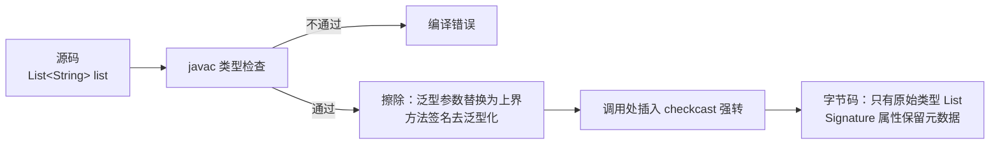

# 01 泛型深入

泛型（Generics）是 Java 5 引入的特性，也是 C++ 背景读者最容易"想当然"的部分——它看起来像模板，用起来像模板，但**实现机制与模板截然不同**。入门篇你已经会用 `List<String>`、会定义简单的泛型类，本章深入三个层次：类型擦除的底层原理、通配符与 PECS 原则、以及泛型在数组与桥方法上的种种限制。理解了擦除，你就理解了 Java 泛型的一切"怪癖"。

> 前置知识：[[java/1入门/10_数组|数组]]、[[java/1入门/14_继承与多态|继承与多态]]。本章建议边读边用 `javap -c` 观察字节码验证结论。

---

## 一、为什么需要泛型：从 Object 的缺陷说起

没有泛型的年代（JDK 5 之前），集合只能装 `Object`：

```java
import java.util.ArrayList;
import java.util.List;

public class BeforeGenerics {
    public static void main(String[] args) {
        List list = new ArrayList();      // 装的是 Object
        list.add("hello");
        list.add(42);                     // 什么都能塞，编译器不管

        String s = (String) list.get(0);  // 取出来必须强转
        // String t = (String) list.get(1); // 运行时 ClassCastException！
        System.out.println(s);
    }
}
```

两个痛点：

1. **取元素必须强制转换**，样板代码满天飞；
2. **错误推迟到运行时才暴露**——把 `Integer` 塞进本应只装字符串的列表，编译器毫无察觉。

泛型把类型检查提前到编译期：

```java
import java.util.ArrayList;
import java.util.List;

public class WithGenerics {
    public static void main(String[] args) {
        List<String> list = new ArrayList<>();
        list.add("hello");
        // list.add(42);            // 编译错误！类型不匹配，运行前就被拦下
        String s = list.get(0);     // 无需强转，编译器已知元素类型
        System.out.println(s);
    }
}
```

| 维度 | 用 Object | 用泛型 |
|------|-----------|--------|
| 类型检查时机 | 运行时（可能 ClassCastException） | 编译期 |
| 取出元素 | 必须强转 | 自动为目标类型 |
| 能装的类型 | 一切（失去约束） | 明确约束的类型及其子类 |
| 可读性 | 差，看不出容器意图 | 好，`Map<String, List<Integer>>` 一目了然 |

---

## 二、类型擦除：泛型只存在于编译期

### 2.1 核心事实

Java 泛型采用**擦除法（Type Erasure）**实现：**泛型信息只在编译期用于类型检查，编译生成的字节码中不包含泛型参数，运行时 JVM 看到的只是原始类型**。

验证一下：

```java
import java.lang.reflect.Field;
import java.util.ArrayList;
import java.util.List;

public class ErasureProof {
    public static void main(String[] args) throws Exception {
        List<String> a = new ArrayList<>();
        List<Integer> b = new ArrayList<>();

        // 运行时两个对象的 Class 完全相同！
        System.out.println(a.getClass() == b.getClass());   // true

        // 反射看 ArrayList 内部的存储字段
        Field f = ArrayList.class.getDeclaredField("elementData");
        System.out.println(f.getType());                    // class [Ljava.lang.Object;

        // 甚至可以用反射绕过泛型检查，往 List<String> 里塞 Integer
        List<String> strings = new ArrayList<>();
        strings.add("hello");
        strings.getClass()                       // 擦除后的原始 Class
               .getMethod("add", Object.class)   // add 方法签名就是 add(Object)
               .invoke(strings, 42);
        System.out.println(strings);             // [hello, 42] —— 脏数据进来了
    }
}
```

用 `javap -c ErasureProof` 查看字节码，对 `strings.get(0)` 的调用被编译成：

```text
invokeinterface #x {InterfaceMethod java/util/List.get:(I)Ljava/lang/Object;}
checkcast     #y    // class java/lang/String
```

`get` 的返回类型就是 `Object`，随后由一条 `checkcast` 指令完成"自动强转"。所谓 `List<String>`，本质上是**编译器替你写好了强转和类型检查**。

### 2.2 擦除规则

| 泛型声明 | 擦除后 |
|----------|--------|
| `T`（无边界） | `Object` |
| `T extends Number` | `Number` |
| `T extends Comparable<T>` | `Comparable` |
| 字段/方法签名中的 T | 替换为擦除类型 |
| 调用处的返回值 | 编译器插入 `checkcast` 强转 |

```java
// 源码
class Box<T extends Number> {
    T value;
}
// 擦除后等价于
class Box {
    Number value;   // T 被 Number 替换
}
```

### 2.3 擦除带来的限制清单

因为运行时不存在 `T`，以下操作全部非法：

```java
public class Limits<T> {
    // 1. 不能 new T()——编译器无法确定调用哪个构造器
    // T obj = new T();

    // 2. 不能 new 泛型数组（详见第六节）
    // T[] arr = new T[10];

    // 3. 不能 instanceof 泛型类型——运行时无 T 信息
    // public boolean check(Object o) {
    //     return o instanceof T;
    // }

    // 4. 泛型参数不能用基本类型
    // List<int> bad;   // 编译错误：只能 List<Integer>
}
```

每条限制的原因都指向同一件事：**运行时不知道 T 是什么**。

| 非法操作 | 原因 | 变通方案 |
|----------|------|----------|
| `new T()` | 无法确定构造器 | 传入 `Supplier<T>` 或反射 |
| `new T[n]` | 与数组的运行时类型检查冲突 | `(T[]) new Object[n]` + 抑制警告 |
| `o instanceof T` | 擦除后 T 不存在 | 传入 `Class<T>`，用 `clazz.isInstance(o)` |
| `List<int>` | 泛型参数必须是引用类型 | 用包装类 `List<Integer>`（有装箱开销） |
| 静态成员引用 T | T 属于实例而非类 | 改用方法级泛型参数 |

### 2.4 为什么 Java 选择擦除而不是模板展开

JDK 5 引入泛型时面临硬约束：**必须兼容存量代码**。当时全球已有海量无泛型的字节码和类库，如果像 C++ 那样为每个实例化生成独立代码，`List<String>` 和 `List<Integer>` 就是两个不同的类，所有旧集合 API 全部报废。擦除法让 `List<String>` 在虚拟机层面就是 `List`，新旧代码无缝互操作。代价则是本章列举的种种限制——这是历史包袱下的工程折中。

### 2.5 擦除的编译期流程



---

## 三、通配符与 PECS 原则

### 3.1 泛型没有继承协变

先看一个反直觉的事实：

```java
import java.util.ArrayList;
import java.util.List;

public class NoCovariant {
    public static void main(String[] args) {
        // Object 是 String 的父类
        // 但 List<Object> 不是 List<String> 的父类！
        List<String> strings = new ArrayList<>();
        // List<Object> objects = strings;   // 编译错误！

        // 原因：如果允许，下面的代码将破坏类型安全
        // List<Object> objects = strings;    // 假设允许
        // objects.add(42);                   // 往 List<String> 里塞了 Integer
        // String s = strings.get(0);         // 取出来爆炸
    }
}
```

数组恰恰相反——**Java 数组是协变的**：

```java
Object[] arr = new String[10];   // 编译通过（数组协变）
arr[0] = 42;                     // 编译通过，运行时 ArrayStoreException！
```

数组把类型错误推迟到运行时，泛型把它拦截在编译期。这正是《Effective Java》建议"优先用列表而非数组"的原因之一。

### 3.2 三种通配符

| 写法 | 名称 | 含义 |
|------|------|------|
| `List<?>` | 无界通配符 | 某种未知类型，等价于 `? extends Object` |
| `List<? extends T>` | 上界通配符 | T 或 T 的某个子类（生产者） |
| `List<? super T>` | 下界通配符 | T 或 T 的某个父类（消费者） |

```java
import java.util.ArrayList;
import java.util.List;

public class WildcardDemo {
    public static void main(String[] args) {
        List<Integer> ints = List.of(1, 2, 3);
        List<Double> doubles = List.of(1.5, 2.5);
        List<Number> nums = new ArrayList<>();

        System.out.println(sum(ints));     // 6.0
        System.out.println(sum(doubles));  // 4.0
        System.out.println(sum(nums));     // 0.0

        fillWithZero(nums);
        System.out.println(nums);          // [0, 0, 0]
    }

    // 上界通配符：只读取元素（求和）
    // ? extends Number 表示"某种 Number 子类型的列表"
    public static double sum(List<? extends Number> list) {
        double total = 0;
        for (Number n : list) {    // 可以读为 Number
            total += n.doubleValue();
        }
        // list.add(1);           // 编译错误！不能往里写（不知道具体是什么子类）
        return total;
    }

    // 下界通配符：只写入元素（填充）
    // ? super Integer 表示"Integer 或其某种父类型的列表"
    public static void fillWithZero(List<? super Integer> list) {
        for (int i = 0; i < list.size(); i++) {
            list.set(i, 0);        // 可以写 Integer 进去
        }
        // Object o = list.get(0);  // 读出来只能是 Object
    }
}
```

### 3.3 PECS 原则

Joshua Bloch 在《Effective Java》中总结为 **PECS：Producer Extends, Consumer Super**。

- 如果参数是**生产者**（你从中读取数据）-> 用 `? extends T`
- 如果参数是**消费者**（你向其中写入数据）-> 用 `? super T`
- 又读又写 -> 不用通配符，精确声明类型

标准库的例子——`Collections.copy`：

```java
public static <T> void copy(List<? super T> dest, List<? extends T> src)
// src 只被读 -> extends；dest 只被写 -> super
```

| 场景 | 通配符选择 | 理由 |
|------|-----------|------|
| 方法从集合读数据计算 | `List<? extends T>` | 任何 T 子类的列表都能传入 |
| 方法向集合写数据 | `List<? super T>` | 能装 T 的容器必然能装它的父类型引用 |
| JDK 的 `Optional.or` 返回 | `Supplier<? extends T>` | 生产者 |
| 线程池 `execute(Runnable)` | 不用通配符 | Runnable 层次简单，无必要 |

---

## 四、泛型方法与边界约束

### 4.1 泛型方法

泛型参数声明在方法上，独立于类的泛型参数：

```java
import java.util.ArrayList;
import java.util.List;
import java.util.function.Supplier;

public class GenericMethods {

    // 最简单的泛型方法：<T> 声明在返回类型之前
    public static <T> void swap(List<T> list, int i, int j) {
        T tmp = list.get(i);
        list.set(i, list.get(j));
        list.set(j, tmp);
    }

    // 带边界：要求 T 可比较，才能调用 compareTo
    public static <T extends Comparable<T>> T max(List<T> list) {
        if (list.isEmpty()) {
            throw new IllegalArgumentException("空列表");
        }
        T best = list.get(0);
        for (T item : list) {
            if (item.compareTo(best) > 0) {
                best = item;      // 只有 Comparable 边界才允许调 compareTo
            }
        }
        return best;
    }

    // 泛型 + Supplier 解决"无法 new T()"的问题
    public static <T> List<T> filledList(int size, Supplier<T> maker) {
        List<T> result = new ArrayList<>();
        for (int i = 0; i < size; i++) {
            result.add(maker.get());   // 构造逻辑交给调用方
        }
        return result;
    }

    public static void main(String[] args) {
        List<String> words = new ArrayList<>(List.of("banana", "apple", "cherry"));
        swap(words, 0, 2);
        System.out.println(words);                    // [cherry, apple, banana]
        System.out.println(max(words));               // cherry

        List<Integer> zeros = filledList(3, () -> 0);
        System.out.println(zeros);                    // [0, 0, 0]
    }
}
```

### 4.2 多重边界

一个类型参数可以有多个边界，但**类（若有）必须写在第一位**：

```java
// T 必须既是 Comparable 的子类型，又实现 Serializable
public static <T extends Comparable<T> & java.io.Serializable> void sort(T[] a) {
    java.util.Arrays.sort(a);   // Arrays.sort 要求元素可比较
}
```

注意：边界只能有一个类，其余必须是接口。这与 C++ 模板的鸭子类型完全不同——C++ 只要语法上能调 `operator<` 就通过实例化，Java 必须用边界显式声明。

---

## 五、桥方法

泛型与[[java/1入门/14_继承与多态|继承多态]]相遇时会产生一个编译器偷偷生成的产物——**桥方法（Bridge Method）**。

```java
import java.lang.reflect.Method;

class MyString implements Comparable<MyString> {
    private final String value;
    MyString(String v) { this.value = v; }

    @Override
    public int compareTo(MyString other) {     // 参数类型是 MyString
        return this.value.compareTo(other.value);
    }
}

public class BridgeMethodDemo {
    public static void main(String[] args) throws Exception {
        // 接口 Comparable<T> 擦除后方法是 compareTo(Object)
        // 而 MyString 实现的是 compareTo(MyString)
        // 为了让"接口多态"继续工作，编译器生成桥方法：
        // public int compareTo(Object o) { return compareTo((MyString) o); }

        for (Method m : MyString.class.getDeclaredMethods()) {
            System.out.println(m + "  isBridge=" + m.isBridge());
        }
        // 输出类似：
        // public int MyString.compareTo(MyString)  isBridge=false
        // public int MyString.compareTo(java.lang.Object)  isBridge=true
    }
}
```

擦除后 `Comparable<T>` 变成 `Comparable`，其抽象方法是 `compareTo(Object)`；但子类实现的是 `compareTo(MyString)`，签名不同、不构成覆盖。为了让 `Comparable c = myString; c.compareTo(otherObj)` 这类多态调用正常分发，编译器自动插入一个 `compareTo(Object)` 桥方法，内部强转后再委托给真正的实现。

| 要点 | 说明 |
|------|------|
| 谁生成 | javac 自动生成，源码不可见 |
| 标识 | `Method.isBridge()` 返回 true，字节码标志 ACC_BRIDGE |
| 反射陷阱 | `getDeclaredMethods()` 会列出桥方法，遍历时需过滤，否则可能重复处理 |
| 与 C++ 对比 | 无此问题——模板每个实例化都是独立类，签名天然一致 |

---

## 六、泛型数组限制

### 6.1 为什么 `new T[n]` 非法

数组的两个特性冲突了：

1. 数组携带运行时类型，创建时就要确定，且 `ArrayStoreException` 依赖它做写入检查；
2. 擦除后运行时不知道 T 是什么，JVM 无法创建"T 数组"。

```java
public class GenericArrayIssue<T> {
    private final T[] items;

    @SuppressWarnings("unchecked")
    public GenericArrayIssue(int capacity) {
        // 唯一可行方案：造 Object 数组再强转
        // 强转 (T[]) 实际不发生——擦除后就是 Object[]
        items = (T[]) new Object[capacity];   // OK，仅编译器警告
    }

    public void set(int idx, T val) { items[idx] = val; }
    public T get(int idx) { return items[idx]; }

    public static void main(String[] args) {
        GenericArrayIssue<String> box = new GenericArrayIssue<>(10);
        box.set(0, "hello");                  // 正常
        System.out.println(box.get(0));
        // box.items 本身若泄漏出去，外部拿到的是 Object[]，
        // 可以塞入任意对象 —— 所以绝不要把 items 字段暴露出去
    }
}
```

### 6.2 varargs 泛型的堆污染

可变参数本质是数组，于是泛型 varargs 有一个著名漏洞：

```java
import java.util.ArrayList;
import java.util.List;

public class HeapPollution {
    public static void main(String[] args) {
        // 下面这行能通过编译，但存在隐患：
        List<String>[] lists = createLists(List.of("a"), List.of("b"));
        Object[] objs = lists;              // 数组协变，合法
        objs[0] = List.of(42);              // 运行时不报错！泛型检查已擦除
        // String s = lists[0].get(0);      // 此处才会 ClassCastException

        // 正确姿势：直接用 List<List<String>>
        List<List<String>> safe = List.of(List.of("a"), List.of("b"));
        System.out.println(safe);
    }

    @SafeVarargs   // 声明"我不会往这个数组里写东西"，消除调用方警告
    static <T> List<T>[] createLists(List<T>... arrays) {
        return arrays;
    }
}
```

术语叫**堆污染（Heap Pollution）**：变量的运行时类型与声明的静态类型不一致。规则很简单——**优先使用 `List<...>` 而非数组来持有泛型数据**。

---

## 七、与 C++ 模板深度对比

这是 C/C++ 背景读者最关心的一节。两者解决同一个问题（编写与类型无关的代码），但哲学完全相反。

| 维度 | Java 泛型 | C++ 模板 |
|------|-----------|----------|
| 实现机制 | 类型擦除，一份字节码 | 编译期按类型展开，每份实例化独立代码 |
| 实例化时机 | 无实例化概念，运行时统一为擦除类型 | 编译期逐个实例化（code bloat 来源之一） |
| 类型检查时机 | 声明处即检查（边界约束） | 使用处检查（隐式接口，缺成员则实例化报错） |
| 特化 | 不支持 | 支持（全特化/偏特化，如 `vector<bool>`） |
| 非类型参数 | 不支持 | 支持 `template<int N>` |
| 元编程能力 | 几乎没有（反射可部分模拟） | SFINAE、`constexpr`、 Concepts 前时代 TMP |
| 运行时获取类型参数 | 不能（擦除） | 可以（typeid、模板实参推导） |
| 基本类型支持 | 必须装箱（`List<int>` 非法） | 直接支持 `vector<int>`，零开销 |
| 性能开销 | 装箱拆箱 + 强转 checkcast | 通常零开销抽象 |
| 错误信息质量 | 清晰（编译器直接报边界不符） | 历史性灾难（模板报错几十行），Concepts 后改善 |
| 语法 | `<T extends Bound>` 显式约束 | C++20 Concepts 之前靠约定 |

几个关键差异展开：

**1. 一份代码 vs N 份代码**

Java 中 `ArrayList<String>` 和 `ArrayList<Integer>` 在虚拟机里是**同一个类**；C++ 中 `vector<string>` 和 `vector<int>` 是**两套独立编译的机器码**。后者换来零抽象成本，前者换来体积小、动态加载友好、二进制兼容。

**2. SFINAE vs 边界**

C++ 经典技巧"替换失败不是错误"：根据表达式是否合法在重载决议中选择模板。Java 没有对应物——约束必须在声明处用 `extends` 写明，表达力弱但可读性和报错质量远胜。可以说 Java 用"表达力"换了"工程可用性"。

**3. Project Valhalla 的方向**

Oracle 的 Valhalla 项目正在探索**具化泛型（Specialized Generics）**，目标是让 `List<int>` 合法、消除装箱，同时保持擦除的二进制兼容。这相当于向 C++ 模板借性能，值得持续关注（见 [[java/2深入/11_Java新特性|Java 新特性]]）。

---

## 小结

| 知识点 | 一句话 |
|--------|--------|
| 类型擦除 | 泛型只在编译期存在，运行时全是原始类型 |
| 通配符 | 读用 `extends`，写用 `super`，PECS 口诀 |
| 边界 | `T extends Comparable<T>` 才能调用约束的方法 |
| 桥方法 | 编译器为擦除后的多态补的垫片，反射时要过滤 |
| 泛型数组 | `new T[n]` 非法，优先用 `List<...>` |
| vs C++ 模板 | 擦除换兼容，模板换性能与元编程 |

---

## LeetCode 巩固

泛型最常见的落地场景是"算法逻辑与元素类型解耦"。以下三题建议先用具体类型写出解法，再用泛型方法重构一遍，体会边界约束的作用：

| 题目 | 链接 | 练习点 |
|------|------|--------|
| 前 K 个高频元素 | [top-k-frequent-elements](https://leetcode.cn/problems/top-k-frequent-elements/) | 泛型配合 `PriorityQueue` 与自定义比较器，桶计数解法复习 HashMap |
| 合并区间 | [merge-intervals](https://leetcode.cn/problems/merge-intervals/) | 二维数组排序，体会为什么降序排序要包装类型 |
| 存在重复元素 | [contains-duplicate](https://leetcode.cn/problems/contains-duplicate/) | `HashSet` 泛型最基本用法，一题三解（排序/哈希/Stream distinct） |

下一章我们进入注解与反射——正是反射，提供了绕过擦除限制的逃生通道。
