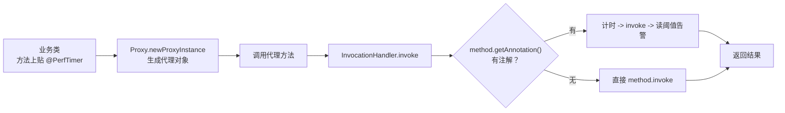
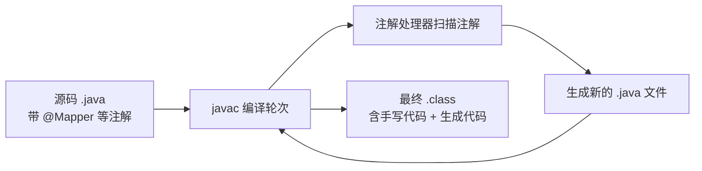

# 02 注解与反射

如果说泛型是编译期的类型体操，那注解与反射就是 Java 的**运行时元编程**：注解把元数据贴在代码上，反射让程序在运行时"看见"并操纵自己的结构。Spring 的 `@Autowired`、MyBatis 的 `@Mapper`、JUnit 的 `@Test`——框架的一切魔法都建立在这两样东西之上。本章从内置注解讲到自定义注解实战，再到反射性能与 APT，最后回答那个 C 程序员必问的问题：没有宏预处理器，Java 靠什么做代码生成？

> 前置知识：[[java/1入门/06_变量与数据类型|类与对象基础]]、[[java/2深入/01_泛型深入|泛型深入]]。本章代码均可在 JDK 17 下直接运行。

---

## 一、注解是什么

### 1.1 从注释到注解

C 程序员习惯用注释或命名约定传递元信息（如 `/* @deprecated */`），但注释对编译器完全不可见。Java 注解是**写给编译器和框架看的结构化注释**：

```java
@Override                          // 编译器检查：这真的是覆盖吗？
public String toString() { return "demo"; }

@SuppressWarnings("unchecked")     // 告诉编译器：这个警告我认了
List<String> list = (List<String>) raw;

@Deprecated(since = "9", forRemoval = true)   // 元数据：已过时
public void oldApi() {}
```

### 1.2 四个常用内置注解

| 注解 | 作用 | 典型场景 |
|------|------|----------|
| `@Override` | 编译器校验该方法确实覆盖了父类/接口方法 | 拼错方法名时立即编译报错，价值极高 |
| `@Deprecated` | 标记 API 过时，调用处产生警告 | 库的版本演进；Java 9 起可带 `since` 与 `forRemoval` |
| `@FunctionalInterface` | 声明函数式接口，编译器校验只有一个抽象方法 | 配合 Lambda（见 [[java/2深入/08_Stream与函数式|Stream 与函数式]]） |
| `@SafeVarargs` | 声明泛型可变参数方法不会污染堆 | 见 [[java/2深入/01_泛型深入|泛型深入]] 第六章 |

```java
public class OverrideValue {
    public static void main(String[] args) {
        new Printer().printHello();
    }

    static class Printer {
        // 故意拼错父类方法名：有 @Override 时编译失败，
        // 没有 @Override 则变成一个新方法，bug 静默潜伏
        // @Override
        // public String tostring() { return ""; }
    }

    interface Greet {
        void hello();
    }

    // 不加 @FunctionalInterface 也算函数式接口，
    // 但加上后若误加了第二个抽象方法，编译器会立刻报错
    @FunctionalInterface
    interface Task {
        void run();
        default String desc() { return "task"; }   // default 方法不计数
    }
}
```

经验法则：**永远给覆盖的方法加 `@Override`**。它零成本地把"覆盖失败"从运行时 bug 变成编译错误。

---

## 二、元注解：定义注解的注解

自定义注解之前必须先懂四个元注解——它们决定了你的注解"活多久"、"贴在哪"、"能否被继承"。

### 2.1 @Retention：存活周期

| 取值 | 存活范围 | 用途 |
|------|----------|------|
| `RetentionPolicy.SOURCE` | 仅源码，编译后丢弃 | APT 代码生成、`@Override`（仅检查） |
| `RetentionPolicy.CLASS` | 字节码中存在，运行时不可读 | 默认值，实际很少用 |
| `RetentionPolicy.RUNTIME` | 运行时可反射读取 | Spring/JUnit 等一切运行时框架 |

### 2.2 @Target：能贴在哪

```java
import java.lang.annotation.ElementType;
import java.lang.annotation.Target;

@Target({ElementType.METHOD, ElementType.TYPE})   // 只能贴在方法和类上
public @interface AuditLog { }
// 贴在字段上会编译报错
```

常用 `ElementType`：`TYPE`（类/接口/枚举）、`METHOD`、`FIELD`、`PARAMETER`、`CONSTRUCTOR`、`LOCAL_VARIABLE`、`ANNOTATION_TYPE`、`PACKAGE`。Java 8 新增 `TYPE_PARAMETER` 与 `TYPE_USE`（后者让注解可以贴在任意类型使用处，如 `List<@NonNull String>`，Checker Framework 的空值检查就靠它）。

### 2.3 @Inherited 与 @Documented

- `@Inherited`：子类自动继承父类上的注解（仅类继承有效，接口实现不继承）
- `@Documented`：注解出现在 javadoc 中

### 2.4 一个完整的自定义注解

```java
import java.lang.annotation.*;

// 1. 定义：三个元注解 + 属性
@Retention(RetentionPolicy.RUNTIME)          // 运行时反射可读——框架注解的标准配置
@Target(ElementType.METHOD)                  // 只能贴在方法上
@Documented
public @interface PerfTimer {
    String value() default "";               // 属性像方法，带 default 即可选
    int warnThresholdMs() default 100;       // 超过此耗时打印警告
}
```

注解属性的规则：

| 规则 | 说明 |
|------|------|
| 类型限制 | 只能是基本类型、String、Class、枚举、注解、以及它们的数组 |
| `value` 特殊性 | 名为 `value` 的属性赋值时可省略名字：`@PerfTimer("查询")` |
| 默认值 | 有 `default` 的属性可不填；无默认值的必须填 |
| 数组属性 | 单元素可省花括号：`roles = {"admin"}` 或 `roles = "admin"` |

---

## 三、自定义注解实战：手写一个性能计时器

现在把注解和反射串起来，实现"给任何方法贴上 `@PerfTimer` 就自动计时"的效果。这是理解 AOP 框架原理的最小模型。

```java
import java.lang.reflect.InvocationHandler;
import java.lang.reflect.Method;
import java.lang.reflect.Proxy;

// ========== 第一步：定义注解 ==========
import java.lang.annotation.*;

@Retention(RetentionPolicy.RUNTIME)
@Target(ElementType.METHOD)
@interface PerfTimer {
    String value() default "";
    int warnThresholdMs() default 100;
}

// ========== 第二步：业务接口与实现 ==========
interface UserService {
    @PerfTimer(value = "查询用户", warnThresholdMs = 50)
    String findUser(long id);

    @PerfTimer("批量统计")
    void heavyReport();
}

class UserServiceImpl implements UserService {
    @Override
    public String findUser(long id) {
        try { Thread.sleep(30); } catch (InterruptedException e) { }
        return "user-" + id;
    }

    @Override
    public void heavyReport() {
        try { Thread.sleep(120); } catch (InterruptedException e) { }
        System.out.println("报表生成完毕");
    }
}

// ========== 第三步：反射驱动的动态代理 ==========
class TimerProxy implements InvocationHandler {
    private final Object target;

    private TimerProxy(Object target) { this.target = target; }

    @SuppressWarnings("unchecked")
    public static <T> T wrap(T target) {
        return (T) Proxy.newProxyInstance(
            target.getClass().getClassLoader(),
            target.getClass().getInterfaces(),   // 基于接口代理
            new TimerProxy(target));
    }

    @Override
    public Object invoke(Object proxy, Method method, Object[] args) throws Throwable {
        // 关键：通过反射读取目标方法上的注解
        PerfTimer timer = method.getAnnotation(PerfTimer.class);
        if (timer == null) {
            return method.invoke(target, args);  // 无注解则直通
        }
        long start = System.nanoTime();
        try {
            return method.invoke(target, args);  // 执行真实方法
        } finally {
            long costMs = (System.nanoTime() - start) / 1_000_000;
            String name = timer.value().isEmpty() ? method.getName() : timer.value();
            if (costMs >= timer.warnThresholdMs()) {
                System.out.printf("[WARN] %s 耗时 %d ms（阈值 %d ms）%n",
                                  name, costMs, timer.warnThresholdMs());
            } else {
                System.out.printf("[INFO] %s 耗时 %d ms%n", name, costMs);
            }
        }
    }
}

// ========== 第四步：使用 ==========
public class PerfDemo {
    public static void main(String[] args) {
        UserService svc = TimerProxy.wrap(new UserServiceImpl());
        svc.findUser(42);
        svc.heavyReport();      // 会触发 WARN 日志
    }
}
```

输出示例：

```text
[INFO] 查询用户 耗时 32 ms
[WARN] 批量统计 耗时 121 ms（阈值 100 ms）
报表生成完毕
```

流程一图流：



这就是 Spring AOP `@Transactional`、`@Cacheable` 的工作雏形：**注解声明意图，反射在运行时读取意图，代理在调用前后织入逻辑**。

---

## 四、Class 对象：反射的入口

### 4.1 万物皆有 Class

每个类被 JVM 加载后，都会在堆中生成一个 `java.lang.Class` 实例——它是这个类的"身份证"，记录着类的全部结构信息。获取它的方式有三种：

```java
import java.util.ArrayList;

public class GetClass {
    public static void main(String[] args) throws Exception {
        // 方式一：类字面常量（编译期确定，最安全最快，不会触发初始化）
        Class<ArrayList> c1 = ArrayList.class;

        // 方式二：对象的 getClass()（运行时从实例反查，拿到的是实际类型的 Class）
        Object obj = new ArrayList();
        Class<?> c2 = obj.getClass();

        // 方式三：Class.forName（按全限定名字符串加载，最灵活，
        // 会触发"加载 + 链接 + 初始化"，找不到抛 ClassNotFoundException）
        Class<?> c3 = Class.forName("java.util.ArrayList");

        System.out.println(c1 == c2 && c2 == c3);   // true：同一个类只有一份 Class

        // 三种方式的适用场景
        // 1. 编译期已知类型        -> X.class
        // 2. 手里只有一个对象引用  -> obj.getClass()
        // 3. 类名来自配置文件/网络 -> Class.forName（JDBC 驱动加载的经典用法）
    }
}
```

| 方式 | 时机 | 触发类初始化 | 典型场景 |
|------|------|--------------|----------|
| `X.class` | 编译期 | 否 | 已知类型、性能敏感 |
| `obj.getClass()` | 运行时 | （对象已存在） | 从实例反查真实类型 |
| `Class.forName(name)` | 运行时 | **是** | 配置驱动、SPI 加载 |

### 4.2 Class 能告诉你什么

```java
import java.lang.reflect.Field;
import java.lang.reflect.Method;
import java.util.List;

public class Introspect {
    public static void main(String[] args) {
        Class<List> c = List.class;
        System.out.println("类名: " + c.getName());            // java.util.List
        System.out.println("简单名: " + c.getSimpleName());    // List
        System.out.println("是否接口: " + c.isInterface());     // true
        System.out.println("父接口数: " + c.getInterfaces().length);
        for (Method m : c.getDeclaredMethods()) {              // 声明的全部方法
            // 泛型信息在这里可以读到！注意与擦除的区别：
            // 方法签名被擦除为 Object，但 Signature 属性保留了泛型元数据
            if (m.getName().equals("add")) {
                System.out.println(m);                          // add(java.lang.Object)
                System.out.println(m.getGenericParameterTypes()[0]);  // E
            }
        }
    }
}
```

补充一个重要澄清：擦除并非把泛型信息删得一干二净——**方法签名和字段类型擦除了，但字节码的 `Signature` 属性仍保留完整泛型声明**，所以反射的 `getGenericParameterTypes()` 能读回 `E`。这也是 Jackson/Gson 能仅凭字段声明的泛型完成 JSON 反序列化的原因。

---

## 五、反射 API 三剑客：Constructor / Method / Field

### 5.1 全景示例

```java
import java.lang.reflect.Constructor;
import java.lang.reflect.Field;
import java.lang.reflect.Method;

class User {
    private String name;
    private int age;

    public User() { this("匿名", 0); }
    public User(String name, int age) {
        this.name = name;
        this.age = age;
    }

    private String secret() { return "内部机密"; }

    @Override
    public String toString() { return name + "(" + age + ")"; }
}

public class ReflectApi {
    public static void main(String[] args) throws Exception {
        Class<User> c = User.class;

        // ---- Constructor：构造对象 ----
        Constructor<User> noArg = c.getDeclaredConstructor();          // 无参构造
        Constructor<User> full = c.getDeclaredConstructor(
                                    String.class, int.class);          // 按参数类型匹配
        User u = full.newInstance("张三", 25);
        System.out.println(u);                                          // 张三(25)

        // ---- Method：调用方法（含私有） ----
        Method secret = c.getDeclaredMethod("secret");                 // 私有方法
        secret.setAccessible(true);                                     // 暴力访问开关
        System.out.println(secret.invoke(u));                           // 内部机密

        // ---- Field：读写属性（含私有） ----
        Field ageF = c.getDeclaredField("age");
        ageF.setAccessible(true);
        ageF.setInt(u, 26);                                             // 相当于 u.age = 26
        System.out.println(u);                                          // 张三(26)
        System.out.println(ageF.get(u));                                // 26
    }
}
```

### 5.2 API 速查表

| 目标 | 获取方法 | 说明 |
|------|----------|------|
| 构造器 | `getConstructor(参数类型...)` / `getDeclaredConstructor(...)` | 带 Declared 的包含私有 |
| 方法 | `getMethod("名", 参数类型...)` / `getDeclaredMethod(...)` | getMethod 含继承来的公共方法 |
| 字段 | `getField("名")` / `getDeclaredField("名")` | 同上规则 |
| 全部成员 | `getDeclaredMethods/Fields/Constructors()` | 数组返回，注意空数组而非 null |

记忆口诀：**Declared 系列看本类所有权限定；不带 Declared 的只看 public 且含父类**。

### 5.3 setAccessible 与模块化的碰撞

`setAccessible(true)` 可以绕过 `private`，但 Java 9 模块化后，对 JDK 内部 API（如 `sun.misc.Unsafe` 所在包）使用会抛 `InaccessibleObjectException`，需加 `--add-opens` 参数放行。对你自己的普通类不受影响。这个"暴力开关"是框架能力的来源（依赖注入直接给私有字段赋值），也是安全审计的重点关注对象。

---

## 六、反射的性能开销与现代替代方案

### 6.1 反射慢在哪

| 开销点 | 说明 |
|--------|------|
| 方法查找 | 字符串匹配遍历方法数组 |
| 参数装箱与打包 | `invoke(Object...)` 要求参数装箱成 Object 数组 |
| 无法内联 | JIT 很难优化反射调用链 |
| 安全检查 | 每次访问都做权限校验（可缓存 AccessibleObject 缓解） |

粗略量级：JDK 17 下 Method.invoke 约为直接调用的几倍到几十倍开销（视缓存情况）。高频路径上不可忽视。

### 6.2 MethodHandle：更底层的调用句柄

```java
import java.lang.invoke.MethodHandle;
import java.lang.invoke.MethodHandles;
import java.lang.invoke.MethodType;

public class HandleDemo {
    public static void main(String[] args) throws Throwable {
        MethodHandles.Lookup lookup = MethodHandles.lookup();

        // 描述签名：返回 String，入参 ()
        MethodType type = MethodType.methodType(String.class);
        MethodHandle mh = lookup.findVirtual(
            String.class, "toUpperCase", type);

        String result = (String) mh.invoke("hello");   // 类型由 MethodType 静态约束
        System.out.println(result);                     // HELLO
    }
}
```

MethodHandle 自 JDK 7 引入，签名在创建期就静态确定，JIT 可像普通调用一样内联优化，性能接近直调。它正是 `invokedynamic` 指令的执行载体——Lambda 表达式的实现就靠它（见 [[java/2深入/08_Stream与函数式|Stream 与函数式]]）。

### 6.3 LambdaMetafactory：Lambda 如何落地

当你写一个 Lambda，javac 并不生成匿名类，而是生成一条 `invokedynamic` 指令，首次执行时调用 **LambdaMetafactory** 在运行时动态生成实现类并绑定 MethodHandle。之后每次调用走的是优化过的调用点。这解释了为什么 Lambda 通常比显式反射快得多。

### 6.4 性能选型建议

| 场景 | 推荐 |
|------|------|
| 框架初始化期一次性反射 | 直接反射即可，开销一次性摊销 |
| 高频调用路径 | 缓存 Method/Constructor 为 static，或改用 MethodHandle / 接口抽象 |
| 序列化等极致性能需求 | APT 生成代码（见下节）或 Records（见 [[java/2深入/11_Java新特性|Java 新特性]]） |

---

## 七、APT：注解处理器的编译期魔法

反射解决"运行时读取注解"，APT（Annotation Processing Tool，现称 Pluggable Annotation Processing）则解决**编译期处理注解并生成新代码**：



- 处理器实现 `javax.annotation.processing.AbstractProcessor`，注册后 javac 在编译多轮中自动调用
- Lombok 通过修改语法树消除 getter/setter 样板；MapStruct 生成 Bean 映射代码；Room（Android）生成数据库实现
- **生成代码 vs 反射的核心差异**：生成的就是普通源码，零运行时开销、可调试可单步，代价是构建流程复杂

Spring 的 `@ComponentScan` 用运行时反射；MyBatis 的 Mapper 接口用动态代理拦截；两者结合让"写个接口就能查库"成为可能。第八章 [[java/2深入/08_Stream与函数式|函数式编程]] 的 Lambda 与本章的 invokedynamic 一脉相承。

---

## 八、与 C 宏预处理器对比

C 程序员的自然疑问：没有 `#define` 和 `#include`，Java 怎么做"代码变换"？

| 维度 | C 预处理器宏 | Java 注解 + APT / 反射 |
|------|--------------|------------------------|
| 处理阶段 | 编译前文本替换 | 编译期语法树处理（APT）/ 运行时（反射） |
| 作用单位 | 文本级 token，不理解语义 | 结构化：类/方法/字段/参数 |
| 类型安全 | 无，展开后才检查 | 有，注解有类型约束 |
| 作用域控制 | 全局污染风险（需 #undef） | 注解自带 @Target 限定 |
| 调试体验 | 展开后行号错乱 | 生成的代码可直接断点 |
| 典型用途 | 条件编译、常量、迷你函数 | 元数据标记、样板代码生成、AOP |
| Java 中没有的 | 条件编译 | ——（用构建工具多 profile 或常量折叠模拟） |

关键哲学差异：C 的宏是**无语义的文本游戏**，Java 选择把元编程放进语言本身——注解提供声明式入口，APT/反射提供执行机制。你失去了一行 `#define MAX(a,b)` 的便利，换来的是 IDE 友好、重构安全和海量框架生态。

顺带一提：C 里 `#ifdef DEBUG` 的条件编译，Java 惯用手法是 `static final boolean DEBUG = false;` 配合 if——JIT 会消除死分支，效果等同。

---

## 小结

| 知识点 | 一句话 |
|--------|--------|
| 内置注解 | `@Override` 必加，防覆盖失败 |
| 元注解 | RUNTIME 给框架用，SOURCE 给 APT 用，@Target 定贴纸范围 |
| Class 对象 | 三种获取方式，同一类全局唯一 |
| 反射三剑客 | Constructor/Method/Field + setAccessible 破私 |
| 性能 | 高频路径用 MethodHandle 或缓存，或干脆 APT 生成代码 |
| vs C 宏 | 文本替换换成了类型安全的结构化元编程 |

---

## LeetCode 巩固

本章主题偏工程，算法题选择"有序查找与边界判断"方向——它们与反射 API 的精神相通：**在结构中精确定位目标**：

| 题目 | 链接 | 练习点 |
|------|------|--------|
| 两数之和 II | [two-sum-ii-input-array-is-sorted](https://leetcode.cn/problems/two-sum-ii-input-array-is-sorted/) | 双指针在有序结构中定位，类比在方法表中定位方法 |
| 搜索插入位置 | [search-insert-position](https://leetcode.cn/problems/search-insert-position/) | 二分查找边界，理解 getDeclaredMethod 的精确匹配思想 |
| 第一个错误的版本 | [first-bad-version](https://leetcode.cn/problems/first-bad-version/) | 最小化错误调用次数的二分变体 |

下一章集合框架深入——HashMap 的原理将再次用到 hashCode 与 equals 的知识。
