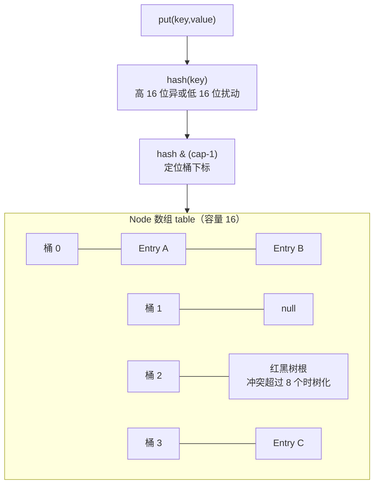
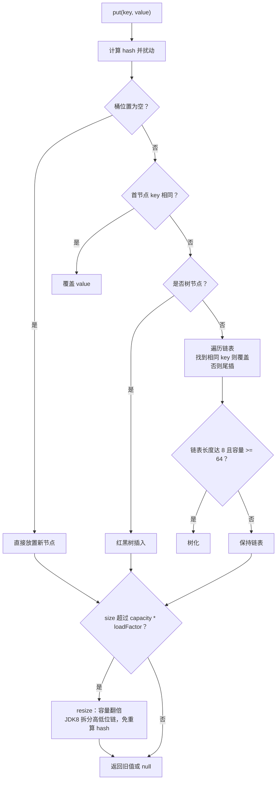
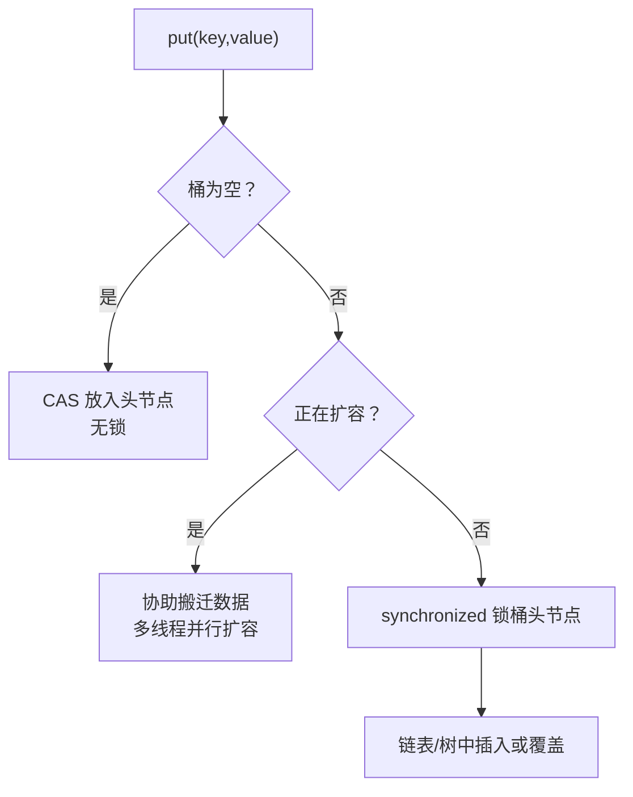
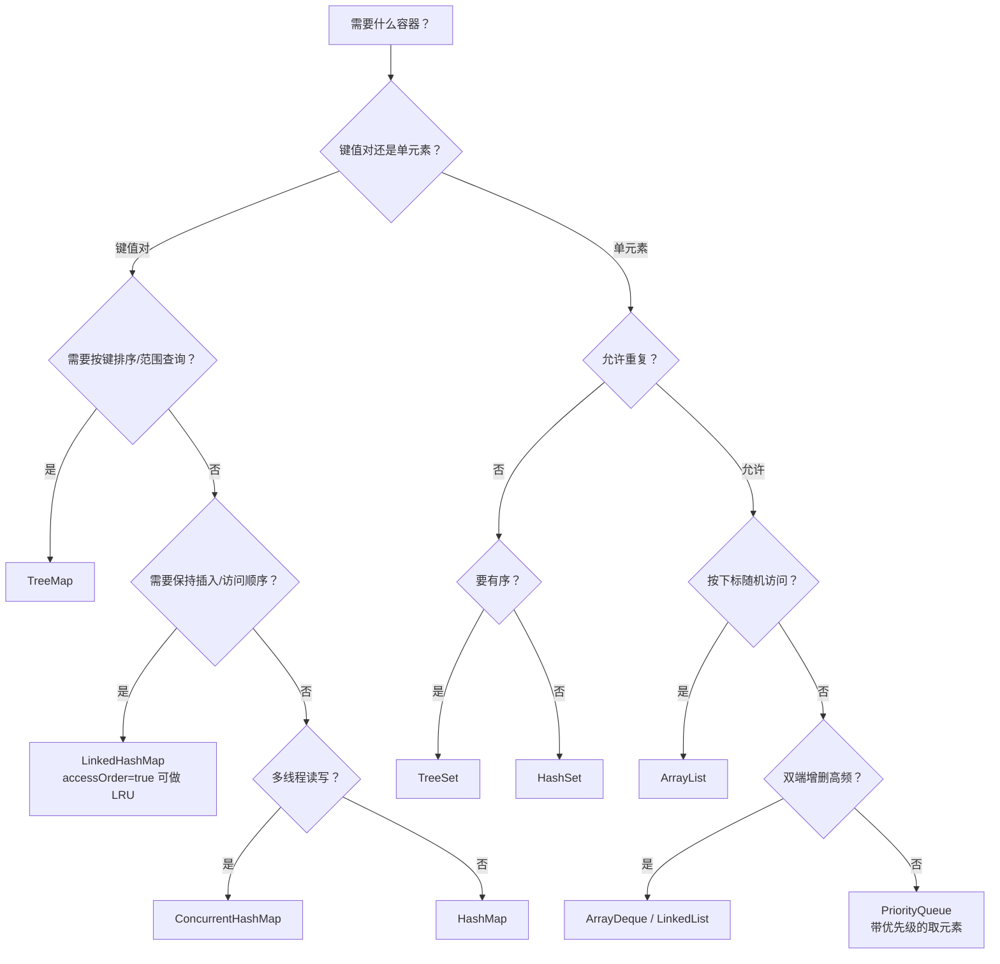

# 03 集合框架深入

入门篇你已经会用 `ArrayList` 和 `HashMap` 存取数据，本章把镜头拉近到源码级：`ArrayList` 怎么扩容、`HashMap` 为什么容量必须是 2 的幂、红黑树什么时候出场、`ConcurrentHashMap` 如何从分段锁演进到 CAS。集合是面试与实战的双重高频区，也是 C++ 背景读者最容易"望文生义"的地方——Java 的容器不是 STL 的翻译，设计取舍差别很大。

> 前置知识：[[java/1入门/10_数组|数组]]、[[java/2深入/01_泛型深入|泛型深入]]。

---

## 一、Collection 继承体系全景

```mermaid
flowchart TB
    ITER["Iterable<br/>iterator() 迭代能力"] --> COLL["Collection"]
    COLL --> LIST["List 有序可重复"]
    COLL --> SET["Set 不可重复"]
    COLL --> QUEUE["Queue 队列语义"]

    LIST --> AL["ArrayList<br/>动态数组，查询快"]
    LIST --> LL["LinkedList<br/>双向链表，头尾操作快"]
    LIST --> VEC["Vector<br/>全方法 synchronized（遗留）"]

    SET -> HS["HashSet<br/>哈希表实现"]
    HS --> LHS["LinkedHashSet<br/>维护插入序"]
    SET --> TS["TreeSet<br/>红黑树有序"]

    QUEUE --> PQ["PriorityQueue<br/>二叉堆"]
    QUEUE --> DQ["ArrayDeque<br/>循环数组双端队列"]
    QUEUE --> LLDQ["LinkedList<br/>也实现了 Deque"]

    MAP["Map 键值对（不属于 Collection）"] --> HM["HashMap"]
    HM --> LHM["LinkedHashMap<br/>accessOrder 可做 LRU"]
    MAP --> TM["TreeMap<br/>红黑树排序"]
    MAP --> CHTM["ConcurrentHashMap<br/>并发安全首选"]
```

记忆要点：

- `Map` 不继承 `Collection`，它是独立的键值对体系
- `Vector`/`Hashtable` 是 JDK 1.0 遗留物，全表锁性能差，**新代码一律用 `ArrayList`/`HashMap`**
- 命名规律：`Xxx + 底层结构 + 接口`，如 Linked+Hash+Map = 维护链表的哈希 Map

---

## 二、ArrayList：动态数组的真相

### 2.1 扩容机制源码解析

C 里 `malloc` 出来的数组不能变长，Java 的 ArrayList 用"换更大的数组搬过去"模拟动态增长：

```java
// 简化自 JDK 源码（java.util.ArrayList）
public class ArrayList<E> {
    private static final int DEFAULT_CAPACITY = 10;
    transient Object[] elementData;      // 注意：底层就是 Object[]（擦除的必然，见第 01 章）
    private int size;

    public boolean add(E e) {
        ensureCapacityInternal(size + 1); // 先确保装得下
        elementData[size++] = e;
        return true;
    }

    private void ensureCapacityInternal(int minCapacity) {
        if (minCapacity - elementData.length > 0) {
            grow(minCapacity);
        }
    }

    private void grow(int minCapacity) {
        int oldCap = elementData.length;
        // 关键一行：newCap = oldCap * 1.5
        int newCap = oldCap + (oldCap >> 1);
        if (newCap - minCapacity < 0) newCap = minCapacity;   // 1.5 倍还不够就直接用需求值
        elementData = Arrays.copyOf(elementData, newCap);     // 整体搬迁 O(n)
    }
}
```

要点提炼：

| 问题 | 答案 |
|------|------|
| 默认容量 | 懒初始化：`new ArrayList<>()` 底层是空数组，第一次 add 才分配 10 |
| 增长倍率 | **1.5 倍**（`oldCap + oldCap>>1`），C++ vector 是 2 倍 |
| 为什么 1.5 不是 2 | 更省内存；1.5 倍增长可让后续扩容复用之前释放的空间（内存分配器友好）|
| 扩容成本 | O(n) 搬迁；预知规模时务必 `new ArrayList<>(expectedSize)` |

### 2.2 性能特征

| 操作 | 复杂度 | 说明 |
|------|--------|------|
| get(i) / set(i,e) | O(1) | 连续内存随机访问 |
| add 尾部均摊 | O(1) | 偶尔触发扩容搬迁 |
| add/remove 中间 | O(n) | 后续元素整体移动 |
| contains(o) | O(n) | 线性扫描 |

---

## 三、LinkedList：真双向链表

```java
import java.util.Deque;
import java.util.LinkedList;

public class LinkedListDemo {
    public static void main(String[] args) {
        LinkedList<String> list = new LinkedList<>();
        list.add("B");                 // 尾插
        list.addFirst("A");            // 头插 O(1)——ArrayList 没有
        list.addLast("C");
        System.out.println(list);      // [A, B, C]

        String head = list.removeFirst();   // 弹头 O(1)
        String tail = list.removeLast();    // 弹尾 O(1)
        System.out.println(head + " " + tail);  // A C

        // 实战建议：需要双端队列时声明为 Deque 接口而非 LinkedList 具体类
        Deque<Integer> stack = new LinkedList<>();
        stack.push(1); stack.push(2);
        System.out.println(stack.pop());    // 2 —— 当栈用
    }
}
```

每个节点是一个内部类对象：

```java
private static class Node<E> {
    E item;
    Node<E> next;     // 后指针
    Node<E> prev;     // 前指针
}
```

### ArrayList vs LinkedList 选型

| 维度 | ArrayList | LinkedList |
|------|-----------|------------|
| 内存布局 | 连续，CPU 缓存友好 | 节点分散，每节点多两个引用开销 |
| 随机访问 | O(1) | O(n)，get(i) 会从近端开始走 |
| 头部插入删除 | O(n) | O(1) |
| 中间插入删除 | O(n) 移动元素 | 定位 O(n) + 改指针 O(1)，并不占优 |
| 实战结论 | **默认选它** | 仅头尾高频增删且不需要随机访问时考虑 |

一个反直觉的事实：即便"中间频繁插入"，LinkedList 也常输给 ArrayList——定位本身就是 O(n)，而连续内存的批量移动在现代 CPU 上快得惊人。

### 随机访问基准直觉

在千万级数据上做 100 万次随机访问：ArrayList 毫秒级，LinkedList 秒级以上，差出两三个数量级。原因除了 O(1) vs O(n)，还有缓存局部性——这是 C 程序员最懂的道理，Java 同样适用。

---

## 四、HashMap 原理（重点章）

### 4.1 整体结构：数组 + 链表 + 红黑树



### 4.2 hash 扰动：为什么高 16 位要异或低 16 位

```java
static final int hash(Object key) {
    int h;
    return (key == null) ? 0 : (h = key.hashCode()) ^ (h >>> 16);
}
```

定位桶用的是 `hash & (capacity - 1)`，而默认容量只有 16——参与运算的有效位只有低 4 位，hashCode 的高位信息全部被浪费。把高 16 位无符号右移后异或进低位，让高位也影响落桶，减少冲突。

### 4.3 为什么容量必须是 2 的幂

`(n - 1) & hash` 与 `hash % n` 在 n 为 2 的幂时**结果等价**，但位运算远快于取模。同时 n-1 的二进制是全 1（如 15 = 1111），散列均匀。若容量不是 2 的幂，某些桶永远为空，冲突率飙升。这就是为什么 HashMap 只会在扩容时把容量翻倍，永远不会出现 20 这种容量。

### 4.4 树化：8 与 6 的玄机

JDK 8 起，单个桶内冲突节点达到阈值会升级为红黑树：

| 参数 | 值 | 理由 |
|------|-----|------|
| TREEIFY_THRESHOLD | 8 | 链表查找 O(n)，树化 O(log n)；泊松分布下正常散列单桶达 8 的概率仅约千万分之一，树化是对哈希退化攻击的防御 |
| UNTREEIFY_THRESHOLD | 6 | 树化/还原抖动之间留缓冲带，避免 7<->8 反复转换 |
| MIN_TREEIFY_CAPACITY | 64 | 容量太小时优先选择扩容而不是树化 |

退化与还原规则一句话：**冲突到 8 且表容量不小于 64 时树化；扩容或删节点使长度降到 6 时还原为链表**。

### 4.5 put 流程与扩容 resize

```java
import java.util.HashMap;
import java.util.Map;

public class HashMapPut {
    public static void main(String[] args) {
        Map<String, Integer> map = new HashMap<>(16, 0.75f);

        for (int i = 1; i <= 14; i++) {
            map.put("key" + i, i);
            if (i >= 11) {                        // 观察扩容临界点前后的数组长度
                try {                             // 利用反射观察底层数组变化
                    var f = HashMap.class.getDeclaredField("table");
                    f.setAccessible(true);
                    Object[] t = (Object[]) f.get(map);
                    System.out.println("放入 " + i + " 个元素，table.length=" + t.length);
                } catch (Exception e) {
                    throw new RuntimeException(e);
                }
            }
        }
        // 输出规律：12 个元素时仍是 16（threshold = 16 * 0.75 = 12），
        // 放入第 13 个（size 超过 threshold）时扩容为 32
    }
}
```

put 的完整决策流程：



| 参数 | 默认值 | 含义 |
|------|--------|------|
| initialCapacity | 16 | 初始桶数组大小，构造时可指定（会被规整到 2 的幂） |
| loadFactor | 0.75 | 装载因子：空间与冲突率的折中 |
| threshold | cap * lf | size 达到此值触发扩容翻倍 |

经验：已知要存 n 条数据时，`new HashMap<>((int)(n / 0.75f) + 1)` 或直接给足容量，避免中途多次 resize。

---

## 五、LinkedHashMap：维护顺序的 HashMap

在 HashMap 的每个节点上加 `before/after` 指针，串成一条双向链表：

```java
import java.util.LinkedHashMap;
import java.util.Map;

public class OrderDemo {
    public static void main(String[] args) {
        // accessOrder=false（默认）：按插入序迭代
        Map<String, Integer> insert = new LinkedHashMap<>(16, 0.75f, false);
        insert.put("a", 1);
        insert.put("b", 2);
        insert.put("c", 3);
        insert.get("a");                    // 访问不改变顺序
        System.out.println(insert.keySet());   // [a, b, c]

        // accessOrder=true：按访问序迭代——LRU 缓存的基石
        Map<String, Integer> access = new LinkedHashMap<>(16, 0.75f, true);
        access.put("a", 1);
        access.put("b", 2);
        access.put("c", 3);
        access.get("a");                    // a 被访问，移到链尾
        System.out.println(access.keySet());   // [b, c, a]
    }
}
```

### 五行实现一个 LRU 缓存

`LinkedHashMap` 预留了一个钩子方法 `removeEldestEntry`，配合 `accessOrder=true` 就是教科书级 LRU：

```java
import java.util.LinkedHashMap;
import java.util.Map;

public class LruCache<K, V> extends LinkedHashMap<K, V> {
    private final int maxEntries;

    public LruCache(int maxEntries) {
        super(16, 0.75f, true);     // 关键：true = 按访问顺序
        this.maxEntries = maxEntries;
    }

    @Override
    protected boolean removeEldestEntry(Map.Entry<K, V> eldest) {
        return size() > maxEntries; // 返回 true 则自动淘汰最久未访问的条目
    }

    public static void main(String[] args) {
        LruCache<String, Integer> cache = new LruCache<>(3);
        cache.put("a", 1);
        cache.put("b", 2);
        cache.put("c", 3);
        cache.get("a");              // a 变为最新
        cache.put("d", 4);           // 超容量，淘汰最旧的 b
        System.out.println(cache.keySet());   // [c, a, d]
    }
}
```

注意线程安全：此实现非并发安全，多线程场景需要加锁或改用 Caffeine 等专业库。

---

## 六、TreeMap：红黑树排序

`TreeMap` 完全不用哈希，靠红黑树按键排序，提供范围查询能力：

```java
import java.util.TreeMap;

public class TreeMapDemo {
    public static void main(String[] args) {
        TreeMap<Integer, String> tm = new TreeMap<>();
        tm.put(5, "e");
        tm.put(1, "a");
        tm.put(9, "i");
        tm.put(3, "c");

        System.out.println(tm);                  // {1=a, 3=c, 5=e, 9=i} 天然有序
        System.out.println(tm.firstKey());       // 1
        System.out.println(tm.lastKey());        // 9
        System.out.println(tm.floorKey(4));      // 3  小于等于 4 的最大键
        System.out.println(tm.ceilingKey(6));    // 9  大于等于 6 的最小键
        System.out.println(tm.subMap(3, 9));     // {3=c, 5=e} 左闭右开

        // 自定义排序：字符串按长度比较
        TreeMap<String, Integer> byLen = new TreeMap<>(
            (s1, s2) -> s1.length() - s2.length());
        byLen.put("apple", 5);
        byLen.put("hi", 2);
        byLen.put("banana", 6);
        System.out.println(byLen.navigableKeySet());   // [hi, apple, banana]
    }
}
```

| 维度 | HashMap | TreeMap |
|------|---------|---------|
| 底层 | 数组+链表+红黑树 | 红黑树 |
| get/put | O(1) 均摊 | O(log n) |
| 有序性 | 无 | 按 key 排序（自然序或 Comparator） |
| key 要求 | hashCode/equals 一致 | Comparable 或传入 Comparator |
| 典型用途 | 通用查找 | 排名、区间统计、"第 k 小"类问题 |

LeetCode 上大量"前 K 个""最接近的""时间区间"题，TreeMap 都是利器。

---

## 七、ConcurrentHashMap：分段锁的演进史

### 7.1 为什么不能用 HashMap 并发

- JDK 7 及之前：并发 put 可能形成环形链表，get 时 CPU 100% 死循环
- JDK 8 后结构改了，但依然**非线程安全**，可能出现数据丢失；且扩容期间读行为未定义
- `Hashtable` 全表一把锁，吞吐太差；`Collections.synchronizedMap` 同理

### 7.2 两代实现对比

| 版本 | 实现 | 锁粒度 |
|------|------|--------|
| JDK 7 | Segment 分段锁（默认 16 段，段内是小型 Hashtable） | 锁一段，最多 16 线程同时写 |
| JDK 8+ | CAS + synchronized 锁单个桶头节点 | 冲突极小时几乎无锁 |

JDK 8 的写路径逻辑：



要点：读操作（get）完全不加锁，依赖 volatile 保证可见性；size 统计用 CounterCell 分散计数避免争用。面试常问的"为什么放弃 ReentrantLock 改用 synchronized"——JDK 8 后 synchronized 有锁升级优化，桶级别冲突概率低，偏向锁到轻量级锁的开销已优于显式锁。

### 7.3 使用示例与注意点

```java
import java.util.Map;
import java.util.concurrent.ConcurrentHashMap;
import java.util.concurrent.atomic.LongAdder;

public class ConcurrentMapDemo {
    public static void main(String[] args) throws Exception {
        Map<String, Integer> counts = new ConcurrentHashMap<>();

        // 原子性的"不存在则放"——注意 put + get 组合不是原子的！
        counts.putIfAbsent("user:42", 0);

        // 计数的三种姿势（性能从差到好）
        counts.merge("pv", 1, Integer::sum);          // 推荐：原子合并
        counts.computeIfPresent("pv", (k, v) -> v + 1);

        // 高频计数场景用 LongAdder 更佳（减少 CAS 争用）
        var adderCounts = new ConcurrentHashMap<String, LongAdder>();
        adderCounts.computeIfAbsent("pv", k -> new LongAdder()).increment();
        System.out.println(adderCounts.get("pv").sum());

        // 经典陷阱：ConcurrentHashMap 不允许 null 键值，
        // 因为 get 返回 null 时无法区分"不存在"还是"值就是 null"
        try {
            counts.put(null, 1);
        } catch (NullPointerException e) {
            System.out.println("null 键被拒绝");
        }
    }
}
```

---

## 八、Collections 工具类与 fail-fast

### 8.1 常用静态方法速查

| 方法 | 用途 |
|------|------|
| `sort(list)` / `sort(list, cmp)` | 排序（TimSort，稳定） |
| `reverse(list)` | 原地反转 |
| `shuffle(list)` | 洗牌 |
| `unmodifiableList(map)` | 包装出只读视图 |
| `synchronizedList(list)` | 包装出同步视图（粗锁，性能一般） |
| `emptyList()` / `singletonList(e)` | 空集合/单元素集合，返回不可变实例 |
| `binarySearch(list, key)` | 二分查找（要求先排好序） |

Java 9 之后优先考虑 `List.of(...)`、`Set.of(...)`、`Map.of(...)` 创建不可变集合。

### 8.2 fail-fast：modCount 快照校验

遍历集合时直接修改它，会抛 `ConcurrentModificationException`。原理：每个 ArrayList/HashMap 内部有 `modCount` 字段记录结构性修改次数，迭代器创建时记住快照，每次 `next()` 校验不一致就立刻失败——宁可快速报错也不给出错误结果。

```java
import java.util.ArrayList;
import java.util.Iterator;
import java.util.List;

public class FailFast {
    public static void main(String[] args) {
        List<String> list = new ArrayList<>(List.of("a", "b", "c"));

        // 错误示范一：foreach 中 remove，必然 CME（或更隐蔽的错误）
        try {
            for (String s : list) {
                if (s.equals("b")) list.remove(s);
            }
        } catch (Exception e) {
            System.out.println("捕获：" + e.getClass().getSimpleName());
        }

        // 正确姿势一：迭代器的 remove（会同步 modCount）
        Iterator<String> it = list.iterator();
        while (it.hasNext()) {
            if (it.next().equals("a")) it.remove();
        }
        System.out.println(list);

        // 正确姿势二：removeIf（内部就是迭代器 remove）
        list.removeIf(s -> s.equals("c"));
        System.out.println(list);
    }
}
```

顺带区分 fail-safe：`CopyOnWriteArrayList` 在副本上遍历，不抛异常但看到的是旧数据，代价是写时复制 O(n)。

---

## 九、选型决策图

拿到需求时按这张流程图走一遍即可定位容器：



一句话总结选型哲学：**默认 ArrayList 与 HashMap，出现排序需求换 Tree 系，出现并发换 concurrent 包，出现顺序敏感再上 Linked 系**。

---

## 小结

| 容器 | 底层 | 核心参数/机制 |
|------|------|---------------|
| ArrayList | Object[] 动态数组 | 默认懒加载 10，扩容 1.5 倍 |
| LinkedList | 双向链表 | 头尾 O(1)，随机访问 O(n) |
| HashMap | 数组+链表+红黑树 | 扰动 hash、2 的幂容量、树化 8/还原 6、0.75 扩容 |
| LinkedHashMap | HashMap+双向链表 | accessOrder=true 实现 LRU |
| TreeMap | 红黑树 | floor/ceiling/subMap 范围 API |
| ConcurrentHashMap | JDK8 CAS+synchronized | 读无锁、桶级写锁、并行扩容 |

---

## LeetCode 巩固

本章是算法题工具箱的直接供给章，以下三题分别对应 LinkedHashMap、HashMap 分组与堆/桶计数三大杀器：

| 题目 | 链接 | 练习点 |
|------|------|--------|
| LRU 缓存 | [lru-cache](https://leetcode.cn/problems/lru-cache/) | 先用 LinkedHashMap 五行解，再手写双向链表+HashMap 深刻理解原理 |
| 字母异位词分组 | [group-anagrams](https://leetcode.cn/problems/group-anagrams/) | HashMap 分组思想，key 设计是关键（排序串或字符计数串） |
| 前 K 个高频元素 | [top-k-frequent-elements](https://leetcode.cn/problems/top-k-frequent-elements/) | HashMap 统计 + 小顶堆/桶排序两种解法 |

下一章进入并发世界——集合的线程安全只是序幕。
