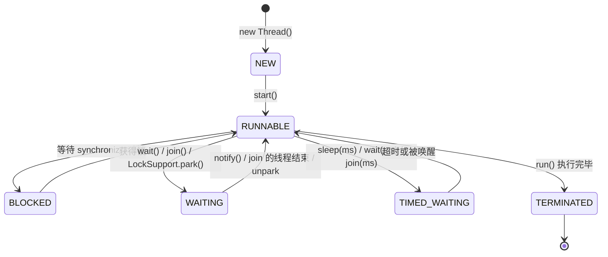

# 04 多线程基础

写过 C 的 pthreads，你对 `pthread_create`、互斥锁、条件变量已有肌肉记忆。好消息：这些概念在 Java 中全部存在且更易用；坏消息：Java 内存模型（JMM）引入了 C 程序员不常深究的新问题——可见性与有序性。本章从进程线程概念讲到 synchronized/volatile 两大基石，再到死锁排查，为下一章的并发包打底。

> 前置知识：[[java/1入门/09_循环结构|流程控制]]、[[java/2深入/03_集合框架深入|集合框架深入]]（并发容器的铺垫）。

---

## 一、进程与线程

### 1.1 概念速通

| 概念 | 定义 | 类比 |
|------|------|------|
| 进程 | 资源分配的最小单位，独立地址空间 | 一个正在运行的程序 |
| 线程 | CPU 调度的最小单位，共享所属进程的资源 | 程序内部的多条执行流 |

C 背景对照：

| 维度 | C (pthreads) | Java |
|------|--------------|------|
| 创建 | `pthread_create(&tid, attr, fn, arg)` | `new Thread(...).start()` |
| 等待结束 | `pthread_join(tid)` | `thread.join()` |
| 互斥锁 | `pthread_mutex_t` + lock/unlock | `synchronized` 关键字或 ReentrantLock |
| 条件变量 | `pthread_cond_wait/signal` | `Object.wait()/notify()` |
| 分离属性 | `PTHREAD_CREATE_DETACHED` | 默认非守护线程，`setDaemon(true)` 对应分离 |

本质上 JVM 的每个 Java 线程就是一个内核级线程（1:1 模型），Java 只是把它包装成了对象。这个包装在 JDK 21 被彻底革新——虚拟线程让"一个任务一个线程"变得可行（见 [[java/2深入/11_Java新特性|Java 新特性]]）。

---

## 二、创建线程的三种方式

### 2.1 完整示例

```java
import java.util.concurrent.Callable;
import java.util.concurrent.ExecutionException;
import java.util.concurrent.FutureTask;

public class ThreadCreation {
    public static void main(String[] args) throws Exception {

        // 方式一：继承 Thread，重写 run
        class ByExtend extends Thread {
            @Override
            public void run() {
                System.out.println("方式一：" + Thread.currentThread().getName());
            }
        }
        new ByExtend().start();

        // 方式二：实现 Runnable（推荐——任务与执行器解耦，还能交给线程池）
        Runnable task = () -> System.out.println(
            "方式二：" + Thread.currentThread().getName());
        new Thread(task, "worker-1").start();

        // 方式三：Callable + FutureTask —— 有返回值、能抛异常
        Callable<Integer> calc = () -> {
            Thread.sleep(100);              // 模拟耗时计算
            return 6 * 7;
        };
        FutureTask<Integer> future = new FutureTask<>(calc);
        new Thread(future, "worker-2").start();
        Integer result = future.get();      // 阻塞直到结果就绪
        System.out.println("方式三计算结果：" + result);

        // 主线程等待所有子线程结束再退出
        Thread.sleep(200);
    }
}
```

三种方式对比：

| 维度 | 继承 Thread | 实现 Runnable | Callable+FutureTask |
|------|-------------|---------------|---------------------|
| 返回值 | 无 | 无 | 有 |
| 异常 | 只能内部消化 | 只能内部消化 | 可抛出并由 get() 重放 |
| 耦合度 | 任务绑定线程 | 任务独立 | 任务独立 |
| 推荐度 | 不推荐（占用继承位） | 常规推荐 | 需要结果时使用 |

关键细节：调用 `start()` 才会开新线程；直接调 `run()` 只是普通方法调用。线程只能启动一次，重复 start 抛 `IllegalThreadStateException`。

---

## 三、线程生命周期：六种状态



| 状态 | 进入方式 | 与 pthreads 对照 |
|------|----------|------------------|
| NEW | 已创建未 start | 未 create |
| RUNNABLE | 就绪或正在运行（Java 合并了两态） | running/runnable |
| BLOCKED | 抢 synchronized 锁失败 | 等 mutex |
| WAITING | wait()/join()/park()，无限期等唤醒 | cond_wait |
| TIMED_WAITING | 带 timeout 的等待版本 | timedwait |
| TERMINATED | run 结束 | terminated |

注意区分：**BLOCKED 只针对 synchronized**；用 JUC 锁（ReentrantLock）等待时处于 WAITING。

---

## 四、synchronized：三种用法与 monitor 原理

### 4.1 三种用法

```java
public class SyncUsages {
    private int count = 0;
    private static int staticCount = 0;
    private final Object lock = new Object();   // 专用锁对象

    // 用法一：实例方法 —— 锁的是 this
    public synchronized void incr() {
        count++;
    }

    // 用法二：静态方法 —— 锁的是 Class 对象（全类唯一）
    public static synchronized void staticIncr() {
        staticCount++;
    }

    // 用法三：同步代码块 —— 锁任意对象，粒度最细
    public void batch(int times) {
        for (int i = 0; i < times; i++) {
            synchronized (lock) {       // 只锁临界区，循环体其余部分并行友好
                count++;
            }
            doOtherWork();
        }
    }

    private void doOtherWork() { /* ... */ }
}
```

| 用法 | 锁对象 | 保护范围 |
|------|--------|----------|
| 实例方法 | this | 实例级别的状态 |
| 静态方法 | XxxClass.class | 类级别（静态）状态，全 JVM 唯一 |
| 代码块 | 括号里指定的对象 | 自定义粒度，最灵活 |

### 4.2 monitor 原理

每个 Java 对象都关联一把内置锁（monitor）。编译后同步块的头尾是字节码指令 `monitorenter`/`monitorexit`；同步方法则是方法标志位 ACC_SYNCHRONIZED。底层依赖对象头 Mark Word 中的锁状态，JDK 6 后有锁升级路径：


锁只能升级不能降级（整体而言）。这就是"JDK 8 后 synchronized 性能不差"的原因——多数场景停留在偏向/轻量级阶段。（偏向锁在 JDK 15 后已默认废弃，因为维护成本高于收益，面试可作加分点提一句。）

### 4.3 经典示例：卖票问题

```java
public class TicketSeller {
    private int tickets = 100;

    public synchronized boolean sell() {
        if (tickets <= 0) {
            return false;                 // 卖完了
        }
        tickets--;
        return true;
    }

    public static void main(String[] args) throws InterruptedException {
        TicketSeller seller = new TicketSeller();

        Runnable job = () -> {
            while (true) {
                if (!seller.sell()) break;
            }
        };

        // 三个窗口并发卖同一批票
        Thread w1 = new Thread(job, "窗口1");
        Thread w2 = new Thread(job, "窗口2");
        Thread w3 = new Thread(job, "窗口3");
        w1.start(); w2.start(); w3.start();
        w1.join(); w2.join(); w3.join();

        System.out.println("剩余票数（必须为 0）：" + seller.tickets);
    }
}
```

把 `sell()` 的 synchronized 去掉跑一次，你会看到剩余票数为负——这就是竞态条件的现场演示。根源在于 `tickets--` 是三步操作（读-减-写），线程可能在任意两步之间被打断。

---

## 五、volatile：可见性与禁止重排

### 5.1 三大问题

并发 bug 的三大根源，全部源于 CPU 缓存与编译器优化的"好心"：

| 问题 | 含义 | 示例 |
|------|------|------|
| 原子性 | 操作不可分割，可能被中断穿插 | `count++` 非原子 |
| 可见性 | 一个线程的修改，另一个线程看不到 | 写线程改 flag，读线程死循环 |
| 有序性 | 指令重排导致逻辑顺序被打乱 | 双重检查锁的单例拿到半初始化对象 |

### 5.2 volatile 解决其中两个

```java
public class VolatileDemo {
    // 没有 volatile 时，读线程可能永远读到缓存里的 false，死循环
    private static volatile boolean running = true;

    // DCL 单例中 volatile 的第二个用途：防止指令重排
    private static volatile VolatileDemo instance;

    public static void main(String[] args) throws InterruptedException {
        Thread reader = new Thread(() -> {
            while (running) {
                // 忙等
            }
            System.out.println("reader 观察到停止信号");
        });
        reader.start();

        Thread.sleep(100);
        running = false;    // volatile 写：立即刷回主内存并使其他核心缓存失效
        reader.join();
        System.out.println("main 结束");
    }
}
```

volatile 的两层保证：

1. **可见性**：写 volatile 变量后立刻刷主内存，读它强制从主内存加载
2. **禁止重排**：通过内存屏障保证 happens-before 语义——volatile 写之前的所有普通写，对 volatile 读之后的代码可见

但它**不保证原子性**：`volatile int count; count++` 依然丢更新。要原子性请用 `AtomicInteger` 或锁。

happens-before 入门版：若 A 操作 happens-before B 操作，则 A 的结果对 B 可见。规则包括：程序顺序规则、monitor 锁的解锁先于加锁、volatile 写先于读、线程 start/join 等。这是理解 JMM 的钥匙，本章建立直觉即可。

---

## 六、sleep / wait / notify

### 6.1 三者区别（高频面试题）

| 维度 | Thread.sleep | Object.wait | Object.notify |
|------|--------------|-------------|----------------|
| 所属 | Thread 静态方法 | Object 实例方法 | Object 实例方法 |
| 释放锁 | **不释放** | **释放** monitor 锁 | 唤醒等待者 |
| 使用前提 | 任意处可调 | 必须持有该对象锁（在 synchronized 内） | 同左 |
| 唤醒方式 | 时间到自动恢复 | notify/notifyAll/中断 | —— |
| 所在类 | java.lang.Thread | java.lang.Object | java.lang.Object |

"wait 为什么定义在 Object 而不是 Thread？"——因为锁是对象级别的，等待的是"这个对象的监视器条件"，任何对象都可能成为锁。

### 6.2 标准的 wait/notify 范式

```java
import java.util.LinkedList;
import java.util.Queue;

public class WaitNotifyQueue {
    private final Queue<Integer> buffer = new LinkedList<>();
    private final int capacity = 5;

    public synchronized void produce(int item) throws InterruptedException {
        // 关键一：用 while 而不是 if——防止虚假唤醒与被抢锁后条件已变
        while (buffer.size() == capacity) {
            System.out.println("缓冲区满，生产者等待");
            wait();                     // 释放 this 锁，进入等待队列
        }
        buffer.offer(item);
        System.out.println("生产 " + item + "，当前库存 " + buffer.size());
        notifyAll();                    // 关键二：唤醒消费者
    }

    public synchronized int consume() throws InterruptedException {
        while (buffer.isEmpty()) {
            System.out.println("缓冲区空，消费者等待");
            wait();
        }
        int item = buffer.poll();
        System.out.println("消费 " + item + "，当前库存 " + buffer.size());
        notifyAll();
        return item;
    }

    public static void main(String[] args) {
        WaitNotifyQueue q = new WaitNotifyQueue();

        new Thread(() -> {
            for (int i = 1; i <= 10; i++) {
                try { q.produce(i); Thread.sleep(50); }
                catch (InterruptedException e) { return; }
            }
        }, "producer").start();

        new Thread(() -> {
            for (int i = 0; i < 10; i++) {
                try { q.consume(); Thread.sleep(120); }
                catch (InterruptedException e) { return; }
            }
        }, "consumer").start();
    }
}
```

两条铁律：**条件检查必须用 while；优先 notifyAll 而非 notify**（notify 只唤醒一个，若唤醒的恰好是同类线程会全员卡死）。

---

## 七、join、yield 与守护线程

```java
public class ThreadUtilsDemo {
    public static void main(String[] args) throws InterruptedException {
        // join：让主线程等子线程干完活再继续
        Thread worker = new Thread(() -> {
            try {
                Thread.sleep(300);
                System.out.println("worker 完成");
            } catch (InterruptedException e) { }
        });
        worker.start();
        System.out.println("main 先做自己的事");
        worker.join();          // 等价于循环 isAlive + wait，可带超时参数
        System.out.println("main 拿到结果继续");

        // yield：提示调度器"我可以让出 CPU"，仅是建议，几乎不该用于业务逻辑
        Thread.yield();

        // daemon：守护线程随 JVM 退出而消亡，适合后台心跳/监控类任务
        Thread daemon = new Thread(() -> {
            while (true) {
                try { Thread.sleep(500); }
                catch (InterruptedException e) { return; }
                // 注意：JVM 退出时不通知守护线程，不要用它写关键数据！
            }
        });
        daemon.setDaemon(true);     // 必须在 start 之前设置
        daemon.start();
        Thread.sleep(100);
        System.out.println("main 结束，JVM 退出，daemon 直接消亡");
    }
}
```

| API | 作用 | 使用建议 |
|------|------|----------|
| `t.join()` | 当前线程等待 t 结束 | 任务编排的基本手段 |
| `Thread.yield()` | 让出 CPU 的提示 | 测试代码偶用，业务禁用 |
| `setDaemon(true)` | 设为守护线程 | 后台辅助任务；不能持有关键资源 |

---

## 八、死锁：四条件与排查

### 8.1 制造一个死锁

```java
public class DeadlockDemo {
    static final Object FORK_A = new Object();
    static final Object FORK_B = new Object();

    public static void main(String[] args) throws InterruptedException {
        Thread p1 = new Thread(() -> {
            synchronized (FORK_A) {
                sleep(50);                       // 确保 p2 已拿到 B，制造交叉
                synchronized (FORK_B) {
                    System.out.println("p1 同时拿到两把叉");
                }
            }
        });
        Thread p2 = new Thread(() -> {
            synchronized (FORK_B) {              // 加锁顺序相反！
                synchronized (FORK_A) {
                    System.out.println("p2 同时拿到两把叉");
                }
            }
        });
        p1.start(); p2.start();
        p1.join(); p2.join();
        System.out.println("永远走不到这里");
    }

    static void sleep(long ms) {
        try { Thread.sleep(ms); } catch (InterruptedException e) { }
    }
}
```

### 8.2 死锁四条件（Coffman）

| 条件 | 含义 | 打破手段 |
|------|------|----------|
| 互斥 | 资源一次只能一人使用 | 无锁结构/CAS |
| 持有并等待 | 抱着已有资源去要新的 | **一次性申请所有资源** |
| 不可剥夺 | 锁不能被强行抢走 | `tryLock(timeout)` 失败就放弃重来 |
| 循环等待 | 形成环形依赖链 | **全局固定加锁顺序**（最常用） |

实战中最有效的两条：统一加锁顺序、用 tryLock 设置超时。

### 8.3 jstack 排查实战

程序疑似卡死时：

```text
# 1. 找到 Java 进程号
jps -l

# 2. 导出线程快照（或直接 jstack <pid>）
jstack <pid> > thread.dump

# 3. 在 dump 中搜索关键字，jstack 甚至直接给出结论：
# Found one Java-level deadlock:
# "Thread-0":
#   waiting to lock object 0x... (a Object) which is held by "Thread-1"
```

`jstack` 会自动检测死锁并在末尾输出 `Found one Java-level deadlock` 及互相持有的锁信息。图形化工具（IDEA / VisualVM / JConsole）也能一键检测。更多命令行工具见 [[java/2深入/07_JVM调优|JVM 调优]]。

预防性设计清单：

- 锁的获取顺序全项目统一（如按对象 id 排序后加锁）
- 缩小临界区，锁内绝不调用未知的外部方法
- 能用无锁并发容器就不自己加锁
- 高风险路径加超时与重试

---

## 九、小结

| 知识点 | 一句话 |
|--------|--------|
| 创建方式 | Runnable 为主，要返回值用 Callable+FutureTask |
| 六状态 | NEW/RUNNABLE/BLOCKED/WAITING/TIMED_WAITING/TERMINATED |
| synchronized | 方法锁 this、静态锁 Class、块锁自定义对象；底层 monitor + 锁升级 |
| volatile | 保可见性与有序性，不保原子性 |
| wait vs sleep | wait 放锁且需持锁，sleep 不放锁随处可用 |
| 死锁 | 四条件破其一即可，首选固定加锁顺序 + jstack 排查 |

---

## LeetCode 巩固

多线程题是 Java 面试特色题型，LeetCode 并发专区专门考察信号量与顺序控制：

| 题目 | 链接 | 练习点 |
|------|------|--------|
| 按序打印 | [print-in-order](https://leetcode.cn/problems/print-in-order/) | Semaphore 或 CountDownLatch 控制执行顺序的最简模型 |
| 交替打印 FooBar | [交替打印 FooBar](https://leetcode.cn/problems/print-foobar-alternately/) | 两个信号量乒乓交替，wait/notify 版本也值得各写一遍 |
| 生产者消费者简化版 | 参考 [打印零与奇偶数](https://leetcode.cn/problems/print-zero-even-odd/) | 多方协调的 wait/notify 综合，对应本章第六节缓冲区模型 |

下一章把这些原语升级为工业级工具：线程池与并发包。
