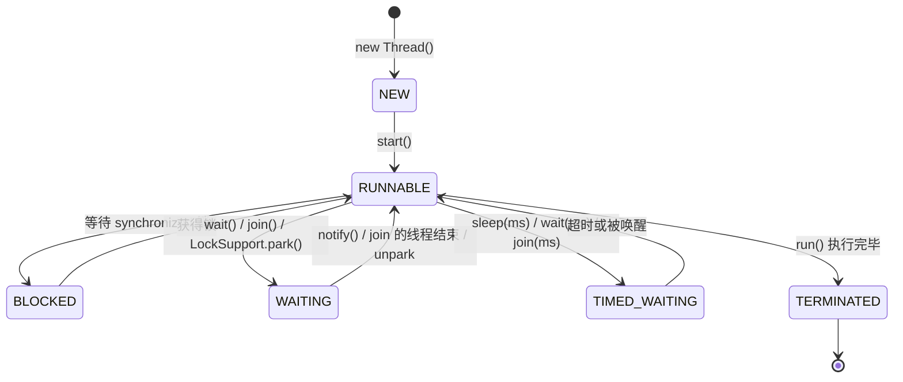
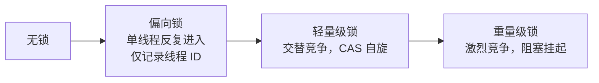

# 04 多线程基础

写过 C 的 pthreads，你对 `pthread_create`、互斥锁、条件变量已有肌肉记忆。好消息：这些概念在 Java 中全部存在且更易用；坏消息：Java 内存模型（JMM）引入了 C 程序员不常深究的新问题——可见性与有序性。本章从进程线程概念讲到 synchronized/volatile 两大基石，再到死锁排查，为下一章的并发包打底。

> 前置知识：[[java/1入门/09_循环结构|流程控制]]、[[java/2深入/03_集合框架深入|集合框架深入]]（并发容器的铺垫）。

---

## 一、进程与线程

### 1.1 概念速通

| 概念 | 定义 | 类比 |
|------|------|------|
| 进程 | 资源分配的最小单位，独立地址空间 | 一个正在运行的程序 |
| 线程 | CPU 调度的最小单位，共享所属进程的资源 | 程序内部的多条执行流 |

C 背景对照：

| 维度 | C (pthreads) | Java |
|------|--------------|------|
| 创建 | `pthread_create(&tid, attr, fn, arg)` | `new Thread(...).start()` |
| 等待结束 | `pthread_join(tid)` | `thread.join()` |
| 互斥锁 | `pthread_mutex_t` + lock/unlock | `synchronized` 关键字或 ReentrantLock |
| 条件变量 | `pthread_cond_wait/signal` | `Object.wait()/notify()` |
| 分离属性 | `PTHREAD_CREATE_DETACHED` | 默认非守护线程，`setDaemon(true)` 对应分离 |

本质上 JVM 的每个 Java 线程就是一个内核级线程（1:1 模型），Java 只是把它包装成了对象。这个包装在 JDK 21 被彻底革新——虚拟线程让"一个任务一个线程"变得可行（见 [[java/2深入/11_Java新特性|Java 新特性]]）。

**为什么 Java 的线程模型是 1:1？**

JVM 选择 1:1 模型（一个 Java 线程对应一个内核线程）而非 N:M 模型（多个用户线程映射到少量内核线程），是因为 1:1 模型最简单、最可靠：内核调度器直接管理所有线程，不存在用户态调度器的复杂性；一个线程阻塞（如 I/O）不影响其他线程；多核 CPU 的并行度天然最大化。代价是线程创建/切换成本较高（需要陷入内核态），但在 JDK 21 虚拟线程出现之前，这个代价被认为是值得的。

---

## 二、创建线程的三种方式

### 2.1 完整示例

```java
import java.util.concurrent.Callable;
import java.util.concurrent.ExecutionException;
import java.util.concurrent.FutureTask;

public class ThreadCreation {
    public static void main(String[] args) throws Exception {

        // 方式一：继承 Thread，重写 run
        class ByExtend extends Thread {
            @Override
            public void run() {
                System.out.println("方式一：" + Thread.currentThread().getName());
            }
        }
        new ByExtend().start();

        // 方式二：实现 Runnable（推荐——任务与执行器解耦，还能交给线程池）
        Runnable task = () -> System.out.println(
            "方式二：" + Thread.currentThread().getName());
        new Thread(task, "worker-1").start();

        // 方式三：Callable + FutureTask —— 有返回值、能抛异常
        Callable<Integer> calc = () -> {
            Thread.sleep(100);              // 模拟耗时计算
            return 6 * 7;
        };
        FutureTask<Integer> future = new FutureTask<>(calc);
        new Thread(future, "worker-2").start();
        Integer result = future.get();      // 阻塞直到结果就绪
        System.out.println("方式三计算结果：" + result);

        // 主线程等待所有子线程结束再退出
        Thread.sleep(200);
    }
}
```

三种方式对比：

| 维度 | 继承 Thread | 实现 Runnable | Callable+FutureTask |
|------|-------------|---------------|---------------------|
| 返回值 | 无 | 无 | 有 |
| 异常 | 只能内部消化 | 只能内部消化 | 可抛出并由 get() 重放 |
| 耦合度 | 任务绑定线程 | 任务独立 | 任务独立 |
| 推荐度 | 不推荐（占用继承位） | 常规推荐 | 需要结果时使用 |

关键细节：调用 `start()` 才会开新线程；直接调 `run()` 只是普通方法调用。线程只能启动一次，重复 start 抛 `IllegalThreadStateException`。

---

## 三、线程生命周期：六种状态



| 状态 | 进入方式 | 与 pthreads 对照 |
|------|----------|------------------|
| NEW | 已创建未 start | 未 create |
| RUNNABLE | 就绪或正在运行（Java 合并了两态） | running/runnable |
| BLOCKED | 抢 synchronized 锁失败 | 等 mutex |
| WAITING | wait()/join()/park()，无限期等唤醒 | cond_wait |
| TIMED_WAITING | 带 timeout 的等待版本 | timedwait |
| TERMINATED | run 结束 | terminated |

注意区分：**BLOCKED 只针对 synchronized**；用 JUC 锁（ReentrantLock）等待时处于 WAITING。

### 3.1 状态转换详解

```text
NEW（新建）:
  Thread t = new Thread(...)  →  状态为 NEW
  此时线程只是一个 Java 对象，操作系统还未创建真正的线程

RUNNABLE（就绪/运行）:
  t.start()  →  状态变为 RUNNABLE
  Java 的 RUNNABLE 合并了操作系统的 ready 和 running 两种状态
  具体是否在 CPU 上执行，取决于操作系统调度器

BLOCKED（阻塞）:
  进入：synchronized 代码块/方法时，锁被其他线程持有
  退出：获得锁
  注意：只有 synchronized 才会进入此状态

WAITING（等待）:
  进入：Object.wait()（无超时）、Thread.join()（无超时）、LockSupport.park()
  退出：被 notify()/unpark() 唤醒
  线程在这里"无限期"等待，直到被唤醒

TIMED_WAITING（超时等待）:
  进入：Thread.sleep(ms)、Object.wait(ms)、Thread.join(ms)
  退出：超时时间到 或 被唤醒
  与 WAITING 的区别是"有超时兜底"

TERMINATED（终止）:
  run() 方法执行完毕 或 抛出未捕获异常
  线程不可重新 start()
```

**为什么 Java 要区分 BLOCKED 和 WAITING？**

这两个状态的区别在于"你在等什么"。BLOCKED 是在等锁——其他线程持有一把 synchronized 锁，你只能等它释放。WAITING 是在等条件——你主动调用 `wait()` 让出锁并等待通知，或者调用 `Thread.sleep()` 让出 CPU。jstack 看到线程处于 BLOCKED 意味着"有锁竞争"，处于 WAITING 意味着"在等某件事发生"。排查问题时这个区分非常关键。

---

## 四、synchronized：三种用法与 monitor 原理

### 4.1 三种用法

```java
public class SyncUsages {
    private int count = 0;
    private static int staticCount = 0;
    private final Object lock = new Object();   // 专用锁对象

    // 用法一：实例方法 —— 锁的是 this
    public synchronized void incr() {
        count++;
    }

    // 用法二：静态方法 —— 锁的是 Class 对象（全类唯一）
    public static synchronized void staticIncr() {
        staticCount++;
    }

    // 用法三：同步代码块 —— 锁任意对象，粒度最细
    public void batch(int times) {
        for (int i = 0; i < times; i++) {
            synchronized (lock) {       // 只锁临界区，循环体其余部分并行友好
                count++;
            }
            doOtherWork();
        }
    }

    private void doOtherWork() { /* ... */ }
}
```

| 用法 | 锁对象 | 保护范围 |
|------|--------|----------|
| 实例方法 | this | 实例级别的状态 |
| 静态方法 | XxxClass.class | 类级别（静态）状态，全 JVM 唯一 |
| 代码块 | 括号里指定的对象 | 自定义粒度，最灵活 |

### 4.2 monitor 原理

每个 Java 对象都关联一把内置锁（monitor）。编译后同步块的头尾是字节码指令 `monitorenter`/`monitorexit`；同步方法则是方法标志位 ACC_SYNCHRONIZED。底层依赖对象头 Mark Word 中的锁状态，JDK 6 后有锁升级路径：



锁只能升级不能降级（整体而言）。这就是"JDK 8 后 synchronized 性能不差"的原因——多数场景停留在偏向/轻量级阶段。（偏向锁在 JDK 15 后已默认废弃，因为维护成本高于收益，面试可作加分点提一句。）

### 4.3 锁升级过程详解

```text
无锁状态:
  Mark Word 存放: hashCode + 分代年龄 + 锁标志(01)
  任何对象创建后默认无锁

偏向锁（JDK 8 默认开启，JDK 15 默认关闭）:
  触发: 第一个线程进入 synchronized 块
  Mark Word 变为: 线程ID + 分代年龄 + 锁标志(01)
  同一线程再次进入时，只需比对线程ID（无CAS、无系统调用）
  适用场景: 只有一个线程反复进入的同步块
  弊端: 撤销偏向锁需要 STW，多线程交替进入时反而增加开销

轻量级锁:
  触发: 偏向锁被第二个线程竞争时撤销，升级为轻量级锁
  Mark Word 变为: 指向栈帧锁记录的指针 + 锁标志(00)
  竞争线程 CAS 自旋尝试获取锁（不阻塞，不陷入内核）
  适用场景: 线程交替进入同步块（无实际竞争）
  弊端: 长时间自旋浪费 CPU

重量级锁:
  触发: 自旋超过阈值（默认自适应自旋）或竞争激烈
  Mark Word 变为: 指向 monitor 对象的指针 + 锁标志(10)
  未获得锁的线程被操作系统挂起（上下文切换，代价高）
  适用场景: 激烈竞争
  优势: 不浪费 CPU 自旋，等待线程被真正挂起
```

### 4.4 经典示例：卖票问题

```java
public class TicketSeller {
    private int tickets = 100;

    public synchronized boolean sell() {
        if (tickets <= 0) {
            return false;                 // 卖完了
        }
        tickets--;
        return true;
    }

    public static void main(String[] args) throws InterruptedException {
        TicketSeller seller = new TicketSeller();

        Runnable job = () -> {
            while (true) {
                if (!seller.sell()) break;
            }
        };

        // 三个窗口并发卖同一批票
        Thread w1 = new Thread(job, "窗口1");
        Thread w2 = new Thread(job, "窗口2");
        Thread w3 = new Thread(job, "窗口3");
        w1.start(); w2.start(); w3.start();
        w1.join(); w2.join(); w3.join();

        System.out.println("剩余票数（必须为 0）：" + seller.tickets);
    }
}
```

把 `sell()` 的 synchronized 去掉跑一次，你会看到剩余票数为负——这就是竞态条件的现场演示。根源在于 `tickets--` 是三步操作（读-减-写），线程可能在任意两步之间被打断。

---

## 五、synchronized vs ReentrantLock

### 5.1 对比总表

| 维度 | synchronized | ReentrantLock |
|------|-------------|---------------|
| 获取锁方式 | 自动获取 | 手动 lock() |
| 释放锁方式 | 自动释放 | 手动 unlock()（必须在 finally 中） |
| 可中断 | 不可中断 | lockInterruptibly() 可中断 |
| 超时获取 | 不支持 | tryLock(timeout) 支持 |
| 公平锁 | 非公平 | 可选公平/非公平 |
| 条件变量 | 只有一个等待队列（wait/notify） | 可创建多个 Condition |
| 锁升级 | 支持偏向→轻量→重量 | 无锁升级（直接 CAS + 阻塞） |
| 性能 | JDK 6+ 已优化，常规场景持平 | 高竞争场景略优 |

### 5.2 ReentrantLock 完整示例

```java
import java.util.concurrent.locks.ReentrantLock;
import java.util.concurrent.locks.Condition;
import java.util.LinkedList;
import java.util.Queue;

public class ReentrantLockDemo {

    private final ReentrantLock lock = new ReentrantLock(true);  // true = 公平锁
    private final Condition notFull = lock.newCondition();
    private final Condition notEmpty = lock.newCondition();
    private final Queue<Integer> buffer = new LinkedList<>();
    private final int capacity = 5;

    public void produce(int item) throws InterruptedException {
        lock.lock();
        try {
            while (buffer.size() == capacity) {
                notFull.await();    // 缓冲区满，等待消费者唤醒
            }
            buffer.offer(item);
            System.out.println("生产 " + item + "，库存 " + buffer.size());
            notEmpty.signal();      // 唤醒消费者
        } finally {
            lock.unlock();         // 必须在 finally 中释放！
        }
    }

    public int consume() throws InterruptedException {
        lock.lock();
        try {
            while (buffer.isEmpty()) {
                notEmpty.await();   // 缓冲区空，等待生产者唤醒
            }
            int item = buffer.poll();
            System.out.println("消费 " + item + "，库存 " + buffer.size());
            notFull.signal();       // 唤醒生产者
            return item;
        } finally {
            lock.unlock();
        }
    }

    public static void main(String[] args) {
        ReentrantLockDemo demo = new ReentrantLockDemo();

        new Thread(() -> {
            for (int i = 1; i <= 10; i++) {
                try { demo.produce(i); Thread.sleep(50); }
                catch (InterruptedException e) { return; }
            }
        }, "producer").start();

        new Thread(() -> {
            for (int i = 0; i < 10; i++) {
                try { demo.consume(); Thread.sleep(120); }
                catch (InterruptedException e) { return; }
            }
        }, "consumer").start();
    }
}
```

### 5.3 什么时候选 ReentrantLock？

```text
选择 synchronized:
  ✓ 简单的同步需求（保护一块临界区）
  ✓ 不需要中断/超时/公平性
  ✓ 代码块较短，不会长时间持有锁
  ✓ 熟悉 JVM 优化（偏向锁、轻量级锁）

选择 ReentrantLock:
  ✓ 需要 tryLock() 超时获取（避免死锁）
  ✓ 需要 lockInterruptibly() 响应中断
  ✓ 需要公平锁（按等待顺序获取）
  ✓ 需要多个 Condition 精确唤醒
  ✓ 需要获取锁的状态信息（isLocked/getHoldCount）
```

**为什么 Java 要提供两种锁？**

synchronized 是 JVM 内置的关键字，使用简单但功能有限。ReentrantLock 是 java.util.concurrent 包中的类，功能更丰富但使用更复杂（必须手动 unlock）。这不是设计失误，而是**渐进式暴露复杂度**的策略：大多数场景用 synchronized 就够了，需要高级功能时再用 ReentrantLock。两者底层都基于 AQS（AbstractQueuedSynchronizer），性能差异在 JDK 6+ 后已经很小。

---

## 六、volatile：可见性与禁止重排

### 6.1 三大问题

并发 bug 的三大根源，全部源于 CPU 缓存与编译器优化的"好心"：

| 问题 | 含义 | 示例 |
|------|------|------|
| 原子性 | 操作不可分割，可能被中断穿插 | `count++` 非原子 |
| 可见性 | 一个线程的修改，另一个线程看不到 | 写线程改 flag，读线程死循环 |
| 有序性 | 指令重排导致逻辑顺序被打乱 | 双重检查锁的单例拿到半初始化对象 |

### 6.2 volatile 解决其中两个

```java
public class VolatileDemo {
    // 没有 volatile 时，读线程可能永远读到缓存里的 false，死循环
    private static volatile boolean running = true;

    // DCL 单例中 volatile 的第二个用途：防止指令重排
    private static volatile VolatileDemo instance;

    public static void main(String[] args) throws InterruptedException {
        Thread reader = new Thread(() -> {
            while (running) {
                // 忙等
            }
            System.out.println("reader 观察到停止信号");
        });
        reader.start();

        Thread.sleep(100);
        running = false;    // volatile 写：立即刷回主内存并使其他核心缓存失效
        reader.join();
        System.out.println("main 结束");
    }
}
```

volatile 的两层保证：

1. **可见性**：写 volatile 变量后立刻刷主内存，读它强制从主内存加载
2. **禁止重排**：通过内存屏障保证 happens-before 语义——volatile 写之前的所有普通写，对 volatile 读之后的代码可见

但它**不保证原子性**：`volatile int count; count++` 依然丢更新。要原子性请用 `AtomicInteger` 或锁。

### 6.3 volatile 的底层原理：内存屏障

```text
内存屏障 (Memory Barrier):
┌──────────────────────────────────────────────┐
│  CPU 为了性能，会重排指令、缓存数据             │
│  内存屏障强制"禁止重排"和"刷新缓存"             │
│                                               │
│  volatile 写操作后插入 StoreStore + StoreLoad  │
│  volatile 读操作前插入 LoadLoad + LoadStore    │
│                                               │
│  效果:                                         │
│  写 volatile 前的普通写 → 对其他线程立即可见      │
│  读 volatile 后的普通读 → 能看到之前的写          │
│                                               │
│  CPU 级别实现:                                  │
│  x86: lock 前缀指令（兼做原子性保证）            │
│  ARM: dmb 指令                                 │
└──────────────────────────────────────────────┘
```

### 6.4 volatile 的典型使用场景

```java
// 场景一：状态标志
private volatile boolean shutdownRequested = false;

public void shutdown() {
    shutdownRequested = true;
}

public void run() {
    while (!shutdownRequested) {
        // 工作循环
    }
}

// 场景二：双重检查锁定 (DCL) 单例
public class Singleton {
    private static volatile Singleton instance;

    public static Singleton getInstance() {
        if (instance == null) {              // 第一次检查（无锁）
            synchronized (Singleton.class) {
                if (instance == null) {      // 第二次检查（有锁）
                    instance = new Singleton(); // volatile 防止重排序
                }
            }
        }
        return instance;
    }
}

// 场景三：一次性安全发布
private volatile Config config;

public Config getConfig() {
    return config;  // 其他线程看到非 null 的 config 时，其内部字段一定已初始化完成
}
```

**DCL 中 volatile 为什么必要？**

`instance = new Singleton()` 不是原子操作，实际分三步：①分配内存 ②初始化对象 ③将引用指向内存。JVM 可能重排为 ①→③→②。如果没有 volatile，另一个线程可能在 ③ 执行后、② 执行前看到非 null 的 instance，拿到一个半初始化的对象。volatile 的禁止重排保证了 ①②③ 的执行顺序。

happen-before 入门版：若 A 操作 happens-before B 操作，则 A 的结果对 B 可见。规则包括：程序顺序规则、monitor 锁的解锁先于加锁、volatile 写先于读、线程 start/join 等。这是理解 JMM 的钥匙，本章建立直觉即可。

---

## 七、ThreadLocal：用法与陷阱

### 7.1 基本用法

```java
public class ThreadLocalDemo {
    // 每个线程独立的 SimpleDateFormat 实例
    // SimpleDateFormat 非线程安全，不能共享
    private static final ThreadLocal<SimpleDateFormat> DATE_FORMAT =
        ThreadLocal.withInitial(() -> new SimpleDateFormat("yyyy-MM-dd"));

    public static String formatDate(Date date) {
        return DATE_FORMAT.get().format(date);
    }

    public static void main(String[] args) {
        // 多个线程并发格式化，互不干扰
        for (int i = 0; i < 5; i++) {
            new Thread(() -> {
                String result = formatDate(new Date());
                System.out.println(Thread.currentThread().getName() + ": " + result);
            }, "t" + i).start();
        }
    }
}
```

### 7.2 ThreadLocal 的存储原理

```text
每个线程内部维护一个 ThreadLocalMap:
┌─────────────────────────────────┐
│  Thread 对象                     │
│  ├── threadLocals: ThreadLocalMap │
│  │   ├── Entry[0]:               │
│  │   │   key: ThreadLocal 对象(弱引用) │
│  │   │   value: 实际存储的值       │
│  │   ├── Entry[1]:               │
│  │   │   key: 另一个 ThreadLocal   │
│  │   │   value: 另一个值          │
│  │   └── ...                     │
│  └── ...                         │
└─────────────────────────────────┘

key 是 ThreadLocal 对象的弱引用（WeakReference）
value 是你实际 set 的对象（强引用）
```

### 7.3 ThreadLocal 的内存泄漏问题

```java
public class ThreadLocalLeakDemo {
    // 线程池中使用 ThreadLocal 是高危操作
    private static final ExecutorService pool = Executors.newFixedThreadPool(10);
    private static final ThreadLocal<byte[]> BUFFER = new ThreadLocal<>();

    public static void process() {
        BUFFER.set(new byte[1024 * 1024]);  // 1MB
        try {
            // 业务处理...
        } finally {
            BUFFER.remove();  // 必须清理！
        }
    }

    public static void main(String[] args) {
        // 错误示例：忘记 remove
        pool.submit(() -> {
            BUFFER.set(new byte[1024 * 1024]);
            // 处理完毕...
            // 没有 remove()！
            // 线程被回收到池中，ThreadLocal 被 GC 回收
            // 但 Entry 的 value 仍被 Thread 强引用，无法回收
            // 1MB 泄漏，线程复用 N 次就泄漏 N MB
        });
    }
}
```

泄漏根因分析：

```text
正常流程:
  set() → ThreadLocalMap.put() → Entry(key=弱引用, value=强引用)
  remove() → Entry 被删除 → value 可被 GC

泄漏流程:
  set() → Entry 存入 ThreadLocalMap
  线程池回收线程 → Thread 对象存活
  ThreadLocal 对象被 GC → key 变为 null
  但 Entry 的 value 仍被 Thread.threadLocals 强引用
  → value 无法被 GC → 内存泄漏

为什么 key 用弱引用？
  如果 key 是强引用，ThreadLocal 对象永远不会被 GC
  → ThreadLocalMap 永远增长 → 更严重的泄漏
  弱引用让 ThreadLocal 对象可以被 GC
  → key 变为 null → 后续 get/set 时可以清理这些"垃圾 Entry"
```

### 7.4 ThreadLocal 最佳实践

```java
// 1. 用完必须 remove()（在 finally 中）
try {
    threadLocal.set(value);
    // 业务逻辑...
} finally {
    threadLocal.remove();
}

// 2. 线程池场景必须 remove（线程复用 = ThreadLocal 复用）
// 3. 尽量用 ThreadLocal.withInitial() 而非 init-value，懒加载
// 4. 考虑用 InheritableThreadLocal 在父子线程间传递值
// 5. 考虑用 ScopedValue（JDK 21+）替代 ThreadLocal
```

**为什么 ThreadLocal 用弱引用做 key？**

如果 ThreadLocalMap 的 Entry 用强引用指向 key（ThreadLocal 对象），那么只要 Entry 存在，ThreadLocal 对象就永远无法被 GC。当 ThreadLocal 不再被外部引用时，它应该被回收，但强引用阻止了这一点。弱引用让 ThreadLocal 对象在没有外部引用时可以被 GC，Entry 的 key 变为 null。后续的 `get()`/`set()` 操作会清理这些 key 为 null 的 Entry，防止无限增长。这是**弱引用**在实际框架中的典型应用。

---

## 八、CompletableFuture 异步编程

### 8.1 基本用法

```java
import java.util.concurrent.CompletableFuture;

public class CompletableFutureDemo {

    public static void main(String[] args) {
        // 基本异步执行
        CompletableFuture<String> future = CompletableFuture.supplyAsync(() -> {
            // 异步执行耗时操作
            try { Thread.sleep(1000); } catch (InterruptedException e) {}
            return "Hello";
        });

        // 链式调用
        CompletableFuture<String> result = CompletableFuture
            .supplyAsync(() -> "Hello")
            .thenApply(s -> s + " World")           // 同步转换
            .thenApplyAsync(s -> s + "!")            // 异步转换
            .thenAccept(s -> System.out.println(s)); // 消费结果

        // 组合多个异步任务
        CompletableFuture<String> userFuture = CompletableFuture
            .supplyAsync(() -> fetchUser(1));
        CompletableFuture<Double> priceFuture = CompletableFuture
            .supplyAsync(() -> fetchPrice(1));

        // 两个任务都完成后组合结果
        CompletableFuture<String> combined = userFuture
            .thenCombine(priceFuture,
                (user, price) -> user + " - " + price);

        System.out.println(combined.join());
    }

    static String fetchUser(int id) {
        try { Thread.sleep(500); } catch (InterruptedException e) {}
        return "User-" + id;
    }

    static double fetchPrice(int id) {
        try { Thread.sleep(800); } catch (InterruptedException e) {}
        return 99.9;
    }
}
```

### 8.2 异常处理

```java
public class CompletableFutureErrorHandling {

    public static void main(String[] args) {
        // 方式一： exceptionally（类似 catch）
        CompletableFuture<String> future = CompletableFuture
            .supplyAsync(() -> {
                if (true) throw new RuntimeException("出错了");
                return "OK";
            })
            .exceptionally(ex -> {
                System.out.println("捕获异常: " + ex.getMessage());
                return "默认值";
            });

        // 方式二：handle（类似 try-catch-finally）
        CompletableFuture<String> future2 = CompletableFuture
            .supplyAsync(() -> "data")
            .handle((result, ex) -> {
                if (ex != null) {
                    return "错误恢复: " + ex.getMessage();
                }
                return "成功: " + result;
            });

        // 方式三：超时控制（JDK 9+）
        CompletableFuture<String> future3 = CompletableFuture
            .supplyAsync(() -> {
                try { Thread.sleep(5000); } catch (InterruptedException e) {}
                return "慢结果";
            })
            .orTimeout(2, java.util.concurrent.TimeUnit.SECONDS)
            .exceptionally(ex -> "超时默认值");
    }
}
```

### 8.3 实战模式：并行查询后合并

```java
public class ParallelQueryExample {

    record Product(String name, double price, String description) {}

    public static void main(String[] args) {
        long start = System.currentTimeMillis();

        // 三个数据源并行查询
        CompletableFuture<String> nameFuture = CompletableFuture
            .supplyAsync(() -> {
                sleep(300);
                return "iPhone 15";
            });

        CompletableFuture<Double> priceFuture = CompletableFuture
            .supplyAsync(() -> {
                sleep(500);
                return 7999.0;
            });

        CompletableFuture<String> descFuture = CompletableFuture
            .supplyAsync(() -> {
                sleep(400);
                return "A17 芯片，钛金属边框";
            });

        // allOf 等待全部完成
        CompletableFuture<Void> allDone = CompletableFuture.allOf(
            nameFuture, priceFuture, descFuture);

        // join 获取结果
        Product product = allDone.thenApply(v ->
            new Product(nameFuture.join(), priceFuture.join(), descFuture.join())
        ).join();

        long elapsed = System.currentTimeMillis() - start;
        System.out.println("产品: " + product);
        System.out.println("耗时: " + elapsed + "ms (串行需1200ms，并行只需500ms)");
    }

    static void sleep(long ms) {
        try { Thread.sleep(ms); } catch (InterruptedException e) {}
    }
}
```

**为什么 CompletableFuture 比 Future 更好？**

原始 `Future` 只有 `get()`（阻塞等待）和 `isDone()`（轮询检查），无法组合多个 Future、无法在完成时回调、无法处理异常。`CompletableFuture` 引入了函数式编程的链式风格：`thenApply`（转换结果）、`thenCompose`（扁平化嵌套）、`thenCombine`（组合结果）、`exceptionally`（处理异常）。这是从"拉模式"（调用方阻塞拉取结果）到"推模式"（结果就绪时主动推送）的转变，更符合异步编程的心智模型。

---

## 九、sleep / wait / notify

### 9.1 三者区别（高频面试题）

| 维度 | Thread.sleep | Object.wait | Object.notify |
|------|--------------|-------------|----------------|
| 所属 | Thread 静态方法 | Object 实例方法 | Object 实例方法 |
| 释放锁 | **不释放** | **释放** monitor 锁 | 唤醒等待者 |
| 使用前提 | 任意处可调 | 必须持有该对象锁（在 synchronized 内） | 同左 |
| 唤醒方式 | 时间到自动恢复 | notify/notifyAll/中断 | —— |
| 所在类 | java.lang.Thread | java.lang.Object | java.lang.Object |

"wait 为什么定义在 Object 而不是 Thread？"——因为锁是对象级别的，等待的是"这个对象的监视器条件"，任何对象都可能成为锁。

### 9.2 标准的 wait/notify 范式

```java
import java.util.LinkedList;
import java.util.Queue;

public class WaitNotifyQueue {
    private final Queue<Integer> buffer = new LinkedList<>();
    private final int capacity = 5;

    public synchronized void produce(int item) throws InterruptedException {
        // 关键一：用 while 而不是 if——防止虚假唤醒与被抢锁后条件已变
        while (buffer.size() == capacity) {
            System.out.println("缓冲区满，生产者等待");
            wait();                     // 释放 this 锁，进入等待队列
        }
        buffer.offer(item);
        System.out.println("生产 " + item + "，当前库存 " + buffer.size());
        notifyAll();                    // 关键二：唤醒消费者
    }

    public synchronized int consume() throws InterruptedException {
        while (buffer.isEmpty()) {
            System.out.println("缓冲区空，消费者等待");
            wait();
        }
        int item = buffer.poll();
        System.out.println("消费 " + item + "，当前库存 " + buffer.size());
        notifyAll();
        return item;
    }

    public static void main(String[] args) {
        WaitNotifyQueue q = new WaitNotifyQueue();

        new Thread(() -> {
            for (int i = 1; i <= 10; i++) {
                try { q.produce(i); Thread.sleep(50); }
                catch (InterruptedException e) { return; }
            }
        }, "producer").start();

        new Thread(() -> {
            for (int i = 0; i < 10; i++) {
                try { q.consume(); Thread.sleep(120); }
                catch (InterruptedException e) { return; }
            }
        }, "consumer").start();
    }
}
```

两条铁律：**条件检查必须用 while；优先 notifyAll 而非 notify**（notify 只唤醒一个，若唤醒的恰好是同类线程会全员卡死）。

---

## 十、join、yield 与守护线程

```java
public class ThreadUtilsDemo {
    public static void main(String[] args) throws InterruptedException {
        // join：让主线程等子线程干完活再继续
        Thread worker = new Thread(() -> {
            try {
                Thread.sleep(300);
                System.out.println("worker 完成");
            } catch (InterruptedException e) { }
        });
        worker.start();
        System.out.println("main 先做自己的事");
        worker.join();          // 等价于循环 isAlive + wait，可带超时参数
        System.out.println("main 拿到结果继续");

        // yield：提示调度器"我可以让出 CPU"，仅是建议，几乎不该用于业务逻辑
        Thread.yield();

        // daemon：守护线程随 JVM 退出而消亡，适合后台心跳/监控类任务
        Thread daemon = new Thread(() -> {
            while (true) {
                try { Thread.sleep(500); }
                catch (InterruptedException e) { return; }
                // 注意：JVM 退出时不通知守护线程，不要用它写关键数据！
            }
        });
        daemon.setDaemon(true);     // 必须在 start 之前设置
        daemon.start();
        Thread.sleep(100);
        System.out.println("main 结束，JVM 退出，daemon 直接消亡");
    }
}
```

| API | 作用 | 使用建议 |
|------|------|----------|
| `t.join()` | 当前线程等待 t 结束 | 任务编排的基本手段 |
| `Thread.yield()` | 让出 CPU 的提示 | 测试代码偶用，业务禁用 |
| `setDaemon(true)` | 设为守护线程 | 后台辅助任务；不能持有关键资源 |

---

## 十一、死锁：四条件与排查

### 11.1 制造一个死锁

```java
public class DeadlockDemo {
    static final Object FORK_A = new Object();
    static final Object FORK_B = new Object();

    public static void main(String[] args) throws InterruptedException {
        Thread p1 = new Thread(() -> {
            synchronized (FORK_A) {
                sleep(50);                       // 确保 p2 已拿到 B，制造交叉
                synchronized (FORK_B) {
                    System.out.println("p1 同时拿到两把叉");
                }
            }
        });
        Thread p2 = new Thread(() -> {
            synchronized (FORK_B) {              // 加锁顺序相反！
                synchronized (FORK_A) {
                    System.out.println("p2 同时拿到两把叉");
                }
            }
        });
        p1.start(); p2.start();
        p1.join(); p2.join();
        System.out.println("永远走不到这里");
    }

    static void sleep(long ms) {
        try { Thread.sleep(ms); } catch (InterruptedException e) { }
    }
}
```

### 11.2 死锁四条件（Coffman）

| 条件 | 含义 | 打破手段 |
|------|------|----------|
| 互斥 | 资源一次只能一人使用 | 无锁结构/CAS |
| 持有并等待 | 抱着已有资源去要新的 | **一次性申请所有资源** |
| 不可剥夺 | 锁不能被强行抢走 | `tryLock(timeout)` 失败就放弃重来 |
| 循环等待 | 形成环形依赖链 | **全局固定加锁顺序**（最常用） |

实战中最有效的两条：统一加锁顺序、用 tryLock 设置超时。

### 11.3 jstack 排查实战

程序疑似卡死时：

```text
# 1. 找到 Java 进程号
jps -l

# 2. 导出线程快照（或直接 jstack <pid>）
jstack <pid> > thread.dump

# 3. 在 dump 中搜索关键字，jstack 甚至直接给出结论：
# Found one Java-level deadlock:
# "Thread-0":
#   waiting to lock object 0x... (a Object) which is held by "Thread-1"
```

`jstack` 会自动检测死锁并在末尾输出 `Found one Java-level deadlock` 及互相持有的锁信息。图形化工具（IDEA / VisualVM / JConsole）也能一键检测。更多命令行工具见 [[java/2深入/07_JVM调优|JVM 调优]]。

### 11.4 预防性设计清单

```text
死锁预防清单:
1. 锁的获取顺序全项目统一（如按对象 id 排序后加锁）
2. 缩小临界区，锁内绝不调用未知的外部方法
3. 能用无锁并发容器就不自己加锁
4. 高风险路径加超时与重试（tryLock + timeout）
5. 避免嵌套锁（持有一把锁去请求另一把锁）
6. 用 openj9 的 -XX:+DeadlockDetection 检测死锁
```

---

## 十二、为什么 Java 的线程模型是这样设计的？

### 12.1 设计哲学对比

| 维度 | C (pthreads) | Java (Thread) | Java 21+ (Virtual Thread) |
|------|--------------|---------------|---------------------------|
| 线程模型 | 1:1（用户态=内核态） | 1:1 | N:M（虚拟线程:载体线程） |
| 创建成本 | 低（~8KB 栈） | 高（~1MB 栈） | 极低（~几KB） |
| 上下文切换 | 内核态切换 | 内核态切换 | 用户态切换 |
| 并发数 | 数千 | 数千（受限于内存） | 数百万 |
| 阻塞代价 | 低 | 高（占内核线程） | 低（让出载体线程） |

### 12.2 Java 线程模型的演进

```text
JDK 1.0: 简单的 Thread 包装，无并发包
    ↓
JDK 5.0: java.util.concurrent 包（线程池、锁、并发容器）
    ↓  解决了"手动管理线程"的复杂性
JDK 8.0: CompletableFuture、Lambda 简化异步编程
    ↓  解决了"回调地狱"问题
JDK 9.0: Flow API（响应式流）
    ↓  解决了"背压"问题
JDK 21.0: 虚拟线程（Project Loom）
    ↓  解决了"线程成本高"的根本问题
```

**为什么 Java 21 引入虚拟线程？**

传统 Java 线程（平台线程）映射到操作系统内核线程，每个线程需要 ~1MB 栈内存和内核态切换开销。当应用需要处理大量并发 I/O（如 Web 服务器）时，创建数十万个线程是不现实的——内存先爆了。虚拟线程的本质是"N:M 模型"：数百万个虚拟线程映射到少量载体线程（平台线程），虚拟线程在 I/O 阻塞时让出载体线程，载体线程去执行其他虚拟线程。这让"一个请求一个线程"的简单编程模型在百万级并发下成为可能。

---

## 十三、小结

| 知识点 | 一句话 |
|--------|--------|
| 创建方式 | Runnable 为主，要返回值用 Callable+FutureTask |
| 六状态 | NEW/RUNNABLE/BLOCKED/WAITING/TIMED_WAITING/TERMINATED |
| synchronized | 方法锁 this、静态锁 Class、块锁自定义对象；底层 monitor + 锁升级 |
| vs ReentrantLock | synchronized 简单自动，ReentrantLock 支持中断/超时/公平/多 Condition |
| volatile | 保可见性与有序性，不保原子性 |
| ThreadLocal | 线程隔离存储，用完必须 remove，线程池中是泄漏高发区 |
| CompletableFuture | 异步编程的函数式组合，比 Future 更灵活 |
| wait vs sleep | wait 放锁且需持锁，sleep 不放锁随处可用 |
| 死锁 | 四条件破其一即可，首选固定加锁顺序 + tryLock + jstack 排查 |
| 线程模型 | 1:1 映射内核线程，JDK 21 虚拟线程改为 N:M 以支持高并发 |

---

## LeetCode 巩固

多线程题是 Java 面试特色题型，LeetCode 并发专区专门考察信号量与顺序控制：

| 题目 | 链接 | 练习点 |
|------|------|--------|
| 按序打印 | [print-in-order](https://leetcode.cn/problems/print-in-order/) | Semaphore 或 CountDownLatch 控制执行顺序的最简模型 |
| 交替打印 FooBar | [交替打印 FooBar](https://leetcode.cn/problems/print-foobar-alternately/) | 两个信号量乒乓交替，wait/notify 版本也值得各写一遍 |
| 生产者消费者简化版 | 参考 [打印零与奇偶数](https://leetcode.cn/problems/print-zero-even-odd/) | 多方协调的 wait/notify 综合，对应本章第九节缓冲区模型 |

下一章把这些原语升级为工业级工具：线程池与并发包。
