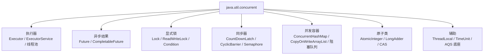
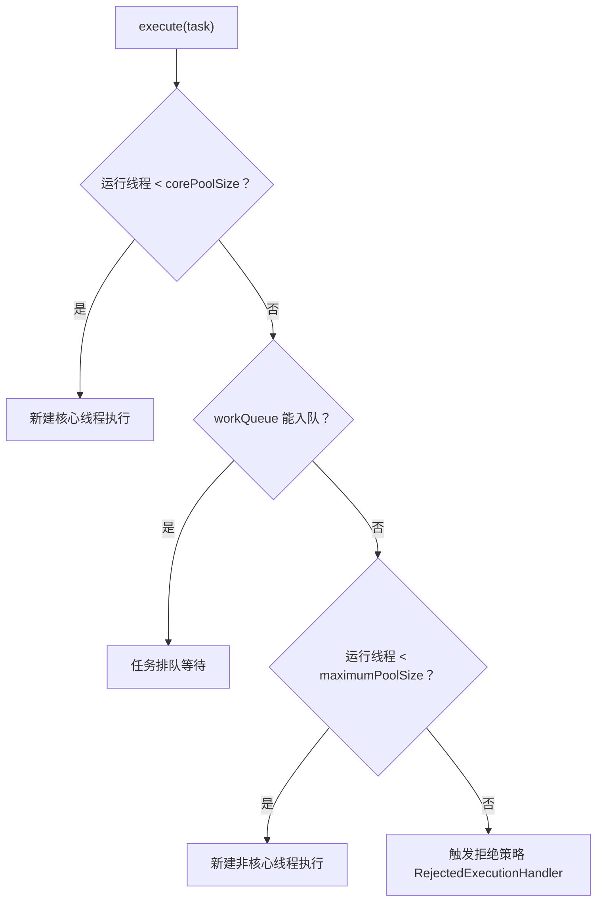
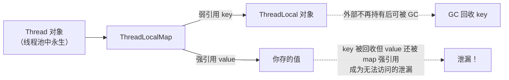
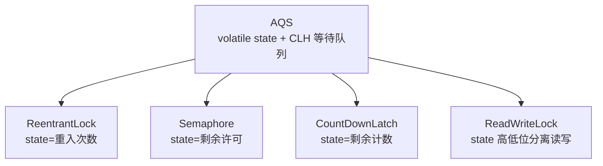

# 05 并发包与线程池

上一章的原语（synchronized/wait/notify）是"手工挡车"，本章的 java.util.concurrent 是"自动挡"。线程池解决频繁建线程的浪费，CompletableFuture 重塑异步编排，AQS 支撑起整个 JUC 工具箱。学完这章你将能回答两个经典问题：核心线程数怎么定？为什么阿里规约禁用 Executors 快捷方法？

> 前置知识：[[java/2深入/04_多线程基础|多线程基础]]。建议对照 [[java/2深入/08_Stream与函数式|Stream 与函数式]] 的 Lambda 语法阅读。

---

## 一、JUC 全景



---

## 二、ThreadPoolExecutor：七大参数与四种拒绝策略

### 2.1 构造参数逐个讲

```java
import java.util.concurrent.*;

public class PoolDemo {
    public static void main(String[] args) {
        // 生产级线程池的标准构造
        ThreadPoolExecutor pool = new ThreadPoolExecutor(
            4,                                  // corePoolSize：常驻核心线程
            16,                                 // maximumPoolSize：最大线程上限
            60, TimeUnit.SECONDS,               // keepAliveTime：非核心线程空闲存活时间
            new ArrayBlockingQueue<>(100),      // workQueue：任务排队队列
            new ThreadFactory() {               // threadFactory：自定义线程名（排查利器）
                @Override
                public Thread newThread(Runnable r) {
                    Thread t = new Thread(r);
                    t.setName("biz-pool-" + t.getId());
                    return t;
                }
            },
            new ThreadPoolExecutor.CallerRunsPolicy()   // handler：拒绝策略
        );

        for (int i = 0; i < 200; i++) {
            final int id = i;
            pool.execute(() -> {
                System.out.println(Thread.currentThread().getName()
                                   + " 处理任务 " + id);
            });
        }
        pool.shutdown();                       // 不再接新任务，已收的任务跑完
        try {
            pool.awaitTermination(10, TimeUnit.SECONDS);   // 等待结束
        } catch (InterruptedException e) {
            pool.shutdownNow();
        }
    }
}
```

### 2.2 任务提交后的决策流程

理解七参数的关键是**顺序**——先填满核心线程，再排队，队满才开非核心线程：



### 2.3 四种拒绝策略

| 策略 | 行为 | 适用 |
|------|------|------|
| AbortPolicy（默认） | 抛 RejectedExecutionException | 快速失败，让调用方感知过载 |
| CallerRunsPolicy | 谁提交谁自己执行 | 天然的反压限流，不丢任务 |
| DiscardPolicy | 静默丢弃新任务 | 允许丢弃的场景（如日志采样） |
| DiscardOldestPolicy | 丢弃队首最老任务再重试 | 只关心最新数据（如实时行情） |

### 2.4 为什么阿里规约禁止 Executors 快捷方法

`Executors.newFixedThreadPool(10)` 固然方便，但隐藏着生产事故：

| 工厂方法 | 隐患 |
|----------|------|
| `newFixedThreadPool` | 无界 LinkedBlockingQueue，任务堆积直到 OOM |
| `newSingleThreadExecutor` | 同上，无界队列 |
| `newCachedThreadPool` | 最大线程数为 Integer.MAX_VALUE，海量线程耗尽内存 |
| `newScheduledThreadPool` | 无界延迟队列 |

规约要求**手动 new ThreadPoolExecutor**，把队列长度、线程上限、拒绝策略全部显式声明——让资源边界可控。

---

## 三、核心线程数怎么定

经验公式：

| 场景 | 公式 | 说明 |
|------|------|------|
| CPU 密集型 | 核数 + 1 | 满载 CPU，多一个应对缺页等偶发停顿 |
| IO 密集型 | 核数 * (1 + 等待时间/计算时间)，粗略取 2 * 核数 | 等待时切换给别的任务用 |

Java 里获取核数：`Runtime.getRuntime().availableProcessors()`。注意容器环境陷阱：老版本 JVM 读到的是宿主机核数而非 cgroup 限制（详见 [[java/2深入/07_JVM调优|JVM 调优]]）。

更工程化的做法是**压测定参**：公式只给初值，用真实负载压测观察 RT 与吞吐曲线再调整；甚至可以做成配置中心动态调参（setCorePoolSize 支持运行时修改）。

---

## 四、Future 与 CompletableFuture

### 4.1 Future 的局限

上一章的 FutureTask 能拿结果，但只能**阻塞式 get**，无法表达"完成后接着做什么"、"合并多个结果"这类编排需求。

### 4.2 CompletableFuture：链式异步编排

对比 JS Promise 学习效率最高：

| JS Promise | CompletableFuture |
|------------|-------------------|
| `.then(fn)` | `thenApply(fn)` |
| `.then(promise => ...)` 平铺嵌套 | `thenCompose(fn)` |
| `.then(fn)` 副作用版 | `thenAccept / thenRun` |
| `Promise.all` | `allOf` |
| `.catch(fn)` | `exceptionally / handle` |
| async 版本默认 | 显式选择后缀（Async）及线程池 |

```java
import java.util.concurrent.CompletableFuture;
import java.util.concurrent.TimeUnit;

public class CfDemo {
    public static void main(String[] args) throws Exception {
        // supplyAsync：有返回值的异步任务（默认走 ForkJoinPool.commonPool，
        // 生产环境务必传入自定义线程池！）
        CompletableFuture<String> userCf =
            CompletableFuture.supplyAsync(() -> queryUser(42));
        CompletableFuture<Double> orderCf =
            CompletableFuture.supplyAsync(() -> queryOrderAmount(42));

        // thenApply：转换结果（同步函数，在上一阶段线程执行）
        CompletableFuture<String> nameCf = userCf.thenApply(u -> u.toUpperCase());

        // thenCompose：串联另一个异步任务（避免嵌套两层 CF），对应 Promise.then 返回 promise
        CompletableFuture<Integer> lenCf = nameCf.thenCompose(
            name -> CompletableFuture.supplyAsync(name::length));

        System.out.println("名字：" + nameCf.get());
        System.out.println("长度：" + lenCf.get());

        // allOf：聚合多个异步任务，全部完成后继续
        CompletableFuture.allOf(userCf, orderCf).join();
        System.out.println("用户 " + userCf.join() + " 下单金额 " + orderCf.join());

        // 异常处理：exceptionally 相当于 catch，返回兜底值
        CompletableFuture<Integer> risky = CompletableFuture
            .<Integer>supplyAsync(() -> { throw new RuntimeException("下游挂了"); })
            .exceptionally(ex -> {
                System.out.println("降级：" + ex.getMessage());
                return -1;
            });
        System.out.println(risky.get());

        TimeUnit.MILLISECONDS.sleep(50);
    }

    static String queryUser(long id) {
        return "zhangsan-" + id;
    }

    static double queryOrderAmount(long id) {
        return 199.0;
    }
}
```

要点小结：

- `thenApply` vs `thenCompose`：前者映射值，后者展平新的异步任务（对应 Optional.flatMap 之别）
- 后缀 Async 表示下一阶段切到指定线程池执行，避免慢任务拖住前序线程
- `join()` 与 `get()` 功能相同，前者抛非受检异常更顺手
- 默认公共池的并行度 = 核数 - 1，IO 型任务会饿死它——**永远传自己的线程池**

---

## 五、Lock 与 Condition：比 synchronized 更细的控制

### 5.1 ReentrantLock 三大杀手锏

```java
import java.util.concurrent.TimeUnit;
import java.util.concurrent.locks.ReentrantLock;

public class LockDemo {
    private final ReentrantLock lock = new ReentrantLock(true);   // true = 公平锁
    private int count = 0;

    public void safeIncr() {
        lock.lock();                        // 必须配对 unlock，惯例放 finally
        try {
            count++;
        } finally {
            lock.unlock();
        }
    }

    public boolean tryWork() throws InterruptedException {
        // 杀手锏一：tryLock 尝试获取，拿不到就干别的——打破死锁"不可剥夺"条件
        if (lock.tryLock(100, TimeUnit.MILLISECONDS)) {
            try {
                count++;
                return true;
            } finally {
                lock.unlock();
            }
        }
        return false;                       // 超时放弃
    }
    // 杀手锏二：公平锁——按申请顺序放行，防饥饿（代价是吞吐下降）
    // 杀手锏三：可中断加锁 lockInterruptibly()——阻塞中响应中断
}
```

synchronized 与 ReentrantLock 对比：

| 维度 | synchronized | ReentrantLock |
|------|--------------|---------------|
| 形态 | 语言关键字，自动释放 | API 类，手动 lock/unlock |
| 可中断 | 否 | 是 |
| 超时尝试 | 否 | tryLock |
| 公平锁 | 否 | 可选 |
| 条件变量 | 单一 wait/notify | 多个 Condition |
| 性能 | JDK6 后接近 | 接近 |
| 建议 | **默认首选** | 需要以上高级能力时 |

### 5.2 Condition 精确唤醒

wait/notify 只有一个等待集合，Condition 可以开多个——生产者消费者各自等待各自的：

```java
import java.util.LinkedList;
import java.util.Queue;
import java.util.concurrent.locks.Condition;
import java.util.concurrent.locks.ReentrantLock;

public class PreciseWakeup {
    private final Queue<Integer> buffer = new LinkedList<>();
    private final int capacity = 5;
    private final ReentrantLock lock = new ReentrantLock();
    private final Condition notFull = lock.newCondition();    // 生产者在这等
    private final Condition notEmpty = lock.newCondition();   // 消费者在这等

    public void produce(int item) throws InterruptedException {
        lock.lock();
        try {
            while (buffer.size() == capacity) {
                notFull.await();          // 只唤醒消费者，不打扰同类
            }
            buffer.offer(item);
            notEmpty.signal();            // 精确叫醒一个消费者
        } finally {
            lock.unlock();
        }
    }

    public int consume() throws InterruptedException {
        lock.lock();
        try {
            while (buffer.isEmpty()) {
                notEmpty.await();
            }
            int item = buffer.poll();
            notFull.signal();
            return item;
        } finally {
            lock.unlock();
        }
    }
}
```

实战提醒：JDK 的 `ArrayBlockingQueue`/`LinkedBlockingQueue` 内部就是这么实现的，业务代码优先直接用阻塞队列。

---

## 六、同步器三件套

### 6.1 CountDownLatch：一次性倒计时门闩

```java
import java.util.concurrent.CountDownLatch;

public class LatchDemo {
    public static void main(String[] args) throws InterruptedException {
        int tasks = 3;
        CountDownLatch done = new CountDownLatch(tasks);   // 计数 3

        for (int i = 0; i < tasks; i++) {
            final int id = i;
            new Thread(() -> {
                try {
                    Thread.sleep((id + 1) * 100);          // 模拟不同耗时
                    System.out.println("子任务 " + id + " 完成");
                } catch (InterruptedException e) {
                    return;
                } finally {
                    done.countDown();                       // 计数减一
                }
            }).start();
        }

        done.await();               // 阻塞直到计数归零（可加超时）
        System.out.println("全部完成，主流程继续");
    }
}
```

典型用途：并行初始化多个资源后统一放行；压测工具里"所有线程就绪再开跑"。计数不可重置，用完即弃。

### 6.2 CyclicBarrier：可循环的集合点

```java
import java.util.concurrent.BrokenBarrierException;
import java.util.concurrent.CyclicBarrier;

public class BarrierDemo {
    public static void main(String[] args) {
        // 3 人一组，到齐后一起行动，且屏障动作在最后到达者线程执行
        CyclicBarrier barrier = new CyclicBarrier(3, () ->
            System.out.println("== 一组到齐，开始下一阶段 =="));

        for (int i = 0; i < 6; i++) {              // 6 人 = 两组，体现"循环"
            final int id = i;
            new Thread(() -> {
                try {
                    Thread.sleep(100 * id % 300);
                    System.out.println("玩家 " + id + " 就位");
                    barrier.await();               // 等齐再走
                    System.out.println("玩家 " + id + " 冲锋");
                } catch (InterruptedException | BrokenBarrierException e) {
                    return;
                }
            }).start();
        }
    }
}
```

| 维度 | CountDownLatch | CyclicBarrier |
|------|----------------|---------------|
| 复用 | 否 | 是 |
| 方向 | N 个等 1 个事件（计数归零） | N 个互相等齐 |
| 角色 | 主线程等子任务 | 平级线程互相同步 |

### 6.3 Semaphore：信号量限流

```java
import java.util.concurrent.Semaphore;

public class SemaphoreDemo {
    public static void main(String[] args) {
        Semaphore slots = new Semaphore(2);       // 只有 2 个许可

        for (int i = 1; i <= 5; i++) {
            final int id = i;
            new Thread(() -> {
                try {
                    slots.acquire();               // 拿不到许可就阻塞
                    System.out.println(id + " 号进入工作区");
                    Thread.sleep(500);
                    System.out.println(id + " 号释放工作区");
                } catch (InterruptedException e) {
                    return;
                } finally {
                    slots.release();
                }
            }).start();
        }
    }
}
```

限流、资源池（数据库连接池思想）、以及上一章并发题"交替打印"都是它的舞台。

---

## 七、ThreadLocal 与内存泄漏陷阱

### 7.1 用法

```java
public class TlDemo {
    // 每个线程有自己独立的一份副本——典型的空间换隔离
    private static final ThreadLocal<java.text.SimpleDateFormat> DF =
        ThreadLocal.withInitial(() -> new java.text.SimpleDateFormat("yyyy-MM-dd"));

    public static void main(String[] args) throws Exception {
        Runnable task = () -> {
            String date = DF.get().format(new java.util.Date());
            System.out.println(Thread.currentThread().getName() + " -> " + date);
            DF.remove();     // 关键：线程池场景必须手动清理！
        };
        new Thread(task, "t1").start();
        new Thread(task, "t2").start();
    }
}
```

### 7.2 泄漏原理

每个 `Thread` 对象内部有一个 `ThreadLocalMap`，key 是 ThreadLocal 的**弱引用**，value 是**强引用**。线程池的线程长存不死：



ThreadLocal 被 GC 后 key 变 null，但 value 依然被 map 强引用着。JDK 有自愈机制（get/set 时顺带清理过期项），但不保证执行。**铁律：用完必调 remove()，放在 finally 里。**

适用场景回顾：SimpleDateFormat 这类非线程安全对象隔离、链路 traceId 传递、事务上下文。不适合跨层传参的滥用。

---

## 八、CAS 与 AQS 概念

### 8.1 CAS：无锁编程的地基

Compare-And-Swap 是 CPU 提供的原子指令（x86 的 cmpxchg）：比较旧值，相等则换成新值，整个过程原子。Java 的 AtomicInteger 就是它的封装：

```java
import java.util.concurrent.atomic.AtomicInteger;

public class CasDemo {
    public static void main(String[] args) {
        AtomicInteger counter = new AtomicInteger(0);
        counter.incrementAndGet();                 // 内部就是 CAS 自旋

        boolean ok = counter.compareAndSet(1, 100);// 期望是 1 才改成 100
        System.out.println(ok + ", now=" + counter.get());
    }
}
```

CAS 的两个经典问题：

| 问题 | 说明 | 解法 |
|------|------|------|
| ABA | 值从 A 改成 B 又改回 A，CAS 察觉不到 | AtomicStampedReference 加版本号 |
| 自旋开销 | 高竞争下反复失败重试浪费 CPU | LongAdder 分段累加降低争用 |

### 8.2 AQS：JUC 的骨架

AbstractQueuedSynchronizer 用一个 volatile int state + CLH 双向等待队列，以模板方法模式支撑了 ReentrantLock、Semaphore、CountDownLatch 等几乎所有同步器：



理解层次建议：会用 > 理解 state 语义 > 能读懂 acquire/release 模板源码。面试深水区，先建立"一个状态位+一个队列"的心智模型即可。

---

## 九、小结

| 工具 | 一句话 |
|------|--------|
| ThreadPoolExecutor | 七参数显式构造，队列必须有界，拒绝策略想清楚 |
| 核心线程数 | IO 密集约 2N，CPU 密集约 N+1，最终压测定案 |
| CompletableFuture | JS Promise 的 Java 版，thenCompose 展平异步链 |
| ReentrantLock | tryLock/公平/可中断三大高级能力 |
| Condition | 多等待集精确唤醒 |
| 同步器 | Latch 等事件，Barrier 等队友，Semaphore 控流量 |
| ThreadLocal | 线程池里不 remove 必泄漏 |
| CAS/AQS | 无锁地基与 JUC 总骨架 |

---

## LeetCode 巩固

LeetCode 并发专区题目数量不多但质量极高，全部值得手写多解（信号量版/锁版/无锁版）：

| 题目 | 链接 | 练习点 |
|------|------|--------|
| 交替打印 FooBar | [print-foobar-alternately](https://leetcode.cn/problems/print-foobar-alternately/) | 两个 Semaphore 乒乓，或两个 Condition 各管一方 |
| 按序打印 | [print-in-order](https://leetcode.cn/problems/print-in-order/) | 最小化的顺序控制，CountDownLatch 一行解 |
| 打印零与奇偶数 | [print-zero-even-odd](https://leetcode.cn/problems/print-zero-even-odd/) | 三方协调的综合练习，对应本章 Condition 精确唤醒 |

下一章把视角从程序内部拉到 JVM 本身——内存模型与垃圾回收。
