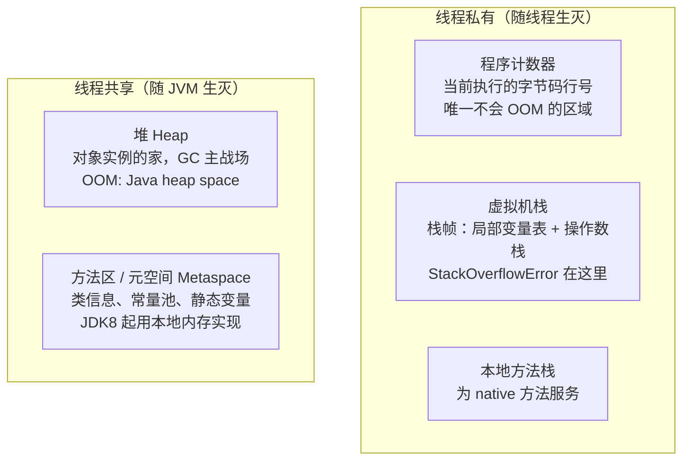
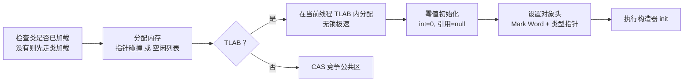
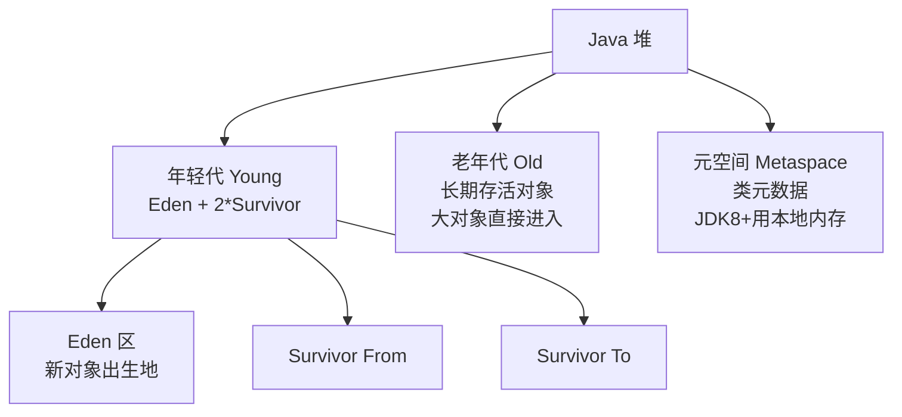
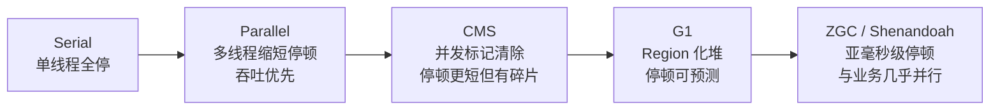

# 06 JVM 内存模型

C 程序员亲手 malloc、亲手 free，对内存的边界一清二楚。Java 把这些交给了 JVM，但"交给 JVM 管"不等于"不用懂"——线上 OOM、内存泄漏、GC 停顿的排查，全部要求你理解 JVM 内部发生了什么。本章讲清运行时数据区、对象的一生、垃圾判活与回收算法，以及从 Serial 到 ZGC 的收集器演进。

> 前置知识：[[java/1入门/06_变量与数据类型|变量与数据类型]]（引用语义）。工具实操见 [[java/2深入/07_JVM调优|JVM 调优]]。

---

## 一、运行时数据区

JVM 把内存划分为五个区域，各司其职：



| 区域 | 存什么 | 会抛什么异常 | C 类比 |
|------|--------|--------------|--------|
| 程序计数器 | 当前字节码指令地址 | 无 | PC 寄存器 |
| 虚拟机栈 | 栈帧（局部变量、方法调用） | StackOverflowError / OOM | 函数调用栈 |
| 本地方法栈 | native 方法调用 | 同上 | 同上 |
| 堆 | 对象实例与数组 | OutOfMemoryError | malloc 的堆 |
| 方法区/元空间 | 类元数据、运行时常量池 | OOM: Metaspace | .data/.rodata 段 |

两个高频问题提前回答：

- **StackOverflowError vs OutOfMemoryError**：前者是栈深度超限（递归没出口），后者是堆/元空间耗尽
- **为什么 JDK 8 用 Metaspace 替换永久代**：永久代大小受 `-XX:MaxPermSize` 限制且易溢出；Metaspace 直接用本地内存，默认只受物理内存约束，动态代理和大量类的场景更稳

```java
public class StackOverflowDemo {
    static int depth = 0;

    public static void recurse() {
        depth++;
        recurse();      // 没有终止条件
    }

    public static void main(String[] args) {
        try {
            recurse();
        } catch (StackOverflowError e) {
            System.out.println("爆栈时递归深度约：" + depth);   // 通常数千到数万层
        }
    }
}
```

**为什么 Java 选择这个内存模型？**

Java 的内存模型本质上是**安全与性能的折中**。C/C++ 让程序员管理所有内存，极致灵活但极易出错（悬垂指针、越界访问）。Java 的选择是：把内存管理交给 JVM，程序员只操作引用。代价是失去了对内存的精细控制（无法手动 free），收益是消除了大部分内存安全问题。栈管执行、堆管对象的分离，让 JVM 可以针对性地优化：栈帧分配/回收只需移动栈指针（纳秒级），而堆上的 GC 则需要更复杂的算法（毫秒级）。这种分离的设计让 JVM 既安全又高效。

---

## 二、堆与栈的内存对比

### 2.1 栈内存详解

```java
public class StackDemo {
    public static void main(String[] args) {
        int a = 10;           // 局部变量，在栈帧的局部变量表中
        String s = "hello";   // 引用 s 在栈上，"hello" 对象在堆上
        method(a);
    }

    static void method(int param) {   // param 是 a 的副本
        int b = 20;                    // 新栈帧，b 在新栈帧中
        System.out.println(param + b);
    }   // method 栈帧弹出，a/b/param 全部消失，无需 GC
}
```

```text
栈内存特性:
┌─────────────────────────────┐
│  线程私有，每个线程一个栈     │
│  每次方法调用压入一个栈帧     │
│  栈帧包含：                  │
│    - 局部变量表（基本类型+引用）│
│    - 操作数栈（字节码执行用）   │
│    - 方法返回地址             │
│  方法返回 = 栈帧弹出 = 内存自动释放│
│  分配/释放只需移动栈指针       │
│  速度：极快（纳秒级）          │
└─────────────────────────────┘
```

### 2.2 堆内存详解

```java
public class HeapDemo {
    public static void main(String[] args) {
        // 对象本身在堆上，引用在栈上
        Book book = new Book("Java编程思想");
        // book（引用）----> 堆上的 Book 对象
        //
        // 堆：
        // ┌──────────────────┐
        // │ Book 对象          │
        // │   title → "Java编程思想" │
        // │   (对象头 12B + 字段)   │
        // └──────────────────┘
    }
}
```

```text
堆内存特性:
┌────────────────────────────────────┐
│  线程共享，所有 new 出来的对象在这里  │
│  GC 管理的主要区域                   │
│  分配速度：比栈慢（需要 GC 协调）     │
│  释放时机：由 GC 决定，程序员无法控制   │
│  生命周期：随对象存活时间不确定        │
│  OOM 高发区：集合无限增长/内存泄漏     │
└────────────────────────────────────┘
```

### 2.3 为什么栈比堆快？

| 维度 | 栈 | 堆 |
|------|-----|-----|
| 分配方式 | 移动栈指针（一条指令） | 找空闲块 + CAS（多条指令） |
| 释放方式 | 栈帧弹出（指针回移） | GC 回收（扫描+标记+清除） |
| 缓存友好 | 连续内存，CPU 缓存命中率高 | 碎片化，缓存局部性差 |
| 线程安全 | 线程私有，无需同步 | 线程共享，需要同步机制 |
| 大小限制 | 较小（默认 512KB-1MB） | 较大（可达数十GB） |

---

## 三、对象的创建流程

`new User()` 背后是一条完整流水线：



### 分配方式

| 方式 | 条件 | 做法 |
|------|------|------|
| 指针碰撞 | 堆内存规整（如复制算法的 Survivor 区） | 移动分界指针，Bump the Pointer |
| 空闲列表 | 内存不规整（标记清除后的堆） | 维护空闲块链表找合适块 |
| TLAB | 默认开启 | 每个线程预分配一小块私有缓冲，90% 以上对象在此无锁分配 |

TLAB 解决的是"多线程抢同一块堆内存"的并发问题——先在线程私有缓冲里分配，用尽再 CAS 领新缓冲。

**为什么 TLAB 这么重要？**

没有 TLAB 的情况下，每个 `new` 操作都需要 CAS 争抢堆上的空闲内存——多线程环境下这会成为严重的性能瓶颈。TLAB 的思路是"先分后争"：每个线程先领取一块私有缓冲（默认 1% 堆大小），在缓冲内分配对象完全无锁。只有 TLAB 用尽时才需要 CAS 领新缓冲。90% 以上的对象（局部变量、临时对象）生命周期极短，在 TLAB 内分配完、用完即死，GC 时直接丢弃。这大幅减少了多线程分配的锁竞争。

---

## 四、对象的内存布局

一个 64 位 JVM（开启压缩指针）上的对象由三部分组成：

| 部分 | 大小 | 内容 |
|------|------|------|
| 对象头 Mark Word | 8 字节 | hashCode、GC 分代年龄、锁标志位——synchronized 锁升级就改这里 |
| 类型指针 | 4 字节（压缩后） | 指向方法区的类元数据，即 `getClass()` 的依据 |
| 实例数据 | 视字段而定 | 各字段的值，相同宽度字段聚集排列 |
| 对齐填充 | 补齐到 8 字节倍数 | CPU 缓存行友好 |

算一笔账：`new Object()` 占 16 字节（头 12 + 填充 4）；一个只含 int 的类也是 16 字节。这就是"Java 对象比 C 结构体重"的量化体现——每个对象都有头部税。验证工具：JOL（Java Object Layout）库的 `ClassLayout.parseInstance(obj).toPrintable()`。

```java
import org.openjdk.jol.info.ClassLayout;

public class ObjectLayoutDemo {
    public static void main(String[] args) {
        Object obj = new Object();
        System.out.println(ClassLayout.parseInstance(obj).toPrintable());
        // 输出示例：
        // java.lang.Object object internals:
        //  OFFSET  SIZE   TYPE DESCRIPTION               VALUE
        //       0     4        (object header)           01 ...
        //       4     4        (object header)           00 ...
        //       8     4        (object header)           00 ...
        //      12     4        (loss due to the next object alignment)
        //  整体占用 16 字节
    }
}
```

**为什么对象头要存 hashCode 和锁状态？**

对象头不是"开销"，而是 JVM 运行时的"元数据载体"。`hashCode` 需要持久存储（用于 HashMap 等容器），GC 分代年龄决定对象何时晋升，锁标志位支持 synchronized 的锁升级（偏向锁→轻量级锁→重量级锁）。Mark Word 的设计体现了**空间复用**的思想：同一块 8 字节在不同场景下存放不同信息（无锁时存 hashCode，偏向锁时存线程 ID，重量级锁时存 monitor 指针），最大化利用每一位。

---

## 五、逃逸分析：对象未必在堆上

理论上所有 new 出来的对象都在堆上，但 JIT 有优化魔法：

```java
public class EscapeAnalysis {
    // 局部对象从未被外部引用 —— 不逃逸
    static long sumPoints() {
        long sum = 0;
        for (int i = 0; i < 1_000_000; i++) {
            Point p = new Point(i, i);   // 理论上每轮 new 一个
            sum += p.x + p.y;
            // p 只在本方法内使用，JIT 可做：
            // 1. 栈上分配/标量替换：p 不进堆，拆成两个局部变量 x,y
            // 2. 同步消除：若 p 关联了锁且不逃逸，锁直接删除
        }
        return sum;
    }

    record Point(int x, int y) { }   // record 详见第 11 章，此处仅当普通数据类
}
```

| 优化 | 含义 | 收益 |
|------|------|------|
| 栈上分配 | 对象随栈帧弹出而消亡 | 免 GC |
| 标量替换 | 把对象拆散成基本类型局部变量 | 免对象头开销 |
| 同步消除 | 不逃逸对象的锁可去除 | 免同步成本 |

C++ 程序员会心一笑：这本质上是把 RVO/栈对象的能力通过 JIT 动态补上了。逃逸分析是 JVM 自动进行的，代码上唯一能配合的就是避免不必要的对象逃逸（如把局部集合 return 出去前考虑不可变拷贝）。

---

## 六、垃圾判活：谁还活着

### 6.1 引用计数及其致命缺陷

最直观的方案是给对象记引用数，为 0 即回收。Python/Rust(Arc) 都用它，但 Java 弃用了——**无法处理循环引用**：

```java
class Node {
    Node partner;
}

public class CycleDemo {
    public static void main(String[] args) {
        Node a = new Node();
        Node b = new Node();
        a.partner = b;
        b.partner = a;       // 循环引用
        a = null;
        b = null;            // 外部引用全断
        // 引用计数：两对象计数都是 1，永远不为 0 —— 泄漏！
        // 可达性分析：从 GC Roots 出发到不了它们 —— 正常回收
        System.gc();
        System.out.println("两个死循环对象已被可达性分析正确回收");
    }
}
```

### 6.2 可达性分析与 GC Roots

从一组根对象出发沿引用图遍历，能到达的活，到不了的可回收：

GC Roots 包括：

| Root | 说明 |
|------|------|
| 虚拟机栈中的引用 | 正在执行的各方法的局部变量 |
| 静态变量 | 类的 static 字段 |
| 常量引用 | 如字符串常量池里的对象 |
| JNI 引用 | native 代码持有的 Java 对象 |

**为什么 Java 放弃引用计数？**

引用计数在"循环引用"场景下会失效：A 引用 B、B 引用 A，但外部已无人引用它们。引用计数认为它们仍然"活着"（计数都是 1），导致内存泄漏。可达性分析通过从 GC Roots（栈帧局部变量、静态变量等）出发遍历引用图，能正确识别这种"孤岛"。代价是需要 Stop-The-World 暂停（遍历期间不允许引用关系变化），但换来了正确的循环引用处理。Python 的解决方案是引入循环检测器，但增加了复杂度。

---

## 七、四种引用强度

| 引用 | 类 | 回收时机 | 典型用途 |
|------|-----|----------|----------|
| 强引用 | `Object o = ...` 普通赋值 | 只要可达就不回收 | 绝大多数业务代码 |
| 软引用 | SoftReference | 内存不足才回收 | 图片缓存、敏感缓存 |
| 弱引用 | WeakReference | 下次 GC 必回收 | WeakHashMap、ThreadLocalMap 的 key |
| 虚引用 | PhantomReference | 随时可回收，仅收通知 | 堆外内存释放跟踪（DirectByteBuffer） |

```java
import java.lang.ref.SoftReference;
import java.lang.ref.WeakReference;

public class RefStrength {
    public static void main(String[] args) {
        byte[] big = new byte[10_000_000];

        SoftReference<byte[]> soft = new SoftReference<>(big);
        WeakReference<byte[]> weak = new WeakReference<>(big);

        big = null;                       // 断开强引用

        System.out.println("GC 前 soft=" + (soft.get() != null)
                           + " weak=" + (weak.get() != null));   // true true
        System.gc();
        System.out.println("GC 后 weak=" + (weak.get() != null));   // false：弱引用必亡
        System.out.println("soft 通常仍存活：" + (soft.get() != null)); // true：内存充足不动它
    }
}
```

记忆口诀：**强不断不收、软缺钱才收、弱见 GC 就收、虚只为收讫通知**。

**四种引用的设计哲学是什么？**

Java 的引用体系本质上是对"对象生命周期"的精细控制。强引用是默认行为（"我要用它"），但有时你想要的是"有空就帮我缓存一下，内存不够就扔"——这是软引用的语义。弱引用更极端："我暂时不用它，但下次 GC 来了记得清掉"——ThreadLocalMap 的 key 就用弱引用，防止线程局部变量泄漏。虚引用最特殊：对象可能随时被回收，你唯一能做的是收到回收通知后清理关联的堆外资源（如 DirectByteBuffer 的本地内存）。这种分层设计让 JVM 的内存管理从"全有或全无"变成了"按需降级"。

---

## 八、分代假设与 GC 算法

### 8.1 弱分代假说

绝大多数对象朝生夕死（临时变量、中间结果），熬过第一轮 GC 的对象往往长寿。据此把堆分为年轻代与老年代分别对待：



对象晋升路线：Eden 出生 -> Eden 满 -> Minor GC，幸存者进入 Survivor 并在两块间来回复制 -> 年龄达阈值（默认 15）晋升老年代。

```text
对象生命周期示意:
Eden 区（新对象出生地）:
  ┌─────────────────────────────────────┐
  │  98% 的对象在这里"朝生夕死"          │
  │  临时变量、方法局部变量、循环中间结果   │
  │  Minor GC 时直接丢弃，不复制          │
  └─────────────────────────────────────┘
         │ Minor GC（每秒可能发生多次）
         ▼
Survivor 区（幸存者营地）:
  ┌─────────────┐  ┌─────────────┐
  │  From       │  │  To         │
  │  上轮幸存者  │──▶│  本轮幸存者  │
  │  (复制后空)  │  │  (复制来)    │
  └─────────────┘  └─────────────┘
         │ 年龄达到阈值（默认15）
         ▼
老年代（长寿居所）:
  ┌─────────────────────────────────────┐
  │  长期存活的对象                      │
  │  大对象（超过 -XX:PretenureSize）    │
  │  Full GC/Mixed GC 回收              │
  └─────────────────────────────────────┘
```

### 8.2 三大基础算法对比

| 算法 | 过程 | 优点 | 缺点 | 适用代 |
|------|------|------|------|--------|
| 标记-清除 Mark-Sweep | 标记存活，直接清除死亡 | 实现简单 | 内存碎片；效率不稳 | CMS 老年代 |
| 标记-复制 Copying | 内存对半分，活体搬迁 | 无碎片，吞吐高 | 浪费一半空间 | 年轻代（Eden:S:S = 8:1:1） |
| 标记-整理 Mark-Compact | 标记后整体向一端移动 | 无碎片，空间不浪费 | 移动成本高，停顿长 | 老年代（Parallel/G1 兜底） |

年轻代选复制算法正是因为它"死得多"——每次只需搬少量幸存者；老年代存活率高，复制反而亏，用标记清除或整理。

**为什么年轻代不用标记-整理？**

标记-整理需要移动所有存活对象并更新引用，代价与存活对象数量成正比。年轻代中 98% 的对象在 Minor GC 时死亡，只需复制 2% 的幸存者——复制算法在这个场景下效率远高于标记-整理。空间浪费 10%（一个 Survivor 区）也值得，因为复制操作量极小。

### 8.3 卡表与写屏障

老年代对象被年轻代引用时，如何避免全堆扫描？

```text
卡表 (Card Table):
┌─────────┬─────────┬─────────┬─────────┐
│ Card 0  │ Card 1  │ Card 2  │ Card 3  │ ... 512KB 一块
│  0x00   │  0x01   │  0x00   │  0x01   │
└─────────┴─────────┴─────────┴─────────┘
  0=干净    1=脏       0=干净    1=脏

当老年代对象引用关系发生变化时（写屏障触发）：
1. JVM 在写操作后插入一段额外代码（写屏障）
2. 将对应卡表项标记为"脏"
3. Minor GC 只需扫描脏卡，而非整个老年代
```

写屏障（Write Barrier）不是 CPU 的硬件屏障，而是 JVM 在字节码层面插入的"钩子代码"。每次对象引用赋值时，JVM 会额外执行一段代码来更新卡表。这是**空间换时间**的经典应用：用一个小数组（卡表）跟踪老年代的变化区域，避免 GC 时全堆扫描。

---

## 九、垃圾收集器演进

### 9.1 收集器特性总表

| 收集器 | 年代 | 作用区域 | 算法 | 目标 | 定位 |
|--------|------|----------|------|------|------|
| Serial | 初代 | Young | 复制 | 简单高效 | 单核客户端，-XX:+UseSerialGC |
| ParNew | 2003 | Young | 复制（多线程） | 配合 CMS | 历史角色 |
| Parallel Scavenge | JDK6 | Young | 复制 | 吞吐量优先 | 批处理，UseParallelGC |
| CMS | JDK5 | Old | 标记清除 | 最短停顿 | 已于 JDK14 移除 |
| **G1** | JDK7u4/JDK9 默认 | 全堆 | Region 化标记整理 | 可预测停顿 | 当前主流，UseG1GC |
| ZGC | JDK11+/JDK15 转正 | 全堆 | 着色指针+读屏障 | 亚毫秒停顿 | 大堆低延迟 |
| Shenandoah | OpenJDK12 | 全堆 | 转发指针 | 低延迟 | RedHat 系 |

### 9.2 演进主线



一句话理解各阶段哲学：**Serial 追求简单，Parallel 追求总吞吐，CMS 首次让 GC 与应用并发跑，G1 把堆切成 Region 让"停多久"可配置，ZGC 用着色指针做到停顿不随堆变大而增长**。

### 9.3 G1 的关键概念

- 堆被划分为 2048 个左右等大的 Region（1~32MB），每个 Region 动态扮演 Eden/Survivor/Old/Humongous 角色
- 优先回收"垃圾最多、回收价值最高"的 Region——名字 Garbage First 的由来
- `-XX:MaxGCPauseMillis=200` 直接声明期望停顿，收集器据此规划每轮收多少 Region

```text
G1 堆布局:
┌────┬────┬────┬────┬────┬────┬────┬────┐
│ E  │ E  │ S  │ O  │ O  │ H  │ E  │ O  │
├────┼────┼────┼────┼────┼────┼────┼────┤
│ O  │ E  │ O  │ O  │ S  │ O  │ O  │ E  │
├────┼────┼────┼────┼────┼────┼────┼────┤
│ O  │ O  │ E  │ O  │ O  │ O  │ E  │ O  │
└────┴────┴────┴────┴────┴────┴────┴────┘
E=Eden  S=Survivor  O=Old  H=Humongous(大对象)

G1 回收过程:
1. Young GC: 收集所有 E 和 S Region（STW，通常<10ms）
2. 初始标记 (Initial Mark): 标记 GC Roots 直接引用的对象（借 Young GC 的 STW 完成）
3. 并发标记: 从 GC Roots 出发遍历引用图（与应用并发，不停顿）
4. 最终标记: 处理并发标记期间遗漏的引用（STW）
5. 筛选回收: 按价值排序，选择性回收 Region（STW）
```

### 9.4 ZGC 的着色指针

```text
ZGC 核心技术:
┌─────────────────────────────────────────────────┐
│  着色指针 (Colored Pointer)                       │
│  在 64 位指针中借用 4 位存储 GC 状态:              │
│  bit 0: Marked0  (标记阶段 0)                     │
│  bit 1: Marked1  (标记阶段 1)                     │
│  bit 2: Remapped (重映射标记)                     │
│  bit 3: Finalizable (是否可终结)                  │
│                                                  │
│  指针 = 虚拟地址 + GC 元数据                       │
│  GC 不需要移动对象，只需修改指针中的元数据位          │
│  应用读写对象时通过读屏障检测并修正指针              │
└─────────────────────────────────────────────────┘

为什么 ZGC 能做到亚毫秒停顿？
1. 几乎所有工作都在并发阶段完成（标记、转移、重映射）
2. STW 只在初始标记和初始转移阶段（<1ms）
3. 停顿时间不随堆大小增长（10MB 和 16TB 堆停顿差不多）
4. 支持 NUMA 架构，自动将对象分配到本地内存节点
```

### 9.5 JVM 与 C 手动管理的哲学对比

| 维度 | C (malloc/free) | Java (GC) |
|------|------------------|-----------|
| 回收时机 | 程序员显式 free | 不可预知，由 GC 决定 |
| 错误类型 | 泄漏/悬垂指针/double-free | 内存泄漏（对象仍被引用）相对温和 |
| 停顿 | 无（free 即时） | 存在 STW，需选型调优 |
| 实时性 | 确定，可做硬实时 | 弱实时，软实时靠 ZGC 这类方案逼近 |
| 开发效率 | 心智负担极高 | 几乎无感，代价是内存占用偏高 |
| 适用 | 内核/嵌入式/极致性能 | 业务系统/快速迭代 |

一个公允的说法：GC 不是消灭了内存问题，而是把"悬垂指针、越界释放"这类致命问题转化成了"泄漏、停顿"这类可运维问题。

---

## 十、常见内存泄漏模式

### 10.1 集合持有不释放

```java
public class MapLeak {
    // 静态 Map 不断添加但从不移除
    private static final Map<String, Object> cache = new HashMap<>();

    public void addToCache(String key, Object value) {
        cache.put(key, value);  // key 是 String，永远不回收
    }
    // 即使 value 不再使用，Map 仍持有强引用，GC 无法回收
}
```

### 10.2 未关闭的资源

```java
public class StreamLeak {
    public void readData() throws IOException {
        InputStream is = new FileInputStream("data.bin");
        // 读取数据...
        // 忘记 close()，文件句柄泄漏
        // 更严重：如果抛异常，close 不会执行
    }
}
```

```java
// 正确写法：try-with-resources
public void readData() throws IOException {
    try (InputStream is = new FileInputStream("data.bin")) {
        // 读取数据...
    }  // 自动 close，即使抛异常
}
```

### 10.3 ThreadLocal 泄漏

```java
public class ThreadLocalLeak {
    // 线程池中使用 ThreadLocal 危险！
    private static final ThreadLocal<byte[]> buffer = new ThreadLocal<>();

    public void process() {
        buffer.set(new byte[1024 * 1024]);  // 1MB
        // 业务处理...
        // 忘记 remove()！
        // 线程池中线程复用，ThreadLocal 不会自动清理
        // 线程存活期间，byte[] 永远无法被 GC
    }
}
```

```java
// 正确写法：用完必须 remove
public void process() {
    try {
        buffer.set(new byte[1024 * 1024]);
        // 业务处理...
    } finally {
        buffer.remove();  // 必须在 finally 中 remove
    }
}
```

### 10.4 内部类持有外部类引用

```java
public class InnerClassLeak {
    private byte[] data = new byte[1024 * 1024]; // 1MB

    // 非静态内部类隐式持有外部类引用
    class Inner {
        void doSomething() { }
    }

    // 静态内部类不持有外部类引用
    static class StaticInner {
        void doSomething() { }
    }
}
```

### 10.5 监控内存泄漏的工具

```text
排查工具链:
┌─────────────────────────────────────────────┐
│ 1. jstat -gcutil <pid> 1000                 │
│    观察各区域使用量是否持续增长                │
│                                              │
│ 2. jmap -dump:format=b,file=dump.hprof <pid>│
│    生成堆转储文件                              │
│                                              │
│ 3. Eclipse MAT (Memory Analyzer Tool)        │
│    分析 dump 文件，查看支配树和泄漏报告         │
│    Dominator Tree: 按 retained size 排序      │
│    Leak Suspects: 自动检测可疑泄漏点          │
│                                              │
│ 4. VisualVM / JConsole                       │
│    实时监控堆使用、GC 活动                     │
│                                              │
│ 5. -XX:+HeapDumpOnOutOfMemoryError           │
│    OOM 时自动生成 dump，无需手动触发           │
└─────────────────────────────────────────────┘
```

---

## 十一、JVM 内存调优参数

### 11.1 堆大小配置

```bash
# 基础配置
-Xms512m          # 堆初始大小
-Xmx2g            # 堆最大大小（建议 Xms=Xmx 避免动态扩展）
-Xmn512m          # 年轻代大小（推荐为堆的 1/3 到 1/2）
-XX:SurvivorRatio=8   # Eden:S0:S1 = 8:1:1（默认值）

# 元空间配置
-XX:MetaspaceSize=256m       # 元空间初始大小
-XX:MaxMetaspaceSize=512m    # 元空间最大大小

# 直接内存（堆外）
-XX:MaxDirectMemorySize=1g   # NIO DirectByteBuffer 上限
```

### 11.2 GC 收集器选择

```bash
# G1（JDK9+ 默认，推荐）
-XX:+UseG1GC
-XX:MaxGCPauseMillis=200     # 目标停顿时间
-XX:G1HeapRegionSize=8m      # Region 大小（1-32MB）

# ZGC（超低延迟，JDK15+ 推荐）
-XX:+UseZGC
-XX:+ZGenerational           # JDK21+ 分代 ZGC（推荐）

# Parallel（吞吐优先，批处理场景）
-XX:+UseParallelGC
-XX:ParallelGCThreads=4      # GC 线程数
-XX:MaxGCPauseMillis=100
```

### 11.3 GC 日志与诊断

```bash
# JDK 9+ 统一日志
-Xlog:gc*:file=gc.log:time,uptime,level,tags

# JDK 8
-XX:+PrintGCDetails
-XX:+PrintGCDateStamps
-XX:+PrintHeapAtGC
-Xloggc:gc.log

# 常用诊断参数
-XX:+HeapDumpOnOutOfMemoryError
-XX:HeapDumpPath=/tmp/dump.hprof
-XX:+PrintTenuringDistribution    # 查看对象晋升情况
-XX:+PrintAdaptiveSizePolicy      # 查看自适应调整策略
```

### 11.4 常用调优场景速查

| 场景 | 症状 | 参数建议 |
|------|------|----------|
| 频繁 Minor GC | 年轻代太小 | `-Xmn` 增大年轻代 |
| 频繁 Full GC | 老年代满 | 检查泄漏 + 增大 `-Xmx` |
| GC 停顿太长 | 收集器选择不当 | 换 G1/ZGC |
| Metaspace OOM | 动态生成类太多 | 增大 Metaspace + 检查 CGLIB |
| 堆外内存泄漏 | Direct buffer memory OOM | `-XX:MaxDirectMemorySize` + 检查 NIO |

---

## 十二、综合实验：亲眼看见分代与晋升

```java
import java.util.ArrayList;
import java.util.List;

/**
 * 观察建议：加 JVM 参数运行
 *   -Xms64m -Xmx64m -Xmn16m -Xlog:gc*
 * （JDK9+ 统一日志；JDK8 用 -XX:+PrintGCDetails）
 */
public class GcObserve {

    // 长期存活的引用：会一路晋升到老年代
    static List<byte[]> longLived = new ArrayList<>();

    public static void main(String[] args) {
        for (int round = 0; round < 20; round++) {
            // 朝生夕死对象：每轮产生 8MB 临时数据，触发 Minor GC 后即死
            byte[] temp = new byte[8 * 1024 * 1024];

            if (round < 5) {
                longLived.add(new byte[1024]);     // 小部分长寿对象
            }
            System.out.println("round " + round + " done, free="
                               + Runtime.getRuntime().freeMemory() / 1024 + "KB");
        }
        System.out.println("长期存活对象数：" + longLived.size());
        // 观察 gc 日志：大量小的 Minor GC（年轻代），偶尔伴随老年代变化
    }
}
```

配合 [[java/2深入/07_JVM调优|JVM 调优]] 的 GC 日志解读，你会看到：Minor GC 高频且快，Full GC/Mixed GC 低频且慢——这正是分代的收益。

---

## 小结

| 知识点 | 一句话 |
|--------|--------|
| 五大数据区 | 栈管执行、堆管对象、元空间管类 |
| 堆 vs 栈 | 栈快但小（纳秒级）、堆大但慢（需 GC 协调） |
| 对象创建 | TLAB 无锁分配是常态路径 |
| 对象布局 | Mark Word + 类型指针 + 实例数据，头部税 12 字节起 |
| 判活 | 可达性分析，循环引用不是问题 |
| 四种引用 | 强软弱虚，强度递减用途各异 |
| GC 算法 | 年轻复制、老年清除/整理 |
| 收集器 | G1 是当前默认答案，ZGC 是大堆低延迟答案 |
| 内存泄漏 | 集合持有、未关闭资源、ThreadLocal、内部类 |
| 调优 | Xms=Xmx + 选对收集器 + 开 GC 日志是三板斧 |

---

---

## 练习

| 题号 | 题目 | 链接 | 知识点 |
|------|------|------|--------|
| 146 | LRU缓存 | https://leetcode.cn/problems/lru-cache/ | 内存管理、数据结构 |
