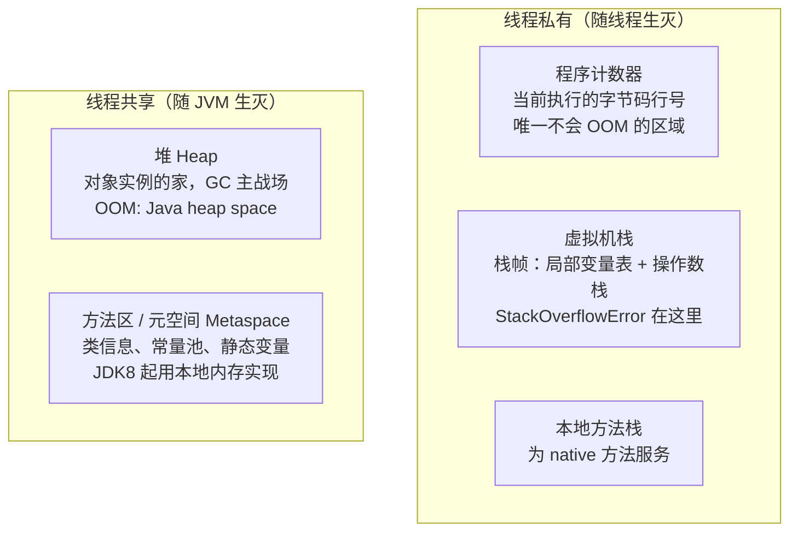
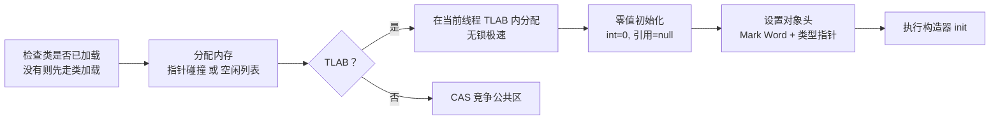
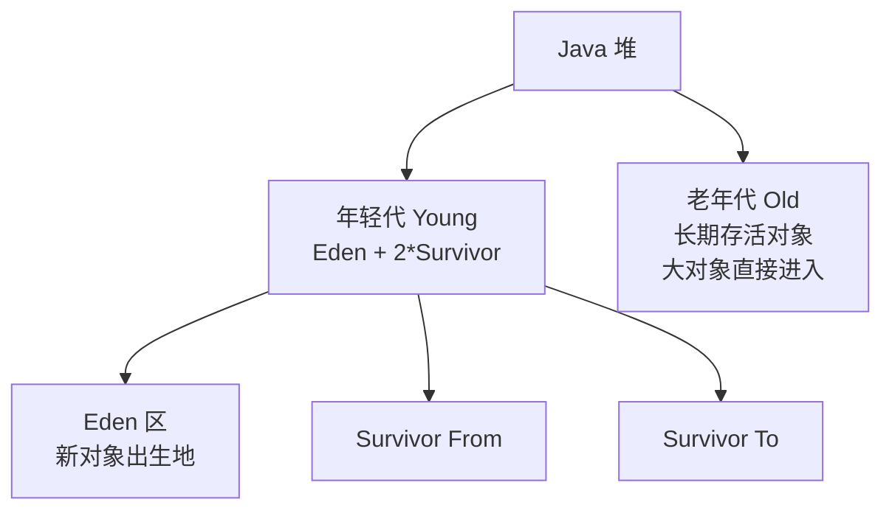
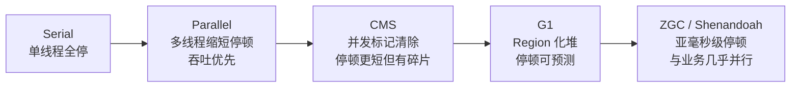

# 06 JVM 内存模型

C 程序员亲手 malloc、亲手 free，对内存的边界一清二楚。Java 把这些交给了 JVM，但"交给 JVM 管"不等于"不用懂"——线上 OOM、内存泄漏、GC 停顿的排查，全部要求你理解 JVM 内部发生了什么。本章讲清运行时数据区、对象的一生、垃圾判活与回收算法，以及从 Serial 到 ZGC 的收集器演进。

> 前置知识：[[java/1入门/06_变量与数据类型|变量与数据类型]]（引用语义）。工具实操见 [[java/2深入/07_JVM调优|JVM 调优]]。

---

## 一、运行时数据区

JVM 把内存划分为五个区域，各司其职：



| 区域 | 存什么 | 会抛什么异常 | C 类比 |
|------|--------|--------------|--------|
| 程序计数器 | 当前字节码指令地址 | 无 | PC 寄存器 |
| 虚拟机栈 | 栈帧（局部变量、方法调用） | StackOverflowError / OOM | 函数调用栈 |
| 本地方法栈 | native 方法调用 | 同上 | 同上 |
| 堆 | 对象实例与数组 | OutOfMemoryError | malloc 的堆 |
| 方法区/元空间 | 类元数据、运行时常量池 | OOM: Metaspace | .data/.rodata 段 |

两个高频问题提前回答：

- **StackOverflowError vs OutOfMemoryError**：前者是栈深度超限（递归没出口），后者是堆/元空间耗尽
- **为什么 JDK 8 用 Metaspace 替换永久代**：永久代大小受 `-XX:MaxPermSize` 限制且易溢出；Metaspace 直接用本地内存，默认只受物理内存约束，动态代理和大量类的场景更稳

```java
public class StackOverflowDemo {
    static int depth = 0;

    public static void recurse() {
        depth++;
        recurse();      // 没有终止条件
    }

    public static void main(String[] args) {
        try {
            recurse();
        } catch (StackOverflowError e) {
            System.out.println("爆栈时递归深度约：" + depth);   // 通常数千到数万层
        }
    }
}
```

---

## 二、对象的创建流程

`new User()` 背后是一条完整流水线：



### 分配方式

| 方式 | 条件 | 做法 |
|------|------|------|
| 指针碰撞 | 堆内存规整（如复制算法的 Survivor 区） | 移动分界指针，Bump the Pointer |
| 空闲列表 | 内存不规整（标记清除后的堆） | 维护空闲块链表找合适块 |
| TLAB | 默认开启 | 每个线程预分配一小块私有缓冲，90% 以上对象在此无锁分配 |

TLAB 解决的是"多线程抢同一块堆内存"的并发问题——先在线程私有缓冲里分配，用尽再 CAS 领新缓冲。

---

## 三、对象的内存布局

一个 64 位 JVM（开启压缩指针）上的对象由三部分组成：

| 部分 | 大小 | 内容 |
|------|------|------|
| 对象头 Mark Word | 8 字节 | hashCode、GC 分代年龄、锁标志位——synchronized 锁升级就改这里 |
| 类型指针 | 4 字节（压缩后） | 指向方法区的类元数据，即 `getClass()` 的依据 |
| 实例数据 | 视字段而定 | 各字段的值，相同宽度字段聚集排列 |
| 对齐填充 | 补齐到 8 字节倍数 | CPU 缓存行友好 |

算一笔账：`new Object()` 占 16 字节（头 12 + 填充 4）；一个只含 int 的类也是 16 字节。这就是"Java 对象比 C 结构体重"的量化体现——每个对象都有头部税。验证工具：JOL（Java Object Layout）库的 `ClassLayout.parseInstance(obj).toPrintable()`。

---

## 四、逃逸分析：对象未必在堆上

理论上所有 new 出来的对象都在堆上，但 JIT 有优化魔法：

```java
public class EscapeAnalysis {
    // 局部对象从未被外部引用 —— 不逃逸
    static long sumPoints() {
        long sum = 0;
        for (int i = 0; i < 1_000_000; i++) {
            Point p = new Point(i, i);   // 理论上每轮 new 一个
            sum += p.x + p.y;
            // p 只在本方法内使用，JIT 可做：
            // 1. 栈上分配/标量替换：p 不进堆，拆成两个局部变量 x,y
            // 2. 同步消除：若 p 关联了锁且不逃逸，锁直接删除
        }
        return sum;
    }

    record Point(int x, int y) { }   // record 详见第 11 章，此处仅当普通数据类
}
```

| 优化 | 含义 | 收益 |
|------|------|------|
| 栈上分配 | 对象随栈帧弹出而消亡 | 免 GC |
| 标量替换 | 把对象拆散成基本类型局部变量 | 免对象头开销 |
| 同步消除 | 不逃逸对象的锁可去除 | 免同步成本 |

C++ 程序员会心一笑：这本质上是把 RVO/栈对象的能力通过 JIT 动态补上了。逃逸分析是 JVM 自动进行的，代码上唯一能配合的就是避免不必要的对象逃逸（如把局部集合 return 出去前考虑不可变拷贝）。

---

## 五、垃圾判活：谁还活着

### 5.1 引用计数及其致命缺陷

最直观的方案是给对象记引用数，为 0 即回收。Python/Rust(Arc) 都用它，但 Java 弃用了——**无法处理循环引用**：

```java
class Node {
    Node partner;
}

public class CycleDemo {
    public static void main(String[] args) {
        Node a = new Node();
        Node b = new Node();
        a.partner = b;
        b.partner = a;       // 循环引用
        a = null;
        b = null;            // 外部引用全断
        // 引用计数：两对象计数都是 1，永远不为 0 —— 泄漏！
        // 可达性分析：从 GC Roots 出发到不了它们 —— 正常回收
        System.gc();
        System.out.println("两个死循环对象已被可达性分析正确回收");
    }
}
```

### 5.2 可达性分析与 GC Roots

从一组根对象出发沿引用图遍历，能到达的活，到不了的可回收：

GC Roots 包括：

| Root | 说明 |
|------|------|
| 虚拟机栈中的引用 | 正在执行的各方法的局部变量 |
| 静态变量 | 类的 static 字段 |
| 常量引用 | 如字符串常量池里的对象 |
| JNI 引用 | native 代码持有的 Java 对象 |

---

## 六、四种引用强度

| 引用 | 类 | 回收时机 | 典型用途 |
|------|-----|----------|----------|
| 强引用 | `Object o = ...` 普通赋值 | 只要可达就不回收 | 绝大多数业务代码 |
| 软引用 | SoftReference | 内存不足才回收 | 图片缓存、敏感缓存 |
| 弱引用 | WeakReference | 下次 GC 必回收 | WeakHashMap、ThreadLocalMap 的 key |
| 虚引用 | PhantomReference | 随时可回收，仅收通知 | 堆外内存释放跟踪（DirectByteBuffer） |

```java
import java.lang.ref.SoftReference;
import java.lang.ref.WeakReference;

public class RefStrength {
    public static void main(String[] args) {
        byte[] big = new byte[10_000_000];

        SoftReference<byte[]> soft = new SoftReference<>(big);
        WeakReference<byte[]> weak = new WeakReference<>(big);

        big = null;                       // 断开强引用

        System.out.println("GC 前 soft=" + (soft.get() != null)
                           + " weak=" + (weak.get() != null));   // true true
        System.gc();
        System.out.println("GC 后 weak=" + (weak.get() != null));   // false：弱引用必亡
        System.out.println("soft 通常仍存活：" + (soft.get() != null)); // true：内存充足不动它
    }
}
```

记忆口诀：**强不断不收、软缺钱才收、弱见 GC 就收、虚只为收讫通知**。

---

## 七、分代假设与 GC 算法

### 7.1 弱分代假说

绝大多数对象朝生夕死（临时变量、中间结果），熬过第一轮 GC 的对象往往长寿。据此把堆分为年轻代与老年代分别对待：



对象晋升路线：Eden 出生 -> Eden 满 -> Minor GC，幸存者进入 Survivor 并在两块间来回复制 -> 年龄达阈值（默认 15）晋升老年代。

### 7.2 三大基础算法对比

| 算法 | 过程 | 优点 | 缺点 | 适用代 |
|------|------|------|------|--------|
| 标记-清除 Mark-Sweep | 标记存活，直接清除死亡 | 实现简单 | 内存碎片；效率不稳 | CMS 老年代 |
| 标记-复制 Copying | 内存对半分，活体搬迁 | 无碎片，吞吐高 | 浪费一半空间 | 年轻代（Eden:S:S = 8:1:1） |
| 标记-整理 Mark-Compact | 标记后整体向一端移动 | 无碎片，空间不浪费 | 移动成本高，停顿长 | 老年代（Parallel/G1 兜底） |

年轻代选复制算法正是因为它"死得多"——每次只需搬少量幸存者；老年代存活率高，复制反而亏，用标记清除或整理。

---

## 八、垃圾收集器演进

### 8.1 收集器特性总表

| 收集器 | 年代 | 作用区域 | 算法 | 目标 | 定位 |
|--------|------|----------|------|------|------|
| Serial | 初代 | Young | 复制 | 简单高效 | 单核客户端，-XX:+UseSerialGC |
| ParNew | 2003 | Young | 复制（多线程） | 配合 CMS | 历史角色 |
| Parallel Scavenge | JDK6 | Young | 复制 | 吞吐量优先 | 批处理，UseParallelGC |
| CMS | JDK5 | Old | 标记清除 | 最短停顿 | 已于 JDK14 移除 |
| **G1** | JDK7u4/JDK9 默认 | 全堆 | Region 化标记整理 | 可预测停顿 | 当前主流，UseG1GC |
| ZGC | JDK11+/JDK15 转正 | 全堆 | 着色指针+读屏障 | 亚毫秒停顿 | 大堆低延迟 |
| Shenandoah | OpenJDK12 | 全堆 | 转发指针 | 低延迟 | RedHat 系 |

### 8.2 演进主线



一句话理解各阶段哲学：**Serial 追求简单，Parallel 追求总吞吐，CMS 首次让 GC 与应用并发跑，G1 把堆切成 Region 让"停多久"可配置，ZGC 用着色指针做到停顿不随堆变大而增长**。

### 8.3 G1 的关键概念

- 堆被划分为 2048 个左右等大的 Region（1~32MB），每个 Region 动态扮演 Eden/Survivor/Old/Humongous 角色
- 优先回收"垃圾最多、回收价值最高"的 Region——名字 Garbage First 的由来
- `-XX:MaxGCPauseMillis=200` 直接声明期望停顿，收集器据此规划每轮收多少 Region

### 8.4 JVM 与 C 手动管理的哲学对比

| 维度 | C (malloc/free) | Java (GC) |
|------|------------------|-----------|
| 回收时机 | 程序员显式 free | 不可预知，由 GC 决定 |
| 错误类型 | 泄漏/悬垂指针/double-free | 内存泄漏（对象仍被引用）相对温和 |
| 停顿 | 无（free 即时） | 存在 STW，需选型调优 |
| 实时性 | 确定，可做硬实时 | 弱实时，软实时靠 ZGC 这类方案逼近 |
| 开发效率 | 心智负担极高 | 几乎无感，代价是内存占用偏高 |
| 适用 | 内核/嵌入式/极致性能 | 业务系统/快速迭代 |

一个公允的说法：GC 不是消灭了内存问题，而是把"悬垂指针、越界释放"这类致命问题转化成了"泄漏、停顿"这类可运维问题。

---

## 九、常见 OOM 类型速查表

| 异常信息 | 发生区域 | 典型原因 | 快速定位 |
|----------|----------|----------|----------|
| `Java heap space` | 堆 | 大对象/集合无限增长、内存泄漏 | dump + MAT 看支配树 |
| `GC overhead limit exceeded` | 堆 | GC 时间占比超 98% 却回收不到 2% | 同上，通常是泄漏前兆 |
| `Metaspace` | 元空间 | 动态生成类过多（CGLIB/反射滥用） | -verbose:gc 观察类加载数 |
| `unable to create new native thread` | 栈外 OS 层 | 线程数超限（ulimit/内存不足） | jstack 数线程数 |
| `Direct buffer memory` | 堆外 | NIO DirectByteBuffer 超限 | Netty 场景检查池化配置 |
| `Requested array size exceeds VM limit` | 堆 | 数组长度超 Integer 上限附近 | 业务参数校验 |

---

## 十、综合实验：亲眼看见分代与晋升

```java
import java.util.ArrayList;
import java.util.List;

/**
 * 观察建议：加 JVM 参数运行
 *   -Xms64m -Xmx64m -Xmn16m -Xlog:gc*
 * （JDK9+ 统一日志；JDK8 用 -XX:+PrintGCDetails）
 */
public class GcObserve {

    // 长期存活的引用：会一路晋升到老年代
    static List<byte[]> longLived = new ArrayList<>();

    public static void main(String[] args) {
        for (int round = 0; round < 20; round++) {
            // 朝生夕死对象：每轮产生 8MB 临时数据，触发 Minor GC 后即死
            byte[] temp = new byte[8 * 1024 * 1024];

            if (round < 5) {
                longLived.add(new byte[1024]);     // 小部分长寿对象
            }
            System.out.println("round " + round + " done, free="
                               + Runtime.getRuntime().freeMemory() / 1024 + "KB");
        }
        System.out.println("长期存活对象数：" + longLived.size());
        // 观察 gc 日志：大量小的 Minor GC（年轻代），偶尔伴随老年代变化
    }
}
```

配合 [[java/2深入/07_JVM调优|JVM 调优]] 的 GC 日志解读，你会看到：Minor GC 高频且快，Full GC/Mixed GC 低频且慢——这正是分代的收益。

---

## 小结

| 知识点 | 一句话 |
|--------|--------|
| 五大数据区 | 栈管执行、堆管对象、元空间管类 |
| 对象创建 | TLAB 无锁分配是常态路径 |
| 对象布局 | Mark Word + 类型指针 + 实例数据，头部税 12 字节起 |
| 判活 | 可达性分析，循环引用不是问题 |
| 四种引用 | 强软弱虚，强度递减用途各异 |
| GC 算法 | 年轻复制、老年清除/整理 |
| 收集器 | G1 是当前默认答案，ZGC 是大堆低延迟答案 |

---

## LeetCode 巩固

本章无直接算法对应题，但以下两题恰好训练"引用关系"思维——与可达性分析的直觉同构：

| 题目 | 链接 | 练习点 |
|------|------|--------|
| [环形链表](https://leetcode.cn/problems/linked-list-cycle/) | linked-list-cycle | 快慢指针判环——类比引用图中检测环的存在 |
| [相交链表](https://leetcode.cn/problems/intersection-of-two-linked-lists/) | intersection-of-two-linked-lists | 两条引用链找公共节点——类比从两个 Root 出发的可达集交点 |

下一章进入实战运维：当 OOM 真的发生时，怎么用工具揪出凶手。
