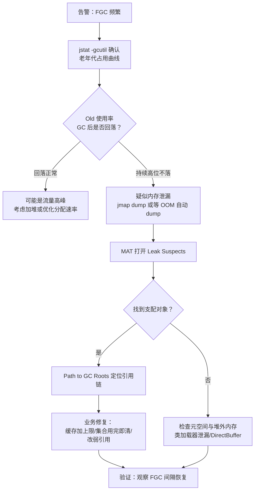
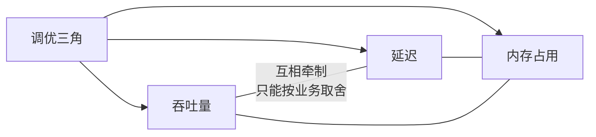

# 07 JVM调优

上一章建立了内存模型的理论地图，本章是它的实操篇：jps/jstat/jmap/jstack 逐个上手，用 MAT 从堆转储里揪出大对象，用 arthas 在不重启的情况下定位线上慢方法。最后给出频繁 Full GC 的标准排查流程与容器环境的参数陷阱。目标不是背诵参数表，而是建立"指标 -> 现象 -> 工具 -> 结论"的排障闭环。

> 前置知识：[[java/2深入/06_JVM内存模型|JVM 内存模型]]。

---

## 一、命令行四件套实战

### 1.1 jps：找到进程

```text
$ jps -l
12345 com.rootstack.demo.GcObserve
23456 sun.tools.jps.Jps
```

等价于 `ps -ef | grep java` 但只列 JVM 进程且带主类名，是所有后续命令的起点。

### 1.2 jstat：GC 统计的仪表盘

```text
# 每 1000ms 输出一次 GC 概况，共 10 次
$ jstat -gcutil <pid> 1000 10
  S0     S1     E      O      M     YGC    YGCT   FGC   FGCT   GCT
  0.00  45.80  62.31  38.12  95.44    18   0.094     2  0.311  0.405
```

| 列 | 含义 | 关注点 |
|----|------|--------|
| S0/S1/E/O/M | Survivor0/1、Eden、Old、Metaspace 的使用率 | O 持续上涨不回落 = 泄漏嫌疑 |
| YGC/YGCT | Young GC 次数/总耗时 | 单次耗时 = YGCT/YGC |
| FGC/FGCT | Full GC 次数/总耗时 | **FGC 频繁或单次超秒级 = 重点排查** |

经验阈值：健康服务 Full GC 应数小时一次甚至一天一次；Young GC 单次应在几十毫秒内。

### 1.3 jinfo：运行时查看与修改参数

```text
$ jinfo -flags <pid>              # 查看全部生效参数
$ jinfo -flag MaxHeapSize <pid>   # 查看单个参数
$ jinfo -flag HeapDumpOnOutOfMemoryError <pid>
```

部分可写参数支持运行时修改（如 `-flag +PrintGC` 类开关），不用重启服务。

### 1.4 jmap：堆转储与直方图

```text
# 快速版：对象直方图（按实例占用排序），不停服但会短暂 STW
$ jmap -histo:live <pid> | head -20

# 完整版：导出 hprof 堆转储文件（会较长时间冻结应用，生产慎用）
$ jmap -dump:live,format=b,file=heap.hprof <pid>

# 更推荐：让 OOM 时自动 dump（提前配置好）
# -XX:+HeapDumpOnOutOfMemoryError -XX:HeapDumpPath=/var/dump/
```

### 1.5 jstack：线程快照

```text
$ jstack <pid> > thread.dump
```

用途三连：查死锁（自动输出 `Found one Java-level deadlock`）、查 CPU 飙高的元凶（配合 `top -Hp` 找到线程号，转十六进制后在 dump 里 grep）、查线程数异常增长。见 [[java/2深入/04_多线程基础|多线程基础]] 第八章的死锁排查示例。

---

## 二、MAT 分析大对象

Eclipse Memory Analyzer 是分析 hprof 的标准工具，三个核心视图：

| 视图 | 回答的问题 |
|------|-----------|
| Histogram | 哪些类的实例最多、最大 |
| Dominator Tree | 谁支配着大部分内存——通常直接指向泄漏源头对象 |
| Leak Suspects | 自动生成泄漏嫌疑报告，新手第一站 |

典型操作流：


一个真实的分析案例形态：Histogram 显示 `byte[]` 占了 70% 堆，Dominator Tree 里一个 `ConcurrentHashMap` 支配了其中绝大部分，Path to GC Roots 显示它挂在某个 `static CacheHolder.cache` 上——业务上这是个只进不出的本地缓存。修复方向就是给缓存加上限与淘汰（参考 [[java/2深入/03_集合框架深入|集合框架深入]] 的 LRU 实现）。

---

## 三、arthas：在线诊断神器

Alibaba 开源的 arthas 解决"不能停机也不能改代码"的诊断困境。

### 3.1 安装与进入

```text
$ curl -O https://arthas.aliyun.com/arthas-boot.jar
$ java -jar arthas-boot.jar        # 选择目标 Java 进程编号回车
[INFO] arthas boot success.
```

### 3.2 高频命令速查

```text
# dashboard：实时总览——线程、内存各代使用、GC 次数，一屏看清健康状况
[arthas@12345]$ dashboard

# thread：线程诊断三板斧
[arthas@12345]$ thread                     # 全部线程栈
[arthas@12345]$ thread -n 3                # 最吃 CPU 的前 3 个线程
[arthas@12345]$ thread --state BLOCKED     # 找出所有阻塞线程

# trace：定位慢方法——输出方法内部每一层的耗时分布
[arthas@12345]$ trace com.rootstack.OrderService createOrder '#cost > 200'
# 输出示例：
# ---ts=... ;thread_name=http-nio-8080-exec-3 ;cost=356ms
# `---[356ms] OrderService:createOrder()
#     `---[340ms] Dao:queryUser()          <- 慢在这！

# watch：观察方法的入参、返回值、抛出的异常
[arthas@12345]$ watch com.rootstack.OrderService createOrder \
                   '{params, returnObj, throwExp}' -x 2

# profiler：生成火焰图（基于 async-profiler）
[arthas@12345]$ profiler start             # 开始采样
[arthas@12345]$ profiler stop --format html # 停止并生成火焰图文件

# jad/mc/redefine（进阶）：反编译线上代码、编译修改后的类并热更新
[arthas@12345]$ jad com.rootstack.OrderService   # 反编译确认线上跑的到底是哪个版本
```

一次典型的 arthas 排障对话：

```text
用户反馈下单接口偶尔超时。

1) dashboard          -> 内存正常、FGC 为 0，排除 GC 问题
2) thread -n 3        -> 某业务线程 CPU 90%，栈顶在正则匹配
3) trace OrderService createOrder '#cost > 500'
   -> queryUser() 平均 480ms，其余毫秒级
4) watch UserDao queryUser params -x 2
   -> 入参里 username 含特殊字符，触发灾难性回溯的正则
5) 修复正则 + 加缓存，RT 尾部恢复正常
```

整个过程不重启、不改代码、不加监控埋点——这就是 arthas 的价值。
```

### 3.3 火焰图怎么读

火焰图的横轴是采样期间的方法调用占比（越宽越耗 CPU），纵轴是调用深度（下为上层调用者）。读法口诀：**从塔顶往塔基找最宽的那几层**，那就是热点。注意区分 CPU 型（on-cpu）与等待型（off-cpu）两种采样模式。

---

## 四、GC 日志解读

JDK 9+ 统一日志开关：`-Xlog:gc*`（JDK 8 用 `-XX:+PrintGCDetails -XX:+PrintGCDateStamps`）。

```text
[info][gc] GC(12) Pause Young (Normal) (G1 Evacuation Pause)
       Edensize: 512M->8M(512M)
[info][gc]      42M->28M(1024M) 18.234ms
```

逐段拆解一行 G1 年轻代日志：

| 片段 | 含义 |
|------|------|
| GC(12) | 第 12 次 GC |
| Pause Young | 只回收年轻代 |
| G1 Evacuation Pause | 复制搬迁型暂停（Evacuation） |
| 512M->8M(512M) | Eden 从 512M 清到 8M |
| 42M->28M(1024M) | 整堆从 42M 到 28M，总容量 1024M |
| 18.234ms | 停顿时长 |

建议生产环境常开 GC 日志（开销极低），出问题时它是时间线最完整的证据链。

---

## 五、常用 JVM 参数表

| 参数 | 含义 | 典型值 |
|------|------|--------|
| `-Xms` / `-Xmx` | 初始/最大堆大小 | 生产建议两者相等，避免动态伸缩抖动 |
| `-Xmn` | 年轻代大小 | G1 下不建议手动设 |
| `-XX:MetaspaceSize` / `-XX:MaxMetaspaceSize` | 元空间初始/上限 | Max 建议 256m~512m |
| `-XX:+UseG1GC` | 启用 G1 收集器 | JDK9+ 默认 |
| `-XX:MaxGCPauseMillis` | G1 目标停顿 | 默认 200ms |
| `-XX:+HeapDumpOnOutOfMemoryError` | OOM 自动 dump | 必开 |
| `-XX:HeapDumpPath` | dump 存放路径 | 指到大容量磁盘 |
| `-Xss` | 线程栈大小 | 默认 1m，一般不动 |
| `-XX:MaxDirectMemorySize` | 堆外内存上限 | Netty 场景关注 |

一份云原生风格的生产启动参数模板：

```text
java -Xms4g -Xmx4g \
     -XX:MaxMetaspaceSize=512m \
     -XX:+UseG1GC -XX:MaxGCPauseMillis=100 \
     -XX:+HeapDumpOnOutOfMemoryError -XX:HeapDumpPath=/data/dump/ \
     -Xlog:gc*:file=/data/logs/gc.log:time \
     -jar app.jar
```

---

## 六、调优案例：频繁 Full GC 排查流程

线上告警"Full GC 每 5 分钟一次"，标准排查路径：



案例复盘要点（真实事故的抽象版）：

1. **现象**：FGC 从每天 1 次恶化到每 3 分钟 1 次，单次停顿 1.2s，接口 RT 尾部毛刺
2. **取证**：jstat 显示 Old 区每次 FGC 后从 95% 只降到 88%，回收量越来越少——典型泄漏
3. **分析**：MAT Dominator Tree 里一个 `HashMap` 占 60% 堆，key 是用户会话对象，引用链指向静态字段 `SessionHolder.sessions`
4. **根因**：会话写入有入口、过期清理逻辑因时钟回拨 bug 从未生效
5. **修复**：清理逻辑修复 + 给 Map 加最大容量与 LRU 淘汰双保险
6. **预防**：接入内存水位监控 + 压测覆盖长时间运行场景

---

## 七、内存泄漏 vs 内存溢出

| 维度 | 内存泄漏 Leak | 内存溢出 OOM |
|------|---------------|--------------|
| 性质 | 过程：该释放的对象一直被引用 | 结果：内存不够用了 |
| 关系 | 泄漏持续发展常以 OOM 收场 | 不一定由泄漏引起（也可能堆太小） |
| 表现 | 老年代缓慢爬升、GC 效果递减 | 异常直接抛出，服务崩溃或假死 |
| 排查 | 对比多个时间点的 dump 找增长点 | 分析事发时的 dump |
| C 类比 | 忘了 free | malloc 返回 NULL |

Java 中最常见的三类"伪泄漏"代码模式：

```java
public class LeakPatterns {
    // 模式一：静态集合只进不出
    static List<byte[]> cache = new ArrayList<>();
    static void hold(byte[] data) { cache.add(data); }   // 无淘汰机制

    // 模式二：非静态内部类隐式持有外部实例
    class Task {
        // 匿名内部类/lambda 若捕获大对象并注册到长生命周期回调，
        // 外部实例就跟着回调一起长存
        Runnable job = () -> System.out.println(this.hashCode());
    }

    // 模式三：ThreadLocal 在线程池中不 remove
    static ThreadLocal<byte[]> ctx = new ThreadLocal<>();

    static void handle() {
        ctx.set(new byte[1024 * 1024]);
        // 处理完必须 ctx.remove(); 否则线程池线程长存，值跟着长存
        ctx.remove();
    }
}
```

---

## 八、容器环境感知内存

### 8.1 历史 bug：JVM 看不见 cgroup

2019 年前在 Kubernetes 里跑 Java 的经典惨案：Pod 声明 limit 2G 内存，JVM 默认按**宿主机物理内存**（比如 128G）的四分之一设置堆，轻松超限后被内核 OOM Killer 直接杀掉进程（注意不是 Java OOM 异常，而是 SIGKILL，日志里什么都没有）。

| 版本节点 | 变化 |
|----------|------|
| JDK 8u191 / JDK 10 | 引入 UseContainerSupport（默认开启），能读取 cgroup 的 CPU 与内存限制 |
| JDK 8u191+ | MaxRAMPercentage 参数可用，按容器限额百分比设堆 |

### 8.2 容器内推荐姿势

```text
# 容器 limit 2Gi 时：
java -XX:MaxRAMPercentage=75.0 \
     -XX:+UseContainerSupport \
     -jar app.jar
# 堆约 1.5G，留 25% 给元空间、线程栈、堆外与本地库
```

要点：容器里的 JVM 至少要给堆之外留 25% 余量；CPU 限制同样会被正确感知，影响 `availableProcessors()` 的返回值，进而影响 GC 线程数与 [[java/2深入/05_并发包与线程池|线程池]] 的默认并行度。

---

## 九、性能指标与权衡

调优前先明确目标指标，否则一切参数都是玄学：

| 指标 | 定义 | 关注者 |
|------|------|--------|
| QPS/TPS | 每秒查询/事务数 | 吞吐导向 |
| RT（响应时间） | P50/P99/P999 分位延迟 | 体验导向 |
| 停顿 | GC STW 时长 | RT 尾部的隐形杀手 |
| 吞吐占比 | 应用运行时间/(应用+GC 时间) | 批处理关心 |

核心权衡关系：



- 大堆 + Parallel GC = 高吞吐但单次停顿长 -> 适合离线计算
- 小堆 + 频繁 Minor GC = 低延迟但吞吐受限 -> 适合交易系统
- ZGC 大堆亚毫秒停顿 -> 用额外内存与吞吐换尾部延迟

方法论收尾：**先测量再调参**。没有 jstat 曲线和火焰图支撑的调参，本质是掷骰子。

---

## 十、小结

| 工具 | 一句话用途 |
|------|-----------|
| jps/jstat/jinfo/jmap/jstack | 进程定位、GC 仪表盘、参数查看、堆转储、线程快照 |
| MAT | Histogram 找大户，Dominator Tree 找真凶 |
| arthas | dashboard 总览、thread 找热点、trace 定慢方法、profiler 出火焰图 |
| -Xlog:gc* | 时间线证据链，生产常开 |
| 容器参数 | UseContainerSupport + MaxRAMPercentage |

---

## LeetCode 巩固

本章训练的是性能思维而非算法本身，以下两题的多种解法对比恰好模拟"发现瓶颈并优化"的过程：

| 题目 | 链接 | 练习点 |
|------|------|--------|
| [滑动窗口最大值](https://leetcode.cn/problems/sliding-window-maximum/) | sliding-window-maximum | 暴力 O(nk) 到单调队列 O(n) 的完整优化过程，体会"换数据结构降复杂度" |
| [数组中第 K 个最大元素](https://leetcode.cn/problems/kth-largest-element-in-an-array/) | kth-largest-element-in-an-array | 快速选择 vs 小顶堆两种方案的时空取舍 |

下一章回到语言层面，学习让代码更简洁的 Stream 与函数式编程。
