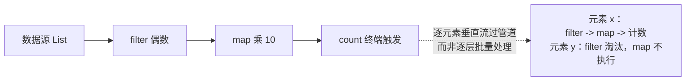

# 08 Stream与函数式

Java 8 的 Lambda 与 Stream 是这门语言近十年最大的范式升级——从"命令式地写循环"转向"声明式地描述变换"。本章先拆开语法糖看本质（函数式接口 + invokedynamic），再系统过一遍 Stream 全 API，最后讨论并行流、Optional 与性能取舍。C++20 ranges 的读者会发现概念惊人地相似，但工程成熟度不同。

> 前置知识：[[java/2深入/02_注解与反射|注解与反射]]（invokedynamic）、[[java/1入门/11_字符串|字符串基础]]。

---

## 一、Lambda 本质

### 1.1 语法糖的两层皮

```java
import java.util.List;

public class LambdaEssence {
    public static void main(String[] args) {
        List<String> names = List.of("alice", "bob", "carol");

        // 匿名内部类写法：冗长
        names.sort(new java.util.Comparator<String>() {
            @Override
            public int compare(String a, String b) {
                return a.compareTo(b);
            }
        });

        // Lambda 写法：只留下参数与方法体
        names.sort((a, b) -> a.compareTo(b));

        // 方法引用写法：更进一步省略参数
        names.sort(String::compareTo);

        System.out.println(names);   // [alice, bob, carol]
    }
}
```

Lambda 并不是匿名内部类的简单缩写，实现机制完全不同：

| 维度 | 匿名内部类 | Lambda |
|------|-----------|--------|
| 编译产物 | 独立的 Outer$1.class | 无独立 class 文件 |
| 调用指令 | 普通 invokeinterface/virtual | **invokedynamic** |
| 实现类生成时机 | javac 编译期 | 运行时首次执行时由 LambdaMetafactory 动态生成 |
| this 含义 | 外部类实例或匿名类自身 | 所在方法的外围实例 |
| 性能 | 每类常驻元空间 | 首次链接后接近直调 |

### 1.2 函数式接口：Lambda 的类型

Lambda 必须有目标类型——**只有一个抽象方法的接口**（SAM 接口）。`@FunctionalInterface` 注解用于编译期校验（见 [[java/2深入/02_注解与反射|注解与反射]]）。

```java
@java.lang.FunctionalInterface   // 注解位于 java.lang 包，无需 import
interface Tripler {
    int apply(int x);

    default void info() { }      // default 不影响 SAM 判定
    static void helper() { }     // static 同样不影响
}
```

---

## 二、四大内置函数式接口

java.util.function 包预置了几十个接口，掌握四个代表即可举一反三：

| 接口 | 抽象方法 | 语义 | 输入 -> 输出 | 典型用途 |
|------|----------|------|--------------|----------|
| `Function<T,R>` | `R apply(T t)` | 变换 | T -> R | map |
| `Consumer<T>` | `void accept(T t)` | 消费 | T -> void | forEach |
| `Supplier<T>` | `T get()` | 生产 | void -> T | 工厂、惰性求值 |
| `Predicate<T>` | `boolean test(T t)` | 判断 | T -> boolean | filter |

```java
import java.util.function.Consumer;
import java.util.function.Function;
import java.util.function.Predicate;
import java.util.function.Supplier;
import java.util.ArrayList;
import java.util.List;

public class FourFuncs {
    public static void main(String[] args) {
        Function<String, Integer> length = String::length;      // 变换
        Consumer<String> printer = System.out::println;          // 消费
        Supplier<List<String>> listMaker = ArrayList::new;       // 生产
        Predicate<String> isLong = s -> s.length() > 3;          // 判断

        List.of("hi", "hello", "hey", "greetings").forEach(s -> {
            if (isLong.test(s)) {              // 用 Predicate 过滤
                printer.accept(length.apply(s));   // 变换后消费
            }
        });

        List<String> fresh = listMaker.get();  // Supplier 造容器
        System.out.println(fresh.isEmpty());   // true

        // 组合子：andThen 串联、negate 取反、and/or 连接
        Function<Integer, Integer> doubleIt = x -> x * 2;
        Function<Integer, Integer> plusTen = x -> x + 10;
        System.out.println(doubleIt.andThen(plusTen).apply(5));   // 20：先乘再加
        System.out.println(doubleIt.compose(plusTen).apply(5));   // 30：先加再乘
    }
}
```

带原始类型的变体 `IntPredicate`、`ToIntFunction` 等（见第八节）能避免装箱。

---

## 三、方法引用的四种形式

| 形式 | 示例 | 等价 Lambda |
|------|------|-------------|
| 静态方法 | `Integer::parseInt` | `s -> Integer.parseInt(s)` |
| 对象实例方法 | `System.out::println` | `x -> System.out.println(x)` |
| 类的实例方法（第一个参数当接收者） | `String::toUpperCase` | `s -> s.toUpperCase()` |
| 构造器引用 | `ArrayList::new` | `() -> new ArrayList<>()` |

第三种最容易迷惑：`String::toUpperCase` 里没有具体对象，接收者是流元素本身。判断口诀：**冒号前有实例用第二种，只有类型名且方法是实例方法则是第三种**。

---

## 四、Stream 创建方式

```java
import java.util.Arrays;
import java.util.List;
import java.util.stream.IntStream;
import java.util.stream.Stream;

public class CreateStreams {
    public static void main(String[] args) {
        // 1. 集合的 stream() —— 最常用
        List<String> list = List.of("a", "b");
        Stream<String> s1 = list.stream();

        // 2. Arrays.stream 处理数组
        IntStream s2 = Arrays.stream(new int[]{1, 2, 3});

        // 3. Stream.of 直接给值
        Stream<String> s3 = Stream.of("x", "y");

        // 4. generate/supplier 无限流（必须 limit 截断！）
        Stream<Double> s4 = Stream.generate(Math::random).limit(3);

        // 5. iterate 规则迭代
        Stream<Integer> powers = Stream.iterate(1, n -> n * 2).limit(10);

        // 6. 原始类型区间
        IntStream range = IntStream.rangeClosed(1, 100);

        System.out.println(powers.toList());
        System.out.println(range.sum());
    }
}
```

注意：Stream 是**一次性**的，终端操作后即作废，复用抛 IllegalStateException。

---

## 五、中间操作与惰性求值

| 中间操作 | 作用 | 有状态？ |
|----------|------|----------|
| filter | 按条件保留 | 无 |
| map / mapToXxx | 一对一变换 | 无 |
| flatMap | 一对多展平 | 无 |
| distinct | 去重 | 有（需记住已见元素） |
| sorted | 排序 | 有（缓冲全部） |
| peek | 旁路观察（调试用） | 无 |
| limit / skip | 截断/跳过 | 有（短路特性） |

```java
import java.util.List;

public class LazyDemo {
    public static void main(String[] args) {
        List<Integer> nums = List.of(5, 3, 8, 1, 9, 2);

        // 关键实验：中间操作不会立刻执行任何计算
        var pipeline = nums.stream()
            .peek(n -> System.out.println("经过 filter 前: " + n))
            .filter(n -> n % 2 == 0)
            .map(n -> {
                System.out.println("map 放大: " + n);
                return n * 10;
            });

        System.out.println("--- 到这里什么都没打印，直到终端操作 ---");
        long count = pipeline.count();   // 终端操作触发整条链

        System.out.println("偶数个数：" + count);
        // 观察 peek 输出顺序：逐元素流过整条管道，
        // 而不是先 filter 完再 map —— 这就是惰性求值 + 元素垂直遍历
    }
}
```

惰性求值的执行模型一图流：



两个重要推论：

1. **无终端操作的流一行代码都不会执行**（常见 bug 来源）
2. 元素是"一个一个流过整条流水线"，而非"每层处理完再进下层"，因此 limit 能提前终止后续所有层的计算

flatMap 是理解门槛最高的操作：

```java
import java.util.List;

public class FlatMapDemo {
    public static void main(String[] args) {
        // 场景：每个句子拆成单词，汇成总词表
        List<String> sentences = List.of(
            "hello world java",
            "stream is powerful");

        List<String> words = sentences.stream()
            .flatMap(sentence -> java.util.Arrays.stream(sentence.split(" ")))
            .toList();
        System.out.println(words);   // [hello, world, java, stream, is, powerful]

        // 若用 map 会得到 Stream<Stream<String>> 嵌套结构，flatMap 就是"压平"
    }
}
```

---

## 六、终端操作与收集器

### 6.1 常用终端操作

| 操作 | 说明 |
|------|------|
| forEach / forEachOrdered | 逐个消费（后者保序） |
| collect | 收集到容器（配合 Collectors） |
| reduce | 归约聚合 |
| count / sum / average | 计数与统计 |
| anyMatch / allMatch / noneMatch | 短路匹配 |
| findFirst / findAny | 找一个（前者保序） |
| toArray / toList | 转集合（JDK16+ 有 toList） |

```java
import java.util.List;
import java.util.Optional;

public class TerminalOps {
    public static void main(String[] args) {
        List<Integer> nums = List.of(1, 2, 3, 4, 5);

        // reduce：带初始值的归约
        int sum = nums.stream().reduce(0, Integer::sum);
        int product = nums.stream().reduce(1, (a, b) -> a * b);
        Optional<Integer> max = nums.stream().reduce(Integer::max);
        System.out.println(sum + " " + product + " " + max.orElse(0));

        // 短路匹配：找到即停
        boolean hasEven = nums.stream().anyMatch(n -> n % 2 == 0);
        System.out.println(hasEven);
    }
}
```

### 6.2 收集器全家桶

```java
import java.util.List;
import java.util.Map;
import java.util.Set;
import java.util.TreeMap;
import java.util.stream.Collectors;

public class CollectorsDemo {
    record Person(String name, String city, int age) { }

    public static void main(String[] args) {
        List<Person> people = List.of(
            new Person("张三", "北京", 25),
            new Person("李四", "上海", 32),
            new Person("王五", "北京", 19),
            new Person("赵六", "上海", 28));

        // toList / toSet / toMap
        Map<String, Integer> byName = people.stream()
            .collect(Collectors.toMap(Person::name, Person::age));
        System.out.println(byName);   // 键冲突会抛异常，可用三参版给合并函数

        // groupingBy：按城市分组
        Map<String, List<Person>> byCity = people.stream()
            .collect(Collectors.groupingBy(Person::city));
        System.out.println(byCity.keySet());

        // 分组 + 下游统计：每城人数与最大年龄
        Map<String, Long> cityCount = people.stream()
            .collect(Collectors.groupingBy(Person::city, Collectors.counting()));
        Map<String, java.util.Optional<Person>> eldest = people.stream()
            .collect(Collectors.groupingBy(Person::city,
                     Collectors.maxBy(java.util.Comparator.comparingInt(Person::age))));

        // partitioningBy：按布尔二分
        Map<Boolean, List<Person>> adults = people.stream()
            .collect(Collectors.partitioningBy(p -> p.age() >= 18));
        System.out.println("成年人：" + adults.get(true).size());

        // joining：字符串拼接
        String names = people.stream()
            .map(Person::name)
            .collect(Collectors.joining(", ", "[", "]"));
        System.out.println(names);   // [张三, 李四, 王五, 赵六]
    }
}
```

groupingBy 与 partitioningBy 的区别：前者按 key 多分组，后者固定 true/false 两组且性能更好。

---

## 七、Optional：与 null 的体面告别

### 7.1 为什么需要它

`NullPointerException` 是 Java 史上最高频的异常。Optional 把"可能没有值"编码进**类型签名**，让调用方无法忽视：

```java
import java.util.Optional;

public class OptionalDemo {
    static Optional<String> findUser(long id) {
        return id == 42 ? Optional.of("张三") : Optional.empty();
    }

    public static void main(String[] args) {
        // 创建三式
        Optional<String> a = Optional.of("value");          // 值不能为 null
        Optional<String> b = Optional.empty();               // 明确为空
        Optional<String> c = Optional.ofNullable(nullValue()); // 可能为 null 的来源

        // 取值四式
        System.out.println(a.get());                          // 不推荐：退化回裸用
        System.out.println(c.orElse("默认值"));               // 空则给默认
        System.out.println(c.orElseGet(() -> "惰性默认"));     // 默认值构造昂贵时用
        System.out.println(a.map(String::length).orElse(0));  // 链式变换

        // 查询链：findUser -> 转换 -> 兜底，全程无 if (x != null)
        String name = findUser(42)
            .map(u -> "用户：" + u)
            .orElse("未找到");
        System.out.println(name);

        // orElseThrow：空则抛业务异常（推荐用于"必须有值"的语义）
        try {
            String must = findUser(1)
                .orElseThrow(() -> new IllegalStateException("用户不存在"));
            System.out.println(must);
        } catch (IllegalStateException e) {
            System.out.println(e.getMessage());
        }

        // ifPresent：有值才执行副作用
        a.ifPresent(v -> System.out.println("存在：" + v));

        // 反模式清单：
        // Optional<User> o = ...;
        // o.get() 直接取           —— 丢掉类型安全意义
        // o.isPresent() 再 get()   —— 命令式旧习
        // 用作字段/方法参数         —— 官方明确不推荐，只做返回类型
    }

    static String nullValue() { return null; }
}
```

| API | 语义 | 备注 |
|-----|------|------|
| of / ofNullable / empty | 创建 | 外部数据一律 ofNullable |
| orElse vs orElseGet | 默认值急切 vs 惰性求值 | 重计算场景选 Get |
| map / flatMap | 变换容器内值 | flatMap 处理嵌套 Optional |
| filter | 条件保留 | 组合校验利器 |

---

## 八、原始类型流与装箱陷阱

`Stream<Integer>` 的每个元素都是堆上的包装对象——算法题和数值密集场景必须换原始流：

```java
import java.util.List;

public class PrimitiveStream {
    public static void main(String[] args) {
        List<Integer> boxed = List.of(1, 2, 3, 4, 5);

        int sumBoxed = boxed.stream().mapToInt(Integer::intValue).sum(); // 装箱流转原始流
        long count = java.util.stream.IntStream.rangeClosed(1, 1_000_000).count();

        // 原始流的专属操作：sum/max/min/average/summaryStatistics
        var stats = java.util.stream.IntStream.of(3, 9, 1, 7).summaryStatistics();
        System.out.printf("max=%d min=%d avg=%.2f%n",
                          stats.getMax(), stats.getMin(), stats.getAverage());
        System.out.println(sumBoxed + " " + count);
    }
}
```

转换桥梁：`mapToInt/mapToLong/mapToDouble` 进入原始流，`boxed()` 返回包装流。一千万次求和的基准里，IntStream 通常比 Stream<Integer> 快数倍且内存压力骤减。

---

## 九、并行流 parallelStream

### 9.1 原理与用法

```java
import java.util.stream.IntStream;

public class ParallelDemo {
    public static void main(String[] args) {
        // 一行切换并行：底层 ForkJoinPool.commonPool 分治
        long start = System.currentTimeMillis();
        long s1 = IntStream.rangeClosed(1, 100_000_000).parallel().sum();
        long mid = System.currentTimeMillis();
        long s2 = IntStream.rangeClosed(1, 100_000_000).sequential().sum();
        long end = System.currentTimeMillis();

        System.out.println((s1) + " 并行耗时 " + (mid - start) + "ms");
        System.out.println((s2) + " 串行耗时 " + (end - mid) + "ms");
        // 多核机器上求和类任务并行通常明显更快
    }
}
```

### 9.2 适用判断清单

| 条件 | 说明 |
|------|------|
| 数据量足够大 | 千级以下别折腾，拆分开销超过收益 |
| 单元素处理足够重 | 否则分派成本占比过高 |
| 无状态、无副作用 | forEach 里改共享集合是经典事故 |
| 数据源易分割 | ArrayList/数组好切；LinkedList/迭代器差 |
| 不依赖顺序 | unordered/findAny 类操作才能放开手脚 |

三个红线：公共 ForkJoinPool 被 IO 任务阻塞会拖垮全 JVM 所有并行流；有副作用的操作在并行下结果错乱且不可复现；线程安全问题不会因代码优雅而豁免。**拿不准就用串行**。

---

## 十、性能取舍与 C++20 ranges 对比

### 10.1 Stream vs for 循环

| 维度 | for 循环 | 串行 Stream |
|------|----------|-------------|
| 极致性能 | 最优（JIT 内联友好） | 略慢（管道搭建、Lambda 开销） |
| 简单聚合可读性 | 一般 | 显著更好 |
| 复杂多级变换 | 嵌套深、临时变量满天飞 | 声明式流水线清晰 |
| 调试 | 直观单步 | 需要 peek 或断点技巧 |

结论：**热路径的简单循环用 for；业务代码的过滤映射分组聚合用 Stream**。不要教条，看哪个版本更接近人类语言。

### 10.2 与 C++20 ranges 对比

| 维度 | Java Stream | C++20 ranges |
|------|-------------|--------------|
| 执行模型 | 惰性拉取，终端触发 | 惰性视图，遍历触发 |
| 性能 | 有装箱/间接层成本 | 零成本抽象，编译期组合 |
| 并行 | parallelStream 一键切换 | 无内置，需 execution policy 库 |
| 收集器生态 | Collectors 极丰富 | 无对应物，需手写或 range-v3 |
| 易错点 | 忘记终端操作、复用作废 | 悬垂视图（dangling view） |

哲学差异同泛型一章：Java 用运行时抽象换取统一体验，C++ 用编译期展开榨取零开销。ranges 的 `views::filter | views::transform` 与 Stream 管道几乎一一对应，学过一方另一方半小时上手。

---

## 小结

| 知识点 | 一句话 |
|--------|--------|
| Lambda 本质 | 函数式接口目标类型 + invokedynamic 动态生成实现 |
| 四大接口 | Function 变换、Consumer 消费、Supplier 生产、Predicate 判断 |
| 惰性求值 | 中间操作搭管道，终端操作才执行 |
| collect | groupingBy/partitioningBy/joining 是三大杀器 |
| Optional | 只做返回类型，orElseGet/orElseThrow 是主力 |
| 原始流 | 数值密集必用 IntStream 避免装箱 |
| 并行流 | 数据大+任务重+无副作用三条件齐备再开 |

---

## LeetCode 巩固

以下题目非常适合练习 Stream 解法——先写传统循环版，再用 Stream 重写一遍对比可读性：

| 题目 | 链接 | 练习点 |
|------|------|--------|
| 数组中的多数元素 | [majority-element](https://leetcode.cn/problems/majority-element/) | groupingBy 计数一行解；进阶练 Boyer-Moore 投票 O(1) 空间 |
| 只出现一次的数字 III | [single-number-iii](https://leetcode.cn/problems/single-number-iii/) | 传统位运算之外，试试 Stream 的 partitioningBy 按某位二分 |
| 两个列表的最小索引总和 | [minimum-index-sum-of-two-lists](https://leetcode.cn/problems/minimum-index-sum-of-two-lists/) | HashMap 建索引 + Stream 过滤组合的经典套路 |

下一章离开纯语言层面，进入 NIO 与网络编程的世界。
