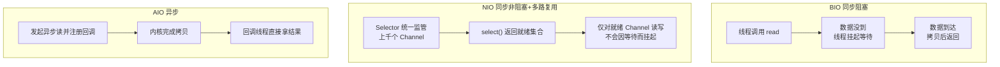
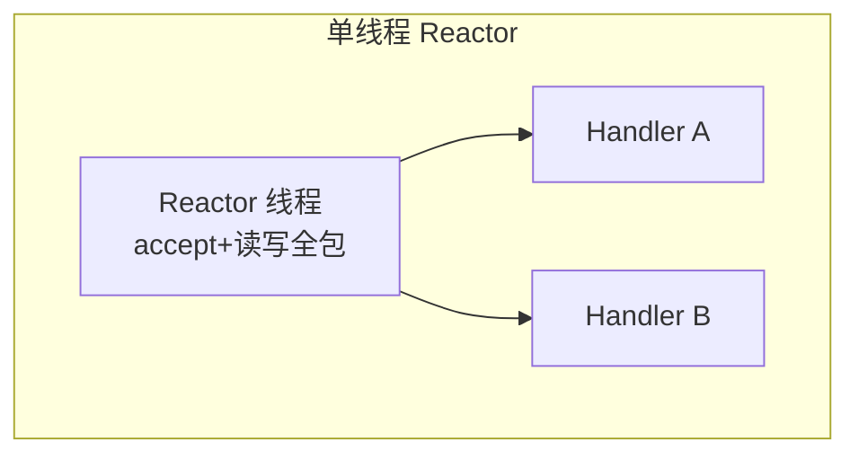
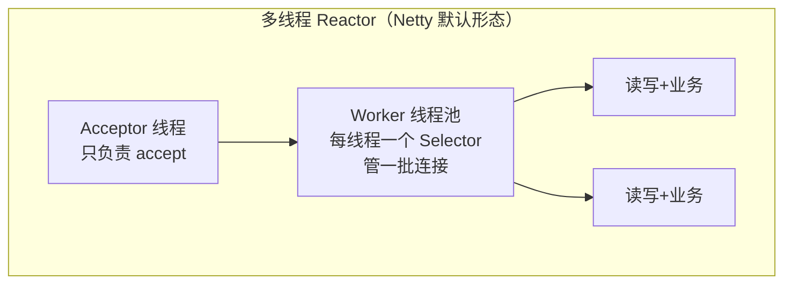
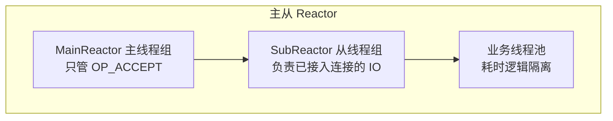
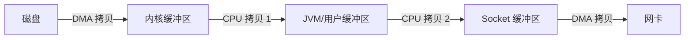

# 09 NIO与网络编程

写 C 网络程序的人对 socket、accept、read 的阻塞语义再熟悉不过。Java 早期 BIO 与之一一对应，也继承了"一个连接一个线程"的扩展性天花板；NIO 用 Buffer/Channel/Selector 三件套把 epoll 式的多路复用带进 Java，成为 Netty/Kafka/RocketMQ 这类高性能中间件的底座。本章从 BIO 讲到 NIO 再到 AIO，最后覆盖 Reactor 模式、零拷贝与现代 HttpClient。

> 前置知识：[[java/2深入/04_多线程基础|多线程基础]]（线程模型）。

---

## 一、BIO：阻塞式 IO

### 1.1 最小可运行服务端与客户端

```java
import java.io.BufferedReader;
import java.io.IOException;
import java.io.InputStreamReader;
import java.io.PrintWriter;
import java.net.ServerSocket;
import java.net.Socket;

public class BioServer {
    public static void main(String[] args) throws IOException {
        // 监听 8080，等价于 C 的 socket + bind + listen
        try (ServerSocket server = new ServerSocket(8080)) {
            System.out.println("BIO 服务端启动");
            while (true) {
                Socket client = server.accept();     // 阻塞直到有连接进来
                // 为每个连接开一个线程——BIO 的标志性行为
                new Thread(() -> handle(client)).start();
            }
        }
    }

    static void handle(Socket client) {
        try (client;
             var in = new BufferedReader(
                 new InputStreamReader(client.getInputStream()));
             var out = new PrintWriter(client.getOutputStream(), true)) {

            String line;
            while ((line = in.readLine()) != null) {   // readLine 阻塞直到一行数据
                System.out.println("收到：" + line);
                out.println("echo: " + line);           // 回显
                if ("bye".equals(line)) break;
            }
        } catch (IOException e) {
            System.err.println("连接异常: " + e.getMessage());
        }
    }
}
```

```java
import java.io.BufferedReader;
import java.io.IOException;
import java.io.InputStreamReader;
import java.io.PrintWriter;
import java.net.Socket;

public class BioClient {
    public static void main(String[] args) throws IOException {
        try (Socket socket = new Socket("127.0.0.1", 8080);
             var in = new BufferedReader(new InputStreamReader(socket.getInputStream()));
             var out = new PrintWriter(socket.getOutputStream(), true);
             var keyboard = new BufferedReader(new InputStreamReader(System.in))) {

            String input;
            while ((input = keyboard.readLine()) != null) {
                out.println(input);                       // 发送一行
                if ("bye".equals(input)) break;
                System.out.println("服务器回复：" + in.readLine());   // 阻塞等回包
            }
        }
    }
}
```

### 1.2 与 C socket 编程的流程对照

| 步骤 | C | Java BIO |
|------|---|----------|
| 创建监听 | `socket()` + `bind()` + `listen()` | `new ServerSocket(port)` 一行封装三步 |
| 接受连接 | `accept()` 返回 fd | `server.accept()` 返回 Socket |
| 读写 | `recv()/send()` | InputStream.read / OutputStream.write |
| 关闭 | `close(fd)` | socket.close() |
| 连接处理 | 通常 fork 或线程池 | 每连接一线程 |

流程完全同构，Java 只是把 fd 包装成对象。真正的问题在并发模型：

### 1.3 BIO 的问题

- **线程资源**：每个连接占一条内核线程，1 万连接 = 1 万线程，内存（每栈默认 1MB）与调度开销爆炸
- **阻塞浪费**：连接建立后大部分时间在等数据，线程干等着不干活
- C 里同样的困境催生了 select/poll/epoll，Java 的答案是 NIO。

---

## 二、三种 IO 模型对比



| 维度 | BIO | NIO | AIO |
|------|-----|-----|-----|
| 阻塞点 | read/write 全阻塞 | select 阻塞但读写就绪才做 | 无应用层阻塞 |
| 并发能力 | 连接数 ~ 线程数 | 单线程管上万连接 | 同 NIO |
| 编程复杂度 | 低 | 高（事件循环状态机） | 中（回调地狱风险） |
| 典型框架 | 老旧系统 | Netty（Reactor）、Kafka | 较少主流采用 |
| 适用 | 连接少且固定 | 高并发长连接 | Windows IOCP 场景 |

Linux 下 AIO 实现长期不完善（epoll 本质是同步非阻塞），所以生产世界基本是 NIO/Reactor 的天下，Netty 至今默认不用 AIO。

---

## 三、NIO 三大件

### 3.1 Buffer：数据的容器

核心属性关系：`0 <= mark <= position <= limit <= capacity`。

| 方法 | 效果 |
|------|------|
| put/get 写入读取 | 移动 position |
| flip() | 写转读模式：limit=position, position=0 |
| clear() | 清空重来：position=0, limit=capacity |
| rewind() | 重读：仅 position=0 |
| compact() | 压缩未读数据到头部后继续写 |

```java
import java.nio.ByteBuffer;
import java.nio.charset.StandardCharsets;

public class BufferDemo {
    public static void main(String[] args) {
        ByteBuffer buf = ByteBuffer.allocate(16);      // capacity=16

        buf.put("hello".getBytes(StandardCharsets.UTF_8));   // 写模式
        System.out.println("写后 position=" + buf.position());   // 5

        buf.flip();                                    // 切换为读
        byte[] dst = new byte[buf.remaining()];
        buf.get(dst);
        System.out.println("读到：" + new String(dst));

        buf.clear();                                   // 回到写模式
        buf.put("hi".getBytes());
        buf.rewind();
        System.out.println("重读第一个字节：" + (char) buf.get());

        // DirectByteBuffer：堆外内存，免一次 JVM 内拷贝，网络高频场景用
        ByteBuffer direct = ByteBuffer.allocateDirect(1024);
        System.out.println("是否堆外：" + direct.isDirect());
    }
}
```

flip/clear 的心智模型：Buffer 是一把双刃尺，flip 就是把游标拨回起点并给终点画线。

### 3.2 Channel 与 Selector：多路复用事件循环

```java
import java.io.IOException;
import java.net.InetSocketAddress;
import java.nio.ByteBuffer;
import java.nio.channels.SelectionKey;
import java.nio.channels.Selector;
import java.nio.channels.ServerSocketChannel;
import java.nio.channels.SocketChannel;
import java.util.Iterator;

public class NioServer {
    public static void main(String[] args) throws IOException {
        ServerSocketChannel server = ServerSocketChannel.open();
        server.bind(new InetSocketAddress(8080));
        server.configureBlocking(false);              // 关键：非阻塞模式

        Selector selector = Selector.open();
        server.register(selector, SelectionKey.OP_ACCEPT);   // 注册关注事件

        ByteBuffer buffer = ByteBuffer.allocate(256);

        while (true) {                                 // 事件循环——Netty 的灵魂
            selector.select();                         // 阻塞直到有事件（对应 epoll_wait）
            Iterator<SelectionKey> it = selector.selectedKeys().iterator();

            while (it.hasNext()) {
                SelectionKey key = it.next();
                it.remove();                           // 必须手动移除，否则重复处理

                if (key.isAcceptable()) {
                    SocketChannel client = server.accept();
                    client.configureBlocking(false);
                    client.register(selector, SelectionKey.OP_READ);   // 关注读事件
                    System.out.println("新连接：" + client.getRemoteAddress());

                } else if (key.isReadable()) {
                    SocketChannel client = (SocketChannel) key.channel();
                    buffer.clear();
                    int n = client.read(buffer);
                    if (n == -1) {                     // 对端关闭
                        key.cancel();
                        client.close();
                        continue;
                    }
                    buffer.flip();
                    client.write(buffer);              // echo 回去
                }
            }
        }
    }
}
```

要点：

- 一个线程 + 一个 Selector 即可服务成千上万的连接——这就是"多路复用"
- 底层在 Linux 上就是 epoll（JDK 的 EPollSelectorProvider），macOS 是 kqueue，Windows 是 select 封装
- 四类事件：OP_ACCEPT / OP_CONNECT / OP_READ / OP_WRITE（write 就绪几乎总是真，注册它需谨慎）

### 与 C epoll 对照表

| 步骤 | C epoll | Java NIO |
|------|---------|----------|
| 创建实例 | `epoll_create` | `Selector.open()` |
| 注册 fd | `epoll_ctl(ADD)` | `channel.register(sel, ops)` |
| 等待事件 | `epoll_wait` | `selector.select()` |
| 事件结构 | struct epoll_event | SelectionKey |
| 边缘/水平触发 | 可选 ET/LT | LT 语义 |
| 平台差异 | Linux only | JDK 屏蔽为统一 API |

---

## 四、Reactor 模式

NIO 只是原料，把它组织成清晰架构的就是 Reactor 模式：







| 变体 | 结构 | 适用 |
|------|------|------|
| 单线程 | 一个线程包揽一切 | 客户端、demo |
| 多线程 | Acceptor + Worker 池 | 大多数服务端 |
| 主从 | Main/Sub 两组线程 | 高吞吐网关，Netty 标配 |

Redis（单线程 Reactor）、Memcached（多线程）、Netty（主从+业务隔离）分别对应三种变体，理解这张图就能看懂它们的事件循环骨架。

---

## 五、零拷贝

传统读文件发网络的路径要四次拷贝 + 四次上下文切换：



`FileChannel.transferTo` 直接调用操作系统的 sendfile，砍掉用户态中转：

```java
import java.io.IOException;
import java.net.InetSocketAddress;
import java.nio.channels.FileChannel;
import java.nio.channels.SocketChannel;
import java.nio.file.Path;
import java.nio.file.StandardOpenOption;

public class ZeroCopy {
    public static void main(String[] args) throws IOException {
        try (FileChannel file = FileChannel.open(
                 Path.of("bigfile.bin"), StandardOpenOption.READ);
             SocketChannel client = SocketChannel.open(
                 new InetSocketAddress("127.0.0.1", 9000))) {

            long size = file.size();
            // 数据从页缓存直达网卡 socket 缓冲区，不进 JVM 堆
            file.transferTo(0, size, client);
        }
    }
}
```

| 方案 | 拷贝次数（磁盘到网卡） | 使用者 |
|------|------------------------|--------|
| 传统 read+write | 4 | 普通 IO |
| mmap+write | 3 | RocketMQ 的文件读写 |
| sendfile (transferTo) | 3，硬件支持时 2 | Kafka、Nginx |

Kafka 消费消息时 broker 几乎不碰数据本身——索引定位后直接 transferTo，这是它能单机百万级消息吞吐的秘诀之一。mmap 则把文件映射进内存地址空间，适合需要"像改内存一样改文件"的场景。

---

## 六、AIO 简单示例

```java
import java.net.InetSocketAddress;
import java.nio.ByteBuffer;
import java.nio.channels.AsynchronousServerSocketChannel;
import java.nio.channels.AsynchronousSocketChannel;
import java.util.concurrent.ExecutionException;
import java.util.concurrent.Future;

public class AioServer {
    public static void main(String[] args) throws Exception {
        AsynchronousServerSocketChannel server =
            AsynchronousServerSocketChannel.open()
                .bind(new InetSocketAddress(8081));

        System.out.println("AIO 服务端启动");

        while (true) {
            Future<AsynchronousSocketChannel> acceptFuture = server.accept();
            // accept 不阻塞当前线程，get() 时才等待结果
            try (AsynchronousSocketChannel client = acceptFuture.get()) {
                ByteBuffer buf = ByteBuffer.allocate(256);
                Future<Integer> read = client.read(buf);
                int n = read.get();                    // 异步发起，同步取结果
                if (n > 0) {
                    buf.flip();
                    client.write(buf);                 // echo
                }
            } catch (InterruptedException | ExecutionException e) {
                System.err.println("连接处理失败");
            }
        }
    }
}
```

也可以用 CompletionHandler 回调风格完全摆脱 get 阻塞。实践中 Java AIO 用得少：Linux 上没有真正的异步 IO 系统调用红利，Netty 曾支持后也移除了 aio transport。知道它存在即可。

---

## 七、HttpClient：Java 11 内置的现代 HTTP 客户端

HttpURLConnection 时代终于翻篇，Java 11 起自带支持 HTTP/2 的客户端：

```java
import java.net.URI;
import java.net.http.HttpClient;
import java.net.http.HttpRequest;
import java.net.http.HttpResponse;
import java.time.Duration;
import java.util.concurrent.CompletableFuture;

public class HttpDemo {
    public static void main(String[] args) throws Exception {
        HttpClient client = HttpClient.newBuilder()
            .version(HttpClient.Version.HTTP_2)          // 自动降级 HTTP/1.1
            .connectTimeout(Duration.ofSeconds(5))
            .build();

        // ---- 同步 GET ----
        HttpRequest get = HttpRequest.newBuilder()
            .uri(URI.create("https://httpbin.org/get"))
            .header("Accept", "application/json")
            .GET()
            .build();

        HttpResponse<String> resp =
            client.send(get, HttpResponse.BodyHandlers.ofString());
        System.out.println("状态码: " + resp.statusCode());
        System.out.println("响应头: " + resp.headers().firstValue("content-type").orElse(""));

        // ---- 异步 POST ----
        HttpRequest post = HttpRequest.newBuilder()
            .uri(URI.create("https://httpbin.org/post"))
            .header("Content-Type", "application/json")
            .POST(HttpRequest.BodyPublishers.ofString("{\"name\":\"张三\"}"))
            .build();

        CompletableFuture<HttpResponse<String>> future =
            client.sendAsync(post, HttpResponse.BodyHandlers.ofString());

        // 与 [[java/2深入/05_并发包与线程池|CompletableFuture]] 编排无缝衔接
        future.thenApply(HttpResponse::body)
              .thenAccept(body -> System.out.println("异步结果长度：" + body.length()))
              .join();
    }
}
```

对比 C 里手写 libcurl 或裸拼 HTTP 报文，标准库级别的现代客户端让 Java 做服务间调用的门槛大幅降低。

---

## 八、综合：NIO 思想在业务中的投影

不必人人手写 Selector，但 NIO 的概念无处不在：

| NIO 概念 | 上层投影 |
|----------|----------|
| 事件循环 | Netty EventLoopGroup、Redis 单线程命令处理 |
| Buffer 读写切换 | Kafka 的消息批量刷盘、Netty ByteBuf |
| Reactor 主从 | Spring WebFlux、gRPC-Java 的传输层 |
| 零拷贝 transferTo | Kafka 消费链路、RocketMQ 的 mmap |
| 多路复用 | 一切高性能网关的底座（Nginx 同理） |

学习建议：理解本章模型后，去读 Netty 官方 Echo 示例，你会发现每个组件（EventLoop/Channel/Pipeline）都能映射回本章概念。

---

## 小结

| 知识点 | 一句话 |
|--------|--------|
| BIO | 一连接一线程，简单但不可扩展 |
| NIO 三件套 | Channel 运输、Buffer 缓存、Selector 监工 |
| Buffer | position/limit/capacity 三指针，flip 切换读写 |
| Selector | select() 即 epoll_wait，事件循环必须 remove key |
| Reactor | 单线程->多线程->主从的演进即 Netty 架构史 |
| 零拷贝 | transferTo/sendfile 是 Kafka 高吞吐的秘密 |
| HttpClient | Java 11 起内置，同步异步双模 |

---

## LeetCode 巩固

网络协议本质是字符流的解析与状态管理，以下两题训练报文结构处理的直觉：

| 题目 | 链接 | 练习点 |
|------|------|--------|
| [有效的括号](https://leetcode.cn/problems/valid-parentheses/) | valid-parentheses | 栈匹配括号——类比协议帧定界与嵌套结构校验 |
| 字符串解码 | [decode-string](https://leetcode.cn/problems/decode-string/) | 双栈处理"数字[内容]"嵌套——类比 TLV 报文的递归解码 |

下一章把工程经验沉淀为设计模式。
