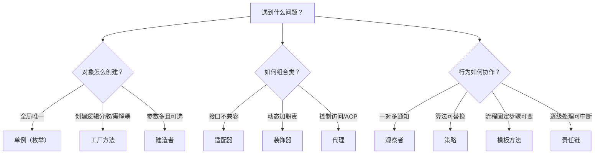

# 10 设计模式

C 里实现 GOF 模式要手写函数指针表和结构体组合，Java 的接口、反射、动态代理把这些成本降了一个量级——所以设计模式在 Java 世界无处不在，只是常常换了名字藏在 JDK 与框架里。本章不背 23 个模式，而是抓六大原则加十余个高频模式的"Java 原生形态"，让你下次读 Spring/Kafka 源码时能认出老朋友。

> 前置知识：[[java/1入门/14_继承与多态|继承与多态]]、[[java/2深入/02_注解与反射|注解与反射]]（动态代理）。

---

## 一、六大设计原则速览

| 原则 | 缩写 | 一句话 | 反例信号 |
|------|------|--------|----------|
| 单一职责 | SRP | 一个类只因一个理由变化 | God Class 千行混杂解析+存储+渲染 |
| 开闭原则 | OCP | 对扩展开放，对修改关闭 | 加一种支付方式要改 if-else 老代码 |
| 里氏替换 | LSP | 子类必须能无痕替换父类 | 子类方法抛 UnsupportedOperationException |
| 接口隔离 | ISP | 接口小而专 | 万能接口逼出十几个空实现 |
| 依赖倒置 | DIP | 依赖抽象而非具体实现 | 业务层直接 new 具体数据库驱动 |
| 迪米特法则 | LoD | 只和直接朋友说话 | a.getB().getC().doIt() 链式越权 |
| 合成复用 | CRP | 优先组合而非继承 | 为复用一个方法强行 extends |

OCP 是目标，DIP 与 ISP 是手段，SRP/LSP 是底线——这是理解全部模式的总纲。

---

## 二、创建型模式

### 2.1 单例的五种写法（重点）

```java
import java.lang.reflect.Constructor;

public class SingletonPatterns {

    // 写法一：饿汉式 —— 类加载即创建，简单但可能浪费
    static class EagerSingleton {
        private static final EagerSingleton INSTANCE = new EagerSingleton();
        private EagerSingleton() {}
        public static EagerSingleton getInstance() { return INSTANCE; }
    }

    // 写法二：懒汉式 + 双重检查锁（DCL）
    // instance 必须 volatile：防止 new 的三步（分配内存/初始化/赋值引用）
    // 被指令重排，否则其他线程可能拿到未构造完的对象
    static class LazySingleton {
        private static volatile LazySingleton instance;
        private LazySingleton() {}
        public static LazySingleton getInstance() {
            if (instance == null) {                    // 第一次检查：多数调用免锁
                synchronized (LazySingleton.class) {
                    if (instance == null) {            // 锁内二次确认
                        instance = new LazySingleton();
                    }
                }
            }
            return instance;
        }
    }

    // 写法三：静态内部类 —— 利用类加载机制天然线程安全且懒加载（实用推荐）
    static class HolderSingleton {
        private HolderSingleton() {}
        private static class Holder {
            static final HolderSingleton INSTANCE = new HolderSingleton();
        }
        public static HolderSingleton getInstance() { return Holder.INSTANCE; }
    }

    // 写法四：枚举 —— Effective Java 强烈推荐的首选
    enum EnumSingleton {
        INSTANCE;                                      // JVM 保证唯一
        public void doWork() { System.out.println("working"); }
    }

    public static void main(String[] args) throws Exception {
        System.out.println(EagerSingleton.getInstance()
                           == EagerSingleton.getInstance());   // true
        System.out.println(HolderSingleton.getInstance()
                           == HolderSingleton.getInstance());  // true
        EnumSingleton.INSTANCE.doWork();

        // 验证普通单例可被反射破解：
        Constructor<LazySingleton> c =
            LazySingleton.class.getDeclaredConstructor();
        c.setAccessible(true);
        try {
            Object hacked = c.newInstance();           // 绕过私有构造器！
            System.out.println("反射创建出第二个实例：" + (hacked != null));
        } catch (Exception e) {
            System.out.println("被拦：" + e);
        }
        // 枚举则不同：JDK 的 newInstance 对枚举类型直接抛 IllegalArgumentException
    }
}
```

第五种写法是"懒汉式 + 方法级 synchronized"，线程安全但每次获取都抢锁，性能差，仅作历史了解。

| 写法 | 线程安全 | 懒加载 | 防反射 | 防序列化破坏 | 推荐度 |
|------|----------|--------|--------|--------------|--------|
| 饿汉 | 是 | 否 | 否 | 需额外处理 | 简单场景可用 |
| DCL | 是 | 是 | 否 | 需额外处理 | 面试必会 |
| 静态内部类 | 是 | 是 | 否 | 需额外处理 | 实用推荐 |
| **枚举** | 是 | 否 | **是** | **是** | **首选** |

### 2.2 工厂三兄弟

```java
// 简单工厂：静态方法按参数造对象（严格说不算 GOF，但最常用）
class SimpleFactory {
    interface Shape { void draw(); }

    static Shape create(String type) {
        return switch (type) {                 // switch 表达式见第 11 章
            case "circle" -> () -> System.out.println("圆形");
            case "square" -> () -> System.out.println("方形");
            default -> throw new IllegalArgumentException(type);
        };
    }
}

// 工厂方法：每种产品一个工厂，新增产品不改老代码（满足 OCP）
interface ShapeFactory { SimpleFactory.Shape create(); }

class CircleFactory implements ShapeFactory {
    public SimpleFactory.Shape create() {
        return SimpleFactory.create("circle");
    }
}

// 抽象工厂：一族相关产品的整体生产
interface GuiFactory {
    Button createButton();
    Checkbox createCheckbox();
}
```

选择建议：产品少且稳定用简单工厂；预计横向扩展用工厂方法；存在"产品族"概念才上抽象工厂。Spring 的 BeanFactory 就是超级工厂思想的产品化。

### 2.3 建造者模式

分步构建复杂对象，链式 API 的来源：

```java
public class BuilderDemo {
    // 手写一个不可变配置对象（record 详见第 11 章）
    record HttpConfig(String url, int timeoutMs, int retries, String proxy) {
        static class Builder {
            private String url = "http://localhost";
            private int timeoutMs = 3000;
            private int retries = 0;
            private String proxy = "";

            Builder url(String v) { this.url = v; return this; }
            Builder timeoutMs(int v) { this.timeoutMs = v; return this; }
            Builder retries(int v) { this.retries = v; return this; }
            Builder proxy(String v) { this.proxy = v; return this; }

            HttpConfig build() {
                if (retries < 0 || retries > 10) {          // 构建时统一校验
                    throw new IllegalArgumentException("非法重试次数");
                }
                return new HttpConfig(url, timeoutMs, retries, proxy);
            }
        }
    }

    public static void main(String[] args) {
        HttpConfig cfg = new HttpConfig.Builder()
            .url("https://api.example.com")
            .timeoutMs(5000)
            .retries(3)
            .build();                       // 每个 setter 返回 this 形成链
        System.out.println(cfg);
    }
}
```

JDK 实证：`StringBuilder` 的 append 链、`HttpClient.newBuilder()`、Lombok 的 `@Builder` 全是此模式。适用信号：构造参数超过四个、多个参数可选、需要不可变对象。

---

## 三、结构型模式

### 3.1 适配器：转换既有接口

```java
// 老系统输出 XML，新系统只认 JSON —— 写个适配器粘合
interface JsonApi { String getJson(); }

class LegacyXmlSystem {
    String getXml() { return "<user><name>张三</name></user>"; }
}

class XmlToJsonAdapter implements JsonApi {
    private final LegacyXmlSystem legacy;

    XmlToJsonAdapter(LegacyXmlSystem legacy) { this.legacy = legacy; }

    @Override
    public String getJson() {
        return legacy.getXml()
                      .replace("<user>", "{\"user\":")
                      .replace("</user>", "}")
                      .replace("<name>", "\"name\":\"")
                      .replace("</name>", "\"}");
    }
}
```

### 3.2 装饰器：JDK IO 的骨架

```java
import java.io.BufferedInputStream;
import java.io.DataInputStream;
import java.io.FileInputStream;
import java.io.IOException;
import java.io.InputStream;

public class DecoratorDemo {
    public static void main(String[] args) throws IOException {
        try (InputStream raw =
                 new FileInputStream("data.txt");              // 核心：读文件
             InputStream buffered =
                 new BufferedInputStream(raw, 8192);           // 叠加：缓冲
             DataInputStream data =
                 new DataInputStream(buffered)) {              // 再叠加：读基本类型

            // BufferedInputStream 包住 InputStream —— 这就是装饰器
            // 同为 InputStream 类型可无限套娃，每层增加一种能力
            System.out.println("可用字节：" + data.available());
        }
    }
}
```

| 对比项 | 装饰器 | 适配器 |
|--------|--------|--------|
| 目标接口 | 不变 | 改变 |
| 层叠组合 | 支持，无限套娃 | 通常一层 |
| 典型案例 | Java IO 流体系 | XmlToJsonAdapter |
| 意图 | 动态加职责 | 接口兼容 |

### 3.3 代理：Spring AOP 的地基

[[java/2深入/02_注解与反射|注解与反射]] 第三章已给出 `Proxy.newProxyInstance` 的完整计时器示例，这里补齐两种动态代理的对比：

| 维度 | JDK 动态代理 | CGLIB |
|------|--------------|-------|
| 实现基础 | 反射 + 接口 | 字节码生成子类 |
| 前提 | 目标必须实现接口 | 类与方法不能 final |
| 性能 | 方法分发略慢 | 生成后调用更快 |
| Spring 使用 | 有接口时默认 | 无接口时默认 |

Spring AOP 的事务、缓存、日志切面，最终都落在"代理对象包住真实对象，方法前后织入逻辑"这一件事上。

---

## 四、行为型模式

### 4.1 观察者：GUI 事件与消息队列的雏形

```java
import java.util.List;
import java.util.concurrent.CopyOnWriteArrayList;

public class ObserverDemo {

    interface OrderListener {                       // 观察者契约
        void onCreated(String orderId);
    }

    static class OrderService {                     // 被观察者
        private final List<OrderListener> listeners = new CopyOnWriteArrayList<>();

        void subscribe(OrderListener l) { listeners.add(l); }

        void createOrder(String id) {
            System.out.println("订单 " + id + " 已创建");
            for (OrderListener l : listeners) {     // 事件广播
                l.onCreated(id);
            }
        }
    }

    public static void main(String[] args) {
        OrderService svc = new OrderService();
        svc.subscribe(id -> System.out.println("发短信通知：订单 " + id));
        svc.subscribe(id -> System.out.println("记积分：订单 " + id));
        svc.createOrder("A001");
        // 新增一种通知只需再 subscribe，不改 OrderService —— OCP 达成
    }
}
```

演进路线：回调接口（本例）-> 事件总线（EventBus）-> 消息队列（跨进程解耦）。Swing 的 `addActionListener` 与 Kafka 的 consumer 本质都是它。

### 4.2 策略：Comparator 是全民教师

```java
import java.util.ArrayList;
import java.util.Comparator;
import java.util.List;

public class StrategyDemo {
    record Product(String name, double price, int sales) { }

    public static void main(String[] args) {
        List<Product> items = new ArrayList<>(List.of(
            new Product("键盘", 299, 1500),
            new Product("鼠标", 99, 8200),
            new Product("显示器", 1299, 300)));

        // 每个比较器就是一种可插拔的策略
        Comparator<Product> byPrice = Comparator.comparingDouble(Product::price);
        Comparator<Product> bySalesDesc =
            Comparator.comparingInt(Product::sales).reversed();

        items.sort(byPrice);                    // 注入策略 A
        System.out.println(items.get(0).name());   // 鼠标

        items.sort(bySalesDesc);                // 运行时换策略 B
        System.out.println(items.get(0).name());   // 鼠标

        // 策略+Lambda 让"算法族"的定义成本降到一行
    }
}
```

C 里实现同样效果要传函数指针 `qsort` 的 compar——Java 策略模式的直系祖先正是它。

### 4.3 模板方法：AQS 的骨架

父类定死流程骨架，把变化步骤留给子类：

```java
abstract class DataProcessor {
    // final 防止子类改流程 —— 流程即骨架
    public final void process() {
        var data = load();
        var result = transform(data);
        save(result);
        System.out.println("处理完成");
    }

    protected abstract Object load();               // 变化点一
    protected abstract Object transform(Object d);  // 变化点二
    protected void save(Object r) { }               // 可选钩子，默认空实现
}

class CsvProcessor extends DataProcessor {
    protected Object load() { return "csv 内容"; }
    protected Object transform(Object d) { return "解析后:" + d; }
}
```

[[java/2深入/05_并发包与线程池|并发包]] 讲到的 AQS 就是模板方法的巅峰应用：acquire/release 定死"获取-排队-唤醒"流程，tryAcquire/tryRelease 留给 ReentrantLock/Semaphore 各自实现。

### 4.4 责任链：Filter 链与拦截器

```java
import java.util.ArrayList;
import java.util.List;

public class ChainDemo {

    interface Handler {                             // 链上节点
        String handle(String req, Chain chain);
    }

    static class Chain {
        private final List<Handler> handlers;
        private int index = 0;

        Chain(List<Handler> handlers) { this.handlers = handlers; }

        String proceed(String req) {
            if (index >= handlers.size()) {
                return "业务处理结果: " + req;       // 链走完，执行业务
            }
            return handlers.get(index++).handle(req, this);   // 交给下一环
        }
    }

    public static void main(String[] args) {
        List<Handler> pipeline = new ArrayList<>();
        pipeline.add((req, chain) -> {
            System.out.println("[日志] 收到请求");
            return chain.proceed(req);              // 前置逻辑 + 放行
        });
        pipeline.add((req, chain) -> {
            if (req.contains("hack")) {
                return "403 拦截";                   // 也可以就地终结
            }
            return chain.proceed(req);
        });

        System.out.println(new Chain(pipeline).proceed("正常数据"));
        System.out.println(new Chain(pipeline).proceed("hack数据"));
    }
}
```

Servlet 的 Filter、Spring MVC 的 Interceptor、Netty 的 Pipeline、网关的全局过滤器，全是同一形状。

### 4.5 迭代器：for-each 背后的协议

```java
import java.util.Iterator;

public class IterableDemo {
    public static void main(String[] args) {
        // 实现 Iterable 即获得 for-each 能力
        var countdown = new Iterable<Integer>() {
            @Override
            public Iterator<Integer> iterator() {
                return new Iterator<>() {
                    int cur = 3;
                    @Override
                    public boolean hasNext() { return cur > 0; }
                    @Override
                    public Integer next() { return cur--; }
                };
            }
        };

        for (int n : countdown) {
            System.out.println(n);
        }
        // [[java/2深入/03_集合框架深入|集合框架]] 的 fail-fast 就活在迭代器的
        // hasNext/next 实现里（modCount 校验）
    }
}
```

---

## 五、Java 中处处是模式的例证

读源码时按图索骥，模式的"隐身形态"一览：

| 模式 | JDK / 标准库实例 | 框架实例 |
|------|------------------|----------|
| 单例 | Runtime.getRuntime() | Spring 默认 Bean 作用域 |
| 工厂 | Calendar.getInstance() / of 系列 | BeanFactory、LoggerFactory |
| 建造者 | StringBuilder、Stream.Builder | OkHttp.Request.Builder |
| 装饰器 | BufferedInputStream、Collections.unmodifiableList | Spring 的 BeanWrapper |
| 适配器 | Arrays.asList()（数组转列表） | SpringMVC HandlerAdapter |
| 代理 | 动态代理 Proxy | Spring AOP、MyBatis Mapper |
| 观察者 | EventListener 全家 | ApplicationEvent、Kafka Consumer |
| 策略 | Comparator、ThreadPoolExecutor 的拒绝策略 | Resource 加载策略 |
| 模板方法 | AbstractList、InputStream 骨架 | JdbcTemplate、AQS |
| 责任链 | 无直接内置 | Filter 链、Netty Pipeline |
| 迭代器 | Collection iterator | 游标、分页迭代 |
| 组合 | File（文件/目录统一操作） | DOM 树节点 |

---

## 六、模式选择决策图



反模式提醒：**不要为了模式而模式**。三个分支的 switch 不需要策略模式；只有一个实现的接口不需要提前抽象。模式的引入时机是"变化真实发生了第二次"。

---

## 七、与 C 实现 GOF 的成本对比

| 模式要素 | C 手段 | Java 手段 |
|----------|--------|-----------|
| 多态分发 | 函数指针结构体 vtable | interface + JVM 分发 |
| 回调 | 函数指针 + void* 上下文 | Lambda / 方法引用 |
| 动态代理 | 极难，通常手写转发层 | Proxy.newProxyInstance 一行 |
| 类型安全容器 | void* 数组 + 强转 | 泛型编译期保证 |
| 单例线程安全 | pthread_once 手工 | 类加载器/枚举天然保证 |

结论：Java 把"实现模式的机械成本"降到接近零，于是重心从"怎么实现"转移到"何时该用"——这正是本章把一半篇幅给决策图和例证表的原因。

---

## 小结

| 要点 | 一句话 |
|------|--------|
| 六原则 | OCP 是目标，DIP 是手段，SRP/LSP 是底线 |
| 单例 | 直接背枚举写法，DCL 用于面试叙事 |
| 结构型三剑客 | 适配器改接口、装饰器加职责、代理控访问 |
| 行为型四件套 | 观察者广播、策略换算法、模板定骨架、责任链流水线 |
| 学习方法 | 从 JDK 与框架实例反向认模式，而非正向套用 |

---

## LeetCode 巩固

设计模式的思维在树形结构与命名空间类题目中大量复现——组合模式对应树的递归，Trie 对应"以对象组织前缀"：

| 题目 | 链接 | 练习点 |
|------|------|--------|
| [二叉树的最近公共祖先](https://leetcode.cn/problems/lowest-common-ancestor-of-a-binary-tree/) | lowest-common-ancestor-of-a-binary-tree | 递归分解问题——体会模板方法"定骨架留变化"的递归版 |
| [实现 Trie](https://leetcode.cn/problems/implement-trie-prefix-tree/) | implement-trie-prefix-tree | 用组合方式逐字符挂子节点——组合模式的算法化身 |

下一章盘点 Java 各版本的新特性，为你的工具箱补上现代语法。
