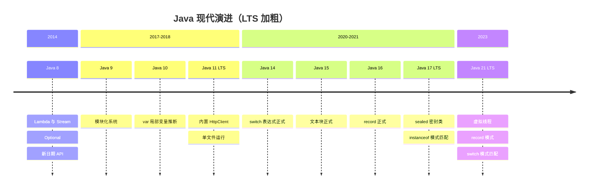

# 11 Java新特性

很多开发者的 Java 认知停留在 JDK 8——那之后这门语言以半年一版的速度狂奔：var、record、switch 表达式、密封类、模式匹配一路落地，JDK 21 的虚拟线程更是重新定义了 Java 并发。本章按版本时间线盘点必知特性，重点讲透 Java 17 的 sealed 与 Java 21 的虚拟线程，最后给 LTS 升级路线建议。

> 前置知识：[[java/2深入/05_并发包与线程池|并发包与线程池]]、[[java/2深入/08_Stream与函数式|Stream 与函数式]]。

---

## 一、版本时间线



| 版本 | 类型 | 关键词 |
|------|------|--------|
| 8 | LTS | 函数式革命，存量最大 |
| 11 | LTS | 模块化后首个 LTS，HttpClient |
| **17** | LTS | 当前企业主流，语法现代化的集大成 |
| **21** | LTS | 虚拟线程转正，并发范式变革 |

---

## 二、Java 8 快速回顾

Lambda/Stream/Optional 已在 [[java/2深入/08_Stream与函数式|Stream 与函数式]] 详述，这里补一个常被忽略的宝贝——新日期时间 API：

```java
import java.time.DayOfWeek;
import java.time.Duration;
import java.time.LocalDate;
import java.time.LocalDateTime;
import java.time.LocalTime;
import java.time.ZonedDateTime;
import java.time.format.DateTimeFormatter;

public class NewDateApi {
    public static void main(String[] args) {
        // 全部不可变、线程安全 —— 彻底取代 SimpleDateFormat 的线程安全隐患
        LocalDate today = LocalDate.now();
        LocalDate birthday = LocalDate.of(2000, 2, 29);

        System.out.println(today.plusDays(30));            // 不可变，返回新对象
        System.out.println(birthday.isLeapYear());         // true
        System.out.println(today.getDayOfWeek());          // SATURDAY 等

        LocalDateTime meeting = LocalDateTime.of(2026, 9, 1, 14, 0);
        Duration gap = Duration.between(
            meeting, meeting.plusHours(3).withMinute(30));
        System.out.println(gap.toMinutes());               // 210

        ZonedDateTime shanghai = ZonedDateTime.now(java.time.ZoneId.of("Asia/Shanghai"));
        System.out.println(shanghai.withZoneSameInstant(
            java.time.ZoneId.of("America/New_York")));     // 时区换算一行搞定

        DateTimeFormatter fmt = DateTimeFormatter.ISO_LOCAL_DATE;
        System.out.println(today.format(fmt));
    }
}
```

旧 `Date`/`Calendar` 的可变性、月份从 0 起、时区混乱三大罪状，`java.time` 全部治愈。

---

## 三、Java 9-16 精选

### 3.1 模块化系统（module-info）

```java
// module-info.java —— 位于源码根目录
module com.rootstack.core {
    requires java.net.http;          // 显式声明依赖的模块
    exports com.rootstack.api;       // 只暴露 api 包，其余包对外不可见
    opens com.rootstack.model;       // 允许反射访问（JSON 序列化场景）
}
```

价值在于强封装与依赖显式化；对业务开发的直接影响有限，但 JDK 自身因此瘦身，jlink 才能裁剪出迷你运行时。

### 3.2 var：局部变量类型推断（Java 10）

```java
public class VarDemo {
    public static void main(String[] args) {
        var list = new java.util.ArrayList<String>();   // 明显冗长的右侧类型可省
        var map = new java.util.HashMap<String, java.util.List<Integer>>();

        for (var entry : map.entrySet()) { }           // 迭代器变量最实用

        // var name;                  // 错误：必须初始化
        // var x = null;              // 错误：无法推断
        // 仅限局部变量，字段/方法参数/返回值不能用
    }
}
```

原则：**当右侧类型已显而易见时用 var**，反之写全类型帮助读者。

### 3.3 文本块（Java 15）与 switch 表达式（Java 14）

```java
public class TextAndSwitch {
    public static void main(String[] args) {
        // 文本块：多行字符串不再需要 \n 和加号拼接
        String json = """
                {
                    "name": "张三",
                    "age": 25
                }
                """;
        System.out.println(json.stripIndent());

        // switch 表达式：有返回值、箭头语法、不穿透、必须穷尽
        int day = 6;
        String type = switch (day) {
            case 1, 2, 3, 4, 5 -> "工作日";      // 多标签合并
            case 6, 7 -> "周末";
            default -> throw new IllegalArgumentException("非法: " + day);
        };
        System.out.println(type);

        // yield 在块内返回值
        int score = 85;
        String level = switch (score / 10) {
            case 10, 9 -> { yield "优秀"; }
            case 8 -> { yield "良好"; }
            default -> { yield "继续努力"; }
        };
        System.out.println(level);
    }
}
```

### 3.4 record：一行定义数据载体（Java 16）

```java
public class RecordDemo {
    // 声明即拥有：构造器、getter(name())、equals、hashCode、toString
    // 且字段 final 不可变
    record Point(int x, int y) {
        // 可以加方法与紧凑构造器校验
        Point {
            if (x < 0 || y < 0) {                    // 紧凑构造器：赋值前校验
                throw new IllegalArgumentException("坐标非负");
            }
        }
        double distance() { return Math.sqrt(x * x + y * y); }
    }

    public static void main(String[] args) {
        var p = new Point(3, 4);
        System.out.println(p.x());                   // 注意是 x() 不是 getX()
        System.out.println(p.distance());
        System.out.println(new Point(3, 4).equals(p));   // true：按值相等

        // 适用边界：纯数据载体。有大量可变状态或继承需求请用普通类
    }
}
```

record 是 [[java/2深入/02_注解与反射|注解与反射]] 中 APT/Lombok 解决方案的语言级内置版。

---

## 四、Java 17：sealed 密封类

接口和继承从此可以"圈地"：

```java
public class SealedDemo {

    // permits 白名单：只有这三个类能实现 Shape
    public sealed interface Shape permits Circle, Rectangle, Triangle { }

    record Circle(double radius) implements Shape { }
    record Rectangle(double w, double h) implements Shape { }
    record Triangle(double base, double height) implements Shape { }

    static double area(Shape s) {
        // 配合 instanceof 模式匹配（Java 17 预览，21 无需转换即可直接用）
        if (s instanceof Circle c) {
            return Math.PI * c.radius() * c.radius();   // 判定+转型一步完成
        } else if (s instanceof Rectangle r) {
            return r.w() * r.h();
        } else if (s instanceof Triangle t) {
            return t.base() * t.height() / 2;
        }
        return 0;
    }

    public static void main(String[] args) {
        System.out.println(area(new Circle(1)));
        System.out.println(area(new Rectangle(2, 3)));
    }
}
```

sealed 的三重价值：

| 价值 | 说明 |
|------|------|
| 受控扩展点 | 库作者精确控制谁可实现抽象，API 演进不再失控 |
| 穷尽性检查 | 配合 switch 可让编译器证明所有分支覆盖，新增子类立刻编译报错 |
| 代数数据类型 | 与 record 组合表达 ADT，函数式建模能力大增 |

---

## 五、Java 21 重磅特性

### 5.1 虚拟线程 Virtual Threads

传统平台线程是内核线程的包装，创建成本高（默认 1MB 栈），千级就到瓶颈。虚拟线程由 JVM 调度、挂在少量载体线程上，**百万级并发触手可及**：

```java
import java.time.Duration;
import java.util.concurrent.Executors;

public class VirtualThreadDemo {
    public static void main(String[] args) throws Exception {
        // 传统方式：一万个请求 = 一万个平台线程？内存先爆
        // 虚拟线程：百万个也轻松
        try (var executor = Executors.newVirtualThreadPerTaskExecutor()) {
            long start = System.currentTimeMillis();

            for (int i = 0; i < 100_000; i++) {          // 十万个任务！
                final int id = i;
                executor.submit(() -> {
                    Thread.sleep(Duration.ofMillis(100)); // 模拟 IO 等待
                    if (id == 99_999) {
                        System.out.println("十万个任务全部完成于 "
                            + (System.currentTimeMillis() - start) + "ms");
                    }
                    return null;
                });
            }
        }   // try-with-resources 自动等待关闭
    }
}
```

核心心智模型对比：

| 维度 | 平台线程 | 虚拟线程 |
|------|----------|----------|
| 载体 | 1:1 映射内核线程 | M:N 挂在少量载体线程上 |
| 创建成本 | 约 MB 级栈内存 | KB 级，堆上对象 |
| 数量上限 | 千级 | 百万级 |
| 阻塞代价 | 挂起整个内核线程 | JVM 层挂起并让出载体线程 |
| 适用 | CPU 密集 | IO 密集、每请求一线程 |

跨语言对照：

| 特性 | Go goroutine | C 协程库（如 libco） | Java 虚拟线程 |
|------|--------------|---------------------|---------------|
| 调度者 | Go runtime | 用户态库 | JVM |
| 栈增长 | 动态分段栈 | 固定/共享栈 | 弹性栈 |
| 与现有生态兼容 | 语言原生 | 需要改写为协程风格 | **现有阻塞代码零改动自动受益** |

Java 虚拟线程最大的杀伤力是兼容性：不需要 async/await 关键字、不需要响应式编程框架，把 `Thread.ofVirtual().start()` 或上面的 Executor 换进去，同步风格的 JDBC 调用就能享受异步级别的并发。

注意事项：不要池化虚拟线程（用完即弃）；synchronized 内长时间阻塞会钉住载体线程（pinning），热点路径建议换 ReentrantLock（后续版本持续优化中）；CPU 密集任务它无优势。

### 5.2 record 模式与 switch 模式匹配

```java
public class PatternMatching {
    sealed interface JsonValue permits JStr, JNum, JArr { }
    record JStr(String v) implements JsonValue { }
    record JNum(double v) implements JsonValue { }
    record JArr(java.util.List<JsonValue> items) implements JsonValue { }

    static String render(JsonValue jv) {
        // switch 直接解构 record，编译器保证穷尽
        return switch (jv) {
            case JStr(String s) -> "\"" + s + "\"";         // 解构取出内部字段
            case JNum(double d) when d == Math.floor(d)     // when 守卫条件
                                 -> String.valueOf((long) d);
            case JNum(double d) -> String.valueOf(d);
            case JArr(var items) -> items.stream()
                                         .map(PatternMatching::render)
                                         .toList().toString();
        };   // 无 default：漏掉任何子类编译不过
    }

    public static void main(String[] args) {
        System.out.println(render(new JArr(java.util.List.of(
            new JStr("hello"), new JNum(42)))));
    }
}
```

sealed + record + switch 模式三者组合，Java 第一次拥有了接近函数式语言的代数数据类型表达能力。

---

## 六、GraalVM Native Image：提前编译

JIT 是运行时编译，AOT（Ahead-of-Time）则在构建期直接生成原生机器码：

```text
# 安装 native-image 组件后
$ native-image -jar app.jar          # 生成独立可执行文件 app（不依赖 JVM）
$ ./app                              # 毫秒级启动，内存占用常为 JVM 的几分之一
```

| 维度 | 传统 JVM | Native Image |
|------|----------|--------------|
| 启动时间 | 秒级（类加载+JIT 预热） | 毫秒级 |
| 内存占用 | 高（元空间+JIT 代码缓存） | 低数倍 |
| 峰值性能 | 更高（JIT 可激进优化） | 略低 |
| 反射/动态代理 | 天然支持 | 需配置文件显式声明可达性 |
| 构建耗时 | 快 | 分钟级，吃 CPU 内存 |

适用判断：Serverless 冷启动、CLI 工具、微服务弹性扩缩容场景选 AOT；长跑型高吞吐服务仍以 JVM 为佳。Spring Boot 3 官方支持 AOT 打包，云原生的 Java 故事由此展开。

---

## 七、未来预告：Valhalla 与 Panama

- **Project Valhalla**（值类型）：让 `List<int>` 合法、消除装箱与对象头税，[[java/2深入/01_泛型深入|泛型深入]] 提到的具化泛型正是它的目标之一。落地后数值计算密集代码有望逼近 C 性能
- **Project Panama**（外部函数与内存 API）：取代 JNI 的现代 FFI，直接调用 C 库并安全管理堆外内存——C 背景读者最值得期待的特性

两者仍在孵化/预览阶段，方向明确但 API 未冻结，保持关注即可。

---

## 八、LTS 升级建议路线

| 出发点 | 推荐路线 | 关键收益 |
|--------|----------|----------|
| JDK 8 存量老系统 | 先升 17（重点验证反射与内部 API） | ZGC/G1 成熟、语法现代化、性能免费提升 |
| JDK 11 项目 | 直升 21 | 虚拟线程、模式匹配全套 |
| 新项目 | 直接 21 | 全量现代特性 |
| 云原生/Serverless | 21 + GraalVM AOT | 冷启动毫秒级 |

升级实操要点：

1. 优先解决依赖兼容（老版本 Spring/Hibernate 对新 JDK 支持滞后）
2. `--add-opens` 处理框架对 JDK 内部 API 的反射访问
3. 移除的模块（如 JAXB、Nashorn）需自行补依赖
4. 用 jdeprscan/jdeps 扫描废弃与内部 API 使用点

---

## 九、小结

| 版本 | 必须掌握 |
|------|----------|
| 8 | Lambda/Stream/Optional/java.time |
| 9-16 | var、文本块、switch 表达式、record |
| 17 | sealed permits、instanceof 模式匹配 |
| 21 | 虚拟线程、switch 模式匹配、record 解构 |

一句话总结这十年的演进方向：**让声明式更彻底（Stream->模式匹配），让并发更便宜（线程池->虚拟线程），让部署更轻（JIT->AOT）**。

---

## LeetCode 巩固

链表操作最能体现"引用重新接线"的手感，也正好用上本章的 var 与增强 switch：

| 题目 | 链接 | 练习点 |
|------|------|--------|
| [反转链表](https://leetcode.cn/problems/reverse-linked-list/) | reverse-linked-list | 迭代三指针与递归两种解法，练引用重接的肌肉记忆 |
| [两两交换链表节点](https://leetcode.cn/problems/swap-nodes-in-pairs/) | swap-nodes-in-pairs | 在反转基础上加分组节奏，练习 prev/next 引用的精确管理 |

下一章是全教程的收官章——Java 刷题方法论与 LeetCode 导航。
