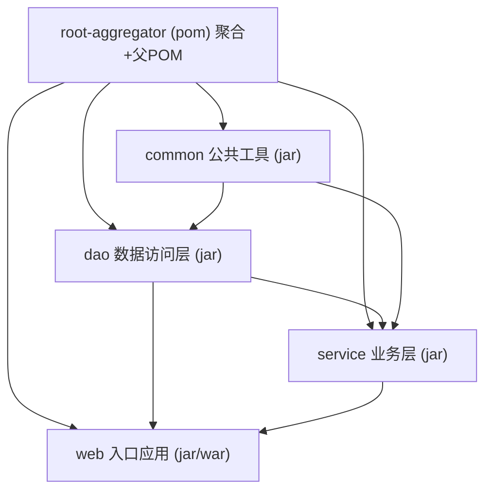
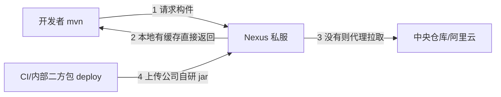

# 01 Maven构建

> 前置知识：[[java/1入门/04_编辑器与IDE选择|IDE选择]]、[[java/2深入/02_注解与反射|注解与反射]]。本章是工程实战篇，重点不在语法背诵，而在真实项目里怎么用、命令怎么敲、坑在哪里。

---

## 一、Maven 是什么与为什么：从 jar 包地狱说起

### 1.1 手工管理依赖的真实痛苦

想象你接手一个没有构建工具的老项目，lib 目录下是这样的：

```text
lib/
├── spring-core-4.3.2.jar
├── spring-beans-4.3.2.jar
├── spring-context-4.3.0.jar     版本不一致，谁改的？没人知道
├── commons-logging-1.1.1.jar
├── jackson-databind-2.9.0.jar   和 spring-web 需要的版本冲突了
└── ...共 87 个 jar 包
```

你会立刻遇到四大灾难：

| 灾难 | 表现 |
|------|------|
| 找不到包 | 编译报错 ClassNotFoundException，全靠人肉搜 jar |
| 版本冲突 | 同一个类在两个 jar 里各有一份，运行时行为诡异 |
| 传递依赖 | A 依赖 B、B 又依赖 C，手工根本理不清这棵树 |
| 无法复现 | 新同事 clone 代码后要花两天凑齐 lib 目录 |

### 1.2 Maven 的解法

Maven 是 Java 世界事实标准的声明式构建工具加依赖管理器。核心思想只有两条：

1. **约定优于配置**：源码放 `src/main/java`、测试放 `src/test/java`、资源放 `src/main/resources`，全世界都一样，工具才知道去哪找；
2. **坐标定位一切**：每个构件用 `groupId:artifactId:version` 三元组唯一定位，Maven 自动从中央仓库下载并解决传递依赖。

```xml
<!-- 一行声明 = 自动拉取该 jar 及其所有传递依赖 -->
<dependency>
    <groupId>com.google.code.gson</groupId>
    <artifactId>gson</artifactId>
    <version>2.10.1</version>
</dependency>
```

写过 CMake 的同学可以先记住一句话：Maven 是声明式的（描述项目"是什么"），CMake 是脚本式的（描述"怎么做"）。

---

## 二、安装配置

### 2.1 安装与 MAVEN_HOME

```bash
# Linux 手动安装（推荐，便于控制版本）
wget https://dlcdn.apache.org/maven/maven-3/3.9.9/binaries/apache-maven-3.9.9-bin.tar.gz
tar -xzf apache-maven-3.9.9-bin.tar.gz -C /opt/

# 配置环境变量（写入 ~/.bashrc 或 ~/.zshrc）
export MAVEN_HOME=/opt/apache-maven-3.9.9
export PATH=$MAVEN_HOME/bin:$PATH

# 验证
mvn -v
```

MAVEN_HOME 的意义：IDEA 等工具会读取它来定位 Maven 安装位置；同时 Maven 自身用 `$MAVEN_HOME/conf/settings.xml` 作为全局配置文件。

### 2.2 settings.xml 必配：阿里云镜像

国内直连 Maven 中央仓库速度感人，**装完第一件事就是配镜像**。编辑用户级配置文件 `~/.m2/settings.xml`（不存在则从全局配置复制一份）：

```xml
<?xml version="1.0" encoding="UTF-8"?>
<settings xmlns="http://maven.apache.org/SETTINGS/1.2.0">
  <!-- 本地仓库位置，默认 ~/.m2/repository -->
  <localRepository>/data/m2-repo</localRepository>

  <mirrors>
    <!-- 阿里云公共仓库镜像：拦截 central 的请求 -->
    <mirror>
      <id>aliyun-central</id>
      <mirrorOf>central</mirrorOf>
      <name>Aliyun Central Mirror</name>
      <url>https://maven.aliyun.com/repository/public</url>
    </mirror>
  </mirrors>
</settings>
```

JDK 编译版本建议直接在项目 POM 的 properties 里指定（见下节），settings.xml 保持精简。

踩坑记录：

- mirrorOf 写成星号会拦截一切仓库请求（包括公司私服），容易出事，一般只写 central；
- 用户级 `~/.m2/settings.xml` 优先级高于全局配置，团队协作推荐每人配用户级；
- IDEA 有自己的 Maven 设置面板，记得把 settings file 路径指到你改过的那份，否则 IDE 里下载依然龟速。

---

## 三、POM 结构逐行解析

POM（Project Object Model）是 Maven 的项目描述文件，一切配置围绕它展开：

```xml
<project xmlns="http://maven.apache.org/POM/4.0.0"
         xmlns:xsi="http://www.w3.org/2001/XMLSchema-instance"
         xsi:schemaLocation="http://maven.apache.org/POM/4.0.0
                             http://maven.apache.org/xsd/maven-4.0.0.xsd">

  <!-- POM 模型版本，固定写死 -->
  <modelVersion>4.0.0</modelVersion>

  <!-- ===== 坐标三件套：世界上的唯一身份证 ===== -->
  <groupId>com.rootstack</groupId>       <!-- 组织倒置域名，标识归属 -->
  <artifactId>order-service</artifactId> <!-- 项目名 -->
  <version>1.0.0-SNAPSHOT</version>      <!-- SNAPSHOT 快照版 / 正式发布版 -->

  <!-- 打包方式：jar(默认) / war / pom(仅做父模块或聚合器) -->
  <packaging>jar</packaging>

  <!-- 属性：统一管理版本号和编译参数 -->
  <properties>
    <java.version>17</java.version>
    <jackson.version>2.17.0</jackson.version>
    <project.build.sourceEncoding>UTF-8</project.build.sourceEncoding>
  </properties>

  <!-- 直接依赖列表 -->
  <dependencies>
    <dependency>
      <groupId>com.fasterxml.jackson.core</groupId>
      <artifactId>jackson-databind</artifactId>
      <version>${jackson.version}</version>
      <scope>compile</scope>
    </dependency>
  </dependencies>
</project>
```

坐标完整形式是五元组 `{groupId, artifactId, version, packaging, classifier}`，日常打交道最多的是前三者即 GAV 坐标。中央仓库中任何 jar 都能通过 GAV 转成 URL 路径唯一获取。

---

## 四、依赖管理：scope 六种

scope 决定依赖出现在哪个阶段（编译/测试/运行）、是否进入最终产物、是否传递给下游。

| scope | 编译期 | 测试期 | 运行期 | 打进产物 | 传递下游 | 典型例子 |
|-------|:---:|:---:|:---:|:---:|:---:|----------|
| compile（默认） | 是 | 是 | 是 | 是 | 是 | 大部分业务库 |
| provided | 是 | 是 | 否 | 否 | 否 | Lombok、Servlet-API |
| runtime | 否 | 是 | 是 | 是 | 是 | MySQL 驱动 |
| test | 否 | 是 | 否 | 否 | 否 | JUnit、Mockito |
| system | 是 | 是 | 否 | 否 | 否 | 本地 jar（已淘汰，别用） |
| import | - | - | - | - | - | 仅用于 BOM 导入 |

实战记忆：

- **provided**：编译期要它的 API，运行期容器会提供（Tomcat 自带 Servlet-API），所以不打进 war；
- **runtime**：代码只面向 `java.sql.Connection` 等接口编程，驱动类只在运行期通过 SPI 加载，所以编译期不需要；
- **import**：不引入任何 jar，只把目标 BOM 的版本清单"抄"进当前项目的 dependencyManagement，见下文。

---

## 五、传递依赖与冲突仲裁

### 5.1 依赖树

你声明 A，A 又依赖 B 和 C——这就是传递依赖。Maven 会解析出完整依赖树：

```bash
# 最常用的排查命令，没有之一
mvn dependency:tree -Dincludes=com.google.gson
```

输出示例：

```text
com.rootstack:order-service:jar:1.0.0
+- org.springframework:spring-web:jar:5.3.30:compile
|  \- com.fasterxml.jackson.core:jackson-databind:jar:2.15.2:compile
+- com.rootstack:user-api:jar:1.0.0:compile
|  \- com.google.code.gson:gson:jar:2.8.9:compile      <- 路径一：长度 2
\- com.google.code.gson:gson:jar:2.10.1:compile        <- 路径二：长度 1
```

### 5.2 冲突仲裁两条规则

同一个构件出现多个版本时，Maven 按以下规则选择：

1. **最短路径优先**：上例中路径二长度为 1，短于路径一的 2，最终采用 gson 2.10.1；
2. **声明优先**：路径长度相同时，POM 中先声明的依赖获胜（注意是依赖声明顺序，不是写代码顺序）。

### 5.3 排查与干预手段

```xml
<!-- 方式一：exclusions 排除传递依赖（解决类冲突的常规武器） -->
<dependency>
    <groupId>com.rootstack</groupId>
    <artifactId>user-api</artifactId>
    <version>1.0.0</version>
    <exclusions>
        <exclusion>
            <groupId>com.google.code.gson</groupId>
            <artifactId>gson</artifactId>
        </exclusion>
    </exclusions>
</dependency>

<!-- 方式二：直接显式声明想要的版本（路径最短=0，必胜） -->
<dependency>
    <groupId>com.google.code.gson</groupId>
    <artifactId>gson</artifactId>
    <version>2.10.1</version>
</dependency>
```

踩坑记录：`NoSuchMethodError` / `NoClassDefFoundError` 十有八九是依赖冲突。先跑 `mvn dependency:tree` 找到重复的包，再决定排除谁。IDEA 的 Maven Helper 插件能可视化冲突，强烈推荐。

---

## 六、BOM 依赖管理

BOM（Bill of Materials）本身是个特殊 POM，packaging 为 pom，里面只有 `<dependencyManagement>` 版本清单，不含真实依赖。用途：**统一一批构件的版本**。

```xml
<!-- 只管版本，不真正引入 -->
<dependencyManagement>
    <dependencies>
        <!-- Spring 官方 BOM：spring 相关几十个构件版本全部对齐 -->
        <dependency>
            <groupId>org.springframework</groupId>
            <artifactId>spring-framework-bom</artifactId>
            <version>6.1.14</version>
            <type>pom</type>
            <scope>import</scope>
        </dependency>
    </dependencies>
</dependencyManagement>

<dependencies>
    <!-- 这里不用写 version，自动取 BOM 里对齐的 6.1.14 -->
    <dependency>
        <groupId>org.springframework</groupId>
        <artifactId>spring-context</artifactId>
    </dependency>
</dependencies>
```

Spring Boot 的 `spring-boot-starter-parent` 本质就是一个超级 BOM，这就是为什么 Boot 项目里依赖几乎都不用写版本号。

---

## 七、生命周期与插件

### 7.1 三套生命周期

Maven 有三套相互独立的生命周期：

| 生命周期 | 常用 phase | 用途 |
|----------|-----------|------|
| clean | pre-clean → **clean** → post-clean | 删除 target 目录 |
| default（核心） | validate → compile → **test** → **package** → verify → **install** → deploy | 构建全流程 |
| site | pre-site → site → site-deploy | 生成项目站点（很少用） |

关键机制：**执行某个 phase 时，前面的 phase 会按序自动执行**。执行 `mvn package` 会依次跑 validate、compile、test 再打包；执行 `mvn install` 则连打包带安装到本地仓库。

```bash
mvn clean          # 只清空 target
mvn test           # 编译 + 运行测试
mvn clean package  # 清空后重新编译测试并打 jar
mvn clean install -DskipTests   # 打包并装入本地仓库，跳过测试
```

### 7.2 phase 与 goal：插件才是干活的

生命周期只是空壳，每个 phase 绑定到具体插件的某个 goal 才有实际动作：

- `compiler` 插件的 `compile` goal 绑定在 compile 阶段；
- `surefire` 插件的 `test` goal 绑定在 test 阶段；
- `jar` 插件的 `jar` goal 绑定在 package 阶段。

命令行也可以直接调用 goal：`mvn dependency:tree` 就是绕过生命周期直接调 dependency 插件的 tree goal。

### 7.3 常用插件清单

```xml
<build>
    <plugins>
        <!-- 1. 编译插件：指定 JDK 版本（几乎必配） -->
        <plugin>
            <groupId>org.apache.maven.plugins</groupId>
            <artifactId>maven-compiler-plugin</artifactId>
            <version>3.13.0</version>
            <configuration>
                <source>17</source>
                <target>17</target>
                <encoding>UTF-8</encoding>
            </configuration>
        </plugin>

        <!-- 2. 测试插件：默认自动发现 *Test 等测试类，一般无需额外配置 -->
        <plugin>
            <groupId>org.apache.maven.plugins</groupId>
            <artifactId>maven-surefire-plugin</artifactId>
            <version>3.2.5</version>
        </plugin>

        <!-- 3. shade 插件：打 fat jar（把所有依赖合并进一个可执行 jar） -->
        <plugin>
            <groupId>org.apache.maven.plugins</groupId>
            <artifactId>maven-shade-plugin</artifactId>
            <version>3.6.0</version>
            <executions>
                <execution>
                    <phase>package</phase>
                    <goals><goal>shade</goal></goals>
                    <configuration>
                        <transformers>
                            <!-- 指定 mainClass，java -jar 才知道入口 -->
                            <transformer implementation="org.apache.maven.plugins.shade.resource.ManifestResourceTransformer">
                                <mainClass>com.rootstack.Main</mainClass>
                            </transformer>
                        </transformers>
                        <!-- 另需配置 filters 排除 META-INF/*.SF 等签名文件，
                             否则合并被签名的依赖 jar 后运行报 SecurityException -->
                    </configuration>
                </execution>
            </executions>
        </plugin>

        <!-- 4. Spring Boot 插件：repackage 出可执行 fat jar（Boot 项目用它替代 shade） -->
        <plugin>
            <groupId>org.springframework.boot</groupId>
            <artifactId>spring-boot-maven-plugin</artifactId>
            <version>3.3.4</version>
            <executions>
                <execution>
                    <goals><goal>repackage</goal></goals>
                </execution>
            </executions>
        </plugin>
    </plugins>
</build>
```

踩坑记录：普通 jar 插件打出的包没有主清单属性（MANIFEST 里没有 Main-Class），`java -jar` 直接报错。要么配 shade/spring-boot 插件打 fat jar，要么用 assembly 插件连依赖目录一起输出。

---

## 八、多模块项目：聚合与继承

真实项目从来不是单模块。典型分层架构拆分如下：



两个概念：

- **聚合**：父模块 `<modules>` 列出子模块，一条 `mvn package` 命令按依赖顺序构建全部；
- **继承**：子模块 `<parent>` 指向父 POM，继承其 properties、dependencies、plugins，实现版本与配置统一。

根 pom.xml：

```xml
<project xmlns="http://maven.apache.org/POM/4.0.0">
    <modelVersion>4.0.0</modelVersion>
    <groupId>com.rootstack</groupId>
    <artifactId>shop-parent</artifactId>
    <version>1.0.0-SNAPSHOT</version>
    <packaging>pom</packaging>   <!-- 聚合器必须是 pom -->

    <modules>
        <module>common</module>
        <module>dao</module>
        <module>service</module>
        <module>web</module>
    </modules>

    <!-- dependencyManagement 只声明版本，子模块按需引用 -->
    <dependencyManagement>
        <dependencies>
            <dependency>
                <groupId>com.google.code.gson</groupId>
                <artifactId>gson</artifactId>
                <version>2.10.1</version>
            </dependency>
            <dependency>
                <groupId>junit</groupId>
                <artifactId>junit</artifactId>
                <version>4.13.2</version>
                <scope>test</scope>
            </dependency>
        </dependencies>
    </dependencyManagement>
</project>
```

子模块 service/pom.xml：

```xml
<project xmlns="http://maven.apache.org/POM/4.0.0">
    <modelVersion>4.0.0</modelVersion>
    <parent>
        <groupId>com.rootstack</groupId>
        <artifactId>shop-parent</artifactId>
        <version>1.0.0-SNAPSHOT</version>
    </parent>
    <artifactId>service</artifactId>

    <dependencies>
        <!-- 内部模块依赖：版本由 parent 坐标推出 -->
        <dependency>
            <groupId>com.rootstack</groupId>
            <artifactId>dao</artifactId>
            <version>${project.version}</version>
        </dependency>
        <!-- 版本号从 dependencyManagement 继承 -->
        <dependency>
            <groupId>com.google.code.gson</groupId>
            <artifactId>gson</artifactId>
        </dependency>
    </dependencies>
</project>
```

---

## 九、Profile 多环境

开发、测试、生产需要不同配置（数据库地址、日志级别等）。Profile 允许一套代码多套参数：

```xml
<profiles>
    <profile>
        <id>dev</id>
        <activation><activeByDefault>true</activeByDefault></activation>
        <properties><env>dev</env></properties>
    </profile>
    <profile>
        <id>prod</id>
        <properties><env>prod</env></properties>
    </profile>
</profiles>

<build>
    <!-- 开启资源过滤：src/main/resources 里写 ${env} 占位符，打包时替换 -->
    <resources>
        <resource>
            <directory>src/main/resources</directory>
            <filtering>true</filtering>
        </resource>
    </resources>
</build>
```

```bash
mvn clean package -Pprod   # 用生产 profile 打包
mvn clean package          # 默认 dev
mvn help:active-profiles   # 查看当前激活的 profile
```

---

## 十、与 CMake 对比

| 维度 | Maven（Java） | CMake（C++） |
|------|---------------|--------------|
| 描述方式 | 声明式 XML：描述"项目是什么" | 脚本式 DSL：描述"怎么生成构建文件" |
| 依赖管理 | 内建，中央仓库自动下载传递依赖 | 无内建，需 vcpkg/conan 等辅助 |
| 构建产物 | 统一 jar/war，约定目录 | 平台各异：Makefile/Ninja/MSVC 工程 |
| 二进制兼容 | 字节码跨平台，一次编译处处运行 | 必须按平台分别编译 |
| 学习曲线 | 规则固定、可预测，但 XML 冗长 | 灵活强大，但语法晦涩易写出玄学配置 |
| 多模块 | parent/modules 一等公民 | add_subdirectory 组织 |
| 增量构建 | 较弱，常 clean 全量重编 | 天然支持增量编译 |

一句话总结：Maven 用"牺牲灵活性"换来"任何机器上行为一致"，这正是企业级 Java 工程最需要的品质。

---

## 十一、Nexus 私服概念

团队开发不能人人直连中央仓库。私服是部署在公司内网的仓库代理服务器（常用 Sonatype Nexus / JFrog Artifactory）：



价值：

- **加速**：公共构件只从外网拉一次，全员共享缓存；
- **托管二方包**：公司内部 SDK 发布到私服供各团队引用；
- **管控**：安全扫描、版本准入、断网环境也能构建。

settings.xml 中通过 `<repositories>` 与 `<distributionManagement>` 对接私服，`mvn deploy` 即发布到私服。

---

## 十二、实战：从零建一个多模块项目并打包

目标结构：

```text
shop/
├── pom.xml                  聚合器+父POM
├── common/                  公共工具模块
│   └── src/main/java/com/rootstack/common/JsonUtil.java
└── app/                     入口应用模块（依赖 common）
    └── src/main/java/com/rootstack/app/Main.java
```

第一步，创建根 POM 与子模块目录骨架：

```bash
mkdir shop && cd shop
mkdir -p common/src/main/java/com/rootstack/common
mkdir -p app/src/main/java/com/rootstack/app
```

第二步，编写公共工具类：

```java
package com.rootstack.common;

import com.google.gson.Gson;

/** JSON 工具类：封装 Gson，供其他模块复用 */
public class JsonUtil {
    private static final Gson GSON = new Gson();

    /** 对象序列化为 JSON 字符串 */
    public static String toJson(Object obj) {
        return GSON.toJson(obj);
    }

    /** JSON 字符串反序列化为指定类型对象 */
    public static <T> T fromJson(String json, Class<T> clazz) {
        return GSON.fromJson(json, clazz);
    }
}
```

第三步，入口应用调用公共模块：

```java
package com.rootstack.app;

import com.rootstack.common.JsonUtil;
import java.util.HashMap;
import java.util.Map;

public class Main {
    public static void main(String[] args) {
        Map<String, Object> order = new HashMap<>();
        order.put("orderId", "SO20260823001");
        order.put("amount", 199.00);
        System.out.println(JsonUtil.toJson(order)); // 跨模块调用 common
    }
}
```

第四步，根目录一条命令全量构建并验证 fat jar：

```bash
mvn clean package          # 聚合构建：先 common 后 app
java -jar app/target/app-1.0.0-SNAPSHOT.jar
# 输出: {"orderId":"SO20260823001","amount":199.0}
```

大型项目提速利器：`mvn -pl app -am clean package` 只构建 app 及其依赖的模块。

---

## 小结

- Maven 用坐标 + 中央仓库终结了 jar 包地狱；装完必配阿里云镜像；
- scope 六种决定依赖的生命周期可见性；冲突仲裁遵循最短路径优先和声明优先；
- 生命周期是壳、插件是魂；fat jar 靠 shade 或 spring-boot-maven-plugin；
- 多模块 = 聚合（一起构建）+ 继承（统一配置）；Profile 解决多环境差异；
- 企业级进阶方向：Nexus 私服 + CI 流水线。

下一章我们看后起之秀 Gradle：[[java/3工程化/02_Gradle构建|Gradle构建]]。
