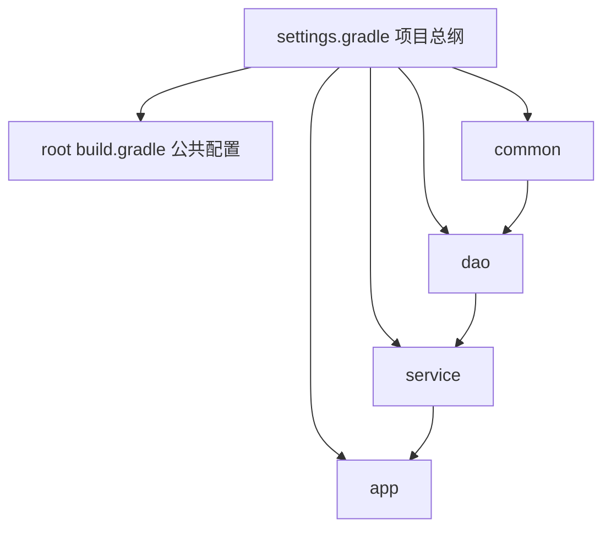

# 02 Gradle构建

> 前置知识：[[java/3工程化/01_Maven构建|Maven构建]]。本章大量概念与 Maven 对照讲解——先有 Maven 的坐标与生命周期心智模型，再学 Gradle 会非常顺。

---

## 一、Gradle vs Maven：为什么会出现第二把锤子

Maven 稳定可靠，但有两大历史包袱：

1. **XML 表达力差**：稍微复杂的构建逻辑就要写自定义插件（Java + Mojo 注解），门槛极高；
2. **性能天花板**：每次全量扫描 POM、无原生增量编译，大项目（几百模块）一次 clean build 动辄十几分钟。

Gradle 用 **Groovy/Kotlin DSL 脚本 + 任务图（Task Graph）+ 守护进程常驻内存** 回答了这两个问题。

| 维度 | Maven | Gradle |
|------|-------|--------|
| 构建脚本 | XML（声明式，表达力弱） | Groovy/Kotlin DSL（可编程） |
| 性能 | 全量为主，增量支持弱 | 增量编译 + Build Cache + 守护进程，官方数据快数倍 |
| 依赖管理 | 成熟稳定，仲裁规则固定 | 兼容 Maven/Ivy 仓库，规则可编程干预 |
| 灵活性 | 低（约定死板，改起来要写插件） | 高（task 随手写，任意生命周期钩子） |
| 可维护性 | XML 冗长但所有项目长一个样 | 灵活但也容易写成一团浆糊，需团队自律 |
| Android 官方支持 | 无 | 唯一指定构建工具 |
| Spring Boot 官方 | 支持完整 | 文档示例已转向 Gradle 优先 |
| DSL 趋势 | - | Kotlin DSL 渐成主流（IDE 补全/编译检查） |

选型结论（业界现状）：**企业存量项目以 Maven 为绝对主流；新项目、Android、追求构建速度的团队可选 Gradle**。两者都吃透，跳槽面试都不慌。

---

## 二、安装与 Wrapper

### 2.1 安装

```bash
# sdkman 安装（推荐，多版本管理方便）
curl -s https://get.sdkman.io | bash
sdk install gradle 8.10.2
gradle --version
```

### 2.2 Wrapper：锁定版本的正确姿势（必会）

直接用全局 `gradle` 命令的问题：每人机器版本不同，构建结果不可复现。正确做法是项目里带 Wrapper：

```bash
# 项目根目录执行一次，生成 gradle/wrapper 等文件并提交到 git
gradle wrapper --gradle-version 8.10.2

# 之后所有人（含 CI）一律用 ./gradlew
./gradlew build        # Linux/Mac
gradlew.bat build      # Windows
```

Wrapper 原理：`gradlew` 脚本读取 `gradle/wrapper/gradle-wrapper.properties` 里声明的版本号，本地没有就自动下载对应发行版再执行。首次下载慢的话可在 `gradle/wrapper/gradle-wrapper.properties` 把 distributionUrl 换成腾讯镜像：

```properties
distributionUrl=https\://mirrors.cloud.tencent.com/gradle/gradle-8.10.2-bin.zip
```

国内依赖仓库同样建议在 settings.gradle 中配阿里云镜像（见第七节）。

---

## 三、build.gradle 基本结构（Groovy DSL）

```groovy
// 插件块：引入能力。java 插件带来 compile/test/jar 等一整套 task
plugins {
    id 'java'
    id 'application'          // 提供 run/installDist 等 task，可执行应用必备
}

// 坐标三件套，与 Maven 的 GAV 完全同构
group = 'com.rootstack'
version = '1.0.0-SNAPSHOT'

// JDK 版本工具链：本机没有 17 时 Gradle 能自动下载匹配的 JDK
java {
    toolchain {
        languageVersion = JavaLanguageVersion.of(17)
    }
}

// 仓库：找依赖的顺序
repositories {
    mavenLocal()              // 1. 本地 ~/.m2/repository（调试时有用）
    mavenCentral()            // 2. 中央仓库
    maven { url 'https://maven.aliyun.com/repository/public' } // 国内镜像
}

dependencies {
    implementation 'com.google.code.gson:gson:2.10.1'
    testImplementation 'junit:junit:4.13.2'
    compileOnly 'org.projectlombok:lombok:1.18.34'
    annotationProcessor 'org.projectlombok:lombok:1.18.34'
}

application {
    mainClass = 'com.rootstack.app.Main'   // java -jar / ./gradlew run 的入口
}
```

对比 Maven 你会发现一一对应：`group/version/name` 对 GAV，`repositories` 对 `<repositories>`，`dependencies` 对 `<dependencies>`。区别在于配置是**代码**，可以写逻辑：

```groovy
// Maven 里要写插件才能做到的事，Gradle 两行搞定
def env = project.hasProperty('env') ? project.env : 'dev'
println "当前构建环境: $env"
```

---

## 四、dependencies 配置：api 与 implementation 的区别（重点）

Gradle 处理传递依赖的方式比 Maven 的 scope 更精细，核心是两个关键字：

| 关键字 | 类比 Maven | 传递性 | 使用场景 |
|--------|-----------|--------|----------|
| `implementation` | compile 但不暴露 | 不传给使用方 | 绝大多数依赖（默认用它） |
| `api` | compile 且暴露 | 传递给使用方 | 库项目中"类型出现在我的公开 API 里"的依赖 |
| `compileOnly` | provided | 否 | 只编译期需要（Lombok、Servlet-API） |
| `runtimeOnly` | runtime | 是 | 只运行期需要（MySQL 驱动） |
| `testImplementation` | test | 否 | 测试代码 |

`api` 需要 java-library 插件：

```groovy
plugins { id 'java-library' }

dependencies {
    // dao 模块的公开接口签名里出现了 gson 的 JsonElement 类型，
    // 上游必须也能看到 gson，所以这里必须用 api
    api 'com.google.code.gson:gson:2.10.1'

    // 内部实现细节，上游不关心，用 implementation 隔离：
    // 换版本、移除都不会导致上游重新编译
    implementation 'com.google.guava:guava:33.3.1-jre'
}
```

为什么重点强调？**implementation 隔离了传递依赖，依赖变更时只需重编译本模块**，这是 Gradle 增量构建快的基石之一。经验法则：库项目里能不用 api 就不用；应用项目里几乎全是 implementation。

---

## 五、Task 自定义

Gradle 构建的本质是**任务图**：`./gradlew build` 时先算出 build 依赖哪些 task、形成有向无环图，再执行。自定义 task 是日常操作：

```groovy
// 最简单的 task
tasks.register('hello') {
    doLast {
        println "Hello from custom task!"
    }
}

// 带输入输出的 task（声明后才能被增量构建和缓存识别）
tasks.register('genVersionFile') {
    // 输入：版本号属性；输出：生成文件。都没变则跳过执行
    def outFile = layout.buildDirectory.file("version.txt")
    inputs.property("version", project.version.toString())
    outputs.file(outFile)
    doLast {
        outFile.get().asFile.text = "version=${project.version}"
    }
}

// 让 build 之前先跑 genVersionFile
tasks.named('build') { dependsOn 'genVersionFile' }
```

```bash
./gradlew hello        # 执行自定义 task
./gradlew tasks --all  # 查看所有可用 task
```

增量构建标记：命令行输出里 `UP-TO-DATE` 表示跳过（无变化）、`FROM-CACHE` 表示命中本地缓存直接复制产物。

---

## 六、Kotlin DSL 与 Version Catalog

### 6.1 Kotlin DSL：build.gradle.kts

新项目官方推荐 Kotlin DSL，好处是 IDE 补全、编译期报错、可重构：

```kotlin
plugins {
    java
    application
}

group = "com.rootstack"
version = "1.0.0-SNAPSHOT"

java { toolchain { languageVersion = JavaLanguageVersion.of(17) } }

repositories { mavenCentral() }

dependencies {
    implementation("com.google.code.gson:gson:2.10.1")
    testImplementation("junit:junit:4.13.2")
}

application { mainClass = "com.rootstack.app.Main" }
```

Groovy 与 kts 的语法差异只有三点：字符串用双引号、依赖写法带括号引号、取值用等号赋值。会一个基本就会另一个，团队混用也没问题，但**同一个项目别混用**两种脚本。

### 6.2 版本目录 version catalog：libs.versions.toml

多模块项目里依赖版本散落各处是维护灾难。Gradle 官方范式是在 `gradle/libs.versions.toml` 集中定义：

```toml
[versions]
gson = "2.10.1"
junit = "4.13.2"

[libraries]
gson = { module = "com.google.code.gson:gson", version.ref = "gson" }
junit = { module = "junit:junit", version.ref = "junit" }

[plugins]
spring-boot = { id = "org.springframework.boot", version = "3.3.4" }
```

各模块的 build.gradle.kts 中通过 `libs` 访问器引用：

```kotlin
dependencies {
    implementation(libs.gson)      // 类型安全的访问器，IDE 可跳转补全
    testImplementation(libs.junit)
}
```

升级依赖只改 toml 一处，全项目生效——这就是"新范式"的价值，作用等同于 Maven 父 POM 的 dependencyManagement，但集中度更高、类型更安全。

---

## 七、settings.gradle 多项目

Maven 用 parent/modules 组织多模块；Gradle 对应的是 settings.gradle（或 settings.gradle.kts）：

```groovy
// settings.gradle —— 项目结构总纲
rootProject.name = 'shop'

include 'common'
include 'dao'
include 'service'
include 'app'

// 国内镜像统一配置在这里，所有子项目生效
dependencyResolutionManagement {
    repositories {
        maven { url 'https://maven.aliyun.com/repository/public' }
        mavenCentral()
    }
}
```

子模块 app/build.gradle 中声明模块间依赖：

```groovy
dependencies {
    implementation project(':common')   // 依赖兄弟模块，等价于 Maven 内部 GAV 引用
}
```

目录结构与第一章的多模块示例完全同构，迁移心智模型可以直接平移。



---

## 八、gradle.properties 与性能调优

`gradle.properties`（项目根或 ~/.gradle 全局）控制 JVM 与构建行为：

```properties
# JVM 参数：大项目必须给守护进程足够内存
org.gradle.jvmargs=-Xmx2g -XX:MaxMetaspaceSize=512m

# 并行构建多模块
org.gradle.parallel=true

# 开启构建缓存：task 输入没变就从缓存取输出
org.gradle.caching=true

# 按需配置：只配置参与构建的模块，巨型项目提速明显
org.gradle.configureondemand=true

# 国内镜像代理（走公司 nexus 时也在这里配）
systemProp.https.proxyHost=127.0.0.1
systemProp.https.proxyPort=7890
```

### 增量构建与 Build Cache 原理

理解这两件事就抓住了 Gradle 快的本质：

1. **增量构建（Incremental Build）**：每个 task 声明 inputs（输入文件/属性）和 outputs（输出文件）。执行前对比上次运行记录——输入输出指纹都没变就直接标 UP-TO-DATE 跳过。所以依赖声明要用 implementation 缩小受影响面；
2. **Build Cache**：比增量更激进。task 的输入指纹作为 key，输出存入本地缓存目录（可配远端共享给 CI）。切换分支、clean 之后也能 FROM-CACHE 秒出结果。

```bash
./gradlew build --scan                 # 生成构建分析报告网页，排查慢在哪
./gradlew build --build-cache          # 显式启用缓存
```

踩坑记录：task 里写了"隐藏输入"（比如读了环境变量、时间戳却没声明），会导致永远不 UP-TO-DATE；反过来把随机内容当 output 会污染缓存。自定义 task 必须老实声明输入输出。

---

## 九、Spring Boot 官方转向 Gradle

打开 Spring Boot 官方文档的 Gradle 安装章节会发现示例已 Gradle 优先。Boot 项目用官方插件：

```kotlin
// app/build.gradle.kts
plugins {
    java
    id("org.springframework.boot") version "3.3.4"
    id("io.spring.dependency-management") version "1.1.6"
}

dependencies {
    // BOM 版本由 boot 插件托管，无需写版本号（同 spring-boot-starter-parent 效果）
    implementation("org.springframework.boot:spring-boot-starter-web")
    testImplementation("org.springframework.boot:spring-boot-starter-test")

    // Boot 插件默认已支持 developmentOnly 配置，devtools 热重载专用
    developmentOnly("org.springframework.boot:spring-boot-devtools")
}

tasks.withType<Test> { useJUnitPlatform() }
```

```bash
./gradlew bootRun      # 直接跑起来（等价 mvn spring-boot:run）
./gradlew bootJar      # 打可执行 fat jar（等价 repackage）
java -jar build/libs/app-1.0.0-SNAPSHOT.jar
```

---

## 十、Maven 项目迁移要点

从 Maven 迁到 Gradle，Gradle 内置了自动转换：

```bash
# 在 Maven 项目根目录执行：自动读取 pom.xml 生成 build.gradle + settings.gradle
gradle init --dsl groovy
```

人工检查清单：

| Maven 概念 | Gradle 对应物 | 注意点 |
|-----------|---------------|--------|
| parent POM | convention plugin 或各模块重复声明 | 没有自动继承，公共逻辑建议抽成约定插件 |
| dependencyManagement | platform() / version catalog | `implementation(platform(libs.spring.bom))` |
| scope provided | compileOnly | 语义一致 |
| profile | `-P` 属性 + 条件逻辑 | 需要手写少量脚本 |
| resource filtering | processResources task 的 expand | 写法不同需改 |

迁移策略建议：先让 CI 双轨并行（Maven 和 Gradle 都能出包），比对产物一致后再切流量；不要一次性硬切。

---

## 十一、实战：同一多模块项目的 Gradle 实现

复刻第一章 shop 项目：common 工具模块 + app 入口模块。

第一步，初始化骨架：

```bash
mkdir -p shop-gradle && cd shop-gradle
mkdir -p common/src/main/java/com/rootstack/common
mkdir -p app/src/main/java/com/rootstack/app
gradle wrapper --gradle-version 8.10.2
```

第二步，settings.gradle：

```groovy
rootProject.name = 'shop-gradle'
include 'common', 'app'
```

第三步，common/build.gradle：

```groovy
plugins { id 'java-library' }   // library 插件提供 api 关键字

group = 'com.rootstack'
version = '1.0.0-SNAPSHOT'

dependencies {
    // gson 是 JsonUtil 公开签名的一部分吗？本例只是内部使用，
    // 所以 implementation 即可，上游 app 无感知
    api 'com.google.code.gson:gson:2.10.1'
}
```

第四步，app/build.gradle：

```groovy
plugins {
    id 'java'
    id 'application'
    id 'com.github.johnrengelman.shadow' version '8.1.1'   // fat jar 方案
}

group = 'com.rootstack'
version = '1.0.0-SNAPSHOT'

dependencies {
    implementation project(':common')
}

application { mainClass = 'com.rootstack.app.Main' }
```

第五步，Java 源码与第一章完全一致（JsonUtil.java / Main.java 原样拷贝）。

第六步，构建验证：

```bash
./gradlew build          # 编译+测试+打包
./gradlew shadowJar      # 生成 fat jar
java -jar app/build/libs/app-1.0.0-SNAPSHOT-all.jar
# 输出: {"orderId":"SO20260823001","amount":199.0}

# 再跑一次感受增量
./gradlew build
# 输出里大量 UP-TO-DATE，几乎瞬间完成
```

---

## 小结

- Gradle = 可编程 DSL + 任务图 + 增量/缓存三件套，快且灵活；
- 一律通过 wrapper 锁版本，保证团队与 CI 构建一致；
- api 与 implementation 是传递依赖的开关，implementation 是默认选择；
- 版本目录 libs.versions.toml 是多模块统一版本的新范式；
- 企业存量项目仍以 Maven 为主，新项目与 Android 生态选 Gradle 更顺。

下一章进入数据访问：[[java/3工程化/03_JDBC与数据库连接|JDBC与数据库连接]]。
