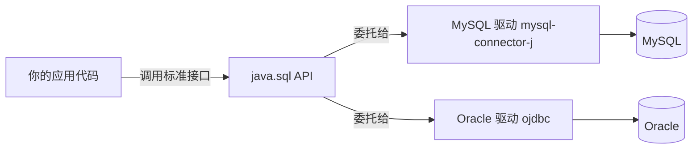
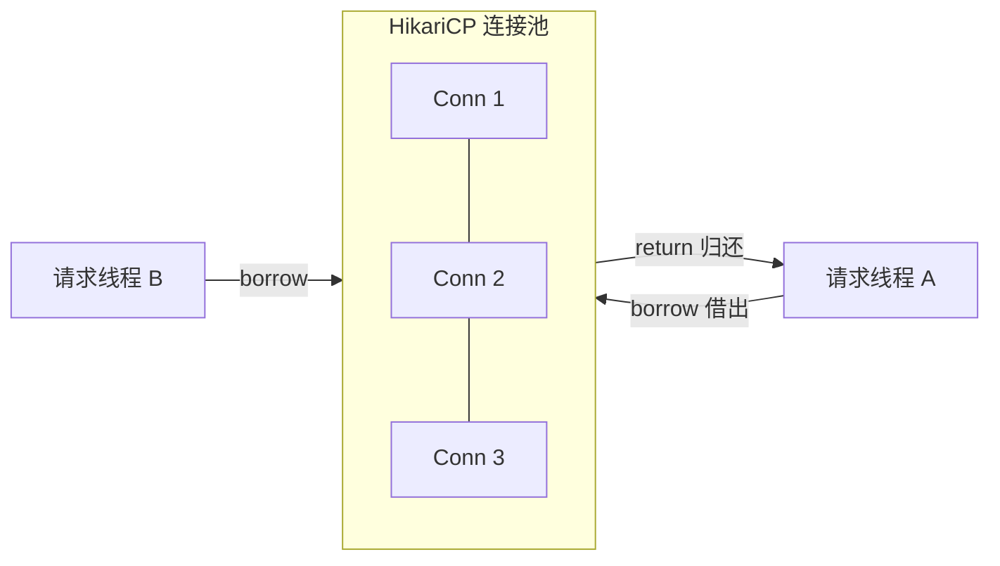
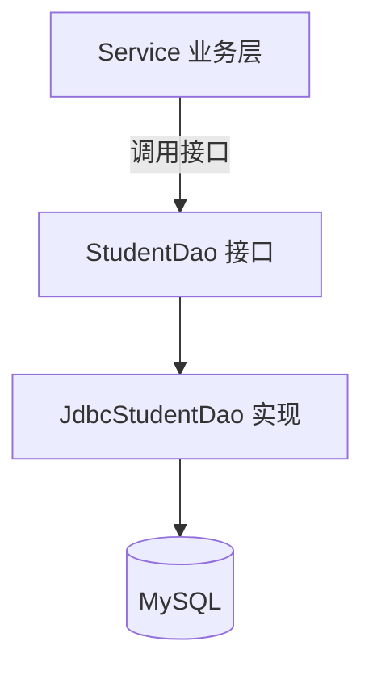

# 03 JDBC与数据库连接

> 前置知识：[[java/1入门/17_文件IO|文件IO]]、SQL 基础见 [[数据库/mysql/02-SQL基础语法|SQL基础语法]]。本章开始进入 Java 数据访问的根——后面要学的 MyBatis、JPA 全部构建在 JDBC 之上。

---

## 一、JDBC 是什么：Java 版的 libpq

写过 C 的同学知道：连 PostgreSQL 用 libpq，连 Redis 用 hiredis，每换一种存储就要学一套客户端 API。Java 的做法是把"访问关系型数据库"这件事抽象成一套**标准协议**——JDBC（Java Database Connectivity）：

- `java.sql.*` 和 `javax.sql.*` 定义接口（Connection、Statement、ResultSet...）；
- 各数据库厂商提供**驱动**实现这些接口（mysql-connector-j、ojdbc...）；
- 你的代码只面向接口编程，换数据库只需换驱动和 URL。



这套"接口 + 驱动"的设计正是 SPI 思想的经典应用（见下一节），也是理解 [[java/2深入/02_注解与反射|反射]] 与服务发现的好案例。

---

## 二、驱动加载演进：Class.forName 到 SPI 自动注册

### 2.1 老古董写法（JDBC 4.0 之前）

```java
// 2004 年前的教材都这么写：显式加载驱动类，触发其静态块向 DriverManager 注册
Class.forName("com.mysql.jdbc.Driver");
Connection conn = DriverManager.getConnection(url, user, password);
```

为什么需要这行？`DriverManager` 只认识"注册过的驱动"，而驱动的静态初始化块里有一句：

```java
// MySQL 驱动内部的简化逻辑
static {
    DriverManager.registerDriver(new Driver());
}
```

### 2.2 现代写法：SPI 自动发现

JDBC 4.0（Java 6）起，规范约定：驱动 jar 必须在 `META-INF/services/java.sql.Driver` 文件中声明自己的实现类名。`DriverManager` 初始化时会扫描 classpath 下所有 jar 的这个文件，自动实例化并注册。

所以现代项目里 **Class.forName 这行代码已经不需要了**，直接拿 URL 连接即可：

```java
// 引入依赖后直接用，SPI 已自动注册驱动
String url = "jdbc:mysql://localhost:3306/shop?useSSL=false&serverTimezone=Asia/Shanghai";
try (Connection conn = DriverManager.getConnection(url, "root", "123456")) {
    System.out.println(conn);
}
```

面试常问"Class.forName 干嘛的"，答出"历史产物 + SPI 机制取代"就是加分项。

---

## 三、核心三件套：Connection / Statement / ResultSet

完整 CRUD 示例，建表语句参考 [[数据库/mysql/02-SQL基础语法|SQL基础语法]]：

```sql
CREATE DATABASE IF NOT EXISTS shop DEFAULT CHARSET utf8mb4;
USE shop;
CREATE TABLE student (
    id      BIGINT PRIMARY KEY AUTO_INCREMENT,
    name    VARCHAR(50) NOT NULL,
    age     INT,
    score   DOUBLE
);
```

Maven 依赖：

```xml
<dependency>
    <groupId>com.mysql</groupId>
    <artifactId>mysql-connector-j</artifactId>
    <version>8.4.0</version>
    <scope>runtime</scope>   <!-- 编译期只碰 java.sql 接口，运行期才要驱动 -->
</dependency>
```

```java
import java.sql.*;

/**
 * JDBC 三件套完整演示：增删改查各来一遍
 */
public class JdbcCrudDemo {
    static final String URL = "jdbc:mysql://localhost:3306/shop?useSSL=false&serverTimezone=Asia/Shanghai";
    static final String USER = "root";
    static final String PASS = "123456";

    public static void main(String[] args) throws Exception {
        try (Connection conn = DriverManager.getConnection(URL, USER, PASS)) {
            insert(conn);          // 增
            long id = queryAll(conn);        // 查全部
            updateScore(conn, id, 95.5);     // 改
            delete(conn, id);                // 删
        }
    }

    /** 新增：executeUpdate 返回受影响行数 */
    static void insert(Connection conn) throws SQLException {
        try (Statement st = conn.createStatement()) {
            int rows = st.executeUpdate(
                "INSERT INTO student(name, age, score) VALUES ('张三', 20, 88.5)");
            System.out.println("插入 " + rows + " 行");
        }
    }

    /** 查询：executeQuery 返回 ResultSet 游标 */
    static long queryAll(Connection conn) throws SQLException {
        try (Statement st = conn.createStatement();
             ResultSet rs = st.executeQuery("SELECT id, name, age, score FROM student")) {
            while (rs.next()) {   // next() 把游标移到下一行，没有则返回 false
                long id = rs.getLong("id");
                String name = rs.getString("name");
                int age = rs.getInt("age");
                double score = rs.getDouble("score");
                System.out.printf("%d %s %d %.1f%n", id, name, age, score);
                if ("张三".equals(name)) return id;
            }
        }
        return -1;
    }

    /** 更新 */
    static void updateScore(Connection conn, long id, double score) throws SQLException {
        try (Statement st = conn.createStatement()) {
            // 注意！下面这行是反面教材，正确做法见第四节 PreparedStatement
            st.executeUpdate("UPDATE student SET score=" + score + " WHERE id=" + id);
        }
    }

    /** 删除 */
    static void delete(Connection conn, long id) throws SQLException {
        try (Statement st = conn.createStatement()) {
            st.executeUpdate("DELETE FROM student WHERE id=" + id);
        }
    }
}
```

要点：

- `getConnection` → 建 TCP 连接（昂贵）；`createStatement` → 在连接上创建执行器；`executeQuery`（查）/`executeUpdate`（增删改）；
- ResultSet 是游标模型，初始位置在第一行之前，必须先 `next()`；
- 三个对象都实现了 AutoCloseable，**务必放 try-with-resources**，顺序是后开的先关。

---

## 四、PreparedStatement：性能与安全的双重保险

### 4.1 SQL 注入：拼接字符串的下场

假设登录查询这样写（真实事故级代码）：

```java
// 用户名来自前端输入框
String username = request.getParameter("username");
String password = request.getParameter("password");

// 灾难现场：字符串直接拼进 SQL
String sql = "SELECT * FROM user WHERE name='" + username + "' AND pwd='" + password + "'";
```

攻击者在用户名框输入 `admin' --`，SQL 变成：

```sql
SELECT * FROM user WHERE name='admin' -- ' AND pwd='xxx'
-- 注释符 -- 把密码条件整个吞掉，免密登录 admin 账号
```

更狠的 `'; DROP TABLE user; --` 直接删库。这类漏洞的利用原理在 [[red_team/ctf_trea/Web/SQL/03-报错注入|报错注入]] 与 [[red_team/数据库安全/02-MySQL渗透|MySQL渗透]] 中有系统展开，防御的第一道墙就在这里。

### 4.2 正确姿势：预编译占位符

```java
/**
 * PreparedStatement 两个核心收益：
 * 1. 安全：参数走占位符?，值永远不会被解析成 SQL 结构，注入失效；
 * 2. 性能：预编译的 SQL 模板可被数据库缓存复用，批量场景大幅提速。
 */
public class PreparedStatementDemo {
    public static User login(Connection conn, String username, String password)
            throws SQLException {
        // 问号是占位符，参数值单独传入
        String sql = "SELECT id, name, age FROM user WHERE name=? AND pwd=?";
        try (PreparedStatement ps = conn.prepareStatement(sql)) {
            ps.setString(1, username);   // 参数下标从 1 开始
            ps.setString(2, password);
            try (ResultSet rs = ps.executeQuery()) {
                if (rs.next()) {
                    return new User(rs.getLong("id"), rs.getString("name"), rs.getInt("age"));
                }
            }
        }
        return null;
    }
}
```

即使输入 `admin' --`，它也只是作为一个普通字符串去匹配 name 字段，查不到就是查不到。**规则：凡是带用户输入的 SQL，一律 PreparedStatement，无例外。**

---

## 五、事务管理：转账案例

JDBC 默认自动提交（每条 SQL 立即生效）。多步操作必须绑成一个原子单元时，手动控制事务：

```java
import java.sql.*;

/**
 * 经典转账：A 扣钱、B 加钱，两步要么都成功要么都不发生
 */
public class TransferDemo {
    public static void transfer(Connection conn, long fromId, long toId, double amount) {
        try {
            conn.setAutoCommit(false);   // 1. 关闭自动提交，开启事务
            try (PreparedStatement deduct = conn.prepareStatement(
                     "UPDATE account SET balance=balance-? WHERE id=? AND balance>=?");
                 PreparedStatement add = conn.prepareStatement(
                     "UPDATE account SET balance=balance+? WHERE id=?")) {

                deduct.setDouble(1, amount);
                deduct.setLong(2, fromId);
                deduct.setDouble(3, amount);
                int rows = deduct.executeUpdate();
                if (rows == 0) {         // 余额不足或账户不存在
                    throw new SQLException("扣款失败：余额不足");
                }

                add.setDouble(1, amount);
                add.setLong(2, toId);
                add.executeUpdate();     // 假设这里抛异常...

                conn.commit();           // 2. 全部成功才提交
                System.out.println("转账成功");
            } catch (SQLException e) {
                conn.rollback();         // 3. 任一步失败整体回滚
                System.out.println("已回滚: " + e.getMessage());
            }
        } catch (SQLException e) {
            throw new RuntimeException(e);
        }
    }
}
```

没有事务时，第一步成功第二步失败，钱就凭空消失了。Spring 的 @Transactional 底层干的就是 setAutoCommit(false)/commit/rollback 这套事（见 [[java/3工程化/05_Spring IoC与AOP|Spring IoC与AOP]]）。

---

## 六、连接池为什么必须

### 6.1 裸连的成本

建立一次 MySQL 连接需要 TCP 三次握手 + TLS 协商 + 认证 + 会话初始化，实测几十毫秒起。每个请求都新建连接，高并发下：

```text
1000 QPS x 50ms 连接建立 = 光握手就吃掉大量 CPU 和端口
```

连接池的做法：启动时建好 N 个连接放在池子里，用完归还而不是销毁。



### 6.2 HikariCP：Spring Boot 默认池

| 参数 | 默认值 | 说明 |
|------|--------|------|
| maximumPoolSize | 10 | 最大连接数，不是越大越好 |
| minimumIdle | 同 max | 最小空闲连接 |
| connectionTimeout | 30s | 借不到连接等多久就报错 |
| idleTimeout | 10min | 空闲连接存活时间 |
| maxLifetime | 30min | 连接最长寿命（要小于 MySQL wait_timeout） |

经验公式：池大小 ≈ CPU 核数 x 2 + 磁盘数，通常 20 以内足够，盲目调大只会增加数据库上下文切换负担。

Druid 是国产另一主流选择，卖点在内置监控页面（/druid 可看慢 SQL、连接泄漏），阿里系项目常见。选型一句话：追求极致性能 HikariCP，看重监控运维 Druid。

### 6.3 DataSource 标准接口

javax.sql.DataSource 是获取连接的标准接口，池实现都实现了它。业务代码从"DriverManager.getConnection"换成"dataSource.getConnection"，其余不变——这也是框架注入数据源的统一入口：

```java
import com.zaxxer.hikari.HikariConfig;
import com.zaxxer.hikari.HikariDataSource;
import javax.sql.DataSource;

/** 手工构建一个 HikariCP 数据源 */
public static DataSource createDs() {
    HikariConfig cfg = new HikariConfig();
    cfg.setJdbcUrl("jdbc:mysql://localhost:3306/shop?useSSL=false&serverTimezone=Asia/Shanghai");
    cfg.setUsername("root");
    cfg.setPassword("123456");
    cfg.setMaximumPoolSize(10);
    cfg.setDriverClassName("com.mysql.cj.jdbc.Driver");   // 通常可省略
    return new HikariDataSource(cfg);
}
```

---

## 七、DAO 模式：分层的雏形

DAO（Data Access Object）把"怎么存"封装起来，业务层只管"存什么"。这是所有 ORM 框架使用方式的祖型：



```java
import java.sql.*;
import java.util.ArrayList;
import java.util.List;

/** 实体类：一行记录的内存映射 */
class Student {
    Long id; String name; Integer age;
    Student(Long id, String name, Integer age) { this.id = id; this.name = name; this.age = age; }
}

/** DAO 接口：面向业务的存储能力抽象 */
interface StudentDao {
    void insert(Student s);
    Student findById(long id);
    List<Student> findByNameLike(String keyword);
    int updateAge(long id, int age);
    int deleteById(long id);
}

/** JDBC 实现 */
class JdbcStudentDao implements StudentDao {
    private final DataSource ds;
    JdbcStudentDao(DataSource ds) { this.ds = ds; }

    @Override
    public void insert(Student s) {
        String sql = "INSERT INTO student(name, age) VALUES(?,?)";
        try (Connection c = ds.getConnection();
             // Statement.RETURN_GENERATED_KEYS：要求返回自增主键
             PreparedStatement ps = c.prepareStatement(sql, Statement.RETURN_GENERATED_KEYS)) {
            ps.setString(1, s.name);
            ps.setInt(2, s.age);
            ps.executeUpdate();
            try (ResultSet keys = ps.getGeneratedKeys()) {
                if (keys.next()) s.id = keys.getLong(1);   // 回填自增 id
            }
        } catch (SQLException e) { throw new RuntimeException(e); }
    }

    @Override
    public Student findById(long id) {
        String sql = "SELECT id,name,age FROM student WHERE id=?";
        try (Connection c = ds.getConnection();
             PreparedStatement ps = c.prepareStatement(sql)) {
            ps.setLong(1, id);
            try (ResultSet rs = ps.executeQuery()) {
                // 一行记录映射成一个对象，这就是最朴素的 ORM
                return rs.next() ? map(rs) : null;
            }
        } catch (SQLException e) { throw new RuntimeException(e); }
    }

    @Override
    public List<Student> findByNameLike(String keyword) {
        String sql = "SELECT id,name,age FROM student WHERE name LIKE ?";
        try (Connection c = ds.getConnection();
             PreparedStatement ps = c.prepareStatement(sql)) {
            ps.setString(1, "%" + keyword + "%");   // 模糊匹配的通配符放在参数值里
            try (ResultSet rs = ps.executeQuery()) {
                List<Student> list = new ArrayList<>();
                while (rs.next()) list.add(map(rs));
                return list;
            }
        } catch (SQLException e) { throw new RuntimeException(e); }
    }

    @Override
    public int updateAge(long id, int age) {
        try (Connection c = ds.getConnection();
             PreparedStatement ps = c.prepareStatement(
                 "UPDATE student SET age=? WHERE id=?")) {
            ps.setInt(1, age); ps.setLong(2, id);
            return ps.executeUpdate();
        } catch (SQLException e) { throw new RuntimeException(e); }
    }

    @Override
    public int deleteById(long id) {
        try (Connection c = ds.getConnection();
             PreparedStatement ps = c.prepareStatement("DELETE FROM student WHERE id=?")) {
            ps.setLong(1, id);
            return ps.executeUpdate();
        } catch (SQLException e) { throw new RuntimeException(e); }
    }

    /** ResultSet 行 -> 对象 的映射器 */
    private Student map(ResultSet rs) throws SQLException {
        return new Student(rs.getLong("id"), rs.getString("name"), rs.getInt("age"));
    }
}
```

你会发现大量样板：拿连接、设参数、执行、关资源、异常翻译。MyBatis 帮你省掉前四样，JPA 几乎全部省掉——但理解这份样板是前提。

---

## 八、常见坑清单

| 坑 | 现象 | 正解 |
|----|------|------|
| 忘记关资源 | 连接耗尽，池报 connection timeout | try-with-resources 全覆盖 |
| 时区错误 | 时间差 8 小时或报 The server time zone value... | URL 加 serverTimezone=Asia/Shanghai |
| 逐条 INSERT | 千条数据要几十秒 | addBatch + executeBatch 批处理 |
| LIKE 参数写法 | `LIKE '%?%'` 占位符不生效 | 通配符拼进参数值：`setString(1,"%"+kw+"%")` |
| ResultSet 关闭顺序 | 先关了 Connection 导致 RS 不可用 | 后开先关，try-with-resources 自动保证 |

批处理示例（性能差异可达百倍）：

```java
/** 批量插入：每 1000 条 flush 一次，兼顾速度与内存 */
public static void batchInsert(Connection conn, List<String> names) throws SQLException {
    conn.setAutoCommit(false);
    try (PreparedStatement ps = conn.prepareStatement(
            "INSERT INTO student(name, age) VALUES(?,?)")) {
        int i = 0;
        for (String n : names) {
            ps.setString(1, n);
            ps.setInt(2, 18);
            ps.addBatch();                 // 攒一批
            if (++i % 1000 == 0) ps.executeBatch();  // 每 1000 条执行
        }
        ps.executeBatch();                 // 处理尾数
        conn.commit();
    } catch (SQLException e) {
        conn.rollback();
        throw e;
    }
}
```

MySQL 批量要生效还需 URL 加 `rewriteBatchedStatements=true`，否则驱动仍是逐条发送。

---

## 九、实战：手写简易 DBUtils

目标：一个 100 行内的工具类，消灭重复样板，体会 Apache Commons DbUtils 这类库的设计思想。

```java
import javax.sql.DataSource;
import java.sql.*;
import java.util.*;

/**
 * 简易 DBUtils：
 * - update：增删改统一入口
 * - query：查询单个/多个对象，由调用方传入行映射函数
 */
public class MiniDbUtils {
    private final DataSource ds;
    public MiniDbUtils(DataSource ds) { this.ds = ds; }

    /** 函数式接口：一行 ResultSet 映射成一个对象 */
    @FunctionalInterface
    public interface RowMapper<T> {
        T map(ResultSet rs) throws SQLException;
    }

    /** 增删改：可变参数按占位符顺序填值 */
    public int update(String sql, Object... params) {
        try (Connection c = ds.getConnection();
             PreparedStatement ps = c.prepareStatement(sql)) {
            fill(ps, params);
            return ps.executeUpdate();
        } catch (SQLException e) { throw new RuntimeException(e); }
    }

    /** 插入并返回自增主键 */
    public long insertReturnKey(String sql, Object... params) {
        try (Connection c = ds.getConnection();
             PreparedStatement ps = c.prepareStatement(sql, Statement.RETURN_GENERATED_KEYS)) {
            fill(ps, params);
            ps.executeUpdate();
            try (ResultSet k = ps.getGeneratedKeys()) {
                return k.next() ? k.getLong(1) : -1L;
            }
        } catch (SQLException e) { throw new RuntimeException(e); }
    }

    /** 查询单个对象 */
    public <T> T queryOne(String sql, RowMapper<T> mapper, Object... params) {
        try (Connection c = ds.getConnection();
             PreparedStatement ps = c.prepareStatement(sql)) {
            fill(ps, params);
            try (ResultSet rs = ps.executeQuery()) {
                return rs.next() ? mapper.map(rs) : null;
            }
        } catch (SQLException e) { throw new RuntimeException(e); }
    }

    /** 查询对象列表 */
    public <T> List<T> queryList(String sql, RowMapper<T> mapper, Object... params) {
        try (Connection c = ds.getConnection();
             PreparedStatement ps = c.prepareStatement(sql)) {
            fill(ps, params);
            try (ResultSet rs = ps.executeQuery()) {
                List<T> list = new ArrayList<>();
                while (rs.next()) list.add(mapper.map(rs));
                return list;
            }
        } catch (SQLException e) { throw new RuntimeException(e); }
    }

    /** 统一填充占位符 */
    private void fill(PreparedStatement ps, Object[] params) throws SQLException {
        for (int i = 0; i < params.length; i++) ps.setObject(i + 1, params[i]);
    }
}
```

调用效果对比：

```java
MiniDbUtils db = new MiniDbUtils(createDs());

// 插入一行并拿回自增 id
long id = db.insertReturnKey("INSERT INTO student(name,age) VALUES(?,?)", "李四", 21);

// 用 Lambda 写行映射，三件套样板全部消失
List<Student> adults = db.queryList(
    "SELECT * FROM student WHERE age>=?",
    rs -> new Student(rs.getLong("id"), rs.getString("name"), rs.getInt("age")),
    18);
```

---

## 小结

- JDBC = 标准接口 + 厂商驱动，SPI 机制让 Class.forName 成为历史；
- 三件套 Connection/Statement/ResultSet 是一切框架的底座；
- PreparedStatement 同时解决注入与预编译性能，带用户输入的 SQL 无例外全用它；
- 事务三板斧 setAutoCommit(false)/commit/rollback 是 Spring 声明式事务的地基；
- 生产必用连接池（HikariCP/Druid），池参数宁小勿大；
- DAO 模式与手写 DBUtils 是通往 MyBatis/JPA 的思维台阶。

下一章：[[java/3工程化/04_MyBatis|MyBatis]]。
