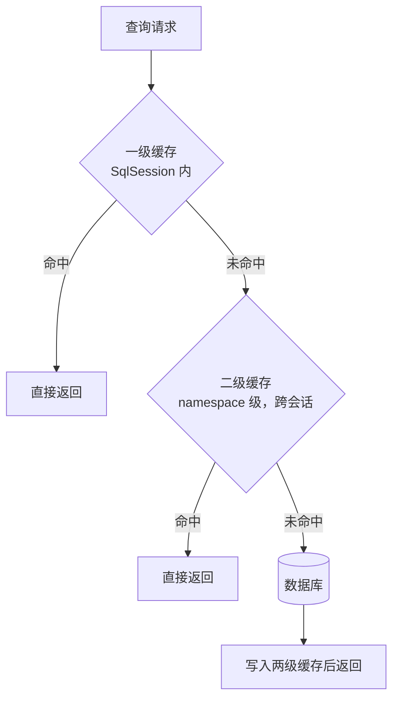

# 04 MyBatis

> 前置知识：[[java/3工程化/03_JDBC与数据库连接|JDBC与数据库连接]]。MyBatis 是国内互联网公司的绝对主力持久层框架，本章按"概念 - 上手 - 动态 SQL - 缓存 - 增强"的实战路线展开。

---

## 一、ORM 概念与 MyBatis 的定位

ORM（Object Relational Mapping）：在对象世界和关系表之间做翻译，省去手写 ResultSet 到对象的映射样板。

框架光谱上有两个极端：

- **全自动**（Hibernate/JPA）：不用写一行 SQL，操作对象即操作表。代价是复杂查询时生成的 SQL 黑盒难控；
- **半自动**（MyBatis）：SQL 自己写（可控可优化），结果集到对象的映射帮你做。

```text
        全自动 <----------------------------------------> 手写 JDBC
   Hibernate/JPA          MyBatis              DAO+DBUtils
   完全屏蔽 SQL         SQL自己写/映射帮你做      全部自己来
   简单CRUD爽           国内主流选择             样板地狱
```

国内偏 MyBatis 的原因很实际：业务复杂、DBA 要审 SQL、大促前要精细调优——SQL 必须握在自己手里。

---

## 二、快速上手

### 2.1 依赖与全局配置

```xml
<dependency>
    <groupId>org.mybatis</groupId>
    <artifactId>mybatis</artifactId>
    <version>3.5.16</version>
</dependency>
<!-- MySQL 驱动与连接池同上一章 -->
```

mybatis-config.xml（核心配置文件）：

```xml
<?xml version="1.0" encoding="UTF-8"?>
<!DOCTYPE configuration PUBLIC "-//mybatis.org//DTD Config 3.0//EN"
        "http://mybatis.org/dtd/mybatis-3-config.dtd">
<configuration>
    <!-- 驼峰转换：数据库 create_time 自动映射 Java createTime，强烈建议开 -->
    <settings>
        <setting name="mapUnderscoreToCamelCase" value="true"/>
        <!-- 打印 SQL 日志，开发期排错神器 -->
        <setting name="logImpl" value="STDOUT_LOGGING"/>
    </settings>

    <environments default="dev">
        <environment id="dev">
            <transactionManager type="JDBC"/>       <!-- 事务交给 JDBC 管理 -->
            <dataSource type="POOLED">              <!-- 使用内置池 -->
                <property name="driver" value="com.mysql.cj.jdbc.Driver"/>
                <property name="url"
                          value="jdbc:mysql://localhost:3306/shop?useSSL=false&amp;serverTimezone=Asia/Shanghai"/>
                <property name="username" value="root"/>
                <property name="password" value="123456"/>
            </dataSource>
        </environment>
    </environments>

    <!-- 注册映射文件 -->
    <mappers>
        <mapper resource="mapper/StudentMapper.xml"/>
    </mappers>
</configuration>
```

### 2.2 三步构建：SqlSessionFactory → SqlSession → Mapper

```java
import org.apache.ibatis.io.Resources;
import org.apache.ibatis.session.*;
import java.io.InputStream;

/**
 * MyBatis 启动三件套
 * SqlSessionFactory：应用级单例，重量级
 * SqlSession：一次会话/一个事务单位，线程不安全，用完即关
 */
public class MyBatisBootstrap {
    private static final SqlSessionFactory FACTORY;

    static {
        try (InputStream in = Resources.getResourceAsStream("mybatis-config.xml")) {
            FACTORY = new SqlSessionFactoryBuilder().build(in);
        } catch (Exception e) {
            throw new ExceptionInInitializerError(e);
        }
    }

    public static SqlSession open() {
        return FACTORY.openSession();
    }
}
```

Mapper 接口——只声明方法，不写实现：

```java
import java.util.List;

public interface StudentMapper {
    Student selectById(Long id);
    List<Student> selectAll();
    int insert(Student s);
    int updateScore(@Param("id") Long id, @Param("score") Double score);
}
```

### 2.3 第一个 XML 映射文件

```xml
<?xml version="1.0" encoding="UTF-8"?>
<!DOCTYPE mapper PUBLIC "-//mybatis.org//DTD Mapper 3.0//EN"
        "http://mybatis.org/dtd/mybatis-3-mapper.dtd">
<mapper namespace="com.rootstack.mapper.StudentMapper">

    <!-- id 必须与接口方法同名；parameterType/resultType 指定出入参类型 -->
    <select id="selectById" parameterType="long" resultType="com.rootstack.entity.Student">
        SELECT id, name, age, score FROM student WHERE id = #{id}
    </select>

    <select id="selectAll" resultType="com.rootstack.entity.Student">
        SELECT id, name, age, score FROM student ORDER BY id
    </select>

    <insert id="insert" parameterType="com.rootstack.entity.Student"
            useGeneratedKeys="true" keyProperty="id">
        INSERT INTO student(name, age, score) VALUES(#{name}, #{age}, #{score})
    </insert>

    <!-- 多参数用 @Param 命名后引用 -->
    <update id="updateScore">
        UPDATE student SET score = #{score} WHERE id = #{id}
    </update>
</mapper>
```

调用代码：

```java
try (SqlSession session = MyBatisBootstrap.open()) {
    // getMapper 运行时生成接口的代理对象（动态代理，见深入篇反射）
    StudentMapper mapper = session.getMapper(StudentMapper.class);
    Student s = mapper.selectById(1L);
    System.out.println(s);
}   // try-with-resources 自动关闭会话
```

原理一句话：namespace + 方法名定位到 XML 里的那条 SQL，`#{}` 参数经 PreparedStatement 填充，结果集按列名反射注入实体字段。

---

## 三、resultMap：一对一与一对多

实体字段名与列名不一致、或需要关联对象时，resultMap 出场。假设学生有班级（多对一）：

```xml
<resultMap id="studentMap" type="com.rootstack.entity.Student">
    <id property="id" column="id"/>              <!-- 主键 -->
    <result property="name" column="name"/>
    <result property="age" column="age"/>

    <!-- 多对一/一对一：association，一条 SQL 联表查出来直接组装 -->
    <association property="clazz" javaType="com.rootstack.entity.Clazz">
        <id property="id" column="class_id"/>
        <result property="className" column="class_name"/>
    </association>
</resultMap>

<select id="selectWithClass" resultMap="studentMap">
    SELECT s.id, s.name, s.age,
           c.id AS class_id, c.class_name
    FROM student s LEFT JOIN clazz c ON s.class_id = c.id
    WHERE s.id = #{id}
</select>

<!-- 一对多：collection，班级里装着学生列表 -->
<resultMap id="clazzMap" type="com.rootstack.entity.Clazz">
    <id property="id" column="c_id"/>
    <result property="className" column="c_name"/>
    <collection property="students" ofType="com.rootstack.entity.Student">
        <id property="id" column="s_id"/>
        <result property="name" column="s_name"/>
    </collection>
</resultMap>

<select id="selectClassWithStudents" resultMap="clazzMap">
    SELECT c.id AS c_id, c.class_name AS c_name,
           s.id AS s_id, s.name AS s_name
    FROM clazz c LEFT JOIN student s ON s.class_id = c.id
    WHERE c.id = #{id}
</select>
```

记忆口诀：**association 装"一个"，collection 装"一堆"**。另一种写法是分步查询 + `select` 属性做懒加载，联表数据量大时更灵活，但会引入 N+1 风险，初学先用联表版。

---

## 四、#{} 与 ${}：本质区别（高频面试题）

```xml
<select id="badCase">
    SELECT * FROM user WHERE name = '${name}'   <!-- 字符串替换 -->
</select>

<select id="goodCase">
    SELECT * FROM user WHERE name = #{name}     <!-- 预编译占位符 -->
</select>
```

| | #{} | ${} |
|--|-----|-----|
| 实现方式 | PreparedStatement 的 ? 占位 | SQL 拼接前直接字符串替换 |
| 注入风险 | 无，值永远只是值 | 有，输入可携带 SQL 结构 |
| 典型报错 | - | 输入 `x' OR '1'='1` 拖全库 |

注入原理与利用链在 [[red_team/数据库安全/02-MySQL渗透|MySQL渗透]] 与 [[red_team/ctf_trea/Web/SQL/03-报错注入|报错注入]] 有实战展开——MyBatis 里 `${}` 就是最常见的注入入口。

${} 唯一合法用途是**动态列名/排序字段**这类不能加引号的结构位置，且必须白名单校验：

```xml
<choose>
    <!-- 排序字段只允许从固定枚举中选，绝不接收前端原文 -->
    <when test="sortField == 'score'">ORDER BY score</when>
    <when test="sortField == 'age'">ORDER BY age</when>
    <otherwise>ORDER BY id</otherwise>
</choose>
```

---

## 五、动态 SQL 九大标签

业务查询条件动态多变，XML 里拼 if 是 MyBatis 的看家本领：

```xml
<!-- 多条件组合查询：if + where -->
<select id="search" resultType="com.rootstack.entity.Student">
    SELECT * FROM student
    <where>                          <!-- where 标签自动处理开头多余的 AND/OR -->
        <if test="name != null and name != ''">
            AND name LIKE CONCAT('%', #{name}, '%')
        </if>
        <if test="minAge != null">
            AND age &gt;= #{minAge}
        </if>
        <if test="maxAge != null">
            AND age &lt;= #{maxAge}
        </if>
    </where>
</select>

<!-- foreach：IN 查询 / 批量插入 -->
<select id="findByIds" resultType="com.rootstack.entity.Student">
    SELECT * FROM student WHERE id IN
    <foreach collection="ids" item="id" open="(" separator="," close=")">
        #{id}
    </foreach>
</select>

<insert id="batchInsert">
    INSERT INTO student(name, age) VALUES
    <foreach collection="list" item="s" separator=",">
        (#{s.name}, #{s.age})
    </foreach>
</insert>

<!-- choose/when/otherwise：多分支只取其一（相当于 switch） -->
<select id="orderBy" resultType="com.rootstack.entity.Student">
    SELECT * FROM student
    <choose>
        <when test="field == 'score'"> ORDER BY score DESC </when>
        <when test="field == 'age'">   ORDER BY age ASC  </when>
        <otherwise>                    ORDER BY id       </otherwise>
    </choose>
</select>

<!-- set：update 时自动处理结尾逗号；配合 if 实现选择性更新 -->
<update id="updateSelective">
    UPDATE student
    <set>
        <if test="name != null"> name = #{name}, </if>
        <if test="age != null">  age = #{age}    </if>
    </set>
    WHERE id = #{id}
</update>

<!-- trim：万能裁剪，where/set 都是它的语法糖 -->
<trim prefix="WHERE" prefixOverrides="AND |OR ">
    ...条件...
</trim>
```

九大标签清单：`if`、`where`、`set`、`trim`、`foreach`、`choose/when/otherwise`、`bind`。前七个覆盖 95% 场景。

踩坑记录：test 表达式里写 `&gt;=` 要转义或用 `<![CDATA[ ]]>` 包裹；单字符比较 `name == 'Y'` 在 OGNL 中会被当 char 处理导致恒 false，写成 `'Y'.toString()` 或双引号包外层。

---

## 六、注解方式

简单 SQL 可以不写 XML，直接注解上脸：

```java
public interface StudentMapper {

    @Select("SELECT * FROM student WHERE id = #{id}")
    Student selectById(Long id);

    @Insert("INSERT INTO student(name, age) VALUES(#{name}, #{age})")
    @Options(useGeneratedKeys = true, keyProperty = "id")
    int insert(Student s);

    @Update("UPDATE student SET score=#{score} WHERE id=#{id}")
    int updateScore(@Param("id") Long id, @Param("score") Double score);

    @Delete("DELETE FROM student WHERE id = #{id}")
    int deleteById(Long id);
}
```

经验法则：一两行的简单 SQL 用注解；涉及动态标签、resultMap、复杂联表的必须回 XML。团队内要统一约定，最怕一半注解一半 XML 到处翻。

---

## 七、分页：PageHelper

MyBatis 本身不带分页，国内事实标准是 PageHelper——用拦截器自动改写 SQL 加 LIMIT：

```xml
<dependency>
    <groupId>com.github.pagehelper</groupId>
    <artifactId>pagehelper</artifactId>
    <version>6.1.0</version>
</dependency>
```

```java
import com.github.pagehelper.PageHelper;
import com.github.pagehelper.PageInfo;

/** 分页查询：紧跟在 PageHelper.startPage 后的第一条查询会被自动分页 */
public PageInfo<Student> pageStudents(int pageNum, int pageSize) {
    try (SqlSession session = MyBatisBootstrap.open()) {
        StudentMapper mapper = session.getMapper(StudentMapper.class);
        PageHelper.startPage(pageNum, pageSize);   // 只对下一条 SQL 生效
        List<Student> list = mapper.selectAll();   // 已被改写为 ...LIMIT offset,size
        return new PageInfo<>(list);               // 包装出总数/页数/是否首页等元信息
    }
}
```

两个经典坑：

1. `startPage` 和查询之间**绝不能插其他 SQL**（比如先查了个 count），分页会错位到别的语句上；
2. PageInfo 里的 total 依赖 PageHelper 自动执行的 count 查询，复杂联表时 count 性能差，可手写 `countColumn` 或单独优化。

Spring Boot 中换 starter 并在 yml 配 `pagehelper.helper-dialect=mysql` 即可。

---

## 八、缓存体系



- **一级缓存**：默认开启，SqlSession 范围。同一会话内相同查询第二次不再发 SQL。注意 Spring 整合后每次请求一个新 SqlSession，一级缓存基本感知不到；任何增删改都会清空它；
- **二级缓存**：namespace 范围，需手动 `<cache/>` 开启。跨会话共享，但多表关联时更新一张表不会清掉关联 namespace 的缓存，**极易脏读**。

生产建议：**二级缓存默认关闭**，缓存交给 Redis 等专业组件做，MyBatis 缓存只留在单机小工具里。

---

## 九、MyBatis-Plus 增强

单表 CRUD 没必要手写 SQL。MyBatis-Plus 在不动 MyBatis 的前提下做增强：

```xml
<!-- spring-boot 场景引入 mybatis-plus-boot-starter 即可，无需再引 mybatis -->
<dependency>
    <groupId>com.baomidou</groupId>
    <artifactId>mybatis-plus-spring-boot3-starter</artifactId>
    <version>3.5.7</version>
</dependency>
```

### 9.1 BaseMapper：单表零 SQL

```java
// 实体类注解声明表名与主键
@TableName("student")
public class Student {
    @TableId(type = IdType.AUTO)     // 自增主键
    private Long id;
    private String name;             // 驼峰自动映射 name/create_time 等
    @TableField(exist = false)       // 数据库不存在的字段必须标注
    private String extra;
}

// Mapper 继承 BaseMapper，立刻拥有全套单表方法
public interface StudentMapper extends BaseMapper<Student> {}
```

```java
// 单表操作示例：增删改查全部内置
mapper.insert(student);
Student s = mapper.selectById(1L);
mapper.updateById(partialUpdate);
mapper.deleteById(1L);

Long count = mapper.selectCount(
        new LambdaQueryWrapper<Student>().gt(Student::getScore, 90));
List<Student> top = mapper.selectList(new LambdaQueryWrapper<Student>()
        .like(Student::getName, "张")
        .between(Student::getAge, 18, 25)
        .orderByDesc(Student::getScore)
        .last("LIMIT 10"));            // last 拼接原生片段，慎用
```

LambdaQueryWrapper 用方法引用代替字符串列名，重构改名编译期就报错，比 QueryWrapper 安全一档。

### 9.2 分页插件

```java
@Configuration
public class MpConfig {
    @Bean
    public MybatisPlusInterceptor mybatisPlusInterceptor() {
        MybatisPlusInterceptor i = new MybatisPlusInterceptor();
        i.addInnerInterceptor(new PaginationInnerInterceptor(DbType.MYSQL));
        return i;
    }
}

// 使用
Page<Student> page = mapper.selectPage(new Page<>(2, 10), null);   // 第2页每页10条
page.getRecords();  page.getTotal();
```

---

## 十、逆向工程 generator 与调试技巧

### 10.1 MBG 逆向生成

表结构先行的工作流里，mybatis-generator 可从表反向生成实体、Mapper 接口与 XML 骨架：

```bash
mvn mybatis-generator:generate   # 配置好 generatorConfig.xml 后一条命令生成代码
```

生成的代码覆盖策略要配好（targetRuntime=MyBatis3Simple 更清爽），团队一般用它起步再用 MP 替代。IDEA 插件 EasyCode / Free MyBatis Tool 也是同类思路，右键表即可生成全套代码。

### 10.2 打印 SQL 日志

开发期必备三板斧：

```properties
# application.yml（Spring Boot 场景）
logging:
  level:
    com.rootstack.mapper: debug   # Mapper 包开 debug，控制台打印完整 SQL + 参数 + 结果行数
mybatis-plus:
  configuration:
    log-impl: org.apache.ibatis.logging.stdout.StdOutImpl   # 备选：标准输出方式
```

排错心法：看到 SQL 先复制出来去数据库客户端手工执行一遍——SQL 错了改 XML，参数错了查传参，数据类型错了看 resultType。

---

## 十一、实战：学生管理 CRUD 完整工程

目录结构：

```text
student-mgmt/
├── pom.xml                          依赖：mybatis + mysql + pagehelper
└── src/main/
    ├── java/com/rootstack/
    │   ├── entity/Student.java      实体
    │   ├── mapper/StudentMapper.java接口
    │   ├── service/StudentService.java 业务封装（含分页）
    │   └── util/MyBatisBootstrap.java 启动三件套
    └── resources/
        ├── mybatis-config.xml       全局配置
        └── mapper/StudentMapper.xml 映射文件
```

业务层把会话管理与事务封装掉，调用方完全不见 SqlSession：

```java
package com.rootstack.service;

import com.rootstack.entity.Student;
import com.rootstack.mapper.StudentMapper;
import com.rootstack.util.MyBatisBootstrap;
import org.apache.ibatis.session.SqlSession;
import java.util.List;

/**
 * 学生业务层：每个公开方法对应一个事务边界
 * openSession() 默认 autoCommit=false，所以 commit 必须显式调用
 */
public class StudentService {

    public Long add(Student s) {
        try (SqlSession session = MyBatisBootstrap.open()) {
            int rows = session.getMapper(StudentMapper.class).insert(s);
            session.commit();                       // 增删改必须提交事务
            if (rows != 1) throw new IllegalStateException("插入失败");
            return s.getId();                        // useGeneratedKeys 回填的自增主键
        } catch (Exception e) {
            throw new RuntimeException(e);
        }
    }

    public Student get(Long id) {
        try (SqlSession session = MyBatisBootstrap.open()) {
            return session.getMapper(StudentMapper.class).selectById(id);
        }
    }

    public boolean updateScore(Long id, Double score) {
        try (SqlSession session = MyBatisBootstrap.open()) {
            int rows = session.getMapper(StudentMapper.class).updateScore(id, score);
            session.commit();
            return rows > 0;
        }
    }

    public List<Student> search(String keyword, Integer minAge, Integer maxAge) {
        try (SqlSession session = MyBatisBootstrap.open()) {
            // 动态 SQL：条件为 null 时自动剔除对应片段
            return session.getMapper(StudentMapper.class)
                          .search(keyword, minAge, maxAge);
        }
    }

    public void delete(Long id) {
        try (SqlSession session = MyBatisBootstrap.open()) {
            session.getMapper(StudentMapper.class).deleteById(id);
            session.commit();
        }
    }
}
```

对应的 search 动态 SQL 补全到 XML：

```xml
<select id="search" resultType="com.rootstack.entity.Student">
    SELECT * FROM student
    <where>
        <if test="name != null and name != ''">
            AND name LIKE CONCAT('%', #{name}, '%')
        </if>
        <if test="minAge != null"> AND age &gt;= #{minAge} </if>
        <if test="maxAge != null"> AND age &lt;= #{maxAge} </if>
    </where>
    ORDER BY score DESC
</select>

<delete id="deleteById">
    DELETE FROM student WHERE id = #{id}
</delete>
```

跑通验收清单：插入返回自增 id、按名字模糊搜索、区间年龄过滤、更新分数、删除后查询为 null。之后接入 Spring 时只需把 MyBatisBootstrap 换成 mybatis-spring-boot-starter 自动装配，Mapper 注入即用。

---

## 小结

- MyBatis 定位半自动 ORM：SQL 自己写、映射框架做，国内主流；
- 核心三步：SqlSessionFactory → SqlSession → getMapper 动态代理；
- #{} 预编译防注入，${} 字符串替换是漏洞入口，仅限白名单动态列名；
- association/collection 处理一对一/一对多；九大动态标签覆盖条件拼接；
- 二级缓存易脏读，生产关闭；分页用 PageHelper 注意 startPage 位置；
- 单表交给 MyBatis-Plus，复杂 SQL 留在 XML，是最常见的团队分工。

下一章进入 Spring 世界：[[java/3工程化/05_Spring IoC与AOP|Spring IoC与AOP]]。
