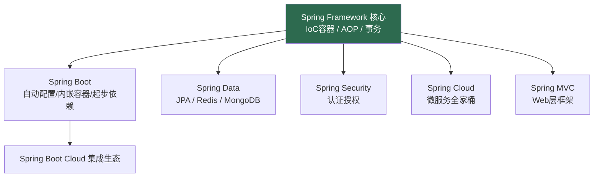
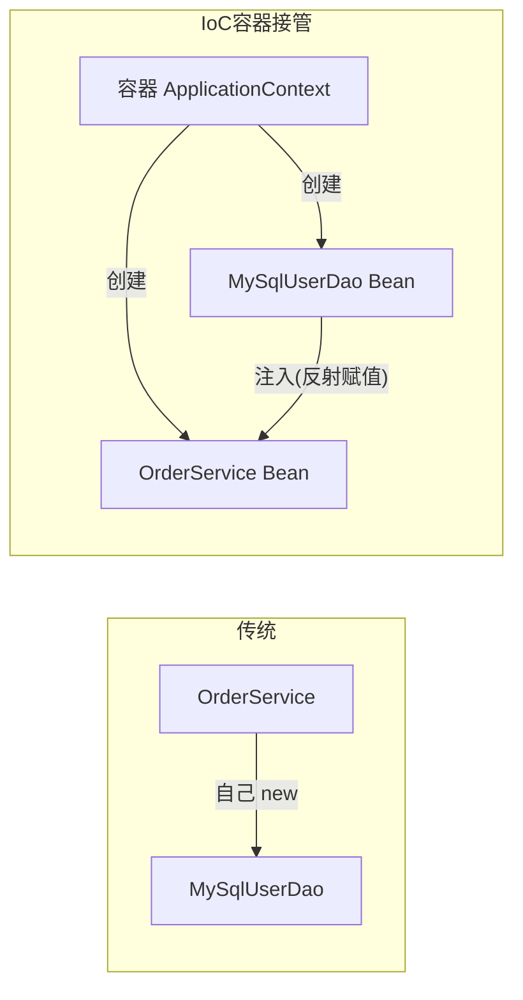
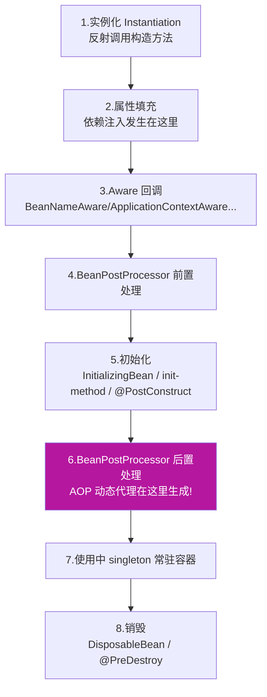
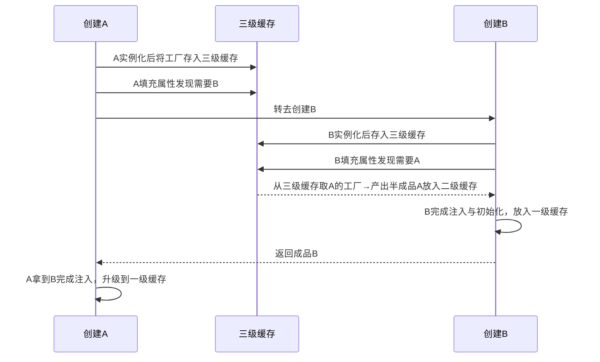
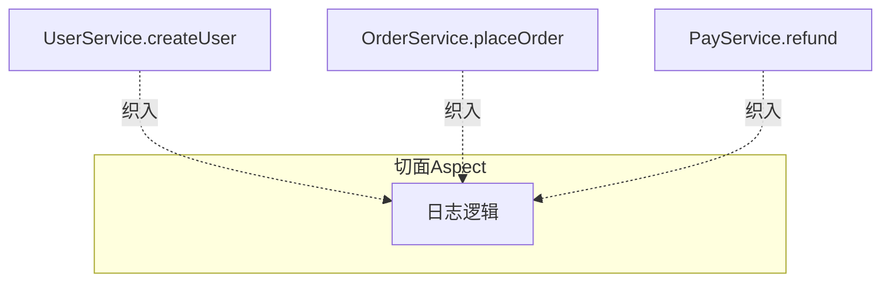
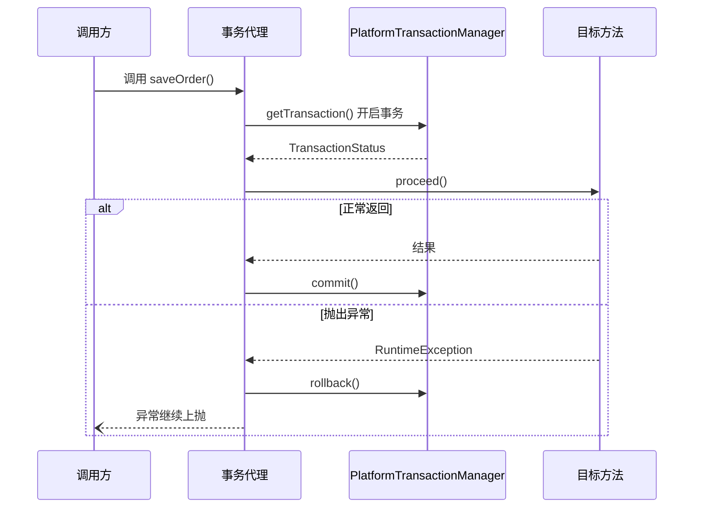

# 05 Spring IoC与AOP

> 前置知识：[[java/2深入/02_注解与反射|注解与反射]]（IoC 与 AOP 的实现根基）。本章讲透 Spring 的两大基石，是理解后面所有 Spring Boot/Cloud 章节的门票。

---

## 一、Spring 家族全景



关系一句话：**Framework 是地基，Boot 是脚手架，其余都是地基上的预制件**。学任何上层模块都绕不开 IoC 与 AOP。

---

## 二、为什么需要 IoC：new 的硬编码耦合

传统写法：

```java
// Service 内部亲手 new 依赖：编译期就焊死
public class OrderService {
    private MySqlUserDao userDao = new MySqlUserDao();      // 换数据库要改代码重编译
    // private OracleUserDao userDao = new OracleUserDao(); 测试想换成 Mock？改代码
}
```

三大痛点：

1. **耦合硬编码**：依赖的具体实现写死在类里；
2. **无法替换**：单元测试没法注入 Mock 对象；
3. **生命周期失控**：谁负责销毁、是否单例，每个类各管各的。

控制反转（Inversion of Control）的思路：**对象的创建权从业务代码反转给容器**。你只声明"我需要一个 UserDao"，容器负责造好并塞给你——塞的过程就是依赖注入（Dependency Injection, DI）。DI 是 IoC 的具体实现手段。



---

## 三、三种注入方式

### 3.1 构造器注入（官方推荐）

```java
@Service
public class OrderService {
    private final UserDao userDao;          // final 保证不可变
    private final PayService payService;

    // Spring 4.3+ 单构造器可省略 @Autowired 注解
    public OrderService(UserDao userDao, PayService payService) {
        this.userDao = userDao;
        this.payService = payService;
    }
}
```

优点：依赖不可变（final）、不会 NPE、脱离容器也能 new 出来直接做单元测试、依赖过多时构造器参数爆炸会逼你重新审视设计。

### 3.2 setter 注入（可选依赖场景）

```java
@Service
public class ReportService {
    private ExportPlugin plugin;

    @Autowired(required = false)   // 容器里没有也不报错
    public void setPlugin(ExportPlugin plugin) {
        this.plugin = plugin;
    }
}
```

### 3.3 字段注入（不推荐但满大街都是）

```java
@Service
public class LegacyService {
    @Autowired
    private UserDao userDao;   // 反射暴力注入，绕过构造器
}
```

为什么不推荐：不能设 final、隐藏依赖关系（new 出来的对象全是 null）、测试必须借助反射工具。老代码常见，新代码请用构造器注入。

---

## 四、Bean 生命周期八阶段



记忆锚点两个：

- **依赖注入在实例化之后、初始化之前**——所以构造器里拿不到 @Value 填充的属性字段；
- **AOP 代理产生在第 6 步**——这就是"同类内部方法自调用事务失效"的根源（见下文）。

验证生命周期的完整实验：

```java
@Component
public class LifecycleBean implements BeanNameAware, InitializingBean, DisposableBean {

    public LifecycleBean() { System.out.println("1. 构造方法：实例化"); }

    @Override
    public void setBeanName(String name) { System.out.println("3. Aware：" + name); }

    @PostConstruct
    public void postConstruct() { System.out.println("5a. @PostConstruct"); }

    @Override
    public void afterPropertiesSet() { System.out.println("5b. afterPropertiesSet"); }

    /** 自定义初始化方法，@Bean(initMethod = "customInit") 指定 */
    public void customInit() { System.out.println("5c. customInit"); }

    @PreDestroy
    public void preDestroy() { System.out.println("8a. @PreDestroy"); }

    @Override
    public void destroy() { System.out.println("8b. destroy"); }
}

/** 观察前后置处理器的执行时机 */
@Component
public class PrintBpp implements BeanPostProcessor {
    public Object postProcessBeforeInitialization(Object bean, String name) {
        System.out.println("4. BPP 前置: " + name);
        return bean;
    }
    public Object postProcessAfterInitialization(Object bean, String name) {
        System.out.println("6. BPP 后置: " + name);
        return bean;
    }
}
```

---

## 五、作用域与懒加载

| 作用域 | 含义 | 场景 |
|--------|------|------|
| singleton（默认） | 容器内唯一实例 | 绝大多数无状态 Service |
| prototype | 每次 getBean 新建一个 | 有状态的可变对象 |
| request / session | Web 场景按请求/会话隔离 | 少见 |

singleton Bean 里持有可变成员变量是并发事故重灾区（多线程共享），要么无状态设计，要么用 ThreadLocal。

懒加载：`@Lazy` 让 Bean 推迟到首次使用时才创建。启动提速手段之一，但会推迟配置错误暴露的时间点，权衡使用。

---

## 六、三种配置方式演进

```java
// ===== 第一代：XML 配置（遗留系统还在用）=====
// <bean id="userDao" class="com.rootstack.dao.MySqlUserDao"/>

// ===== 第二代：JavaConfig，纯 Java 显式声明 =====
@Configuration                       // 声明这是配置类（本质也是特殊 Bean）
@ComponentScan("com.rootstack")     // 扫描包下的 @Component 家族注解
public class AppConfig {

    @Bean                            // 方法返回值注册为一个 Bean
    public DataSource dataSource() {
        HikariDataSource ds = new HikariDataSource();
        ds.setJdbcUrl("jdbc:mysql://localhost:3306/shop");
        return ds;
    }
}

// ===== 第三代：注解扫描 + 自动装配（现代主流）=====
@Component               // 通用组件；派生注解语义更明确：
// @Service 业务层 / @Repository 数据层 / @Controller Web层
public class MySqlUserDao implements UserDao {}
```

选择建议：第三方库的类（你改不了源码加不了注解）用 @Bean 手工注册；自己的业务类一律组件扫描 + 构造器注入。

---

## 七、FactoryBean 与普通 Bean 的区别

FactoryBean 本身是个工厂 Bean，getBean 返回的是它 getObject() 生产的产品：

```java
@Component
public class ClientFactoryBean implements FactoryBean<ExpensiveClient> {
    @Override
    public ExpensiveClient getObject() {
        return new ExpensiveClient();   // 复杂构建逻辑藏在这里
    }
    @Override
    public Class<?> getObjectType() { return ExpensiveClient.class; }
}

context.getBean("clientFactoryBean");       // 得到 ExpensiveClient 产品
context.getBean("&clientFactoryBean");      // 加 & 前缀得到工厂本身
```

MyBatis 的 Mapper 接口没有实现类却能注入，靠的就是 MapperFactoryBean 在 getObject 里生成动态代理。看懂这个，框架源码里的 FactoryBean 就不再神秘。

---

## 八、循环依赖与三级缓存（面试高频）

A 依赖 B，B 又依赖 A——构造器注入时无解（鸡生蛋死锁），**字段/setter 注入 + singleton** 时 Spring 用三级缓存化解：

```text
一级缓存 singletonObjects         成品 Bean
二级缓存 earlySingletonObjects    提前暴露的半成品（已实例化未完成注入）
三级缓存 singletonFactories       ObjectFactory 工厂（能生成半成品或其代理）
```



关键点：**三级缓存存的不是对象而是工厂**，目的是让 AOP 场景下提前生成代理而不破坏生命周期约定。局限：

- 构造器循环依赖：无解，直接报错（合理，说明设计有问题）；
- prototype 循环依赖：无解；
- Spring Boot 2.6+ 默认禁止循环依赖，出现即报错——鼓励用重构消除而非靠缓存兜底。

---

## 九、AOP：横切关注点的模块化

日志、事务、权限这些逻辑散布在每个业务方法里，重复且难维护——它们是**横切关注点**（cross-cutting concern）。AOP（面向切面编程）把它们抽成切面统一织入：



### 9.1 五种通知

```java
@Aspect                       // 声明切面类，需配合 @Component 注册
@Component
public class LogAspect {

    // 切点：定义"在哪里织入"。复用表达式避免重复书写
    @Pointcut("execution(* com.rootstack.service..*.*(..))")
    public void serviceLayer() {}

    @Before("serviceLayer()")
    public void before(JoinPoint jp) {
        System.out.println("进入方法: " + jp.getSignature().getName());
    }

    @AfterReturning(pointcut = "serviceLayer()", returning = "result")
    public void afterReturn(JoinPoint jp, Object result) {
        System.out.println("返回值: " + result);
    }

    @AfterThrowing(pointcut = "serviceLayer()", throwing = "ex")
    public void afterThrow(JoinPoint jp, Exception ex) {
        System.out.println("异常: " + ex.getMessage());
    }

    @After("serviceLayer()")     // finally 语义，无论成败都执行
    public void after(JoinPoint jp) { /* 释放资源等 */ }

    @Around("serviceLayer()")    // 最强通知：包裹整个方法，可控制是否执行
    public Object around(ProceedingJoinPoint pjp) throws Throwable {
        long start = System.currentTimeMillis();
        try {
            Object result = pjp.proceed();      // 放行目标方法
            return result;
        } finally {
            System.out.println("耗时: " + (System.currentTimeMillis() - start) + "ms");
        }
    }
}
```

执行顺序（Spring 5）：`@Around 前半 → @Before → 目标方法 → @AfterReturning/@AfterThrowing → @After → @Around 后半`。日常统计耗时、限流用 @Around；纯记录用 @Before/@After。

### 9.2 execution 表达式详解

```text
execution(修饰符? 返回类型 包名.类名.方法名(参数类型) 异常?)
execution(* com.rootstack.service.UserService.find*(Long))
         │ │                    │           │      └ 方法名以 find 开头
         │ │                    │           └ 类名
         │ └ 返回任意            └ 包路径
```

- `*` 匹配单个元素；`..` 匹配多层包或任意参数；
- 其他指示器：`@annotation(...)` 按注解匹配（自定义注解做权限校验的标准姿势）、`within(...)` 按类型匹配。

---

## 十、JDK 动态代理 vs CGLIB

Spring AOP 底层就是代理对象包装目标对象：

| | JDK 动态代理 | CGLIB |
|--|-------------|-------|
| 实现机制 | 反射实现接口 Proxy.newProxyInstance | 字节码生成目标类的子类 |
| 前提 | 目标必须实现接口 | 类和方法不能是 final |
| 性能 | 接口场景略优 | 创建代理稍慢、执行不差 |

Spring Boot 默认全用 CGLIB（proxy-target-class=true），省去接口判断的心智负担。这也解释了两个经典事故：

1. **自调用事务失效**：`this.methodB()` 走的是原始对象不是代理，切面自然不生效；
2. **final 方法无法增强**：CGLIB 子类覆写不了 final 方法。

```java
// 自调用失效演示与解法
@Service
public class UserService {
    @Transactional
    public void batchSave() { ... }

    public void entry() {
        this.batchSave();          // 失效！this 是原对象
        // 解法一：注入自己（拿到的将是代理）
        // 解法二：把方法拆到另一个 Bean
    }
}
```

---

## 十一、应用场景：事务的底层真相

@Transactional 并不神秘——它就是一个 AOP 环绕通知：



理解了这一点，事务的常见坑都能推导出来：自调用失效（没走代理）、private 方法失效（代理覆写不了）、默认只回滚 RuntimeException（受检异常需 rollbackFor=Exception.class）。

其他典型切面：接口访问日志入库、分布式锁注解、接口幂等校验、慢 SQL 监控埋点。套路一致：**自定义注解 + @Around + @annotation 切点**。

---

## 十二、实战：手写迷你 IoC 容器

50 行左右理解 Spring 的核心原理：扫描 → 反射实例化 → 依赖注入。

```java
import java.io.File;
import java.lang.reflect.Field;
import java.util.*;
import java.util.stream.Collectors;

/**
 * MiniIoC：极简容器，支持 @Component 扫描 + @Autowired 字段注入 + 单例缓存
 * 仅用于教学理解原理，功能远不及 Spring
 */
public class MiniIoc {
    /** 单例池：beanName -> 实例（对应 Spring 一级缓存） */
    private final Map<String, Object> singletonPool = new HashMap<>();

    /**
     * 启动入口：传入要扫描的包名
     */
    public static MiniIoc run(String basePackage) throws Exception {
        MiniIoc ioc = new MiniIoc();
        // 第一步：包扫描，找出所有 @Component 类
        List<Class<?>> classes = scan(basePackage);
        // 第二步：反射实例化并放入单例池
        for (Class<?> c : classes) {
            Component anno = c.getAnnotation(Component.class);
            String name = anno.value().isEmpty()
                    ? Character.toLowerCase(c.getSimpleName().charAt(0)) + c.getSimpleName().substring(1)
                    : anno.value();
            ioc.singletonPool.put(name, c.getDeclaredConstructor().newInstance());
        }
        // 第三步：依赖注入，遍历每个 Bean 的字段补 @Autowired
        for (Object bean : ioc.singletonPool.values()) {
            for (Field f : bean.getClass().getDeclaredFields()) {
                if (f.isAnnotationPresent(Autowired.class)) {
                    f.setAccessible(true);                 // 暴力打开私有字段的访问权
                    f.set(bean, ioc.getBean(f.getType())); // 从容器取依赖注入
                }
            }
        }
        return ioc;
    }

    /** 按类型获取 Bean */
    @SuppressWarnings("unchecked")
    public <T> T getBean(Class<T> type) {
        List<Object> matched = singletonPool.values().stream()
                .filter(type::isInstance).collect(Collectors.toList());
        if (matched.size() != 1) throw new IllegalStateException(
                type.getSimpleName() + " 需要1个Bean，实际" + matched.size());
        return (T) matched.get(0);
    }

    /** 扫描包下所有 class 文件并加载为 Class 对象 */
    private static List<Class<?>> scan(String pkg) throws Exception {
        String path = pkg.replace('.', '/');
        ClassLoader cl = Thread.currentThread().getContextClassLoader();
        File dir = new File(Objects.requireNonNull(cl.getResource(path)).toURI());
        List<Class<?>> result = new ArrayList<>();
        for (File f : Objects.requireNonNull(dir.listFiles())) {
            if (f.getName().endsWith(".class")) {
                Class<?> c = Class.forName(pkg + '.' +
                        f.getName().replace(".class", ""));
                if (c.isAnnotationPresent(Component.class)) result.add(c);
            }
        }
        return result;
    }
}
```

配套注解与使用：

```java
@Component                          // 自定义注解（保留策略 RUNTIME）
public @interface Component { String value() default ""; }

@Autowired
public @interface Autowired {}
```

```java
@Component
public class MySqlUserDao implements UserDao {}

@Component
public class OrderService {
    @Autowired
    private UserDao userDao;   // 容器启动时被自动注入
}

// 启动
MiniIoc container = MiniIoc.run("com.rootstack.demo");
```

对照真实 Spring 的差距：没有三级缓存循环依赖处理、没有 BeanPostProcessor 扩展链、没有生命周期回调、按名字而非类型注册……但骨架已经一致：**扫描配置元数据 → 反射创建 → 注入依赖 → 缓存单例**。

---

## 小结

- IoC 把对象创建权反转给容器，DI 是实现手段，构造器注入是首选姿势；
- Bean 八阶段里记牢两个锚点：属性填充在初始化前、AOP 代理在 BPP 后置生成；
- 循环依赖三级缓存的本质是"提前暴露半成品"，Boot 2.6+ 已默认禁止；
- AOP 用动态代理织入横切逻辑，@Around 功能最全；事务失效三坑全部源于"绕过了代理"；
- 手写迷你容器后回头看 Spring 源码，主流程不再陌生。

下一章用 Boot 把这些能力串成生产力：[[java/3工程化/06_Spring Boot快速开发|Spring Boot快速开发]]。
