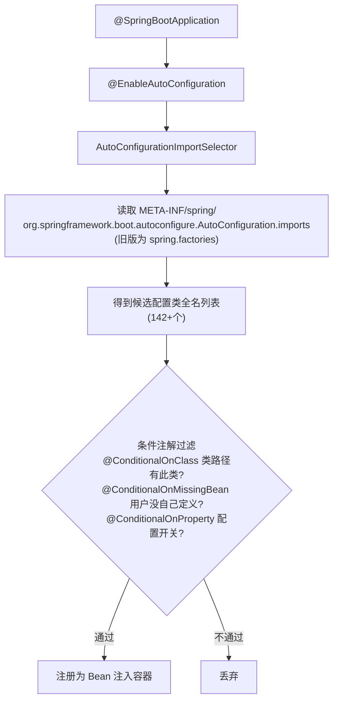

# 06 Spring Boot快速开发

> 前置知识：[[java/3工程化/05_Spring IoC与AOP|Spring IoC与AOP]]。本章目标：20 分钟内从空目录跑起一个能连数据库的 REST API。

---

## 一、约定优于配置：终结配置地狱

传统 Spring 项目建一个 Web 应用的仪式感：

```text
1. 手写几十个依赖坐标，版本要自己配平
2. web.xml 注册 DispatcherServlet（或 @Configuration）
3. application-context.xml 扫描包、数据源、事务管理器...
4. 打 war 包，找 Tomcat 部署
```

Spring Boot 的回答是三个字——**自动来**：

- **起步依赖（starter）**：一个坐标打包一组配套依赖，版本由官方 BOM 配平；
- **自动配置**：检测到 classpath 有什么，就自动装配对应 Bean；
- **内嵌容器**：Tomcat 直接嵌进 jar，`java -jar` 就是服务，免外置部署。

---

## 二、starter 与自动配置原理

### 2.1 起步依赖机制

```xml
<dependency>
    <groupId>org.springframework.boot</groupId>
    <artifactId>spring-boot-starter-web</artifactId>
</dependency>
<!-- 这一个坐标背后 = spring-web + springmvc + jackson + tomcat + 日志... -->
```

常用 starter 清单：

| starter | 提供能力 |
|---------|----------|
| spring-boot-starter-web | REST/MVC + 内嵌 Tomcat + Jackson |
| spring-boot-starter-data-jpa | JPA + Hibernate + 事务 |
| spring-boot-starter-data-redis | Redis 客户端封装 |
| spring-boot-starter-security | 认证授权全家桶 |
| spring-boot-starter-test | JUnit5 + Mockito + MockMvc |
| spring-boot-starter-actuator | 生产监控端点 |
| spring-boot-starter-validation | 参数校验 Hibernate Validator |
| mybatis-plus-spring-boot3-starter | 第三方也按此范式发布 |

### 2.2 自动配置原理链路（面试高频）



核心思想一句话：**classpath 里有什么就自动装什么；用户自己配了就以用户的为准**。例如 classpath 出现 `mysql-connector-j` 且配了 url，DataSource 自动配置生效；你若手工声明了一个 DataSource Bean，它就让位。

### 2.3 主类与 parent

```java
@SpringBootApplication   // = @Configuration + @ComponentScan + @EnableAutoConfiguration
public class BookApplication {
    public static void main(String[] args) {
        SpringApplication.run(BookApplication.class, args);
    }
}
```

```xml
<parent>
    <groupId>org.springframework.boot</groupId>
    <artifactId>spring-boot-starter-parent</artifactId>
    <version>3.3.4</version>
</parent>
<!-- 继承官方 parent 后所有 starter 无需写版本号 -->
<properties><java.version>17</java.version></properties>
```

公司项目通常改为导入 `spring-boot-dependencies` BOM（scope=import），把 parent 名额留给企业父 POM。

---

## 三、application.yml 配置

### 3.1 YAML 语法速览

```yaml
# 缩进两格表示层级，冒号后必须有空格
spring:
  datasource:
    url: jdbc:mysql://localhost:3306/shop?useSSL=false&serverTimezone=Asia/Shanghai
    username: root
    password: "123456"          # 特殊字符或前导零建议加引号
  jackson:
    date-format: yyyy-MM-dd HH:mm:ss
    time-zone: Asia/Shanghai

server:
  port: 8080

app:                             # 自定义配置区
  upload-dir: /data/upload
```

### 3.2 多环境 Profile

```yaml
spring:
  profiles:
    active: dev        # 默认激活 dev

---                    # 三横线分隔多文档块
spring:
  config:
    activate:
      on-profile: dev
logging:
  level:
    com.rootstack: debug

---
spring:
  config:
    activate:
      on-profile: prod
logging:
  level:
    com.rootstack: info
```

```bash
# 运行时切换环境的三种方式
java -jar app.jar --spring.profiles.active=prod
export SPRING_PROFILES_ACTIVE=prod     # 环境变量优先级更高
mvn spring-boot:run -Dspring-boot.run.profiles=test
```

配置文件加载优先级（高的覆盖低的）：命令行参数 > OS 环境变量 > application-{profile}.yml > application.yml。生产密码等敏感信息走环境变量，不要提交到 git。

---

## 四、两种方式创建项目

**方式一：Spring Initializr 网页**。访问 start.spring.io（国内可用阿里云 start.aliyun.com），选 Maven/JDK17/勾选依赖，下载 zip 解压即用。

**方式二：IDEA 向导**。New Project → Spring Initializr，本质调用同一服务，选完依赖直接生成工程。

生成的工程自带目录骨架：

```text
book-api/
├── pom.xml
└── src/
    ├── main/java/com/rootstack/book/BookApplication.java
    ├── main/resources/application.yml
    └── test/java/com/rootstack/book/BookApplicationTests.java
```

---

## 五、第一个 REST 接口

```java
package com.rootstack.book.controller;

import org.springframework.web.bind.annotation.*;
import java.util.Map;

/**
 * 最小可用接口集
 */
@RestController                       // = @Controller + @ResponseBody，返回值直接写响应体
public class HelloController {

    // GET http://localhost:8080/hello?name=张三
    @GetMapping("/hello")
    public Map<String, Object> hello(@RequestParam(defaultValue = "world") String name) {
        return Map.of("message", "hello, " + name, "ts", System.currentTimeMillis());
    }

    // POST http://localhost:8080/echo，JSON 请求体映射为 Map
    @PostMapping("/echo")
    public Map<String, Object> echo(@RequestBody Map<String, Object> body) {
        return body;
    }
}
```

启动后控制台出现 Spring logo 与 `Started BookApplication in x.xxx seconds` 即成功。访问 `curl 'localhost:8080/hello?name=spring'` 验证。

---

## 六、配置绑定 @ConfigurationProperties

类型安全地把一段配置映射成对象，比散落的 @Value 强得多：

```yaml
app:
  upload:
    dir: /data/upload
    max-size-mb: 20
    allowed-ext: [jpg, png, pdf]
```

```java
package com.rootstack.book.config;

import org.springframework.boot.context.properties.ConfigurationProperties;
import org.springframework.stereotype.Component;
import java.util.List;

@Component
@ConfigurationProperties(prefix = "app.upload")   // 前缀绑定
public class UploadProperties {
    private String dir;                 // 宽松绑定：dir / max-size-mb 自动匹配驼峰
    private int maxSizeMb;
    private List<String> allowedExt;

    public String getDir() { return dir; }
    public void setDir(String dir) { this.dir = dir; }
    public int getMaxSizeMb() { return maxSizeMb; }
    public void setMaxSizeMb(int maxSizeMb) { this.maxSizeMb = maxSizeMb; }
    public List<String> getAllowedExt() { return allowedExt; }
    public void setAllowedExt(List<String> allowedExt) { this.allowedExt = allowedExt; }
}
```

任何 Bean 注入 UploadProperties 即拿到全部配置，IDEA 还能给 yml 字段补全和校验提示。

---

## 七、Actuator：生产监控端点

引入 spring-boot-starter-actuator 后获得一组运维端点：

| 端点 | 作用 | 默认暴露 |
|------|------|:---:|
| /actuator/health | 健康检查（DB/Redis/磁盘状态） | 是 |
| /actuator/info | 构建版本信息 | 是 |
| /actuator/metrics | JVM/QPS 各类指标 | 否 |
| /actuator/env | 环境变量与配置属性 | 否 |
| /actuator/loggers | 动态调整日志级别 | 否 |
| /actuator/threaddump | 线程快照，排查卡死 | 否 |

```yaml
management:
  endpoints:
    web:
      exposure:
        include: health,info,metrics,loggers   # 生产按需暴露，env 别乱开
  endpoint:
    health:
      show-details: always                     # 显示各组件明细
```

`curl localhost:8080/actuator/health` 返回 `{"status":"UP"}`。K8s 的 liveness/readiness 探针通常就指向这里。

---

## 八、devtools 热重载与杂项

```xml
<dependency>
    <groupId>org.springframework.boot</groupId>
    <artifactId>spring-boot-devtools</artifactId>
    <scope>runtime</scope>
    <optional>true</optional>     <!-- 不传递给依赖本模块的项目 -->
</dependency>
```

原理是**自动重启**而非真热替换：检测到 classpath 变化后用重启类加载器快速重启应用（秒级），静态资源直接刷新即生效。注意：

- IDEA 需开启自动编译（Settings → Compiler → Build project automatically + 注册表勾选 compiler.automake.allow.when.app.running）；
- 打包发布时 devtools 自动被排除，不会进 fat jar。

banner 与日志：

```yaml
spring:
  main:
    banner-mode: off            # 关闭启动 logo；自定义则放 resources/banner.txt
logging:
  level:
    root: info
    com.rootstack.book.mapper: debug   # MyBatis SQL 打印
  file:
    name: logs/book-api.log
```

---

## 九、打包与运行

```bash
mvn clean package
ls target/*.jar
# target/book-api-0.0.1-SNAPSHOT.jar   <- 可执行 fat jar（Boot 三层嵌套结构）

java -jar target/book-api-0.0.1-SNAPSHOT.jar --server.port=9090

# 常用运维参数
java -jar app.jar \
     -Xms512m -Xmx512m \                  # 注意 JVM 参数要放 -jar 前面！
     --spring.profiles.active=prod
```

踩坑记录：`-Xmx` 等 JVM 参数写在 `-jar xxx.jar` 之后会被当作程序参数忽略——这是新手最高频事故之一。正确顺序 `java -Xmx512m -jar app.jar`。

fat jar 结构速览（为什么不能被普通 jar 工具解压后直接跑）：

```text
app.jar
├── META-INF/MANIFEST.MF          Main-Class=JarLauncher(引导类)
├── org/springframework/boot/loader/   Boot 自定义类加载器
└── BOOT-INF/
    ├── classes/                  你的代码与配置
    └── lib/                      全部依赖 jar
```

---

## 十、实战：图书管理 API 全流程

目标：建库 → 实体 → 数据访问 → 接口 → 验证，20 分钟走完。

第一步，建表：

```sql
CREATE TABLE book (
    id       BIGINT PRIMARY KEY AUTO_INCREMENT,
    title    VARCHAR(100) NOT NULL,
    author   VARCHAR(50),
    price    DECIMAL(8,2),
    created_at DATETIME DEFAULT CURRENT_TIMESTAMP
);
```

第二步，pom 依赖：web + data-jpa + mysql + actuator（JPA 细节下一章展开，这里当黑盒用）。

第三步，application.yml：

```yaml
spring:
  datasource:
    url: jdbc:mysql://localhost:3306/shop?useSSL=false&serverTimezone=Asia/Shanghai
    username: root
    password: "123456"
  jpa:
    hibernate:
      ddl-auto: update        # 开发期自动同步表结构，生产必须改 none
    show-sql: true
server:
  port: 8080
```

第四步，实体：

```java
package com.rootstack.book.entity;

import jakarta.persistence.*;
import java.math.BigDecimal;
import java.time.LocalDateTime;

@Entity
@Table(name = "book")
public class Book {
    @Id
    @GeneratedValue(strategy = GenerationType.IDENTITY)
    private Long id;
    private String title;
    private String author;
    private BigDecimal price;                 // 金额一律 BigDecimal，不用 double
    @Column(name = "created_at")
    private LocalDateTime createdAt;

    public Long getId() { return id; }
    public void setId(Long id) { this.id = id; }
    public String getTitle() { return title; }
    public void setTitle(String title) { this.title = title; }
    public String getAuthor() { return author; }
    public void setAuthor(String author) { this.author = author; }
    public BigDecimal getPrice() { return price; }
    public void setPrice(BigDecimal price) { this.price = price; }
    public LocalDateTime getCreatedAt() { return createdAt; }
    public void setCreatedAt(LocalDateTime createdAt) { this.createdAt = createdAt; }
}
```

第五步，Repository 与 Service：

```java
package com.rootstack.book.repo;

import com.rootstack.book.entity.Book;
import org.springframework.data.jpa.repository.JpaRepository;
import java.util.List;

public interface BookRepository extends JpaRepository<Book, Long> {
    List<Book> findByAuthorContaining(String keyword);   // 方法名推导查询
}
```

```java
package com.rootstack.book.service;

import com.rootstack.book.entity.Book;
import com.rootstack.book.repo.BookRepository;
import org.springframework.stereotype.Service;
import java.util.List;

@Service
public class BookService {
    private final BookRepository repo;

    // 构造器注入：单构造器省略 @Autowired
    public BookService(BookRepository repo) { this.repo = repo; }

    public Book create(Book b) {
        b.setId(null);              // 强制新增而非误更新
        return repo.save(b);
    }

    public List<Book> list(String author) {
        if (author == null || author.isBlank()) {
            return repo.findAll();
        }
        return repo.findByAuthorContaining(author);
    }

    public Book detail(Long id) {
        return repo.findById(id).orElseThrow(
                () -> new IllegalArgumentException("图书不存在: " + id));
    }

    public void delete(Long id) {
        detail(id);                 // 先确保存在，404 语义更准确
        repo.deleteById(id);
    }
}
```

第六步，Controller：

```java
package com.rootstack.book.controller;

import com.rootstack.book.entity.Book;
import com.rootstack.book.service.BookService;
import org.springframework.http.HttpStatus;
import org.springframework.web.bind.annotation.*;
import java.util.List;

@RestController
@RequestMapping("/api/books")
public class BookController {
    private final BookService service;

    public BookController(BookService service) { this.service = service; }

    @PostMapping
    @ResponseStatus(HttpStatus.CREATED)               // 新增成功返回 201
    public Book create(@RequestBody Book book) {
        return service.create(book);
    }

    @GetMapping
    public List<Book> list(@RequestParam(required = false) String author) {
        return service.list(author);
    }

    @GetMapping("/{id}")
    public Book detail(@PathVariable Long id) {
        return service.detail(id);
    }

    @DeleteMapping("/{id}")
    @ResponseStatus(HttpStatus.NO_CONTENT)            // 删除成功返回 204
    public void delete(@PathVariable Long id) {
        service.delete(id);
    }
}
```

第七步，验证全链路：

```bash
mvn spring-boot:run

# 新增
curl -X POST localhost:8080/api/books -H 'Content-Type: application/json' \
     -d '{"title":"深入理解Java虚拟机","author":"周志明","price":129.00}'
# 查询列表 / 单本
curl localhost:8080/api/books
curl localhost:8080/api/books/1
# 健康检查
curl localhost:8080/actuator/health
```

---

## 小结

- starter 解决依赖配平，自动配置解决 Bean 装配，内嵌容器解决部署；
- 自动配置链路：@EnableAutoConfiguration → imports 文件 → 条件注解过滤；
- 配置绑定用 @ConfigurationProperties，多环境用 profile + 环境变量管理敏感信息；
- JVM 参数位置、devtools 编译设置、ddl-auto 生产改 none 是三大高频坑；
- Actuator 的 health 端点是容器编排探针的事实标准。

下一章把 Web 层讲透：[[java/3工程化/07_Spring MVC|Spring MVC]]。
