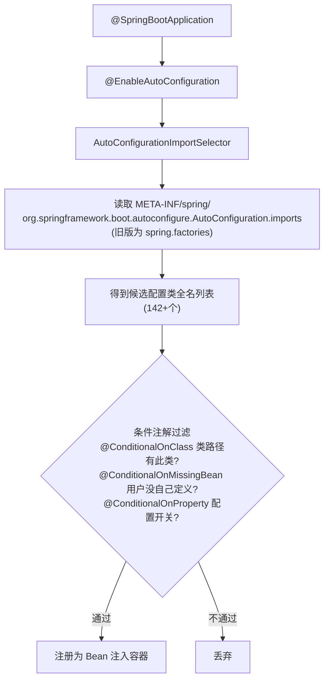

# 06 Spring Boot快速开发

> 前置知识：[[java/3工程化/05_Spring IoC与AOP|Spring IoC与AOP]]。本章目标：20 分钟内从空目录跑起一个能连数据库的 REST API。

---

## 一、约定优于配置：终结配置地狱

传统 Spring 项目建一个 Web 应用的仪式感：

```text
1. 手写几十个依赖坐标，版本要自己配平
2. web.xml 注册 DispatcherServlet（或 @Configuration）
3. application-context.xml 扫描包、数据源、事务管理器...
4. 打 war 包，找 Tomcat 部署
```

Spring Boot 的回答是三个字——**自动来**：

- **起步依赖（starter）**：一个坐标打包一组配套依赖，版本由官方 BOM 配平；
- **自动配置**：检测到 classpath 有什么，就自动装配对应 Bean；
- **内嵌容器**：Tomcat 直接嵌进 jar，`java -jar` 就是服务，免外置部署。

**为什么 Spring Boot 选择"约定优于配置"？**

传统 Spring XML 配置的问题不是"配置多"，而是"每个项目都在重复同样的配置"。一个 Web 项目需要 DispatcherServlet、ViewResolver、HandlerMapping——这些对 99% 的项目都一样。Spring Boot 的哲学是：**把不变的交给框架，把变化的留给用户**。这不是 Spring 的发明，而是 Ruby on Rails、Grails 等框架验证过的成功模式。Spring Boot 的贡献是把这套哲学带入了 Java 企业级开发，同时保留了 Spring 的全部灵活性。

---

## 二、starter 与自动配置原理

### 2.1 起步依赖机制

```xml
<dependency>
    <groupId>org.springframework.boot</groupId>
    <artifactId>spring-boot-starter-web</artifactId>
</dependency>
<!-- 这一个坐标背后 = spring-web + springmvc + jackson + tomcat + 日志... -->
```

常用 starter 清单：

| starter | 提供能力 |
|---------|----------|
| spring-boot-starter-web | REST/MVC + 内嵌 Tomcat + Jackson |
| spring-boot-starter-data-jpa | JPA + Hibernate + 事务 |
| spring-boot-starter-data-redis | Redis 客户端封装 |
| spring-boot-starter-security | 认证授权全家桶 |
| spring-boot-starter-test | JUnit5 + Mockito + MockMvc |
| spring-boot-starter-actuator | 生产监控端点 |
| spring-boot-starter-validation | 参数校验 Hibernate Validator |
| spring-boot-starter-data-jdbc | 轻量级 JDBC + 事务管理 |
| spring-boot-starter-quartz | 定时任务调度 |
| spring-boot-starter-cache | 缓存抽象（EhCache/Caffeine） |
| mybatis-plus-spring-boot3-starter | 第三方也按此范式发布 |

### 2.2 自动配置原理链路（面试高频）



核心思想一句话：**classpath 里有什么就自动装什么；用户自己配了就以用户的为准**。例如 classpath 出现 `mysql-connector-j` 且配了 url，DataSource 自动配置生效；你若手工声明了一个 DataSource Bean，它就让位。

**为什么 Spring Boot 用条件注解而非硬编码？**

硬编码意味着"Spring Boot 决定你用什么"，而条件注解意味着"Spring Boot 检测你用什么"。这是一个根本性的设计差异：用户在 classpath 放了 mysql-connector，DataSource 就自动配 MySQL；换成 PostgreSQL 驱动，配置自动切换。用户不需要改任何代码，只需改 pom.xml 依赖。这种**被动适应**的设计让框架与用户之间形成了零耦合——框架不依赖具体实现，用户不依赖框架的决策。

### 2.3 主类与 parent

```java
@SpringBootApplication   // = @Configuration + @ComponentScan + @EnableAutoConfiguration
public class BookApplication {
    public static void main(String[] args) {
        SpringApplication.run(BookApplication.class, args);
    }
}
```

```xml
<parent>
    <groupId>org.springframework.boot</groupId>
    <artifactId>spring-boot-starter-parent</artifactId>
    <version>3.3.4</version>
</parent>
<!-- 继承官方 parent 后所有 starter 无需写版本号 -->
<properties><java.version>17</java.version></properties>
```

公司项目通常改为导入 `spring-boot-dependencies` BOM（scope=import），把 parent 名额留给企业父 POM。

---

## 三、application.yml 配置

### 3.1 YAML 语法速览

```yaml
# 缩进两格表示层级，冒号后必须有空格
spring:
  datasource:
    url: jdbc:mysql://localhost:3306/shop?useSSL=false&serverTimezone=Asia/Shanghai
    username: root
    password: "123456"          # 特殊字符或前导零建议加引号
  jackson:
    date-format: yyyy-MM-dd HH:mm:ss
    time-zone: Asia/Shanghai

server:
  port: 8080

app:                             # 自定义配置区
  upload-dir: /data/upload
```

### 3.2 多环境 Profile

```yaml
spring:
  profiles:
    active: dev        # 默认激活 dev

---                    # 三横线分隔多文档块
spring:
  config:
    activate:
      on-profile: dev
logging:
  level:
    com.rootstack: debug

---
spring:
  config:
    activate:
      on-profile: prod
logging:
  level:
    com.rootstack: info
```

```bash
# 运行时切换环境的三种方式
java -jar app.jar --spring.profiles.active=prod
export SPRING_PROFILES_ACTIVE=prod     # 环境变量优先级更高
mvn spring-boot:run -Dspring-boot.run.profiles=test
```

配置文件加载优先级（高的覆盖低的）：命令行参数 > OS 环境变量 > application-{profile}.yml > application.yml。生产密码等敏感信息走环境变量，不要提交到 git。

**为什么 Profile 机制如此重要？**

开发环境用 H2 内存库、测试环境用独立 MySQL、生产环境用主从集群——如果每个环境单独维护一套配置文件，运维成本会指数级增长。Profile 的本质是**配置的条件分支**：一套代码、一份配置文件、通过激活不同的 profile 切换行为。这与 Docker 的多阶段构建、K8s 的 ConfigMap 是同一思想的不同层面。

### 3.3 Profile 高级用法

```yaml
# application-dev.yml 独立文件（比多文档块更清晰）
spring:
  datasource:
    url: jdbc:h2:mem:testdb
  h2:
    console:
      enabled: true

# application-prod.yml
spring:
  datasource:
    url: jdbc:mysql://master.db:3306/shop
    hikari:
      maximum-pool-size: 20
      minimum-idle: 5
```

```yaml
# 按 profile 激活不同的 Bean
@Configuration
@Profile("dev")
public class DevConfig {
    @Bean
    public CommandLineRunner dataLoader() {
        return args -> System.out.println("开发环境：加载测试数据");
    }
}
```

---

## 四、两种方式创建项目

**方式一：Spring Initializr 网页**。访问 start.spring.io（国内可用阿里云 start.aliyun.com），选 Maven/JDK17/勾选依赖，下载 zip 解压即用。

**方式二：IDEA 向导**。New Project → Spring Initializr，本质调用同一服务，选完依赖直接生成工程。

生成的工程自带目录骨架：

```text
book-api/
├── pom.xml
└── src/
    ├── main/java/com/rootstack/book/BookApplication.java
    ├── main/resources/application.yml
    └── test/java/com/rootstack/book/BookApplicationTests.java
```

---

## 五、完整 REST API：CRUD 操作

### 5.1 实体与 Repository

```java
package com.rootstack.book.entity;

import jakarta.persistence.*;
import java.math.BigDecimal;
import java.time.LocalDateTime;

@Entity
@Table(name = "book")
public class Book {
    @Id
    @GeneratedValue(strategy = GenerationType.IDENTITY)
    private Long id;

    @Column(nullable = false, length = 100)
    private String title;

    @Column(length = 50)
    private String author;

    @Column(precision = 8, scale = 2)
    private BigDecimal price;

    @Column(name = "created_at")
    private LocalDateTime createdAt;

    @PrePersist
    void prePersist() {
        createdAt = LocalDateTime.now();
    }

    // getters and setters
    public Long getId() { return id; }
    public void setId(Long id) { this.id = id; }
    public String getTitle() { return title; }
    public void setTitle(String title) { this.title = title; }
    public String getAuthor() { return author; }
    public void setAuthor(String author) { this.author = author; }
    public BigDecimal getPrice() { return price; }
    public void setPrice(BigDecimal price) { this.price = price; }
    public LocalDateTime getCreatedAt() { return createdAt; }
    public void setCreatedAt(LocalDateTime createdAt) { this.createdAt = createdAt; }
}
```

```java
package com.rootstack.book.repo;

import com.rootstack.book.entity.Book;
import org.springframework.data.jpa.repository.JpaRepository;
import org.springframework.data.jpa.repository.Query;
import java.util.List;

public interface BookRepository extends JpaRepository<Book, Long> {

    // 方法名推导查询（Spring Data 核心能力）
    List<Book> findByAuthorContaining(String keyword);
    List<Book> findByPriceBetween(BigDecimal min, BigDecimal max);

    // 自定义 JPQL
    @Query("SELECT b FROM Book b WHERE b.title LIKE %:keyword% OR b.author LIKE %:keyword%")
    List<Book> search(String keyword);
}
```

**为什么 Repository 只需写接口？**

Spring Data JPA 在启动时扫描所有 Repository 接口，为每个方法解析方法名或 `@Query` 注解，生成对应的实现类（通过 JDK 动态代理）。这是**元编程**的典型应用：接口声明"我要什么"，框架自动生成"怎么拿"。方法名推导规则如 `findByAuthorContaining` → `WHERE author LIKE '%:author%'`，本质上是一个小型 DSL。

### 5.2 完整 Controller（CRUD）

```java
package com.rootstack.book.controller;

import com.rootstack.book.entity.Book;
import com.rootstack.book.service.BookService;
import jakarta.validation.Valid;
import org.springframework.http.HttpStatus;
import org.springframework.http.ResponseEntity;
import org.springframework.web.bind.annotation.*;
import java.util.List;

@RestController
@RequestMapping("/api/books")
public class BookController {

    private final BookService service;

    public BookController(BookService service) {
        this.service = service;
    }

    // POST /api/books —— 创建
    @PostMapping
    @ResponseStatus(HttpStatus.CREATED)
    public Book create(@Valid @RequestBody Book book) {
        return service.create(book);
    }

    // GET /api/books —— 查询全部（支持按作者筛选）
    @GetMapping
    public List<Book> list(@RequestParam(required = false) String author) {
        return service.list(author);
    }

    // GET /api/books/{id} —— 查询单本
    @GetMapping("/{id}")
    public Book detail(@PathVariable Long id) {
        return service.detail(id);
    }

    // PUT /api/books/{id} —— 全量更新
    @PutMapping("/{id}")
    public Book update(@PathVariable Long id, @Valid @RequestBody Book book) {
        return service.update(id, book);
    }

    // PATCH /api/books/{id} —— 部分更新
    @PatchMapping("/{id}")
    public Book patch(@PathVariable Long id, @RequestBody Book book) {
        return service.patch(id, book);
    }

    // DELETE /api/books/{id} —— 删除
    @DeleteMapping("/{id}")
    @ResponseStatus(HttpStatus.NO_CONTENT)
    public void delete(@PathVariable Long id) {
        service.delete(id);
    }

    // GET /api/books/search?keyword=xxx —— 搜索
    @GetMapping("/search")
    public List<Book> search(@RequestParam String keyword) {
        return service.search(keyword);
    }
}
```

### 5.3 Service 层

```java
package com.rootstack.book.service;

import com.rootstack.book.entity.Book;
import com.rootstack.book.repo.BookRepository;
import org.springframework.stereotype.Service;
import org.springframework.transaction.annotation.Transactional;
import java.util.List;

@Service
@Transactional
public class BookService {

    private final BookRepository repo;

    public BookService(BookRepository repo) {
        this.repo = repo;
    }

    public Book create(Book b) {
        b.setId(null);
        return repo.save(b);
    }

    @Transactional(readOnly = true)
    public List<Book> list(String author) {
        if (author == null || author.isBlank()) {
            return repo.findAll();
        }
        return repo.findByAuthorContaining(author);
    }

    @Transactional(readOnly = true)
    public Book detail(Long id) {
        return repo.findById(id)
                .orElseThrow(() -> new ResourceNotFoundException("图书不存在: " + id));
    }

    public Book update(Long id, Book incoming) {
        Book existing = detail(id);
        existing.setTitle(incoming.getTitle());
        existing.setAuthor(incoming.getAuthor());
        existing.setPrice(incoming.getPrice());
        return repo.save(existing);
    }

    public Book patch(Long id, Book incoming) {
        Book existing = detail(id);
        if (incoming.getTitle() != null) existing.setTitle(incoming.getTitle());
        if (incoming.getAuthor() != null) existing.setAuthor(incoming.getAuthor());
        if (incoming.getPrice() != null) existing.setPrice(incoming.getPrice());
        return repo.save(existing);
    }

    public void delete(Long id) {
        detail(id);
        repo.deleteById(id);
    }

    @Transactional(readOnly = true)
    public List<Book> search(String keyword) {
        return repo.search(keyword);
    }
}
```

### 5.4 统一响应包装

```java
package com.rootstack.book.common;

import java.time.LocalDateTime;

public record ApiResponse<T>(
    int code,
    String message,
    T data,
    LocalDateTime timestamp
) {
    public static <T> ApiResponse<T> ok(T data) {
        return new ApiResponse<>(200, "success", data, LocalDateTime.now());
    }

    public static <T> ApiResponse<T> error(int code, String message) {
        return new ApiResponse<>(code, message, null, LocalDateTime.now());
    }
}
```

```java
// Controller 改用统一响应
@GetMapping("/{id}")
public ApiResponse<Book> detail(@PathVariable Long id) {
    return ApiResponse.ok(service.detail(id));
}
```

---

## 六、异常处理模式

### 6.1 自定义异常体系

```java
package com.rootstack.book.exception;

public class ResourceNotFoundException extends RuntimeException {
    public ResourceNotFoundException(String message) {
        super(message);
    }
}

public class BusinessException extends RuntimeException {
    private final int code;

    public BusinessException(int code, String message) {
        super(message);
        this.code = code;
    }

    public int getCode() { return code; }
}
```

**为什么要做异常分层？**

直接抛 `RuntimeException` 或 `IllegalArgumentException`，前端无法区分"参数错误"和"服务器故障"。自定义异常让每种业务错误都有明确的语义：`ResourceNotFoundException` 对应 404，`BusinessException` 对应 4xx 业务错误，未知异常对应 500。这是**错误码体系**的基础。

### 6.2 全局异常处理器

```java
package com.rootstack.book.exception;

import com.rootstack.book.common.ApiResponse;
import org.slf4j.Logger;
import org.slf4j.LoggerFactory;
import org.springframework.http.HttpStatus;
import org.springframework.web.bind.MethodArgumentNotValidException;
import org.springframework.web.bind.annotation.ExceptionHandler;
import org.springframework.web.bind.annotation.ResponseStatus;
import org.springframework.web.bind.annotation.RestControllerAdvice;

@RestControllerAdvice
public class GlobalExceptionHandler {

    private static final Logger log = LoggerFactory.getLogger(GlobalExceptionHandler.class);

    @ExceptionHandler(ResourceNotFoundException.class)
    @ResponseStatus(HttpStatus.NOT_FOUND)
    public ApiResponse<Void> handleNotFound(ResourceNotFoundException e) {
        log.warn("资源不存在: {}", e.getMessage());
        return ApiResponse.error(404, e.getMessage());
    }

    @ExceptionHandler(BusinessException.class)
    @ResponseStatus(HttpStatus.BAD_REQUEST)
    public ApiResponse<Void> handleBusiness(BusinessException e) {
        log.warn("业务异常: {}", e.getMessage());
        return ApiResponse.error(e.getCode(), e.getMessage());
    }

    @ExceptionHandler(MethodArgumentNotValidException.class)
    @ResponseStatus(HttpStatus.BAD_REQUEST)
    public ApiResponse<Void> handleValidation(MethodArgumentNotValidException e) {
        String msg = e.getBindingResult().getFieldErrors().stream()
                .map(fe -> fe.getField() + ": " + fe.getDefaultMessage())
                .reduce((a, b) -> a + "; " + b)
                .orElse("参数校验失败");
        return ApiResponse.error(400, msg);
    }

    @ExceptionHandler(Exception.class)
    @ResponseStatus(HttpStatus.INTERNAL_SERVER_ERROR)
    public ApiResponse<Void> handleUnknown(Exception e) {
        log.error("未知异常", e);
        return ApiResponse.error(500, "服务器内部错误");
    }
}
```

**为什么需要 `@RestControllerAdvice`？**

传统的异常处理是在每个 Controller 方法上 try-catch，导致大量重复代码且容易遗漏。`@RestControllerAdvice` 本质是一个 AOP 切面，拦截所有 Controller 抛出的异常并统一处理。这是**关注点分离**的典型应用：业务逻辑不关心异常怎么返回给前端，异常处理器不关心业务怎么触发异常。

---

## 七、参数校验 @Valid

### 7.1 实体校验注解

```java
package com.rootstack.book.entity;

import jakarta.persistence.*;
import jakarta.validation.constraints.*;
import java.math.BigDecimal;

@Entity
@Table(name = "book")
public class Book {

    @Id
    @GeneratedValue(strategy = GenerationType.IDENTITY)
    private Long id;

    @NotBlank(message = "书名不能为空")
    @Size(min = 1, max = 100, message = "书名长度1-100")
    private String title;

    @Size(max = 50, message = "作者名不超过50字")
    private String author;

    @NotNull(message = "价格不能为空")
    @DecimalMin(value = "0.01", message = "价格必须大于0")
    @Digits(integer = 6, fraction = 2, message = "价格格式：最多6位整数2位小数")
    private BigDecimal price;

    // getters and setters...
}
```

### 7.2 请求体 DTO 校验

```java
package com.rootstack.book.dto;

import jakarta.validation.constraints.*;

public record CreateBookRequest(
    @NotBlank(message = "书名不能为空") String title,
    @Size(max = 50) String author,
    @NotNull @DecimalMin("0.01") BigDecimal price
) {}

public record UpdateBookRequest(
    @NotBlank String title,
    String author,
    @NotNull @DecimalMin("0.01") BigDecimal price
) {}
```

```java
// Controller 中使用 DTO + @Valid
@PostMapping
@ResponseStatus(HttpStatus.CREATED)
public Book create(@Valid @RequestBody CreateBookRequest request) {
    Book book = new Book();
    book.setTitle(request.title());
    book.setAuthor(request.author());
    book.setPrice(request.price());
    return service.create(book);
}

@PutMapping("/{id}")
public Book update(@PathVariable Long id,
                   @Valid @RequestBody UpdateBookRequest request) {
    Book book = new Book();
    book.setTitle(request.title());
    book.setAuthor(request.author());
    book.setPrice(request.price());
    return service.update(id, book);
}
```

### 7.3 自定义校验注解

```java
package com.rootstack.book.validator;

import jakarta.validation.Constraint;
import jakarta.validation.Payload;
import java.lang.annotation.*;

@Documented
@Constraint(validatedBy = PriceRangeValidator.class)
@Target({ElementType.FIELD, ElementType.PARAMETER})
@Retention(RetentionPolicy.RUNTIME)
public @interface PriceRange {
    String message() default "价格必须在0.01-99999.99之间";
    Class<?>[] groups() default {};
    Class<? extends Payload>[] payload() default {};
}
```

```java
package com.rootstack.book.validator;

import jakarta.validation.ConstraintValidator;
import jakarta.validation.ConstraintValidatorContext;
import java.math.BigDecimal;

public class PriceRangeValidator implements ConstraintValidator<PriceRange, BigDecimal> {
    @Override
    public boolean isValid(BigDecimal value, ConstraintValidatorContext context) {
        if (value == null) return true; // null 由 @NotNull 处理
        return value.compareTo(BigDecimal.ZERO) > 0
            && value.compareTo(new BigDecimal("99999.99")) <= 0;
    }
}
```

**为什么 @Valid 要放在 Controller 而非 Service？**

校验是**入口防御**，不是业务逻辑。Service 层不应该关心"调用方传了什么"，只关心"拿到的数据对不对"。在 Controller 层校验，Service 层可以安全地假设参数已合法，职责更清晰。同时，`@Valid` 配合 `@RestControllerAdvice` 可以自动返回 400 错误，无需手动处理。

---

## 八、Swagger/OpenAPI 文档

### 8.1 引入依赖

```xml
<dependency>
    <groupId>org.springdoc</groupId>
    <artifactId>springdoc-openapi-starter-webmvc-ui</artifactId>
    <version>2.6.0</version>
</dependency>
```

### 8.2 配置与注解

```yaml
# application.yml
springdoc:
  api-docs:
    path: /api-docs       # JSON 文档地址
  swagger-ui:
    path: /swagger-ui.html # Swagger UI 地址
  packages-to-scan: com.rootstack.book.controller
```

```java
package com.rootstack.book.config;

import io.swagger.v3.oas.models.OpenAPI;
import io.swagger.v3.oas.models.info.Info;
import org.springframework.context.annotation.Bean;

public class OpenApiConfig {

    @Bean
    public OpenAPI customOpenAPI() {
        return new OpenAPI()
            .info(new Info()
                .title("图书管理 API")
                .version("1.0")
                .description("Spring Boot 图书管理 REST API 文档"));
    }
}
```

```java
// Controller 方法添加文档注解
@Operation(summary = "查询图书列表", description = "支持按作者模糊筛选")
@ApiResponse(responseCode = "200", description = "查询成功")
@GetMapping
public List<Book> list(
        @Parameter(description = "作者关键词") @RequestParam(required = false) String author) {
    return service.list(author);
}

@Operation(summary = "创建图书")
@ApiResponse(responseCode = "201", description = "创建成功")
@PostMapping
@ResponseStatus(HttpStatus.CREATED)
public Book create(@Valid @RequestBody CreateBookRequest request) {
    // ...
}
```

**为什么 API 文档很重要？**

前后端协作中，接口文档是"契约"。没有文档意味着前端要读源码才能知道接口怎么调，或者靠口头沟通——这在团队超过 5 人时就崩溃了。Swagger UI 自动生成交互式文档，开发者可以在浏览器里直接测试接口，且文档与代码同步更新（代码改了文档自动改）。这是**API-first** 开发模式的基础。

---

## 九、数据库集成

### 9.1 H2 内存数据库（开发/测试）

```xml
<dependency>
    <groupId>com.h2database</groupId>
    <artifactId>h2</artifactId>
    <scope>runtime</scope>
</dependency>
```

```yaml
# application-dev.yml
spring:
  datasource:
    url: jdbc:h2:mem:testdb;DB_CLOSE_DELAY=-1
    driver-class-name: org.h2.Driver
    username: sa
    password:
  h2:
    console:
      enabled: true          # 访问 /h2-console 查看数据库
      path: /h2-console
  jpa:
    hibernate:
      ddl-auto: create-drop  # 开发环境自动建表
    show-sql: true
```

**为什么开发环境推荐 H2？**

启动速度：MySQL 需要单独安装和启动，H2 嵌入应用零配置。数据隔离：每次重启自动清空，不会因为脏数据影响开发。测试可重复：集成测试用 `jdbc:h2:mem:testdb` 保证每个测试用例从干净数据库开始。但 H2 不支持 MySQL 语法差异（如 `LIMIT` 写法），所以生产必须用真实数据库。

### 9.2 MySQL 集成

```xml
<dependency>
    <groupId>com.mysql</groupId>
    <artifactId>mysql-connector-j</artifactId>
    <scope>runtime</scope>
</dependency>
<dependency>
    <groupId>com.zaxxer</groupId>
    <artifactId>HikariCP</artifactId>
    <!-- Spring Boot 默认连接池，无需显式引入 -->
</dependency>
```

```yaml
# application-prod.yml
spring:
  datasource:
    url: jdbc:mysql://localhost:3306/shop?useSSL=false&serverTimezone=Asia/Shanghai&rewriteBatchedStatements=true
    username: ${DB_USERNAME}
    password: ${DB_PASSWORD}
    hikari:
      maximum-pool-size: 20
      minimum-idle: 5
      idle-timeout: 300000        # 5分钟空闲回收
      connection-timeout: 30000   # 30秒获取连接超时
      max-lifetime: 1800000       # 30分钟连接最大生命周期
  jpa:
    hibernate:
      ddl-auto: none              # 生产环境禁止自动DDL！
    properties:
      hibernate:
        format_sql: true
        dialect: org.hibernate.dialect.MySQLDialect
```

**为什么生产环境必须设置 `ddl-auto: none`？**

`ddl-auto: update` 会在启动时自动修改表结构，这在开发环境很方便，但在生产环境是灾难性的：JPA 可能删除你手动添加的索引、修改字段类型、甚至删表重建。生产环境的表结构变更应该通过 Flyway 或 Liquibase 等迁移工具管理，保证每次变更有版本记录和回滚能力。

### 9.3 PostgreSQL 集成

```xml
<dependency>
    <groupId>org.postgresql</groupId>
    <artifactId>postgresql</artifactId>
    <scope>runtime</scope>
</dependency>
```

```yaml
# application-prod.yml（PostgreSQL 版本）
spring:
  datasource:
    url: jdbc:postgresql://localhost:5432/shop
    username: ${DB_USERNAME}
    password: ${DB_PASSWORD}
    hikari:
      maximum-pool-size: 20
  jpa:
    properties:
      hibernate:
        dialect: org.hibernate.dialect.PostgreSQLDialect
        jdbc:
          lob:
            non_contextual_creation: true  # PostgreSQL 大对象处理
```

### 9.4 数据库迁移 Flyway

```xml
<dependency>
    <groupId>org.flywaydb</groupId>
    <artifactId>flyway-core</artifactId>
</dependency>
```

```yaml
spring:
  flyway:
    enabled: true
    locations: classpath:db/migration
    baseline-on-migrate: true     # 已有数据库首次引入 Flyway 时建立基线
```

```sql
-- src/main/resources/db/migration/V1__create_book_table.sql
CREATE TABLE book (
    id BIGINT PRIMARY KEY AUTO_INCREMENT,
    title VARCHAR(100) NOT NULL,
    author VARCHAR(50),
    price DECIMAL(8,2),
    created_at DATETIME DEFAULT CURRENT_TIMESTAMP
);

-- src/main/resources/db/migration/V2__add_isbn_column.sql
ALTER TABLE book ADD COLUMN isbn VARCHAR(20);
```

**为什么用 Flyway 而非 ddl-auto？**

Flyway 保证每次数据库变更是**可重复、可回滚、有记录**的。`ddl-auto: update` 是"黑盒"——你不知道它会执行什么 SQL，出问题无法回滚。Flyway 的版本化迁移脚本（V1、V2...）让每次变更有明确的 SQL 记录，团队成员可以同步数据库状态，CI/CD 可以自动执行迁移。

---

## 十、Actuator：生产监控端点

引入 spring-boot-starter-actuator 后获得一组运维端点：

| 端点 | 作用 | 默认暴露 |
|------|------|:---:|
| /actuator/health | 健康检查（DB/Redis/磁盘状态） | 是 |
| /actuator/info | 构建版本信息 | 是 |
| /actuator/metrics | JVM/QPS 各类指标 | 否 |
| /actuator/env | 环境变量与配置属性 | 否 |
| /actuator/loggers | 动态调整日志级别 | 否 |
| /actuator/threaddump | 线程快照，排查卡死 | 否 |
| /actuator/heapdump | 堆转储文件，MAT 分析用 | 否 |
| /actuator/mappings | 所有 URL 映射关系 | 否 |

```yaml
management:
  endpoints:
    web:
      exposure:
        include: health,info,metrics,loggers,mappings   # 生产按需暴露
  endpoint:
    health:
      show-details: always                     # 显示各组件明细
    loggers:
      enabled: true                            # 允许动态调整日志级别
  info:
    env:
      enabled: true                            # 暴露环境变量（注意安全）
```

### 10.1 自定义健康检查

```java
package com.rootstack.book.health;

import org.springframework.boot.actuate.health.Health;
import org.springframework.boot.actuate.health.HealthIndicator;
import org.springframework.stereotype.Component;

@Component
public class DiskSpaceHealthIndicator implements HealthIndicator {

    @Override
    public Health health() {
        long freeGB = Runtime.getRuntime().freeMemory() / (1024 * 1024 * 1024);
        if (freeGB > 1) {
            return Health.up()
                .withDetail("freeMemoryGB", freeGB)
                .build();
        }
        return Health.down()
            .withDetail("freeMemoryGB", freeGB)
            .withDetail("reason", "内存不足")
            .build();
    }
}
```

`curl localhost:8080/actuator/health` 返回 `{"status":"UP"}`。K8s 的 liveness/readiness 探针通常就指向这里。

**为什么 Actuator 的 health 端点如此重要？**

在容器化部署中，编排平台（K8s/Docker Swarm）需要知道应用是否真正可用。返回 200 不代表应用健康——数据库可能断了、Redis 可能连不上。`/actuator/health` 会检查所有注册的 HealthIndicator（数据源、Redis、磁盘等），只有全部 UP 才返回 200。K8s 的 liveness 探针失败会重启容器，readiness 探针失败会从 Service 摘流量。

### 10.2 指标采集与 Prometheus

```xml
<dependency>
    <groupId>io.micrometer</groupId>
    <artifactId>micrometer-registry-prometheus</artifactId>
</dependency>
```

```yaml
management:
  endpoints:
    web:
      exposure:
        include: health,info,metrics,prometheus
  metrics:
    tags:
      application: ${spring.application.name}   # 所有指标自动加应用名标签
```

```java
// 自定义业务指标
@Component
public class BookMetrics {

    private final Counter bookCreatedCounter;
    private final Timer searchTimer;

    public BookMetrics(MeterRegistry registry) {
        this.bookCreatedCounter = Counter.builder("books.created.total")
            .description("创建图书总数")
            .register(registry);

        this.searchTimer = Timer.builder("books.search.duration")
            .description("搜索耗时")
            .publishPercentiles(0.5, 0.95, 0.99)
            .register(registry);
    }

    public void recordCreated() { bookCreatedCounter.increment(); }
    public void recordSearch(Runnable action) { searchTimer.record(action); }
}
```

---

## 十一、配置绑定 @ConfigurationProperties

类型安全地把一段配置映射成对象，比散落的 @Value 强得多：

```yaml
app:
  upload:
    dir: /data/upload
    max-size-mb: 20
    allowed-ext: [jpg, png, pdf]
```

```java
package com.rootstack.book.config;

import org.springframework.boot.context.properties.ConfigurationProperties;
import java.util.List;

@ConfigurationProperties(prefix = "app.upload")
public record UploadProperties(
    String dir,
    int maxSizeMb,
    List<String> allowedExt
) {}
```

```java
// 启用配置绑定
@SpringBootApplication
@EnableConfigurationProperties(UploadProperties.class)
public class BookApplication { ... }
```

任何 Bean 注入 UploadProperties 即拿到全部配置，IDEA 还能给 yml 字段补全和校验提示。

**为什么 @ConfigurationProperties 比 @Value 更好？**

`@Value("${app.upload.dir}")` 是逐个字段注入，类型不安全（全是字符串），不支持嵌套对象和集合。`@ConfigurationProperties` 支持 JSR-303 校验、嵌套绑定、宽松绑定（`max-size-mb` 自动匹配 `maxSizeMb`），且可以被 IDE 自动提示。更重要的是，配置类可以被 `@ConfigurationPropertiesScan` 自动发现，无需手动加 `@Component`。

---

## 十二、devtools 热重载与杂项

```xml
<dependency>
    <groupId>org.springframework.boot</groupId>
    <artifactId>spring-boot-devtools</artifactId>
    <scope>runtime</scope>
    <optional>true</optional>     <!-- 不传递给依赖本模块的项目 -->
</dependency>
```

原理是**自动重启**而非真热替换：检测到 classpath 变化后用重启类加载器快速重启应用（秒级），静态资源直接刷新即生效。注意：

- IDEA 需开启自动编译（Settings → Compiler → Build project automatically + 注册表勾选 compiler.automake.allow.when.app.running）；
- 打包发布时 devtools 自动被排除，不会进 fat jar。

banner 与日志：

```yaml
spring:
  main:
    banner-mode: off            # 关闭启动 logo；自定义则放 resources/banner.txt
logging:
  level:
    root: info
    com.rootstack.book.mapper: debug   # MyBatis SQL 打印
  file:
    name: logs/book-api.log
```

---

## 十三、打包与部署

### 13.1 JAR 部署

```bash
mvn clean package
ls target/*.jar
# target/book-api-0.0.1-SNAPSHOT.jar   <- 可执行 fat jar（Boot 三层嵌套结构）

java -jar target/book-api-0.0.1-SNAPSHOT.jar --server.port=9090

# 常用运维参数
java -jar app.jar \
     -Xms512m -Xmx512m \                  # 注意 JVM 参数要放 -jar 前面！
     --spring.profiles.active=prod
```

踩坑记录：`-Xmx` 等 JVM 参数写在 `-jar xxx.jar` 之后会被当作程序参数忽略——这是新手最高频事故之一。正确顺序 `java -Xmx512m -jar app.jar`。

fat jar 结构速览（为什么不能被普通 jar 工具解压后直接跑）：

```text
app.jar
├── META-INF/MANIFEST.MF          Main-Class=JarLauncher(引导类)
├── org/springframework/boot/loader/   Boot 自定义类加载器
└── BOOT-INF/
    ├── classes/                  你的代码与配置
    └── lib/                      全部依赖 jar
```

### 13.2 Docker 部署

```dockerfile
# 多阶段构建：编译阶段
FROM eclipse-temurin:17-jdk-jammy AS builder
WORKDIR /app
COPY pom.xml .
COPY src ./src
RUN --mount=type=cache,target=/root/.m2 \
    ./mvnw clean package -DskipTests

# 运行阶段
FROM eclipse-temurin:17-jre-jammy
WORKDIR /app
COPY --from=builder /app/target/*.jar app.jar

# JVM 参数通过环境变量注入
ENV JAVA_OPTS="-Xms256m -Xmx512m -XX:+UseG1GC"
EXPOSE 8080

# 使用非 root 用户运行（安全最佳实践）
RUN groupadd -r appuser && useradd -r -g appuser appuser
USER appuser

ENTRYPOINT ["sh", "-c", "java $JAVA_OPTS -jar app.jar"]
```

```yaml
# docker-compose.yml
services:
  app:
    build: .
    ports:
      - "8080:8080"
    environment:
      - SPRING_PROFILES_ACTIVE=prod
      - DB_USERNAME=root
      - DB_PASSWORD=secret
      - JAVA_OPTS=-Xms512m -Xmx1g
    depends_on:
      - mysql

  mysql:
    image: mysql:8.0
    environment:
      MYSQL_ROOT_PASSWORD: secret
      MYSQL_DATABASE: shop
    volumes:
      - mysql-data:/var/lib/mysql

volumes:
  mysql-data:
```

**为什么用多阶段构建？**

最终镜像只包含 JRE + jar，不包含 JDK 和源码，镜像从 ~600MB 缩小到 ~200MB。更少的文件意味着更小的攻击面（安全）和更快的部署速度。这是 Docker 最佳实践的核心原则：**构建环境与运行环境分离**。

### 13.3 K8s 部署

```yaml
# k8s-deployment.yaml
apiVersion: apps/v1
kind: Deployment
metadata:
  name: book-api
spec:
  replicas: 3
  selector:
    matchLabels:
      app: book-api
  template:
    metadata:
      labels:
        app: book-api
    spec:
      containers:
        - name: book-api
          image: registry.example.com/book-api:1.0.0
          ports:
            - containerPort: 8080
          env:
            - name: SPRING_PROFILES_ACTIVE
              value: "prod"
            - name: JAVA_OPTS
              value: "-Xms512m -Xmx1g"
          resources:
            requests:
              memory: "512Mi"
              cpu: "250m"
            limits:
              memory: "1Gi"
              cpu: "1000m"
          readinessProbe:
            httpGet:
              path: /actuator/health/readiness
              port: 8080
            initialDelaySeconds: 30
            periodSeconds: 10
          livenessProbe:
            httpGet:
              path: /actuator/health/liveness
              port: 8080
            initialDelaySeconds: 60
            periodSeconds: 15
```

---

## 十四、实战：图书管理 API 全流程

目标：建库 → 实体 → 数据访问 → 接口 → 验证，20 分钟走完。

第一步，建表：

```sql
CREATE TABLE book (
    id       BIGINT PRIMARY KEY AUTO_INCREMENT,
    title    VARCHAR(100) NOT NULL,
    author   VARCHAR(50),
    price    DECIMAL(8,2),
    created_at DATETIME DEFAULT CURRENT_TIMESTAMP
);
```

第二步，pom 依赖：web + data-jpa + mysql + actuator（JPA 细节下一章展开，这里当黑盒用）。

第三步，application.yml：

```yaml
spring:
  datasource:
    url: jdbc:mysql://localhost:3306/shop?useSSL=false&serverTimezone=Asia/Shanghai
    username: root
    password: "123456"
  jpa:
    hibernate:
      ddl-auto: update        # 开发期自动同步表结构，生产必须改 none
    show-sql: true
server:
  port: 8080
```

第四步，实体、Repository、Service、Controller 见本章第五节。

第五步，验证全链路：

```bash
mvn spring-boot:run

# 新增
curl -X POST localhost:8080/api/books -H 'Content-Type: application/json' \
     -d '{"title":"深入理解Java虚拟机","author":"周志明","price":129.00}'
# 查询列表 / 单本
curl localhost:8080/api/books
curl localhost:8080/api/books/1
# 搜索
curl localhost:8080/api/books/search?keyword=Java
# 更新
curl -X PUT localhost:8080/api/books/1 -H 'Content-Type: application/json' \
     -d '{"title":"深入理解Java虚拟机(第3版)","author":"周志明","price":139.00}'
# 删除
curl -X DELETE localhost:8080/api/books/1
# 健康检查
curl localhost:8080/actuator/health
# Swagger UI
open http://localhost:8080/swagger-ui.html
```

---

## 小结

- starter 解决依赖配平，自动配置解决 Bean 装配，内嵌容器解决部署；
- 自动配置链路：@EnableAutoConfiguration → imports 文件 → 条件注解过滤；
- 配置绑定用 @ConfigurationProperties，多环境用 profile + 环境变量管理敏感信息；
- JVM 参数位置、devtools 编译设置、ddl-auto 生产改 none 是三大高频坑；
- Actuator 的 health 端点是容器编排探针的事实标准；
- 异常处理用 `@RestControllerAdvice` 统一拦截，参数校验用 `@Valid` 在入口防御；
- 生产部署推荐 Docker 多阶段构建 + K8s 编排，数据库迁移用 Flyway 管理。

下一章把 Web 层讲透：[[java/3工程化/07_Spring MVC|Spring MVC]]。
