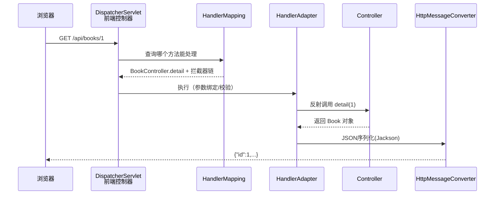
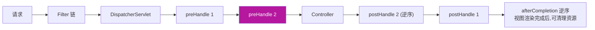

# 07 Spring MVC

> 前置知识：[[java/3工程化/06_Spring Boot快速开发|Spring Boot快速开发]]。本章聚焦 Web 层的完整工程化：请求处理流程、参数接收、统一响应、全局异常、拦截器与 RESTful 规范。

---

## 一、MVC 架构模式与请求处理流程

MVC 把 Web 层拆成三块：Model（数据）、View（视图）、Controller（调度）。前后端分离时代 View 退化为 JSON 序列化，但 DispatcherServlet 的核心流程不变：



各组件一句话：

- **DispatcherServlet**：所有请求的唯一入口（前端控制器模式）；
- **HandlerMapping**：URL 到处理方法的路由表；
- **HandlerAdapter**：真正执行方法并完成参数解析、返回值转换；
- **HttpMessageConverter**：对象与 JSON 的互转（默认 Jackson）。

对比 Python：Flask 是轻量路由+函数，Django 自带 ORM/Admin 全家桶；Spring MVC 处于中间——容器生态强、约定明确、扩展点多，学习曲线居中。

---

## 二、@Controller 与 @RestController

```java
@Controller                    // 方法返回值被解析为视图名
public class PageController {
    @GetMapping("/login")
    public String loginPage() {
        return "login";        // 跳转到 login.html / 模板
    }
}

@RestController                // = @Controller + @ResponseBody
public class ApiController {   // 所有方法返回值直接写响应体(JSON)
    ...
}
```

前后端分离项目一律 @RestController；传统模板渲染（Thymeleaf）才用 @Controller。

---

## 三、九种参数接收方式

```java
@RestController
@RequestMapping("/demo")
public class ParamController {

    /** 1. @RequestParam：查询串 ?page=2&size=10 */
    @GetMapping("/list")
    public String list(@RequestParam(defaultValue = "1") int page,
                       @RequestParam(required = false) String keyword) {
        return "page=" + page;
    }

    /** 2. @PathVariable：路径变量 /users/42 */
    @GetMapping("/users/{id}")
    public String path(@PathVariable Long id) {
        return "id=" + id;
    }

    /** 3. @RequestBody：JSON 请求体 -> 对象（POST/PUT 常用） */
    @PostMapping("/json")
    public String json(@RequestBody UserDto user) {
        return user.getName();
    }

    /** 4. @RequestHeader：请求头 */
    @GetMapping("/header")
    public String header(@RequestHeader("User-Agent") String ua) {
        return ua;
    }

    /** 5. @CookieValue：Cookie */
    @GetMapping("/cookie")
    public String cookie(@CookieValue(value = "token", required = false) String token) {
        return String.valueOf(token);
    }

    /** 6. POJO 自动绑定：查询串字段名自动匹配 setter（无注解） */
    @GetMapping("/search")
    public String search(UserDto cond) {   // ?name=张三&age=20 自动填充
        return cond.getName();
    }

    /** 7. 数组接收：?ids=1,2,3 或 ?ids=1&ids=2 */
    @GetMapping("/ids")
    public String ids(@RequestParam List<Long> ids) {
        return ids.toString();
    }

    /** 8. Map 接收动态键值 */
    @GetMapping("/map")
    public String map(@RequestParam Map<String, String> all) {
        return all.toString();
    }

    /** 9. HttpServletRequest：原生 API 兜底（尽量少用） */
    @GetMapping("/raw")
    public String raw(HttpServletRequest request) {
        return request.getRemoteAddr();
    }
}
```

选型口诀：**GET 用 @RequestParam/@PathVariable，POST 用 @RequestBody，表单提交用 POJO 绑定**。

---

## 四、JSON 返回与 Jackson 定制

```yaml
spring:
  jackson:
    date-format: yyyy-MM-dd HH:mm:ss     # Date 类型格式
    time-zone: Asia/Shanghai
    default-property-inclusion: non_null # null 字段不输出
```

```java
// 精细控制用注解打在实体字段上
public class BookDto {
    private Long id;

    // 日期字段局部定制（LocalDateTime 推荐 ISO 格式）
    @JsonFormat(pattern = "yyyy-MM-dd HH:mm:ss", timezone = "GMT+8")
    private LocalDateTime createdAt;

    @JsonProperty("book_title")          // 输出字段改名
    private String title;

    @JsonIgnore                          // 敏感字段永不输出
    private String secretKey;
}
```

---

## 五、统一响应封装 Result<T>

裸返实体的问题：前端无法区分业务成功失败、缺少提示信息。规范做法是统一信封：

```java
/**
 * 统一响应结构：{"code":0,"message":"ok","data":{...}}
 * code=0 表示成功，非 0 为各类业务错误码
 */
public class Result<T> {
    private int code;
    private String message;
    private T data;

    public static <T> Result<T> ok(T data) {
        Result<T> r = new Result<>();
        r.code = 0; r.message = "ok"; r.data = data;
        return r;
    }

    public static <T> Result<T> fail(int code, String message) {
        Result<T> r = new Result<>();
        r.code = code; r.message = message;
        return r;
    }

    public int getCode() { return code; }
    public String getMessage() { return message; }
    public T getData() { return data; }
}
```

配合全局异常处理后，Controller 只写正常逻辑，错误分支全部收敛到一处。

---

## 六、全局异常处理

```java
/**
 * @RestControllerAdvice：拦截所有 Controller 抛出的异常
 * 业务代码里尽管抛异常，这里统一转成 Result 信封
 */
@RestControllerAdvice
public class GlobalExceptionHandler {

    /** 业务异常：自定义异常类，携带错误码 */
    @ExceptionHandler(BizException.class)
    public Result<Void> handleBiz(BizException e) {
        return Result.fail(e.getCode(), e.getMessage());
    }

    /** 参数校验异常：提取第一条友好提示 */
    @ExceptionHandler(MethodArgumentNotValidException.class)
    public Result<Void> handleValid(MethodArgumentNotValidException e) {
        String msg = e.getBindingResult().getFieldErrors().stream()
                .map(f -> f.getField() + ": " + f.getDefaultMessage())
                .findFirst().orElse("参数错误");
        return Result.fail(400, msg);
    }

    /** 兜底：未知异常不向外暴露堆栈细节 */
    @ExceptionHandler(Exception.class)
    public Result<Void> handleOther(Exception e) {
        log.error("未预期异常", e);            // 服务端留全量日志
        return Result.fail(500, "系统繁忙，请稍后再试");  // 对外只给笼统话术
    }
}
```

配套的自定义业务异常：

```java
/** 业务异常：code 用于前端识别场景 */
public class BizException extends RuntimeException {
    private final int code;
    public BizException(int code, String message) {
        super(message);
        this.code = code;
    }
    public int getCode() { return code; }
}
```

---

## 七、拦截器 Interceptor：登录校验实战

拦截器 vs 过滤器：Filter 是 Servlet 规范、在 DispatcherServlet 之前执行，适合编码/跨域等底层处理；Interceptor 是 Spring 提供、能拿到 handler 信息，适合鉴权、日志、埋点。



登录校验实现：

```java
/**
 * 登录拦截器：白名单外全部要求携带有效 token
 */
@Component
public class LoginInterceptor implements HandlerInterceptor {

    @Override
    public boolean preHandle(HttpServletRequest req,
                             HttpServletResponse resp,
                             Object handler) throws Exception {
        // 静态资源/预检请求直接放行
        if (!(handler instanceof HandlerMethod)) return true;

        String token = req.getHeader("Authorization");
        if (token == null || !JwtUtil.verify(token)) {
            resp.setStatus(401);
            resp.setContentType("application/json;charset=UTF-8");
            resp.getWriter().write("{\"code\":401,\"message\":\"请先登录\"}");
            return false;                       // 中断后续执行
        }
        // 校验通过后把用户信息放进 ThreadLocal 供下游使用
        UserContext.set(JwtUtil.parse(token));
        return true;
    }

    @Override
    public void afterCompletion(HttpServletRequest req, HttpServletResponse resp,
                                Object handler, Exception ex) {
        UserContext.clear();                    // 必须清理防止线程池复用导致串号
    }
}

@Configuration
public class WebConfig implements WebMvcConfigurer {
    private final LoginInterceptor loginInterceptor;

    public WebConfig(LoginInterceptor loginInterceptor) {
        this.loginInterceptor = loginInterceptor;
    }

    @Override
    public void addInterceptors(InterceptorRegistry registry) {
        registry.addInterceptor(loginInterceptor)
                .addPathPatterns("/**")                 // 先拦全部
                .excludePathPatterns("/api/auth/login", // 再放行白名单
                                     "/api/auth/register",
                                     "/error");
    }
}
```

踩坑记录：ThreadLocal 在线程池环境必须 afterCompletion 里 clear，否则上一个用户的身份会"漂移"给下一个请求——典型的越权事故来源。

---

## 八、文件上传 MultipartFile

```java
@RestController
@RequestMapping("/api/files")
public class FileController {
    private final UploadProperties props;   // 第六章的配置绑定对象

    public FileController(UploadProperties props) { this.props = props; }

    /** POST multipart/form-data，表单字段名 file */
    @PostMapping
    public Result<String> upload(@RequestParam("file") MultipartFile file)
            throws IOException {
        if (file.isEmpty()) return Result.fail(400, "文件为空");
        // 校验大小（也可用 yml: spring.servlet.multipart.max-file-size）
        if (file.getSize() > props.getMaxSizeMb() * 1024L * 1024L)
            return Result.fail(400, "超过大小限制");
        // 校验扩展名白名单：绝不信任原始文件名
        String ext = StringUtils.getFilenameExtension(file.getOriginalFilename());
        if (ext == null || !props.getAllowedExt().contains(ext.toLowerCase()))
            return Result.fail(400, "不支持的文件类型");

        // 存储文件名用 UUID 防碰撞与路径穿越
        Path target = Path.of(props.getDir(),
                UUID.randomUUID() + "." + ext);
        Files.createDirectories(target.getParent());
        file.transferTo(target);
        return Result.ok(target.getFileName().toString());
    }
}
```

安全要点：白名单扩展、UUID 重命名、存储目录不可执行——上传漏洞是 Web 安全重灾区。

---

## 九、跨域 CORS 三种方案

浏览器同源策略下，前端 localhost:5173 调后端 localhost:8080 就是跨域。三种方案按场景选：

```java
// 方案一：@CrossOrigin 注解，粒度到类/方法，适合临时调试
@CrossOrigin(origins = "http://localhost:5173")
@RestController
public class TempController {}

// 方案二：全局配置（推荐），WebMvcConfigurer 统一声明
@Configuration
public class CorsConfig implements WebMvcConfigurer {
    @Override
    public void addCorsMappings(CorsRegistry registry) {
        registry.addMapping("/api/**")
                .allowedOriginPatterns("*")   // 生产改为具体域名列表
                .allowedMethods("GET", "POST", "PUT", "DELETE", "OPTIONS")
                .allowCredentials(true)       // 允许携带 Cookie 时 origin 不能为 *
                .maxAge(3600);                // 预检结果缓存1小时
    }
}

// 方案三：CorsFilter Bean，优先级最高，
// 适合"被 Spring Security 过滤器抢先拦掉 OPTIONS"的场景（见下一章）
@Bean
public CorsFilter corsFilter() {
    CorsConfiguration cfg = new CorsConfiguration();
    cfg.addAllowedOriginPattern("*");
    cfg.addAllowedMethod("*");
    cfg.addAllowedHeader("*");
    UrlBasedCorsConfigurationSource src = new UrlBasedCorsConfigurationSource();
    src.registerCorsConfiguration("/**", cfg);
    return new CorsFilter(src);
}
```

踩坑记录：配了方案二还是报跨域？大概率项目里还有 Spring Security——它的过滤器链在 MVC 层之前，OPTIONS 预检请求先被 401 了，必须用方案三或把 CORS 配进 Security 的 http.cors()。

---

## 十、RESTful API 设计规范

| 动作 | HTTP 方法 + URL | 状态码 |
|------|-----------------|--------|
| 查询列表 | GET /api/books?page=1 | 200 |
| 查看详情 | GET /api/books/42 | 200 / 404 |
| 新增 | POST /api/books | 201 |
| 全量更新 | PUT /api/books/42 | 200 |
| 删除 | DELETE /api/books/42 | 204 |

原则速记：

- **URL 是名词复数**，动作交给方法语义：`GET /users/42/orders`（用户 42 的订单）；
- **状态码表达结果**：2xx 成功、4xx 客户端错、5xx 服务端错；401 未登录、403 无权限、404 不存在、422 参数校验失败；
- **过滤分页排序走查询串**：`?page=1&size=20&sort=createdAt,desc&status=on_sale`；
- 版本前缀 `/api/v1/...`，破坏性变更开 v2 而不是改 v1。

---

## 十一、Swagger/OpenAPI3 文档

springdoc 自动扫描 Controller 生成在线文档：

```xml
<dependency>
    <groupId>org.springdoc</groupId>
    <artifactId>springdoc-openapi-starter-webmvc-ui</artifactId>
    <version>2.6.0</version>
</dependency>
```

```java
@Tag(name = "图书管理")                       // 控制器分组命名
@RestController
@RequestMapping("/api/books")
public class BookController {

    @Operation(summary = "图书详情", description = "不存在时返回404")
    @GetMapping("/{id}")
    public Result<Book> detail(
            @Parameter(description = "图书ID") @PathVariable Long id) {
        ...
    }
}
```

启动后访问 `http://localhost:8080/swagger-ui.html` 即可在线调试全部接口，`/v3/api-docs` 输出机器可读 JSON 可导入 Apifox/Postman。文档即代码，接口变更文档同步更新，告别手写 wiki。

---

## 十二、实战：完善图书 API 为完整 RESTful

在第六章基础上补齐三件套：统一响应 + 全局异常 + 登录拦截。

第一步，改造 Controller 返回 Result 信封并加校验：

```java
@RestController
@RequestMapping("/api/books")
@Tag(name = "图书管理")
public class BookControllerV2 {
    private final BookService service;

    public BookControllerV2(BookService service) { this.service = service; }

    @PostMapping
    @ResponseStatus(HttpStatus.CREATED)
    public Result<Book> create(@RequestBody @Validated BookReq req) {
        return Result.ok(service.create(req));
    }

    @GetMapping("/{id}")
    public Result<Book> detail(@PathVariable Long id) {
        return Result.ok(service.detail(id));
    }

    @DeleteMapping("/{id}")
    @ResponseStatus(HttpStatus.NO_CONTENT)
    public void delete(@PathVariable Long id) {
        service.delete(id);
    }
}

/** 入参 DTO + 校验注解：错误由 GlobalExceptionHandler 收口 */
public class BookReq {
    @NotBlank(message = "书名不能为空")
    private String title;

    @NotBlank
    private String author;

    @DecimalMin(value = "0.0", inclusive = false, message = "价格必须为正数")
    private BigDecimal price;
    // getter/setter 省略
}
```

第二步，Service 抛业务异常替代裸 IllegalArgumentException：

```java
public Book detail(Long id) {
    return repo.findById(id).orElseThrow(
            () -> new BizException(40401, "图书不存在"));   // 业务码 404xx 系列
}
```

第三步，登录拦截器挂载（第七节代码）+ 白名单放行 GET 类查询接口，写操作要求登录。验证矩阵：

```bash
# 未带 token 写入 -> 401
curl -X POST localhost:8080/api/books -H 'Content-Type: application/json' \
     -d '{"title":"x","author":"y","price":1}'
# {"code":401,"message":"请先登录"}

# 带合法 token -> 201
curl -X POST localhost:8080/api/books \
     -H 'Content-Type: application/json' \
     -H 'Authorization: eyJhbGciOi...' \
     -d '{"title":"Java并发编程","author":"Brian Goetz","price":99.00}'

# 参数校验失败 -> code=400 与字段提示
curl -X POST localhost:8080/api/books -H 'Authorization: eyJ...' \
     -H 'Content-Type: application/json' -d '{"title":"","author":"a","price":-1}'

# 打开 swagger-ui.html 目视化检查全部端点
```

---

## 小结

- DispatcherServlet → HandlerMapping → HandlerAdapter 的流程链是理解一切 Web 配置的地基；
- 参数九式各司其职：GET 用 Param/Path，POST 用 Body，表单用 POJO；
- Result 信封 + @RestControllerAdvice 让错误处理一处收口；
- 拦截器做鉴权记得 ThreadLocal 清理；CORS 在有 Security 时要用过滤器级方案；
- RESTful 的本质是用 URL 名词化 + 方法语义 + 状态码表达完整协议。

下一章数据持久层另一条路线：[[java/3工程化/08_Spring Data JPA|Spring Data JPA]]。
