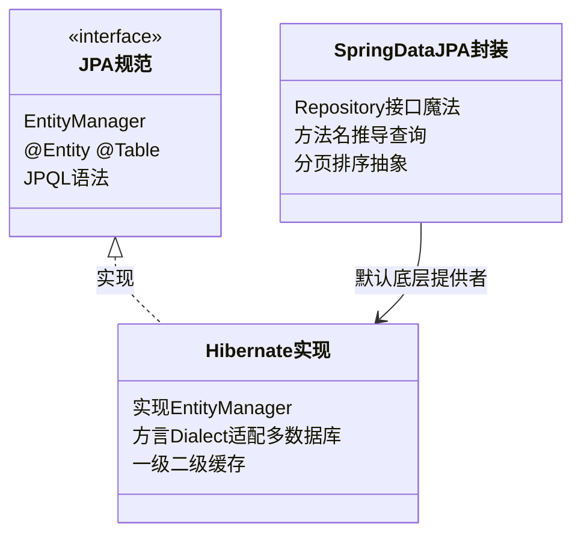

# 08 Spring Data JPA

> 前置知识：[[java/3工程化/04_MyBatis|MyBatis]]（对比视角）、[[java/3工程化/05_Spring IoC与AOP|Spring IoC与AOP]]。本章讲透 JPA 的三层关系、关联映射与 N+1 这个性能头号杀手。

---

## 一、JPA / Hibernate / Spring Data JPA 三层关系

新手最容易混的三个名词，用类图理清：



一句话：**JPA 是规范（接口），Hibernate 是实现，Spring Data JPA 是在规范之上再包一层"Repository 魔法"**。所以你写的接口没有实现类却能工作——Spring 在启动时为它生成动态代理。

---

## 二、快速上手

依赖（Boot 项目一个 starter 搞定）：

```xml
<dependency>
    <groupId>org.springframework.boot</groupId>
    <artifactId>spring-boot-starter-data-jpa</artifactId>
</dependency>
<dependency>
    <groupId>com.mysql</groupId>
    <artifactId>mysql-connector-j</artifactId>
    <scope>runtime</scope>
</dependency>
```

```yaml
spring:
  datasource:
    url: jdbc:mysql://localhost:3306/shop?useSSL=false&serverTimezone=Asia/Shanghai
    username: root
    password: "123456"
  jpa:
    hibernate:
      ddl-auto: update   # 开发期自动建表；生产一律 none，用 Flyway 管理表结构
    show-sql: true
    open-in-view: false  # 关闭OSIV：避免事务外懒加载引发连接占用与隐藏N+1
```

### 2.1 实体映射注解

```java
import jakarta.persistence.*;
import java.math.BigDecimal;
import java.time.LocalDateTime;

@Entity                          // 声明为JPA实体，默认表名=类名
@Table(name = "t_order")         // 显式指定表名
public class Order {

    /** 主键策略四种 */
    @Id
    // IDENTITY: 数据库自增(MySQL常用)
    @GeneratedValue(strategy = GenerationType.IDENTITY)
    private Long id;

    @Column(name = "order_no", nullable = false, unique = true, length = 32)
    private String orderNo;      // 列名/非空/唯一/长度

    @Enumerated(EnumType.STRING) // 枚举存字符串!ORDINAL存下标是事故之源(插入新枚举值全乱)
    private OrderStatus status = OrderStatus.CREATED;

    @Column(precision = 10, scale = 2)
    private BigDecimal amount;   // 金额精度控制

    @Transient                   // 不映射到数据库的字段
    private transient int retryCount;

    @Column(name = "created_at", updatable = false)
    private LocalDateTime createdAt;

    public enum OrderStatus { CREATED, PAID, SHIPPED, CLOSED }
}
```

主键策略速查：

| 策略 | 机制 | 适用 |
|------|------|------|
| IDENTITY | 数据库自增列 | MySQL 首选 |
| SEQUENCE | 数据库序列 | Oracle/PG |
| TABLE | 用一张表模拟序列 | 兼容但性能差 |
| AUTO | 由方言自动选 | 可移植优先 |

### 2.2 Repository 接口

```java
public interface OrderRepository extends JpaRepository<Order, Long> {
}
// 就这么点代码，save/findById/findAll/deleteById/count 全部就绪
```

---

## 三、方法名推导查询

Spring 解析方法名生成 SQL 的规则表：

| 方法名示例 | 生成的条件 |
|-----------|-----------|
| findByOrderNo | WHERE order_no = ? |
| findByStatusAndAmountGreaterThan(status, amt) | status=? AND amount>? |
| findByStatusOrUserId(status, uid) | status=? OR user_id=? |
| findByCreatedAtBetween(start, end) | created_at BETWEEN ? AND ? |
| findByTitleLike(pattern) | title LIKE ?（自己拼 %） |
| findByTitleContaining(kw) | title LIKE %kw%（自动加%） |
| findByStatusIn(Collection) | status IN (...) |
| findByStatusIsNull() | status IS NULL |
| findFirst5ByStatusOrderByCreatedAtDesc | TOP 5 + ORDER BY |

```java
public interface OrderRepository extends JpaRepository<Order, Long> {
    List<Order> findByUserIdAndStatus(Long userId, Order.OrderStatus status);
    Page<Order> findByStatus(Order.OrderStatus status, Pageable pageable);
}
```

经验法则：**两三个条件以内方法名可读性好；再多就改用 @Query**，否则方法名长到离谱且重构困难。

---

## 四、@Query：JPQL 与原生 SQL

```java
public interface OrderRepository extends JpaRepository<Order, Long> {

    /** JPQL：面向实体和属性名，不写表名列名；参数绑定防注入 */
    @Query("SELECT o FROM Order o WHERE o.userId = :uid AND o.status = :st")
    List<Order> findUserOrders(@Param("uid") Long uid,
                               @Param("st") Order.OrderStatus st);

    /** 更新语句必须配事务注解 */
    @Modifying
    @Query("UPDATE Order o SET o.status = :st WHERE o.id = :id")
    int updateStatus(@Param("id") Long id, @Param("st") Order.OrderStatus st);

    /** 原生SQL：复杂统计场景（注意返回投影） */
    @Query(value = "SELECT user_id, SUM(amount) AS total FROM t_order " +
                   "WHERE created_at >= :start GROUP BY user_id " +
                   "HAVING total >= :minTotal", nativeQuery = true)
    List<Object[]> sumByUser(@Param("start") LocalDateTime start,
                             @Param("minTotal") BigDecimal minTotal);
}
```

JPQL vs native 选择：能 JPQL 就 JPQL（换库无痛、编译期无字符串表名错误）；涉及数据库特有函数、超复杂报表再降级原生 SQL。

---

## 五、分页与排序

```java
/** Pageable 统一抽象：页码从0开始！ */
public Page<Order> pagePaidOrders(int pageNum, int pageSize) {
    Pageable pageable = PageRequest.of(pageNum - 1, pageSize,          // 转成0基
            Sort.by(Sort.Direction.DESC, "createdAt"));
    return orderRepository.findByStatus(Order.OrderStatus.PAID, pageable);
}

// 返回的 Page 携带全部元信息，前端分页组件直接用
page.getContent();     // 当前页数据
page.getTotalElements();  // 总条数
page.getTotalPages();     // 总页数
```

踩坑记录：JPA 分页会自动发一条 count SQL；大表 count 很慢时，可改返回 Slice（只判断 hasNext 不查总数）或手写优化版 count。

---

## 六、关联映射四大种

以用户-订单（一对多）为主线：

```java
@Entity
@Table(name = "t_user")
public class User {
    @Id @GeneratedValue(strategy = GenerationType.IDENTITY)
    private Long id;
    private String username;

    /** 一对多：用户拥有多个订单 */
    // mappedBy: 外键维护权在对方(order.user)，本方只做反向读取
    // cascade: 保存用户级联保存订单(慎用REMOVE/ALL，删用户删订单常不是想要的语义)
    // fetch: 一对多默认LAZY，保持懒加载
    @OneToMany(mappedBy = "user", cascade = CascadeType.PERSIST, fetch = FetchType.LAZY)
    private List<Order> orders = new ArrayList<>();
}

@Entity
@Table(name = "t_order")
public class Order {
    @Id @GeneratedValue(strategy = GenerationType.IDENTITY)
    private Long id;

    /** 多对一：订单属于某用户。外键真正所在方 */
    // 多对一默认EAGER，强烈建议显式改LAZY
    @ManyToOne(fetch = FetchType.LAZY)
    @JoinColumn(name = "user_id")       // 数据库外键列名
    private User user;
}
```

四种关系速记：

| 注解 | 场景 | 默认 fetch | 建议 |
|------|------|-----------|------|
| @ManyToOne | 多对一 | EAGER | 显式改 LAZY |
| @OneToMany | 一对多 | LAZY | 保持 LAZY |
| @OneToOne | 一对一（共享主键或外键） | EAGER | 改 LAZY |
| @ManyToMany | 多对多（中间表自动生成） | LAZY | 复杂场景建议拆两个一对多+中间实体 |

### N+1 问题（性能头号杀手）

查询 10 个订单，随后逐个访问 user 触发 10 条额外 SQL——1 + N 条：

```text
SELECT * FROM t_order LIMIT 10;      -- 1条
SELECT * FROM t_user WHERE id=1;     -- N条循环开始
SELECT * FROM t_user WHERE id=2;     -- ...
...共 11 条 SQL，列表页直接慢一个数量级
```

三种解法：

```java
// 解法一：JOIN FETCH 在 JPQL 里一次联表取回（首选）
@Query("SELECT DISTINCT o FROM Order o JOIN FETCH o.user WHERE o.status = :st")
List<Order> findWithUser(@Param("st") Order.OrderStatus st);

// 解法二：@EntityGraph 按需声明抓取路径，免写JPQL
@EntityGraph(attributePaths = {"user"})
Page<Order> findByStatus(Order.OrderStatus status, Pageable pageable);

// 解法三：批量抓取 @BatchSize(size=20)，把N条IN合并成少量批次SQL
// 全局配置: spring.jpa.properties.hibernate.default_batch_fetch_size=20
```

排查手段：show-sql 开着 + p6spy 格式化日志；接口响应突然变慢先数 SQL 条数。

---

## 七、审计字段

created_at / updated_at 这类公共字段交给框架自动填充：

```java
// 1. 实体实现 Auditable 或加注解
@EntityListeners(AuditingEntityListener.class)   // 挂上审计监听
@MappedSuperclass                                 // 公共父类，不建表
public abstract class BaseEntity {
    @CreatedDate
    @Column(updatable = false)
    private LocalDateTime createdAt;

    @LastModifiedDate
    private LocalDateTime updatedAt;

    @CreatedBy
    private String createdBy;

    @LastModifiedBy
    private String modifiedBy;
}

// 2. 启动类开启审计
@Configuration
@EnableJpaAuditing
public class JpaAuditConfig implements AuditorAware<String> {
    @Override
    public Optional<String> getCurrentAuditor() {
        // 从登录上下文取当前操作人（配合拦截器的 ThreadLocal）
        return Optional.ofNullable(UserContext.currentUsername())
                       .or(() -> Optional.of("system"));
    }
}
```

实体继承 BaseEntity 即获得四个审计字段全自动维护。

---

## 八、事务：@Transactional 深入

### 8.1 只读与回滚规则

```java
@Service
public class OrderService {

    /** 只读事务：驱动层可做优化(不脏检查/只读路由到从库) */
    @Transactional(readOnly = true)
    public Order detail(Long id) { return repo.findById(id).orElseThrow(); }

    /** 写事务：rollbackFor 必须养习惯——默认只回滚RuntimeException/Error */
    @Transactional(rollbackFor = Exception.class)
    public Order pay(Long orderId) {
        Order order = detail(orderId);           // 同类调用走的是代理吗?见下方大坑
        if (order.getStatus() != Order.OrderStatus.CREATED)
            throw new BizException(40002, "订单状态不允许支付");
        order.setStatus(Order.OrderStatus.PAID);
        accountService.deduct(order.getUserId(), order.getAmount()); // 另一个Bean的事务
        return orderRepo.save(order);            // 脏检查下也会自动flush,save可省
    }
}
```

### 8.2 七种传播行为

| 传播行为 | 行为 | 典型场景 |
|----------|------|----------|
| REQUIRED（默认） | 有事务加入，没有就新建 | 绝大多数业务方法 |
| REQUIRES_NEW | 挂起当前事务，开独立新事务 | 操作日志必须独立提交，不受主流程回滚影响 |
| NESTED | 嵌套事务，保存点机制 | 主流程失败全滚，子流程失败部分滚 |
| SUPPORTS | 有就加入，没有就非事务执行 | 纯读且不强求事务的方法 |
| NOT_SUPPORTED | 挂起事务，非事务执行 | 大批量导出不想要长事务 |
| MANDATORY | 强制要求已有事务，否则报错 | 被内部调用的基础方法 |
| NEVER | 有事务反而报错 | 极少用 |

记忆主线是前三行：REQUIRED 是默认，REQUIRES_NEW 解决"日志不能跟着主事务一起回滚"，NESTED 解决"部分回滚"。

### 8.3 隔离级别与失效场景

```java
@Transactional(isolation = Isolation.READ_COMMITTED)   // MySQL默认REPEATABLE_READ，
                                                       // 一般跟随数据库默认即可
```

隔离级别与脏读/幻读的原理详见 [[数据库/mysql/04-索引事务与优化|MySQL索引事务与优化]]。

**@Transactional 三大失效场景**（面试与事故双高频）：

1. **同类自调用**：`this.pay()` 不经过代理，注解无效——拆 Bean 或注入自己；
2. **方法非 public**：代理无法增强；
3. **异常被 catch 吞掉**：事务感知不到，照常提交。

---

## 九、Specifications 动态查询

JPA 版的"动态条件拼接"，对应 MyBatis 的动态 SQL：

```java
public interface OrderRepository
        extends JpaRepository<Order, Long>, JpaSpecificationExecutor<Order> {}

/** 组装动态条件的查询服务 */
public List<Order> search(Long userId, Order.OrderStatus status,
                          BigDecimal minAmount) {
    Specification<Order> spec = (root, query, cb) -> {
        List<Predicate> ps = new ArrayList<>();
        if (userId != null)
            ps.add(cb.equal(root.get("userId"), userId));
        if (status != null)
            ps.add(cb.equal(root.get("status"), status));
        if (minAmount != null)
            ps.add(cb.greaterThan(root.get("amount"), minAmount));
        // 动态拼接 AND，空条件则查全部
        return cb.and(ps.toArray(new Predicate[0]));
    };
    return orderRepository.findAll(spec);
}
```

适合后台管理页那种十来个可选筛选条件的列表；条件再多建议上 QueryDSL（类型更安全）。

---

## 十、MyBatis vs JPA 选型决策表

| 维度 | MyBatis | Spring Data JPA |
|------|---------|-----------------|
| SQL 控制力 | 完全掌控 | 黑盒生成，复杂查询要绕 |
| 单表 CRUD 效率 | 需 MP 增强 | 天然零代码 |
| 学习曲线 | 低（会 SQL 就行） | 中高（持久化上下文概念多） |
| 性能调优直观性 | 直接改 SQL | 要懂 N+1/缓存/脏检查 |
| 团队现状（国内互联网） | 绝对主流 | 中小项目/海外常见 |
| 快速原型 | 一般 | 极快 |

结论：**国内企业项目默认 MyBatis(+Plus)；海外项目、领域模型清晰的中型系统、快速验证型产品选 JPA**。两者都值得掌握，切换成本主要在思维而非语法。

---

## 十一、实战：订单-用户一对多完整建模

```java
// ===== 用户实体 =====
@Entity
@Table(name = "t_user")
@EntityListeners(AuditingEntityListener.class)
public class User extends BaseEntity {
    @Id @GeneratedValue(strategy = GenerationType.IDENTITY)
    private Long id;

    @Column(nullable = false, unique = true, length = 50)
    private String username;

    @OneToMany(mappedBy = "user", cascade = CascadeType.PERSIST)
    private List<Order> orders = new ArrayList<>();

    /** 业务方法维护双向关联，避免两边不一致 */
    public void addOrder(Order order) {
        orders.add(order);
        order.setUser(this);
    }
}

// ===== 订单实体 =====
@Entity
@Table(name = "t_order")
@EntityListeners(AuditingEntityListener.class)
public class Order extends BaseEntity {
    @Id @GeneratedValue(strategy = GenerationType.IDENTITY)
    private Long id;

    @Column(unique = true)
    private String orderNo;

    @ManyToOne(fetch = FetchType.LAZY)
    @JoinColumn(name = "user_id")
    private User user;

    private BigDecimal amount;

    @Enumerated(EnumType.STRING)
    private Order.OrderStatus status = Order.OrderStatus.CREATED;
}

// ===== Repository：含 JOIN FETCH 与分页 =====
public interface OrderRepository extends JpaRepository<Order, Long> {

    @Query("SELECT o FROM Order o JOIN FETCH o.user WHERE o.user.id = :uid")
    List<Order> findOrdersWithUser(@Param("uid") Long uid);

    Page<Order> findByUserId(Long uid, Pageable pageable);
}

// ===== Service：事务边界与业务校验 =====
@Service
public class OrderService {
    private final UserRepository users;
    private final OrderRepository orders;

    public OrderService(UserRepository users, OrderRepository orders) {
        this.users = users;
        this.orders = orders;
    }

    /** 下单：同一事务内完成用户关联与订单落库 */
    @Transactional(rollbackFor = Exception.class)
    public Order place(Long userId, BigDecimal amount) {
        User user = users.findById(userId)
                .orElseThrow(() -> new BizException(40401, "用户不存在"));
        Order order = new Order();
        order.setOrderNo("SO" + System.currentTimeMillis());
        order.setAmount(amount);
        user.addOrder(order);                 // 双向关联由实体方法统一维护
        return orders.save(order);
    }

    /** 用户订单列表：JOIN FETCH 避免 N+1 */
    @Transactional(readOnly = true)
    public List<Order> userOrders(Long userId) {
        return orders.findOrdersWithUser(userId);
    }
}
```

验收清单：下单后 t_order 表 user_id 正确外键关联；userOrders 控制台只有一条 JOIN SQL；支付状态流转在事务内完成；故意抛异常验证整体回滚。

---

## 小结

- 三层关系：JPA 规范 → Hibernate 实现 → Spring Data JPA 封装；
- 方法名推导管简单查询，@Query 管 JPQL 与原生 SQL，Specification 管动态条件；
- 关联映射四件套中 @ManyToOne 最常用，fetch 一律显式 LAZY；
- N+1 用 JOIN FETCH / @EntityGraph / batch fetch 三招化解；
- @Transactional 记牢传播行为前三名与三大失效场景；
- 选型：国内偏 MyBatis，JPA 适合模型清晰的中小项目。

下一章给应用加上门禁：[[java/3工程化/09_Spring Security|Spring Security]]。
