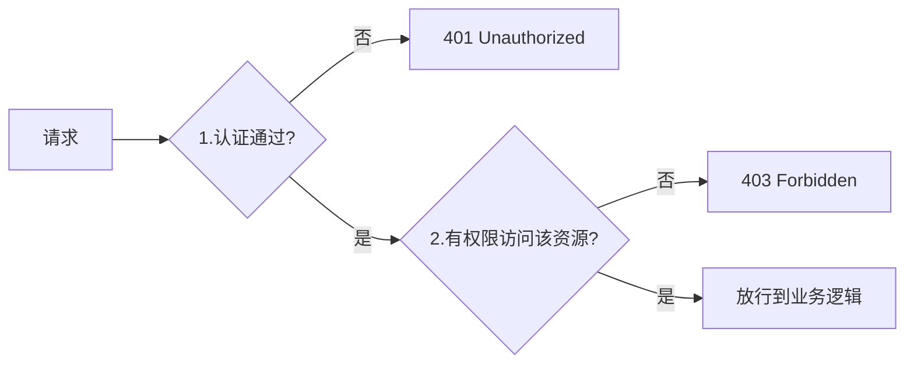
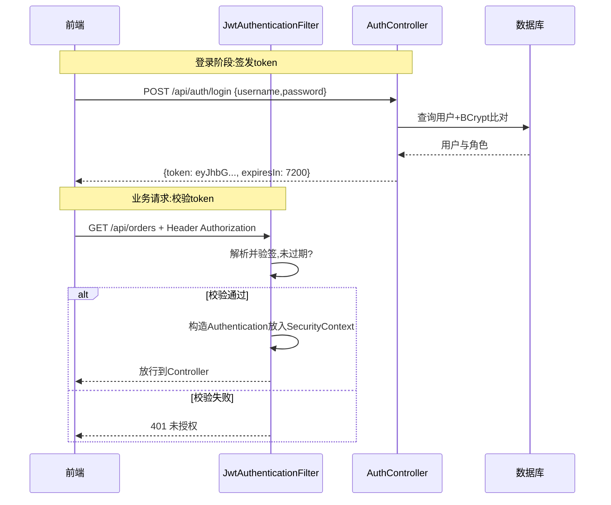
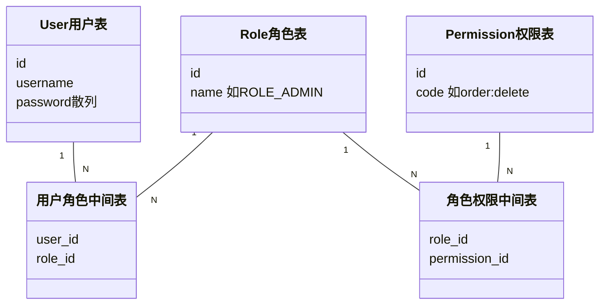
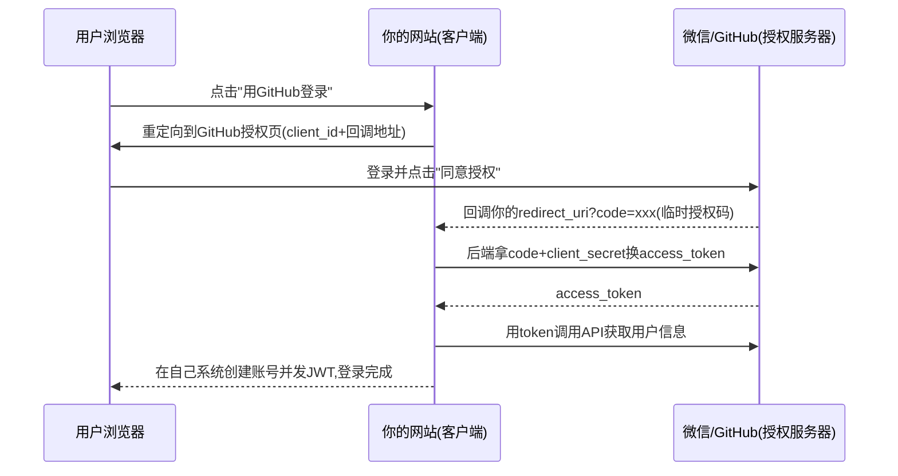

# 09 Spring Security

> 前置知识：[[java/3工程化/07_Spring MVC|Spring MVC]]（拦截器/过滤器）、[[java/3工程化/05_Spring IoC与AOP|Spring IoC与AOP]]。安全框架的每个细节都关乎线上事故，本章所有示例按"能直接跑"标准写。

---

## 一、认证与授权：两个必须分清的概念

- **认证（Authentication）**：你是谁？——账号密码、短信验证码、指纹、第三方 OAuth 登录；
- **授权（Authorization）**：你能干什么？——普通用户不能进后台，管理员才能删数据。



记住状态码语义：**401 = 没登录或凭证失效，403 = 登录了但没权限**。

---

## 二、过滤器链架构

Spring Security 的本质是一条 Servlet Filter 链，15+ 个安全过滤器依次过手：

```mermaid
flowchart TD
    REQ["HTTP请求"] --> CORS["CorsFilter"]
    CORS --> CSRF["CsrfFilter"]
    CSRF --> JWTB["JwtAuthenticationFilter(自定义)"]
    JWTB --> UPAF["UsernamePasswordAuthenticationFilter<br/>处理表单登录"]
    UPAF --> EHC["ExceptionTranslationFilter<br/>捕获后续安全异常转401/403"]
    EHC -> FSI["AuthorizationFilter<br/>逐条比对授权规则"]
    FSI --> CTRL["Controller"]

    style UPAF fill:#2d6a4f,color:#fff
```

要点：

- **UsernamePasswordAuthenticationFilter** 是表单登录的入口；前后端分离项目通常用自定义 JWT 过滤器插到它之前；
- **ExceptionTranslationFilter** 把未认证转 401、无权限转 403；
- 每个 Filter 都可配置启用与否——CSRF 关不开关就在这里决定（见第九节）。

---

## 三、快速上手：加依赖即被锁

```xml
<dependency>
    <groupId>org.springframework.boot</groupId>
    <artifactId>spring-boot-starter-security</artifactId>
</dependency>
```

启动后神奇的事情发生了：

1. 所有接口瞬间返回 401，一个都不放过；
2. 控制台打印 `Using generated security password: xxxx-xxxx`——随机密码；
3. 默认用户名 `user`，且自带 /login 表单页。

这就是 Boot 自动配置的默认安全策略："先全部锁死"。生产思路正是从这里出发逐步放宽 + 替换真实用户体系。

---

## 四、HttpSecurity 配置 DSL 与内存用户

开发期先用配置类理清结构：

```java
@Configuration
@EnableWebSecurity
public class SecurityConfig {

    /** 密码编码器：BCrypt 自带随机盐，绝不明文存库 */
    @Bean
    public PasswordEncoder passwordEncoder() {
        return new BCryptPasswordEncoder();
    }

    /** 内存用户：仅用于演示和测试环境 */
    @Bean
    public UserDetailsService userDetailsService(PasswordEncoder encoder) {
        UserDetails admin = User.builder()
                .username("admin")
                .password(encoder.encode("admin123"))   // 存的是BCrypt散列
                .roles("ADMIN")                          // 角色自动加ROLE_前缀
                .build();
        UserDetails user = User.builder()
                .username("tom")
                .password(encoder.encode("tom123"))
                .roles("USER")
                .build();
        return new InMemoryUserDetailsManager(admin, user);
    }

    /** 核心授权规则 */
    @Bean
    public SecurityFilterChain filterChain(HttpSecurity http) throws Exception {
        http
            // 1. 请求级授权规则：从上到下首个匹配生效
            .authorizeHttpRequests(auth -> auth
                .requestMatchers("/api/auth/**").permitAll()   // 登录注册放行
                .requestMatchers("/api/admin/**").hasRole("ADMIN")
                .anyRequest().authenticated())                 // 其余都要登录
            // 2. 表单登录(前后不分离场景)：默认/login页面
            .formLogin(Customizer.withDefaults())
            // 3. 注销
            .logout(logout -> logout.logoutUrl("/logout"));
        return http.build();
    }
}
```

规则书写注意：`permitAll()` 必须放在 `anyRequest()` 之前；`hasRole("ADMIN")` 实际比对 ROLE_ADMIN 前缀角色，而 `hasAuthority("ADMIN")` 不加前缀——混用是常见 bug 来源。

---

## 五、数据库认证：UserDetailsService + BCrypt

真实项目用户在库里。Security 只要求你提供一个"按用户名查用户"的实现：

```java
/** 用户表实体（简化） */
@Entity
@Table(name = "t_user")
public class SysUser {
    @Id @GeneratedValue(strategy = GenerationType.IDENTITY)
    private Long id;
    private String username;
    private String password;      // 库里存BCrypt散列，如 $2a$10$N9qo8uLO...
    private boolean enabled = true;

    @ManyToMany(fetch = FetchType.EAGER)     // 权限加载随认证一起
    @JoinTable(name = "t_user_role",
               joinColumns = @JoinColumn(name = "user_id"),
               inverseJoinColumns = @JoinColumn(name = "role_id"))
    private Set<SysRole> roles = new HashSet<>();
}
```

```java
/**
 * 核心：实现 loadUserByUsername，Security 负责剩下的密码比对流程
 */
@Service
public class DbUserDetailsService implements UserDetailsService {
    private final SysUserRepository userRepository;

    public DbUserDetailsService(SysUserRepository userRepository) {
        this.userRepository = userRepository;
    }

    @Override
    public UserDetails loadUserByUsername(String username)
            throws UsernameNotFoundException {
        SysUser u = userRepository.findByUsername(username)
            .orElseThrow(() -> new UsernameNotFoundException("用户不存在"));

        // 把角色集合转换成 Security 的 GrantedAuthority
        return org.springframework.security.core.userdetails.User.builder()
                .username(u.getUsername())
                .password(u.getPassword())          // BCrypt散列原样交给框架
                .disabled(!u.isEnabled())
                .authorities(u.getRoles().stream()
                        .map(r -> new SimpleGrantedAuthority("ROLE_" + r.getName()))
                        .toArray(SimpleGrantedAuthority[]::new))
                .build();
    }
}
```

登录时框架自动：取出该 UserDetails → 用 BCryptPasswordEncoder.matches(明文输入, 散列) 比对 → 通过则创建 Authentication 放入上下文。

### 为什么绝不明文存库

口令一旦泄露（拖库），明文等于全部账号裸奔。BCrypt 特性：自带每条记录独立随机盐、计算慢可调强度因子，天然抵抗彩虹表与暴力破解。彩虹表攻击与加盐防御的系统论述见 [[red_team/数据库安全/08-口令破解与哈希提取|口令破解与哈希提取]]——安全红队的攻击视角反过来指导工程防御，是最有效的学习路径。

---

## 六、JWT 无状态认证

### 6.1 为什么需要 JWT

Session 认证把状态存在服务端，横向扩容时要解决多机 Session 共享。JWT（JSON Web Token）把用户身份**签名后放在客户端**，服务端无状态：

```text
Header.Payload.Signature
 eyJ... . eyJ... . SflKxw...
   |        |         \
 HMAC算法  用户ID/过期时间    用服务端密钥对前两段签名
 (Base64) 角色/签发时间       防篡改(但内容本身仅编码非加密!)
```

三个必须刻在脑子里的特性：**可自解出内容（别放敏感数据）、签名防篡改、无法主动作废（登出靠短有效期+refresh token）**。

### 6.2 完整流程



### 6.3 jjwt 签发与解析工具类

```xml
<dependency>
    <groupId>io.jsonwebtoken</groupId>
    <artifactId>jjwt-api</artifactId>
    <version>0.12.6</version>
</dependency>
<dependency>
    <groupId>io.jsonwebtoken</groupId>
    <artifactId>jjwt-impl</artifactId>
    <version>0.12.6</version>
    <scope>runtime</scope>
</dependency>
<dependency>
    <groupId>io.jsonwebtoken</groupId>
    <artifactId>jjwt-jackson</artifactId>
    <version>0.12.6</version>
    <scope>runtime</scope>
</dependency>
```

```java
import io.jsonwebtoken.Claims;
import io.jsonwebtoken.Jwts;
import javax.crypto.SecretKey;
import io.jsonwebtoken.security.Keys;
import java.nio.charset.StandardCharsets;
import java.util.Date;

/** JWT 工具类：签发 / 验证解析 */
public class JwtUtil {
    // 密钥至少32字节，生产从环境变量注入，绝不硬编码提交git
    private static final String SECRET =
            System.getenv().getOrDefault("JWT_SECRET",
                    "dev-only-secret-key-change-me-please-32b");
    private static final long EXPIRE_MS = 2 * 60 * 60 * 1000L;   // 2小时
    private static final SecretKey KEY = Keys.hmacShaKeyFor(
            SECRET.getBytes(StandardCharsets.UTF_8));

    /** 签发：subject放用户名，claims塞角色 */
    public static String generate(String username, String role) {
        Date now = new Date();
        return Jwts.builder()
                .subject(username)
                .claim("role", role)
                .issuedAt(now)
                .expiration(new Date(now.getTime() + EXPIRE_MS))
                .signWith(KEY)                       // HS256
                .compact();
    }

    /** 解析+验签：过期或被篡改直接抛异常 */
    public static Claims parse(String token) {
        return Jwts.parser()
                .verifyWith(KEY)
                .build()
                .parseSignedClaims(token)
                .getPayload();
    }
}
```

---

## 七、前后端分离完整配置

```java
@Configuration
@EnableWebSecurity
@EnableMethodSecurity          // 开启方法级注解 @PreAuthorize
public class JwtSecurityConfig {

    private final JwtAuthFilter jwtAuthFilter;

    public JwtSecurityConfig(JwtAuthFilter jwtAuthFilter) {
        this.jwtAuthFilter = jwtAuthFilter;
    }

    @Bean
    public SecurityFilterChain chain(HttpSecurity http) throws Exception {
        http
            // 1. 无状态：禁用Session与CSRF(CSRF详见第九节)
            .csrf(AbstractHttpConfigurer::disable)
            .sessionManagement(s -> s.sessionCreationPolicy(SessionCreationPolicy.STATELESS))
            // 2. CORS用过滤器级方案，保证OPTIONS预检不被安全链拦下
            .cors(c -> c.configurationSource(corsSource()))
            // 3. 授权规则
            .authorizeHttpRequests(auth -> auth
                .requestMatchers("/api/auth/**").permitAll()
                .requestMatchers("/swagger-ui/**", "/v3/api-docs/**").permitAll()
                .anyRequest().authenticated())
            // 4. 自定义JWT过滤器插在用户名密码过滤器之前
            .addFilterBefore(jwtAuthFilter, UsernamePasswordAuthenticationFilter.class)
            // 5. 未认证/无权限的返回体定制为JSON而非登录页重定向
            .exceptionHandling(e -> e
                .authenticationEntryPoint((req, resp, ex) -> json(resp, 401, "请先登录"))
                .accessDeniedHandler((req, resp, ex) -> json(resp, 403, "权限不足")));
        return http.build();
    }

    private org.springframework.web.cors.CorsConfigurationSource corsSource() {
        var cfg = new org.springframework.web.cors.CorsConfiguration();
        cfg.setAllowedOriginPatterns(java.util.List.of("*"));     // 生产改具体域名
        cfg.setAllowedMethods(java.util.List.of("GET","POST","PUT","DELETE","OPTIONS"));
        cfg.setAllowedHeaders(java.util.List.of("*"));
        var src = new org.springframework.web.cors.UrlBasedCorsConfigurationSource();
        src.registerCorsConfiguration("/**", cfg);
        return src;
    }

    private void json(javax.servlet.http.HttpServletResponse resp,
                      int status, String msg) throws java.io.IOException {
        resp.setStatus(status);
        resp.setContentType("application/json;charset=UTF-8");
        resp.getWriter().write("{\"code\":" + status + ",\"message\":\"" + msg + "\"}");
    }
}
```

自定义过滤器本体：

```java
/**
 * 每个请求过一遍：有合法token就构造Authentication放进上下文
 */
@Component
public class JwtAuthFilter extends OncePerRequestFilter {

    @Override
    protected void doFilterInternal(HttpServletRequest req,
                                    HttpServletResponse resp,
                                    FilterChain chain)
            throws ServletException, IOException {
        String header = req.getHeader("Authorization");
        if (header == null || !header.startsWith("Bearer ")) {
            chain.doFilter(req, resp);          // 无token继续走链路(由授权规则决定401)
            return;
        }
        try {
            Claims claims = JwtUtil.parse(header.substring(7));
            // 用角色构造已认证凭证；密码字段置null绝不回传
            var authorities = java.util.List.of(
                    new SimpleGrantedAuthority((String) claims.get("role")));
            var auth = new UsernamePasswordAuthenticationToken(
                    claims.getSubject(), null, authorities);
            SecurityContextHolder.getContext().setAuthentication(auth);
        } catch (Exception e) {
            // token无效/过期：不设置认证信息，后续按未认证处理
        }
        chain.doFilter(req, resp);
    }
}
```

---

## 八、RBAC 权限模型与 @PreAuthorize

RBAC（Role-Based Access Control）：用户不直接挂权限，而是通过角色中转——管理成本从 N*M 降到 N+M：



方法级授权注解（配合第七节 @EnableMethodSecurity）：

```java
@RestController
@RequestMapping("/api/admin")
public class AdminController {

    /** 角色级：只有管理员可进 */
    @PreAuthorize("hasRole('ADMIN')")
    @DeleteMapping("/users/{id}")
    public Result<Void> deleteUser(@PathVariable Long id) { ... }
}

@Service
public class OrderService {

    /** 权限级(更细)：order:delete 是RBAC权限表的code */
    @PreAuthorize("hasAuthority('order:delete')")
    public void delete(Long orderId) { ... }

    /** 表达式还能引用方法参数做数据级校验：只能删自己的订单 */
    @PreAuthorize("#username == authentication.name or hasRole('ADMIN')")
    public void cancel(String username, Long orderId) { ... }
}
```

层级建议：URL 粗粒度拦截 + 方法注解细粒度控制 + 数据级在业务代码里显式校验，三层防线各司其职。

---

## 九、OAuth2 概念：第三方登录的授权码模式

场景：用"微信/GitHub 账号"登录你的网站，而不是把密码交给对方。核心是**授权码模式**四步：



为什么先换 code 再换 token？code 经由浏览器前端回传（不可信路径），token 只走服务器间后端通道（可信路径），且 code 一次性短时效——密钥永不暴露给浏览器。

Spring Boot 接入只需 starter + 配置 client-id/secret，框架代劳整个流程；理解原理是为了排查配置问题。

---

## 十、CSRF：什么时候需要开启

CSRF（跨站请求伪造）：用户在 A 网站登录着 Cookie Session，又访问恶意 B 网站；B 偷偷向 A 发请求，**浏览器自动携带 A 的 Cookie**——转账、改密码就完成了。

防御机制是 CSRF Token：服务端下发随机 token，写操作必须携带，B 网站拿不到这个 token 所以攻击失败。

关键判断：

- **基于 Cookie-Session 认证 → 必须开 CSRF 防护**（Cookie 自动携带是攻击前提）；
- **前后端分离 + JWT 放 Authorization 头 → 可以关掉**（浏览器不会自动带自定义头，攻击者无法伪造）。

这就是第七节 `csrf(AbstractHttpConfigurer::disable)` 的合理性依据——不是偷懒，是认证方式决定的。

---

## 十一、实战：JWT 登录 + 角色权限完整示例

第一步，认证接口：

```java
/**
 * 登录接口：校验成功签发JWT，放行规则见 /api/auth/** permitAll
 */
@RestController
@RequestMapping("/api/auth")
public class AuthController {
    private final AuthenticationManager authManager;   // Security提供的认证门面
    private final JwtSecurityConfigProps props;

    public AuthController(AuthenticationManager authManager,
                          JwtSecurityConfigProps props) {
        this.authManager = authManager;
        this.props = props;
    }

    // AuthenticationManager Bean：委托给DbUserDetailsService+PasswordEncoder
    @Bean
    public AuthenticationManager authenticationManager(
            AuthenticationConfiguration cfg) throws Exception {
        return cfg.getAuthenticationManager();
    }

    public record LoginReq(String username, String password) {}
    public record LoginResp(String token, String username, String role) {}

    @PostMapping("/login")
    public Result<LoginResp> login(@RequestBody LoginReq req) {
        // 1. 交给Security认证：内部查库+BCrypt比对，失败抛BadCredentialsException
        Authentication auth = authManager.authenticate(
                new UsernamePasswordAuthenticationToken(req.username(), req.password()));
        // 2. 认证通过取角色签发token
        String role = auth.getAuthorities().iterator().next().getAuthority();
        String token = JwtUtil.generate(req.username(), role);
        return Result.ok(new LoginResp(token, req.username(), role));
    }
}
```

第二步，受保护的业务接口演示两级权限：

```java
// 所有登录用户可见自己的资料
@RestController
@RequestMapping("/api/me")
public class MeController {
    @GetMapping
    public Result<String> me(Authentication auth) {
        // JWT过滤器已把身份放进上下文，直接注入使用
        return Result.ok(auth.getName());
    }
}

// 管理员专属
@RestController
@RequestMapping("/api/admin")
public class AdminController {
    @PreAuthorize("hasRole('ADMIN')")
    @GetMapping("/dashboard")
    public Result<String> dashboard() {
        return Result.ok("admin only data");
    }
}
```

第三步，全链路验证脚本：

```bash
# 1. 未登录访问受保护接口 -> 401 JSON
curl -i localhost:8080/api/me
# {"code":401,"message":"请先登录"}

# 2. 登录拿token
TOKEN=$(curl -s -X POST localhost:8080/api/auth/login \
     -H 'Content-Type: application/json' \
     -d '{"username":"tom","password":"tom123"}' | jq -r .data.token)

# 3. 带token访问普通接口 -> 200
curl localhost:8080/api/me -H "Authorization: $TOKEN"

# 4. tom(USER角色)访问管理接口 -> 403
curl -i localhost:8080/api/admin/dashboard -H "Authorization: $TOKEN"
# {"code":403,"message":"权限不足"}

# 5. admin登录后同样请求 -> 200
```

第四步，生产加固清单：

- 密钥/数据库口令全部环境变量注入，git 里绝不出现真实值；
- token 有效期 2 小时内，配套 refresh token 或重新登录；
- 登录接口加限流与失败锁定，防暴力撞库；
- BCrypt 强度因子默认 10 即可，敏感系统提到 12；
- 审计日志记录登录成功/失败 IP 与时间。

---

## 小结

- 认证回答"你是谁"(401)，授权回答"你能干什么"(403)，两者独立配置；
- 本质是一条过滤器链，自定义 JWT 过滤器插在 UsernamePasswordAuthenticationFilter 之前；
- 数据库认证只差一个 UserDetailsService 实现；密码一律 BCrypt 散列存储；
- JWT 让服务端无状态，但内容可解析、无法主动作废，别放敏感数据；
- RBAC 三表两关系 + @PreAuthorize 方法级注解是最常用的权限落地；
- CSRF 开关取决于认证方式：Session 必开，JWT 头传递可关。

至此工程化篇主体完成：构建([[java/3工程化/01_Maven构建|Maven构建]]/[[java/3工程化/02_Gradle构建|Gradle构建]]) → 数据访问([[java/3工程化/03_JDBC与数据库连接|JDBC]]/[[java/3工程化/04_MyBatis|MyBatis]]/[[java/3工程化/08_Spring Data JPA|Spring Data JPA]]) → Spring 核心([[java/3工程化/05_Spring IoC与AOP|IoC与AOP]]/[[java/3工程化/06_Spring Boot快速开发|Spring Boot]]/[[java/3工程化/07_Spring MVC|Spring MVC]]/[[java/3工程化/09_Spring Security|Spring Security]])。把这些串成一个带鉴权的图书管理系统部署上线，你就完成了 Java 后端的第一块完整拼图。
