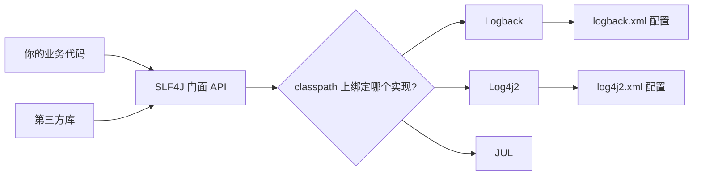
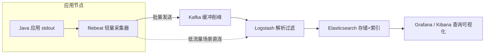

# 10 日志框架

> 前置知识：[[java/3工程化/06_Spring Boot快速开发|Spring Boot快速开发]]。本章是工程实战篇，重点不在 API 背诵，而在真实项目里日志怎么打、配置怎么写、线上出事怎么靠日志快速定位。

---

## 一、为什么 System.out.println 是灾难

### 1.1 初学者的第一反应

```java
// 很多人调试时的本能写法
System.out.println("user = " + user);
System.out.println("进入方法了");
System.out.println("result: " + result);
```

本地跑 demo 没问题，一旦进了真实项目，`System.out` 有五个致命缺陷：

| 缺陷 | 说明 |
|------|------|
| 无法关闭 | 上线后每行输出都有磁盘与 IO 开销，高并发下 `synchronized` 打印甚至拖垮吞吐 |
| 无级别 | 分不清哪些是错误哪些是调试，无法按需过滤 |
| 无格式 | 没有 时间、线程、类名、行号，排查时两眼一抹黑 |
| 无目标 | 只能打到标准输出，无法写入文件、无法对接采集系统 |
| 无法管理 | 要删只能全文搜索手工删，删漏了就是事故 |

### 1.2 日志框架解决什么

一个成熟的日志体系提供四件事：

1. **级别控制**：debug/info/warn/error，运行时可动态调整；
2. **格式化**：统一输出时间、级别、线程、traceId 等上下文；
3. **输出目的地**：控制台、文件、滚动归档、远程采集；
4. **性能**：占位符延迟拼接、异步 Appender，不打扰业务主流程。

一句话总结：**println 是"喊一嗓子"，日志框架是"可管理的广播系统"**。

---

## 二、门面与实现分离：SLF4J + Logback

### 2.1 为什么要分两层

Java 日志领域历史悠久，实现五花八门：Log4j、Logback、Log4j2、java.util.logging。如果每个类库直接依赖某个具体实现，就会出现：

- 你的项目用 Logback，引入的第三方库硬绑 Log4j，同一份代码输出到两个地方；
- 换日志实现要改动所有调用处。

解法是经典的**门面模式（Facade）**：



- **SLF4J**：只定义接口（Logger、LoggerFactory），不含任何实现；
- **Logback**：具体实现，Spring Boot 默认集成，作者是 Log4j 原作者。

### 2.2 Spring Boot 中的依赖

```xml
<!-- spring-boot-starter-web 已传递引入 spring-boot-starter-logging -->
<!-- 内含：slf4j-api + logback-classic + log4j-to-slf4j + jul-to-slf4j -->
<dependency>
    <groupId>org.springframework.boot</groupId>
    <artifactId>spring-boot-starter-web</artifactId>
</dependency>
```

注意桥接包的作用：`log4j-to-slf4j` 把老库里的 log4j 调用重定向回 SLF4J，最终统一走 Logback，避免日志双轨输出。**如果 classpath 同时出现 log4j 实现和桥接包，会形成死循环，启动时 SLF4J 会报错提醒你排除掉**。

### 2.3 基本用法

```java
import org.slf4j.Logger;
import org.slf4j.LoggerFactory;

@Service
public class BookService {
    // 通常配合 Lombok 的 @Slf4j 注解自动生成这一行
    private static final Logger log =
            LoggerFactory.getLogger(BookService.class);

    public Book findById(Long id) {
        log.info("查询图书 id={}", id);
        return bookRepository.findById(id)
                .orElseThrow(() -> new BizException("BOOK_NOT_FOUND", "图书不存在"));
    }
}
```

---

## 三、{} 占位符优于字符串拼接

### 3.1 性能差异的本质

```java
// 反例：无论日志是否输出，字符串都先拼好
log.debug("查询图书 id=" + id + ", name=" + name);

// 正确：只有 debug 级别开启时才真正执行 toString 与拼接
log.debug("查询图书 id={}, name={}", id, name);
```

`{}` 占位符把拼接推迟到确认需要输出的时刻。生产环境 debug 通常关闭，反例中每次调用都白白创建一个大字符串对象——在每秒上万次的接口里，这就是实打实的 GC 压力。

### 3.2 更隐蔽的坑：昂贵参数

```java
// 反例：即使不打印，getUserDetail() 和 toString() 都会执行
log.debug("详情: {}", userService.getUserDetail(id));

// 正确：用 lambda / 条件守卫
if (log.isDebugEnabled()) {
    log.debug("详情: {}", userService.getUserDetail(id));
}
```

### 3.3 规范速记

| 场景 | 写法 |
|------|------|
| 多变量 | `log.info("a={}, b={}, c={}", a, b, c)` |
| 异常对象放最后一个参数 | `log.error("处理订单失败, orderId={}", orderId, e)` |
| 不要用 e.printStackTrace() | 它绕过日志体系直奔 stderr，且无时间无上下文 |
| 敏感信息脱敏 | 手机号、密码、token 一律不打明文 |

---

## 四、日志级别规范表

### 4.1 级别语义

| 级别 | 语义 | 生产默认 | 典型场景 |
|------|------|----------|----------|
| ERROR | 出错了且影响功能，需要人介入处理 | 开启 | 下单失败、DB 连不上、外部接口超时 |
| WARN | 有异常但不影响主流程，或潜在风险 | 开启 | 重试成功、降级触发、慢查询 |
| INFO | 关键业务动作与状态变更 | 开启 | 订单创建、支付回调到达、服务启停 |
| DEBUG | 详细调试信息 | 关闭 | 方法入参出参、中间计算值 |
| TRACE | 极细粒度跟踪 | 关闭 | 框架内部行为 |

### 4.2 三条铁律

1. **ERROR 必须可行动**：打了 ERROR 就意味着"有人该看、该处理"，不要拿 ERROR 打印普通业务校验失败；
2. **INFO 控制量级**：INFO 是生产日志的主体，一条请求一到两条为宜，别把每个字段都打出来；
3. **DEBUG 可随时开**：通过配置中心动态调整某个包的级别到 DEBUG，排障完再调回来。

```yaml
# application.yml 快速配置，复杂需求仍用 logback.xml
logging:
  level:
    root: info
    com.example.book: debug          # 自己的包开 debug
    org.hibernate.SQL: debug         # 看 SQL
```

---

## 五、logback.xml 完整配置模板

Spring Boot 会自动加载 `src/main/resources/logback-spring.xml`（带 `-spring` 后缀才能使用 Spring 扩展语法）。

### 5.1 需求清单

按天滚动日志文件、保留 30 天、单文件超 100MB 也切分、压缩历史文件、错误单独一份文件、控制台彩色输出。

### 5.2 完整模板

```xml
<?xml version="1.0" encoding="UTF-8"?>
<configuration scan="true" scanPeriod="30 seconds">
    <!-- 引入 Spring Boot 提供的默认颜色转换器 -->
    <conversionRule conversionWord="wex"
                    converterClass="org.springframework.boot.logging.reextended.WhitespaceThrowableProxyConverter"/>

    <property name="LOG_HOME" value="/var/log/bookapp"/>
    <property name="PATTERN"
              value="%d{yyyy-MM-dd HH:mm:ss.SSS} [%thread] %-5level %logger{40} - [traceId=%X{traceId}] %msg%n"/>

    <!-- 控制台输出 -->
    <appender name="CONSOLE" class="ch.qos.logback.core.ConsoleAppender">
        <encoder>
            <pattern>%d{yyyy-MM-dd HH:mm:ss.SSS} %highlight(%-5level) [%thread] %cyan(%logger{36}) - %msg%n</pattern>
            <charset>UTF-8</charset>
        </encoder>
    </appender>

    <!-- 全量业务日志：按天滚动 + 大小切分 + 保留天数 -->
    <appender name="FILE_ALL" class="ch.qos.logback.core.rolling.RollingFileAppender">
        <file>${LOG_HOME}/app.log</file>
        <rollingPolicy class="ch.qos.logback.core.rolling.SizeAndTimeBasedRollingPolicy">
            <fileNamePattern>${LOG_HOME}/app.%d{yyyy-MM-dd}.%i.log.gz</fileNamePattern>
            <maxFileSize>100MB</maxFileSize>
            <maxHistory>30</maxHistory>
            <totalSizeCap>20GB</totalSizeCap>
        </rollingPolicy>
        <encoder>
            <pattern>${PATTERN}</pattern>
            <charset>UTF-8</charset>
        </encoder>
    </appender>

    <!-- 错误日志单独一份，值班只盯它 -->
    <appender name="FILE_ERROR" class="ch.qos.logback.core.rolling.RollingFileAppender">
        <file>${LOG_HOME}/error.log</file>
        <filter class="ch.qos.logback.classic.filter.LevelFilter">
            <level>ERROR</level>
            <onMatch>ACCEPT</onMatch>
            <onMismatch>DENY</onMismatch>
        </filter>
        <rollingPolicy class="ch.qos.logback.core.rolling.TimeBasedRollingPolicy">
            <fileNamePattern>${LOG_HOME}/error.%d{yyyy-MM-dd}.log.gz</fileNamePattern>
            <maxHistory>90</maxHistory>
        </rollingPolicy>
        <encoder>
            <pattern>${PATTERN}</pattern>
            <charset>UTF-8</charset>
        </encoder>
    </appender>

    <!-- 异步包装：业务线程只负责入队，IO 由专门线程完成 -->
    <appender name="ASYNC_ALL" class="ch.qos.logback.classic.AsyncAppender">
        <queueSize>1024</queueSize>
        <discardingThreshold>0</discardingThreshold>
        <neverBlock>true</neverBlock>
        <appender-ref ref="FILE_ALL"/>
    </appender>

    <logger name="com.example.book.mapper" level="debug"/>
    <logger name="org.springframework" level="warn"/>

    <root level="info">
        <appender-ref ref="CONSOLE"/>
        <appender-ref ref="ASYNC_ALL"/>
        <appender-ref ref="FILE_ERROR"/>
    </root>
</configuration>
```

### 5.3 关键点解读

| 配置项 | 说明 |
|--------|------|
| `scan="true"` | 每 30 秒检查配置变化并热加载，改级别不用重启 |
| `maxHistory=30` | 只保留最近 30 天，防止磁盘被撑爆 |
| `totalSizeCap` | 总容量上限，双保险 |
| `LevelFilter` | 精确匹配 ERROR 才写入 error.log |
| `neverBlock=true` | 队列满时丢弃日志而不是卡住业务线程 |

### 5.4 生产踩坑记录

1. **忘了 totalSizeCap**：某服务 debug 级别忘关，一天滚出几百个文件，磁盘写满后整个应用假死。保留天数必须配，总上限也必须配。
2. **AsyncAppender 的丢日志**：`discardingThreshold` 默认是队列容量的 20%，队列剩余不足时会丢弃 TRACE/DEBUG/INFO。要么设为 0 表示不主动丢弃（靠 neverBlock 兜底），要么接受这个取舍并明确写注释。
3. **多实例同机部署覆盖文件名**：不同实例的 `<file>` 必须不同路径，否则滚动互相干扰。
4. **容器环境写本地盘意义有限**：容器随时销毁，日志应打到 stdout 交给采集器（见第八节），文件方案主要用于传统虚拟机部署。

---

## 六、MDC 与 traceId 链路追踪

### 6.1 问题：一次请求的日志散落各处

一个请求穿过 Controller、Service、Mapper、外部 HTTP 调用，日志混在几千条并发日志里根本分不清哪条是谁的。解决办法：给每个请求发一个唯一编号 traceId，贯穿所有日志。

### 6.2 MDC 是什么

MDC（Mapped Diagnostic Context）本质是一个 ThreadLocal 的 Map。你在请求入口 put 一个 traceId，之后该线程上所有日志自动带上它，无需逐个传参。

### 6.3 实现：Filter 注入

```java
@Component
public class TraceIdFilter extends OncePerRequestFilter {

    private static final String TRACE_ID = "traceId";

    @Override
    protected void doFilterInternal(HttpServletRequest request,
                                    HttpServletResponse response,
                                    FilterChain chain) throws ServletException, IOException {
        String traceId = request.getHeader("X-Trace-Id");
        if (!StringUtils.hasText(traceId)) {
            traceId = UUID.randomUUID().toString().replace("-", "").substring(0, 16);
        }
        MDC.put(TRACE_ID, traceId);
        response.setHeader("X-Trace-Id", traceId);   // 返回给调用方，方便对账
        try {
            chain.doFilter(request, response);
        } finally {
            MDC.remove(TRACE_ID);   // 必须 remove，否则线程复用会串号
        }
    }
}
```

然后在 pattern 中引用 `%X{traceId}`，日志就变成：

```text
2026-08-23 14:02:11.335 [http-nio-8080-exec-3] INFO  BookService - [traceId=a1b2c3d4e5f60718] 查询图书 id=42
```

拿着用户反馈里的 traceId 去 grep，整条链路一目了然。

### 6.4 跨线程与跨服务

- **@Async / 自建线程池**：ThreadLocal 不跨线程，需要用任务装饰器复制 MDC。Spring 提供 `TaskDecorator`，提交前快照、执行时恢复；
- **跨服务调用**：RestTemplate/WebClient 拦截器里把当前 traceId 写进 `X-Trace-Id` 请求头，下游服务的 Filter 读出来继续用，链路就串起来了；
- **正式微服务体系**：直接上 Micrometer Tracing 或 SkyWalking，原理相同但自动埋点。

---

## 七、异常打印规范

### 7.1 正确姿势

```java
try {
    orderService.pay(orderId);
} catch (PayException e) {
    log.error("支付失败, orderId={}, channel={}", orderId, channel, e);
}
```

**把异常对象作为最后一个参数传入，SLF4J 会自动打印完整堆栈**。这是最重要的一条日志规范。

### 7.2 常见反模式

```java
// 反例 1：吞掉堆栈，只剩一句 message，现场全毁
log.error("支付失败: " + e.getMessage());

// 反例 2：printStackTrace 绕过日志体系
e.printStackTrace();

// 反例 3：占位符占了位置导致异常不被识别为堆栈参数
log.error("支付失败 {} ,{}", orderId, e);   // e 不是最后独立参数时行为易错

// 反例 4：重复打印。底层已 log.error，上层 catch 后再打一遍，同一事故两份堆栈
```

### 7.3 决策表：捕获后到底怎么办

| 情况 | 处理 |
|------|------|
| 能恢复/有兜底 | 记 WARN + 降级逻辑，不中断 |
| 不能处理但上层会处理 | 直接抛出，**不要重复打 ERROR** |
| 最终无人处理的地方（如定时任务顶层） | 打 ERROR 且带上完整上下文参数 |

---

## 八、Log4j2 异步与 Disruptor

### 8.1 为什么谈性能

同步日志意味着业务线程亲自做格式化、写文件、刷磁盘。高峰期磁盘成为瓶颈，所有请求线程排队等锁。Log4j2 的全异步模式借助 **Disruptor**（一个无锁环形缓冲区框架）把日志事件的生产与消费彻底分离。

### 8.2 开启方式

```xml
<!-- pom.xml -->
<dependency>
    <groupId>com.lmax</groupId>
    <artifactId>disruptor</artifactId>
    <version>3.4.4</version>
</dependency>
```

```bash
# JVM 参数一行搞定全异步（所有 logger 都异步）
-Dlog4j2.contextSelector=org.apache.logging.log4j.core.async.AsyncLoggerContextSelector
```

官方压测数据：64 线程下 Log4j2 异步吞吐约为 Logback 同步的数十倍，且线程越多优势越大。

### 8.3 选型建议

| 场景 | 建议 |
|------|------|
| 一般 Spring Boot 项目 | 默认 SLF4J + Logback 足够，配 AsyncAppender 即可 |
| 高并发网关、消息中间件类系统 | Log4j2 全异步 + Disruptor |
| 团队已有 Logback 且无瓶颈 | 不必迁移，收益配不上折腾成本 |

---

## 九、日志采集链路：从容器到 ELK

单机 grep 的时代过去了，几十个实例的日志需要集中检索。典型架构：



要点：

1. **filebeat 只负责搬运**：资源占用极小（几十 MB 内存），支持断点续传，容器环境下通常以 DaemonSet 方式部署，挂载 `/var/log` 或读取容器 stdout；
2. **Kafka 是缓冲层**：ES 抽风时不至于压垮采集，也便于多消费组（同时供安全审计等使用）；
3. **Logstash 做 grok 解析**：把半结构化文本解析成 JSON 字段，才能按 level、traceId 过滤聚合；
4. **查询习惯**：先按 traceId 精确检索，再按 service + level 聚合看趋势，避免大范围通配符查询拖垮集群。

---

## 十、生产排查速查：grep / awk 实战

### 10.1 常用命令速查表

```bash
# 1. 按关键字查（最常用）
grep "OutOfMemoryError" app.log

# 2. 按 traceId 查完整链路
grep "a1b2c3d4e5f60718" app.log

# 3. 统计每种错误的次数排行
grep -oE "ERROR .* - .*" app.log | sort | uniq -c | sort -rn | head

# 4. 看某分钟内的 ERROR
grep "2026-08-23 14:02" app.log | grep ERROR | less

# 5. 统计每秒请求数分布（找流量尖峰）
awk '{print substr($1" "$2,1,19)}' access.log | uniq -c

# 6. 取第 1000 行前后 50 行上下文
sed -n '950,1050p' app.log

# 7. 动态追踪最新错误
tail -f app.log | grep --line-buffered ERROR

# 8. 大文件先采样再分析，别一上来全量 grep 几十 GB
head -c 100m huge.log > sample.log
```

### 10.2 awk 提取字段示例

```bash
# 提取 ERROR 行的时间与消息前 80 个字符
awk '/ERROR/ {print $1, $2, substr($0, index($0,"-")+1, 80)}' app.log

# 统计每个线程出现的日志条数（发现某个线程疯狂刷日志）
awk -F'[][]' '/INFO/ {print $4}' app.log | sort | uniq -c | sort -rn | head
```

### 10.3 排查心法

1. **先看 error.log 再看全量**：缩小范围；
2. **时间对齐**：拿到故障时刻，往前多看五分钟，很多事故的根因日志在爆发之前；
3. **traceId 是钥匙**：优先让用户提供订单号/手机号，转成 traceId 后精确串联；
4. **zgrep 处理历史压缩包**：`zgrep "keyword" app.2026-08-20.*.log.gz`；
5. **警惕日志风暴**：发现某条日志每秒上千条时先怀疑 bug 本身，别急着继续往下翻。

---

## 本章小结

- println 不可控不可管，生产一律走日志框架；
- SLF4J 门面 + Logback 实现是 Spring Boot 默认组合，理解分层才能排桥接冲突；
- `{}` 占位符延迟拼接，异常对象放最后一个参数打印堆栈；
- logback.xml 核心是按天滚动 + maxHistory + totalSizeCap 三件套，异步 Appender 保护主流程；
- MDC traceId 是排查分布式问题的生命线，Filter 入口注入、finally 清理；
- 日志的终点不是文件而是集中式检索平台，grep/awk 是最后的兜底技能。

> 下一章 [[java/3工程化/11_单元测试|单元测试]]：当代码有了日志还不够，还需要测试证明它是对的。
