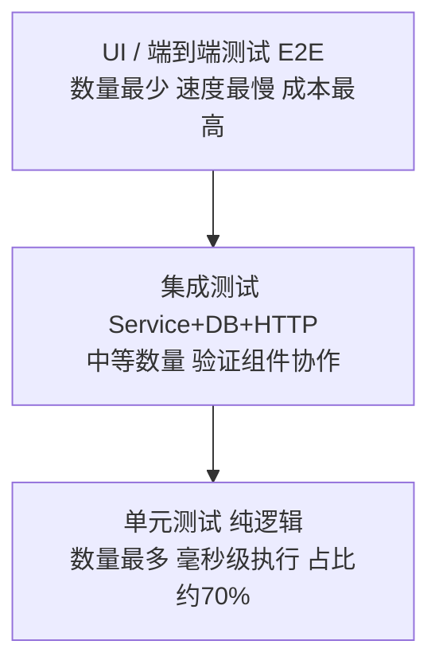

# 11 单元测试

> 前置知识：[[java/3工程化/06_Spring Boot快速开发|Spring Boot快速开发]]。本章是工程实战篇，重点不是背注解，而是建立"代码必须被测试证明正确"的工程习惯，并给真实 Service 层写出完整单测。

---

## 一、测试金字塔：不要把宝全押在集成测试上

### 1.1 三层结构



### 1.2 为什么金字塔是这个形状

| 层次 | 单测 | 集成 | E2E |
|------|------|------|-----|
| 执行速度 | 毫秒 | 秒级 | 十秒以上 |
| 定位精度 | 直接指到方法 | 要排查环境因素 | 只知道"坏了" |
| 维护成本 | 低 | 中 | 高（页面一改就挂） |
| 反馈周期 | 提交前本地跑 | CI 阶段 | 发布前 |

反模式叫**冰淇淋筒**：大量 E2E、几乎没有单测。结果是测试套件跑一小时、随机挂一半、最后没人信任测试直接跳过——比没有测试更糟。

---

## 二、JUnit 5 架构与生命周期

### 2.1 三件套

- **JUnit Platform**：测试启动底座，IDE 和构建工具都通过它发现并运行测试；
- **JUnit Jupiter**：新的编程模型与注解（日常写的部分）；
- **JUnit Vintage**：兼容跑老的 JUnit 4 用例。

Spring Boot 的 `spring-boot-starter-test` 已默认包含 JUnit 5。

### 2.2 生命周期注解

```java
class LifecycleDemoTest {

    @BeforeAll
    static void initAll() { }        // 整个类执行一次，必须 static

    @BeforeEach
    void setUp() { }                 // 每个 @Test 方法前都执行

    @Test
    void caseOne() { }

    @Test
    void caseTwo() { }

    @AfterEach
    void tearDown() { }              // 每个 @Test 后执行，清理现场

    @AfterAll
    static void cleanAll() { }       // 整个类结束执行一次，必须 static
}
```

执行顺序：`initAll -> setUp -> caseOne -> tearDown -> setUp -> caseTwo -> tearDown -> cleanAll`。

**核心原则：每个 @Test 必须相互独立**。测试之间共享可变状态是最常见的"单独跑通过、一起跑就挂"的根源。

---

## 三、断言：assertThat 与 assertThrows

### 3.1 基础断言

```java
@Test
void basicAssertions() {
    assertEquals(4, calculator.add(2, 2));
    assertTrue(list.isEmpty());
    assertNull(result);
    assertNotSame(a, b);
}
```

### 3.2 异常断言：assertThrows 取代 try-catch

```java
@Test
void shouldThrowWhenBookNotFound() {
    BizException ex = assertThrows(BizException.class,
            () -> bookService.findById(999L));

    assertEquals("BOOK_NOT_FOUND", ex.getCode());
}

// 断言"不抛异常"
assertDoesNotThrow(() -> bookService.delete(1L));
```

反例是手写 try-catch 然后 `fail("不该走到这")`，又长又容易漏掉"没抛异常也算过"的分支。`assertThrows` 一行解决且能拿到异常对象做进一步校验。

---

## 四、参数化测试：@ParameterizedTest + @CsvSource

同一个逻辑要验证多组输入时，与其复制十份 @Test，不如数据驱动：

```java
@ParameterizedTest(name = "[{index}] {0} 是闰年应为 {1}")
@CsvSource({
        "2024, true",
        "2023, false",
        "2000, true",     // 世纪闰年：能被400整除
        "1900, false",    // 世纪平年：能被100整除但不能被400整除
        "2026, false"
})
void leapYear(int year, boolean expected) {
    assertEquals(expected, DateUtils.isLeapYear(year));
}
```

其他常用数据源：

| 注解 | 用途 |
|------|------|
| `@ValueSource(ints = {1, 2, 3})` | 单类型简单值 |
| `@NullSource / @EmptySource` | 边界：null 与空串 |
| `@MethodSource("provider")` | 复杂对象，返回 Stream<Arguments> |
| `@EnumSource` | 遍历枚举所有值 |

参数化测试的价值在于**边界值一眼可见**：空串、0、负数、极大值，这些恰恰是 bug 高发区。

---

## 五、@Nested 组织用例结构

```java
class BookServiceTest {

    @Nested
    class FindById {
        @Test void 存在时返回图书() { }
        @Test void 不存在时抛异常() { }
        @Test void id为null时抛参数异常() { }
    }

    @Nested
    class Borrow {
        @Test void 库存充足时成功() { }
        @Nested
        class WhenStockEmpty {
            @Test void 库存为零时拒绝() { }
            @Test void 并发借阅只成功一次() { }
        }
    }
}
```

好处：报告里按业务行为分组；内层类自动复用外层 @BeforeEach，适合"先构造共同前置，再分叉场景"的结构。

---

## 六、Mockito：隔离依赖的艺术

### 6.1 为什么要 Mock

单测的定义是**只测当前单元的逻辑**。BookService 依赖 BookRepository 与 NotifyClient：

- Repository 连数据库：单测就变成慢速集成测试；
- NotifyClient 发短信：总不能每跑一次测试发一条真实短信。

Mock 对象替身回答两个问题：**调用它时返回什么（stub）**、**它是否被按预期调用了（verify）**。

### 6.2 核心注解

```java
@ExtendWith(MockitoExtension.class)
class BookServiceTest {

    @Mock
    private BookRepository bookRepository;      // 全部依赖都是假货

    @Mock
    private NotifyClient notifyClient;

    @InjectMocks
    private BookService bookService;            // Mockito 把 mock 注入进来
}
```

`@InjectMocks` 按 constructor/setter/field 顺序注入，注意它不做任何智能装配，依赖一多建议改用构造器手动 new，意图更明确。

### 6.3 when-thenReturn：定义桩行为

```java
@Test
void findById_shouldReturnBook() {
    // given
    Book book = new Book(42L, "深入理解Java虚拟机");
    when(bookRepository.findById(42L)).thenReturn(Optional.of(book));

    // when
    Book result = bookService.findById(42L);

    // then
    assertEquals("深入理解Java虚拟机", result.getTitle());
}
```

常用打桩语法：

```java
when(repo.findById(anyLong())).thenReturn(Optional.of(book));   // 匹配任意参数
when(repo.findById(eq(42L))).thenReturn(opt);                   // 精确匹配
when(client.send(any())).thenThrow(new IOException());          // 抛异常
when(repo.count()).thenReturn(10L, 20L, 30L);                   // 连续调用返回不同值
doNothing().when(client).send(any());                           // void 方法默认即无事发生
```

### 6.4 verify：验证交互

```java
@Test
void borrow_shouldSendNotification() {
    when(bookRepository.findById(1L)).thenReturn(Optional.of(borrowableBook()));

    bookService.borrow(1L, userId);

    verify(notifyClient).send(userId, "《xxx》借阅成功");  // 调了且仅一次
    verify(bookRepository).save(any(Book.class));
    verify(notifyClient, never()).send(userId, "已超期");
    verifyNoInteractions(auditClient);                     // 这个 mock 完全没被碰过
}
```

原则：**对查询型依赖用 stub，对外部副作用用 verify**；别把 verify 当断言刷屏，验证了不该关心的细节会让重构寸步难行。

### 6.5 ArgumentCaptor：捕获传入参数

当想检查传给 mock 的对象内部字段时：

```java
@Test
void create_shouldFillAuditFields() {
    when(idGenerator.next()).thenReturn(99L);

    bookService.create("新书");

    ArgumentCaptor<Book> captor = ArgumentCaptor.forClass(Book.class);
    verify(bookRepository).save(captor.capture());
    Book saved = captor.getValue();

    assertEquals(99L, saved.getId());
    assertEquals("新书", saved.getTitle());
    assertNotNull(saved.getCreatedAt());
}
```

---

## 七、Spring 测试切片：@SpringBootTest 与 @WebMvcTest

### 7.1 两者区别

| 注解 | 启动范围 | 速度 | 用途 |
|------|----------|------|------|
| `@SpringBootTest` | 完整应用上下文 | 慢（数秒） | 集成测试，验证整条链路 |
| `@WebMvcTest` | 仅 Controller + MVC 组件 | 快 | Web 层单测 |
| `@DataJpaTest` | 仅 Repository + 内存库或真库 | 快 | 持久层单测 |

### 7.2 @WebMvcTest + MockMvc 测 Controller

```java
@WebMvcTest(BookController.class)
class BookControllerTest {

    @Autowired
    private MockMvc mockMvc;

    @MockBean
    private BookService bookService;   // Service 层替换为 mock，不加载 DB

    @Autowired
    private ObjectMapper objectMapper;

    @Test
    void getBook_shouldReturn200() throws Exception {
        given(bookService.findById(42L))
                .willReturn(new Book(42L, "深入理解Java虚拟机"));

        mockMvc.perform(get("/api/books/{id}", 42))
                .andExpect(status().isOk())
                .andExpect(jsonPath("$.title").value("深入理解Java虚拟机"));
    }

    @Test
    void createBook_invalidBody_shouldReturn400() throws Exception {
        CreateBookRequest req = new CreateBookRequest("");  // 标题非法

        mockMvc.perform(post("/api/books")
                        .contentType(MediaType.APPLICATION_JSON)
                        .content(objectMapper.writeValueAsString(req)))
                .andExpect(status().isBadRequest());
    }
}
```

Controller 层测试的重点是**HTTP 契约**：状态码、路径、JSON 字段名、参数校验，这些恰恰是纯单测覆盖不到的。

> 注意：新版 Spring Boot 3.4+ 推荐用 `@MockitoBean` 替代 `@MockBean`，语义一致。

---

## 八、Testcontainers：用真数据库做测试

H2 内存库的尴尬：语法和 MySQL 不完全兼容，某些 SQL 本地全绿上线报错。Testcontainers 在 Docker 里起一个真实的 MySQL 容器给测试用：

```xml
<dependency>
    <groupId>org.testcontainers</groupId>
    <artifactId>mysql</artifactId>
    <scope>test</scope>
</dependency>
<dependency>
    <groupId>org.springframework.boot</groupId>
    <artifactId>spring-boot-testcontainers</artifactId>
    <scope>test</scope>
</dependency>
```

```java
@SpringBootTest
@Testcontainers
class BookRepositoryIT {

    @Container
    @ServiceConnection          // Spring Boot 自动把容器连接信息注入 DataSource
    static MySQLContainer<?> mysql =
            new MySQLContainer<>("mysql:8.0");

    @Autowired
    private BookRepository bookRepository;

    @Test
    void saveAndQuery() {
        bookRepository.save(new Book("真实MySQL也能过的SQL"));
        assertThat(bookRepository.findAll()).hasSize(1);
    }
}
```

约定俗成：这类用例命名以 IT 结尾（`maven-failsafe-plugin` 默认匹配 `*IT.java`），CI 里单独一个阶段执行，失败不影响快速的单测反馈环。

---

## 九、JaCoCo 覆盖率

### 9.1 Maven 插件配置

```xml
<plugin>
    <groupId>org.jacoco</groupId>
    <artifactId>jacoco-maven-plugin</artifactId>
    <version>0.8.12</version>
    <executions>
        <execution>
            <goals><goal>prepare-agent</goal></goals>
        </execution>
        <execution>
            <id>report</id>
            <phase>test</phase>
            <goals><goal>report</goal></goals>
        </execution>
        <execution>
            <id>check</id>
            <goals><goal>check</goal></goals>
            <configuration>
                <rules>
                    <rule>
                        <element>BUNDLE</element>
                        <limits>
                            <limit>
                                <counter>LINE</counter>
                                <value>COVEREDRATIO</value>
                                <minimum>0.60</minimum>
                            </limit>
                        </limits>
                    </rule>
                </rules>
            </configuration>
        </execution>
    </executions>
</plugin>
```

跑完 `mvn test` 打开 `target/site/jacoco/index.html`，绿色覆盖、黄色分支部分覆盖、红色没测到。

### 9.2 正确看待覆盖率

- 覆盖率是**下限指标不是质量指标**：80% 覆盖但全是无断言的假测试毫无意义；
- 行业经验：核心业务模块 70%-80% 为宜，工具类 getter、生成代码不必强求；
- 更有价值的用法是 **增量覆盖率卡点**：PR 只要求新增代码有覆盖，历史包袱逐步还。

---

## 十、命名与结构规范：given_when_then

### 10.1 三段式结构

```java
@Test
void borrow_whenStockSufficient_shouldSuccess() {
    // given 准备数据与桩
    Book book = new Book(1L, "Java核心技术", 5);
    when(bookRepository.findById(1L)).thenReturn(Optional.of(book));

    // when 执行被测动作
    bookService.borrow(1L, 100L);

    // then 校验结果
    assertEquals(4, book.getStock());
}
```

### 10.2 命名模板

推荐 `方法名_条件_期望结果`，读测试名就知道测什么：

```text
findById_bookExists_returnsBook
borrow_stockZero_throwsException
create_duplicateTitle_rejects
```

团队统一一种即可，重点是**看到名字不用进方法体就知道在测什么场景**。

---

## 十一、实战：为 BookService 写完整单元测试

### 11.1 被测代码

```java
@Service
@RequiredArgsConstructor
public class BookService {

    private final BookRepository bookRepository;
    private final NotifyClient notifyClient;

    public Book borrow(Long bookId, Long userId) {
        Book book = bookRepository.findById(bookId)
                .orElseThrow(() -> new BizException("BOOK_NOT_FOUND", "图书不存在"));

        if (book.getStock() <= 0) {
            throw new BizException("OUT_OF_STOCK", "库存不足");
        }
        book.setStock(book.getStock() - 1);
        bookRepository.save(book);

        notifyClient.send(userId,
                "《%s》借阅成功".formatted(book.getTitle()));
        return book;
    }
}
```

### 11.2 完整测试类

```java
@ExtendWith(MockitoExtension.class)
class BookServiceBorrowTest {

    @Mock
    private BookRepository bookRepository;

    @Mock
    private NotifyClient notifyClient;

    @InjectMocks
    private BookService bookService;

    private Book stockBook;

    @BeforeEach
    void setUp() {
        stockBook = new Book(1L, "Java核心技术", 3);
    }

    @Nested
    class Given_BookExists {

        @Test
        void when_stockSufficient_then_decreaseStockAndNotify() {
            // given
            when(bookRepository.findById(1L)).thenReturn(Optional.of(stockBook));

            // when
            Book result = bookService.borrow(1L, 100L);

            // then
            assertEquals(2, result.getStock());

            ArgumentCaptor<Book> captor = ArgumentCaptor.forClass(Book.class);
            verify(bookRepository).save(captor.capture());
            assertEquals(2, captor.getValue().getStock());

            verify(notifyClient).send(100L, "《Java核心技术》借阅成功");
        }

        @Test
        void when_stockZero_then_throwsOutOfStock_andNeverSave() {
            // given
            stockBook.setStock(0);
            when(bookRepository.findById(1L)).thenReturn(Optional.of(stockBook));

            // when & then
            BizException ex = assertThrows(BizException.class,
                    () -> bookService.borrow(1L, 100L));
            assertEquals("OUT_OF_STOCK", ex.getCode());

            verify(bookRepository, never()).save(any());
            verifyNoInteractions(notifyClient);   // 失败不应通知用户
        }

        @Test
        void when_notifyFails_then_borrowStillSucceeds() {
            // given：通知挂了不该影响主流程
            when(bookRepository.findById(1L)).thenReturn(Optional.of(stockBook));
            doThrow(new RuntimeException("sms down"))
                    .when(notifyClient).send(anyLong(), anyString());

            // when & then
            assertDoesNotThrow(() -> bookService.borrow(1L, 100L));
            assertEquals(2, stockBook.getStock());
        }
    }

    @Nested
    class Given_BookMissing {

        @ParameterizedTest
        @ValueSource(longs = {-1L, 0L, 999L})
        void when_idInvalid_then_throwsNotFound(Long badId) {
            when(bookRepository.findById(badId)).thenReturn(Optional.empty());

            BizException ex = assertThrows(BizException.class,
                    () -> bookService.borrow(badId, 100L));
            assertEquals("BOOK_NOT_FOUND", ex.getCode());
        }
    }
}
```

### 11.3 这套测试覆盖了什么

| 用例 | 保护的业务规则 |
|------|----------------|
| 正常借阅 | 库存减一、落库、发通知 |
| 库存为零 | 拒绝且不落库不通知 |
| 通知服务故障 | 主流程不受影响（容错契约） |
| 图书不存在 | 明确错误码 |

将来有人重构这段代码（比如改成乐观锁），只要这些业务规则不变，测试就该保持绿色；一旦有人不小心删掉了库存判断，测试立刻红。**这就是单测的真正价值：把业务规则固化成可执行的文档**。

---

## 本章小结

- 金字塔：海量单测打底，少量集成为辅，E2E 只保关键路径；
- JUnit5 生命周期保证用例独立；assertThrows 断言异常，@CsvSource 数据驱动边界值；
- Mockito 四板斧：@Mock/@InjectMocks 打桩隔离、verify 验证副作用、ArgumentCaptor 检查入参；
- @WebMvcTest 测 HTTP 契约，Testcontainers 用真 MySQL 消灭 H2 兼容性幻觉；
- JaCoCo 是下限不是目标，given-when-then 结构加规范命名让测试成为活的文档。

> 下一章 [[java/3工程化/12_Docker容器化|Docker容器化]]：测试通过了，如何把它可靠地送到生产机器上。
