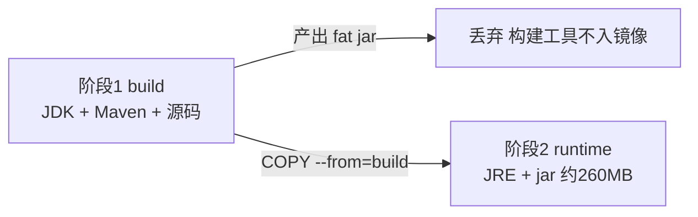

# 12 Docker容器化

> 前置知识：[[java/3工程化/11_单元测试|单元测试]]。本章是工程实战篇，重点是把 Spring Boot 应用打成小而快的镜像、用 compose 拉起整套依赖，并理解 JVM 在容器里怎么正确分配内存。

---

## 一、镜像与容器：为什么需要它

### 1.1 从 C 静态编译说起

写过 C 的同学熟悉这样的分发方式：

```bash
gcc -O2 -static main.c -o myapp    # 静态链接
scp myapp server:/opt/             # 一个文件拷过去就能跑
```

静态编译把 libc 等依赖全部打进一个二进制，"在我机器上能跑"的问题被一个文件解决了。但 Java 走的是另一条路：**字节码 + 目标机器上的 JRE**。于是部署时问题来了——目标机器的 JDK 版本谁保证？环境变量、时区、字体库谁负责？

Docker 给出的答案是：**把应用连同它需要的整个运行环境（JRE、系统库、配置）打包成一个不可变镜像**。镜像之于容器，正如类之于对象：

| 概念 | 类比 | 特点 |
|------|------|------|
| 镜像 Image | 类 / 安装光盘 | 只读模板，分层存储，可版本化 |
| 容器 Container | 对象 / 运行中的程序 | 镜像的一个运行实例，可启停可销毁 |
| 仓库 Registry | Maven 中央仓库 | 存放与分发镜像（GHCR/Docker Hub） |

一次构建，处处运行。开发、测试、生产跑的是同一个镜像，环境差异被彻底消灭。

### 1.2 分层：镜像是怎么存的

镜像由只读层堆叠而成，容器启动时在最上面加一个可写层。这个设计带来两大红利：**构建缓存**（没变的层直接复用）和**拉取加速**（只下载缺失的层）。后文的 Dockerfile 优化全部围绕这一点展开。

---

## 二、三平台安装

```bash
# macOS (Apple Silicon 会自动装 arm64 版)
brew install --cask docker

# Ubuntu / Debian 一行命令
curl -fsSL https://get.docker.com | sh

# Windows：安装 Docker Desktop（需 WSL2）
wsl --install
winget install Docker.DockerDesktop
```

验证：`docker run hello-world`。

---

## 三、Java 应用的基础镜像选择

### 3.1 候选对比表

| 基础镜像 | 大小(约) | 包管理器 | 适用 |
|----------|----------|----------|------|
| `eclipse-temurin:21-jre-alpine` | ~80MB | apk | 追求最小体积，注意 musl libc 兼容性 |
| `eclipse-temurin:21-jre-jammy` / slim 变体 | ~200MB | apt | 稳妥默认，glibc 兼容性最好 |
| `eclipse-temurin:21-jdk` | ~450MB | apt | 仅构建阶段使用 |
| `amazoncorretto:21-al2023` | ~200MB | dnf | AWS 环境 |

权衡要点：

1. **运行期只需要 JRE 不需要 JDK**，体积先砍一半；
2. **alpine 用 musl libc**：绝大多数纯 Java 应用没问题，但用到 JNI 本地库（如 netty-tcnative、某些字体渲染）可能踩坑；
3. **slim 是 glibc 精简版**：兼容性和体积的折中，团队拿不准就选它；
4. **固定 tag 别用 latest**：`21-jre-alpine` 也比裸 `alpine` 好，至少锁了大版本。

---

## 四、分层缓存优化：Dockerfile 的核心思想

### 4.1 反例：每次都全量重建

```dockerfile
FROM eclipse-temurin:21-jre-alpine
WORKDIR /app
COPY . .                      # 任何一行代码改动，下面所有层缓存失效
RUN ./mvnw package -DskipTests
ENTRYPOINT ["java", "-jar", "target/app.jar"]
```

改一个注释也要重新下载全部 Maven 依赖、重新编译整个项目，构建从 30 秒变 10 分钟。

### 4.2 正解：变化频率低的放前面

```dockerfile
FROM eclipse-temurin:21-jre-alpine AS deps
WORKDIR /app
# 第一步：只拷贝 pom，下载依赖 —— pom 不变则此层永远命中缓存
COPY pom.xml .
RUN ./mvnw dependency:go-offline -B

FROM deps AS build
COPY src ./src
RUN ./mvnw package -DskipTests   # 只有源码变了才重新编译

FROM eclipse-temurin:21-jre-alpine
WORKDIR /app
COPY --from=build /app/target/app.jar app.jar
ENTRYPOINT ["java", "-jar", "app.jar"]
```

原则一句话：**按"改动的频繁程度"从低到高排列指令**。依赖声明最稳定放最前，业务源码其次。

---

## 五、多阶段构建瘦身

### 5.1 为什么需要

构建产物 jar 需要 Maven 和 JDK；但运行只需要 JRE 和 jar。如果两者混在一个镜像里，等于把工地和房子一起交付。多阶段构建让最终镜像只包含运行必需品：



上面的 Dockerfile 已示范：多个 FROM 就是多个阶段，`COPY --from=build` 把上一阶段产物拷进干净的最终阶段。典型效果：**镜像从 700MB 降到 250MB 以内**。

### 5.2 进阶：jlink 定制运行时

JDK 9 之后可以用 jlink 按模块裁剪出只含所需模块的迷你 JRE：

```dockerfile
FROM eclipse-temurin:21-jdk-alpine AS jlink
RUN jlink \
    --add-modules java.base,java.sql,java.naming,java.management,java.net.http,jdk.unsupported \
    --strip-debug --no-man-pages --no-header-files \
    --compress zip-6 \
    --output /javaruntime

FROM alpine:3.20
COPY --from=jlink /javaruntime /opt/java
ENV PATH="/opt/java/bin:${PATH}"
```

最终镜像可以压到 100MB 左右。代价是要维护模块列表（缺模块运行时报错），适合对镜像体积敏感（大规模集群拉取提速、安全攻击面收窄）的场景。

---

## 六、docker run 实操

### 6.1 常用参数

```bash
docker run -d \
  --name book-api \
  -p 8080:8080 \                          # 宿主机端口:容器端口
  -e SPRING_PROFILES_ACTIVE=prod \        # 注入环境变量
  -e TZ=Asia/Shanghai \                   # 时区，忘了就是 UTC 八小时悬案
  -m 512m \                               # 内存硬限制
  --cpus=1.0 \                            # CPU 限制
  -v /var/log/bookapp:/var/log/bookapp \  # 卷挂载日志目录
  --restart unless-stopped \
  myregistry/book-api:1.0.0
```

### 6.2 日志为什么要挂卷

容器的可写层随容器销毁而消失，日志写在里面等于写在沙滩上。两种方案：

1. **卷挂载**：日志目录映射到宿主机，容器删了日志还在，filebeat 直接采集宿主机目录；
2. **stdout 方案**：什么都不配，日志全打标准输出，由 docker/采集器接管（云原生首选，见第十章采集链路）。

排障常用命令速记：

```bash
docker logs -f --tail 100 book-api   # 看日志
docker exec -it book-api sh          # 进容器（alpine 没有 bash）
docker stats                         # 实时资源占用
docker inspect book-api              # 元数据、挂载、网络
```

镜像仓库操作同样高频：

```bash
docker tag book-api:1.0.0 myregistry/book-api:1.0.0
docker login myregistry.com
docker push myregistry/book-api:1.0.0
docker images --format "{{.Repository}}:{{.Tag}} {{.Size}}"   # 查看本地镜像与体积
docker system prune -a    # 清理悬空镜像，注意会删未使用镜像
```

---

## 七、JVM 容器感知：UseContainerSupport

### 7.1 经典事故：容器里 OOMKilled

老版本 JVM 看到"机器有 16G 内存"，就把最大堆设成 16G 的四分之一。放进限了 1G 的容器后：堆+元空间+线程栈+堆外内存轻松超过限额，内核直接杀进程，退出码 137，日志里什么都没有。

### 7.2 解法

JDK 8u191+/10+ 默认开启 **UseContainerSupport**：JVM 正确读取 cgroup 限额，`MaxRAMPercentage` 按容器内存百分比设置堆：

```bash
# 容器限 1G 内存的推荐配置
ENTRYPOINT ["java", \
  "-XX:MaxRAMPercentage=75.0", \
  "-XX:+ExitOnOutOfMemoryError", \
  "-jar", "app.jar"]
```

经验法则：

| 容器内存 | 堆占比建议 | 原因 |
|----------|-----------|------|
| <= 1G | 70%-75% | 要给元空间、线程栈、DirectMemory 留余量 |
| 2G-4G | 75%-80% | 相对宽裕 |
| 更大 | 结合压测定 | 别拍脑袋 |

另外 `-XX:+ExitOnOutOfMemoryError` 让 OOM 时快速失败交给重启策略，而不是带着残缺状态僵死。

---

## 八、docker-compose 完整示例：app + MySQL + Redis

本地开发或单机部署的经典三件套，含 healthcheck 与依赖顺序控制：

```yaml
services:
  app:
    image: myregistry/book-api:1.0.0
    build: .
    ports:
      - "8080:8080"
    environment:
      SPRING_DATASOURCE_URL: jdbc:mysql://mysql:3306/bookdb?useSSL=false&serverTimezone=Asia/Shanghai
      SPRING_DATASOURCE_USERNAME: book
      SPRING_DATASOURCE_PASSWORD: bookpass
      SPRING_DATA_REDIS_HOST: redis
      JAVA_TOOL_OPTIONS: "-XX:MaxRAMPercentage=75.0"
      TZ: Asia/Shanghai
    depends_on:
      mysql:
        condition: service_healthy    # 等健康检查通过才启动
      redis:
        condition: service_healthy
    mem_limit: 1g
    restart: unless-stopped
    volumes:
      - app-logs:/var/log/bookapp

  mysql:
    image: mysql:8.0
    environment:
      MYSQL_DATABASE: bookdb
      MYSQL_USER: book
      MYSQL_PASSWORD: bookpass
      MYSQL_ROOT_PASSWORD: rootpass
    command: --character-set-server=utf8mb4 --collation-server=utf8mb4_unicode_ci
    healthcheck:
      test: ["CMD", "mysqladmin", "ping", "-h", "localhost", "-ubook", "-pbookpass"]
      interval: 5s
      timeout: 3s
      retries: 10
    volumes:
      - mysql-data:/var/lib/mysql

  redis:
    image: redis:7-alpine
    healthcheck:
      test: ["CMD", "redis-cli", "ping"]
      interval: 5s
      timeout: 3s
      retries: 10

volumes:
  mysql-data:
  app-logs:
```

要点解读：

1. **depends_on 加 condition 才真正解决顺序问题**：裸 depends_on 只保证启动顺序不保证可用性，MySQL 还没监听端口 app 就连库失败是最常见的启动翻车；
2. **数据必须落 volume**，否则 `compose down` 后数据蒸发；
3. 服务名即主机名：Spring 配置里写 `jdbc:mysql://mysql:3306`，走 compose 内部 DNS。

---

## 九、实战：图书 API 容器化连 MySQL

### 9.1 项目结构

```text
book-api/
├── Dockerfile
├── docker-compose.yml        # 上面第八节的文件
├── mvnw
├── pom.xml
└── src/main/
    ├── java/com/example/book/
    │   ├── BookApiApplication.java
    │   ├── controller/BookController.java
    │   └── ...
    └── resources/application.yml
```

### 9.2 最终 Dockerfile（整合本章所有优化）

```dockerfile
# syntax=docker/dockerfile:1

# ---------- 阶段1: 依赖解析（缓存友好） ----------
FROM maven:3.9-eclipse-temurin-21 AS deps
WORKDIR /build
COPY pom.xml .
RUN mvn -B dependency:go-offline

# ---------- 阶段2: 编译打包 ----------
FROM deps AS build
COPY src ./src
RUN mvn -B package -DskipTests

# ---------- 阶段3: 运行镜像 ----------
FROM eclipse-temurin:21-jre-alpine
RUN addgroup -S app && adduser -S app -G app
USER app
WORKDIR /app
COPY --from=build /build/target/book-api-*.jar app.jar
EXPOSE 8080
ENV TZ=Asia/Shanghai
HEALTHCHECK --interval=15s --timeout=3s --start-period=40s \
  CMD wget -qO- http://127.0.0.1:8080/actuator/health | grep -q UP || exit 1
ENTRYPOINT ["java", "-XX:MaxRAMPercentage=75.0", "-XX:+ExitOnOutOfMemoryError", "app.jar"]
```

亮点清单：非 root 用户运行（安全基线）、HEALTHCHECK 自检、start-period 给 Spring 启动留时间。

### 9.3 一键验证

```bash
docker compose up -d --build
docker compose ps                       # 三个服务 healthy/up
curl http://localhost:8080/api/books/1  # 通了
docker compose logs -f app              # 盯启动日志
```

---

## 十、瘦身效果对比表

以同一个 Spring Boot 应用为例：

| 构建方式 | 镜像大小 | 冷启动拉取时间(百兆带宽) | 备注 |
|----------|----------|--------------------------|------|
| 单阶段 + full JDK | 约 750MB | 约 60s | 工地一起交付 |
| 多阶段 + JRE slim | 约 260MB | 约 21s | 推荐默认 |
| 多阶段 + jlink | 约 120MB | 约 10s | 需维护模块清单 |
| jlink + CDS(AppCDS) | 约 120MB | 同上且启动快 30%+ | 进阶 |

除了体积，瘦身还有两个隐性收益：**漏洞扫描报告更干净**（包少洞少）、**发布更快**（CI 推送镜像时间线性下降）。

---

## 十一、.dockerignore 与构建上下文

`docker build .` 会把当前目录整个发给 Docker 守护进程（构建上下文）。如果目录里有 `target/`、`.git/`、日志文件，上下文可能几百 MB，构建光"上传"就要几十秒。写一个 `.dockerignore`：

```text
target/
.git/
.idea/
*.iml
logs/
docker-compose.yml
README.md
```

效果立竿见影：上下文从 300MB 降到几 MB，CI 里每次构建省下固定开销。这和 `.gitignore` 同等重要，却常被忽略。

---

## 十二、容器网络与常见故障排查表

compose 会为项目建一个内部网络，服务间用服务名互访；容器要访问宿主机时，Linux 下用网关地址 `host.docker.internal` 需在 compose 中加 `extra_hosts: ["host.docker.internal:host-gateway"]`。

日常排错速查：

| 症状 | 可能原因 | 排查命令 |
|------|----------|----------|
| 容器秒退 | 入口进程崩溃 / 配置错误 | `docker logs --tail 50 <name>` |
| 退出码 137 | 内存超限被 OOMKill | `docker inspect` 看 OOMKilled 字段 |
| 退出码 139 | JVM 崩溃（常见于 JNI/musl 兼容） | 换 glibc 基础镜像验证 |
| 端口起不来 | 端口被宿主机占用 | `ss -lntp \| grep 8080` |
| 连不上 MySQL | 服务名拼错 / MySQL 未就绪 | `docker exec -it app ping mysql` |
| 时区差八小时 | 忘了 TZ 环境变量 | `docker exec date` 验证 |
| 日志找不到 | 写进了容器可写层且容器已删 | 改 stdout 或卷挂载 |

---

## 本章小结

- 镜像是不可变的环境快照，容器是其运行实例，类比 C 静态编译理解"环境跟着应用走"；
- 基础镜像选型：拿不准选 temurin slim，极致体积再上 alpine/jlink；
- Dockerfile 按"改动频率从低到高"排列指令，pom 先行吃满构建缓存；
- 多阶段构建让最终镜像只装 JRE 和 jar，非 root 运行加 healthcheck 是基本素养；
- JVM 容器感知靠 UseContainerSupport + MaxRAMPercentage，退出码 137 先查内存限额；
- compose 里 depends_on 必须 condition: service_healthy 才算真正等依赖就绪；
- .dockerignore 控制构建上下文体积，网络问题先确认服务名与时区这类低级因素。

> 下一章 [[java/3工程化/13_CICD流水线|CICD流水线]]：镜像会打了，如何让它自动经过测试流向生产。
