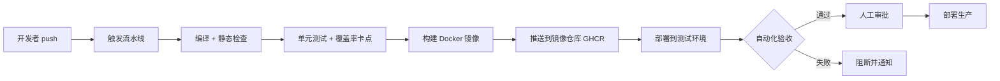
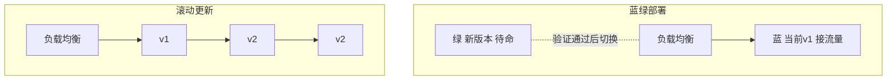

# 13 CICD流水线

> 前置知识：[[java/3工程化/12_Docker容器化|Docker容器化]]。本章是工程实战篇，重点是搭建一条"push 即测试、打 tag 即发布"的 GitHub Actions 流水线，并理解密钥管理与发布回滚的线上纪律。

---

## 一、CI 与 CD 的区别

### 1.1 概念拆分

- **持续集成 CI（Continuous Integration）**：每次 push 自动拉代码、编译、跑测试、做静态检查。目标是**尽快发现集成问题**，产出是"可信的构建产物"；
- **持续交付 CD（Continuous Delivery）**：在 CI 之上，把产物自动部署到类生产环境，随时可以一键上线；
- **持续部署（Continuous Deployment）**：更进一步，通过所有检查后自动发布到生产，无需人工点击。

### 1.2 全景流程



核心价值一句话：**让机器重复做确定性的事，人只做判断性的事**。

---

## 二、GitHub Actions 核心概念

| 概念 | 说明 |
|------|------|
| Workflow | 一个 `.github/workflows/*.yml` 文件定义一条流水线 |
| `on` | 触发器：push、pull_request、tag、schedule、手动 |
| Job | 一组 step，默认并行执行，跑在独立虚拟机上 |
| Step | 一个命令或一个复用 action（`uses:`） |
| Runner | 执行机器；GitHub 提供公共 runner，也可自托管 |
| Matrix | 矩阵策略，一份配置跑多组组合（如多 JDK 版本） |
| Secrets | 加密的密钥存储，日志中自动脱敏 |

自托管 runner 一句话：公司内网或自有服务器上运行 `./config.sh --url ... --token ...` 注册后，workflow 里写 `runs-on: [self-hosted]` 即可把任务派给它，适合需要访问内网数据库或私有制品库的场景。

---

## 三、完整工作流 YAML 逐段讲解

以下是一条 Java 项目标准流水线，分四个 job：测试、构建推送、部署测试环境、部署生产。

### 3.1 触发与矩阵测试

```yaml
name: book-api-ci

on:
  push:
    branches: [main, develop]
    tags: ["v*"]          # 打 tag 也触发（用于发布）
  pull_request:
    branches: [main]

env:
  REGISTRY: ghcr.io
  IMAGE_NAME: ${{ github.repository }}

jobs:
  test:
    runs-on: ubuntu-latest
    strategy:
      matrix:              # 同一套代码在两个 JDK 上各跑一遍
        java: [17, 21]
    steps:
      - uses: actions/checkout@v4

      - name: Set up JDK ${{ matrix.java }}
        uses: actions/setup-java@v4
        with:
          distribution: temurin
          java-version: ${{ matrix.java }}
          cache: maven     # 官方 action 缓存 ~/.m2，加速依赖下载

      - name: Run tests with coverage
        run: mvn -B verify jacoco:report

      - name: Coverage gate
        run: mvn -B jacoco:check   # pom 中配置的覆盖率下限不过则失败
```

要点：

1. **PR 必须触发**，主干保护依赖它；
2. `setup-java` 的 `cache: maven` 缓存本地仓库，冷构建从十分钟降到两分钟；
3. matrix 让你提前知道"JDK 21 能跑、JDK 17 挂了"这种兼容性问题。

### 3.2 构建并推送 GHCR

```yaml
  build-push:
    needs: test                       # 测试全绿才构建
    if: github.event_name == 'push'   # PR 只测不推镜像
    runs-on: ubuntu-latest
    permissions:
      contents: read
      packages: write                 # 允许推送 GHCR
    steps:
      - uses: actions/checkout@v4

      - uses: docker/setup-buildx-action@v3

      - uses: docker/login-action@v3
        with:
          registry: ${{ env.REGISTRY }}
          username: ${{ github.actor }}
          password: ${{ secrets.GITHUB_TOKEN }}   # 内置 token，免配置

      - uses: docker/metadata-action@v5
        id: meta
        with:
          images: ${{ env.REGISTRY }}/${{ env.IMAGE_NAME }}
          tags: |
            type=sha,prefix=          # 每次构建带 commit sha
            type=semver,pattern={{version}}   # tag v1.2.3 -> 1.2.3

      - uses: docker/build-push-action@v6
        with:
          context: .
          push: true
          tags: ${{ steps.meta.outputs.tags }}
          cache-from: type=gha       # 复用 Docker 层缓存
          cache-to: type=gha,mode=max
```

镜像标签策略：开发分支用 `sha-xxxxx` 保证可追溯，正式发布用语义化版本号。

### 3.3 SSH 部署到服务器

```yaml
  deploy-staging:
    needs: build-push
    runs-on: ubuntu-latest
    environment: staging              # 可绑定环境级 secrets 与审批
    steps:
      - name: Deploy via ssh
        uses: appleboy/ssh-action@v1
        with:
          host: ${{ secrets.STAGING_HOST }}
          username: deploy
          key: ${{ secrets.STAGING_SSH_KEY }}
          script: |
            cd /opt/bookapi
            echo ${{ secrets.GHCR_TOKEN }} | docker login ghcr.io -u x --password-stdin
            IMAGE=ghcr.io/${{ github.repository }}:${{ github.sha }} \
              docker compose pull app && IMAGE=${{ github.sha }} \
              docker compose up -d --no-deps app
```

systemd 方式则替换 script 为：下载 jar 到 `/opt/bookapi/app.jar` 后 `systemctl restart bookapi`，配合 `ExecStart=/usr/bin/java -jar /opt/bookapi/app.jar` 的 unit 文件。容器化团队选 compose，裸机传统团队选 systemd，两者思路一致：**远端执行确定性的部署命令，且命令本身幂等**。

### 3.4 生产部署与人工审批

```yaml
  deploy-prod:
    needs: deploy-staging
    if: startsWith(github.ref, 'refs/tags/v')   # 只有 tag 才进生产
    runs-on: ubuntu-latest
    environment: production           # 在 repo Settings 里给该环境开 required reviewer
    steps:
      - uses: appleboy/ssh-action@v1
        with:
          host: ${{ secrets.PROD_HOST }}
          username: deploy
          key: ${{ secrets.PROD_SSH_KEY }}
          script: |
            cd /opt/bookapi && ./release.sh ${{ github.ref_name }}
```

在仓库设置中为 `production` environment 启用 Required reviewers 后，这一步会暂停等待指定人员点击批准——这就是最简单的发布门禁。

---

## 四、Secrets 管理：绝不硬编码

### 4.1 红线

- 数据库密码、SSH 私钥、云平台 AK/SK **一律放 Secrets，绝不写进 yaml 或代码**；
- 日志会自动掩码 secret 值，但**别把 secret 拼进 shell 变量再 echo**，绕过掩码就是泄漏；
- fork 的 PR 默认拿不到 secrets，这是保护机制不是 bug。

### 4.2 配置层级

| 层级 | 适用 |
|------|------|
| Repository secrets | 全仓库共用，如 GHCR 凭证 |
| Environment secrets | 按环境隔离，staging 和 prod 密码必须不同 |
| OIDC 短期凭证 | 云厂商场景首选，免去长期 AK/SK |

原则：**staging 与生产的凭证彻底分开**，泄露一个不至于全军覆没。

---

## 五、分支保护与流程纪律

推荐的主干保护规则：

1. PR 必须通过 `test` job 才能 merge（Require status checks）；
2. 至少一人 code review；
3. 禁止 force push 到 main；
4. main 保持永远可发布：merge 即产生可部署产物。

配合上一章的镜像版本化，任何一次发布的产物都能精确回溯到某次 commit。

---

## 六、GitLab CI 对照

GitLab 用仓库根目录 `.gitlab-ci.yml`，概念对照表：

| GitHub Actions | GitLab CI |
|----------------|-----------|
| workflow yml in .github/workflows | .gitlab-ci.yml in repo root |
| jobs 并行，needs 串行 | stages 串行，同 stage 内并行 |
| actions/setup-java | image: maven:3.9-eclipse-temurin-21 |
| actions/cache | cache: paths 关键字 |
| secrets | CI/CD Variables (masked/protected) |
| environments | environments |

等价示例片段：

```yaml
stages: [test, build, deploy]

test:
  stage: test
  image: maven:3.9-eclipse-temurin-21
  script: mvn -B verify
  cache:
    paths: [.m2/repository]

deploy-prod:
  stage: deploy
  environment: production
  script: ./release.sh $CI_COMMIT_TAG
  rules:
    - if: $CI_COMMIT_TAG =~ /^v/
  when: manual        # 手动确认后执行，相当于审批门禁
```

---

## 七、Jenkins 声明式 Pipeline 简介

很多公司存量系统仍是 Jenkins。声明式 Jenkinsfile 长这样：

```groovy
pipeline {
    agent any
    tools { jdk 'jdk21'; maven 'maven3' }
    stages {
        stage('Test') {
            steps { sh 'mvn -B verify' }
            post { always { junit '**/target/surefire-reports/*.xml' } }
        }
        stage('Build Image') { steps { sh 'docker build -t book-api:$BUILD_NUMBER .' } }
        stage('Deploy') {
            when { tag 'v*' }
            steps { sh './release.sh' }
        }
    }
    post {
        failure { emailext subject: "构建失败", to: "team@example.com" }
    }
}
```

三套工具怎么选：新项目无历史包袱选 GitHub Actions 或 GitLab CI（与托管平台一体化）；需要复杂插件生态、多机房异构节点或公司已有 Jenkins 集群时继续用 Jenkins——理念相通，语法迁移成本不高。

---

## 八、版本策略：SNAPSHOT、Release 与 Tag

| 版本形态 | 含义 | 场景 |
|----------|------|------|
| `1.3.0-SNAPSHOT` | 不稳定快照，每次构建可能变化 | 团队内部联调 |
| `1.3.0` release | 不可变，发布即冻结 | 正式对外 |
| git tag `v1.3.0` | 与 release 绑定的里程碑 | 触发发布流水线 |

语义化版本 MAJOR.MINOR.PATCH：改坏兼容性升 MAJOR、加功能升 MINOR、修 bug 升 PATCH。

发布操作流：develop 合到 main -> 把 pom 从 `-SNAPSHOT` 改为正式号并提交 -> `git tag v1.3.0 && git push --tags` -> 流水线检测到 tag 自动走发布链路 -> 发布完成后 pom 升到下一版 SNAPSHOT。可用 maven-release-plugin 自动化这串动作。

---

## 九、蓝绿部署与滚动更新

### 9.1 两种策略示意



| 策略 | 原理 | 优点 | 代价 |
|------|------|------|------|
| 蓝绿 Blue-Green | 两套完整环境，切流瞬间完成 | 回滚秒级（切回去即可） | 双倍资源 |
| 滚动 Rolling | 逐个实例替换 | 资源占用平稳 | 更新窗口内新旧版本共存 |
| 金丝雀 Canary | 先导 5% 流量观察指标 | 风险最小 | 需要流量治理能力 |

### 9.2 回滚思维

回滚的第一原则：**回滚的是镜像与数据状态，不是重新排查修复**。compose 单机版回滚就是把镜像 tag 指回上一个版本再 up；Kubernetes 是 `rollout undo`。前提是发布记录里能立刻查到"上一个正常版本是什么"，这也是为什么镜像 tag 要可追溯。

注意一个坑：**数据库 schema 变更要向后兼容**（先加列不删列、双写过渡），否则应用回滚了数据结构回不去，蓝绿就失效了。

---

## 十、实战：图书 API 完整流水线

综合本章内容，"push 即测试、tag 即发布"的最终成品：

```yaml
name: book-api-pipeline

on:
  push:
    branches: [main, develop]
    tags: ["v*"]
  pull_request:

jobs:
  test:
    if: github.event_name != 'push' || github.ref == 'refs/heads/main'
    runs-on: ubuntu-latest
    steps:
      - uses: actions/checkout@v4
      - uses: actions/setup-java@v4
        with: { distribution: temurin, java-version: '21', cache: maven }
      - run: mvn -B verify jacoco:report

  build:
    needs: test
    if: github.event_name == 'push'
    runs-on: ubuntu-latest
    permissions: { contents: read, packages: write }
    steps:
      - uses: actions/checkout@v4
      - uses: docker/login-action@v3
        with:
          registry: ghcr.io
          username: ${{ github.actor }}
          password: ${{ secrets.GITHUB_TOKEN }}
      - uses: docker/build-push-action@v6
        with:
          context: .
          push: true
          tags: |
            ghcr.io/${{ github.repository }}:${{ github.sha }}
            ${{ startsWith(github.ref, 'refs/tags/v') &&
                format('ghcr.io/{0}:{1}', github.repository,
                       startsWith(github.ref, 'refs/tags/v') && github.ref_name || '') }}

  deploy-dev:
    needs: build
    if: github.ref == 'refs/heads/develop'
    runs-on: [self-hosted, dev]
    steps:
      - run: cd /opt/bookapi-dev && ./deploy.sh ${{ github.sha }}

  deploy-prod:
    needs: build
    if: startsWith(github.ref, 'refs/tags/v')
    runs-on: ubuntu-latest
    environment: production
    steps:
      - uses: appleboy/ssh-action@v1
        with:
          host: ${{ secrets.PROD_HOST }}
          username: ${{ secrets.PROD_USER }}
          key: ${{ secrets.PROD_SSH_KEY }}
          script: cd /opt/bookapi && ./rollback-or-release.sh ${{ github.ref_name }}
```

行为总结：

| 动作 | 效果 |
|------|------|
| 提 PR | 只跑测试，快速反馈 |
| push develop | 测试 + 构建镜像 + 部署开发环境（self-hosted runner） |
| push main | 测试 + 构建镜像，等待发布 |
| push tag v1.x.x | 测试 + 构建 + 人工批准后发布生产 |

---

## 本章小结

- CI 管"快速发现坏变更"，CD 管"可靠地把好变更送上线"；
- Actions 三板斧：on 定触发、job 划阶段、step 干活，matrix 多 JDK、cache 加速、needs 编排顺序；
- 密钥只走 secrets 且分环境隔离，SSH 部署脚本要幂等；
- SNAPSHOT 用于联调、release 不可变、tag 触发发布，三者构成版本纪律；
- 蓝绿换空间买速度，滚动省资源但有共存窗口，回滚预案要在发布前想清楚。

> 下一章 [[java/3工程化/14_性能调优与监控|性能调优与监控]]：应用上线只是开始，慢起来的时候怎么办。
