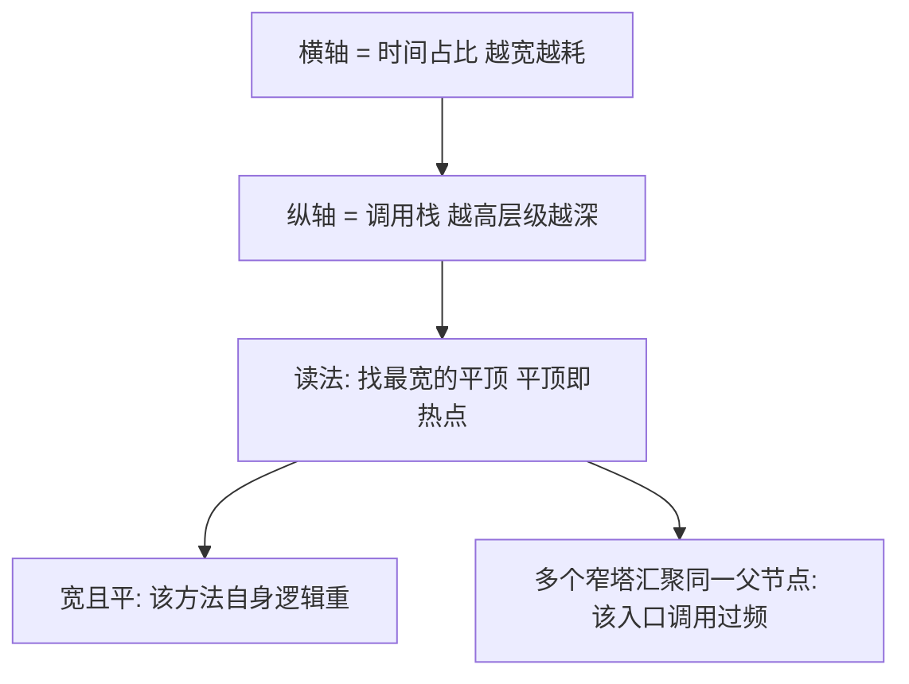
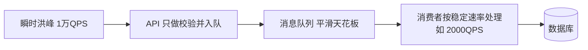
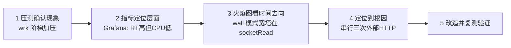

# 14 性能调优与监控

> 前置知识：[[java/3工程化/13_CICD流水线|CICD流水线]]。本章是工程实战篇，重点是建立"先测量再优化"的方法论，走通从压测到火焰图定位再到修复的完整链路。

---

## 一、性能指标体系

### 1.1 四个核心指标

| 指标 | 定义 | 关注点 |
|------|------|--------|
| QPS / TPS | 每秒查询/事务数 | 系统容量上限 |
| RT 响应时间 | 一次请求耗时 | 用户体感 |
| P95 / P99 | 95%/99% 分位响应时间 | 长尾体验 |
| 吞吐 vs 延迟 | 单位处理量 vs 单次耗时 | 二者需要权衡 |

### 1.2 为什么必须看分位数而不是平均值

平均响应 50ms 听起来很好，但可能是一半请求 5ms、一半请求 95ms——后者意味着一半用户在忍受慢接口。**平均值会掩盖长尾，P99 才是用户真实体验的上界**。

```text
假设 100 个请求：
99 个 10ms + 1 个 2000ms
平均值 = (990+2000)/100 ≈ 30ms   看起来健康
P99    = 2000ms                  实际上每 100 人就有 1 人等了 2 秒
```

另一个陷阱：**P99 只在流量足够大时才稳定**。每秒只有几个请求时，P99 抖动巨大，别被吓到也别被骗。

### 1.3 吞吐与延迟的关系

低负载下两者独立；接近容量上限时延迟陡增（排队论效应）。扩容前先问自己：目标是"扛住双倍流量"还是"P99 从 300ms 降到 80ms"，答案不同，优化方向完全不同。

---

## 二、压测工具：JMeter 与 wrk

### 2.1 JMeter 入门

GUI 适合配置，正式压测用命令行模式跑（GUI 本身吃资源会污染结果）：

```bash
jmeter -n -t book-api.jmx -l result.jtl -e -o report/
# -n 非 GUI  -t 测试计划  -l 结果文件  -o HTML 报告目录
```

最小测试计划要素：线程组（并发数、ramp-up 时间）、HTTP 请求、断言、监听器。适合复杂场景：登录态传递、CSV 参数化数据、响应内容断言。

### 2.2 wrk：轻量压测一把梭

```bash
wrk -t4 -c100 -d30s --latency http://localhost:8080/api/books/1
# -t 4个线程  -c 保持100连接  -d 压30秒
```

输出关键行：

```text
Requests/sec:  8231.45
Latency Distribution
   50%   11.20ms
   75%   19.80ms
   90%   31.50ms
   99%   88.30ms
```

### 2.3 压测纪律（线上经验）

1. **压测环境要和生产同构**，至少内存和 CPU 配置对齐，否则数字没有意义；
2. **先单接口摸底，再混合场景**；
3. **观察服务端而不是只看客户端数字**：压测机带宽不够、TIME_WAIT 打满都会造成假瓶颈；
4. **阶梯加压找拐点**：并发 50/100/200/400 各压一轮，QPS 不再上涨而延迟陡增的点就是系统容量；
5. 千万别对生产库直接全量压测，注意测试数据隔离与影子表。

---

## 三、基准测试为什么不能靠 System.currentTimeMillis

### 3.1 手写计时的三宗罪

```java
long start = System.currentTimeMillis();
sort(data);
System.out.println(System.currentTimeMillis() - start);
```

1. **JIT 会消除死代码**：如果 sort 的结果没被使用，JIT 可能整个删掉这段计算，你测的是"什么都不做"的时间；
2. **JIT 需要预热**：前几千次执行跑在解释器里，冷热路径速度差几十倍，测早了偏慢测晚了偏快；
3. **currentTimeMillis 精度粗且受系统时钟调整影响**（NTP 校时会让时间倒流），度量时长应使用 `System.nanoTime()`。

### 3.2 JMH：官方基准测试框架

```xml
<dependency>
    <groupId>org.openjdk.jmh</groupId>
    <artifactId>jmh-core</artifactId>
    <version>1.37</version>
    <scope>test</scope>
</dependency>
```

```java
@BenchmarkMode(Mode.AverageTime)
@OutputTimeUnit(TimeUnit.MICROSECONDS)
@State(Scope.Thread)
@Warmup(iterations = 5, time = 1)     // 预热：让 JIT 完成编译
@Measurement(iterations = 5, time = 1)
@Fork(2)                              // 两个独立 JVM 进程取均值
public class StringJoinBenchmark {

    private String[] parts;

    @Setup
    public void setup() {
        parts = new String[]{"a", "b", "c", "d"};
    }

    @Benchmark
    public String stringPlus() {
        String s = "";
        for (String p : parts) s += p;
        return s;                     // 返回结果防止死码消除
    }

    @Benchmark
    public String stringBuilder() {
        StringBuilder sb = new StringBuilder();
        for (String p : parts) sb.append(p);
        return sb.toString();
    }
}
```

要点：

- `@Warmup` 对抗预热问题；
- **返回基准方法的结果**防止 JIT 死码消除（不消费的结果会被优化掉），也可用 `Blackhole.consume(...)` 显式消费；
- `@Fork` 多进程避免历史编译状态干扰。

结论示例：少量字符串拼接差距不大，但循环万次拼接中 `+=` 因不断创建新对象比 StringBuilder 慢一个数量级——这类结论只能由 JMH 给出，拍脑袋猜经常错。

---

## 四、JFR 与 JMC：飞行记录仪

### 4.1 JFR 是什么

Java Flight Recorder 是内置于 JVM 的低开销事件记录器（开销通常低于 1%），可以长期开着，出事时把最近一段的飞行数据拉出来分析。

```bash
# 记录 120 秒到文件
jcmd <pid> JFR.start name=diag duration=120s filename=/tmp/diag.jfr settings=profile

# 立即 dump 已有记录
jcmd <pid> JFR.dump filename=/tmp/now.jfr

# 查看可用事件
jcmd <pid> JFR.check
```

启动参数方式常驻开启：

```bash
-XX:StartFlightRecording=maxsize=200m,maxage=12h,disk=true
```

### 4.2 分析

用 JDK Mission Control（JMC）打开 .jfr 文件：Method Profiling 视图看热点方法、Memory 视图看分配压力与 GC 情况、异常视图看高频抛出的异常。典型用法是对比"正常时段"与"卡顿时段"两份 recording，差异处就是嫌疑犯。

---

## 五、async-profiler 与火焰图

### 5.1 生成火焰图

```bash
# 采样 60 秒输出交互式火焰图
./asprof -d 60 -f /tmp/flame.html <pid>

# 按事件类型采样
./asprof -e cpu -d 60 -f cpu.html <pid>       # CPU 热点
./asprof -e alloc -d 60 -f alloc.html <pid>   # 分配热点
./asprof -e wall -d 60 -f wall.html <pid>     # 墙钟：含 IO 等待
```

### 5.2 火焰图怎么读



四条经验：

1. **平顶就是热点**：顶部越平越宽，该方法消耗的采样占比越大；
2. **颜色按包名区分**（绿色业务代码、黄色 JDK、红色底层 C++），颜色本身不代表好坏；
3. **对比着看**：优化前后各采一张，宽度变化就是收益证明；
4. wall 模式下大量宽度落在 socket read 上，说明瓶颈在网络等待而非 CPU——此时改代码无用，要改架构。

线上案例：某接口 P99 突增，火焰图显示 40% 宽度落在日志里拼 JSON 的 `String.format` 上，改成占位符后 P99 减半。**火焰图的魅力在于直接告诉你时间去哪了，不用猜。**

---

## 六、慢 SQL 定位：slow log + EXPLAIN

### 6.1 开启 MySQL 慢查询日志

```sql
SET GLOBAL slow_query_log = ON;
SET GLOBAL long_query_time = 0.5;      -- 超 500ms 记录
SET GLOBAL log_queries_not_using_indexes = ON;
```

生产建议长期开着 slow log，配合 pt-query-digest 或 RDS 自带慢 SQL 面板聚合 top N。

### 6.2 EXPLAIN 怎么看

```sql
EXPLAIN SELECT * FROM book WHERE title = 'Java核心技术';
```

重点列速查：

| 列 | 危险信号 | 说明 |
|----|----------|------|
| type | ALL | 全表扫描；至少要到 ref/range |
| key | NULL | 没走索引 |
| rows | 巨大 | 预估扫描行数 |
| Extra | Using filesort / Using temporary | 额外排序/临时表 |

修法优先级：补索引 > 改写 SQL（去 select *、拆大事务）> 加缓存 > 读写分离。联合索引注意最左前缀原则；索引不是越多越好，写多读少的表要节制。

线上踩坑：某天慢 SQL 突然增多但 SQL 没变——结果是统计信息过期导致优化器选错索引，`ANALYZE TABLE` 后恢复。**SQL 变慢不一定 SQL 有问题**。

---

## 七、缓存三大经典问题与 Cache Aside

### 7.1 Cache Aside 模式

```text
读: 先查缓存 -> 命中返回; 未命中查库 -> 回填缓存 -> 返回
写: 先更新数据库 -> 再删除缓存
```

为什么是"删缓存"而不是"更新缓存"：并发写时更新缓存容易出现旧值覆盖新值，删除让下次读取自然重建，简单且不易错。

### 7.2 穿透、击穿、雪崩对策表

| 问题 | 定义 | 典型场景 | 对策 |
|------|------|----------|------|
| 缓存穿透 | 查询根本不存在的数据，每次都打穿到 DB | 恶意请求 id=-1 | 缓存空值(短TTL)；布隆过滤器前置拦截 |
| 缓存击穿 | 某个热点 key 过期瞬间，海量请求同时打到 DB | 秒杀商品详情 | 互斥锁重建(只放一个请求回源)；热点 key 逻辑过期 |
| 缓存雪崩 | 大批 key 同时失效或缓存实例宕机 | 凌晨统一 TTL 到期 | TTL 加随机打散；多级缓存；集群高可用+限流兜底 |

布隆过滤器一句话原理：位数组加多个哈希函数判断"一定不存在或可能存在"，把不存在的 key 在进 DB 前拦下来，代价是极小误判率且不支持删除。

互斥锁思路：未命中时先 `SETNX lock:key` 抢锁，抢到的回源建缓存再释放锁，没抢到的短暂等待后重读缓存，保证 DB 只被打一次。

---

## 八、MQ 削峰填谷

突发流量超过下游处理能力时，与其硬扛不如排队：



- 生产端：接口校验后入队即返回，RT 从几百 ms 变几 ms；
- 消费端：固定并发慢慢消化，高峰期消息堆积在队列里，只要消费速率大于长期平均值就能追平；
- 代价：**异步化带来最终一致**，用户不能立刻看到结果，需要状态查询接口或完成通知；
- 必须配套：消费幂等（重复投递）、堆积告警阈值、死信队列兜底。

---

## 九、Micrometer + Prometheus + Grafana 监控三件套

### 9.1 接入 Spring Boot

```xml
<dependency>
    <groupId>org.springframework.boot</groupId>
    <artifactId>spring-boot-starter-actuator</artifactId>
</dependency>
<dependency>
    <groupId>io.micrometer</groupId>
    <artifactId>micrometer-registry-prometheus</artifactId>
</dependency>
```

```yaml
# application.yml
management:
  endpoints:
    web:
      exposure:
        include: health,prometheus,metrics
  metrics:
    tags:
      application: book-api     # 全局标签，多应用区分用
```

访问 `/actuator/prometheus` 就能看到文本格式的指标：

```text
http_server_requests_seconds_count{uri="/api/books/{id}"} 1523
http_server_requests_seconds_sum{uri="/api/books/{id}"} 18.42
jvm_memory_used_bytes{area="heap"} 2.1E8
```

Prometheus 侧配置抓取任务，Grafana 导入 Spring Boot 官方仪表盘模板（如 JVM 看板 4701），即可得到 QPS、P99、JVM 内存、GC 次数的实时曲线。

### 9.2 该盯哪些指标

| 类别 | 关键指标 | 告警思路 |
|------|----------|----------|
| 接口 | http_server_requests 的 P95/P99、错误率 | P99 超 SLA 或 5xx 率突增 |
| JVM | 堆使用、GC 停顿次数/时长 | Full GC 频繁 |
| 资源 | CPU、容器内存、连接池活跃数 | 连接池接近上限 |

原则：**告警必须可行动**。半夜把人叫起来却无事可做的告警，很快就会被所有人屏蔽。

---

## 十、实战：慢接口的完整定位链路

### 10.1 故意的坏代码：同步调外部 HTTP

```java
@GetMapping("/api/report/{userId}")
public ReportVO report(@PathVariable Long userId) {
    // 内部串行调用三个外部 HTTP 接口，各耗时约 200ms
    UserCredit credit = creditClient.get(userId);      // 同步阻塞
    RiskLevel risk = riskClient.get(userId);           // 同步阻塞
    List<Order> orders = orderClient.list(userId);     // 同步阻塞
    return new ReportVO(credit, risk, orders);
}
```

上线后 wrk 一压：`Requests/sec: 4.8`，P99 高达 680ms。

### 10.2 定位链路五步走



解读第 2 步：RT 很高但 CPU 使用率很低——典型的"等出来的慢"不是"算出来的慢"。第 3 步 wall 火焰图证实：大部分宽度在 `SocketInputStream.socketRead0`，调用栈来自三次远程调用。

### 10.3 改造：并行化异步调用

```java
@GetMapping("/api/report/{userId}")
public CompletableFuture<ReportVO> report(@PathVariable Long userId) {
    CompletableFuture<UserCredit> c =
            CompletableFuture.supplyAsync(() -> creditClient.get(userId), ioPool);
    CompletableFuture<RiskLevel> r =
            CompletableFuture.supplyAsync(() -> riskClient.get(userId), ioPool);
    CompletableFuture<List<Order>> o =
            CompletableFuture.supplyAsync(() -> orderClient.list(userId), ioPool);

    return c.thenCombine(r, (credit, risk) -> new Object[]{credit, risk})
            .thenCombine(o, (pair, orders) -> new ReportVO(
                    (UserCredit) pair[0], (RiskLevel) pair[1], orders));
}

@Bean(destroyMethod = "shutdown")
ExecutorService ioPool() {
    return new ThreadPoolExecutor(20, 50, 60, TimeUnit.SECONDS,
            new LinkedBlockingQueue<>(500),
            Thread.ofPlatform().name("io-", 0).factory());
}
```

要点：

1. 三次调用从串行 600ms 变并行取最慢者约 200ms；
2. IO 密集线程池线程数可以远大于 CPU 核数（区别于 CPU 密集型）；
3. 必须自定义线程池并指定有界队列，**绝不用默认 ForkJoinPool.commonPool**——它会和所有其他 parallel 流任务抢线程。

### 10.4 复测验证

```text
改造前: Requests/sec: 4.8    P99 680ms
改造后: Requests/sec: 41.0   P99 230ms
```

数字提升约 8.5 倍，符合"三路并行"的理论预期。最后补两件事：给该接口加上超时与降级（外部服务挂了返回兜底数据而非雪崩），并把这次的经验写进团队 wiki。

### 10.5 方法论总结

1. **没有测量就没有优化**：先压测拿到基线数字；
2. **指标定层面、火焰图定位置、日志定参数**：三层工具各司其职；
3. **改完必须复测对比**，拿数据证明收益；
4. **警惕过早优化**：业务量级不到的接口不值得花这个功夫，先写对再写快。

---

## 本章小结

- 看 QPS 与 P95/P99 分位数，平均值会撒谎；
- 压测找容量拐点：JMeter 适合复杂场景，wrk 适合快速摸底；
- 手写 currentTimeMillis 计时会被 JIT 骗，基准测试认准 JMH 的 Warmup 与死码消除防御；
- JFR 低开销常驻记录，async-profiler 火焰图找平顶即热点，wall 模式区分"算得慢"与"等得慢"；
- 慢 SQL 从 slow log 入手 EXPLAIN 定性，SQL 不变也可能因统计信息漂移而变慢；
- 缓存三兄弟：穿透挡布隆、击穿上互斥、雪崩靠打散，Cache Aside 写后删；
- Micrometer+Prometheus+Grafana 让系统可观测，告警必须可行动；
- 定位链路：压测确认、指标分层、火焰图定位、改造复测，全程用数据说话。

> 这是工程实战篇最后一章。回到 [[java/java目录|Java 教程目录]] 复盘整个体系。

