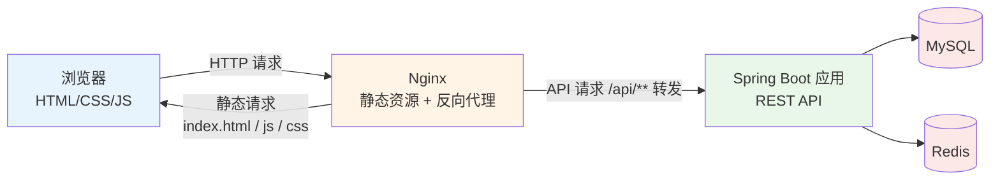
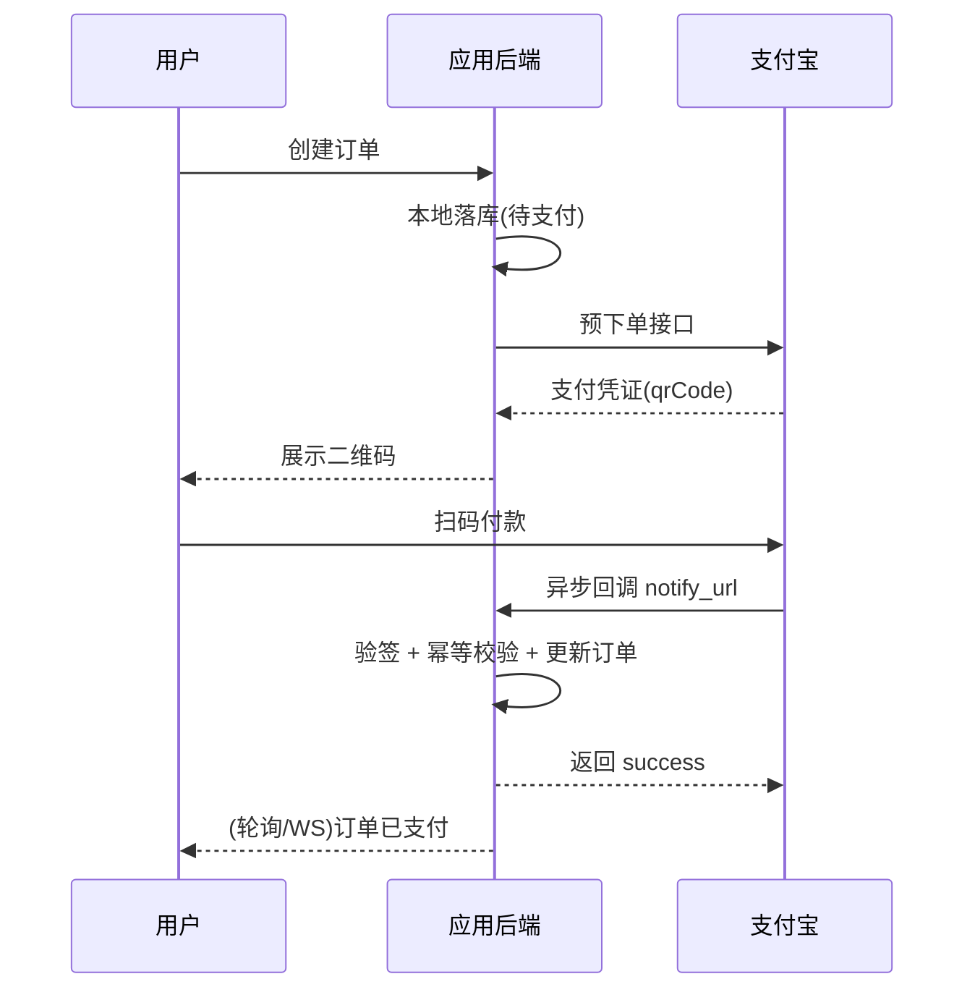

# 15 全栈开发技巧

> 前置知识：[[java/3工程化/06_Spring Boot快速开发|Spring Boot快速开发]]、[[java/3工程化/07_Spring MVC|Spring MVC]]。本章是工程实战篇，讲"一个人把产品做上线"的全套经验：前后端怎么协作、接口怎么约定、文件邮件定时支付怎么落地。目标不是把你培养成前端专家，而是**以 Java 后端为核心，前端能力够用**。

---

## 一、Java 全栈的定位：后端为核心，前端够用

| 能力层 | 要求 | 说明 |
|--------|------|------|
| 后端（核心） | 精通 | Spring Boot、数据库、缓存、接口设计，这是吃饭的家伙 |
| 前端（够用） | 会用 | 能写增删改查页面、能调接口、能看懂 Vue/React 组件 |
| 部署（必须） | 熟练 | Nginx、Linux、日志排查，第 16 章专门讲 |
| 设计（审美） | 不追求 | 复杂交互、动画、可视化交给专业前端 |

为什么后端为核心？**业务逻辑都在后端**——订单、库存、权限、事务，这些是系统的价值所在也是 bug 的重灾区；**前端框架三年一换**——jQuery 到 React/Vue 再到未来未知，而后端思想（分层、事务、一致性）二十年没变；**面试与薪资**——Java 岗位量远大于纯前端，后端深度才是议价筹码。

"够用"的具体标准：拿到原型图，能用 Vue3 或原生 JS 写出能用的管理页——表单提交、列表展示、删除确认、加载状态，不追求美观。时间分配遵循 80/20：80% 投后端深度（并发、JVM、分布式），20% 维持前端手感——HTML/CSS 过一遍、JS 会 fetch 调接口、Vue3 官方教程走一遍，之后遇到需求现查文档即可。

---

## 二、前后端分离架构

### 2.1 整体架构图



关键理解：**浏览器只和 Nginx 打交道**。请求页面时 Nginx 返回静态 HTML/JS；页面里的 JS 再向 `/api/xxx` 发请求，Nginx 把这类请求转发给 Spring Boot 进程。前后端物理分离，靠 HTTP 契约连接。

### 2.2 为什么不推荐模板渲染起步

老式 JSP/Thymeleaf（后端拼好完整 HTML 吐给浏览器）并非一无是处——SEO 友好、首屏快。但分离架构在协作（改按钮不必动后端模板，靠接口契约对齐）、复用（一套 API 供网页与 App 共用）、部署（前端静态文件独立发布）、排障（按接口定位边界清晰）四个维度上有压倒性优势。

---

## 三、OpenAPI 先行：契约驱动开发

传统流程是后端写完接口给文档——文档永远滞后。"先行"指**先定义契约并达成一致，双方并行开发**：过需求，列出接口清单（URL、方法、入参、出参），后端写空实现返回假数据并生成文档，前端基于 Mock 开发，联调时理论上一次通过。

```xml
<dependency>
    <groupId>org.springdoc</groupId>
    <artifactId>springdoc-openapi-starter-webmvc-ui</artifactId>
    <version>2.5.0</version>
</dependency>
```

启动后访问 `http://localhost:8080/swagger-ui.html` 即可看到全部接口的交互式文档，还能直接在页面上调试。在类与方法上补注解可以让文档更专业：`@Tag(name = "待办管理")` 标注 Controller 分组，`@Operation(summary = "分页查询待办")` 描述方法用途，`@Parameter(description = "页码")` 说明参数含义。

线上经验：生产环境记得关闭 swagger-ui（`springdoc.api-docs.enabled=false`），接口清单暴露在公网等于给攻击者送地图。

---

## 四、接口版本管理：/api/v1/

接口一旦有外部消费方（前端已上线、小程序、第三方），你就失去了随意修改的权利。把 `userName` 改成 `username` 这种"小改动"，足以让对方页面白屏。版本化给破坏性变更留缓冲——新版本 `/api/v2/users` 上线期间 v1 继续维护。实现最简单可靠的方式是把版本写进 RequestMapping，v1 与 v2 共享 Service 层，只有 Controller/VO 不同。

版本演进守则：

| 变更类型 | 是否需要新版本 |
|----------|----------------|
| 出参新增可选字段 | 否，向后兼容 |
| 新增接口 | 否 |
| 修改字段含义或类型 | 是 |
| 删除或重命名字段 | 是 |
| 新增必填参数 | 是（旧版保留默认值） |

---

## 五、统一响应与错误码规范

全站统一一种信封结构，前端不用面对十种返回格式：

```java
public class ApiResult<T> {
    private int code;       // 业务码,0 表示成功
    private String message; // 人读的信息,可直接展示
    private T data;         // 业务数据

    public static <T> ApiResult<T> ok(T data) { /* code=0, message="success" */ }
    public static <T> ApiResult<T> fail(ErrorCode ec) { /* code/message 取自枚举 */ }
}
```

配合 `@RestControllerAdvice` 全局异常处理，保证任何异常都变成统一信封而不是堆栈页：`BusinessException` 直接取其 ErrorCode 转成信封；`MethodArgumentNotValidException`（参数校验失败）转 PARAM_INVALID 并把字段错误拼进 message；兜底的 `Exception` 处理器只返回"系统繁忙"，详细堆栈进日志——把堆栈返回给前端是信息泄露。

错误码分段规划，一眼看出问题在哪一层：

| 区间 | 含义 | 示例与前端行为 |
|------|------|----------------|
| 0 | 成功 | 0，正常处理数据 |
| 10000-10999 | 参数/校验类 | 10001 参数缺失，表单标红提示 |
| 11000-11999 | 认证授权类 | 11001 未登录、11002 token 过期，跳登录页 |
| 12000-12999 | 业务规则类 | 12001 库存不足，toast 展示 message |
| 13000-13999 | 资源类 | 13001 数据不存在，提示后刷新列表 |
| 50000+ | 系统内部错误 | 50000 未知异常，提示稍后再试 |

HTTP 状态码与业务码的关系：401/404/500 这类协议级状态码照常使用（Nginx、网关、监控依赖它们），业务细节放 body 的 code 里，两层各司其职。

---

## 六、Nginx 跨域代理：一份完整的 conf

开发时前端 Vite 在 5173、后端在 8080，端口不同即跨域。团队最常见的解法不是后端加 CORS 头，而是**让所有请求看起来同源**——开发环境用 Vite 的 proxy，生产环境用 Nginx：

```nginx
server {
    listen       80;
    server_name  todo.example.com;

    root   /var/www/todo/dist;      # 前端打包产物
    index  index.html;

    gzip on;
    gzip_types text/css application/javascript application/json;

    # 单页应用路由兜底:/todo/detail 磁盘上没有对应文件,
    # 必须回退 index.html 交给前端路由接管,否则刷新就 404
    location / {
        try_files $uri $uri/ /index.html;
    }

    # API 反向代理
    location /api/ {
        proxy_pass http://127.0.0.1:8080/api/;
        proxy_set_header Host            $host;
        proxy_set_header X-Real-IP       $remote_addr;
        proxy_set_header X-Forwarded-For $proxy_add_x_forwarded_for;
    }

    # WebSocket 升级支持(聊天室必需)
    location /ws/ {
        proxy_pass http://127.0.0.1:8080/ws/;
        proxy_http_version 1.1;
        proxy_set_header Upgrade    $http_upgrade;
        proxy_set_header Connection "upgrade";
    }
}
```

三个最容易踩的坑：

1. 忘配 `try_files ... /index.html`，Vue Router 的 history 模式刷新必 404；
2. `proxy_pass` 结尾带不带 `/` 含义不同：带 `/` 是替换前缀，不带是原样拼接，搞错就 404；
3. WebSocket 不配 Upgrade 头，握手失败且报错隐晦。

---

## 七、WebSocket 聊天室示例

依赖只需 `spring-boot-starter-websocket`，配置类加 `@EnableWebSocket` 并注册 `registry.addHandler(new ChatHandler(), "/ws/chat")`。核心 Handler：

```java
@Component
public class ChatHandler extends TextWebSocketHandler {

    private static final Set<WebSocketSession> SESSIONS = ConcurrentHashMap.newKeySet();

    @Override
    public void afterConnectionEstablished(WebSocketSession session) {
        SESSIONS.add(session);
        broadcast("系统: " + session.getId() + " 进入了房间");
    }

    @Override
    protected void handleTextMessage(WebSocketSession session, TextMessage message) {
        broadcast(session.getId() + ": " + message.getPayload());
    }

    @Override
    public void afterConnectionClosed(WebSocketSession session, CloseStatus status) {
        SESSIONS.remove(session);
    }

    // WebSocket 会话不能并发写,广播要加同步
    private synchronized void broadcast(String text) {
        for (WebSocketSession s : SESSIONS) {
            try { if (s.isOpen()) s.sendMessage(new TextMessage(text)); }
            catch (IOException e) { SESSIONS.remove(s); }
        }
    }
}
```

客户端极简版：`new WebSocket("ws://localhost:8080/ws/chat")`，`onmessage` 收消息追加到页面，`ws.send(text)` 发消息，十几行原生 JS 就是一个聊天室。

线上经验：Nginx 默认掐掉空闲几十秒的连接，生产聊天室必须有心跳（客户端定时 ping），否则用户挂机回来发现"假在线"；会话不能并发写，广播要加同步或改用队列；多实例部署时广播要走 Redis Pub/Sub——你的 SESSIONS 里只有连到本机的那部分人。

---

## 八、文件上传下载

上传的安全四件套——配置限额、大小兜底、扩展名白名单、重命名防穿越：

```yaml
spring:
  servlet:
    multipart:
      max-file-size: 10MB      # 单文件上限
      max-request-size: 20MB   # 单次请求总上限
```

```java
private static final Set<String> ALLOWED_EXT = Set.of("jpg", "png", "gif", "pdf");

@PostMapping(value = "/upload", consumes = MediaType.MULTIPART_FORM_DATA_VALUE)
public ApiResult<String> upload(@RequestParam("file") MultipartFile file) throws IOException {
    if (file.isEmpty() || file.getSize() > 10 * 1024 * 1024) {         // 大小兜底校验
        throw new BusinessException(ErrorCode.PARAM_INVALID);
    }
    String ext = FilenameUtils.getExtension(file.getOriginalFilename()).toLowerCase();
    if (!ALLOWED_EXT.contains(ext)) {                                  // 白名单,绝不用黑名单
        throw new BusinessException(ErrorCode.PARAM_INVALID);
    }
    // 重命名:绝不使用用户原始文件名;normalize+startsWith 防路径穿越(../../etc/passwd)
    Path target = Paths.get("/data/upload", UUID.randomUUID() + "." + ext).normalize();
    if (!target.startsWith("/data/upload")) throw new BusinessException(ErrorCode.PARAM_INVALID);
    Files.createDirectories(target.getParent());
    file.transferTo(target);
    return ApiResult.ok("/files/" + target.getFileName());
}
```

本地存储 vs 对象存储：

| 维度 | 本地磁盘 | 云 OSS(S3/OSS/COS) |
|------|----------|--------------------|
| 成本 | 服务器盘便宜 | 按 GB/月付费 |
| 扩容 | 加盘麻烦，多机无法共享 | 天然无限，CDN 加速 |
| 可靠性 | 服务器挂了文件也没了 | 多副本持久性 11 个 9 |
| 适用 | 个人项目、内网工具 | 生产环境标配 |

生产建议：本地只做中转，正式文件传 OSS，数据库存 objectKey；下载走预签名 URL，文件流量完全不经过应用服务器。下载接口必须校验路径白名单，否则 `/download?path=/etc/passwd` 就是教科书级漏洞。

---

## 九、EasyExcel 流式读写防 OOM

POI 的 `XSSFWorkbook` 把整个工作簿解析进内存，50 万行的 xlsx 能吃掉 2GB 以上堆——导出报表打挂服务是经典线上事故。EasyExcel 逐行读写，内存占用恒定在几 MB。流式读用监听器模式，每 1000 条批量入库：

```java
public class OrderListener implements ReadListener<OrderRow> {
    private static final int BATCH = 1000;
    private final List<OrderRow> buffer = new ArrayList<>(BATCH);
    private final OrderService orderService;   // 构造注入,不能用 Spring 自动装配

    @Override
    public void invoke(OrderRow row, AnalysisContext context) {
        buffer.add(row);
        if (buffer.size() >= BATCH) {
            orderService.saveBatch(new ArrayList<>(buffer));
            buffer.clear();                    // 关键:清空引用,GC 才能回收
        }
    }

    @Override
    public void doAfterAllAnalysed(AnalysisContext context) {
        if (!buffer.isEmpty()) orderService.saveBatch(buffer);
    }
}
// 使用:行模型 OrderRow 用 @ExcelProperty("订单号") 映射列名
EasyExcel.read(file.getInputStream(), OrderRow.class, new OrderListener(orderService))
        .sheet().doRead();
```

导出同理不能一次性查全表，分页查询加分批写入：

```java
try (ExcelWriter writer = EasyExcel.write(response.getOutputStream(), OrderRow.class).build()) {
    WriteSheet sheet = EasyExcel.writerSheet("订单").build();
    for (int page = 1; ; page++) {
        List<OrderRow> rows = orderMapper.selectPage(Page.of(page, 5000)).getRecords();
        if (rows.isEmpty()) break;
        writer.write(rows, sheet);
    }
}
```

线上经验：导出接口务必限流并限制同一用户并发任务数，几个用户同时点导出就能把服务拖垮。

---

## 十、邮件发送：starter-mail

引入 `spring-boot-starter-mail` 后，在 yaml 里配置 `spring.mail.host/username/password`（密码走环境变量绝不硬编码）并开启 `mail.smtp.ssl.enable` 与 `mail.smtp.auth`。发送方法必须 `@Async`——SMTP 握手加发送通常要一到三秒，同步调用会卡死主流程：

```java
@Async
public void sendVerifyCode(String to, String code) {
    SimpleMailMessage msg = new SimpleMailMessage();
    msg.setFrom(from);
    msg.setTo(to);
    msg.setSubject("您的验证码");
    msg.setText("验证码:" + code + ",5 分钟内有效。若非本人操作请忽略。");
    mailSender.send(msg);
}
```

线上经验：SMTP 超时是常态必须异步化，注册接口因邮件服务器抖动而超时是最常见的连带故障；免费邮箱每日限额很低，量大换专业服务商（SendGrid/阿里邮件推送）；HTML 邮件别用外部 CSS，多数客户端不支持，要用内联样式。

---

## 十一、定时任务

### 11.1 Spring 自带的 @Scheduled

```java
/** 每天 02:30 清理过期验证码 */
@Scheduled(cron = "0 30 2 * * ?")
public void cleanExpiredCodes() { ... }

/** 每 5 分钟对账。fixedDelay:上次执行【结束】后再等 5 分钟,不会重叠 */
@Scheduled(fixedDelay = 300_000)
public void reconcile() { ... }
```

cron 六位表达式：秒、分、时、日、月、周，其中日与周互斥（一个写 `?`）。常用值：`0 0 12 * * ?` 每天中午；`0 */5 * * * ?` 每 5 分钟；`0 30 2 * * ?` 每天凌晨 2:30；`0 0 10 ? * MON-FRI` 工作日上午十点。注意 fixedRate 是固定频率触发、可能与慢任务重叠，fixedDelay 更安全。

单机够用的前提：任务幂等且允许偶尔不准时。但部署两台实例，同一个 cron 就会执行两次——清理类无所谓，扣款类就是事故。

### 11.2 XXL-JOB：分布式调度概念

一句话架构：**调度中心（按时触发）+ 执行器（你的应用，干活）**。

| 特性 | @Scheduled | XXL-JOB |
|------|------------|---------|
| 多实例重复执行 | 会重复 | 路由策略保证单节点执行(轮询/故障转移) |
| 动态改时间 | 要改代码重启 | 后台点一下 |
| 手动触发/补跑 | 不行 | 支持 |
| 失败告警 | 自己写 | 邮件/webhook 内置 |

选型：单实例小项目 @Scheduled 足够；两个以上实例或有运维诉求就上 XXL-JOB。面试常问的分片广播：大任务切 N 片，每节点按 `userId % 节点数` 认领自己那片，横向加速。

---

## 十二、支付对接思路（支付宝沙箱为例）

核心难点不在调 API，而在**异步回调的正确处理**：



没回 success 时支付宝按 4m、10m 直到 24h 的间隔重试最多 8 次。回调处理三个铁律：

```java
@PostMapping("/alipay/notify")
public String handleNotify(HttpServletRequest request) {
    Map<String, String> params = parseParams(request);
    // 铁律一:验签。任何人都能伪造 POST,验签通过才可信
    boolean signOk = AlipaySignature.rsaCheckV1(params, ALIPAY_PUBLIC_KEY, "UTF-8", "RSA2");
    if (!signOk) return "failure";
    // 铁律二:核实交易状态与金额
    if (!"TRADE_SUCCESS".equals(params.get("trade_status"))) return "failure";
    Order order = orderMapper.selectByOutTradeNo(params.get("out_trade_no"));
    if (order == null || order.getAmount().compareTo(new BigDecimal(params.get("total_amount"))) != 0) {
        return "failure";
    }
    // 铁律三:幂等。UPDATE orders SET status='PAID' WHERE id=? AND status='UNPAID'
    int updated = orderMapper.markPaidIfUnpaid(order.getId(), params.get("trade_no"));
    return updated >= 0 ? "success" : "failure";   // 影响行数 0 = 已处理过,照样回 success
}
```

沙箱环境提供测试网关与账号，务必把"支付成功""支付失败""回调丢失补偿"三种情况都演练一遍。兜底方案：定时扫描超时未支付订单，主动调用支付宝查询接口对账。

---

## 十三、前端认知地图

| 维度 | Vue3 | React |
|------|------|-------|
| 心智负担 | 低，模板直观，中文文档一流 | 中高，一切皆 JSX，生态选择多而杂 |
| 国内就业 | 中小厂、管理后台占主导 | 大厂、复杂 C 端为主 |
| 上手速度 | 有 HTML 基础约一周能干活 | 需要 JS 功底更扎实 |
| 配套生态 | Pinia/Vue Router 官方一条龙 | 状态管理社区混战 |

结论：Java 后端补前端，**首选 Vue3**。React 值得了解但不必双修。"够用"的最小知识清单：组合式 API（setup/ref/computed）、模板指令（v-if/v-for/v-model/@click/:src）、props 下行 emit 上行、onMounted 发首个请求、vue-router 基本配置、axios 封装统一拦截器、Pinia 存全局状态、`npm run build` 出 dist 丢给 Nginx。

关于前端专门目录：本库正在规划独立的前端教程目录（含 Vue3 系统教程与 React 对照），完成后会在 java目录.md 与首页交叉链接。在此之前，以上清单配合官方文档足够支撑全栈实战。

---

## 十四、Postman / Apifox 协作

Postman 是国际主流接口调试器，适合个人调试与海外团队；Apifox 是文档+调试+Mock+自动化测试一体化，国内团队协作首选。

Apifox 对本章理念支持最好：导入 springdoc 生成的 `/v3/api-docs` 自动建好全部接口；前端开 Mock，后端没写完也有假数据可用；接口变更重新导入，diff 一目了然。协作规范四条：接口即文档，CI 定期同步 OpenAPI 到 Apifox 项目；dev/staging/prod 环境变量隔离，token 用变量自动传递；登录后自动设置 token 的脚本写在集合级别，新人导入即用；改接口先标 deprecated，跑一个迭代再删，给消费方缓冲期。

---

## 十五、实战：Todo 待办全栈小应用

目标："增删改查 + 标记完成"，麻雀虽小五脏俱全——统一响应、异常处理、极简前端全串起来。

### 15.1 后端

实体、请求记录与仓库：

```java
@Entity
@Table(name = "todos")
@Data
public class Todo {
    @Id
    @GeneratedValue(strategy = GenerationType.IDENTITY)
    private Long id;
    private String title;
    private Boolean done;
    private LocalDateTime createdAt;
}

public record TodoCreateReq(@NotBlank(message = "标题不能为空") @Size(max = 50) String title) {}

public interface TodoRepository extends JpaRepository<Todo, Long> {
    List<Todo> findAllByOrderByCreatedAtDesc();
}
```

Controller 与 Service：

```java
@RestController
@RequestMapping("/api/v1/todos")
@RequiredArgsConstructor
public class TodoController {

    private final TodoService service;

    @GetMapping
    public ApiResult<List<Todo>> list() { return ApiResult.ok(service.listAll()); }

    @PostMapping
    public ApiResult<Todo> create(@Valid @RequestBody TodoCreateReq req) {
        return ApiResult.ok(service.create(req.title()));
    }

    @PutMapping("/{id}/toggle")
    public ApiResult<Todo> toggle(@PathVariable Long id) { return ApiResult.ok(service.toggle(id)); }

    @DeleteMapping("/{id}")
    public ApiResult<Void> delete(@PathVariable Long id) {
        service.delete(id);
        return ApiResult.ok(null);
    }
}

// Service 层:id 不存在抛 BusinessException(TODO_NOT_FOUND),
// 由全局异常处理器转成 13001 错误码信封——业务异常与响应格式就此解耦
@Service
@RequiredArgsConstructor
public class TodoService {

    private final TodoRepository repo;

    public List<Todo> listAll() { return repo.findAllByOrderByCreatedAtDesc(); }

    public Todo create(String title) {
        Todo t = new Todo();
        t.setTitle(title.trim());
        t.setDone(false);
        t.setCreatedAt(LocalDateTime.now());
        return repo.save(t);
    }

    public Todo toggle(Long id) {
        Todo t = repo.findById(id).orElseThrow(() -> new BusinessException(ErrorCode.TODO_NOT_FOUND));
        t.setDone(!Boolean.TRUE.equals(t.getDone()));
        return repo.save(t);
    }

    public void delete(Long id) {
        if (!repo.existsById(id)) throw new BusinessException(ErrorCode.TODO_NOT_FOUND);
        repo.deleteById(id);
    }
}
```

### 15.2 极简原生 JS 页面

一个 index.html 打天下，重点是体会 fetch 与统一信封的配合：

```html
<!DOCTYPE html>
<html lang="zh">
<head>
<meta charset="UTF-8">
<title>待办清单</title>
<style>
  body { font-family: sans-serif; max-width: 480px; margin: 40px auto; }
  li { display: flex; align-items: center; gap: 8px; padding: 6px 0; }
  .done span { text-decoration: line-through; color: #999; }
  .err { color: #c00; }
</style>
</head>
<body>
<h1>今日待办</h1>
<form id="form">
  <input id="title" placeholder="要做点什么?" maxlength="50">
  <button type="submit">添加</button>
</form>
<div id="error" class="err"></div>
<ul id="list"></ul>
<script>
const API = "/api/v1/todos";
// 统一解包 ApiResult 信封:code !== 0 时抛错
async function api(path, options = {}) {
  const res = await fetch(API + path,
      { headers: { "Content-Type": "application/json" }, ...options });
  const body = await res.json();
  if (body.code !== 0) throw new Error(body.message);
  return body.data;
}
async function refresh() {
  try {
    const todos = await api("");
    const list = document.getElementById("list");
    list.innerHTML = "";
    todos.forEach(t => {
      const li = document.createElement("li");
      li.className = t.done ? "done" : "";
      const cb = document.createElement("input");
      cb.type = "checkbox"; cb.checked = t.done;
      cb.onchange = () => api(`/${t.id}/toggle`, { method: "PUT" }).then(refresh).catch(showErr);
      const span = document.createElement("span");
      span.textContent = t.title;
      const del = document.createElement("button");
      del.textContent = "删";
      del.onclick = () => api(`/${t.id}`, { method: "DELETE" }).then(refresh).catch(showErr);
      li.append(cb, span, del);
      list.appendChild(li);
    });
  } catch (e) { showErr(e); }
}
document.getElementById("form").onsubmit = async e => {
  e.preventDefault();
  const input = document.getElementById("title");
  try {
    await api("", { method: "POST", body: JSON.stringify({ title: input.value }) });
    input.value = "";
    refresh();
  } catch (e2) { showErr(e2); }
};
function showErr(e) { document.getElementById("error").textContent = e.message; }
refresh();
</script>
</body>
</html>
```

放进 `src/main/resources/static/index.html`，开发期直接 `localhost:8080` 就能玩；生产期移出去由 Nginx 托管。

### 15.3 部署检查清单

```bash
./mvnw -DskipTests package                                   # 1. 打包
nohup java -jar todo.jar --spring.profiles.active=prod &     # 2. 服务器后台运行
curl -s http://127.0.0.1:8080/api/v1/todos                   # 3. 验证接口
sudo nginx -t && sudo nginx -s reload                        # 4. Nginx reload(配置见第六节)
```

验收标准：手机浏览器打开域名能添加、勾选、删除待办，刷新不丢数据，F12 Network 里没有红色跨域报错。做到这一步，你完成了从数据库到浏览器的全链路闭环——后面章节的稳定性、源码阅读、架构设计，都是在这条链路上加深。

---

## 小结

- 全栈定位：后端为核心吃饭，前端 Vue3 够用即可，部署能力必备；
- 契约与规范先行：springdoc 加 Apifox 让前后端并行开发，统一响应信封加分段错误码是前后端扯皮的终结者，接口版本 /api/v1/ 给破坏性变更留退路；
- Nginx 是分离架构的粘合剂：try_files 兜底 SPA 路由，proxy_pass 解跨域；
- 大文件用 EasyExcel 流式处理，邮件必须异步，定时任务多实例必上调度中心；
- 支付回调三板斧：验签、核额、幂等，缺一都是资金事故。
