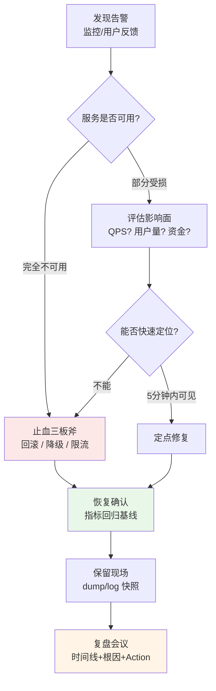
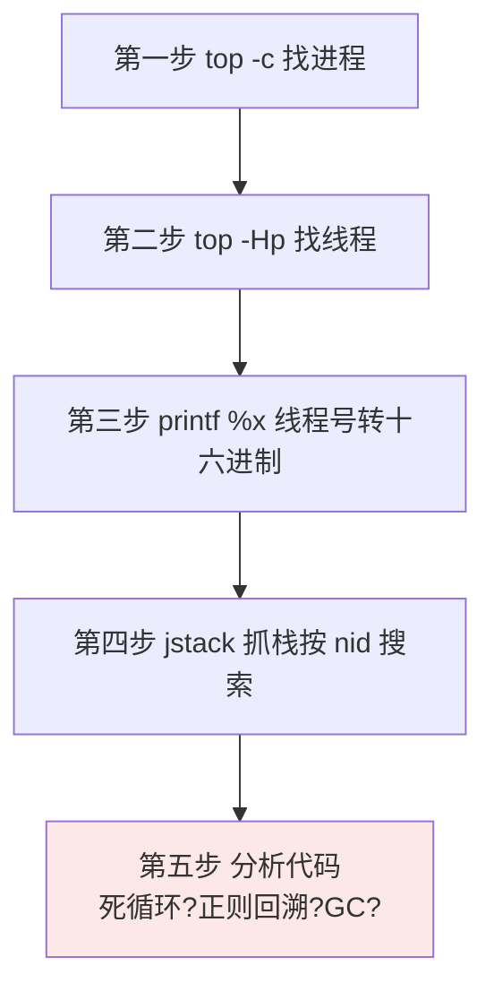
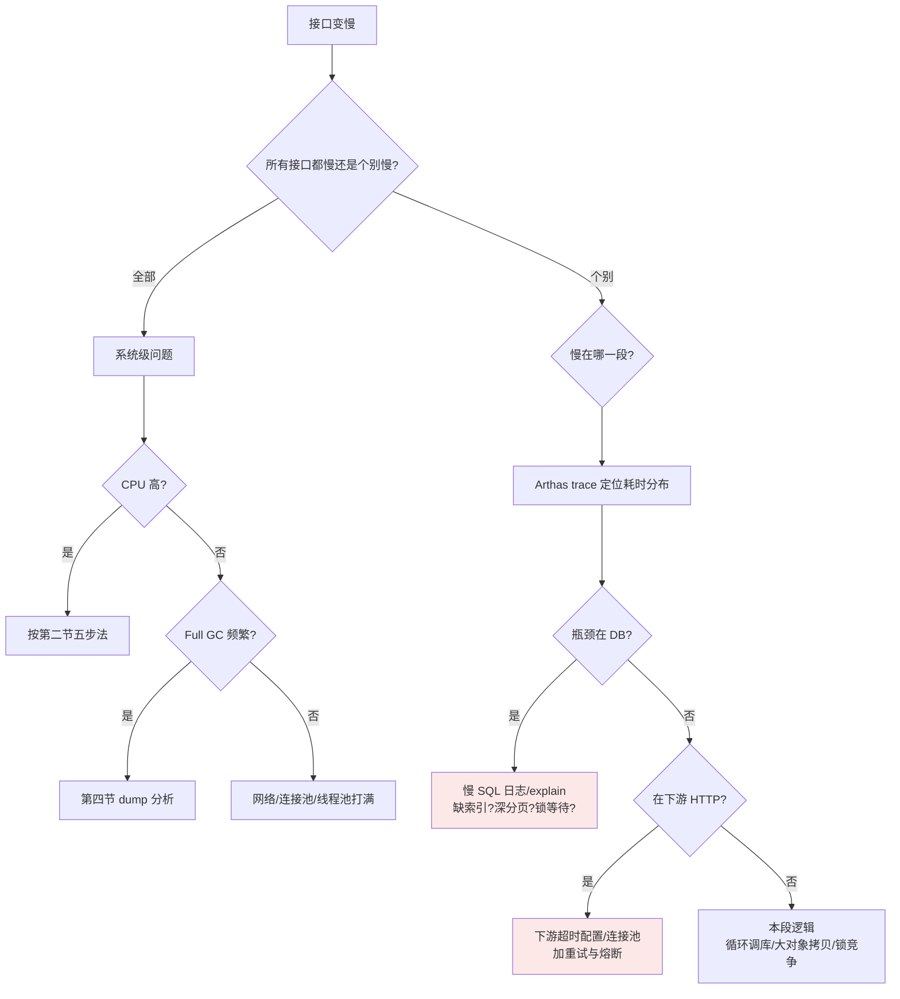

# 16 应急处理与线上问题排查

> 前置知识：[[java/3工程化/06_Spring Boot快速开发|Spring Boot快速开发]]、JVM 内存模型基础。本章是工程实战篇，全部内容围绕一个信念：**线上事故面前，止血永远优先于根因**。先让服务活下来，再慢慢查是谁干的。

---

## 一、应急 SOP：总流程

### 1.1 流程图



### 1.2 三板斧详解

| 手段 | 适用场景 | 具体动作 | 代价 |
|------|----------|----------|------|
| 回滚 | 刚发过版，怀疑新代码 | 切回上一版本镜像/包 | 新功能暂时下线 |
| 降级 | 下游依赖拖垮上游 | 关闭非核心功能(推荐流/评论)，返回兜底数据 | 体验降级 |
| 限流 | 流量突增打垮系统 | 网关层限流，超出直接拒绝 | 部分用户被拒 |

线上经验三条：

1. **止血优先于根因**。凌晨三点没人有耐心陪你分析线程栈——先把流量切走或回滚，天亮再查；
2. **止血前保留现场**。重启之前 dump 一份堆内存、保存一份日志，否则根因随进程一起消失，事故会二次发生；
3. **恢复不是结束**。没有复盘的事故大概率重演，Action 必须落到人头上带截止日期。

---

## 二、CPU 飙高：五步定位法

### 2.1 标准流程



### 2.2 命令逐条拆解

```bash
# 第一步:找到最耗 CPU 的 Java 进程(PID 假设为 12345)
top -c
# 输出按 P(CPU)排序,%CPU 列 380% 的那个 java 就是它

# 第二步:看这个进程内部哪个线程最忙
top -Hp 12345
# 记下 %CPU 最高的线程号,假设 12378

# 第三步:线程号转十六进制
printf "%x\n" 12378
# 输出 305a

# 第四步:抓线程栈并搜索
jstack 12345 > /tmp/jstack.log
grep -A 20 "nid=0x305a" /tmp/jstack.log
```

第四步的典型输出：

```text
"main" #1 prio=5 os_prio=0 tid=0x00007f8a8c009800 nid=0x305a runnable [0x00007f8a95ffe000]
   java.lang.Thread.State: RUNNABLE
        at com.demo.LoopService.busyLoop(LoopService.java:23)
        at com.demo.LoopService.run(LoopService.java:15)
        ...
```

`runnable` + 具体业务类行号，直接锁定了 LoopService.java 的第 23 行——五步完成，从告警到定位通常两分钟。

### 2.3 arthas 一键版

手动五步太慢时，阿里arthas 把它压缩成一条命令：

```bash
./as.sh 12345          # attach 到目标进程
thread -n 3            # 打印最忙的 3 个线程及堆栈
```

输出第一屏就是答案，连十六进制转换都省了。生产建议平时就装好 arthas 但不常驻（attach 有几秒停顿），出事时它是最快的刀。

### 2.4 典型原因清单

| 原因 | 特征 | 验证方式 |
|------|------|----------|
| 死循环/低效算法 | 业务线程 runnable，栈停在某个 while/for | 直接看代码行 |
| 正则回溯灾难 | 栈停在 java.util.regex.* | 检查贪婪匹配+超长输入 |
| GC 线程狂转 | 名为 GC task thread 的线程占满 CPU | jstat -gcutil 看回收频率 |
| 频繁序列化 | 栈在 JSON/反射相关帧 | 结合接口耗时定位 |

正则回溯示例——`^(a+)+$` 匹配一长串 `aaaaaaaaaaaaaaaaaaaaaaab`，回溯次数指数爆炸，单核瞬间打满。防御：避免嵌套量词、给正则加长度前置校验。

---

## 三、内存泄漏排查：jmap + MAT 支配树

### 3.1 泄漏的典型症状

老年代使用率缓慢爬升且 Full GC 后不回落；最终 OOM 或频繁 Full GC。注意区分"泄漏"与"内存不足"：前者是引用该释放没释放，后者纯粹是堆配小了或瞬时大流量。

### 3.2 排查步骤

```bash
# 1. dump 堆快照(会触发一次 Full GC,只存活对象,dump 文件约等于堆大小)
jmap -dump:live,format=b,file=/tmp/heap.hprof <pid>

# 生产大堆慎用 live,可先试不触发 GC 的全量 dump
# 2. 用 MAT(Eclipse Memory Analyzer)打开 heap.hprof
# 3. 看 Leak Suspects 报告 → 点开 Dominator Tree(支配树)
# 4. 按 retained heap 排序,找到吃掉内存最大的对象链
```

支配树的读法：retained heap 表示"如果这个对象被回收，能连带释放多少内存"。从最大的往上看 GC Root 引用链，谁攥着不放一目了然。

### 3.3 三大经典泄漏源

```java
// 元凶一:静态集合只进不出
public static Map<String, Session> CACHE = new HashMap<>();
// 每个请求都 put,从不 remove —— 缓存必须带上限与过期(Caffeine)

// 元凶二:ThreadLocal 用完不 remove
static ThreadLocal<UserContext> CTX = new ThreadLocal<>();
// Tomcat 线程池线程复用,entry 的 value 常驻,
// 必须在 finally 里 CTX.remove()

// 元凶三:资源未关闭(连接/流)
Connection conn = dataSource.getConnection();
// 异常路径跳过了 close —— 用 try-with-resources
```

MAT 里对应的特征：`byte[]`/自定义对象被 HashMap$Node 大数组持有且 map 来自某个类的 static 字段；或 `ThreadLocalMap` 占比异常高。

---

## 四、频繁 Full GC

```bash
# 每 1 秒打印一次 GC 统计,共打 10 次
jstat -gcutil <pid> 1000 10
```

典型问题输出：

```text
  S0     S1     E      O      M     YGC    YGCT    FGC    FGCT
  0.00 100.00  99.87  98.52  96.44    512   12.301     89  180.552
  0.00 100.00  99.91  98.53  96.44    512   12.301     90  182.604
```

读法：O（老年代占用）98% 且 FGC（Full GC 次数）每秒都在涨、FGCT 增量大——每次 Full GC 只回收了 0.01%，说明大量对象**活着**，这不是回收能力问题而是有人占着内存。

下一步和内存泄漏共用一套打法：dump → MAT 支配树找大对象来源。常见来源：

1. **一次性加载大结果集**：`selectList()` 全表几十万行进 List，改分页或流式；
2. **缓存无上限**：本地 Map 当缓存用，换 Caffeine 设 maximumSize 与 expireAfterWrite；
3. **堆配太小**：容器给了 4G 内存但 JVM 只按默认比例算堆，见第六节参数对齐。

---

## 五、死锁现场

### 5.1 jstack 直接给出结论

```bash
jstack <pid> | grep -A 30 "Found one"
```

```text
=======> Found one Java-level deadlock: <=======
"Thread-A":
  waiting to lock monitor 0x00007f8a8c0062b8 (object 0x000000076ab62208, a java.lang.Object),
  which is held by "Thread-B"
"Thread-B":
  waiting to lock monitor 0x00007f8a8c0063c8 (object 0x000000076ab621f8, a java.lang.Object),
  which is held by "Thread-A"

Java stack information for the threads listed above:
"Thread-A":
        at com.demo.TransferService.transferBtoA(TransferService.java:40)
        - waiting to lock <0x000000076ab62208> (a java.lang.Object)
        - locked <0x000000076ab621f8> (a java.lang.Object)
"Thread-B":
        at com.demo.TransferService.transferAtoB(TransferService.java:55)
        - waiting to lock <0x000000076ab621f8> (a java.lang.Object)
        - locked <0x000000076ab62208> (a java.lang.Object)

Found 1 deadlock.
```

jstack 会把互相等待的两条线程和它们各自持有的锁全部列出来，连代码行号都给你——这是 JDK 自带的免费福利。arthas 版本：`thread --state BLOCKED` 列出所有阻塞线程，再看具体线程的堆栈。

### 5.2 根因模式与修复

上面的例子是教科书式的**加锁顺序不一致**：A→B 和 B→A 两把锁交叉持有。修复手段按优先级：

1. 统一加锁顺序（如都先锁 id 小的账户）；
2. 缩小锁粒度，能不用两把锁就不用；
3. 用 `tryLock(timeout)` 替代无限等待，拿不到就放弃重来。

线上经验：死锁的表象往往是"接口卡死不报错"，线程池被 BLOCKED 线程耗尽后所有请求超时。看到大面积 timeout 且线程数打满，第一反应就是抓 jstack。

---

## 六、OOM Killer 与容器重启

### 6.1 现象与原理

K8s/Docker 里 Java 容器莫名其妙退出，重启计数增加，日志里却没有 OOMError——这不是 JVM 的锅，是**操作系统级的 OOM Killer**：容器实际内存超过 cgroup 限额，内核直接 SIGKILL 杀进程，Java 连打印错误的机会都没有。

```bash
# 确认是否被内核杀掉
dmesg -T | grep -i "killed process"
# 输出示例:
# [三 8月20 02:14:31 2026] Out of memory: Killed process 12345 (java)
# total-vm:8192000kB, anon-rss:3962000kB

kubectl describe pod myapp | grep -A 3 "Last State"
# Reason: OOMKilled   Exit Code: 137
```

Exit Code 137 = 128 + 9(SIGKILL)，加上 dmesg 里的记录，证据链闭合。

### 6.2 根因：JVM 参数与容器限额不匹配

经典误区："容器 limit 给 4G，JVM 堆配 -Xmx4G"。堆只是 JVM 内存的一部分，还有 Metaspace、线程栈、直接内存、JIT 代码缓存、GC 自身开销——这些加起来轻松再吃 1G 以上，总量突破 cgroup 限额，内核出手。

正确配置（以 4G limit 为例）：

```bash
java -XX:MaxRAMPercentage=70.0 \
     -XX:MaxMetaspaceSize=256m \
     -Xss512k \
     -jar app.jar
# 堆约 2.8G + Metaspace 256M + 线程栈(N×512k) + 直接内存 ≈ 3.4G < 4G
# 留出 600M 余量给非堆开销与页缓存
```

经验法则：堆占容器限额的 50%-75%，永远留余量；同时给容器加就绪探针与合理的重启策略，即使真 OOMKilled 也能快速自愈。

---

## 七、磁盘打满与日志失控

### 7.1 应急处置

```bash
df -h                          # 确认哪个分区满了
du -sh /* 2>/dev/null | sort -rh | head   # 层层下钻找大目录
ls -lhS /data/logs | head      # 通常元凶是某个几百 GB 的应用日志

# 应急:清空正在写入的日志文件(绝不能 rm!)
truncate -s 0 app.log
# 为什么不用 rm:文件被进程持有,rm 后空间不会释放,
# 只有重启进程才还;truncate 立即生效且不打断写入
```

### 7.2 治本方案

1. **滚动切割**：logback 配 RollingFileAppender，按天+按大小切割，`maxHistory=14` 自动清理两周前日志；
2. **级别治理**：生产 INFO 起步，禁止在循环里打 DEBUG；敏感信息脱敏后再落盘；
3. **集中收集**：日志最终要进 ELK/Loki，本机只保留短期热日志；
4. **磁盘水位告警**：85% 预警、95% 危险，别等写满才发现——磁盘满会导致数据库写失败，故障面瞬间扩大。

---

## 八、接口变慢：决策树



两个必会的 arthas 命令：

```bash
trace com.demo.OrderService createOrder '#cost > 200' -n 5
# 只打印耗时超过 200ms 的调用链,每一层的耗时一目了然
watch com.demo.OrderMapper selectById '{params,returnObj}' -x 2 -n 3
# 观察指定方法的入参与返回值,验证猜测
```

线上经验：接口变慢八成在数据库。先查慢 SQL 日志和监控里的 DB 耗时占比，别上来就读应用代码。

---

## 九、降级熔断：Sentinel 简介

当依赖的服务挂掉或变慢时，如果调用方还在傻傻等待，线程池会被迅速占满，故障沿着调用链向上蔓延——这就是雪崩。Sentinel（阿里开源）提供三层防御：

| 能力 | 含义 | 典型规则 |
|------|------|----------|
| 流控 | 超过阈值的请求直接拒绝 | QPS 超 1000 拒绝 |
| 熔断 | 下游异常率超标后，一段时间内不再调用它 | 异常比例 >50% 熔断 30 秒 |
| 降级 | 被拒绝/熔断时返回兜底数据 | 返回缓存的旧数据或默认值 |

接入极简，注解即用：

```java
@SentinelResource(value = "getRecommend", fallback = "recommendFallback")
@GetMapping("/recommend")
public List<Item> recommend() {
    return recommendClient.fetch();       // 调用下游推荐服务
}

// 熔断/异常时的兜底方法,签名一致
public List<Item> recommendFallback(Throwable t) {
    return defaultHotItems;               // 返回预置热门榜
}
```

核心思想一句话：**任何远程调用都要假设它会失败，并为失败准备好答案**。

---

## 十、应急预案文档模板

每个核心服务都应有一份预案，出事时照着执行而不是临场发挥：

```markdown
# 服务应急预案:<服务名>

## 基本信息
- 负责人/备份人:<姓名+电话>,升级路径:值班 -> TL -> 总监
- 部署形态:N 台实例 @ K8s 集群 xxx,数据库 RDS xxx,Redis xxx
- 核心监控大盘:<链接>;告警群:<群名>

## 故障分级
- P0:核心功能不可用/资损 —— 5 分钟内响应,全员介入
- P1:部分功能受损,影响面大 —— 15 分钟内响应
- P2:体验劣化,影响面小 —— 工作时间处理

## 场景一:接口大面积超时
1. 确认现象:大盘指标、抽样 trace、受影响接口范围
2. 查最近发布:有则立即回滚
   kubectl rollout undo deployment/<name>
3. 无发布则查依赖:DB/Redis/下游健康状态
4. 判断容量:QPS 是否超过水位,是则扩容
   kubectl scale deployment/<name> --replicas=<N>
5. 恢复确认:错误率与 P99 回到基线持续 10 分钟

## 场景二:数据库 CPU 打满
1. kill 掉慢查询(记录 SQL 备案)
2. 应用侧开启只读/限流开关
3. DBA 介入分析执行计划

## 回滚命令汇总
<精确到可以直接复制执行的命令,含回滚到哪个版本>
```

模板的灵魂在最后一节：**回滚命令必须提前写好、演练过**。现想命令的十分钟里，损失已经翻倍。

---

## 十一、复盘报告格式

复盘的目的不是追责，是把个体遭遇变成组织资产。固定四段式：

```markdown
# 故障复盘:2026-08-20 订单服务不可用

## 一、时间线
- 02:03 发布 v2.3.0 上线(变更单 CHG-1024)
- 02:11 错误率告警,P99 从 80ms 飙至 8s
- 02:15 值班响应,初步判断与新版本相关
- 02:19 执行回滚,02:24 指标恢复基线
- 影响时长:13 分钟;影响订单约 4200 单,无资损

## 二、根因
v2.3.0 中库存查询新增联表,未命中索引,全表扫描导致
DB 连接池耗尽,请求排队超时。
深层原因:上线前未做 SQL 审核,压测数据量过小未能暴露。

## 三、为什么没拦住
- 变更检查清单无"新增 SQL 需 explain 审核项"
- 压测环境数据量与生产差两个数量级
- 监控有 DB 连接池指标但未配告警阈值

## 四、Action
| 事项 | 负责人 | 截止 | 状态 |
|------|--------|------|------|
| CI 增加 SQL 审核 gate | 张三 | 08-27 | 进行中 |
| 压测环境导入生产级数据量 | 李四 | 09-05 | 待开始 |
| DB 连接池告警阈值配置 | 王五 | 08-25 | 完成 |
```

好复盘的特征：时间线精确到分钟、根因追问到流程层面而非停留在"手滑"、Action 有人有日期有验收。

---

## 十二、实战：三个故障现场全过程

以下三个案例来自刻意构造的教学环境（Spring Boot demo 应用 + JMeter 压测），命令与输出均为真实复现，读者可在自己机器上照做。

### 12.1 现场 A：CPU 360%

**现象**：告警平台显示 order-service CPU 持续 360%（4 核），P99 从 50ms 涨到 2s。

```bash
$ top -c
  PID USER      PR  NI    VIRT    RES  %CPU  COMMAND
19876 a         20   0 8821340 512340  362.3 java

$ top -Hp 19876
  PID USER      %CPU  COMMAND
19902 a         359.7 java           # 最忙的业务线程

$ printf "%x\n" 19902
4dbe

$ jstack 19876 | grep -A 12 "nid=0x4dbe"
"http-nio-8080-exec-12" #32 daemon prio=5 tid=0x0000 nid=0x4dbe runnable
   java.lang.Thread.State: RUNNABLE
        at com.demo.PriceService.calcDiscount(PriceService.java:47)
        at com.demo.PriceService.calc(PriceService.java:30)
```

**根因**：PriceService.java 第 47 行是一个 `while (remaining > 0)` 的凑单折扣算法，优惠金额为负数时 remaining 永远不减，死循环。**修复**：补上边界校验 `if (discount <= 0) break;`，同时给该计算加大数上限保护。**验证**：重新压测，CPU 稳定在 40% 以下。

### 12.2 现场 B：三天后 OOM

**现象**：运行平稳三天后突然 OOM 重启，期间老年代曲线呈"楼梯形"持续爬升——典型的慢性泄漏。

```bash
$ jstat -gcutil $(pgrep -f order-service) 5000 5
    O      M     YGC    FGC
  62.10  95.22   812     2
  71.44  95.22   833     2
  80.90  95.22   851     3
  90.11  95.22   866     4
  97.63  95.22   877     6      # Full GC 也救不回来

$ jmap -dump:live,format=b,file=/tmp/heap.hprof 19876
Heap dump file created [1240320112 bytes in 18.204 secs]
```

MAT 打开后 Leak Suspects 直指一个可疑点：`ConcurrentHashMap` 占了 82% 的堆。支配树展开：

```text
java.util.concurrent.ConcurrentHashMap  985 MB
  <- static field com.demo.UserCache.MAP   UserCache.class
     <- class com.demo.UserCache
        <- system class loader (GC Root)
     内部为 1200 万个 UserSession 对象
```

**根因**：UserCache 是手写的登录态缓存，只有 `put` 没有 `remove`，也没有过期机制；每次扫码登录都塞一条，三天积累千万级会话对象。**修复**：换成 `Caffeine.newBuilder().maximumSize(100_000).expireAfterAccess(30, MINUTES)`。**验证**：灰度一周，老年代稳定在 40% 附近波动，楼梯消失。

### 12.3 现场 C：批量转账集体卡死

**现象**：财务批处理任务启动后，转账接口全部超时，应用不报错也不响应，像被冻住。

```bash
$ jstack 19876 | grep -c "BLOCKED"
28                                          # 28 个线程全部阻塞!

$ jstack 19876 | grep -A 22 "Found one"
=======> Found one Java-level deadlock: <=======
"batch-worker-3":
  waiting to lock monitor 0x7f8a8c0062b8 (object 0x76ab62208, a Account)
  which is held by "batch-worker-7"
"batch-worker-7":
  waiting to lock monitor 0x7f8a8c0063c8 (object 0x76ab621f8, a Account)
  which is held by "batch-worker-3"

"batch-worker-3":
        at com.demo.TransferService.doTransfer(TransferService.java:61)
        - waiting to lock <0x76ab62208> (a com.demo.Account)
        - locked <0x76ab621f8> (a com.demo.Account)
"batch-worker-7":
        at com.demo.TransferService.doTransfer(TransferService.java:61)
        - waiting to lock <0x76ab621f8> (a com.demo.Account)
        - locked <0x76ab62208> (a com.demo.Account)

Found 1 deadlock.
```

**根因**：doTransfer 先锁 fromAccount 再锁 toAccount；批处理并发处理"A 转给 B"和"B 转给 A"两类任务时，锁顺序恰好相反，互持互等形成环。**止血**：重启进程立即恢复（死锁不自动解开）。**根治**：统一加锁顺序——按账户 id 升序获取锁：

```java
Account first  = from.getId() < to.getId() ? from : to;
Account second = from.getId() < to.getId() ? to  : from;
synchronized (first)  { synchronized (second) { /* 转账 */ } }
```

**验证**：构造双向转账用例并发跑一万次，无卡死、金额守恒。

### 12.4 三个现场的共同启示

1. 都是先有现象（CPU/内存/卡死）、后有命令、最后落到一行代码——工具只是放大镜，理解原理才能读懂镜中物；
2. 每次排查都遵循"保现场 → 定位 → 止血 → 根治 → 验证"闭环；
3. 三个 bug 都能靠 review 与测试提前拦截：边界校验、缓存上限评审、锁顺序规约。

---

## 小结

- 应急铁律：止血优先于根因，三板斧是回滚、降级、限流，动手前先保住现场；
- CPU 五步法：top → top -Hp → printf %x → jstack → 看代码行，arthas thread -n 3 是一键加速版；
- 内存问题三板斧：jstat 看趋势、jmap 存快照、MAT 支配树找大头，警惕静态集合、ThreadLocal、未关闭资源；
- Exit Code 137 加 dmesg 记录就是 OOMKilled，JVM 总内存必须显著小于容器限额；
- 接口变慢先用决策树分流：全局慢查系统资源，个别慢用 trace 定位，八成落在数据库；
- 预案要提前写到"可直接复制的命令"，复盘要产出带负责人和截止日期的 Action。
