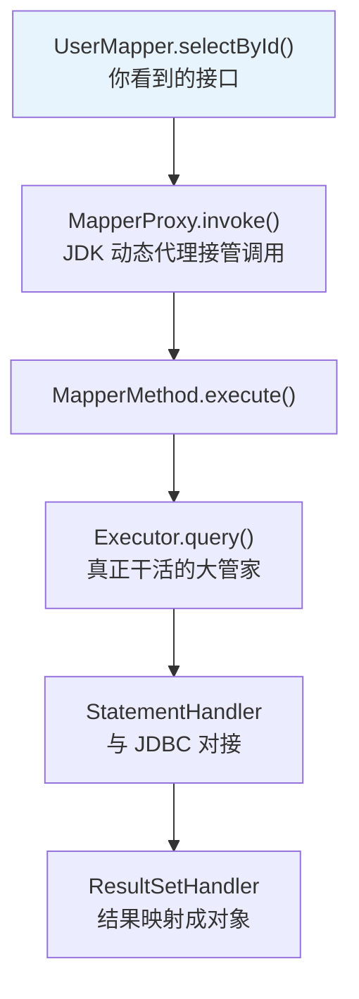
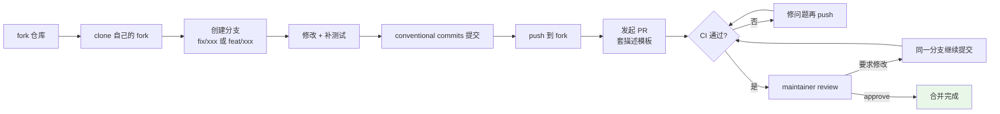

# 17 GitHub热门Java项目实战

> 前置知识：[[java/2深入/02_注解与反射|注解与反射]]、[[java/3工程化/01_Maven构建|Maven构建]]、Git 基础。本章是工程实战篇：读源码不是收藏夹里吃灰，而是带着问题进去、带着理解出来；提 PR 不是简历装饰，而是工程协作能力的公开证明。

---

## 一、为什么读源码、提 PR

### 1.1 读源码的三个真实收益

1. **面试护城河**：背八股的人很多，能说清"MyBatis 一条 SQL 从 SqlSession 到 Executor 再到 StatementHandler 的流转"的人极少；
2. **写代码的品味**：读过 Netty 的人写的异步代码和没读过的人完全不是一个气质——接口设计、异常处理、注释密度都有参照物了；
3. **排障底气**：出诡异问题时，看过源码的人敢下断点进第三方 jar 里找答案，没看过的只能换库重试。

但注意顺序：**先会用、再精读、后魔改**。没用过 MyBatis 就去读源码，等于不游泳先学救生。

### 1.2 提 PR 的隐性价值

一次被合并的 PR 意味着：你会用 Git 分支协作、能读懂陌生代码库、能按社区规范沟通——这三件事正是高级工程师的日常。哪怕最终没被合并，review 往返中学到的东西也远超自己闷头写十个小项目。

---

## 二、如何判断优质的老项目

### 2.1 优质项目的五个信号

| 信号 | 看哪里 | 说明 |
|------|--------|------|
| 创建时间早 | Insights → 首次 commit | 2010 年前的项目活到现在，说明有真实生命力 |
| commit 历史长且连续 | Insights → Contributors | 十年间持续有人提交，曲线平滑无断崖 |
| 真人贡献者多 | Contributors 列表 | 有头像、有个人主页的真实开发者 |
| issue/PR 活跃 | Issues 页 | 维护者认真回复、给标签、关联 PR |
| 发布节奏稳定 | Releases 页 | 定期发版带 changelog，说明有人在负责 |

### 2.2 警惕 AI 刷 star 项目

2024 年起出现了大量"营销型仓库"：star 几千却查无此人。对比特征表：

| 维度 | 优质老项目 | AI 刷 star 项目 |
|------|-----------|-----------------|
| star 来源 | 多数来自 watch/fork 用户，随时间缓慢累积 | 短期暴涨，star 用户主页多为空壳 |
| commit 作者 | 大量真人邮箱与签名 | 少量账号批量提交，commit 信息模板化雷同 |
| issue 区 | 真实使用问题+维护者回复 | 冷清或全是机器人互吹 |
| README | 克制、讲清用法 | 夸张宣传语、"吊打 XX"、大量徽章堆砌 |
| 文档与代码一致性 | 示例可跑 | 示例残缺、依赖版本对不上 |
| fork/PR 比 | 有正常比例的外部 PR | 几乎没有外部贡献 |

一句话判断法：**star 是结果不是质量**。去看 contributor 的 GitHub 主页是否像真人、issue 是否有真对话，比看任何指标都准。

---

## 三、精选项目清单与学习路线

### 3.1 Web 框架类

#### spring-projects/spring-petclinic（约 8k 星）
https://github.com/spring-projects/spring-petclinic

Spring 官方示范应用，1999 年以 PetClinic 形态存在，是"教科书级分层架构"的活标本。体量小（几十个类）、技术栈标准（Spring Boot + JPA + Thymeleaf），适合通读。

```text
学习路线:
第 1 步:克隆跑起来,把 owner/pet/vet 三条业务线点一遍
第 2 步:画 Controller -> Service -> Repository 的调用图
第 3 步:观察 JPA 实体的关系映射(@OneToMany 等)
第 4 步:看它的测试怎么写(集成测试切数据库的姿势)
复刻建议:仿照它写一个"诊所版"自己的 CRUD 应用,
比如图书管理系统,严格模仿它的分层与命名
```

#### spring-projects/spring-boot（约 76k 星）
https://github.com/spring-projects/spring-boot

Spring Boot 本体。读源码的终极目标之一——理解自动配置是怎么实现的。重点模块：`spring-boot-autoconfigure`（自动配置核心）、`spring-boot-starters`（起步依赖定义）。

```text
学习路线:
第 1 步:从 @SpringBootApplication 切入，追到 @EnableAutoConfiguration
第 2 步:读 AutoConfigurationImportSelector，理解条件注解过滤
第 3 步:挑一个你常用的 starter（如 spring-boot-starter-web）
        追它的自动配置类（如 ServletWebServerFactoryAutoConfiguration）
第 4 步:看 spring.factories / AutoConfiguration.imports 文件
复刻建议:写一个自己的 spring-boot-starter-xxx，
        实现一个自定义的自动配置
```

#### spring-projects/spring-framework（约 58k 星）
https://github.com/spring-projects/spring-framework

Spring 框架本体。IoC、AOP、MVC 的源码全在这里。门槛最高，但读完后对 Spring 的理解会从"会用"变成"会改"。

```text
学习路线:
第 1 步:从 ApplicationContext.refresh() 切入（Spring 启动的 12 个步骤）
第 2 步:理解 BeanFactory / BeanDefinition / BeanPostProcessor 的关系
第 3 步:AOP：从 @Aspect 到代理对象的生成过程
第 4 步:MVC：DispatcherServlet 的请求分发链路
复刻建议:写一个 100 行的 mini-spring：
        BeanFactory + 生命周期回调 + 简单 AOP 代理
```

### 3.2 ORM 与数据访问类

#### mybatis/mybatis-3（约 20k 星）
https://github.com/mybatis/mybatis-3

源码量适中（核心几万行），是"第一个通读的开源框架"的最佳选择。设计模式密度极高：工厂、建造者、责任链、动态代理全在里面。

```text
学习路线:
第 1 步:从 SqlSessionFactoryBuilder 的 build() 入口往下追
第 2 步:搞清 Configuration/MappedStatement 的解析装载
第 3 步:核心一条线:getMapper 动态代理 -> MapperMethod
        -> Executor -> StatementHandler -> JDBC
第 4 步:看一级/二级缓存的 PerpetualCache 与装饰器
复刻建议:写一个 100 行的 mini-mybatis:
        解析简单 XML 映射 + 动态代理执行 SQL + 结果集映射成对象
```

#### alibaba/druid（约 28k 星）
https://github.com/alibaba/druid

数据库连接池加 SQL 监控，国内生产环境存量巨大。学习重点是连接池的通用原理：

```text
学习路线:
第 1 步:配置并打开 Web 监控页,观察活跃/等待连接数
第 2 步:读 DruidDataSource 的 getConnection 归还逻辑
第 3 步:重点看它的防泄漏:removeAbandoned 追踪未归还连接
第 4 步:对比 HikariCP 设计文档,理解两种性能哲学
复刻建议:手写 50 行迷你连接池(预建 N 个连接 + 借还队列),
再故意制造"借了不还",体会泄漏检测的价值
```

#### hibernate/hibernate-orm（约 5.9k 星）
https://github.com/hibernate/hibernate-orm

JPA 规范的参考实现。如果你想理解"为什么 JPA 的方法名推导能自动生成 SQL"，答案就在 Hibernate 的 `QueryTranslatorImpl` 中。

```text
学习路线:
第 1 步:理解 SessionFactory / Session / Transaction 的关系
第 2 步:从 @Entity 到表结构的映射过程（SchemaExport）
第 3 步:HQL 到 SQL 的转换过程（QueryTranslator）
第 4 步:一级缓存（Session 缓存）与脏检查机制
复刻建议:实现一个简化版 ORM：
        注解解析 + 动态代理 + SQL 生成 + 结果映射
```

### 3.3 消息与中间件类

#### apache/kafka（约 29k 星）
https://github.com/apache/kafka

分布式消息系统。重点读分区、副本、ISR 机制，以及消费者组的 offset 管理。

```text
学习路线:
第 1 步:理解 Topic / Partition / Replica 的概念模型
第 2 步:读 Producer 的 batch 发送与 ack 策略
第 3 步:Consumer 的 offset 提交与 rebalance 机制
第 4 步:Controller 的选举与分区分配
复刻建议:用 Java NIO 手写一个简单的 TCP 消息服务器
        （只支持 pub/sub，不需持久化）
```

#### rocketmq/rocketmq（约 21k 星）
https://github.com/apache/rocketmq

阿里开源的消息中间件，国内使用广泛。读 NameServer 路由发现、Broker 消息存储、ConsumeQueue 索引结构。

```text
学习路线:
第 1 步:理解 NameServer / Broker / Producer / Consumer 架构
第 2 步:读消息存储：CommitLog + ConsumeQueue + IndexFile
第 3 步:事务消息的 half + check 机制
第 4 步:消费重试与死信队列
复刻建议:手写一个支持持久化的简单消息队列
```

#### redisson/redisson（约 23k 星）
https://github.com/redisson/redisson

功能最全的 Redis Java 客户端，分布式锁、限流器、延迟队列应有尽有。重点读它的**锁实现**：watchdog 续期、Lua 脚本保证原子性、RedLock 思想。

```text
学习路线:
第 1 步:先用 lock/unlock,思考"宕机了锁会死吗"
第 2 步:读 RLock 的 lock 加锁 Lua 脚本(HASH 记录持有线程)
第 3 步:追 watchdog 默认 30 秒租期的续期逻辑
第 4 步:对比 SETNX 手写版,理解为什么手写版本有坑
复刻建议:手写一个简化版分布式锁(加锁 Lua + 过期 + 续期线程),
再与 Redisson 对拍差异,收获极大
```

### 3.4 微服务与云原生类

#### alibaba/spring-cloud-alibaba（约 14k 星）
https://github.com/alibaba/spring-cloud-alibaba

Spring Cloud 的阿里实现：Nacos（配置+注册）、Sentinel（限流熔断）、Seata（分布式事务）、RocketMQ（消息）。

```text
学习路线:
第 1 步:用 Nacos 搭一个配置中心，理解配置动态刷新
第 2 步:用 Sentinel 实现限流，理解滑动窗口计数
第 3 步:追 Nacos 的服务发现机制（心跳 + 临时实例）
第 4 步:看 Sentinel 的 Slot 链（责任链模式）
复刻建议:用 ZooKeeper 手写一个简易服务注册中心
```

#### alibaba/Sentinel（约 20k 星）
https://github.com/alibaba/Sentinel

面向分布式服务架构的流量控制组件。核心概念：滑动窗口、令牌桶、热点参数限流、系统自适应保护。

```text
学习路线:
第 1 步:理解 SlotChain 责任链（NodeSelector → ClusterBuilder → Flow → Degrade）
第 2 步:读 FlowSlot 的限流算法（滑动窗口 + 匀速/预热/排队）
第 3 步:DegradeSlot 的熔断降级（慢调用比例/异常比例/异常数）
第 4 步:热点参数限流的 LRU 淘汰
复刻建议:实现一个简化版限流器（滑动窗口 + 令牌桶）
```

#### apache/dubbo（约 40k 星）
https://github.com/apache/dubbo

阿里开源的 RPC 框架。读它的服务发现、负载均衡、集群容错、SPI 扩展机制。

```text
学习路线:
第 1 步:理解 Provider / Consumer / Registry / Monitor 四角色
第 2 步:追 Dubbo SPI 扩展加载机制（vs Java SPI 的增强）
第 3 步:负载均衡策略（Random/RoundRobin/LeastActive/ConsistentHash）
第 4 步:集群容错（Failover/Failfast/Failsafe/Forking）
复刻建议:用 Java Socket + 反射手写一个简易 RPC 框架
```

### 3.5 并发与工具类

#### google/guava（约 50k 星）
https://github.com/google/guava

Google 的 Java 工具军火库。不必通读，按需取用并读对应实现：

```text
学习路线:
第 1 步:常用工具上手(ImmutableList/Maps/Joiner/StopWatch)
第 2 步:Cache 接口与 Caffeine 的渊源
第 3 步:ListenableFuture 理解 Guava 时代的异步观
第 4 步:读一个集合实现(如 ArrayListMultimap)看防御性编程
复刻建议:给自己造一个 utils 库,收录工作中重复造过的轮子
```

#### netty/netty（约 34k 星）
https://github.com/netty/netty

Java NIO 巅峰之作，事件驱动模型的范本。门槛较高，建议有并发基础后再啃：

```text
学习路线:
第 1 步:先懂 NIO 基础(Channel/Buffer/Selector)
第 2 步:抓主线:EventLoop 线程模型与 pipeline 传播
第 3 步:读 ByteBuf 的池化与引用计数
第 4 步:看一个现成协议实现(如 HTTP 编解码器)收尾
复刻建议:用 Netty 写一个简单的 Redis 协议客户端
(RESP 协议文本简单,非常适合练手)
```

#### TheAlgorithms/Java（约 60k 星）
https://github.com/TheAlgorithms/Java

算法大全：排序、搜索、图论、动态规划的纯 Java 实现，配合刷题食用最佳。

```text
学习路线:
第 1 步:刷题卡壳时来看对应算法的标准实现(先自己写再看)
第 2 步:对照 LeetCode 分类,按专题阅读
第 3 步:挑几个实现写单元测试,练习 JUnit 参数化测试
复刻建议:建一个 algorithm-notes 仓库,
每个算法用自己的话写注释+复杂度分析+刷题链接
```

### 3.6 监控与 DevOps 类

#### prometheus/client_java（约 2k 星）
https://github.com/prometheus/client_java

Prometheus 的 Java 客户端。学习如何暴露 JVM 指标、自定义业务指标、与 Prometheus 集成。

```text
学习路线:
第 1 步:理解 Counter/Gauge/Histogram/Summary 四种指标类型
第 2 步:读 JVM 指标的采集逻辑（GC/内存/线程）
第 3 步:实现自定义 Collector 暴露业务指标
第 4 步:理解文本格式 exposition format
复刻建议:写一个简化版指标库（Counter + Gauge + HTTP 暴露）
```

#### arthas/arthas（约 35k 星）
https://github.com/alibaba/arthas

阿里开源的 Java 诊断工具。无需改代码、无需重启，线上实时诊断问题。

```text
学习路线:
第 1 步:安装并使用基础命令（dashboard/thread/trace/jad）
第 2 步:用 trace 命令追踪方法调用链路
第 3 步:用 watch 命令观察方法入参和返回值
第 4 步:用反编译（jad）确认线上运行的代码版本
复刻建议:用 Java Instrumentation API 写一个简易版的
        方法耗时统计工具（Java Agent）
```

### 3.7 构建与测试类

#### alibaba/maven-proxy（约 3k 星）
https://github.com/nicoulaj/maven-mirror（参考类）

Maven 私服/镜像的实现原理。学习代理仓库、缓存策略、认证授权。

```text
学习路线:
第 1 步:搭建 Nexus/Artifactory 私服
第 2 步:理解远程仓库代理的请求转发逻辑
第 3 步:读 Maven 的 settings.xml 镜像配置原理
第 4 步:实现一个简化版的 Maven 代理（HTTP 代理 + 文件缓存）
复刻建议:用 Spring Boot 写一个 Maven 私服的最小实现
```

#### mockito/mockito（约 14k 星）
https://github.com/mockito/mockito

Java 最流行的 Mock 框架。核心原理是 Java 动态代理 + 字节码生成。

```text
学习路线:
第 1 步:理解 when/thenReturn/stub 的语义
第 2 步:读 MockUtil.createMock() 的代理生成过程
第 3 步:理解 ArgumentCaptor 和 Verify 的实现
第 4 步:看 Mockito 如何处理 final 类和 static 方法
复刻建议:用 JDK Proxy + InvocationHandler 写一个简化版 Mock 框架
```

### 3.8 数据库与存储类

#### alibaba/nacos（约 29k 星）
https://github.com/alibaba/nacos

服务发现与配置管理平台。读它的 CP/AP 模式切换（Raft + Distro）、配置持久化、监听通知机制。

```text
学习路线:
第 1 步:启动 Nacos Server，理解命名空间/分组/配置集
第 2 步:读 ConfigService 的配置拉取与监听回调
第 3 步:理解 Raft 协议在 Nacos 中的应用（CP 模式）
第 4 步:看服务注册的临时实例 vs 永久实例
复刻建议:用 ZooKeeper 手写一个简易配置中心
```

#### apache/flink（约 24k 星）
https://github.com/apache/flink

流批一体的计算引擎。读它的 TaskManager/JobManager 架构、状态管理、Checkpoint 机制。

```text
学习路线:
第 1 步:用 Flink SQL 写一个实时统计 WordCount
第 2 步:理解 DataStream / DataSet / Table API 的层次
第 3 步:读 StateBackend 和 Checkpoint 的 exactly-once 保证
第 4 步:看 Watermark 机制处理乱序事件
复刻建议:用 BlockingQueue 手写一个简单的流处理引擎
```

### 3.9 完整项目速查表

| 项目 | 星数 | 分类 | 核心价值 | 难度 | 建议投入 |
|------|------|------|----------|------|----------|
| spring-petclinic | 8k | Web 框架 | 分层架构范本 | 低 | 1 周 |
| spring-boot | 76k | Web 框架 | 自动配置原理 | 高 | 2-3 月 |
| spring-framework | 58k | Web 框架 | IoC/AOP/MVC 源码 | 高 | 3-6 月 |
| mybatis-3 | 20k | ORM | 第一个通读的框架 | 中 | 1-2 月 |
| hibernate-orm | 5.9k | ORM | JPA 参考实现 | 中高 | 2-3 月 |
| druid | 28k | 数据库 | 连接池原理+监控 | 中 | 2 周 |
| kafka | 29k | 消息中间件 | 分布式消息系统 | 高 | 2-3 月 |
| rocketmq | 21k | 消息中间件 | 国产消息中间件 | 中高 | 2 周 |
| redisson | 23k | 中间件 | 分布式锁源码 | 中高 | 2 周 |
| spring-cloud-alibaba | 14k | 微服务 | 微服务全家桶 | 中 | 1-2 月 |
| Sentinel | 20k | 微服务 | 限流熔断 | 中 | 2 周 |
| dubbo | 40k | 微服务 | RPC 框架 | 中高 | 2-3 月 |
| guava | 50k | 工具类 | 工具库与编码品味 | 中 | 按需 |
| netty | 34k | 网络框架 | NIO 与事件驱动 | 高 | 2-3 月 |
| TheAlgorithms/Java | 60k | 算法 | 算法参考实现 | 低 | 配合刷题 |
| arthas | 35k | DevOps | 线上诊断工具 | 中 | 1 周 |
| prometheus/client_java | 2k | 监控 | 指标采集 | 中 | 1 周 |
| nacos | 29k | 存储 | 服务发现+配置 | 中高 | 2 周 |
| flink | 24k | 计算 | 流批一体计算 | 高 | 3-4 月 |
| mockito | 14k | 测试 | Mock 框架原理 | 中 | 1-2 周 |

使用原则：同一时期主攻一个，读完一个的"学习路线四步"再开下一个；难度高的项目（netty、flink）放在并发基础扎实之后。

---

## 四、读源码的通用方法论

拿到一个陌生框架，不要从第一个文件顺着读。推荐"三条线切入法"：

### 4.1 主线一：从一次调用追进去

以 MyBatis 为例，你每天写的 `userMapper.selectById(1)` 就是入口。在接口处打断点，一路 step into，把经过的类记下来：



六个类就抓住了框架的主干。剩下的分支（插件、缓存、事务）等主干清晰后再补。

### 4.2 主线二：从启动流程看装配

Spring 系项目的另一条线是启动：`new SpringApplication().run()` 做了什么、自动配置怎么生效、Bean 怎么变成你注入的样子。这条线解释"魔法从哪来"，对排查配置问题极有用。

### 4.3 主线三：带着疑问定向突破

不追求通读时，直接带着具体问题进源码：

| 疑问 | 检索关键词 | 落点 |
|------|-----------|------|
| @Transactional 为什么失效 | TransactionAspectSupport | AOP 切面与自调用问题 |
| Redisson 锁会不会死锁 | watchdog, renewExpiration | 续期线程逻辑 |
| 连接池连接什么时候回收 | evictor, idleTimeout | 后台驱逐任务 |

### 4.4 配套习惯

```text
1. 边读边画时序图/类图,画不出来等于没读懂
2. 在 IDEA 里用 "Diagrams - Show Dependencies" 看模块依赖
3. 给关键路径写注释笔记,存进自己的仓库
4. 读不懂就写个最小 demo 复现行为,再回来看代码
5. 一周只攻一个框架,贪多必失
```

---

## 五、提 PR 全流程

### 5.1 流程总览



### 5.2 Conventional Commits 规范

成熟开源项目几乎都要求规范化提交信息，格式 `类型: 简述`：

```text
fix: resolve connection leak in DruidDataSource#recycle
feat: add retry support for redisson lock watchdog
docs: fix typo in cache configuration example
test: add unit tests for bounded executor
refactor: extract duplicate code into helper method
chore: bump junit from 5.9 to 5.10
```

类型速查：fix（修 bug）、feat（新功能）、docs、test、refactor、chore（杂务）。一行不超过 72 字符，正文另起行解释 why 而非 what。

### 5.3 PR 描述模板

好的 PR 描述让 reviewer 五分钟内建立信任：

```markdown
## 问题
修复 #1234:高并发下 DruidDataSource 连接归还时可能抛 NPE

## 根因
recycle() 与 destroy() 并发执行时,conn holder 可能已被置空

## 修改内容
- 在 recycle() 中增加空值短路判断
- 新增并发回归测试 RecycleConcurrencyTest

## 自测
- [x] 新增测试本地通过
- [x] mvn verify 全量通过
- [x] 在压测环境复现场景验证不再抛错
```

### 5.4 review 应对与开源礼仪

| 场景 | 正确做法 | 错误做法 |
|------|----------|----------|
| reviewer 要求改 | "Good catch,已按建议调整"并提交 | 辩解或沉默硬扛 |
| 不认同意见 | 给出理由与依据,礼貌讨论 | 直接无视评论合并意图 |
| 长期无人回复 | 一到两周后礼貌 ping 一下 | 天天催或开重复 PR |
| PR 被关闭 | 询问原因,吸收反馈 | 情绪化发言 |
| 发现安全漏洞 | 私信维护者,绝不公开提 issue | 当众贴漏洞细节 |

礼仪要点：小步提交（一个 PR 只做一件事）、遵守项目的 CONTRIBUTING.md、commit message 与代码风格向项目看齐、中文国际项目一律英文交流。

### 5.5 good first issue 怎么找

在仓库 Issues 页用标签筛选 `good first issue` 或 `help wanted`，这是社区明确标注的入门任务（通常是文档错字、补充测试、小 bug）。进阶路径：good first issue → 文档改进 → 小 bug 修复 → 功能特性。持续在同一项目贡献，维护者会记住你，review 会越来越快。

---

## 六、实战前的准备

准备一台装好 JDK 17 与 Git 的机器，注册 GitHub 账号并配置 SSH key。下面的命令流可以直接跟着敲。

---

## 七、实战：spring-petclinic 从克隆到提 PR

目标：走完一次真实的贡献闭环。我们虚构一个小 bug——宠物列表页的出生日期显示格式不一致——从发现到 PR 全程。

### 7.1 克隆与启动

```bash
# 1. fork 后克隆自己的仓库(替换 YOUR_NAME)
git clone git@github.com:YOUR_NAME/spring-petclinic.git
cd spring-petclinic

# 2. 关联上游,以后同步官方更新用
git remote add upstream https://github.com/spring-projects/spring-petclinic.git
git fetch upstream

# 3. 启动确认环境没问题
./mvnw spring-boot:run
# 浏览器打开 http://localhost:8080,能看到诊所首页
```

### 7.2 定位并修复问题

```bash
# 4. 从最新上游 main 切出工作分支(分支名体现意图)
git checkout -b fix/owner-list-date-format upstream/main

# 5. 全局搜索日期展示相关代码
grep -rn "pet.birthDate" src/main/
# 找到 ownerDetails.html 中两处展示,一处用了 yyyy-MM-dd,一处没格式化
```

修改模板统一为 `th:text="${#temporals.format(pet.birthDate, 'yyyy-MM-dd')}"`，顺手检查同页面其他日期字段保持一致。

```bash
# 6. 本地验证:启动应用,打开 owner 详情页目视检查 + 跑已有测试
./mvnw test

# 7. 规范化提交
git add src/main/resources/templates/owners/ownerDetails.html
git commit -m "fix: unify birth date format on owner details page"

# 8. 推送到自己的 fork
git push -u origin fix/owner-list-date-format
```

### 7.3 发起 PR 与后续跟进

```bash
# 9. 用 gh CLI 创建 PR(也可在网页上点 Compare & pull request)
gh pr create --repo spring-projects/spring-petclinic \
  --base main \
  --title "fix: unify birth date format on owner details page" \
  --body "$(cat <<'EOF'
## Issue
The birth dates of pets are displayed inconsistently on the owner
details page: some cells use yyyy-MM-dd while others fall back to
the default locale format.

## Change
Apply #temporals.format(pet.birthDate, 'yyyy-MM-dd') uniformly to
all date columns on the page.

## Verification
Ran ./mvnw test locally and manually checked the owner details page.
EOF
)"
```

之后 CI 自动跑起来。若 maintainer 留下修改意见：

```bash
# 10. 在同一分支上继续修改并推送,PR 自动更新
git add -u
git commit -m "refactor: apply review suggestion to use shared formatter"
git push
```

被合并后同步本地：

```bash
# 11. 合并后清理
git checkout main
git pull upstream main
git branch -d fix/owner-list-date-format
git push origin --delete fix/owner-list-date-format
```

### 7.4 如果第一次 PR 没被合并

完全正常。常见被拒原因与预防：

| 被拒原因 | 预防方式 |
|----------|----------|
| 方向与项目规划不符 | 大改动先开 issue 讨论,得到维护者认可再动手 |
| 缺少测试 | 修 bug 必附回归测试,加功能必带单元测试 |
| 代码风格不符 | 提交前跑项目的 checkstyle/spotless 等 CI 同款工具 |
| 改动过大难以 review | 拆成多个小 PR 分批提交 |
| 长期无人处理 | 一到两周礼貌 ping,或换个活跃度高的项目练手 |

把它当成免费的 code review 课，改完再战。事实上，多数人的前三个 PR 都是小改动——这正是社区设计的成长路径。

---

## 八、按难度分级的学习路线图

```text
入门阶段 (1-2周):
├── spring-petclinic        → 理解分层架构
├── TheAlgorithms/Java      → 算法参考实现
└── mockito                 → 理解 Mock 原理

进阶阶段 (1-2月):
├── mybatis-3               → 第一个通读的框架
├── druid                   → 连接池原理
├── redisson                → 分布式锁
├── Sentinel                → 限流熔断
└── prometheus/client_java  → 监控指标

高级阶段 (3-6月):
├── spring-boot             → 自动配置原理
├── spring-framework        → IoC/AOP/MVC 源码
├── netty                   → NIO 与事件驱动
├── kafka                   → 分布式消息
├── flink                   → 流批一体计算
└── arthas                  → 线上诊断
```

---

## 小结

- 判断优质项目看五件事：创建早、commit 连续、真人贡献者、issue 有对话、发版有节奏；star 数本身不代表质量，警惕短期暴涨的 AI 刷量仓库；
- 读源码路径：先会用 → 带着调用链问题读 → mini 复刻验证理解；mybatis-3 是通读首选，netty 放到最后；
- 提 PR 铁律：一个 PR 一件事、conventional commits、描述讲清问题/根因/修改/自测、礼貌应对 review；
- good first issue 是社区给你留的门，沿着文档 → 测试 → bug → feature 的阶梯往上爬；
- 本章的 petclinic 命令流可直接复用到任何仓库：fork → branch → fix → conventional commit → PR → 应对 review → 清理。
