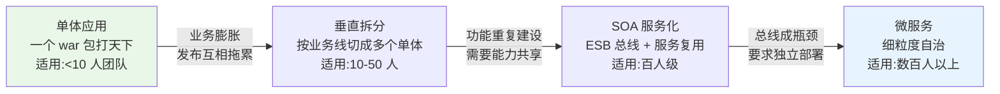
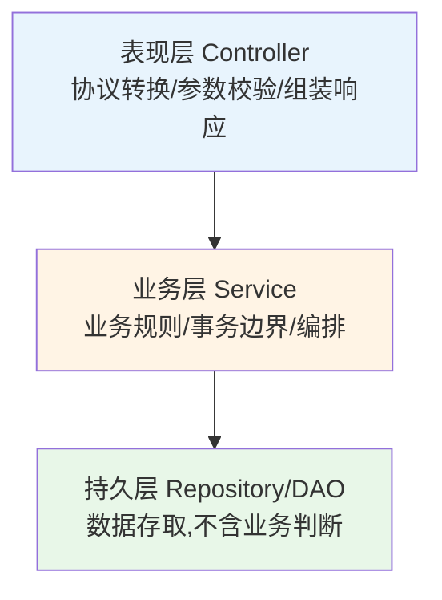
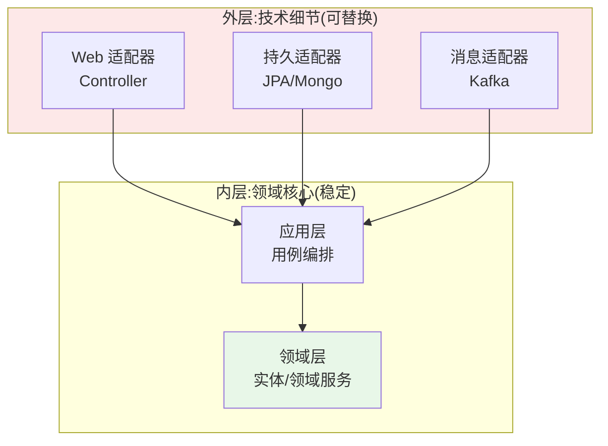
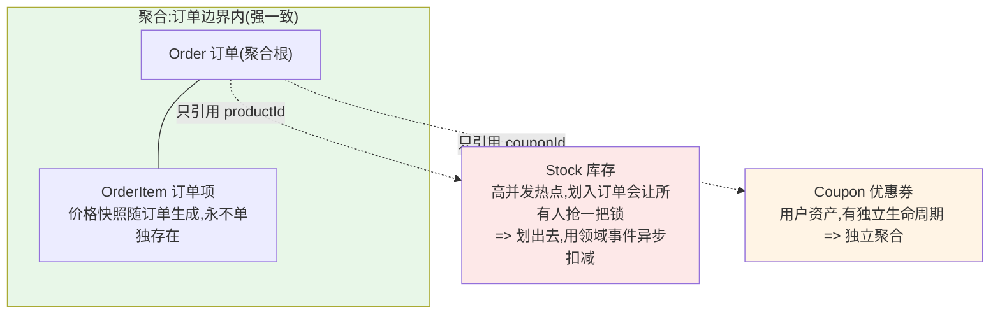
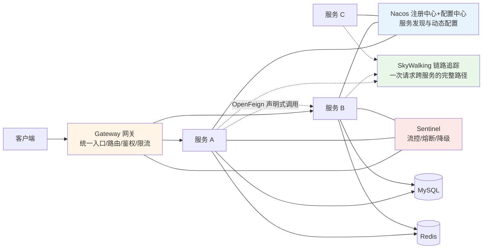
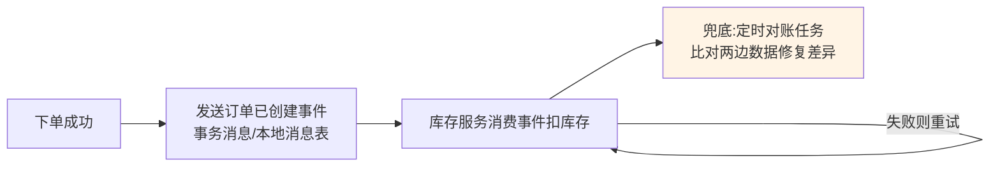

# 18 架构设计入门

> 前置知识：[[java/3工程化/15_全栈开发技巧|全栈开发技巧]]。本章是工程实战篇的收官：不讲玄学，讲**什么规模用什么架构、每个概念解决什么痛**。核心立场先亮明——中小团队单体足够，反对过度设计。

---

## 一、单体演进史

### 1.1 四个时代的演进与适用规模



| 形态 | 优点 | 缺点 | 典型代表 |
|------|------|------|----------|
| 单体 | 开发快、部署简单、事务天然一致 | 代码耦合，一处慢全体慢 | 早期电商、内部系统 |
| 垂直拆分 | 业务线独立发布，故障隔离 | 公共逻辑复制 N 份 | 按订单/商品/用户切开的早期淘宝 |
| SOA | 服务复用、统一治理 | ESB 中心化重、笨拙 | 传统金融电信 |
| 微服务 | 独立部署扩缩容、技术异构 | 分布式复杂度全面爆发 | 现代互联网大厂 |

演进的动力始终是同一个：**规模变了，协作方式必须变**。反过来也成立——规模没到就上微服务，是给自己制造分布式复杂度。

---

## 二、经典三层与贫血模型争议

### 2.1 三层职责边界



边界判据一句话：Controller 不写 if 业务判断；Service 不拼 SQL 细节；DAO 只对表负责。实际项目最常见的越界是把业务规则散落在 Controller 里——换个入口（定时任务/MQ）就要复制一份。

### 2.2 贫血模型之争

```java
// 贫血模型:对象只有 getter/setter,逻辑全在 Service
public class Order {
    private Long id;
    private BigDecimal amount;
    private String status;
    // 全是字段和存取器,没有任何行为
}

@Service
public class OrderService {
    public void pay(Order order) {
        if (!"UNPAID".equals(order.getStatus())) {          // 规则在 Service 里
            throw new BusinessException(ErrorCode.STATE_ERROR);
        }
        order.setStatus("PAID");
    }
}
```

争议双方：

| 阵营 | 理由 |
|------|------|
| 贫血派(主流实践) | 简单直接，配合 Spring 的依赖注入习惯顺手；CRUD 业务里领域对象本来就没几个行为 |
| 充血派(DDD 主张) | 对象封装自己的不变量(如"已支付的订单不能再改金额")，规则不会散落多处；Service 膨胀失控时是解药 |

务实的结论：简单 CRUD 用贫血无妨；当某个业务对象的规则多到 Service 里到处都是 `if status ==` 时，把规则收进实体方法——这就是向充血模型迈的第一步。

---

## 三、六边形与整洁架构：依赖指向内

### 3.1 核心思想

六边形架构（端口与适配器）和整洁架构说的是同一件事：**领域逻辑在圆心，数据库、Web 框架、消息队列都是可替换的外围插件，所有依赖箭头指向圆心**。



注意箭头方向：不是领域层调用数据库接口，而是持久适配器**实现**领域层定义的仓储接口。这样换数据库不动业务代码，测试时用内存实现替换真实库。

### 3.2 与三层的对照

三层回答"怎么分文件"，六边形回答"依赖往哪指"。小项目不必强上六边形，但记住一条纪律：**领域代码里不要 import 任何框架注解和 SQL 方言**——做到这条，架构就不会烂到哪里去。

---

## 四、DDD 入门

### 4.1 五个基本构件

| 构件 | 一句话定义 | 电商例子 |
|------|-----------|----------|
| 实体 Entity | 有唯一标识、状态会变、生命周期连续 | 订单 Order(id 变了就不是同一单) |
| 值对象 Value Object | 无标识、不可变、靠属性值判等 | 收货地址、金额(Money=数值+币种) |
| 聚合根 Aggregate Root | 一致性边界的守门人，外部只能通过它改内部 | 订单及其明细行 |
| 领域服务 Domain Service | 承载不属于任何单个实体的跨对象逻辑 | 库存扣减策略 |
| 防腐层 Anti-Corruption Layer | 隔离外部系统模型，防止其概念污染本域 | 把第三方物流的报文转成本地模型 |

### 4.2 电商下单：聚合边界怎么划

问题：订单包含多个订单项，下单要扣库存、减优惠券，边界怎么定？



判定标准三条：

1. **不变量必须在事务内保证的**才放同一聚合（订单总额 = 明细之和）；
2. **聚合之间只引用 ID 不引用对象**（OrderItem 存 productId 而非 Product 实体）；
3. **一个事务只改一个聚合**，跨聚合的最终一致用领域事件补偿（下单成功后发事件异步扣库存）。

新手最常犯的错就是把整个 ER 图塞进一个大聚合，结果并发性能稀烂——聚合越小越好划，宁可事件补偿也别做大聚合。

### 4.3 防腐层示例

```java
// 第三方物流返回的模型直接渗透进业务代码,就是被"腐蚀"
// 防腐层:翻译外来语言,让领域只认识自己的模型
@Component
public class LogisticsACL {
    public ShipmentInfo toShipment(LgApiResponse resp) {   // LgApi* 是外部模型
        return new ShipmentInfo(
                resp.getWayBillNo(),
                "DELIVERED".equals(resp.getState()) ? ShipmentState.FINISHED : ShipmentState.TRANSIT);
    }
}
```

价值：第三方改字段名、换供应商时，只有这一层需要动。

---

## 五、微服务拆分原则

### 5.1 限界上下文：拆分的刀口

DDD 的限界上下文（Bounded Context）指一个模型成立的有效范围。"商品"这个词在不同上下文含义完全不同：商品中心关心类目属性，交易上下文关心价格库存快照，物流上下文只关心重量体积。**每个上下文内部模型自治，之间通过 API/事件通信**——微服务的边界就该沿着限界上下文切，而不是沿着数据库表切。

实用检验法：如果两个服务经常需要同步调用对方才能完成一次操作、或总是同时修改，多半切错了地方。

### 5.2 康威定律

> 设计系统的组织，其产生的设计等同于组织内部的沟通结构。

四个团队挤在一个服务里，每次发版四个人抢锁；反之，服务边界照着团队边界画，各管各的仓库、流水线、值班——这是微服务能规模化协作的根本原因。所以拆服务前先问：**组织上有几个人能独立负责这块？** 没有对应的团队结构，拆出来的服务只会更乱。

---

## 六、微服务基础设施全景



各组件一句话定位：

| 组件 | 定位 |
|------|------|
| Nacos | 服务注册发现（谁在线）加配置中心（参数热更新），替代 Eureka+Config |
| Gateway | 全站统一入口：路由转发、JWT 校验、全局限流的门卫 |
| OpenFeign | 把 HTTP 调用写成接口调用的声明式客户端，带负载均衡 |
| Sentinel | 流量防卫兵：QPS 限流、下游异常熔断、兜底降级 |
| SkyWalking | 分布式追踪：一条请求经过哪些服务、每段耗时多少，拓扑一目了然 |

学习顺序建议：先手写服务间 HTTP 调用体会痛点，再逐个引入组件——不知道 pain 在哪，工具就只是名词。

---

## 七、REST vs RPC

| 维度 | REST(HTTP+JSON) | gRPC(HTTP/2+Protobuf) | Dubbo(RPC 框架) |
|------|-----------------|----------------------|------------------|
| 可读性 | 文本，curl 可调试 | 二进制，需工具 | 二进制(hessian2 等) |
| 性能 | 一般 | 高(序列化+多路复用) | 高 |
| 契约 | 松散，OpenAPI 辅助 | proto 文件强约束，代码生成 | 接口强约束 |
| 流式支持 | 弱 | 双向流原生 | 有但生态弱些 |
| 跨语言 | 天然 | 好(多语言生成) | 以 Java 为主 |
| 适用 | 对外 API、前后端交互 | 内部高性能微服务、异构栈 | Java 系内部治理 |

选型直觉：**对外一律 REST**（通用、可缓存、易联调）；内部追求性能且团队可控再上 gRPC/Dubbo。中小项目 OpenFeign 调 REST 就够了。

---

## 八、分布式事务概念

单体的本地事务在服务拆分后失效：下单服务和库存服务各自有数据库，一个成功一个失败怎么办？

两条路线：

### 8.1 SEATA AT 模式（强一致的工程折中）

原理一句话：**一阶段提交本地事务并记录 undo log，二阶段全局提交则删日志、回滚则用日志反向补偿**。业务几乎无侵入，加个 `@GlobalTransactional` 注解即可：

```java
@GlobalTransactional
public void placeOrder(OrderReq req) {
    orderService.create(req);       // 分支一:写订单
    stockService.deduct(req);       // 分支二:扣库存(SEATA 代理数据源自动参与)
}
// 任一分支失败,SEATA 协调各分支用 undo log 回滚
```

代价：全局锁带来的并发下降与中间件依赖。适合中低并发、强一致诉求的内部链路。

### 8.2 最终一致性（互联网主流）

接受短暂不一致，通过**消息 + 重试 + 对账**收敛：



选型经验：资金相关用 AT/TCC 保强一致；其余绝大多数场景最终一致性足够，且吞吐高得多。

---

## 九、幂等性设计

重复请求不可避免：用户双击、网络重试、MQ 至少一次投递。**幂等 = 同一操作执行多次，结果与执行一次相同**。三种经典手段：

```java
// 手段一:Token 机制——先领令牌,提交时核销
@PostMapping("/token")
public String token() { String t = UUID.randomUUID().toString();
    redis.opsForValue().set("pay:tk:" + t, "1", 5, MINUTES); return t; }

@PostMapping("/pay")
public ApiResult<Void> pay(@RequestParam String token) {
    // 原子删除:删成功说明第一次执行,失败则是重复请求
    Boolean first = redis.delete("pay:tk:" + token);
    if (!Boolean.TRUE.equals(first)) return ApiResult.fail(ErrorCode.DUPLICATE);
    doPay(); return ApiResult.ok(null);
}
```

```sql
-- 手段二:唯一索引——数据库层面兜底,最可靠
INSERT INTO orders(order_no, user_id, amount)
VALUES ('20260823001', 9527, 99.00);
-- 同一 order_no 重复插入直接 DuplicateKeyException,捕获后按成功处理
```

```java
// 手段三:状态机——UPDATE 带前置状态条件,天然防重放
int n = jdbc.update(
    "UPDATE orders SET status='PAID' WHERE id=? AND status='UNPAID'", orderId);
if (n == 0) { /* 已支付过,幂等返回 */ }
```

实战组合拳：前端防抖挡第一道，网关/Token 挡第二道，唯一索引或状态机做最终防线。支付回调场景（见第十五章）用的正是状态机方案。

---

## 十、限流三算法与降级隔离

### 10.1 三种限流算法

```text
计数器(固定窗口):
  每分钟最多 100 个,超了拒绝
  缺点:窗口边界突刺——第 59 秒来 100 个、第 61 秒又来 100 个,
       两秒内实际 200 个,后端照样可能被打挂

漏桶:
  请求进队列,以恒定速率流出处理
  优点:出口绝对平滑;缺点:无法应对突发,排队有延迟

令牌桶(Guava RateLimiter/Sentinel 默认):
  匀速往桶里放令牌,请求拿到令牌才处理,桶有上限
  优点:允许攒下的令牌支持合理突发,兼顾平滑与弹性
       => 生产默认选它
```

Redis + Lua 可以做出集群级限流（多实例共享配额），单机版 Guava 的 `RateLimiter.create(100)` 一行就能用。

### 10.2 降级与隔离

| 手段 | 做法 | 例子 |
|------|------|------|
| 降级 | 非核心功能在压力下主动关闭,返回兜底 | 大促关闭商品推荐,返回静态榜单 |
| 线程池隔离 | 每个下游调用独立线程池,一个下游堵死不拖垮全部 | 推荐服务的池满了,订单服务主流程不受影响 |
| 信号量隔离 | 轻量计数限制并发数,无线程切换开销 | 内部快速调用 |

三者合起来就是 Sentinel 的日常：给核心接口配 QPS 规则，给远程调用配熔断规则，给非核心链路配降级开关（最好做成配置中心里的开关，运营都能拨）。

---

## 十一、CAP 与 BASE 通俗解释

CAP：分布式系统三个性质——一致性 C、可用性 A、分区容忍 P。网络分区（机器间断联）无法避免，所以 P 是必选项，真正的选择只在分区发生时：**拒绝服务保一致（CP，如 ZooKeeper 选主）还是继续服务容忍读到旧数据（AP，如 Nacos/Eureka）**。通俗比喻：银行转账宁可暂停也不能算错钱（CP）；社交点赞晚几秒同步无所谓（AP）。

BASE 是 AP 路线的落地哲学：基本可用（Basically Available，降级也算可用）、软状态（Soft state，允许中间态如"支付处理中"）、最终一致（Eventually consistent，延迟收敛）。它解释了为什么互联网系统敢用消息队列替代分布式事务——只要最终对得上账，过程中的暂时不一致是可以接受的商业决策。

---

## 十二、什么时候不需要微服务

反直觉的事实：**大多数团队的正确答案是"不拆"**。

| 信号 | 判断 |
|------|------|
| 团队 < 20 人,日活 < 百万级 | 单体加模块化足够 |
| 一个 war 包 10 分钟启动,但没人抱怨 | 还没到痛点 |
| 为了简历好看想上微服务 | 明确反对:你会花 70% 时间运维而非业务 |
| 已有 5 个以上服务却只有一个团队维护 | 已经过度设计,考虑合并 |

微服务的真实成本清单：分布式事务、链路排障、环境搭建、数据一致性、运维复杂度、联调成本。这些成本只有在"多人协作互相阻塞、模块负载差异巨大需要独立扩缩容"成为主要矛盾时才值得付。

务实的演进路线：**模块化单体 → 按限界上下文预留边界 → 有真实的组织与流量痛点再拆**。拆的时候从单体里长出来的清晰模块边界，会让迁移顺滑得多——这也是本章前面强调分层与 DDD 边界的原因：好的单体是微服务的前身。

---

## 十三、架构师书单

按阅读顺序推荐，标注难度：

| 书籍 | 定位 | 难度 |
|------|------|------|
| 《架构整洁之道》Robert C. Martin | 依赖倒置与边界设计,本章第三节的理论源头 | 入门 |
| 《微服务设计》Sam Newman | 拆分、契约、演进的系统性方法论 | 入门 |
| 《领域驱动设计》Eric Evans | DDD 原著,艰涩但值得啃 | 进阶 |
| 《实现领域驱动设计》Vaughn Vernon | 更落地的 DDD 操作手册(红书) | 进阶 |
| 《数据密集型应用系统设计》(DDIA) | 存储/复制/一致性的一流教材,强烈推荐 | 进阶 |
| 《凤凰架构》周志明 | 中文免费在线,演进式架构与现代治理 | 入门首选 |
| 《Site Reliability Engineering》Google | SRE 运维体系,衔接第十六章应急话题 | 进阶 |

读法建议：《凤凰架构》与《架构整洁之道》先行建立框架，DDIA 打底数据系统认知，DDD 两本结合本章第四节反复对照实践。

---

## 十四、实战：图书服务拆分 Mini 微服务

目标：把第十五章的 Todo 思路升级——图书（book-service）与借阅（borrow-service）两个服务，借阅时要调图书服务校验并扣减可借数量，用 OpenFeign 完成服务间调用。

### 14.1 项目结构与公共依赖

```text
mini-ms/
├── pom.xml                    ← 父工程统一管版本
├── api-common/                ← 两服务共享的 DTO 与 Feign 接口
├── book-service/              ← 图书服务(端口 9001)
└── borrow-service/            ← 借阅服务(端口 9002)
```

父 pom 关键片段（Spring Boot 3.x + Cloud 2023.x）：

```xml
<dependencyManagement>
  <dependencies>
    <dependency>
      <groupId>org.springframework.cloud</groupId>
      <artifactId>spring-cloud-dependencies</artifactId>
      <version>2023.0.1</version>
      <type>pom</type>
      <scope>import</scope>
    </dependency>
  </dependencies>
</dependencyManagement>
```

两个服务都引入 `spring-cloud-starter-openfeign`；为了聚焦，本例不用注册中心，Feign 直接配 url 指向对方地址（生产中换成 Nacos 服务名即可）。

### 14.2 book-service：图书与扣减接口

```java
@Entity
@Data
public class Book {
    @Id
    @GeneratedValue(strategy = GenerationType.IDENTITY)
    private Long id;
    private String title;
    private Integer available;   // 可借数量
}

@RestController
@RequestMapping("/api/v1/books")
@RequiredArgsConstructor
public class BookController {

    private final BookRepository repo;

    @GetMapping("/{id}")
    public ApiResult<BookDTO> detail(@PathVariable Long id) {
        return repo.findById(id)
                .map(b -> new BookDTO(b.getId(), b.getTitle(), b.getAvailable()))
                .map(ApiResult::ok)
                .orElseThrow(() -> new BusinessException(ErrorCode.BOOK_NOT_FOUND));
    }

    /** 扣减可借数量,带状态机式条件更新防超借 */
    @PostMapping("/{id}/deduct")
    public ApiResult<Void> deduct(@PathVariable Long id) {
        int n = repo.deductIfAvailable(id);   // UPDATE ... SET available=available-1 WHERE id=? AND available>0
        if (n == 0) throw new BusinessException(ErrorCode.BOOK_UNAVAILABLE);
        return ApiResult.ok(null);
    }
}

public interface BookRepository extends JpaRepository<Book, Long> {
    @Modifying
    @Query("update Book b set b.available = b.available - 1 where b.id = :id and b.available > 0")
    int deductIfAvailable(@Param("id") Long id);
}
```

### 14.3 borrow-service：Feign 声明式调用

api-common 中定义 Feign 接口，两个服务共用 DTO：

```java
@FeignClient(name = "book-service", url = "${book.service.url:http://localhost:9001}")
public interface BookClient {

    @GetMapping("/api/v1/books/{id}")
    ApiResult<BookDTO> detail(@PathVariable("id") Long id);

    @PostMapping("/api/v1/books/{id}/deduct")
    ApiResult<Void> deduct(@PathVariable("id") Long id);
}
```

借阅服务的主流程：

```java
@SpringBootApplication
@EnableFeignClients(basePackages = "com.demo.common")
public class BorrowApplication { public static void main(String[] args) {
    SpringApplication.run(BorrowApplication.class, args); } }

@Service
@RequiredArgsConstructor
@Slf4j
public class BorrowService {

    private final BookClient bookClient;
    private final BorrowRepository repo;

    @Transactional
    public Borrow borrow(Long bookId, Long userId) {
        // 1. 远程查询图书信息(演示用;生产应本地缓存减少调用)
        ApiResult<BookDTO> info = bookClient.detail(bookId);
        if (info.getCode() != 0) throw new BusinessException(ErrorCode.BOOK_NOT_FOUND);

        // 2. 远程扣减库存——失败抛异常,本地事务回滚,不会出现"借书记录有了书没扣"
        bookClient.deduct(bookId);

        // 3. 本地落借阅记录
        Borrow b = new Borrow();
        b.setBookId(bookId);
        b.setUserId(userId);
        b.setBorrowedAt(LocalDateTime.now());
        return repo.save(b);
    }
}
```

### 14.4 失败模拟与思考

把 book-service 停掉再发起借阅，Feign 抛连接异常，借阅接口 500——这正是第六节全景图里 Sentinel 要解决的问题。补上降级：

```java
@FeignClient(name = "book-service", url = "${book.service.url}",
        fallback = BookClientFallback.class)
public interface BookClient { /* 同上 */ }

@Component
public class BookClientFallback implements BookClient {
    public ApiResult<BookDTO> detail(Long id) { return ApiResult.fail(ErrorCode.SYSTEM_ERROR); }
    public ApiResult<Void> deduct(Long id) { throw new BusinessException(ErrorCode.SYSTEM_ERROR); }
}
```

这个 mini 项目留了三个刻意的坑供练习：扣减成功但保存借阅记录失败时如何补偿（提示：本地消息表）；如何引入 Nacos 把 url 换成服务名；如何用 Testcontainers 写集成测试验证两服务联动。做完这三件事，你对"为什么要那些中间件"的理解会超过背一百遍八股。

---

## 小结

- 架构演进由规模驱动：单体、垂直拆分、SOA、微服务各有适用区间，规模不到别硬拆；
- 三层管分工，六边形管依赖方向——领域核心不 import 框架，是一切架构的底线纪律；
- DDD 五构件里聚合边界最关键：一个事务只改一个聚合，聚合间传 ID，跨聚合靠事件；
- 康威定律提醒我们：先有团队结构再有服务边界，拆分本质是组织问题；
- 幂等三板斧 Token、唯一索引、状态机，是分布式世界的必修防御工事；
- 限流默认选令牌桶，配降级开关与线程池隔离，构成系统的呼吸阀；
- CAP 里 P 是必选题，CP 还是 AP 取决于业务对错误数据的容忍度，BASE 是 AP 的落地哲学；
- 中小团队请先把单体做干净——好的模块化单体，才是未来微服务最好的前身。
