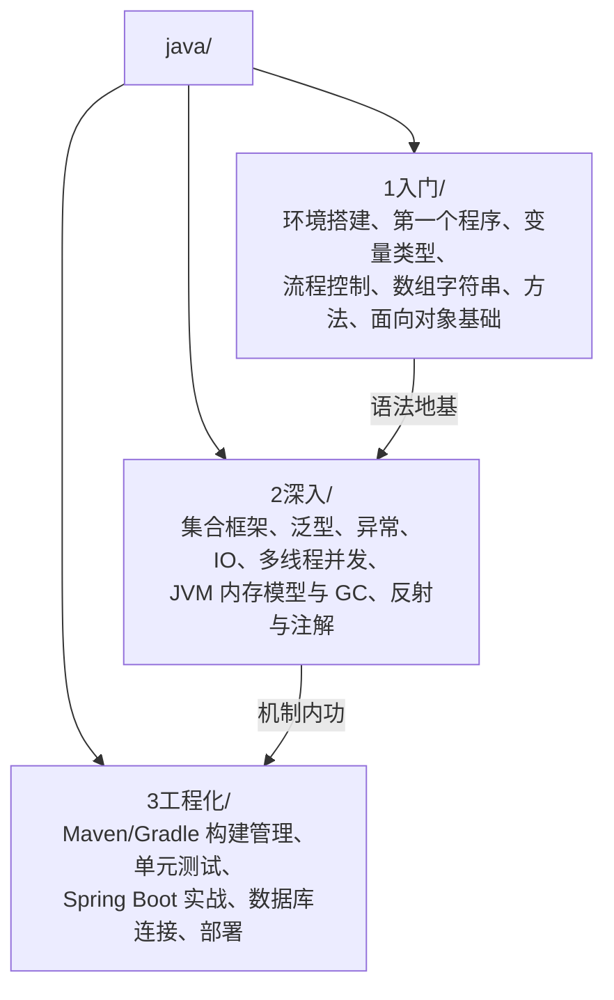

# Java 教程

Java 在 RootStack 体系中的定位是**全栈核心语言**——后端企业级开发主力、JVM 生态庞大、Spring 架构灵活且庞大。它与 C/C++（贴近硬件）不同：Java 抽象了硬件，但保留了性能与工程严谨性；它的全栈优势在于**一种语言打通后端 + 中间件 + Android**。

> 本教程假设读者已有 C 语言基础。全文大量采用「与 C 对比」的写法：你熟悉的 `char*`、`malloc/free`、指针、结构体，都会在 Java 中找到对应物或被明确告知"没有这个东西，取而代之的是……"。若为纯初学者，建议先完成 [[c语言教程/c目录|C 语言教程]] 前几章再回到这里。

---

## 写在教程之前

### 本教程的定位

Java 不是 C 的替代品，而是另一条主战场的入场券。学完本教程你将能够：

- **后端企业级开发**：Spring Boot / Spring Cloud 是全球后端的事实标准，银行、电商、电信系统的主要语言
- **中间件与大数据**：Kafka、Elasticsearch、Hadoop、Flink 全部构建在 JVM 之上——懂 JVM 才能真正运维和调优它们
- **Android 开发**：Android 官方语言之一（另一个是 Kotlin，同样跑在 JVM 上）
- **一种语言走全栈**：后端 API 用 Java 写，客户端用 Android（Java），中间件配置调优靠 JVM 知识，技术栈高度统一

与 C 的根本差异一句话概括：**C 把内存交给程序员管，Java 把内存交给 JVM 管；C 编译到具体平台的机器码，Java 编译到字节码由 JVM 到处运行。**

### 不同系统下载 JDK

JDK（Java Development Kit）= 编译器 + 运行时 + 工具链，写 Java 只需要装好 JDK。

| 系统 | 推荐方式 | 命令/说明 |
|------|---------|-----------|
| Windows | Eclipse Temurin 官方 MSI | 去 [adoptium.net](https://adoptium.net/) 下载 MSI 安装包，安装时勾选"设置 JAVA_HOME"；或用 winget：`winget install EclipseAdoptium.Temurin.21.JDK` |
| Linux (Debian/Ubuntu) | apt 或 SDKMAN | `sudo apt install openjdk-21-jdk`；推荐 SDKMAN（见下） |
| Linux (Fedora) | dnf | `sudo dnf install java-21-openjdk-devel` |
| Linux (Arch) | pacman | `sudo pacman -S jdk21-openjdk` |
| macOS | Homebrew | `brew install --cask temurin` 或 `brew install openjdk@21` |

> **Linux/macOS 强烈推荐 [SDKMAN](https://sdkman.io/)** 管理 JDK 多版本，一条命令安装切换，详见入门篇各章。

### 版本说明

**推荐 JDK 17 或 JDK 21（均为 LTS 长期支持版）**。

| 版本 | 类型 | 说明 |
|------|------|------|
| JDK 8 | LTS | 存量最大的老版本，大量遗留系统仍在用；新学习不建议从它开始 |
| JDK 11 | LTS | 模块化之后的第一个 LTS |
| **JDK 17** | LTS | 当前企业主流，新项目安全选择 |
| **JDK 21** | LTS | 最新 LTS，引入虚拟线程（Virtual Threads），本教程默认版本 |

非 LTS 版本（如 22、23、24）每半年发布一次，适合尝鲜，不适合生产。教程中所有代码在 JDK 17 与 21 下均可运行。

### 编辑器选择

| 编辑器 | 平台 | 说明 |
|--------|------|------|
| **IntelliJ IDEA Community** | 全平台 | 强烈推荐。JetBrains 出品，Java 生态事实标准，社区版免费且够初学使用 |
| IntelliJ IDEA Ultimate | 全平台 | 旗舰版，含 Spring/数据库/Web 全套支持，学生邮箱可免费申请 |
| VS Code + Extension Pack for Java | 全平台 | 轻量路线，已有 VS Code 习惯的读者可选 |
| Vim/Neovim + jdtls | 终端 | 终端党方案，eclipse.jdt.ls 语言服务器提供补全 |

详细对比见 [[1入门/04_编辑器与IDE选择|编辑器与 IDE 选择]]。

---

## 教程结构



三阶段递进关系：

1. **1 入门**：从零建立 Java 语法体系，每一节都与 C 对照。目标是能独立写出几百行的多类程序。本阶段不使用框架、不依赖 IDE 魔法，一切命令行手工操作，打牢"编译-运行-排错"的底层直觉
2. **2 深入**：进入 Java 真正的难点与精髓——集合源码级理解、并发编程、JVM 内存与垃圾回收。这一阶段决定你是"会写 Java"还是"懂 Java"；面试与生产排障的差距都在这里拉开
3. **3 工程化**：真实项目怎么组织——依赖管理、测试、框架（Spring）、数据库、打包部署。这是求职与实战的临门一脚，也是前面所有知识的汇合点

各阶段预计投入（按每天 2 小时估算）：

| 阶段 | 时长 | 完成标志 |
|------|------|---------|
| 入门 | 2 周 | 能不查资料写出含类/循环/数组的完整小程序；LeetCode 累计 10 题 |
| 深入 | 4 周 | 说得清 HashMap 扩容原理；能写多线程计数器；理解 GC 日志 |
| 工程化 | 6 周 | 从零搭一个带数据库的 REST API 并部署上线 |

---

## 推荐学习路径

### Phase 1：入门语法（1-2 周）

| 顺序 | 文件 | 重点 |
|------|------|------|
| 0 | [[1入门/00_Java是什么\|00 Java 是什么]] | 定位、JVM 原理、与 C/C++ 对比全景图 |
| 1 | [[1入门/01_Windows环境配置\|01 Windows 环境配置]] | JDK 安装、JAVA_HOME、PATH |
| 2 | [[1入门/02_Linux环境配置\|02 Linux 环境配置]] | apt/dnf/pacman、SDKMAN 多版本管理 |
| 3 | [[1入门/03_macOS环境配置\|03 macOS 环境配置]] | Homebrew、Apple Silicon 注意事项 |
| 4 | [[1入门/04_编辑器与IDE选择\|04 编辑器与 IDE 选择]] | IDEA/VS Code/Vim 三条路线对比 |
| 5 | [[1入门/05_第一个程序与jshell\|05 第一个程序与 jshell]] | Hello World 剖析、main 方法签名、REPL |

按操作系统选读 01/02/03 中对应一章即可，其余两章可作参考跳过。

### Phase 2：语言核心（3-4 周）

| 顺序 | 文件 | 重点 |
|------|------|------|
| 6 | [[1入门/06_变量与数据类型\|06 变量与数据类型]] | 八大基本类型 vs C、包装类缓存池陷阱 |
| 7 | [[1入门/07_运算符与表达式\|07 运算符与表达式]] | 无符号右移 >>>、短路求值、instanceof 模式匹配 |
| 8 | [[1入门/08_条件语句\|08 条件语句]] | switch 箭头语法、模式匹配 switch |
| 9 | [[1入门/09_循环结构\|09 循环结构]] | 增强 for 本质、标签 label 替代 goto |
| 10 | [[1入门/10_数组\|10 数组]] | 数组是对象、Arrays 工具类 vs qsort |
| 11 | [[1入门/11_字符串\|11 字符串]] | 常量池与 ==/equals、StringBuilder |
| 12 | [[1入门/12_方法\|12 方法]] | 值传递真相、重载、可变参数 vs stdarg |

### Phase 3：面向对象与进阶语法（3-4 周）

| 顺序 | 文件 | 重点 |
|------|------|------|
| 13 | [[1入门/13_类与对象\|13 类与对象]] | struct 到 class 的跨越、record、GC 初识 |
| 14 | [[1入门/14_继承与多态\|14 继承与多态]] | 动态绑定 vtable 原理、Object 三件套 |
| 15 | [[1入门/15_接口与抽象类\|15 接口与抽象类]] | 面向接口编程、函数式接口与 Lambda |
| 16 | [[1入门/16_异常处理\|16 异常处理]] | 受检异常设计哲学、try-with-resources |
| 17 | [[1入门/17_文件IO\|17 文件 IO]] | 流模型、序列化、Files 一行读写 |

### Phase 4：深入机制（4-6 周）

| 顺序 | 文件 | 重点 |
|------|------|------|
| 18 | [[2深入/01_泛型深入\|01 泛型深入]] | 类型擦除、PECS，对比 C++ 模板 |
| 19 | [[2深入/02_注解与反射\|02 注解与反射]] | Spring 框架的底层基石 |
| 20 | [[2深入/03_集合框架深入\|03 集合框架深入]] | HashMap 源码级理解，对比 C 手写哈希表 |
| 21 | [[2深入/04_多线程基础\|04 多线程基础]] | synchronized/volatile，对比 pthread |
| 22 | [[2深入/05_并发包与线程池\|05 并发包与线程池]] | ThreadPoolExecutor 七参数、CompletableFuture |
| 23 | [[2深入/06_JVM内存模型\|06 JVM 内存模型]] | 运行时数据区、GC 判活与收集器演进 |
| 24 | [[2深入/07_JVM调优\|07 JVM 调优]] | jmap/jstack/arthas 实战排障 |
| 25 | [[2深入/08_Stream与函数式\|08 Stream 与函数式]] | Lambda 本质、Collectors 全家桶 |
| 26 | [[2深入/09_NIO与网络编程\|09 NIO 与网络编程]] | BIO/NIO/AIO、Reactor 模式，对比 epoll |
| 27 | [[2深入/10_设计模式\|10 设计模式]] | 单例五种写法、JDK 中处处是模式 |
| 28 | [[2深入/11_Java新特性\|11 Java 新特性]] | record/sealed/虚拟线程/GraalVM |
| 29 | [[2深入/12_算法与LeetCode\|12 算法与 LeetCode]] | 刷题环境、API 速查、题型分类导航 |

### Phase 5：工程工具链与数据库（2-3 周）

| 顺序 | 文件 | 重点 |
|------|------|------|
| 30 | [[3工程化/01_Maven构建\|01 Maven 构建]] | POM/依赖仲裁/多模块，对比 CMake |
| 31 | [[3工程化/02_Gradle构建\|02 Gradle 构建]] | Kotlin DSL、api vs implementation |
| 32 | [[3工程化/03_JDBC与数据库连接\|03 JDBC 与数据库连接]] | PreparedStatement 防注入、事务、连接池 |
| 33 | [[3工程化/04_MyBatis\|04 MyBatis]] | #{} vs ${}、动态 SQL、MyBatis-Plus |

### Phase 6：Spring 全家桶（4-5 周）

| 顺序 | 文件 | 重点 |
|------|------|------|
| 34 | [[3工程化/05_Spring IoC与AOP\|05 Spring IoC 与 AOP]] | Bean 生命周期、三级缓存、动态代理 |
| 35 | [[3工程化/06_Spring Boot快速开发\|06 Spring Boot 快速开发]] | 自动配置原理、starter、REST API 实战 |
| 36 | [[3工程化/07_Spring MVC\|07 Spring MVC]] | 九种参数接收、全局异常、拦截器、RESTful |
| 37 | [[3工程化/08_Spring Data JPA\|08 Spring Data JPA]] | 方法名推导查询、N+1、关联映射 |
| 38 | [[3工程化/09_Spring Security\|09 Spring Security]] | 过滤器链、JWT、RBAC、OAuth2 |

### Phase 7：生产级工程能力（3-4 周）

| 顺序 | 文件 | 重点 |
|------|------|------|
| 39 | [[3工程化/10_日志框架\|10 日志框架]] | SLF4J+Logback 配置、MDC 链路追踪 |
| 40 | [[3工程化/11_单元测试\|11 单元测试]] | JUnit5/Mockito/Testcontainers/JaCoCo |
| 41 | [[3工程化/12_Docker容器化\|12 Docker 容器化]] | 分层缓存瘦身、compose 编排 |
| 42 | [[3工程化/13_CICD流水线\|13 CI/CD 流水线]] | GitHub Actions 完整工作流 |
| 43 | [[3工程化/14_性能调优与监控\|14 性能调优与监控]] | JMH/JFR/火焰图、缓存三大问题 |

### Phase 8：全栈实战与架构（4-5 周）

| 顺序 | 文件 | 重点 |
|------|------|------|
| 44 | [[3工程化/15_全栈开发技巧\|15 全栈开发技巧]] | OpenAPI 先行、WebSocket、Todo 全栈实战 |
| 45 | [[3工程化/16_应急处理与线上问题排查\|16 应急处理与线上问题排查]] | CPU 飙高五步法、三个故障现场复现 |
| 46 | [[3工程化/17_GitHub热门Java项目实战\|17 GitHub 热门项目实战]] | 读源码方法论、提 PR 全流程（贯穿全程） |
| 47 | [[3工程化/18_架构设计入门\|18 架构设计入门]] | DDD/微服务拆分/OpenFeign mini 微服务 |

> 全部 48 个文件已完成。配套学习路线另见 [[../路径G-Java全栈路径|路径 G -- Java 全栈路径]]。

---

## 相关教程

| 教程 | 关系 |
|------|------|
| [[c语言教程/c目录\|C]] | 本教程的前置与对照系。内存模型、指针概念的"反面教材"——Java 正是为了解决 C 的手动内存管理痛点而生 |
| [[cpp教程/cpp目录\|C++]] | 同为编译型强类型语言。Java 借鉴了 C++ 语法但砍掉了指针运算、多重继承、手动 delete；反过来 C++ 程序员学 Java 会觉得"处处受限但处处安全" |
| [[rust/rust目录\|Rust]] | 系统级的另一种答案：不用 GC 也能内存安全（所有权+借用检查）。对比学习能加深对 GC 与所有权两种模型的理解，Rust 的 Option/Result 与 Java 的 Optional/异常也值得互照 |
| [[python/python目录\|Python]] | 脚本工具线。Python 的 REPL 体验在 Java 中对应 jshell；两者虚拟机机制（CPython 字节码 vs JVM 字节码）可对照——学深入篇 JVM 时会频繁回想起 CPython 的设计 |
| [[数据库/数据库目录\|数据库]] | 后端开发必备。Java 工程化阶段的 JDBC/MyBatis/JPA 都以 SQL 基础为前提；反过来 Java 的连接池、事务管理也会加深你对数据库原理的理解 |

---

## 与其他模块的关联

- [[数据结构/DSA学习路线|DSA 学习路线]] — Java 的集合框架就是一本活的《数据结构》教材，刷题可用 Java
- [[计算机网络]] — Java Socket/NIO 网络编程是网络理论的落地实践
- [[内核/系统内核|内核教程]] — 理解进程/线程/虚拟内存后，JVM 的运行模型会豁然开朗
- [[red_team/总目录与快速查询|红队知识库]] — 大量企业靶场与真实目标环境是 Java 技术栈，Java 反序列化漏洞是重点课题

---

---

## Java 与 C 快速对照（学习心法）

开始之前，先在脑中装好这张"翻译表"。后续每一章都会反复用到它：

| 你熟悉的 C | Java 中的对应 | 一句话差异 |
|-----------|--------------|-----------|
| `char*` | `String` 对象 | 不可变、自带长度、无 `\0` |
| `struct` + 函数 | `class` | 数据与操作绑定，带访问控制 |
| `malloc/free` | `new` + GC | 只管申请，回收交给 JVM |
| `int* p` 指针运算 | 引用（无算术运算）| 能指向、不能加减移动 |
| `gcc` 编译出可执行文件 | `javac` 编译出字节码 | 平台无关，JVM 执行 |
| `make/CMake` | Maven/Gradle | 依赖自动下载，声明式构建 |
| `#define` 宏 | `static final` 常量 | 有类型、有作用域、可调试 |
| 头文件 `.h` | 无 | import 直接读字节码元信息 |
| 数组越界 = UB | 数组越界 = 抛异常 | 明确报错而非静默踩内存 |
| `gdb` 调试 | IDE 图形化调试/jdb | 断点、变量视图开箱即用 |

带着这张表学，每章问自己两个问题：

1. 这个概念在 C 里对应什么？
2. Java 为什么这样设计？解决了 C 的什么痛点？

第二个问题的答案，几乎都指向同一个词：**安全性**——内存安全（GC）、类型安全（强类型+无指针运算）、行为安全（无 UB）。理解了这条设计主线，Java 的很多"啰嗦"就变得合理。

---

## 环境自检清单

学完入门篇环境三章后，用这份清单自查。全部通过再进入后续章节：

```bash
# 1. 编译器可用
javac -version          # 期望: javac 21.x.x

# 2. 运行时可用且版本一致
java -version           # 期望: openjdk version "21.x.x"

# 3. JAVA_HOME 已设置(Windows: echo %JAVA_HOME%)
echo $JAVA_HOME

# 4. 能编译运行单文件
echo 'public class T { public static void main(String[] a){ System.out.println("ok"); } }' > T.java
java T.java             # 期望输出: ok
rm -f T.java

# 5. jshell 可用(输入 /exit 退出)
jshell
```

五步全绿即环境就绪。任何一步失败回到对应系统章节的排错节。

---

## 常见问题 FAQ

**Q：已经有 Python 了，为什么还要学 Java？**
Python 在 RootStack 中定位为工具线（脚本、辅助），而 Java 是工程主线——大型多人协作的长期项目需要静态类型、统一规范和成熟框架，这正是 Java 的统治区。两者互补而非互替。

**Q：直接学 Kotlin 不行吗？**
Kotlin 语法更现代，但它的运行时、类库、生态全部建立在 Java 之上；不懂 Java 的 Kotlin 学习者会在标准库和 JVM 报错面前寸步难行。先 Java 后 Kotlin 是主流路径。

**Q：C 学得一般能学 Java 吗？**
可以，甚至更顺——不需要"忘掉"指针和手动内存管理，只需知道 Java 把这些接管了。有 C 底子反而更容易理解 JVM 内存模型、栈与堆这些深入篇内容。

**Q：学到什么程度可以找工作？**
现实基准大致是：本教程三阶段走完 + LeetCode 150 题左右 + 一个完整的 Spring Boot 项目（含数据库、部署）。工程化篇结束时我们会给出项目选题建议。

**Q：教程为什么处处提 C？**
因为 RootStack 假设读者是 C 背景迁移者。对比式学习比从零记忆快得多：新概念挂在你已有的知识树上，而不是悬空背诵。

**Q：JDK、OpenJDK、Oracle JDK 到底什么关系？**
Java 语言规范和 JVM 规范开源；OpenJDK 是规范的官方参考实现（源码项目）；Oracle JDK、Temurin、Corretto 等都是基于 OpenJDK 源码构建的发行版，差异主要在许可与商业支持。学习阶段选哪个都兼容。

**Q：Java 会不会被 Go/Rust 取代？**
在云原生基础设施领域 Go 确实在抢地盘，Rust 在系统层替代 C/C++。但存量企业系统 + Spring 生态 + 大数据栈的惯性至少还有十年以上；且 JVM 本身在持续进化（虚拟线程、GraalVM 原生镜像）。学 Java 的投资回报周期依然很长。

---

## 学习方法建议

### 1. 对比式笔记

准备一个持续追加的"差异清单"，每章往里加一行。三个月后它会是你最好的复习材料：

```text
# 我的 C→Java 差异清单(示例)
- 字符串: char* → String,不可变,== 比较 vs equals
- 数组长度: 手动传参 → arr.length 属性
- 输出: printf("%d\n", x) → System.out.println(x)
- ...
```

### 2. 代码必须亲手敲

教程里的代码块全部可运行。复制粘贴运行一遍只完成 30% 的学习——改坏它、读报错、修好它，才完成剩下 70%。Java 的编译期报错信息质量很高，是免费的教学材料。

### 3. jshell 当草稿纸

任何"如果……会怎样？"的疑问，先开 jshell 验证再查文档。验证过的结论记得写进对比式笔记。

### 4. 刷题节奏

每章末尾配一道 LeetCode 真题，不要跳过。语法学习的留存率靠输出维持，刷题是最便宜的输出方式。目标节奏：入门篇结束累计 10 题，深入篇结束累计 50 题。

### 5. 用 Git 管理练习代码

```bash
mkdir ~/code/java-learn && cd ~/code/java-learn
git init
# 每章一个目录: ch05-hello/ ch06-types/ ...
git add . && git commit -m "ch05: first program and jshell"
```

好处：随时回看任意阶段代码对比进步；养成提交习惯为工程化篇铺路；搞坏了随时回滚。

---

## 术语速查表

初学会被缩写轰炸，先混个脸熟，后续章节会逐个展开：

| 术语 | 全称 | 一句话解释 |
|------|------|-----------|
| JVM | Java Virtual Machine | 执行字节码的虚拟机，Java 跨平台的秘密 |
| JRE | Java Runtime Environment | JVM + 核心类库，运行 Java 程序所需的最小集合 |
| JDK | Java Development Kit | JRE + 编译器与工具，开发者装这个 |
| OpenJDK | Open Java Development Kit | JDK 的开源参考实现，各发行版的共同上游 |
| LTS | Long-Term Support | 长期支持版本（8/11/17/21），生产环境只选这些 |
| javac | Java Compiler | 编译器，把 .java 编译成 .class |
| 字节码 | bytecode | .class 文件里的中间指令格式，平台无关 |
| JIT | Just-In-Time compilation | 运行时把热点字节码编译成机器码的技术 |
| GC | Garbage Collection | 垃圾回收，自动内存管理机制 |
| jshell | Java Shell | JDK 自带的交互式解释器（REPL）|
| Maven / Gradle | — | 构建与依赖管理工具，对应 make/CMake 的生态位 |
| Spring | Spring Framework | 企业级开发框架全家桶，工程化篇主角 |
| IDE | Integrated Development Environment | 集成开发环境，本教程指 IntelliJ IDEA |

---

## 外部资源

- [Oracle Java 官方文档](https://docs.oracle.com/en/java/javase/21/) — 权威参考，API 文档必查
- [dev.java](https://dev.java/) — Oracle 新一代 Java 学习门户，教程质量高且有官方示例
- [Spring 官网](https://spring.io/) — Spring/Spring Boot 官方指南（Guides 板块每个都是可动手的小项目）
- [Baeldung](https://www.baeldung.com/) — 最优质的英文 Java 实战教程站
- [SDKMAN](https://sdkman.io/) — JDK/Groovy/Kotlin 等 JVM 生态 SDK 的版本管理器
- [Adoptium](https://adoptium.net/) — Eclipse Temurin 免费 OpenJDK 发行版下载
- [Java Language Specification](https://docs.oracle.com/javase/specs/jls/se21/html/index.html) — 语言规范，深究语义时查阅

---

## 本章小结

- Java 在 RootStack 中是全栈核心语言：后端 + 大数据 + Android 一通百通
- 装 JDK 选 Temurin，版本选 17 或 21 LTS，Linux/macOS 用 SDKMAN 管多版本
- 编辑器首选 IntelliJ IDEA 社区版
- 学习路径三阶段：入门语法 → 深入机制 → 工程化框架
- 全程带着"C 视角"学习：每遇到一个新概念，先问"这在 C 里对应什么"

---

## 下一步

环境与工具的决策已经全部做完，从 [[1入门/00_Java是什么|00 Java 是什么]] 开始进入正题。如果只想最快跑起来：

```bash
# 三平台各一条命令(详见对应章节)
winget install EclipseAdoptium.Temurin.21.JDK   # Windows
sudo pacman -S jdk21-openjdk                    # Arch Linux
brew install --cask temurin@21                  # macOS
```

装好后在任意终端输入 `jshell`，敲下 `System.out.println("hello")` ——你已经是一个能运行 Java 代码的程序员了，剩下的只是把这件事做深。

---

## 本目录的写作约定

为方便协作与检索，java/ 目录遵循以下约定（也帮助读者快速定位内容）：

1. **命名**：文件名格式 `NN_主题.md`，编号即推荐阅读顺序；中文标题、下划线分隔
2. **对比表**：凡引入新概念必配「与 C 对比」表格——这是本教程与市面教程的最大差异
3. **图形**：架构与流程一律使用 mermaid 代码块，不使用字符画
4. **链接**：站内互引用 Obsidian wiki 链接 `[[路径|显示名]]`，外部资源用标准 markdown 链接
5. **LeetCode 巩固**：基础知识章节末尾固定小节，每章一道真实题目
6. **代码**：所有示例完整可运行、带中文注释，在 JDK 17 与 21 下验证通过

发现内容过时或错误时，欢迎在对应文件内直接修订并提交。目录之外的讨论请走 RootStack 的 ISSUES 流程。

> 提示：Obsidian 用户可将本 vault 直接作为仓库打开，wiki 链接与 mermaid 图均可原生渲染；纯 GitHub 浏览时 wiki 链接会退化为普通文本，mermaid 仍可渲染。

祝学习顺利。
