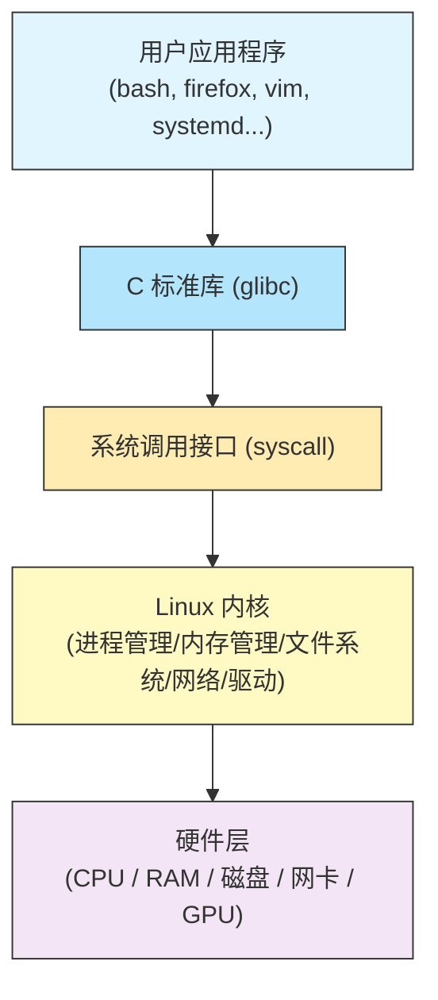

# 18 - Linux基础与文件系统路径

> Linux 的哲学核心是"一切皆文件"。理解文件系统的层次结构、路径约定和底层机制，是掌握 Linux 系统管理的第一步。本章将深入讲解 Linux 基本概念、FHS 标准、Arch Linux 特有习惯，以及文件系统的各种高级主题。

---

## 18.1 Linux 基本概念

### 内核与用户空间

Linux 系统由两个核心层次组成：

| 层次 | 说明 | 示例 |
|------|------|------|
| **内核空间（Kernel Space）** | 操作系统核心，管理硬件资源、进程调度、内存管理 | 设备驱动、文件系统、网络协议栈 |
| **用户空间（User Space）** | 应用程序运行的环境，通过系统调用与内核交互 | Shell、浏览器、编辑器、服务进程 |



查看当前内核版本：

```bash
uname -r
# 示例输出: 6.9.7-arch1-1

uname -a
# 完整系统信息

cat /proc/version
# 内核编译信息
```

### 一切皆文件

Linux 中几乎所有资源都以文件形式呈现：

| 文件类型 | 符号 | 示例 |
|----------|------|------|
| 普通文件 | `-` | `/etc/pacman.conf` |
| 目录 | `d` | `/home/user/` |
| 字符设备 | `c` | `/dev/tty0` |
| 块设备 | `b` | `/dev/sda` |
| 符号链接 | `l` | `/usr/bin/python -> python3` |
| 管道（FIFO） | `p` | 命名管道 |
| 套接字 | `s` | `/run/systemd/journal/socket` |

```bash
# 查看文件类型
file /dev/sda
# /dev/sda: block special (8/0)

file /dev/tty0
# /dev/tty0: character special (4/0)

stat /etc/hostname
# 详细文件元信息

ls -la /dev/disk/by-id/
# 按 ID 列出磁盘设备
```

---

## 18.2 FHS 文件系统层次标准详解

FHS（Filesystem Hierarchy Standard）定义了 Linux 系统中目录的用途和组织方式。

### 顶层目录总览

```
/
├── bin -> usr/bin       # 基本命令（Arch 已合并到 /usr/bin）
├── boot                 # 内核和引导文件
├── dev                  # 设备文件
├── etc                  # 系统配置文件
├── home                 # 用户主目录
├── lib -> usr/lib       # 共享库（已合并）
├── lib64 -> usr/lib     # 64位库（已合并）
├── mnt                  # 临时挂载点
├── opt                  # 第三方软件
├── proc                 # 进程信息虚拟文件系统
├── root                 # root 用户主目录
├── run                  # 运行时数据
├── sbin -> usr/bin      # 系统管理命令（已合并）
├── srv                  # 服务数据
├── sys                  # 内核/设备信息虚拟文件系统
├── tmp                  # 临时文件
├── usr                  # 用户程序和数据（最大的目录）
└── var                  # 可变数据
```

### 各目录详解

#### `/bin` → `/usr/bin`

存放所有用户可执行的基本命令。在 Arch Linux 中，`/bin` 是指向 `/usr/bin` 的符号链接。

```bash
ls -la /bin
# lrwxrwxrwx 1 root root 7 Jun  1 00:00 /bin -> usr/bin

which ls cp mv rm
# 全部位于 /usr/bin/
```

#### `/sbin` → `/usr/bin`

传统上存放系统管理命令（如 `fdisk`、`iptables`）。Arch Linux 已将其合并到 `/usr/bin`。

```bash
ls -la /sbin
# lrwxrwxrwx 1 root root 7 Jun  1 00:00 /sbin -> usr/bin

which fdisk ip mount
# 全部位于 /usr/bin/
```

#### `/usr` — 用户程序的主要存放位置

```
/usr
├── bin          # 所有可执行文件
├── include      # C/C++ 头文件
├── lib          # 库文件（.so, .a）
├── lib32        # 32位兼容库（multilib）
├── local        # 手动编译安装的软件（不受 pacman 管理）
│   ├── bin
│   ├── lib
│   └── share
├── share        # 架构无关的共享数据
│   ├── applications  # .desktop 文件
│   ├── doc           # 文档
│   ├── fonts         # 字体
│   ├── icons         # 图标
│   ├── locale        # 本地化
│   ├── man           # 手册页
│   └── zsh           # zsh 补全等
└── src          # 内核源码等
```

```bash
# 查看 /usr 占用空间
du -sh /usr
# 通常是几 GB，取决于安装的包数量

# 查找某个文件属于哪个包
pacman -Qo /usr/bin/vim
# /usr/bin/vim is owned by vim 9.1.0-1
```

#### `/etc` — 系统配置文件

所有系统级配置文件都在这里。Arch Linux 的关键配置：

| 文件/目录 | 用途 |
|-----------|------|
| `/etc/pacman.conf` | pacman 包管理器配置 |
| `/etc/pacman.d/mirrorlist` | 软件源镜像列表 |
| `/etc/makepkg.conf` | makepkg 编译配置 |
| `/etc/fstab` | 文件系统挂载表 |
| `/etc/hostname` | 主机名 |
| `/etc/locale.conf` | 语言环境 |
| `/etc/locale.gen` | 可生成的语言环境列表 |
| `/etc/mkinitcpio.conf` | initramfs 生成配置 |
| `/etc/default/grub` | GRUB 引导配置 |
| `/etc/systemd/` | systemd 配置 |
| `/etc/modprobe.d/` | 内核模块配置 |
| `/etc/udev/rules.d/` | udev 设备规则 |
| `/etc/sysctl.d/` | 内核参数配置 |
| `/etc/NetworkManager/` | 网络管理配置 |
| `/etc/X11/` | X11 显示配置 |
| `/etc/environment` | 全局环境变量 |
| `/etc/profile` | 全局 shell 配置 |
| `/etc/shells` | 合法 shell 列表 |
| `/etc/sudoers` | sudo 权限配置 |
| `/etc/shadow` | 用户密码（加密存储） |
| `/etc/passwd` | 用户账号信息 |
| `/etc/group` | 用户组信息 |

```bash
# 查找被修改过的配置文件（与包默认值不同）
pacman -Qii | grep "^MODIFIED" | awk '{print $2}'

# 查看某个包安装了哪些配置文件
pacman -Ql openssh | grep /etc/
```

#### `/var` — 可变数据

```
/var
├── cache
│   └── pacman
│       └── pkg     # 下载的软件包缓存
├── lib
│   ├── pacman      # pacman 数据库
│   └── systemd     # systemd 状态
├── log
│   ├── journal     # systemd 日志（二进制）
│   └── pacman.log  # pacman 操作日志
├── mail            # 用户邮件
├── spool           # 打印队列等
└── tmp             # 重启后保留的临时文件
```

```bash
# 查看包缓存大小
du -sh /var/cache/pacman/pkg/
# 定期增长，可用 paccache 清理

# 清理旧版本，只保留最近 3 个版本
paccache -r

# 查看 pacman 日志
tail -20 /var/log/pacman.log
```

#### `/tmp` — 临时文件

在 Arch Linux 中，`/tmp` 默认以 `tmpfs` 挂载（存在于内存中），重启后清空。

```bash
mount | grep /tmp
# tmpfs on /tmp type tmpfs (rw,nosuid,nodev,nr_inodes=1048576,inode64)

# 查看 /tmp 使用情况
df -h /tmp
```

#### `/opt` — 第三方软件

用于存放不遵循 FHS 的大型第三方软件，如：

```bash
ls /opt/
# 可能包含: google, visual-studio-code, discord 等

# AUR 中很多专有软件安装到 /opt
# 例如 google-chrome 安装到 /opt/google/chrome/
```

#### `/dev` — 设备文件

由 `udev` 动态管理的设备文件目录：

```bash
# 常见设备
ls -la /dev/sda    # SATA/SCSI 磁盘
ls -la /dev/nvme*  # NVMe 固态硬盘
ls -la /dev/null   # 黑洞设备
ls -la /dev/zero   # 零字节流
ls -la /dev/random # 随机数生成器
ls -la /dev/tty    # 当前终端

# 查看所有块设备
lsblk

# 按标签/UUID/路径查看磁盘
ls /dev/disk/by-uuid/
ls /dev/disk/by-label/
ls /dev/disk/by-id/
ls /dev/disk/by-path/
```

#### `/run` — 运行时数据

重启后清空的运行时信息存储：

```bash
ls /run/
# systemd/  user/  udev/  dbus/  lock/  ...

# PID 文件
cat /run/sshd.pid

# 用户运行时目录
ls /run/user/1000/
# bus  dconf  gnupg  pulse  systemd  wayland-0 ...
```

#### `/srv` — 服务数据

用于存放系统提供的服务数据：

```bash
# Web 服务器文件
ls /srv/http/

# FTP 服务器文件
ls /srv/ftp/
```

#### `/boot` — 引导文件

```bash
ls /boot/
# vmlinuz-linux          # 内核镜像
# initramfs-linux.img    # initramfs
# initramfs-linux-fallback.img
# intel-ucode.img        # CPU 微码
# grub/                  # GRUB 文件（如果使用 GRUB）
# loader/                # systemd-boot 文件（如果使用）
# EFI/                   # EFI 系统分区内容（如果挂载到 /boot）
```

---

## 18.3 Arch Linux 特有的路径习惯

### /usr 合并（usrmerge）

Arch Linux 是最早完全实施 `/usr` 合并的发行版之一：

```bash
# 所有这些都是符号链接
ls -la /bin /sbin /lib /lib64
# /bin -> usr/bin
# /sbin -> usr/bin
# /lib -> usr/lib
# /lib64 -> usr/lib
```

这意味着：
- 不存在 `/bin/bash` 和 `/usr/bin/bash` 的区分
- 所有可执行文件统一在 `/usr/bin`
- 所有库文件统一在 `/usr/lib`
- 简化了系统管理，避免了路径混乱

### pacman 相关路径

```bash
# 包数据库
ls /var/lib/pacman/
# db.lck  local/  sync/

# 同步的仓库数据库
ls /var/lib/pacman/sync/
# core.db  extra.db  multilib.db

# 本地已安装包信息
ls /var/lib/pacman/local/ | head -5

# 包缓存
ls /var/cache/pacman/pkg/ | tail -5

# GPG 密钥
ls /etc/pacman.d/gnupg/
```

### ABS 和 makepkg

```bash
# AUR 构建目录惯例
~/.cache/yay/          # yay 的构建缓存
~/.cache/paru/         # paru 的构建缓存

# makepkg 默认源码目录
# 由 /etc/makepkg.conf 中的 SRCDEST、PKGDEST 配置

# 用户自定义配置覆盖
~/.config/pacman/makepkg.conf
```

---

## 18.4 /proc 和 /sys 虚拟文件系统详解

### /proc — 进程信息文件系统

`/proc` 是一个伪文件系统（procfs），提供内核和进程信息的接口。

#### 系统信息

```bash
# CPU 信息
cat /proc/cpuinfo | head -20

# 内存信息
cat /proc/meminfo

# 内核版本
cat /proc/version

# 系统启动时间（秒）
cat /proc/uptime
# 第一个数字：系统运行时间  第二个数字：空闲时间总和

# 平均负载
cat /proc/loadavg
# 1分钟 5分钟 15分钟 运行进程/总进程 最近PID

# 内核命令行参数
cat /proc/cmdline

# 已挂载的文件系统
cat /proc/mounts

# 分区表
cat /proc/partitions

# 中断信息
cat /proc/interrupts

# I/O 端口
cat /proc/ioports

# 已加载的内核模块
cat /proc/modules

# 交换空间使用情况
cat /proc/swaps

# 文件系统支持
cat /proc/filesystems

# 网络信息
cat /proc/net/tcp
cat /proc/net/udp
cat /proc/net/dev
cat /proc/net/route
```

#### 进程信息

每个运行中的进程在 `/proc` 下有一个以 PID 命名的目录：

```bash
# 查看 PID 1 (systemd) 的信息
ls /proc/1/
# cmdline  cwd  environ  exe  fd  maps  mem  root  stat  status ...

# 进程命令行
cat /proc/1/cmdline | tr '\0' ' '
# /usr/lib/systemd/systemd --switched-root --system --deserialize ...

# 进程状态
cat /proc/1/status

# 进程的文件描述符
ls -la /proc/1/fd/

# 进程的内存映射
cat /proc/1/maps | head -10

# 进程的环境变量
cat /proc/1/environ | tr '\0' '\n'

# 进程的可执行文件路径
readlink /proc/1/exe
# /usr/lib/systemd/systemd

# 进程的当前工作目录
readlink /proc/1/cwd

# 进程的根目录
readlink /proc/1/root
```

#### 可调参数（sysctl）

```bash
# 查看所有内核参数
sysctl -a 2>/dev/null | head -20

# 通过 /proc/sys 直接读取
cat /proc/sys/kernel/hostname
cat /proc/sys/kernel/osrelease
cat /proc/sys/vm/swappiness

# 临时修改参数
echo 10 | sudo tee /proc/sys/vm/swappiness
# 或
sudo sysctl vm.swappiness=10

# 持久化配置（创建 .conf 文件）
# /etc/sysctl.d/99-custom.conf
# vm.swappiness = 10
# net.ipv4.ip_forward = 1
```

### /sys — sysfs 文件系统

`/sys` 提供内核对象（设备、驱动、模块）的结构化视图。

```bash
# 设备树
ls /sys/devices/

# 按类别查看设备
ls /sys/class/
# block/  hwmon/  net/  power_supply/  thermal/  tty/ ...

# 网络接口
ls /sys/class/net/
# enp0s3  lo  wlan0

# 查看网络接口状态
cat /sys/class/net/enp0s3/operstate
# up

cat /sys/class/net/enp0s3/speed
# 1000

# 电池信息
cat /sys/class/power_supply/BAT0/capacity
# 85

cat /sys/class/power_supply/BAT0/status
# Discharging

# 温度传感器
cat /sys/class/thermal/thermal_zone0/temp
# 42000 （除以 1000 = 42°C）

# 背光亮度控制
cat /sys/class/backlight/intel_backlight/brightness
cat /sys/class/backlight/intel_backlight/max_brightness

# 修改亮度
echo 500 | sudo tee /sys/class/backlight/intel_backlight/brightness

# 块设备信息
cat /sys/block/sda/size
cat /sys/block/sda/queue/scheduler

# CPU 频率
cat /sys/devices/system/cpu/cpu0/cpufreq/scaling_cur_freq

# 已加载内核模块参数
ls /sys/module/snd_hda_intel/parameters/
```

---

## 18.5 硬链接与软链接

### 对比

| 特性 | 硬链接 | 软链接（符号链接） |
|------|--------|-------------------|
| 跨文件系统 | 不可以 | 可以 |
| 链接目录 | 不可以（除 `.` 和 `..`） | 可以 |
| 目标删除后 | 仍可访问（inode 不变） | 链接失效（悬挂链接） |
| inode 编号 | 与原文件相同 | 与原文件不同 |
| 文件大小 | 与原文件相同 | 存储路径字符串长度 |
| `ls -l` 显示 | 无特殊标记 | `l` 类型，显示 `->` 指向 |

### 操作示例

```bash
# 创建测试文件
echo "hello world" > /tmp/original.txt

# --- 硬链接 ---
ln /tmp/original.txt /tmp/hardlink.txt

# 查看 inode（两者 inode 相同）
ls -li /tmp/original.txt /tmp/hardlink.txt
# 123456 -rw-r--r-- 2 user user 12 Jun 10 10:00 /tmp/hardlink.txt
# 123456 -rw-r--r-- 2 user user 12 Jun 10 10:00 /tmp/original.txt
# 注意链接计数为 2

# 删除原文件，硬链接仍可访问
rm /tmp/original.txt
cat /tmp/hardlink.txt
# hello world

# --- 软链接 ---
echo "hello world" > /tmp/original.txt
ln -s /tmp/original.txt /tmp/symlink.txt

# 查看 inode（不同）
ls -li /tmp/original.txt /tmp/symlink.txt
# 123456 -rw-r--r-- 1 user user 12 Jun 10 10:00 /tmp/original.txt
# 789012 lrwxrwxrwx 1 user user 18 Jun 10 10:00 /tmp/symlink.txt -> /tmp/original.txt

# 删除原文件，软链接失效
rm /tmp/original.txt
cat /tmp/symlink.txt
# cat: /tmp/symlink.txt: No such file or directory

# 查找悬挂链接
find /usr/bin -xtype l 2>/dev/null

# 查找某个文件的所有硬链接
find / -inum 123456 2>/dev/null
```

---

## 18.6 文件权限深入

### 基本权限

```bash
# 权限表示法
# rwxr-xr-- = 754
# r=4, w=2, x=1

# 查看权限
ls -la /etc/shadow
# -rw------- 1 root root 1234 Jun 10 10:00 /etc/shadow

# 修改权限
chmod 755 script.sh      # 数字方式
chmod u+x script.sh      # 符号方式
chmod a-w file.txt        # 移除所有人写权限
chmod -R 750 directory/   # 递归修改

# 修改所有者
chown user:group file.txt
chown -R user:group dir/

# 特殊权限位
chmod u+s /usr/bin/passwd  # SUID: 以文件所有者身份运行
chmod g+s /shared/dir/     # SGID: 新文件继承目录的组
chmod +t /tmp/             # Sticky bit: 只有所有者能删除文件

# 查看特殊权限
ls -la /usr/bin/passwd
# -rwsr-xr-x 1 root root ... /usr/bin/passwd  (注意 s)

ls -ld /tmp
# drwxrwxrwt 20 root root ... /tmp  (注意 t)

# umask: 默认权限掩码
umask
# 0022 → 文件默认 644，目录默认 755

umask 0077  # 更严格：文件 600，目录 700
```

### ACL（访问控制列表）

ACL 提供了超越传统 user/group/other 的细粒度权限控制。

```bash
# 安装 ACL 工具（通常已预装）
sudo pacman -S acl

# 查看文件的 ACL
getfacl /srv/shared/project/

# 为特定用户添加权限
setfacl -m u:alice:rwx /srv/shared/project/
setfacl -m u:bob:r-x /srv/shared/project/

# 为特定组添加权限
setfacl -m g:developers:rwx /srv/shared/project/

# 设置默认 ACL（新建文件继承）
setfacl -d -m u:alice:rwx /srv/shared/project/
setfacl -d -m g:developers:rwx /srv/shared/project/

# 移除特定 ACL 条目
setfacl -x u:bob /srv/shared/project/

# 移除所有 ACL
setfacl -b /srv/shared/project/

# 递归设置
setfacl -R -m g:developers:rwx /srv/shared/project/

# ACL 生效时，ls -l 显示 "+" 号
ls -la /srv/shared/project/
# drwxrwx---+ 2 root root ...
```

### Linux Capabilities

capabilities 将 root 的特权分解为细粒度的权限单元：

```bash
# 查看文件的 capabilities
getcap /usr/bin/ping
# /usr/bin/ping cap_net_raw=ep

# 设置 capability
sudo setcap cap_net_bind_service=+ep /usr/bin/myapp

# 移除 capability
sudo setcap -r /usr/bin/myapp

# 查看进程的 capabilities
cat /proc/self/status | grep -i cap
# CapInh: 0000000000000000
# CapPrm: 0000000000000000
# CapEff: 0000000000000000
# CapBnd: 000001ffffffffff
# CapAmb: 0000000000000000

# 解码 capability 集
capsh --decode=000001ffffffffff
```

### AppArmor

Arch Linux 支持 AppArmor（但默认未启用）：

```bash
# 安装 AppArmor
sudo pacman -S apparmor

# 启用内核参数（在 /etc/default/grub 中）
# GRUB_CMDLINE_LINUX="apparmor=1 security=apparmor"

# 查看 AppArmor 状态
sudo aa-status

# 配置文件位置
ls /etc/apparmor.d/
```

---

## 18.7 常用文件操作命令速查

| 命令 | 用途 | 示例 |
|------|------|------|
| `ls` | 列出目录内容 | `ls -lah` |
| `cd` | 切换目录 | `cd /etc` |
| `pwd` | 显示当前目录 | `pwd` |
| `cp` | 复制文件/目录 | `cp -r src/ dst/` |
| `mv` | 移动/重命名 | `mv old.txt new.txt` |
| `rm` | 删除文件/目录 | `rm -rf dir/` |
| `mkdir` | 创建目录 | `mkdir -p a/b/c` |
| `rmdir` | 删除空目录 | `rmdir emptydir/` |
| `touch` | 创建空文件/更新时间戳 | `touch newfile` |
| `cat` | 查看文件内容 | `cat file.txt` |
| `less` | 分页查看 | `less largefile.log` |
| `head` | 查看文件头部 | `head -20 file.txt` |
| `tail` | 查看文件尾部 | `tail -f /var/log/pacman.log` |
| `find` | 查找文件 | `find / -name "*.conf"` |
| `locate` | 快速定位文件 | `locate pacman.conf` |
| `du` | 查看磁盘占用 | `du -sh /var/cache/` |
| `df` | 查看磁盘空间 | `df -h` |
| `ln` | 创建链接 | `ln -s /target /link` |
| `chmod` | 修改权限 | `chmod 755 script.sh` |
| `chown` | 修改所有者 | `chown user:group file` |
| `stat` | 查看文件详细信息 | `stat /etc/hostname` |
| `file` | 检测文件类型 | `file /usr/bin/bash` |
| `tree` | 树形显示目录 | `tree -L 2 /etc` |
| `rsync` | 高效同步 | `rsync -av src/ dst/` |
| `tar` | 打包/解包 | `tar czf a.tar.gz dir/` |

```bash
# 查找大文件（> 100MB）
find / -type f -size +100M 2>/dev/null

# 按修改时间查找（最近 24 小时内修改的）
find /etc -mtime -1

# 递归统计目录下文件数
find /usr/lib -type f | wc -l

# 比较两个文件
diff file1.txt file2.txt
diff -u file1.txt file2.txt    # unified 格式

# 计算文件校验和
sha256sum file.iso
md5sum file.iso
```

---

## 18.8 inode 概念

inode（index node）是文件系统中存储文件元数据的数据结构。

### inode 包含的信息

| 字段 | 说明 |
|------|------|
| 文件类型 | 普通文件、目录、设备等 |
| 权限 | rwx 权限位 |
| 所有者 | UID 和 GID |
| 大小 | 文件字节数 |
| 时间戳 | atime（访问）、mtime（修改）、ctime（状态变更） |
| 链接计数 | 指向此 inode 的硬链接数 |
| 数据块指针 | 指向实际数据存储位置 |

注意：inode **不包含**文件名。文件名存储在目录条目中。

```bash
# 查看 inode 编号
ls -i /etc/hostname
# 262146 /etc/hostname

# 详细 inode 信息
stat /etc/hostname
#   File: /etc/hostname
#   Size: 8           Blocks: 8          IO Block: 4096   regular file
# Device: 259,2       Inode: 262146      Links: 1
# Access: (0644/-rw-r--r--)  Uid: (    0/    root)   Gid: (    0/    root)
# Access: 2024-06-10 10:00:00.000000000 +0800
# Modify: 2024-06-10 10:00:00.000000000 +0800
# Change: 2024-06-10 10:00:00.000000000 +0800
#  Birth: 2024-06-10 09:00:00.000000000 +0800

# 查看文件系统的 inode 使用情况
df -i
# Filesystem      Inodes  IUsed   IFree IUse% Mounted on
# /dev/nvme0n1p2 6553600 234567 6319033    4% /

# inode 耗尽的危险信号
# 当 IUse% 接近 100% 时，即使磁盘空间充足也无法创建新文件
```

---

## 18.9 挂载点与 /etc/fstab 详解

### 挂载基础

```bash
# 查看当前挂载
mount
findmnt           # 更美观的输出
findmnt -t ext4   # 按文件系统类型过滤

# 手动挂载
sudo mount /dev/sda1 /mnt
sudo mount -t ext4 /dev/sda1 /mnt
sudo mount -o ro,noexec /dev/sda1 /mnt

# 卸载
sudo umount /mnt
sudo umount -l /mnt   # 懒卸载（有进程占用时）

# 查看占用挂载点的进程
fuser -mv /mnt
lsof +f -- /mnt

# 挂载 ISO 文件
sudo mount -o loop archlinux.iso /mnt

# 绑定挂载
sudo mount --bind /source /destination
```

### /etc/fstab 详解

`/etc/fstab` 定义了系统启动时自动挂载的文件系统。

```bash
# 典型的 fstab 文件
cat /etc/fstab
```

```
# <device>                                 <dir>       <type>  <options>              <dump> <pass>

# EFI 系统分区
UUID=ABCD-1234                              /boot       vfat    rw,relatime,fmask=0022,dmask=0022 0 2

# 根分区 (ext4)
UUID=12345678-abcd-efgh-ijkl-123456789012   /           ext4    rw,relatime            0 1

# 根分区 (Btrfs 子卷)
UUID=12345678-abcd-efgh-ijkl-123456789012   /           btrfs   rw,relatime,compress=zstd:3,subvol=/@     0 0
UUID=12345678-abcd-efgh-ijkl-123456789012   /home       btrfs   rw,relatime,compress=zstd:3,subvol=/@home  0 0

# 交换分区
UUID=87654321-abcd-efgh-ijkl-987654321098   none        swap    defaults               0 0

# tmpfs
tmpfs                                       /tmp        tmpfs   rw,nosuid,nodev,nr_inodes=1048576 0 0
```

#### 各字段说明

| 字段 | 说明 | 示例 |
|------|------|------|
| `device` | 设备标识（推荐用 UUID 或 LABEL） | `UUID=xxxx`、`LABEL=data`、`/dev/sda1` |
| `dir` | 挂载点 | `/`, `/boot`, `/home` |
| `type` | 文件系统类型 | `ext4`, `btrfs`, `vfat`, `swap`, `tmpfs` |
| `options` | 挂载选项 | `defaults`, `rw`, `noatime` |
| `dump` | 是否备份（0=不备份） | `0` |
| `pass` | fsck 检查顺序（0=不检查，1=根分区，2=其他） | `1` |

#### 常用挂载选项

| 选项 | 说明 |
|------|------|
| `defaults` | 等同于 `rw,suid,dev,exec,auto,nouser,async` |
| `rw` / `ro` | 读写 / 只读 |
| `noatime` | 不更新访问时间（提升性能） |
| `relatime` | 仅在修改时更新访问时间（默认） |
| `nosuid` | 禁止 SUID/SGID 位 |
| `nodev` | 不解释特殊设备文件 |
| `noexec` | 禁止执行二进制文件 |
| `auto` / `noauto` | 是否在 `mount -a` 或启动时自动挂载 |
| `user` / `nouser` | 允许/禁止普通用户挂载 |
| `nofail` | 设备不存在时不报错（U盘等可移除设备） |
| `x-systemd.automount` | 首次访问时才挂载 |
| `compress=zstd:3` | Btrfs 压缩（zstd 级别 3） |
| `subvol=/@` | Btrfs 子卷挂载 |
| `discard` / `nodiscard` | SSD TRIM 支持 |

```bash
# 生成 fstab（安装时使用）
genfstab -U /mnt >> /mnt/etc/fstab

# 获取分区 UUID
blkid
lsblk -f

# 测试 fstab 是否正确（不重启）
sudo mount -a
# 如果没有报错，说明 fstab 配置正确
```

---

## 18.10 tmpfs 和 ramfs

### tmpfs

`tmpfs` 是基于内存的文件系统，使用虚拟内存（RAM + swap）。

```bash
# Arch 默认的 tmpfs 挂载
findmnt -t tmpfs
# TARGET          SOURCE FSTYPE OPTIONS
# /dev/shm        tmpfs  tmpfs  rw,nosuid,nodev
# /tmp            tmpfs  tmpfs  rw,nosuid,nodev,nr_inodes=1048576
# /run            tmpfs  tmpfs  rw,nosuid,nodev,mode=755

# 手动挂载 tmpfs
sudo mount -t tmpfs -o size=512M tmpfs /mnt/ramdisk

# 在 fstab 中配置
# tmpfs  /mnt/ramdisk  tmpfs  rw,size=512M,nodev,nosuid  0 0

# 修改已挂载 tmpfs 的大小
sudo mount -o remount,size=1G /tmp

# 查看使用情况
df -h /tmp
```

### ramfs

`ramfs` 是更简单的内存文件系统，**没有大小限制**（可能耗尽内存）。

```bash
# 挂载 ramfs
sudo mount -t ramfs ramfs /mnt/ram

# ramfs vs tmpfs
# tmpfs: 有大小限制, 可使用 swap, 推荐使用
# ramfs: 无大小限制, 不使用 swap, 可能导致 OOM
```

### 实际应用场景

```bash
# 编译时使用 tmpfs 加速
# 在 /etc/makepkg.conf 中设置:
# BUILDDIR=/tmp/makepkg

# /dev/shm 用于进程间共享内存
ls /dev/shm/

# systemd 的 /run 也是 tmpfs
ls /run/systemd/
```

---

## 18.11 XDG 目录规范

XDG Base Directory Specification 定义了用户配置、数据和缓存的标准存放位置。

### 核心目录

| 环境变量 | 默认路径 | 用途 |
|----------|----------|------|
| `$XDG_CONFIG_HOME` | `~/.config` | 用户配置文件 |
| `$XDG_DATA_HOME` | `~/.local/share` | 用户数据文件 |
| `$XDG_CACHE_HOME` | `~/.cache` | 用户缓存文件 |
| `$XDG_STATE_HOME` | `~/.local/state` | 用户状态数据（日志等） |
| `$XDG_RUNTIME_DIR` | `/run/user/$UID` | 运行时文件（套接字等） |
| `$XDG_CONFIG_DIRS` | `/etc/xdg` | 系统级配置搜索路径 |
| `$XDG_DATA_DIRS` | `/usr/local/share:/usr/share` | 系统级数据搜索路径 |

### 常见 ~/.config 内容

```bash
ls ~/.config/
# alacritty/       # 终端模拟器
# fontconfig/      # 字体配置
# git/             # git 配置
# gtk-3.0/         # GTK3 配置
# htop/            # htop 配置
# hypr/            # Hyprland 配置
# i3/              # i3 窗口管理器配置
# nvim/            # Neovim 配置
# pulse/           # PulseAudio 配置
# systemd/user/    # 用户级 systemd 单元
# waybar/          # Waybar 配置
```

### 常见 ~/.local 结构

```bash
ls ~/.local/
# bin/     # 用户可执行文件（应加入 $PATH）
# lib/     # 用户库文件
# share/   # 用户数据
# state/   # 用户状态

ls ~/.local/share/
# applications/    # 用户 .desktop 文件
# fonts/           # 用户字体
# icons/           # 用户图标
# Trash/           # 回收站
```

### 让传统程序遵循 XDG 规范

```bash
# 在 ~/.bashrc 或 ~/.zshrc 中设置
export XDG_CONFIG_HOME="$HOME/.config"
export XDG_DATA_HOME="$HOME/.local/share"
export XDG_CACHE_HOME="$HOME/.cache"
export XDG_STATE_HOME="$HOME/.local/state"

# 一些程序需要额外配置才能遵循 XDG
export HISTFILE="$XDG_STATE_HOME/bash/history"
export LESSHISTFILE="$XDG_STATE_HOME/less/history"
export CARGO_HOME="$XDG_DATA_HOME/cargo"
export RUSTUP_HOME="$XDG_DATA_HOME/rustup"
export GOPATH="$XDG_DATA_HOME/go"
export NPM_CONFIG_USERCONFIG="$XDG_CONFIG_HOME/npm/npmrc"

# 查看 Arch Wiki 上的完整列表：
# https://wiki.archlinux.org/title/XDG_Base_Directory
```

---

## 18.12 小结

| 主题 | 关键点 |
|------|--------|
| 内核与用户空间 | 内核管硬件，用户空间跑应用，通过 syscall 交互 |
| 一切皆文件 | 设备、进程信息、配置全部以文件形式暴露 |
| FHS 标准 | 统一的目录结构规范，Arch 遵循并有自己的约定 |
| /usr 合并 | Arch 将 /bin /sbin /lib 全部合并到 /usr 下 |
| /proc 和 /sys | 内核提供的虚拟文件系统，用于查看和调整系统状态 |
| 链接 | 硬链接共享 inode，软链接是路径引用 |
| 权限 | 基本权限 + ACL + capabilities 构成安全体系 |
| inode | 存储文件元数据的核心数据结构 |
| fstab | 定义启动时自动挂载的文件系统 |
| tmpfs | 基于内存的文件系统，适合临时和高性能场景 |
| XDG 规范 | 用户配置和数据的标准化存放路径 |

---

## 18.13 本章测验

> [!example] 📝 自测题目

> [!question]- 选择题 1：在 Arch Linux 中，`/bin` 实际指向哪个目录？
> - A. /sbin
> - B. /usr/local/bin
> - C. /usr/bin
> - D. /opt/bin
>
> > [!success]- 点击查看答案
> > **C**
> > Arch Linux 实施了 /usr 合并，/bin 是指向 /usr/bin 的符号链接。

> [!question]- 选择题 2：inode 中**不包含**以下哪项信息？
> - A. 文件权限
> - B. 文件名
> - C. 文件大小
> - D. 数据块指针
>
> > [!success]- 点击查看答案
> > **B**
> > inode 不包含文件名。文件名存储在目录条目中，inode 存储文件的元数据（权限、大小、时间戳、数据块指针等）。

> [!question]- 选择题 3：以下哪个命令可以查看当前系统 inode 使用情况？
> - A. df -h
> - B. df -i
> - C. du -sh
> - D. ls -i
>
> > [!success]- 点击查看答案
> > **B**
> > `df -i` 显示文件系统的 inode 使用情况，而 `df -h` 显示磁盘空间，`du -sh` 显示目录大小，`ls -i` 显示文件的 inode 编号。

> [!question]- 判断题 4：硬链接可以跨文件系统创建
> - A. ✓ 正确
> - B. ✗ 错误
>
> > [!success]- 点击查看答案
> > **B. ✗ 错误**
> > 硬链接不能跨文件系统，因为不同文件系统有各自独立的 inode 编号空间。软链接可以跨文件系统。

> [!question]- 选择题 5：`/etc/fstab` 中 pass 字段值为 1 表示什么？
> - A. 不进行 fsck 检查
> - B. 该分区是根分区，最先检查
> - C. 该分区在其他分区之后检查
> - D. 启用自动挂载
>
> > [!success]- 点击查看答案
> > **B**
> > pass 字段为 1 表示根分区，最先进行 fsck 检查；为 2 表示其他分区，在根之后检查；为 0 表示不检查。

> [!question]- 判断题 6：在 Arch Linux 中，`/tmp` 默认使用 tmpfs 挂载，数据存储在内存中，重启后清空
> - A. ✓ 正确
> - B. ✗ 错误
>
> > [!success]- 点击查看答案
> > **A. ✓ 正确**
> > Arch Linux 默认将 /tmp 以 tmpfs 挂载，数据存在内存中，重启后自动清空。

> [!question]- 选择题 7：`$XDG_CONFIG_HOME` 的默认路径是？
> - A. ~/.local/share
> - B. ~/.config
> - C. ~/.cache
> - D. ~/.local/state
>
> > [!success]- 点击查看答案
> > **B**
> > XDG Base Directory 规范中，$XDG_CONFIG_HOME 默认为 ~/.config，用于存放用户配置文件。

> [!question]- 选择题 8：SUID 权限位的作用是什么？
> - A. 新文件继承目录的组
> - B. 只有文件所有者能删除文件
> - C. 程序以文件所有者的身份运行
> - D. 禁止其他用户读取文件
>
> > [!success]- 点击查看答案
> > **C**
> > SUID（Set User ID）使程序以文件所有者的身份运行，典型例子是 /usr/bin/passwd 以 root 身份运行以修改 /etc/shadow。

> [!question]- 判断题 9：`/proc` 是一个真实存储在磁盘上的文件系统
> - A. ✓ 正确
> - B. ✗ 错误
>
> > [!success]- 点击查看答案
> > **B. ✗ 错误**
> > /proc 是一个伪文件系统（procfs），它不占用磁盘空间，而是由内核动态生成，提供进程和系统信息的接口。

> [!question]- 选择题 10：删除原文件后，以下哪种链接仍然可以正常访问文件内容？
> - A. 软链接（符号链接）
> - B. 硬链接
> - C. 两者都可以
> - D. 两者都不行
>
> > [!success]- 点击查看答案
> > **B**
> > 硬链接与原文件共享同一个 inode，删除原文件只是减少链接计数，只要还有硬链接存在，文件内容就不会被释放。软链接删除原文件后会成为悬挂链接。
