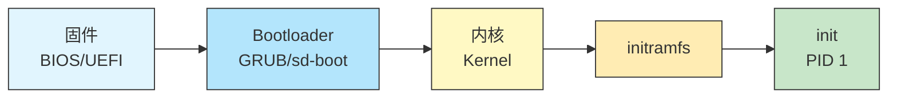
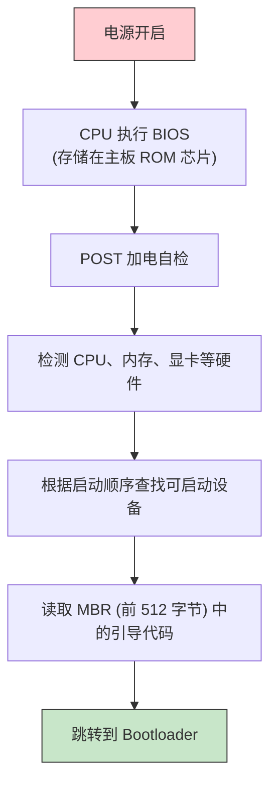
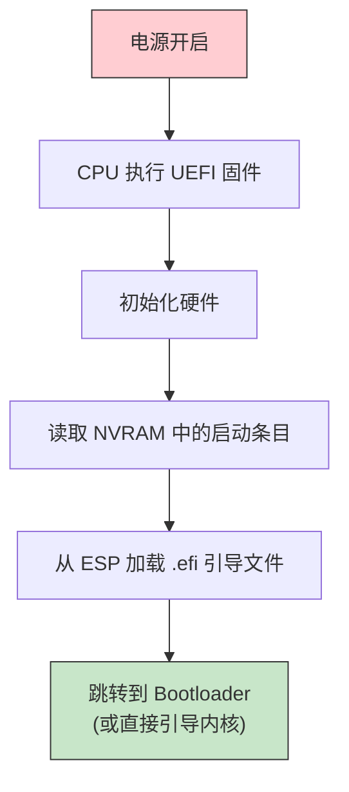
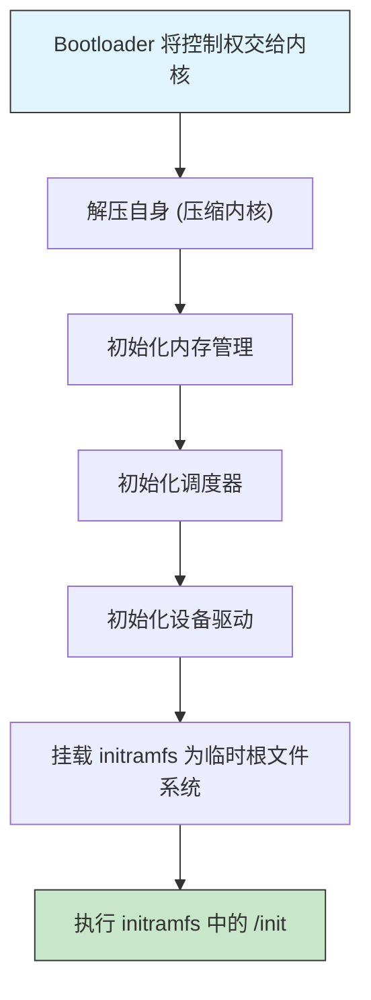
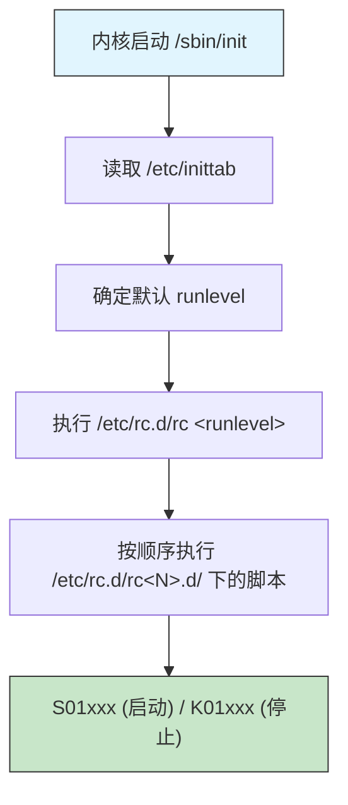
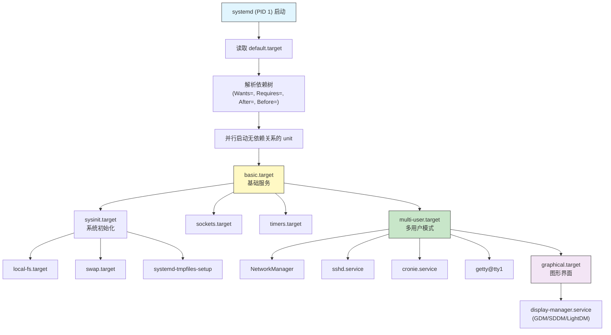

# 19 - Init进程与启动流程

> 从按下电源键到登录界面出现，Linux 系统经历了一系列精密的启动步骤。理解从固件到 init 进程的完整启动链，是排查启动故障、优化开机速度、定制系统行为的基础。本章以 Arch Linux 和 systemd 为核心，深入讲解整个启动流程。

---

## 19.1 什么是 init（PID 1）

init 是 Linux 系统启动后内核创建的第一个用户空间进程，进程号（PID）始终为 1。

```bash
# 查看 PID 1
ps -p 1 -o pid,comm,args
#   PID COMMAND         COMMAND
#     1 systemd         /usr/lib/systemd/systemd --switched-root --system --deserialize 31

readlink /proc/1/exe
# /usr/lib/systemd/systemd
```

### init 的核心职责

| 职责 | 说明 |
|------|------|
| 系统初始化 | 挂载文件系统、设置主机名、配置网络等 |
| 服务管理 | 启动和管理系统服务（守护进程） |
| 进程收养 | 成为所有孤儿进程的父进程 |
| 系统关闭 | 有序停止服务并关闭系统 |
| 信号处理 | 处理 SIGTERM、SIGINT 等信号 |

```bash
# PID 1 是所有进程的祖先
pstree -p | head -30
# systemd(1)─┬─NetworkManager(456)─┬─...
#             ├─agetty(789)
#             ├─dbus-daemon(234)
#             ├─sshd(567)─┬─sshd(1234)───bash(1235)
#             └─systemd-journal(123)
```

---

## 19.2 完整启动链

从按下电源键到用户登录，系统经历以下阶段：



### 阶段 1: 固件（BIOS / UEFI）

#### BIOS（传统方式）



#### UEFI（现代方式）



```bash
# 检查当前系统是 UEFI 还是 BIOS
ls /sys/firmware/efi
# 如果目录存在 → UEFI
# 如果不存在 → BIOS（Legacy）

# 查看 UEFI 启动条目
efibootmgr -v
# BootCurrent: 0001
# Timeout: 5 seconds
# BootOrder: 0001,0000
# Boot0000* Windows Boot Manager  HD(1,...)/File(\EFI\Microsoft\Boot\bootmgfw.efi)
# Boot0001* Arch Linux             HD(1,...)/File(\EFI\GRUB\grubx64.efi)

# UEFI 变量
ls /sys/firmware/efi/efivars/ | head -5
```

### 阶段 2: Bootloader（引导加载程序）

Bootloader 负责加载内核和 initramfs 到内存。

#### GRUB

```bash
# GRUB 配置文件
cat /boot/grub/grub.cfg | grep menuentry
# menuentry 'Arch Linux' ...
# menuentry 'Arch Linux, with Linux linux-lts' ...

# GRUB 实际加载过程:
# 1. 读取 /boot/grub/grub.cfg
# 2. 显示菜单
# 3. 加载 vmlinuz-linux（内核镜像）
# 4. 加载 initramfs-linux.img
# 5. 加载 intel-ucode.img / amd-ucode.img
# 6. 传递内核参数
# 7. 跳转到内核入口点
```

#### systemd-boot

```bash
# systemd-boot 配置
cat /boot/loader/loader.conf
# default arch.conf
# timeout 3
# console-mode max

cat /boot/loader/entries/arch.conf
# title   Arch Linux
# linux   /vmlinuz-linux
# initrd  /intel-ucode.img
# initrd  /initramfs-linux.img
# options root=UUID=xxxx rw quiet
```

### 阶段 3: 内核启动



```bash
# 内核启动消息（dmesg）
dmesg | head -50
# [    0.000000] Linux version 6.9.7-arch1-1 ...
# [    0.000000] Command line: BOOT_IMAGE=/vmlinuz-linux root=UUID=... rw quiet
# [    0.000000] BIOS-provided physical RAM map:
# ...

# 内核启动参数
cat /proc/cmdline
# BOOT_IMAGE=/vmlinuz-linux root=UUID=12345678-... rw quiet
```

### 阶段 4: initramfs

initramfs（initial RAM filesystem）是一个临时的根文件系统，加载到内存中，用于完成真正根文件系统挂载前的准备工作。

```bash
# 查看 initramfs 内容
lsinitcpio /boot/initramfs-linux.img
lsinitcpio -l /boot/initramfs-linux.img | head -20

# initramfs 的工作流程：
# 1. 内核将 initramfs 解压到内存
# 2. 执行 /init 脚本
# 3. 加载必要的内核模块（磁盘驱动、文件系统驱动等）
# 4. 处理加密分区（LUKS 解密）
# 5. 组装 RAID / LVM
# 6. 挂载真正的根文件系统
# 7. switch_root 切换到真正的根文件系统
# 8. 执行真正根文件系统上的 /sbin/init（systemd）
```

### 阶段 5: init (systemd)

```bash
# systemd 启动后的执行流程
# 1. 重新挂载根文件系统（根据 fstab）
# 2. 启动 default.target（通常是 graphical.target 或 multi-user.target）
# 3. 根据依赖关系并行启动所有服务
# 4. 启动登录管理器或 getty
```

---

## 19.3 SysV init 历史与工作原理

虽然 Arch Linux 早已使用 systemd，但了解 SysV init 有助于理解 init 系统的演进。

### SysV init 的核心概念

#### Runlevel（运行级别）

| Runlevel | 说明 |
|----------|------|
| 0 | 关机（halt） |
| 1 / S | 单用户模式（维护） |
| 2 | 多用户（无网络，Debian 定义不同） |
| 3 | 多用户 + 网络（命令行） |
| 4 | 用户自定义 |
| 5 | 多用户 + 网络 + 图形界面 |
| 6 | 重启（reboot） |

#### SysV init 工作流程



```bash
# SysV init 脚本示例结构（已淘汰，仅供了解）
# /etc/rc.d/rc3.d/
# S01syslog    → 启动日志服务
# S05network   → 启动网络
# S10sshd      → 启动 SSH
# S99local     → 本地自定义启动
# K01sshd      → 停止 SSH（在切换 runlevel 时）
```

### SysV init 的缺点

| 问题 | 说明 |
|------|------|
| 串行启动 | 服务按顺序启动，速度慢 |
| 脚本复杂 | 每个服务需要编写 shell 脚本 |
| 无依赖管理 | 依赖关系靠命名顺序（S01, S05...）手工维护 |
| 无监控 | 服务崩溃后无自动重启 |
| 无并行 | 无法利用多核 CPU |
| 无 cgroup | 无法隔离和限制服务资源 |

---

## 19.4 systemd 作为 init 的工作原理

Arch Linux 从 2012 年起使用 systemd 作为默认 init 系统。

### systemd 核心概念

#### Unit（单元）

systemd 的基本管理单位，每种类型的 unit 负责不同的功能：

| Unit 类型 | 后缀 | 用途 |
|-----------|------|------|
| Service | `.service` | 服务/守护进程 |
| Target | `.target` | 单元组（替代 runlevel） |
| Mount | `.mount` | 挂载点 |
| Automount | `.automount` | 自动挂载 |
| Timer | `.timer` | 定时任务（替代 cron） |
| Socket | `.socket` | 套接字激活 |
| Path | `.path` | 路径监控触发 |
| Slice | `.slice` | cgroup 资源分片 |
| Scope | `.scope` | 外部创建的进程组 |
| Swap | `.swap` | 交换分区 |
| Device | `.device` | 设备 |

#### Unit 文件存放位置

| 路径 | 用途 | 优先级 |
|------|------|--------|
| `/usr/lib/systemd/system/` | 软件包安装的 unit 文件 | 最低 |
| `/etc/systemd/system/` | 管理员自定义的 unit 文件 | 最高 |
| `/run/systemd/system/` | 运行时生成的 unit 文件 | 中等 |
| `~/.config/systemd/user/` | 用户级 unit 文件 | — |

```bash
# 查看某个服务的 unit 文件
systemctl cat sshd.service
# 显示文件内容和路径

# 典型的 service unit 文件
cat /usr/lib/systemd/system/sshd.service
# [Unit]
# Description=OpenSSH Daemon
# Wants=sshdgenkeys.service
# After=sshdgenkeys.service
# After=network.target
#
# [Service]
# ExecStart=/usr/bin/sshd -D
# ExecReload=/bin/kill -HUP $MAINPID
# KillMode=process
# Restart=always
#
# [Install]
# WantedBy=multi-user.target

# 列出所有已安装的 service
systemctl list-unit-files --type=service

# 列出正在运行的 service
systemctl list-units --type=service --state=running

# 服务管理
systemctl start sshd.service        # 立即启动
systemctl stop sshd.service         # 立即停止
systemctl restart sshd.service      # 重启
systemctl reload sshd.service       # 重新加载配置
systemctl enable sshd.service       # 开机自启
systemctl disable sshd.service      # 取消开机自启
systemctl enable --now sshd.service # 启动 + 开机自启
systemctl status sshd.service       # 查看状态
systemctl is-active sshd.service    # 是否正在运行
systemctl is-enabled sshd.service   # 是否开机自启
```

### systemd 启动流程



---

## 19.5 systemd target 替代 runlevel

### target 与 runlevel 对照

| SysV Runlevel | systemd Target | 说明 |
|---------------|----------------|------|
| 0 | `poweroff.target` | 关机 |
| 1 | `rescue.target` | 单用户/救援模式 |
| 2, 3, 4 | `multi-user.target` | 多用户命令行 |
| 5 | `graphical.target` | 图形界面 |
| 6 | `reboot.target` | 重启 |
| — | `emergency.target` | 紧急模式（最小化） |

```bash
# 查看当前默认 target
systemctl get-default
# graphical.target

# 设置默认 target
sudo systemctl set-default multi-user.target   # 启动到命令行
sudo systemctl set-default graphical.target     # 启动到图形界面

# 临时切换 target（不影响默认值）
sudo systemctl isolate multi-user.target        # 切换到命令行
sudo systemctl isolate graphical.target         # 切换到图形界面
sudo systemctl isolate rescue.target            # 进入救援模式

# 查看某个 target 包含的所有单元
systemctl list-dependencies graphical.target
systemctl list-dependencies multi-user.target --no-pager

# 关机/重启快捷命令（本质上是切换 target）
systemctl poweroff    # 等同于 isolate poweroff.target
systemctl reboot      # 等同于 isolate reboot.target
systemctl suspend     # 挂起
systemctl hibernate   # 休眠
```

---

## 19.6 启动流程实际分析（systemd-analyze）

### 启动时间分析

```bash
# 总启动时间
systemd-analyze
# Startup finished in 2.345s (firmware) + 1.234s (loader) + 0.567s (kernel) + 3.210s (userspace) = 7.356s
# graphical.target reached after 3.100s in userspace.

# 各阶段说明：
# firmware  - BIOS/UEFI 初始化时间
# loader    - Bootloader 时间
# kernel    - 内核初始化时间
# userspace - systemd 启动用户空间服务的时间
```

### 服务启动时间排序

```bash
# 按启动时间排序所有服务
systemd-analyze blame
# 2.505s NetworkManager-wait-online.service
# 1.234s docker.service
#  856ms systemd-journal-flush.service
#  543ms ldconfig.service
#  234ms systemd-udevd.service
#  ...

# 通常 NetworkManager-wait-online.service 占时最长
# 如果不需要等待网络就绪，可以禁用：
# sudo systemctl disable NetworkManager-wait-online.service
```

### 启动关键链

```bash
# 关键路径分析（找出启动瓶颈）
systemd-analyze critical-chain
# graphical.target @3.100s
# └─display-manager.service @2.800s +300ms
#   └─systemd-user-sessions.service @2.750s +50ms
#     └─multi-user.target @2.700s
#       └─NetworkManager.service @1.200s +500ms
#         └─dbus.service @1.100s +100ms
#           └─basic.target @1.000s
#             └─sockets.target @0.950s
#               └─...

# 针对特定 target 分析
systemd-analyze critical-chain multi-user.target
```

### 可视化启动流程

```bash
# 生成 SVG 启动图
systemd-analyze plot > /tmp/boot-chart.svg
# 用浏览器打开查看

# 生成依赖关系图（DOT 格式）
systemd-analyze dot --to-pattern='*.service' | dot -Tsvg > /tmp/deps.svg

# 如果安装了 graphviz
sudo pacman -S graphviz
systemd-analyze dot sshd.service | dot -Tpng -o /tmp/sshd-deps.png
```

### 启动日志分析

```bash
# 查看本次启动的日志
journalctl -b

# 查看上次启动的日志
journalctl -b -1

# 只看错误和警告
journalctl -b -p err
journalctl -b -p warning

# 查看启动过程中特定服务的日志
journalctl -b -u NetworkManager.service

# 查看所有启动日志（需要持久化日志）
journalctl --list-boots
# -2 xxxx ... ... # 两次前的启动
# -1 xxxx ... ... # 上次启动
#  0 xxxx ... ... # 本次启动
```

### 配置日志持久化

```bash
# 默认情况下 Arch 的 journald 日志存储在内存中（/run/log/journal/）
# 创建目录使其持久化
sudo mkdir -p /var/log/journal
sudo systemd-tmpfiles --create --prefix /var/log/journal

# 或者在 /etc/systemd/journald.conf 中配置
# [Journal]
# Storage=persistent
# SystemMaxUse=500M
# SystemMaxFileSize=50M

sudo systemctl restart systemd-journald
```

---

## 19.7 initramfs 详解（mkinitcpio）

### mkinitcpio 在 Arch 中的角色

`mkinitcpio` 是 Arch Linux 用于生成 initramfs 镜像的工具。

```bash
# 查看当前配置
cat /etc/mkinitcpio.conf
```

### 配置文件详解

```bash
# /etc/mkinitcpio.conf

# MODULES: 需要在 initramfs 中加载的内核模块
# 通常用于确保根文件系统所在磁盘的驱动可用
MODULES=(ext4)
# 常见场景:
# MODULES=(btrfs)           # Btrfs 根分区
# MODULES=(i915)            # Intel 显卡 KMS（早期加载）
# MODULES=(amdgpu)          # AMD 显卡 KMS
# MODULES=(nvidia nvidia_modeset nvidia_uvm nvidia_drm)  # NVIDIA

# BINARIES: 需要包含在 initramfs 中的二进制文件
BINARIES=()
# BINARIES=(btrfs)          # Btrfs 工具（用于多设备 Btrfs）

# FILES: 需要包含的额外文件
FILES=()
# FILES=(/crypto_keyfile.bin)  # LUKS 加密密钥文件

# HOOKS: 决定 initramfs 功能的钩子列表
HOOKS=(base udev autodetect microcode modconf kms keyboard keymap consolefont block filesystems fsck)
```

### 常用 HOOKS 说明

| Hook | 说明 |
|------|------|
| `base` | 基础工具和脚本 |
| `udev` | 设备管理（动态加载模块） |
| `autodetect` | 只包含当前系统需要的模块（减小镜像大小） |
| `microcode` | CPU 微码（intel-ucode / amd-ucode） |
| `modconf` | 加载 /etc/modprobe.d/ 配置 |
| `kms` | 内核模式设置（显卡驱动早期加载） |
| `keyboard` | 键盘驱动 |
| `keymap` | 键盘布局 |
| `consolefont` | 控制台字体 |
| `block` | 块设备驱动 |
| `filesystems` | 文件系统驱动 |
| `fsck` | 文件系统检查 |
| `encrypt` | LUKS 加密支持 |
| `lvm2` | LVM 支持 |
| `resume` | 休眠恢复 |
| `net` | 网络引导支持（NFS 根等） |
| `mdadm_udev` | RAID 支持 |

### 生成 initramfs

```bash
# 重新生成所有内核的 initramfs
sudo mkinitcpio -P

# 只为特定内核生成
sudo mkinitcpio -p linux
sudo mkinitcpio -p linux-lts

# 查看生成过程的详细输出
sudo mkinitcpio -p linux -v

# 生成后查看大小
ls -lh /boot/initramfs-linux.img
ls -lh /boot/initramfs-linux-fallback.img
# fallback 镜像包含所有模块，比较大
# 默认镜像经过 autodetect，只包含当前系统需要的模块

# 检查 initramfs 内容
lsinitcpio /boot/initramfs-linux.img | head -30
lsinitcpio -a /boot/initramfs-linux.img   # 分析摘要
```

### 常见 mkinitcpio 配置场景

```bash
# 场景 1: LUKS 加密根分区
HOOKS=(base udev autodetect microcode modconf kms keyboard keymap consolefont block encrypt filesystems fsck)
# encrypt 必须在 block 之后、filesystems 之前

# 场景 2: LVM 根分区
HOOKS=(base udev autodetect microcode modconf kms keyboard keymap consolefont block lvm2 filesystems fsck)

# 场景 3: LUKS + LVM
HOOKS=(base udev autodetect microcode modconf kms keyboard keymap consolefont block encrypt lvm2 filesystems fsck)

# 场景 4: Btrfs 多设备
MODULES=(btrfs)
BINARIES=(btrfs)

# 场景 5: 休眠支持
HOOKS=(... filesystems resume fsck)
# resume 需要在 filesystems 之后
```

---

## 19.8 内核参数

### 查看当前内核参数

```bash
cat /proc/cmdline
# BOOT_IMAGE=/vmlinuz-linux root=UUID=12345678-... rw quiet loglevel=3

# 所有内核参数文档
# https://www.kernel.org/doc/html/latest/admin-guide/kernel-parameters.html
```

### 常用内核参数

| 参数 | 说明 |
|------|------|
| `root=UUID=xxxx` | 根分区 |
| `rw` / `ro` | 根分区读写/只读挂载 |
| `quiet` | 安静启动（减少输出） |
| `loglevel=3` | 内核日志级别（3=错误） |
| `splash` | 启动画面（配合 Plymouth） |
| `resume=UUID=xxxx` | 休眠恢复分区 |
| `init=/bin/bash` | 直接进入 bash（绕过 init） |
| `systemd.unit=rescue.target` | 进入救援模式 |
| `systemd.unit=emergency.target` | 进入紧急模式 |
| `single` / `1` | 单用户模式 |
| `nomodeset` | 禁用 KMS（显卡故障时使用） |
| `iommu=pt` | IOMMU 直通（虚拟化用） |
| `intel_iommu=on` | 启用 Intel IOMMU |
| `nvidia-drm.modeset=1` | NVIDIA DRM 模式设置 |
| `mem=4G` | 限制可用内存 |
| `nosmp` | 禁用多处理器 |

### GRUB 配置内核参数

```bash
# 编辑 GRUB 默认配置
sudo vim /etc/default/grub

# 关键行：
# GRUB_CMDLINE_LINUX_DEFAULT="loglevel=3 quiet"   # 普通启动
# GRUB_CMDLINE_LINUX=""                             # 所有启动条目（含恢复模式）

# 示例：添加休眠支持和 NVIDIA 参数
# GRUB_CMDLINE_LINUX_DEFAULT="loglevel=3 quiet resume=UUID=xxxx nvidia-drm.modeset=1"

# 重新生成 GRUB 配置
sudo grub-mkconfig -o /boot/grub/grub.cfg

# 临时修改内核参数（在 GRUB 菜单中）：
# 1. 在 GRUB 菜单按 'e' 编辑
# 2. 找到 linux 行，在末尾添加参数
# 3. 按 Ctrl+X 或 F10 启动
```

### systemd-boot 配置内核参数

```bash
# 编辑启动条目
sudo vim /boot/loader/entries/arch.conf

# title   Arch Linux
# linux   /vmlinuz-linux
# initrd  /intel-ucode.img
# initrd  /initramfs-linux.img
# options root=UUID=xxxx rw quiet loglevel=3

# systemd-boot 不需要重新生成配置，直接编辑生效
```

---

## 19.9 其他 init 系统简介

虽然 Arch 官方使用 systemd，但了解其他 init 系统有助于拓展视野。

### OpenRC

| 特性 | 说明 |
|------|------|
| 来源 | Gentoo Linux 开发 |
| 类型 | 基于依赖的 init 脚本管理器 |
| 风格 | Shell 脚本驱动 |
| 用户 | Gentoo, Alpine, Artix Linux |
| 特点 | 轻量、POSIX 兼容、无 PID 1（通常配合 sysvinit） |

```bash
# Artix Linux（Arch 的无 systemd 变种）使用 OpenRC
# OpenRC 服务管理命令示例：
# rc-service sshd start
# rc-service sshd stop
# rc-update add sshd default    # 开机自启
# rc-update del sshd default    # 取消开机自启
# rc-status                     # 查看服务状态
```

### runit

| 特性 | 说明 |
|------|------|
| 设计 | 极简、UNIX 哲学 |
| 特点 | 三阶段启动、进程监督、快速重启 |
| 用户 | Void Linux, Artix Linux (runit) |
| 服务定义 | 目录结构（`/etc/sv/服务名/run`） |

```bash
# runit 服务结构示例
# /etc/sv/sshd/
# ├── run         # 启动脚本（必须 exec 且前台运行）
# └── log/
#     └── run     # 日志脚本

# runit 命令示例：
# sv start sshd
# sv stop sshd
# sv status sshd
# ln -s /etc/sv/sshd /var/service/    # 启用服务
```

### s6

| 特性 | 说明 |
|------|------|
| 设计 | 安全、小巧、精确的进程监督 |
| 作者 | Laurent Bercot |
| 特点 | 精确的依赖管理、readiness 通知 |
| 用户 | Artix Linux (s6), 一些嵌入式系统 |

```bash
# s6 命令示例：
# s6-rc -u change sshd     # 启动服务
# s6-rc -d change sshd     # 停止服务
# s6-rc-db list all         # 列出所有服务
```

### 对比总结

| 特性 | systemd | OpenRC | runit | s6 |
|------|---------|--------|-------|----|
| PID 1 | 是 | 否（用 sysvinit） | 是 | 是 |
| 并行启动 | 是 | 有限 | 是 | 是 |
| 服务监督 | 是 | 否 | 是 | 是 |
| Socket 激活 | 是 | 否 | 否 | 是 |
| cgroup | 是 | 否 | 否 | 否 |
| 日志 | journald | syslog | svlogd | s6-log |
| 配置格式 | INI | Shell 脚本 | Shell 脚本 | 可执行文件 |
| 代码量 | 大 | 中 | 小 | 中 |
| 复杂度 | 高 | 中 | 低 | 中 |

---

## 19.10 如何调试启动问题

### 基本排查步骤

```bash
# 1. 查看启动日志
journalctl -b -p err              # 只看错误
journalctl -b -p warning          # 看警告和错误

# 2. 查看失败的服务
systemctl --failed
# UNIT                     LOAD   ACTIVE SUB    DESCRIPTION
# nginx.service            loaded failed failed A high performance web server...

# 3. 查看特定服务的详细状态
systemctl status nginx.service
journalctl -u nginx.service -b --no-pager

# 4. 重新加载 systemd 管理器
sudo systemctl daemon-reload

# 5. 重启失败的服务
sudo systemctl restart nginx.service
```

### 启动卡住的排查

```bash
# 方法 1: 移除 quiet 参数查看详细启动信息
# 在 GRUB 中编辑内核参数，移除 quiet，添加 systemd.log_level=debug

# 方法 2: 启动到 shell 调试
# 内核参数添加: init=/bin/bash
# 或: systemd.unit=emergency.target

# 方法 3: 查看等待超时的服务
systemd-analyze blame
systemd-analyze critical-chain

# 方法 4: 查看启动日志时间线
journalctl -b --no-pager | less
```

### 文件系统问题

```bash
# fsck 手动检查（必须在未挂载状态下）
sudo umount /dev/sda2
sudo fsck /dev/sda2
sudo fsck.ext4 -f /dev/sda2     # 强制检查 ext4
sudo btrfs check /dev/sda2      # Btrfs 检查

# 在 GRUB 中以只读方式启动
# 将 rw 改为 ro，然后手动 fsck

# 如果根分区损坏，从 LiveUSB 启动后检查
```

### 内核模块问题

```bash
# 查看内核模块加载错误
dmesg | grep -i error
dmesg | grep -i fail

# 手动加载模块
sudo modprobe module_name

# 查看模块信息
modinfo module_name

# 黑名单有问题的模块
echo "blacklist module_name" | sudo tee /etc/modprobe.d/blacklist-module.conf
```

---

## 19.11 emergency 和 rescue 模式

### rescue 模式（救援模式）

相当于传统的单用户模式，启动了基本服务（文件系统已挂载）。

```bash
# 进入方法 1: 从 GRUB 菜单
# 按 'e' 编辑启动条目
# 在 linux 行末尾添加: systemd.unit=rescue.target
# 按 Ctrl+X 启动

# 进入方法 2: 从运行中的系统
sudo systemctl isolate rescue.target

# rescue 模式下的特点：
# - 根文件系统已挂载（读写）
# - 基本服务已启动
# - 只有 root 可以登录
# - 网络可能未启动
# - 图形界面未启动

# 退出 rescue 模式
systemctl default
# 或
reboot
```

### emergency 模式（紧急模式）

最小化的启动环境，只挂载根文件系统（只读）。

```bash
# 进入方法: 在内核参数中添加
# systemd.unit=emergency.target
# 或
# emergency

# emergency 模式下的特点：
# - 根文件系统以只读方式挂载
# - 几乎没有服务启动
# - 只有 root 可以登录
# - 需要手动挂载其他文件系统

# 在 emergency 模式下进行修复：
mount -o remount,rw /              # 重新以读写方式挂载根分区
mount -a                           # 挂载 fstab 中的所有分区

# 修复完成后
exit  # 或 Ctrl+D 继续启动
```

### 从 LiveUSB 修复

```bash
# 当系统完全无法启动时，从 Arch LiveUSB 启动

# 1. 挂载目标系统
mount /dev/sda2 /mnt
mount /dev/sda1 /mnt/boot

# 2. chroot 进入
arch-chroot /mnt

# 3. 在 chroot 中修复
# - 修复 fstab
# - 重新安装引导程序
# - 修复损坏的包
pacman -S linux                    # 重新安装内核
mkinitcpio -P                      # 重新生成 initramfs
grub-mkconfig -o /boot/grub/grub.cfg  # 重新生成 GRUB 配置
grub-install /dev/sda              # 重新安装 GRUB

# 4. 退出并重启
exit
umount -R /mnt
reboot
```

---

## 19.12 systemd-boot vs GRUB 对比

### 基本对比

| 特性 | GRUB | systemd-boot |
|------|------|--------------|
| 全称 | GRand Unified Bootloader | 原名 gummiboot |
| 支持 | BIOS + UEFI | 仅 UEFI |
| 配置 | 复杂（需 grub-mkconfig） | 简单（纯文本） |
| 主题 | 支持图形主题 | 仅文本菜单 |
| 文件系统 | 支持多种（ext4, Btrfs, XFS...） | 仅 FAT（ESP） |
| 加密支持 | 支持 LUKS（无需 initramfs 先解密） | 不支持 |
| 多系统 | 自动检测（os-prober） | 需手动添加条目 |
| 更新 | `grub-mkconfig` | `bootctl update` |
| 大小 | 较大 | 极小 |
| 代码复杂度 | 高 | 低 |
| 安全启动 | 支持（需 shim） | 支持 |

### GRUB 安装与配置

```bash
# --- UEFI 系统 ---
sudo pacman -S grub efibootmgr

# 安装 GRUB 到 ESP
sudo grub-install --target=x86_64-efi --efi-directory=/boot --bootloader-id=GRUB

# 生成配置
sudo grub-mkconfig -o /boot/grub/grub.cfg

# --- BIOS 系统 ---
sudo pacman -S grub

# 安装 GRUB 到 MBR
sudo grub-install --target=i386-pc /dev/sda

# 生成配置
sudo grub-mkconfig -o /boot/grub/grub.cfg

# GRUB 配置文件
cat /etc/default/grub
# GRUB_DEFAULT=0
# GRUB_TIMEOUT=5
# GRUB_DISTRIBUTOR="Arch"
# GRUB_CMDLINE_LINUX_DEFAULT="loglevel=3 quiet"
# GRUB_CMDLINE_LINUX=""
# GRUB_PRELOAD_MODULES="part_gpt part_msdos"
# GRUB_DISABLE_OS_PROBER=false    # 启用 os-prober 检测其他系统
```

### systemd-boot 安装与配置

```bash
# 安装（systemd 自带，无需额外包）
sudo bootctl install

# 文件结构
# /boot/
# ├── EFI/
# │   ├── BOOT/
# │   │   └── BOOTX64.EFI
# │   └── systemd/
# │       └── systemd-bootx64.efi
# ├── loader/
# │   ├── loader.conf          # 主配置
# │   └── entries/
# │       ├── arch.conf        # Arch 启动条目
# │       └── arch-lts.conf    # LTS 内核条目（可选）
# ├── vmlinuz-linux
# ├── initramfs-linux.img
# └── intel-ucode.img

# 主配置
cat /boot/loader/loader.conf
# default arch.conf
# timeout 3
# console-mode max
# editor  no          # 禁止在启动时编辑（安全考虑）

# 启动条目
cat /boot/loader/entries/arch.conf
# title   Arch Linux
# linux   /vmlinuz-linux
# initrd  /intel-ucode.img
# initrd  /initramfs-linux.img
# options root=UUID=12345678-abcd-efgh-ijkl-123456789012 rw quiet loglevel=3

# 更新 systemd-boot
sudo bootctl update

# 查看状态
bootctl status

# 列出条目
bootctl list
```

### 如何选择

| 场景 | 推荐 |
|------|------|
| 纯 UEFI + 简单配置 | systemd-boot |
| 需要 BIOS 支持 | GRUB（唯一选择） |
| 双系统（Windows） | GRUB（os-prober 更方便） |
| LUKS 加密 /boot | GRUB |
| 追求简洁和速度 | systemd-boot |
| 需要图形化菜单 | GRUB |

---

## 19.13 小结

| 阶段 | 关键组件 | 说明 |
|------|----------|------|
| 固件 | BIOS/UEFI | 硬件初始化，查找引导设备 |
| 引导加载 | GRUB/systemd-boot | 加载内核和 initramfs |
| 内核初始化 | vmlinuz-linux | 初始化硬件、内存、调度器 |
| initramfs | mkinitcpio 生成 | 临时根文件系统，准备真实根分区 |
| init | systemd (PID 1) | 启动服务、管理系统生命周期 |
| target | graphical/multi-user | 定义启动到哪个状态 |

掌握启动流程后，你可以：
- 使用 `systemd-analyze` 优化启动速度
- 通过 rescue/emergency 模式修复系统
- 正确配置 mkinitcpio 支持特殊存储方案
- 在 GRUB 和 systemd-boot 之间做出合理选择
- 排查各种启动故障

---

## 19.14 本章测验

> [!example] 📝 自测题目

> [!question]- 选择题 1：Linux 系统中 PID 1 进程的核心职责不包括以下哪项？
> - A. 系统初始化
> - B. 编译内核模块
> - C. 进程收养（成为孤儿进程的父进程）
> - D. 有序停止服务并关闭系统
>
> > [!success]- 点击查看答案
> > **B**
> > PID 1（init/systemd）负责系统初始化、服务管理、进程收养和系统关闭，但不负责编译内核模块。

> [!question]- 选择题 2：如何判断当前系统是以 UEFI 还是 BIOS 模式启动的？
> - A. 查看 /proc/cpuinfo
> - B. 查看 /sys/firmware/efi 目录是否存在
> - C. 运行 uname -a
> - D. 查看 /etc/fstab
>
> > [!success]- 点击查看答案
> > **B**
> > 如果 /sys/firmware/efi 目录存在且有内容，说明系统以 UEFI 模式启动；如果不存在，则是 BIOS 模式。

> [!question]- 选择题 3：systemd 中，哪个 target 相当于传统 SysV init 的 runlevel 5？
> - A. multi-user.target
> - B. rescue.target
> - C. graphical.target
> - D. emergency.target
>
> > [!success]- 点击查看答案
> > **C**
> > graphical.target 对应 runlevel 5（图形界面模式），multi-user.target 对应 runlevel 3（命令行多用户）。

> [!question]- 判断题 4：initramfs 的主要作用是提供一个临时根文件系统，用于在挂载真正的根分区之前加载必要的驱动
> - A. ✓ 正确
> - B. ✗ 错误
>
> > [!success]- 点击查看答案
> > **A. ✓ 正确**
> > initramfs 是加载到内存中的临时根文件系统，负责加载磁盘驱动、处理加密分区、组装 RAID/LVM 等，然后切换到真正的根文件系统。

> [!question]- 选择题 5：使用哪个命令可以查看各服务的启动耗时并按时间排序？
> - A. systemctl list-units
> - B. systemd-analyze blame
> - C. journalctl -b
> - D. systemd-analyze plot
>
> > [!success]- 点击查看答案
> > **B**
> > `systemd-analyze blame` 按启动耗时从长到短列出所有服务，是分析启动瓶颈的常用命令。

> [!question]- 选择题 6：在 mkinitcpio.conf 中，encrypt hook 应该放在哪个位置？
> - A. 在 filesystems 之后
> - B. 在 block 之后、filesystems 之前
> - C. 在 base 之前
> - D. 放在任何位置都可以
>
> > [!success]- 点击查看答案
> > **B**
> > encrypt hook 必须在 block 之后（需要块设备可用）、filesystems 之前（需要先解密才能挂载文件系统）。

> [!question]- 判断题 7：SysV init 支持并行启动服务以充分利用多核 CPU
> - A. ✓ 正确
> - B. ✗ 错误
>
> > [!success]- 点击查看答案
> > **B. ✗ 错误**
> > SysV init 按顺序串行启动服务，不支持并行启动，这也是它被 systemd 等替代的重要原因之一。

> [!question]- 选择题 8：将内核参数 `systemd.unit=emergency.target` 添加到启动条目后，系统会进入什么状态？
> - A. 正常的图形界面
> - B. 多用户命令行
> - C. 最小化环境，根文件系统只读挂载
> - D. 直接关机
>
> > [!success]- 点击查看答案
> > **C**
> > emergency.target 是最小化的启动环境，只以只读方式挂载根文件系统，几乎没有服务启动，用于严重故障的修复。

> [!question]- 选择题 9：以下哪个不是 systemd-boot 相比 GRUB 的特点？
> - A. 仅支持 UEFI
> - B. 配置简单（纯文本）
> - C. 支持从 LUKS 加密的 /boot 分区启动
> - D. 体积极小
>
> > [!success]- 点击查看答案
> > **C**
> > systemd-boot 不支持加密的 /boot 分区，只能读取 FAT 格式的 ESP。GRUB 才支持从 LUKS 加密分区启动。

> [!question]- 判断题 10：在 Arch Linux 中，默认情况下 journald 日志持久化存储在 /var/log/journal/ 中
> - A. ✓ 正确
> - B. ✗ 错误
>
> > [!success]- 点击查看答案
> > **B. ✗ 错误**
> > Arch Linux 默认情况下 journald 日志存储在内存中（/run/log/journal/），需要手动创建 /var/log/journal 目录或配置 Storage=persistent 才能持久化。
