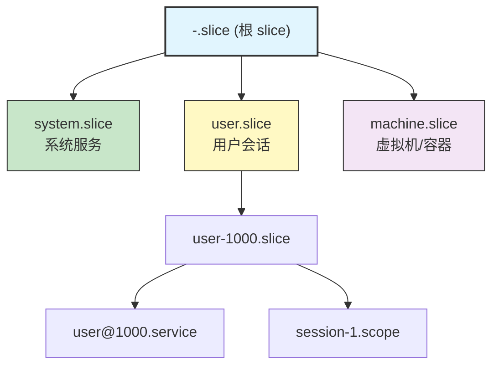

# 32 - systemd 全面指南

> systemd 是现代 Linux 系统的核心初始化系统和服务管理器。它远不止是一个 init 替代品——它是一整套系统管理工具的集合，涵盖了服务管理、日志、网络、DNS、容器、引导加载等方方面面。本章将深入探讨 systemd 的每一个组件，助你彻底掌握 Arch Linux 的系统管理。

---

## 32.1 systemd 架构总览

### PID 1 的角色

systemd 作为 PID 1 运行，是内核启动后执行的第一个用户空间进程：


### 核心组件关系图

```mermaid
graph TD
    PID1["systemd (PID 1)"]
    PID1 --> journald["systemd-journald"]
    PID1 --> logind["systemd-logind"]
    PID1 --> resolved["systemd-resolved"]
    PID1 --> networkd["systemd-networkd"]
    PID1 --> udevd["systemd-udevd"]
    PID1 --> tmpfiles["systemd-tmpfiles"]
    PID1 --> sysusers["systemd-sysusers"]
    PID1 --> nspawn["systemd-nspawn"]
    PID1 --> boot["systemd-boot"]
    PID1 --> coredump["systemd-coredump"]
    PID1 --> run["systemd-run"]
    PID1 --> analyze["systemd-analyze"]
    PID1 --> oomd["systemd-oomd"]
    PID1 --> cryptenr["systemd-cryptenroll"]
    PID1 --> repart["systemd-repart"]
    style PID1 fill:#e1f5fe,stroke:#333,stroke-width:2px
    style journald fill:#fff9c4,stroke:#333
    style logind fill:#fff9c4,stroke:#333
    style resolved fill:#fff9c4,stroke:#333
    style networkd fill:#fff9c4,stroke:#333
    style udevd fill:#fff9c4,stroke:#333
    style tmpfiles fill:#c8e6c9,stroke:#333
    style sysusers fill:#c8e6c9,stroke:#333
    style nspawn fill:#c8e6c9,stroke:#333
    style boot fill:#c8e6c9,stroke:#333
    style coredump fill:#c8e6c9,stroke:#333
    style run fill:#f3e5f5,stroke:#333
    style analyze fill:#f3e5f5,stroke:#333
    style oomd fill:#f3e5f5,stroke:#333
    style cryptenr fill:#f3e5f5,stroke:#333
    style repart fill:#f3e5f5,stroke:#333
```



### Unit 文件搜索路径

| 优先级 | 路径 | 说明 |
|--------|------|------|
| 1（最高） | `/etc/systemd/system/` | 管理员自定义 |
| 2 | `/run/systemd/system/` | 运行时生成 |
| 3 | `/usr/lib/systemd/system/` | 软件包安装 |

用户级 Unit 文件路径：

| 优先级 | 路径 |
|--------|------|
| 1 | `~/.config/systemd/user/` |
| 2 | `/etc/systemd/user/` |
| 3 | `/usr/lib/systemd/user/` |

---

## 32.2 systemctl 高级用法

### 基础操作

```bash
# 启动/停止/重启/重载
systemctl start nginx.service
systemctl stop nginx.service
systemctl restart nginx.service
systemctl reload nginx.service

# 开机自启
systemctl enable nginx.service
systemctl disable nginx.service

# 同时启动并设置自启
systemctl enable --now nginx.service

# 查看状态
systemctl status nginx.service
```

### mask 与 unmask

`mask` 会将 Unit 链接到 `/dev/null`，使其完全无法启动（包括作为依赖被拉起）：

```bash
# 彻底屏蔽服务
systemctl mask NetworkManager.service
# ls -la /etc/systemd/system/NetworkManager.service
# lrwxrwxrwx 1 root root 9 ... /etc/systemd/system/NetworkManager.service -> /dev/null

# 取消屏蔽
systemctl unmask NetworkManager.service
```

### preset

`preset` 根据预设策略启用或禁用 Unit：

```bash
# 根据预设恢复默认启用/禁用状态
systemctl preset sshd.service

# 重置所有 Unit
systemctl preset-all

# 查看预设文件
cat /usr/lib/systemd/system-preset/90-systemd.preset
```

预设文件格式：

```ini
# /usr/lib/systemd/system-preset/90-systemd.preset
enable sshd.service
disable bluetooth.service
enable getty@.service
```

### edit（覆盖配置）

```bash
# 创建 drop-in 覆盖文件（推荐）
systemctl edit nginx.service
# 编辑 /etc/systemd/system/nginx.service.d/override.conf

# 编辑完整 Unit 文件副本
systemctl edit --full nginx.service
# 编辑 /etc/systemd/system/nginx.service

# 使用 --force 为不存在的 Unit 创建新文件
systemctl edit --force --full my-custom.service
```

### cat（查看 Unit 文件）

```bash
# 显示 Unit 文件完整内容（包括 drop-in）
systemctl cat nginx.service

# 输出示例：
# /usr/lib/systemd/system/nginx.service
# [Unit]
# Description=A high performance web server
# ...
# /etc/systemd/system/nginx.service.d/override.conf
# [Service]
# LimitNOFILE=65536
```

### show（机器可读属性）

```bash
# 显示所有属性
systemctl show nginx.service

# 显示指定属性
systemctl show -p MainPID nginx.service
systemctl show -p MemoryCurrent nginx.service
systemctl show -p CPUUsageNSec nginx.service

# 显示多个属性
systemctl show -p MainPID -p ActiveState -p SubState nginx.service
```

### 其他高级用法

```bash
# 列出所有 Unit
systemctl list-units
systemctl list-units --type=service --state=running

# 列出所有 Unit 文件
systemctl list-unit-files

# 列出失败的 Unit
systemctl list-units --failed

# 列出依赖关系
systemctl list-dependencies nginx.service
systemctl list-dependencies --reverse nginx.service

# 重新加载 systemd 管理器配置
systemctl daemon-reload

# 重新执行 systemd（用于升级后）
systemctl daemon-reexec

# 切换到救援模式/紧急模式
systemctl rescue
systemctl emergency

# 关机/重启
systemctl poweroff
systemctl reboot
systemctl halt

# 挂起/休眠
systemctl suspend
systemctl hibernate
systemctl hybrid-sleep
```

---

## 32.3 Unit 文件编写详解

### [Unit] 段

```ini
[Unit]
# 描述信息
Description=My Custom Service

# 文档链接
Documentation=man:myapp(8)
Documentation=https://example.com/docs

# 依赖关系 —— 需要的 Unit（一起启动，被依赖项失败则本 Unit 也失败）
Requires=postgresql.service

# 弱依赖（一起启动，但被依赖项失败不影响本 Unit）
Wants=redis.service

# 仅排序，不拉起依赖
After=network-online.target postgresql.service
Before=nginx.service

# 绑定依赖（被依赖项停止时本 Unit 也停止）
BindsTo=dev-sda1.device

# 与某 Unit 冲突
Conflicts=iptables.service

# 条件检查（不满足则跳过，不报错）
ConditionPathExists=/etc/myapp/config.toml
ConditionPathIsDirectory=/var/lib/myapp
ConditionFileNotEmpty=/etc/myapp/license.key
ConditionVirtualization=!container
ConditionACPower=true
ConditionMemory=>=2G
ConditionCPUs=>=2

# 断言检查（不满足则报错）
AssertPathExists=/usr/bin/myapp

# 启动限制
StartLimitIntervalSec=60
StartLimitBurst=5
StartLimitAction=reboot

# 失败时的操作
OnFailure=notify-admin@%n.service
OnSuccess=cleanup.service

# 传播重载
PropagatesReloadTo=myapp-worker@*.service
ReloadPropagatedFrom=myapp.service
```

### [Service] 段

```ini
[Service]
# 服务类型
Type=notify
# simple    - 默认值，启动进程即为主进程
# forking   - 传统 daemon，启动后 fork 出子进程
# oneshot   - 一次性任务，执行完退出
# notify    - 通过 sd_notify() 通知就绪
# dbus      - 获取 D-Bus 名称后算就绪
# idle      - 等待所有任务完成后才启动
# exec      - 类似 simple，但 exec() 成功后才算启动

# 主进程与 PID 文件
ExecStart=/usr/bin/myapp --config /etc/myapp/config.toml
PIDFile=/run/myapp.pid

# 启动前/后命令
ExecStartPre=/usr/bin/myapp --check-config
ExecStartPost=/usr/bin/notify-ready

# 重载命令
ExecReload=/bin/kill -HUP $MAINPID

# 停止命令和超时
ExecStop=/usr/bin/myapp --shutdown
TimeoutStartSec=30
TimeoutStopSec=30
TimeoutSec=30

# 重启策略
Restart=on-failure
# no           - 不重启
# on-success   - 仅正常退出时重启
# on-failure   - 非正常退出时重启
# on-abnormal  - 信号/超时/看门狗时重启
# on-watchdog  - 仅看门狗超时时重启
# on-abort     - 仅信号导致退出时重启
# always       - 总是重启

RestartSec=5
RestartSteps=5
RestartMaxDelaySec=60

# 看门狗
WatchdogSec=30

# 用户和组
User=myapp
Group=myapp
DynamicUser=yes
SupplementaryGroups=audio video

# 工作目录
WorkingDirectory=/var/lib/myapp
RootDirectory=/srv/myapp-root
RootImage=/srv/myapp.raw

# 环境变量
Environment=NODE_ENV=production
Environment="DATABASE_URL=postgresql://localhost/mydb"
EnvironmentFile=/etc/myapp/env
EnvironmentFile=-/etc/myapp/env.local

# 标准输入输出
StandardOutput=journal
StandardError=journal
StandardInput=null
SyslogIdentifier=myapp
LogLevelMax=warning

# 文件描述符限制
LimitNOFILE=65536
LimitNPROC=4096
LimitCORE=infinity

# OOM 设置
OOMPolicy=stop
OOMScoreAdjust=-500

# 通知套接字
NotifyAccess=main

# 进程 capability
AmbientCapabilities=CAP_NET_BIND_SERVICE
CapabilityBoundingSet=CAP_NET_BIND_SERVICE CAP_DAC_READ_SEARCH

# 临时目录
PrivateTmp=yes
```

### [Install] 段

```ini
[Install]
# 被哪个 target 拉起
WantedBy=multi-user.target

# 强依赖安装（少用）
RequiredBy=critical-app.target

# 别名
Alias=myapp.service

# 同时启用的 Unit
Also=myapp-worker.service myapp-scheduler.service

# 默认实例（用于模板 Unit）
DefaultInstance=main
```

---

## 32.4 各种 Unit 类型实战

### .service — simple 类型

```ini
# /etc/systemd/system/myapp.service
[Unit]
Description=My Application Server
After=network-online.target
Wants=network-online.target

[Service]
Type=simple
User=myapp
ExecStart=/usr/bin/myapp serve
Restart=on-failure
RestartSec=5

[Install]
WantedBy=multi-user.target
```

### .service — forking 类型

```ini
# /etc/systemd/system/legacy-daemon.service
[Unit]
Description=Legacy Daemon
After=network.target

[Service]
Type=forking
PIDFile=/run/legacy-daemon.pid
ExecStart=/usr/sbin/legacy-daemon -d
ExecReload=/bin/kill -HUP $MAINPID
Restart=on-failure

[Install]
WantedBy=multi-user.target
```

### .service — oneshot 类型

```ini
# /etc/systemd/system/system-cleanup.service
[Unit]
Description=System Cleanup Task

[Service]
Type=oneshot
RemainAfterExit=yes
ExecStart=/usr/local/bin/cleanup.sh
ExecStart=/usr/bin/rm -rf /tmp/build-*
ExecStart=/usr/bin/journalctl --vacuum-time=7d

[Install]
WantedBy=multi-user.target
```

### .service — notify 类型

```ini
# /etc/systemd/system/notify-app.service
[Unit]
Description=Application with sd_notify Support

[Service]
Type=notify
ExecStart=/usr/bin/notify-app
WatchdogSec=30
Restart=on-failure

[Install]
WantedBy=multi-user.target
```

### .service — dbus 类型

```ini
# /etc/systemd/system/dbus-app.service
[Unit]
Description=D-Bus Activated Service

[Service]
Type=dbus
BusName=org.example.MyApp
ExecStart=/usr/bin/dbus-app

[Install]
WantedBy=multi-user.target
```

### .timer — 替代 cron

systemd timer 比 cron 更强大，支持更精确的时间控制和依赖管理。

**单调定时器（相对时间）：**

```ini
# /etc/systemd/system/backup.timer
[Unit]
Description=Run Backup Every 6 Hours

[Timer]
OnBootSec=15min
OnUnitActiveSec=6h
AccuracySec=1min
RandomizedDelaySec=30min
Persistent=true

[Install]
WantedBy=timers.target
```

**日历定时器（绝对时间）：**

```ini
# /etc/systemd/system/daily-report.timer
[Unit]
Description=Generate Daily Report at 2:30 AM

[Timer]
OnCalendar=*-*-* 02:30:00
Persistent=true
RandomizedDelaySec=10min

[Install]
WantedBy=timers.target
```

**OnCalendar 语法详解：**

```bash
# 格式: DayOfWeek Year-Month-Day Hour:Minute:Second

# 每天午夜
OnCalendar=daily
OnCalendar=*-*-* 00:00:00

# 每小时
OnCalendar=hourly
OnCalendar=*-*-* *:00:00

# 每周一 9:00
OnCalendar=Mon *-*-* 09:00:00

# 每月 1 日和 15 日
OnCalendar=*-*-01,15 00:00:00

# 每 5 分钟
OnCalendar=*-*-* *:00/5:00

# 工作日每天 8-18 点每小时
OnCalendar=Mon..Fri *-*-* 08..18:00:00

# 每季度第一天
OnCalendar=*-01,04,07,10-01 00:00:00

# 验证日历表达式
systemd-analyze calendar "Mon *-*-* 09:00:00"
systemd-analyze calendar --iterations=5 "Mon..Fri *-*-* 08:00:00"
```

**Timer 关键字段：**

| 字段 | 说明 |
|------|------|
| `OnActiveSec` | Timer 激活后延迟 |
| `OnBootSec` | 系统启动后延迟 |
| `OnStartupSec` | systemd 启动后延迟 |
| `OnUnitActiveSec` | 关联 Unit 上次激活后延迟 |
| `OnUnitInactiveSec` | 关联 Unit 上次停止后延迟 |
| `OnCalendar` | 日历时间表达式 |
| `Persistent` | 错过执行时间后是否补执行 |
| `RandomizedDelaySec` | 随机延迟（避免同时执行） |
| `AccuracySec` | 精度（默认 1min，设为 1us 可提高精度） |
| `FixedRandomDelay` | 随机延迟在重启间保持不变 |
| `WakeSystem` | 是否唤醒挂起的系统 |
| `Unit` | 触发的 Unit（默认同名 .service） |

```bash
# 查看所有 timer
systemctl list-timers --all

# 手动触发
systemctl start backup.service
```

### .socket — Socket 激活

Socket 激活允许服务按需启动，由 systemd 监听端口，在收到连接时才启动实际服务：

```ini
# /etc/systemd/system/myapp.socket
[Unit]
Description=MyApp Socket

[Socket]
ListenStream=8080
ListenStream=/run/myapp.sock
Accept=no
SocketMode=0660
SocketUser=myapp
SocketGroup=myapp
Backlog=128
MaxConnections=256
KeepAlive=true
NoDelay=true
FreeBind=true

[Install]
WantedBy=sockets.target
```

```ini
# /etc/systemd/system/myapp.service
[Unit]
Description=MyApp Service
Requires=myapp.socket

[Service]
Type=notify
ExecStart=/usr/bin/myapp
User=myapp
NonBlocking=true

# 文件描述符由 socket Unit 传递
# 服务代码通过 sd_listen_fds() 或 LISTEN_FDS 环境变量获取
```

```bash
# 启用 socket（不启用 service）
systemctl enable --now myapp.socket

# 检查 socket 状态
systemctl status myapp.socket
ss -tlnp | grep 8080
```

**Accept=yes 模式（每个连接启动一个实例）：**

```ini
# /etc/systemd/system/echo@.service
[Unit]
Description=Echo Server Instance

[Service]
ExecStart=/usr/bin/cat
StandardInput=socket
StandardOutput=socket
```

```ini
# /etc/systemd/system/echo.socket
[Unit]
Description=Echo Server Socket

[Socket]
ListenStream=7777
Accept=yes

[Install]
WantedBy=sockets.target
```

### .path — 文件监控触发

```ini
# /etc/systemd/system/upload-watcher.path
[Unit]
Description=Watch for New Uploads

[Path]
PathExistsGlob=/srv/uploads/*.csv
PathModified=/srv/uploads/
MakeDirectory=yes
DirectoryMode=0755
TriggerLimitIntervalSec=5s
TriggerLimitBurst=10

[Install]
WantedBy=multi-user.target
```

```ini
# /etc/systemd/system/upload-watcher.service
[Unit]
Description=Process Uploaded Files

[Service]
Type=oneshot
ExecStart=/usr/local/bin/process-uploads.sh
```

**Path 监控选项：**

| 选项 | 说明 |
|------|------|
| `PathExists` | 文件/目录存在时触发 |
| `PathExistsGlob` | 匹配 glob 的文件存在时触发 |
| `PathChanged` | 文件变更后关闭时触发 |
| `PathModified` | 文件被写入时触发 |
| `DirectoryNotEmpty` | 目录非空时触发 |

### .mount 与 .automount

```ini
# /etc/systemd/system/mnt-data.mount
# 注意：文件名必须与挂载点对应（mnt-data = /mnt/data）
[Unit]
Description=Mount Data Partition
After=blockdev@dev-sdb1.target

[Mount]
What=/dev/sdb1
Where=/mnt/data
Type=ext4
Options=defaults,noatime
TimeoutSec=30
DirectoryMode=0755
SloppyOptions=yes
LazyUnmount=yes

[Install]
WantedBy=multi-user.target
```

```ini
# /etc/systemd/system/mnt-data.automount
[Unit]
Description=Automount Data Partition

[Automount]
Where=/mnt/data
TimeoutIdleSec=300
DirectoryMode=0755

[Install]
WantedBy=multi-user.target
```

```bash
# 启用自动挂载
systemctl enable --now mnt-data.automount

# 访问 /mnt/data 时自动挂载，5 分钟无访问后自动卸载
```

### .slice — 资源分组

```ini
# /etc/systemd/system/webapps.slice
[Unit]
Description=Web Applications Slice

[Slice]
CPUQuota=200%
MemoryMax=4G
MemoryHigh=3G
IOWeight=100
TasksMax=1024
```

```ini
# 在 service 中引用 slice
[Service]
Slice=webapps.slice
```

默认 slice 层次结构：



### .scope

Scope 用于管理外部创建的进程组（不由 systemd 启动，而是通过 D-Bus API 注册）：

```bash
# 用 systemd-run 创建 scope
systemd-run --scope --unit=my-build --slice=webapps.slice make -j$(nproc)

# 查看 scope
systemctl status my-build.scope
```

### .target — 自定义目标

```ini
# /etc/systemd/system/app-ready.target
[Unit]
Description=Application Stack Ready
Requires=postgresql.service redis.service
After=postgresql.service redis.service
Wants=myapp.service myapp-worker.service

[Install]
WantedBy=multi-user.target
```

常用系统 target：

| Target | 说明 |
|--------|------|
| `poweroff.target` | 关机 |
| `rescue.target` | 救援模式（单用户） |
| `multi-user.target` | 多用户命令行 |
| `graphical.target` | 图形界面 |
| `reboot.target` | 重启 |
| `emergency.target` | 紧急模式 |
| `network-online.target` | 网络就绪 |

```bash
# 设置默认 target
systemctl set-default multi-user.target

# 切换 target
systemctl isolate rescue.target

# 查看默认 target
systemctl get-default
```

### .device

Device Unit 由 udev 自动生成，通常不需要手动创建：

```bash
# 查看设备 Unit
systemctl list-units --type=device

# 查看特定设备
systemctl status dev-sda1.device
```

---

## 32.5 systemd-tmpfiles

管理临时文件和目录的创建、清理和权限设置：

```bash
# 配置文件位置
# /etc/tmpfiles.d/         — 管理员配置
# /run/tmpfiles.d/         — 运行时配置
# /usr/lib/tmpfiles.d/     — 软件包配置
```

```ini
# /etc/tmpfiles.d/myapp.conf
# 类型 路径                    权限  用户  组     有效期 参数

# 创建目录
d /run/myapp                  0755  myapp myapp  -
d /var/lib/myapp              0750  myapp myapp  -
d /var/log/myapp              0755  myapp myapp  -

# 创建文件
f /var/log/myapp/access.log   0644  myapp myapp  -
f+ /etc/myapp/default.conf    0644  root  root   - "key=value"

# 创建符号链接
L /etc/myapp/config           -     -     -      - /var/lib/myapp/config

# 清理过期文件
e /tmp/myapp-*                -     -     -      7d
e /var/log/myapp/*.log        -     -     -      30d

# 设置权限（不创建）
z /dev/kvm                    0660  root  kvm    -

# 递归设置权限
Z /var/lib/myapp              0750  myapp myapp  -

# 创建子卷（Btrfs）
v /var/lib/machines            0755  root  root   -

# 写入文件内容
w /proc/sys/vm/swappiness      -     -     -      - 10

# 删除文件
r /tmp/myapp-*                 -     -     -      -

# 递归删除
R /var/cache/myapp             -     -     -      -
```

```bash
# 手动执行
systemd-tmpfiles --create
systemd-tmpfiles --clean
systemd-tmpfiles --remove

# 仅处理特定配置
systemd-tmpfiles --create /etc/tmpfiles.d/myapp.conf
```

---

## 32.6 systemd-sysusers

声明式用户和组管理：

```ini
# /etc/sysusers.d/myapp.conf
# 类型  名称    ID     GECOS          Home 目录         Shell

# 创建系统用户（同时创建同名组）
u myapp  -      "MyApp Service"  /var/lib/myapp     /usr/bin/nologin

# 创建系统用户（指定 UID）
u myapp  500    "MyApp Service"  /var/lib/myapp     -

# 创建系统组
g myapp-admin 501

# 将用户加入组
m myuser myapp-admin

# 创建用户和组（指定 UID:GID）
u myapp 500:500 "MyApp Service"

# 使用 UID/GID 范围
u myapp 500-599 "MyApp Service"
```

```bash
# 执行
systemd-sysusers
systemd-sysusers /etc/sysusers.d/myapp.conf
```

---

## 32.7 systemd-resolved

DNS 解析服务：

```bash
# 启用
systemctl enable --now systemd-resolved

# 配置 /etc/systemd/resolved.conf
```

```ini
# /etc/systemd/resolved.conf
[Resolve]
DNS=1.1.1.1#cloudflare-dns.com 8.8.8.8#dns.google
FallbackDNS=9.9.9.9#dns.quad9.net
Domains=~.
DNSSEC=allow-downgrade
DNSOverTLS=opportunistic
MulticastDNS=yes
LLMNR=yes
Cache=yes
CacheFromLocalhost=no
DNSStubListener=yes
DNSStubListenerExtra=127.0.0.53
ReadEtcHosts=yes
```

```bash
# 设置 /etc/resolv.conf 符号链接
ln -sf /run/systemd/resolve/stub-resolv.conf /etc/resolv.conf

# resolvectl 使用
resolvectl status
resolvectl query archlinux.org
resolvectl statistics
resolvectl flush-caches
resolvectl dns eth0 1.1.1.1
resolvectl domain eth0 ~example.com
resolvectl dnsovertls eth0 yes
resolvectl dnssec eth0 yes
resolvectl log-level debug
```

---

## 32.8 systemd-networkd

网络配置管理：

```bash
systemctl enable --now systemd-networkd
```

**.network 文件（网络配置）：**

```ini
# /etc/systemd/network/20-wired.network
[Match]
Name=en*
Type=ether

[Network]
DHCP=yes
DNS=1.1.1.1
Domains=~.
DNSSEC=allow-downgrade
DNSOverTLS=opportunistic
IPv6AcceptRA=yes
IPv6PrivacyExtensions=yes
LLDP=yes
EmitLLDP=customer-bridge

[DHCPv4]
UseDNS=no
UseNTP=yes
RouteMetric=100
UseDomains=yes

[DHCPv6]
UseDNS=no
UseNTP=yes
```

```ini
# /etc/systemd/network/30-static.network
[Match]
Name=eth0

[Network]
Address=192.168.1.100/24
Gateway=192.168.1.1
DNS=1.1.1.1 8.8.8.8

[Route]
Destination=10.0.0.0/8
Gateway=192.168.1.254
Metric=200
```

**.netdev 文件（虚拟网络设备）：**

```ini
# /etc/systemd/network/10-bridge.netdev
[NetDev]
Name=br0
Kind=bridge

[Bridge]
ForwardDelaySec=0
STP=no
```

```ini
# /etc/systemd/network/10-vlan.netdev
[NetDev]
Name=vlan100
Kind=vlan

[VLAN]
Id=100
```

```ini
# /etc/systemd/network/10-wireguard.netdev
[NetDev]
Name=wg0
Kind=wireguard

[WireGuard]
PrivateKey=AAAA...
ListenPort=51820

[WireGuardPeer]
PublicKey=BBBB...
AllowedIPs=10.0.0.0/24
Endpoint=peer.example.com:51820
PersistentKeepalive=25
```

**.link 文件（链路层配置）：**

```ini
# /etc/systemd/network/10-eth.link
[Match]
MACAddress=00:11:22:33:44:55

[Link]
Name=lan0
MTUBytes=9000
WakeOnLan=magic
ReceiveChecksumOffload=true
TransmitChecksumOffload=true
```

```bash
# 管理命令
networkctl list
networkctl status
networkctl status eth0
networkctl up eth0
networkctl down eth0
networkctl reload
networkctl reconfigure eth0
```

---

## 32.9 systemd-logind

会话管理：

```bash
# 查看会话
loginctl list-sessions
loginctl session-status
loginctl show-session 1

# 查看用户
loginctl list-users
loginctl user-status 1000
loginctl enable-linger myuser
loginctl disable-linger myuser

# 查看 seat
loginctl list-seats
loginctl seat-status seat0

# 锁定/解锁会话
loginctl lock-session
loginctl unlock-session
loginctl lock-sessions

# 终止会话
loginctl terminate-session 1
loginctl terminate-user myuser

# inhibit 锁（阻止关机/挂起等）
systemd-inhibit --what=shutdown:sleep --who="Backup" --why="Backup in progress" /usr/bin/backup.sh
systemd-inhibit --list
```

```ini
# /etc/systemd/logind.conf
[Login]
HandlePowerKey=poweroff
HandleSuspendKey=suspend
HandleHibernateKey=hibernate
HandleLidSwitch=suspend
HandleLidSwitchExternalPower=ignore
HandleLidSwitchDocked=ignore
IdleAction=suspend
IdleActionSec=30min
KillUserProcesses=no
KillOnlyUsers=
KillExcludeUsers=root
InhibitDelayMaxSec=5
UserStopDelaySec=10
```

---

## 32.10 systemd-journald

日志系统：

```ini
# /etc/systemd/journald.conf
[Journal]
Storage=persistent
Compress=yes
Seal=yes
SplitMode=uid
MaxRetentionSec=1month
MaxFileSec=1week
SystemMaxUse=4G
SystemKeepFree=8G
SystemMaxFileSize=128M
RuntimeMaxUse=256M
ForwardToSyslog=no
ForwardToConsole=no
ForwardToWall=yes
MaxLevelStore=debug
MaxLevelSyslog=debug
Audit=yes
```

```bash
# 基本查询
journalctl
journalctl -b                         # 当前启动
journalctl -b -1                      # 上次启动
journalctl --list-boots               # 列出所有启动记录

# 按 Unit 过滤
journalctl -u nginx.service
journalctl -u nginx.service -u php-fpm.service

# 按时间过滤
journalctl --since "2024-01-01 00:00:00"
journalctl --since "1 hour ago"
journalctl --since yesterday --until today

# 按优先级
journalctl -p err                     # 仅错误及以上
journalctl -p warning..err            # 警告到错误

# 按进程/用户
journalctl _PID=1234
journalctl _UID=1000
journalctl _COMM=sshd

# 实时追踪
journalctl -f
journalctl -f -u nginx.service

# 输出格式
journalctl -o json-pretty
journalctl -o short-iso
journalctl -o verbose
journalctl -o cat

# 内核消息
journalctl -k
journalctl -k -b -1

# 磁盘使用
journalctl --disk-usage

# 清理
journalctl --vacuum-size=1G
journalctl --vacuum-time=30d
journalctl --vacuum-files=10

# 验证日志完整性
journalctl --verify

# 导出/导入
journalctl --output=export > journal-export.bin
systemd-journal-remote --output=/var/log/journal/remote/ < journal-export.bin
```

---

## 32.11 systemd-nspawn

轻量级容器（增强版 chroot）：

```bash
# 使用 pacstrap 创建容器
mkdir -p /var/lib/machines/arch-container
pacstrap -c /var/lib/machines/arch-container base

# 启动容器
systemd-nspawn -D /var/lib/machines/arch-container

# 启动容器（完整 boot）
systemd-nspawn -bD /var/lib/machines/arch-container

# 使用 machinectl 管理
machinectl list
machinectl start arch-container
machinectl login arch-container
machinectl shell arch-container
machinectl poweroff arch-container
machinectl enable arch-container
machinectl clone arch-container arch-container-2
machinectl remove arch-container-2
```

```ini
# /etc/systemd/nspawn/arch-container.nspawn
[Exec]
Boot=yes
PrivateUsers=pick
NotifyReady=yes
Capability=CAP_NET_ADMIN
SystemCallFilter=~@mount

[Files]
Bind=/srv/shared:/shared
BindReadOnly=/etc/resolv.conf
TemporaryFileSystem=/tmp
Volatile=no
PrivateUsersOwnership=auto

[Network]
Zone=containers
Port=tcp:8080:80
Port=tcp:8443:443
VirtualEthernet=yes
Bridge=br0
```

```bash
# 网络模式
systemd-nspawn -bD /path --network-veth          # 虚拟以太网对
systemd-nspawn -bD /path --network-bridge=br0     # 桥接
systemd-nspawn -bD /path --network-zone=myzone    # 区域网络
systemd-nspawn -bD /path --network-namespace-path=/run/netns/ns1

# 使用磁盘镜像
systemd-nspawn -bi /path/to/image.raw
```

---

## 32.12 systemd-boot

UEFI 引导加载程序：

```bash
# 安装
bootctl install

# 更新
bootctl update

# 状态
bootctl status
bootctl list
```

```ini
# /boot/loader/loader.conf
default  arch.conf
timeout  3
console-mode max
editor   no
auto-entries   yes
auto-firmware  yes
beep     no
```

```ini
# /boot/loader/entries/arch.conf
title   Arch Linux
linux   /vmlinuz-linux
initrd  /initramfs-linux.img
options root=PARTUUID=xxxx rw quiet

# /boot/loader/entries/arch-fallback.conf
title   Arch Linux (fallback)
linux   /vmlinuz-linux
initrd  /initramfs-linux-fallback.img
options root=PARTUUID=xxxx rw
```

```bash
# 自动更新 systemd-boot（pacman hook）
# /etc/pacman.d/hooks/95-systemd-boot.hook
[Trigger]
Type = Package
Operation = Upgrade
Target = systemd

[Action]
Description = Updating systemd-boot
When = PostTransaction
Exec = /usr/bin/systemctl restart systemd-boot-update.service
```

---

## 32.13 systemd-run

临时运行服务或 scope：

```bash
# 临时 service（后台）
systemd-run --unit=my-backup /usr/local/bin/backup.sh

# 临时 scope（前台）
systemd-run --scope --unit=my-build make -j$(nproc)

# 带资源限制
systemd-run --scope -p MemoryMax=2G -p CPUQuota=50% ./heavy-task

# 指定用户
systemd-run --uid=myapp --gid=myapp /usr/bin/myapp

# 带定时器
systemd-run --on-calendar="*-*-* 02:00:00" /usr/local/bin/cleanup.sh
systemd-run --on-active=30min /usr/local/bin/remind.sh

# 在用户实例中运行
systemd-run --user --unit=my-task /usr/bin/my-task

# 带沙箱
systemd-run --scope -p ProtectHome=yes -p PrivateTmp=yes ./untrusted-script

# 交互式 shell
systemd-run --shell -p MemoryMax=1G

# 在容器中运行
systemd-run -M arch-container /usr/bin/some-command
```

---

## 32.14 systemd-analyze

启动性能分析和系统调试：

```bash
# 启动耗时总览
systemd-analyze time

# 各 Unit 启动耗时排序
systemd-analyze blame

# 关键链分析（显示阻塞关系）
systemd-analyze critical-chain
systemd-analyze critical-chain nginx.service

# 生成启动时序图（SVG）
systemd-analyze plot > boot-plot.svg

# 生成依赖关系图
systemd-analyze dot nginx.service | dot -Tsvg > nginx-deps.svg
systemd-analyze dot --to-pattern='*.target' | dot -Tsvg > targets.svg

# 安全审计
systemd-analyze security
systemd-analyze security nginx.service

# 验证 Unit 文件
systemd-analyze verify /etc/systemd/system/myapp.service

# 分析日历表达式
systemd-analyze calendar "Mon..Fri *-*-* 08:00:00"
systemd-analyze calendar --iterations=10 "daily"

# 分析时间跨度
systemd-analyze timespan "2h 30min"

# 显示默认配置值
systemd-analyze cat-config systemd/system.conf
systemd-analyze cat-config systemd/journald.conf

# 查看 Unit 文件路径
systemd-analyze unit-paths

# 查看启动条件
systemd-analyze condition 'ConditionPathExists=/etc/myapp.conf'

# 导出启动日志
systemd-analyze log-level debug
journalctl -b > boot-log.txt
systemd-analyze log-level info
```

---

## 32.15 systemd-coredump

核心转储管理：

```ini
# /etc/systemd/coredump.conf
[Coredump]
Storage=external
Compress=yes
ProcessSizeMax=2G
ExternalSizeMax=2G
JournalSizeMax=767M
MaxUse=10G
KeepFree=2G
```

```bash
# 查看核心转储列表
coredumpctl list
coredumpctl list myapp

# 查看详细信息
coredumpctl info

# 导出核心转储
coredumpctl dump -o core.dump

# 使用 gdb 调试
coredumpctl debug myapp

# 确保 sysctl 配置正确
cat /proc/sys/kernel/core_pattern
# 应显示: |/usr/lib/systemd/systemd-coredump %P %u %g %s %t %c %h
```

---

## 32.16 systemd-oomd

OOM（Out Of Memory）守护进程：

```bash
systemctl enable --now systemd-oomd
```

```ini
# /etc/systemd/oomd.conf
[OOM]
SwapUsedLimit=90%
DefaultMemoryPressureLimit=60%
DefaultMemoryPressureDurationUSec=30s
```

```ini
# 在 service 中启用 oomd
[Service]
ManagedOOMSwap=kill
ManagedOOMMemoryPressure=kill
ManagedOOMMemoryPressureLimit=80%
ManagedOOMPreference=avoid
```

```bash
# 查看状态
oomctl
systemctl status systemd-oomd
journalctl -u systemd-oomd
```

---

## 32.17 systemd-stub 与 UKI（统一内核镜像）

UKI 将内核、initramfs、命令行参数、启动 stub 合并为单个 EFI 可执行文件：

```bash
# 安装依赖
pacman -S systemd ukify

# 创建 UKI
ukify build \
    --linux=/boot/vmlinuz-linux \
    --initrd=/boot/initramfs-linux.img \
    --cmdline="root=PARTUUID=xxxx rw quiet" \
    --os-release=@/etc/os-release \
    --output=/boot/EFI/Linux/arch-linux.efi

# 使用 mkinitcpio 自动生成 UKI
# /etc/mkinitcpio.d/linux.preset
PRESETS=('default' 'fallback')
default_uki="/boot/EFI/Linux/arch-linux.efi"
default_options="--splash /usr/share/systemd/bootctl/splash-arch.bmp"
fallback_uki="/boot/EFI/Linux/arch-linux-fallback.efi"
fallback_options="-S autodetect"

# 重新生成
mkinitcpio -P
```

---

## 32.18 systemd-cryptenroll

LUKS 磁盘加密密钥管理：

```bash
# 查看已注册的密钥
systemd-cryptenroll /dev/sda2

# 注册 TPM2 自动解锁
systemd-cryptenroll --tpm2-device=auto /dev/sda2

# 指定 PCR 策略
systemd-cryptenroll --tpm2-device=auto --tpm2-pcrs=0+7 /dev/sda2

# 注册 FIDO2 安全密钥
systemd-cryptenroll --fido2-device=auto /dev/sda2

# 注册恢复密钥
systemd-cryptenroll --recovery-key /dev/sda2

# 注册新密码
systemd-cryptenroll --password /dev/sda2

# 删除密钥槽
systemd-cryptenroll --wipe-slot=1 /dev/sda2
systemd-cryptenroll --wipe-slot=tpm2 /dev/sda2

# 在 /etc/crypttab 中使用 TPM2
# myvolume /dev/sda2 - tpm2-device=auto
```

---

## 32.19 systemd-repart

声明式分区管理：

```ini
# /etc/repart.d/10-root.conf
[Partition]
Type=root
Format=ext4
Label=arch-root
Minimize=no
SizeMinBytes=20G
SizeMaxBytes=50G
CopyFiles=/

# /etc/repart.d/20-home.conf
[Partition]
Type=home
Format=ext4
Label=arch-home
SizeMinBytes=10G
Weight=100

# /etc/repart.d/30-swap.conf
[Partition]
Type=swap
Label=arch-swap
SizeMinBytes=2G
SizeMaxBytes=8G
```

```bash
# 预览
systemd-repart --dry-run /dev/sda

# 执行
systemd-repart /dev/sda
```

---

## 32.20 systemd-sysext

系统扩展镜像：

```bash
# 扩展镜像放在 /var/lib/extensions/ 或 /run/extensions/
# 每个扩展是一个目录或 .raw 镜像，包含 usr/ 和 opt/ 的文件

# 创建扩展目录
mkdir -p /var/lib/extensions/myext/usr/bin
cp /path/to/myapp /var/lib/extensions/myext/usr/bin/

# 创建扩展元数据
mkdir -p /var/lib/extensions/myext/usr/lib/extension-release.d
cat > /var/lib/extensions/myext/usr/lib/extension-release.d/extension-release.myext <<EOF
ID=arch
VERSION_ID=rolling
EOF

# 合并扩展
systemd-sysext merge

# 查看状态
systemd-sysext status

# 取消合并
systemd-sysext unmerge

# 刷新（取消 + 重新合并）
systemd-sysext refresh
```

---

## 32.21 systemd-portabled

可移植服务管理：

```bash
# 附加可移植服务镜像
portablectl attach myservice.raw

# 分离
portablectl detach myservice.raw

# 列出
portablectl list

# 查看镜像内容
portablectl inspect myservice.raw

# 附加并设置配置
portablectl attach --profile=default myservice.raw
```

---

## 32.22 用户级 systemd

```bash
# 用户级命令
systemctl --user start myapp.service
systemctl --user enable myapp.service
systemctl --user status myapp.service
systemctl --user daemon-reload

# 用户 Unit 文件位置
# ~/.config/systemd/user/

# 启用 linger（用户未登录时也运行服务）
loginctl enable-linger myuser

# 查看用户实例日志
journalctl --user -u myapp.service

# 环境变量
systemctl --user show-environment
systemctl --user set-environment DISPLAY=:0
systemctl --user import-environment DISPLAY WAYLAND_DISPLAY
```

```ini
# ~/.config/systemd/user/dev-server.service
[Unit]
Description=Development Server

[Service]
Type=simple
WorkingDirectory=%h/projects/myapp
ExecStart=/usr/bin/node server.js
Restart=on-failure
Environment=PORT=3000

[Install]
WantedBy=default.target
```

---

## 32.23 cgroup v2 资源控制

```ini
# CPU 控制
[Service]
CPUQuota=150%
CPUWeight=100
CPUAffinity=0-3
AllowedCPUs=0-3

# 内存控制
MemoryMax=4G
MemoryHigh=3G
MemoryLow=512M
MemoryMin=256M
MemorySwapMax=1G

# IO 控制
IOWeight=100
IODeviceWeight=/dev/sda 200
IOReadBandwidthMax=/dev/sda 100M
IOWriteBandwidthMax=/dev/sda 50M
IOReadIOPSMax=/dev/sda 1000
IOWriteIOPSMax=/dev/sda 500

# 任务限制
TasksMax=512

# 网络
IPAddressAllow=192.168.0.0/16 10.0.0.0/8
IPAddressDeny=any
IPIngressFilterPath=/sys/fs/bpf/myfilter
```

```bash
# 运行时修改资源限制
systemctl set-property nginx.service CPUQuota=200%
systemctl set-property nginx.service MemoryMax=8G

# 查看 cgroup 状态
systemd-cgtop
systemd-cgls
```

---

## 32.24 环境变量与凭证管理

```ini
[Service]
# 加载凭证（安全传递敏感信息）
LoadCredential=db-password:/etc/myapp/secrets/db-password
LoadCredentialEncrypted=api-key:/etc/myapp/secrets/api-key.encrypted
SetCredential=default-config:key=value

# 服务运行时通过以下路径访问凭证
# ${CREDENTIALS_DIRECTORY}/db-password
# 通常为 /run/credentials/myapp.service/db-password
```

```bash
# 加密凭证
systemd-creds encrypt --name=api-key plaintext.txt encrypted.cred

# 解密凭证
systemd-creds decrypt encrypted.cred

# 查看凭证
systemd-creds list
systemd-creds cat db-password
```

---

## 32.25 安全沙箱选项

```ini
[Service]
# 文件系统隔离
ProtectHome=yes               # /home, /root, /run/user 不可访问
ProtectHome=read-only          # 只读访问
ProtectHome=tmpfs              # 替换为空 tmpfs
ProtectSystem=strict           # / 和 /usr 只读
ProtectSystem=full             # /usr 和 /boot 只读
ReadWritePaths=/var/lib/myapp
ReadOnlyPaths=/etc/myapp
InaccessiblePaths=/mnt/secret
TemporaryFileSystem=/var:ro
BindPaths=/srv/data:/data
BindReadOnlyPaths=/etc/ssl

# 私有命名空间
PrivateTmp=yes                 # 私有 /tmp 和 /var/tmp
PrivateDevices=yes             # 私有 /dev
PrivateNetwork=yes             # 私有网络命名空间
PrivateUsers=yes               # 私有用户命名空间
PrivateMounts=yes              # 私有挂载命名空间
PrivateIPC=yes                 # 私有 IPC 命名空间
PrivatePIDs=yes                # 私有 PID 命名空间
ProcSubset=pid                 # 限制 /proc 可见内容
ProtectHostname=yes            # 不可更改主机名
ProtectClock=yes               # 不可修改系统时钟
ProtectKernelTunables=yes      # /proc/sys 只读
ProtectKernelModules=yes       # 不可加载内核模块
ProtectKernelLogs=yes          # 不可读取内核日志
ProtectControlGroups=yes       # cgroup 只读

# 权限限制
NoNewPrivileges=yes
RestrictSUIDSGID=yes
RemoveIPC=yes
RestrictRealtime=yes
RestrictNamespaces=yes
LockPersonality=yes
MemoryDenyWriteExecute=yes

# 系统调用过滤
SystemCallFilter=@system-service
SystemCallFilter=~@mount @clock @reboot @swap @debug @obsolete
SystemCallArchitectures=native
SystemCallErrorNumber=EPERM

# Seccomp BPF 和 AppArmor
# AppArmorProfile=myapp
# SmackProcessLabel=myapp

# 能力限制
CapabilityBoundingSet=CAP_NET_BIND_SERVICE
AmbientCapabilities=CAP_NET_BIND_SERVICE

# 限制地址族
RestrictAddressFamilies=AF_INET AF_INET6 AF_UNIX

# 用户命名空间
DynamicUser=yes
```

```bash
# 用 systemd-analyze security 检查安全等级
systemd-analyze security nginx.service

# 输出示例：
# → Overall exposure level for nginx.service: 4.2 OK 🙂
# NAME                          DESCRIPTION                               EXPOSURE
# PrivateNetwork=               Service has access to the host's network  0.5
# User=/DynamicUser=            Service runs as root                      0.4
# ...
```

---

## 32.26 实战案例集

### 案例 1：自动备份系统

```ini
# /etc/systemd/system/auto-backup.service
[Unit]
Description=Automatic System Backup
Wants=network-online.target
After=network-online.target

[Service]
Type=oneshot
User=root
ExecStart=/usr/local/bin/system-backup.sh
StandardOutput=journal
StandardError=journal

# 安全沙箱
ProtectHome=read-only
PrivateTmp=yes
NoNewPrivileges=yes

# 资源限制
IOWeight=10
CPUQuota=50%
Nice=19
```

```ini
# /etc/systemd/system/auto-backup.timer
[Unit]
Description=Run Backup Daily at 3 AM

[Timer]
OnCalendar=*-*-* 03:00:00
Persistent=true
RandomizedDelaySec=30min

[Install]
WantedBy=timers.target
```

```bash
#!/usr/bin/env bash
# /usr/local/bin/system-backup.sh
BACKUP_DIR="/mnt/backup/$(date +%Y%m%d)"
mkdir -p "$BACKUP_DIR"
rsync -avz --delete /etc/ "$BACKUP_DIR/etc/"
rsync -avz --delete /home/ "$BACKUP_DIR/home/"
rsync -avz --delete /var/lib/ "$BACKUP_DIR/var-lib/"
find /mnt/backup -maxdepth 1 -mtime +30 -exec rm -rf {} +
```

### 案例 2：Node.js 开发服务器

```ini
# ~/.config/systemd/user/node-dev.service
[Unit]
Description=Node.js Development Server
After=network.target

[Service]
Type=simple
WorkingDirectory=%h/projects/myapp
ExecStart=/usr/bin/npm run dev
Restart=on-failure
RestartSec=3
Environment=NODE_ENV=development
Environment=PORT=3000

[Install]
WantedBy=default.target
```

### 案例 3：定时系统清理

```ini
# /etc/systemd/system/system-cleanup.service
[Unit]
Description=System Cleanup

[Service]
Type=oneshot
ExecStart=/usr/bin/paccache -rk2
ExecStart=/usr/bin/journalctl --vacuum-time=14d
ExecStart=/usr/bin/find /var/tmp -atime +7 -delete
ExecStart=/usr/bin/find /tmp -atime +3 -delete
```

```ini
# /etc/systemd/system/system-cleanup.timer
[Unit]
Description=Weekly System Cleanup

[Timer]
OnCalendar=weekly
Persistent=true
RandomizedDelaySec=1h

[Install]
WantedBy=timers.target
```

```bash
# 启用定时器
systemctl enable --now auto-backup.timer
systemctl enable --now system-cleanup.timer
systemctl list-timers
```

### 案例 4：Socket 激活的 Web 服务

```ini
# /etc/systemd/system/webapp.socket
[Unit]
Description=WebApp Socket

[Socket]
ListenStream=80
ListenStream=443
BindIPv6Only=both
FileDescriptorName=http
FileDescriptorName=https

[Install]
WantedBy=sockets.target
```

```ini
# /etc/systemd/system/webapp.service
[Unit]
Description=WebApp
Requires=webapp.socket
After=webapp.socket

[Service]
Type=notify
ExecStart=/usr/bin/webapp --systemd
DynamicUser=yes
ProtectSystem=strict
ProtectHome=yes
PrivateTmp=yes
NoNewPrivileges=yes
ReadWritePaths=/var/lib/webapp
CapabilityBoundingSet=
SystemCallFilter=@system-service
MemoryMax=2G
CPUQuota=100%
```

### 案例 5：文件监控自动处理

```ini
# /etc/systemd/system/invoice-processor.path
[Unit]
Description=Watch for New Invoices

[Path]
DirectoryNotEmpty=/srv/invoices/incoming

[Install]
WantedBy=multi-user.target
```

```ini
# /etc/systemd/system/invoice-processor.service
[Unit]
Description=Process Incoming Invoices

[Service]
Type=oneshot
ExecStart=/usr/local/bin/process-invoices.sh
User=invoices
Group=invoices
ProtectSystem=strict
ReadWritePaths=/srv/invoices
PrivateTmp=yes
NoNewPrivileges=yes
```

---

## 32.27 常用 systemd 特殊变量

| 变量 | 说明 |
|------|------|
| `%n` | 完整 Unit 名称 |
| `%N` | 未转义的 Unit 名称 |
| `%p` | Unit 名称前缀（不含 @ 后缀和类型） |
| `%P` | 未转义的 Unit 前缀 |
| `%i` | 实例名称（@ 和类型之间的部分） |
| `%I` | 未转义的实例名称 |
| `%f` | 将实例名转换为路径 |
| `%h` | 运行用户的家目录 |
| `%H` | 主机名 |
| `%m` | Machine ID |
| `%b` | Boot ID |
| `%t` | 运行时目录（root 为 /run，用户为 XDG_RUNTIME_DIR） |
| `%S` | 状态目录（/var/lib 或 ~/.local/share） |
| `%C` | 缓存目录（/var/cache 或 ~/.cache） |
| `%L` | 日志目录（/var/log 或 ~/.local/state） |
| `%%` | 字面量 % |

---

## 32.28 排错与调试

```bash
# 查看 systemd 版本
systemctl --version

# 启用调试日志
systemd-analyze log-level debug
systemd-analyze log-target journal

# 查看 systemd 启动日志
journalctl -b -u init.scope

# 查看 Unit 状态详情
systemctl status -l myapp.service

# 查看服务进程树
systemctl status myapp.service
systemd-cgls /system.slice/myapp.service

# 查看服务使用的文件描述符
ls -la /proc/$(systemctl show -p MainPID --value myapp.service)/fd/

# 跟踪 D-Bus 消息
busctl monitor

# 检查 Unit 文件语法
systemd-analyze verify myapp.service

# 内核命令行调试
# 在 GRUB/systemd-boot 中添加: systemd.log_level=debug systemd.log_target=console
```

---

## 32.29 本章测验

> [!example] 📝 自测题目

> [!question]- 选择题 1：systemd 中 `mask` 一个 Unit 会产生什么效果？
> - A. 将 Unit 标记为禁用，但仍可被依赖拉起
> - B. 将 Unit 链接到 /dev/null，使其完全无法启动
> - C. 删除 Unit 文件
> - D. 将 Unit 移动到 /tmp 目录
>
> > [!success]- 点击查看答案
> > **B**
> > `systemctl mask` 会创建一个指向 `/dev/null` 的符号链接，使该 Unit 无论如何都无法被启动，包括作为其他 Unit 的依赖被拉起。

> [!question]- 判断题 2：systemd 的 Unit 文件中，`Wants=` 和 `Requires=` 的区别在于，`Wants` 的依赖项失败不会导致本 Unit 失败。
> - A. ✓ 正确
> - B. ✗ 错误
>
> > [!success]- 点击查看答案
> > **A. ✓ 正确**
> > `Wants=` 是弱依赖，被依赖项失败不影响本 Unit；而 `Requires=` 是强依赖，被依赖项失败会导致本 Unit 也失败。

> [!question]- 选择题 3：在 systemd timer 中，哪个选项可以避免错过执行时间后进行补偿执行？
> - A. `AccuracySec=1us`
> - B. `Persistent=true`
> - C. `RandomizedDelaySec=0`
> - D. `WakeSystem=yes`
>
> > [!success]- 点击查看答案
> > **B**
> > `Persistent=true` 会在系统因关机或挂起而错过定时器执行时间时，在下次启动时补偿执行错过的任务。

> [!question]- 选择题 4：Socket 激活（Socket Activation）的主要优势是什么？
> - A. 提高网络吞吐量
> - B. 服务按需启动，由 systemd 监听端口，收到连接才启动服务
> - C. 允许服务绑定特权端口
> - D. 自动重启崩溃的服务
>
> > [!success]- 点击查看答案
> > **B**
> > Socket 激活允许 systemd 预先监听端口/套接字，当有连接到来时才启动实际的服务进程，实现按需启动，节省系统资源。

> [!question]- 选择题 5：`systemd-analyze security` 命令的作用是什么？
> - A. 检查系统是否存在安全漏洞
> - B. 对各服务的沙箱安全配置进行评分审计
> - C. 启用 SELinux 安全策略
> - D. 扫描恶意软件
>
> > [!success]- 点击查看答案
> > **B**
> > `systemd-analyze security` 会检查每个服务的安全隔离配置（如 ProtectHome、PrivateTmp、NoNewPrivileges 等），并给出安全评分和改进建议。

> [!question]- 判断题 6：`systemctl edit nginx.service` 默认创建的是 drop-in 覆盖文件，而非编辑完整的 Unit 文件。
> - A. ✓ 正确
> - B. ✗ 错误
>
> > [!success]- 点击查看答案
> > **A. ✓ 正确**
> > 不带 `--full` 参数时，`systemctl edit` 会在 `/etc/systemd/system/nginx.service.d/override.conf` 创建 drop-in 覆盖文件，只覆盖需要修改的选项。

> [!question]- 选择题 7：在 [Service] 段中，`Type=notify` 的含义是什么？
> - A. 服务启动后通过邮件通知管理员
> - B. 服务通过 sd_notify() 接口通知 systemd 自己已就绪
> - C. systemd 通过 D-Bus 通知服务可以启动
> - D. 服务启动时发送系统通知
>
> > [!success]- 点击查看答案
> > **B**
> > `Type=notify` 表示服务在完成初始化后通过 `sd_notify()` 函数主动通知 systemd 自己已经准备就绪，systemd 在收到通知后才认为服务启动完成。

> [!question]- 选择题 8：以下哪个路径的 Unit 文件优先级最高？
> - A. `/usr/lib/systemd/system/`
> - B. `/run/systemd/system/`
> - C. `/etc/systemd/system/`
> - D. `/lib/systemd/system/`
>
> > [!success]- 点击查看答案
> > **C**
> > `/etc/systemd/system/` 是管理员自定义路径，优先级最高；`/run/systemd/system/` 次之（运行时生成）；`/usr/lib/systemd/system/` 优先级最低（软件包安装）。

> [!question]- 判断题 9：`systemd-journald` 可以通过 `journalctl --vacuum-size=1G` 命令将日志限制在 1GB 以内。
> - A. ✓ 正确
> - B. ✗ 错误
>
> > [!success]- 点击查看答案
> > **A. ✓ 正确**
> > `journalctl --vacuum-size=1G` 会删除旧日志直到日志总占用空间降到 1GB 以下。

> [!question]- 选择题 10：systemd-nspawn 与 Docker 的主要区别是什么？
> - A. systemd-nspawn 只能运行 Arch Linux 容器
> - B. systemd-nspawn 是增强版 chroot，适合运行完整 OS 容器，无分层镜像
> - C. systemd-nspawn 性能远低于 Docker
> - D. systemd-nspawn 需要单独的守护进程
>
> > [!success]- 点击查看答案
> > **B**
> > systemd-nspawn 是 systemd 内置的轻量级容器工具，本质是增强版 chroot，适合运行完整操作系统容器；它没有镜像分层机制，也不需要额外的守护进程。
