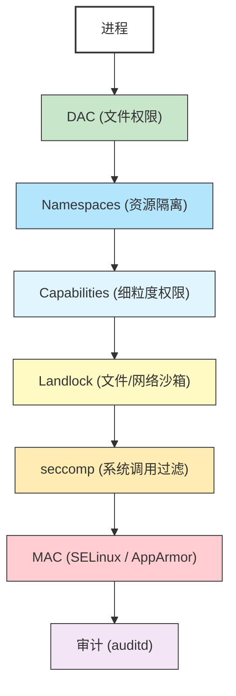

# 36 - Linux 安全执行环境

> 现代 Linux 提供了多层安全机制来限制进程的权限和行为：从传统的 DAC（自主访问控制）到 MAC（强制访问控制），从 capabilities 细粒度权限到 seccomp 系统调用过滤，从 namespaces 隔离到 Landlock 沙箱。理解这些安全原语是构建安全容器、沙箱应用和加固系统的基础。本章将深入讲解每一种安全机制的原理与实战配置。

---

## 36.1 Linux 安全模型概述



| 安全机制 | 类型 | 控制粒度 | 需要特权 |
|---------|------|---------|---------|
| DAC | 自主访问控制 | 文件/目录 | 否 |
| MAC (SELinux/AppArmor) | 强制访问控制 | 进程行为 | 是（配置） |
| Capabilities | 权限分解 | 内核操作 | 是（设置） |
| Namespaces | 资源隔离 | 系统资源 | 部分（user ns 不需要） |
| seccomp | 系统调用过滤 | 系统调用 | 否 |
| Landlock | 文件/网络沙箱 | 文件路径/网络 | 否 |
| auditd | 审计 | 系统事件 | 是 |

---

## 36.2 seccomp 详解

### 36.2.1 什么是 seccomp

seccomp（Secure Computing Mode）是 Linux 内核提供的系统调用过滤机制。它允许进程限制自己能使用的系统调用，从而减小攻击面。

### 36.2.2 seccomp strict 模式

最早的 seccomp 模式（Linux 2.6.12），只允许 4 个系统调用：

```c
#include <stdio.h>
#include <sys/prctl.h>
#include <linux/seccomp.h>
#include <unistd.h>

int main() {
    printf("进入 strict 模式前\n");

    // 启用 strict 模式
    prctl(PR_SET_SECCOMP, SECCOMP_MODE_STRICT);

    // 以下仅允许：read, write, _exit, sigreturn
    write(1, "strict 模式中\n", 18);

    // 任何其他系统调用会导致 SIGKILL
    // open("/etc/passwd", O_RDONLY);  // 会被杀死

    _exit(0);
}
```

### 36.2.3 seccomp-bpf（BPF 过滤系统调用）

seccomp-bpf（Linux 3.5）使用 BPF 程序灵活过滤系统调用：

```c
#include <stdio.h>
#include <stdlib.h>
#include <stddef.h>
#include <sys/prctl.h>
#include <sys/syscall.h>
#include <linux/seccomp.h>
#include <linux/filter.h>
#include <linux/audit.h>
#include <errno.h>
#include <unistd.h>

// 禁止 execve 系统调用
int main() {
    struct sock_filter filter[] = {
        // 加载系统调用号
        BPF_STMT(BPF_LD | BPF_W | BPF_ABS,
                 offsetof(struct seccomp_data, nr)),

        // 如果是 execve (59)，则返回 ERRNO(EPERM)
        BPF_JUMP(BPF_JMP | BPF_JEQ | BPF_K, __NR_execve, 0, 1),
        BPF_STMT(BPF_RET | BPF_K, SECCOMP_RET_ERRNO | (EPERM & SECCOMP_RET_DATA)),

        // 其他系统调用允许
        BPF_STMT(BPF_RET | BPF_K, SECCOMP_RET_ALLOW),
    };

    struct sock_fprog prog = {
        .len = (unsigned short)(sizeof(filter) / sizeof(filter[0])),
        .filter = filter,
    };

    // 允许设置 seccomp（非 root 需要 no_new_privs）
    prctl(PR_SET_NO_NEW_PRIVS, 1, 0, 0, 0);

    // 安装 BPF 过滤器
    if (prctl(PR_SET_SECCOMP, SECCOMP_MODE_FILTER, &prog)) {
        perror("prctl(SECCOMP)");
        return 1;
    }

    printf("seccomp-bpf 已启用\n");

    // execve 会失败
    char *args[] = {"/bin/ls", NULL};
    if (execve("/bin/ls", args, NULL) < 0) {
        perror("execve");  // 输出: execve: Operation not permitted
    }

    return 0;
}
```

编译运行：

```bash
gcc -o seccomp_demo seccomp_demo.c
./seccomp_demo
```

### 36.2.4 使用 libseccomp（高级 API）

```bash
# Arch Linux 安装
sudo pacman -S libseccomp
```

```c
#include <stdio.h>
#include <seccomp.h>
#include <unistd.h>
#include <errno.h>

int main() {
    // 创建默认允许的过滤器上下文
    scmp_filter_ctx ctx = seccomp_init(SCMP_ACT_ALLOW);
    if (ctx == NULL) return 1;

    // 禁止 execve
    seccomp_rule_add(ctx, SCMP_ACT_ERRNO(EPERM), SCMP_SYS(execve), 0);

    // 禁止 execveat
    seccomp_rule_add(ctx, SCMP_ACT_ERRNO(EPERM), SCMP_SYS(execveat), 0);

    // 禁止 socket（阻止网络）
    seccomp_rule_add(ctx, SCMP_ACT_ERRNO(EPERM), SCMP_SYS(socket), 0);

    // 加载过滤器
    seccomp_load(ctx);
    seccomp_release(ctx);

    printf("已加载 seccomp 过滤器\n");

    // 测试
    char *args[] = {"/bin/ls", NULL};
    if (execve("/bin/ls", args, NULL) < 0) {
        perror("execve 被阻止");
    }

    return 0;
}
```

编译：

```bash
gcc -o seccomp_libseccomp seccomp_libseccomp.c -lseccomp
./seccomp_libseccomp
```

### 36.2.5 Docker/Podman 中的 seccomp profile

Docker 和 Podman 默认使用 seccomp profile 限制容器中的系统调用。

```json
{
    "defaultAction": "SCMP_ACT_ERRNO",
    "defaultErrnoRet": 1,
    "syscalls": [
        {
            "names": [
                "accept", "accept4", "access", "bind", "brk",
                "clock_getres", "clock_gettime", "clock_nanosleep",
                "close", "connect", "dup", "dup2", "dup3",
                "epoll_create", "epoll_create1", "epoll_ctl",
                "epoll_wait", "epoll_pwait", "execve", "execveat",
                "exit", "exit_group", "fcntl", "fstat", "futex",
                "getcwd", "getdents", "getdents64", "getpid",
                "getppid", "getuid", "ioctl", "listen", "lseek",
                "mmap", "mprotect", "munmap", "nanosleep",
                "open", "openat", "pipe", "pipe2", "poll",
                "read", "readlink", "recvfrom", "recvmsg",
                "rt_sigaction", "rt_sigprocmask", "select",
                "sendmsg", "sendto", "set_robust_list",
                "setsockopt", "socket", "stat", "write",
                "writev"
            ],
            "action": "SCMP_ACT_ALLOW"
        },
        {
            "names": ["clone"],
            "action": "SCMP_ACT_ALLOW",
            "args": [
                {
                    "index": 0,
                    "value": 2114060288,
                    "op": "SCMP_CMP_MASKED_EQ"
                }
            ]
        }
    ]
}
```

```bash
# 使用自定义 seccomp profile 运行容器
docker run --security-opt seccomp=my_profile.json alpine sh

# 禁用 seccomp（不推荐）
docker run --security-opt seccomp=unconfined alpine sh

# 查看 Docker 默认 profile
# https://github.com/moby/moby/blob/master/profiles/seccomp/default.json

# Podman 同样支持
podman run --security-opt seccomp=my_profile.json alpine sh
```

### 36.2.6 调试 seccomp 违规

```bash
# 方法 1：使用 SCMP_ACT_LOG 记录（不阻止）
# 在 seccomp profile 中使用 SCMP_ACT_LOG 替代 SCMP_ACT_ERRNO

# 方法 2：检查 audit 日志
sudo journalctl -k | grep SECCOMP
# 或
sudo dmesg | grep SECCOMP

# 输出示例：
# audit: type=1326 audit(1234567890.123:456): auid=1000 uid=0 gid=0
#   ses=1 pid=12345 comm="my_app" exe="/usr/bin/my_app"
#   sig=0 arch=c000003e syscall=59 compat=0 ip=0x7f... code=0x50000

# 方法 3：使用 strace 查看被阻止的系统调用
strace -f docker run --security-opt seccomp=strict.json alpine ls

# 方法 4：使用 scmp_sys_resolver 解析系统调用号
scmp_sys_resolver 59
# 输出：execve
```

### 36.2.7 常用的系统调用黑白名单

```
高风险系统调用（通常应禁止）：
────────────────────────────────────────
系统调用          原因
kexec_load       加载新内核
kexec_file_load  加载新内核（文件形式）
reboot           重启系统
mount            挂载文件系统
umount2          卸载文件系统
pivot_root       更改根文件系统
swapon/swapoff   启用/禁用交换分区
init_module      加载内核模块
delete_module    卸载内核模块
ptrace           进程追踪（调试器）
personality      更改执行域
userfaultfd      用户态页面错误处理
keyctl           内核密钥管理
bpf              BPF 系统调用
unshare          创建命名空间
setns            加入命名空间
clone（部分标志） 带 CLONE_NEWUSER 等
```

---

## 36.3 seccomp-unotify 详解

### 36.3.1 什么是 seccomp user notification

seccomp user notification（Linux 5.0+）允许将系统调用决策推迟到用户空间的 supervisor 进程。被拦截的系统调用不是直接被允许/拒绝，而是转发给另一个进程来决定如何处理。

### 36.3.2 与传统 seccomp-bpf 的区别

| 特性 | seccomp-bpf | seccomp-unotify |
|------|-------------|-----------------|
| 决策位置 | 内核中（BPF 程序） | 用户空间 supervisor |
| 灵活性 | 有限（仅检查参数值） | 高（可检查文件路径、内容等） |
| 性能 | 高（内核内处理） | 较低（需要上下文切换） |
| 返回值 | 允许/拒绝/日志 | 可以模拟返回值和修改结果 |
| 适用场景 | 简单过滤 | 容器运行时、代理操作 |

### 36.3.3 工作原理

```
目标进程                          Supervisor 进程
┌───────────┐                    ┌───────────────┐
│ 调用 open()│                    │               │
│     │      │                    │               │
│     ▼      │                    │               │
│ seccomp    │   SECCOMP_IOCTL   │   读取通知    │
│ BPF 返回   │──────────────────>│   检查参数    │
│ RET_USER   │                    │   做出决定    │
│ _NOTIF     │   SECCOMP_IOCTL   │   发送响应    │
│     ◄      │<──────────────────│               │
│ 继续执行   │                    │               │
│ 或收到错误 │                    │               │
└───────────┘                    └───────────────┘
```

### 36.3.4 使用场景

1. **容器运行时拦截系统调用**：容器中的 `mount` 调用由宿主机 supervisor 代理执行
2. **模拟文件系统操作**：拦截 `open/stat` 等调用，提供虚拟化的文件视图
3. **权限代理**：非特权容器的操作由特权 supervisor 代为执行

### 36.3.5 编程示例

```c
#define _GNU_SOURCE
#include <stdio.h>
#include <stdlib.h>
#include <string.h>
#include <unistd.h>
#include <sys/ioctl.h>
#include <sys/syscall.h>
#include <linux/seccomp.h>
#include <linux/filter.h>
#include <sys/prctl.h>
#include <sys/wait.h>
#include <errno.h>
#include <fcntl.h>
#include <stddef.h>

static int seccomp(unsigned int op, unsigned int flags, void *args) {
    return syscall(__NR_seccomp, op, flags, args);
}

int install_filter(int *notify_fd) {
    struct sock_filter filter[] = {
        BPF_STMT(BPF_LD | BPF_W | BPF_ABS,
                 offsetof(struct seccomp_data, nr)),

        // mkdir -> USER_NOTIF
        BPF_JUMP(BPF_JMP | BPF_JEQ | BPF_K, __NR_mkdir, 0, 1),
        BPF_STMT(BPF_RET | BPF_K, SECCOMP_RET_USER_NOTIF),

        BPF_STMT(BPF_RET | BPF_K, SECCOMP_RET_ALLOW),
    };

    struct sock_fprog prog = {
        .len = sizeof(filter) / sizeof(filter[0]),
        .filter = filter,
    };

    prctl(PR_SET_NO_NEW_PRIVS, 1, 0, 0, 0);

    *notify_fd = seccomp(SECCOMP_SET_MODE_FILTER,
                         SECCOMP_FILTER_FLAG_NEW_LISTENER, &prog);
    return *notify_fd >= 0 ? 0 : -1;
}

void supervisor(int notify_fd) {
    struct seccomp_notif *req;
    struct seccomp_notif_resp *resp;
    struct seccomp_notif_sizes sizes;

    seccomp(SECCOMP_GET_NOTIF_SIZES, 0, &sizes);

    req = malloc(sizes.seccomp_notif);
    resp = malloc(sizes.seccomp_notif_resp);

    memset(req, 0, sizes.seccomp_notif);
    if (ioctl(notify_fd, SECCOMP_IOCTL_NOTIF_RECV, req) < 0) {
        perror("NOTIF_RECV");
        return;
    }

    printf("Supervisor: 进程 %d 调用了 mkdir, 允许执行\n", req->pid);

    memset(resp, 0, sizes.seccomp_notif_resp);
    resp->id = req->id;
    resp->val = 0;
    resp->error = 0;
    resp->flags = SECCOMP_USER_NOTIF_FLAG_CONTINUE;

    if (ioctl(notify_fd, SECCOMP_IOCTL_NOTIF_SEND, resp) < 0) {
        perror("NOTIF_SEND");
    }

    free(req);
    free(resp);
}

int main() {
    int notify_fd;
    pid_t pid;

    if (install_filter(&notify_fd) < 0) {
        perror("install_filter");
        return 1;
    }

    pid = fork();
    if (pid == 0) {
        close(notify_fd);
        mkdir("/tmp/seccomp_test", 0755);
        printf("子进程: mkdir 完成\n");
        _exit(0);
    }

    supervisor(notify_fd);
    waitpid(pid, NULL, 0);
    close(notify_fd);

    return 0;
}
```

### 36.3.6 在容器运行时中的应用

```bash
# crun 和 runc 都支持 seccomp-unotify
# 用于实现 rootless 容器中的特权操作代理

# 例如：rootless 容器中的 mount 操作
# 1. 容器进程调用 mount()
# 2. seccomp-unotify 将请求转发给容器运行时
# 3. 容器运行时验证参数后代为执行 mount
# 4. 将结果返回给容器进程

# 在 Podman rootless 容器中查看
podman info | grep -i seccomp
```

---

## 36.4 Landlock 详解

### 36.4.1 什么是 Landlock

Landlock 是 Linux 5.13 引入的安全模块，允许**非特权进程**自行限制对文件系统和网络的访问。与 SELinux/AppArmor 不同，Landlock 不需要管理员权限来配置。

### 36.4.2 与 SELinux/AppArmor 的区别

| 特性 | SELinux | AppArmor | Landlock |
|------|---------|----------|----------|
| 类型 | MAC | MAC | 沙箱 |
| 配置者 | 管理员 | 管理员 | 应用自身 |
| 需要 root | 是 | 是 | 否 |
| 策略位置 | 系统级 | 系统级 | 进程内嵌 |
| 粒度 | inode 标签 | 路径 | 路径 |
| 可叠加 | 否 | 否 | 是 |
| 容器适用 | 困难 | 中等 | 简单 |

### 36.4.3 Landlock ABI 版本

| ABI 版本 | 内核版本 | 新增功能 |
|---------|---------|---------|
| v1 | 5.13 | 基本文件系统访问控制 |
| v2 | 5.19 | 文件重命名/链接跨目录 |
| v3 | 6.2 | 文件截断（truncate） |
| v4 | 6.7 | 网络访问控制（TCP bind/connect） |
| v5 | 6.10 | ioctl 分组控制 |

```bash
# 检查内核是否支持 Landlock
cat /sys/kernel/security/lsm
# 输出应包含 landlock

# 如果没有，需要在启动参数中启用
# 编辑 /boot/loader/entries/arch.conf 或 GRUB 配置
# 添加：lsm=landlock,lockdown,yama,integrity,apparmor,bpf
```

### 36.4.4 编程使用 Landlock（C 示例）

```c
#define _GNU_SOURCE
#include <stdio.h>
#include <stdlib.h>
#include <fcntl.h>
#include <unistd.h>
#include <sys/syscall.h>
#include <linux/landlock.h>
#include <sys/prctl.h>
#include <errno.h>
#include <string.h>

#ifndef landlock_create_ruleset
static inline int landlock_create_ruleset(
    const struct landlock_ruleset_attr *attr, size_t size, __u32 flags) {
    return syscall(__NR_landlock_create_ruleset, attr, size, flags);
}
#endif

#ifndef landlock_add_rule
static inline int landlock_add_rule(
    int ruleset_fd, enum landlock_rule_type type,
    const void *attr, __u32 flags) {
    return syscall(__NR_landlock_add_rule, ruleset_fd, type, attr, flags);
}
#endif

#ifndef landlock_restrict_self
static inline int landlock_restrict_self(int ruleset_fd, __u32 flags) {
    return syscall(__NR_landlock_restrict_self, ruleset_fd, flags);
}
#endif

int main() {
    // 定义规则集属性：限制文件系统访问
    struct landlock_ruleset_attr ruleset_attr = {
        .handled_access_fs =
            LANDLOCK_ACCESS_FS_EXECUTE |
            LANDLOCK_ACCESS_FS_WRITE_FILE |
            LANDLOCK_ACCESS_FS_READ_FILE |
            LANDLOCK_ACCESS_FS_READ_DIR |
            LANDLOCK_ACCESS_FS_REMOVE_DIR |
            LANDLOCK_ACCESS_FS_REMOVE_FILE |
            LANDLOCK_ACCESS_FS_MAKE_CHAR |
            LANDLOCK_ACCESS_FS_MAKE_DIR |
            LANDLOCK_ACCESS_FS_MAKE_REG |
            LANDLOCK_ACCESS_FS_MAKE_SOCK |
            LANDLOCK_ACCESS_FS_MAKE_FIFO |
            LANDLOCK_ACCESS_FS_MAKE_BLOCK |
            LANDLOCK_ACCESS_FS_MAKE_SYM,
    };

    int ruleset_fd = landlock_create_ruleset(&ruleset_attr,
                                              sizeof(ruleset_attr), 0);
    if (ruleset_fd < 0) {
        perror("landlock_create_ruleset");
        return 1;
    }

    // 添加规则：允许读取 /usr
    int usr_fd = open("/usr", O_PATH | O_CLOEXEC);
    struct landlock_path_beneath_attr path_attr = {
        .allowed_access = LANDLOCK_ACCESS_FS_READ_FILE |
                          LANDLOCK_ACCESS_FS_READ_DIR |
                          LANDLOCK_ACCESS_FS_EXECUTE,
        .parent_fd = usr_fd,
    };
    landlock_add_rule(ruleset_fd, LANDLOCK_RULE_PATH_BENEATH,
                      &path_attr, 0);
    close(usr_fd);

    // 添加规则：允许读写 /tmp
    int tmp_fd = open("/tmp", O_PATH | O_CLOEXEC);
    struct landlock_path_beneath_attr tmp_attr = {
        .allowed_access = LANDLOCK_ACCESS_FS_READ_FILE |
                          LANDLOCK_ACCESS_FS_WRITE_FILE |
                          LANDLOCK_ACCESS_FS_READ_DIR |
                          LANDLOCK_ACCESS_FS_MAKE_REG |
                          LANDLOCK_ACCESS_FS_REMOVE_FILE,
        .parent_fd = tmp_fd,
    };
    landlock_add_rule(ruleset_fd, LANDLOCK_RULE_PATH_BENEATH,
                      &tmp_attr, 0);
    close(tmp_fd);

    // 设置 no_new_privs
    prctl(PR_SET_NO_NEW_PRIVS, 1, 0, 0, 0);

    // 应用限制
    if (landlock_restrict_self(ruleset_fd, 0)) {
        perror("landlock_restrict_self");
        return 1;
    }
    close(ruleset_fd);

    printf("Landlock 已启用\n");

    // 测试：可以读取 /usr
    FILE *f = fopen("/usr/bin/ls", "r");
    if (f) {
        printf("可以读取 /usr/bin/ls\n");
        fclose(f);
    }

    // 测试：不能读取 /etc
    f = fopen("/etc/passwd", "r");
    if (!f) {
        printf("无法读取 /etc/passwd: %s\n", strerror(errno));
    }

    // 测试：可以写入 /tmp
    f = fopen("/tmp/landlock_test.txt", "w");
    if (f) {
        fprintf(f, "hello landlock\n");
        fclose(f);
        printf("成功写入 /tmp/landlock_test.txt\n");
    }

    return 0;
}
```

```bash
gcc -o landlock_demo landlock_demo.c
./landlock_demo
```

### 36.4.5 限制网络访问（ABI v4+）

```c
// 需要 Linux 6.7+ 内核
struct landlock_ruleset_attr ruleset_attr = {
    .handled_access_net =
        LANDLOCK_ACCESS_NET_BIND_TCP |
        LANDLOCK_ACCESS_NET_CONNECT_TCP,
};

int ruleset_fd = landlock_create_ruleset(&ruleset_attr,
                                          sizeof(ruleset_attr), 0);

// 只允许 bind 到 8080 端口
struct landlock_net_port_attr net_attr = {
    .allowed_access = LANDLOCK_ACCESS_NET_BIND_TCP,
    .port = 8080,
};
landlock_add_rule(ruleset_fd, LANDLOCK_RULE_NET_PORT, &net_attr, 0);

// 只允许 connect 到 443 端口
struct landlock_net_port_attr connect_attr = {
    .allowed_access = LANDLOCK_ACCESS_NET_CONNECT_TCP,
    .port = 443,
};
landlock_add_rule(ruleset_fd, LANDLOCK_RULE_NET_PORT, &connect_attr, 0);

prctl(PR_SET_NO_NEW_PRIVS, 1, 0, 0, 0);
landlock_restrict_self(ruleset_fd, 0);
```

### 36.4.6 与 seccomp 配合使用

```
Landlock + seccomp 组合策略：
─────────────────────────────────────────
Landlock：限制文件和网络访问路径
seccomp：限制可用的系统调用

示例：一个只需要处理文本文件的程序
├── Landlock：只允许读 /input 目录，写 /output 目录
└── seccomp：只允许 read, write, open, close, fstat, mmap, exit 等基本系统调用
```

---

## 36.5 Linux capabilities 详解

### 36.5.1 从 root 全能到细粒度权限

传统 UNIX 中 root (UID 0) 拥有所有权限。Capabilities 将 root 的权限分解为独立的能力位，可以单独授予进程。

### 36.5.2 常用 capabilities 列表

| Capability | 说明 |
|-----------|------|
| `CAP_NET_ADMIN` | 网络管理（iptables、路由等） |
| `CAP_NET_BIND_SERVICE` | 绑定小于 1024 的端口 |
| `CAP_NET_RAW` | 使用 RAW/PACKET socket |
| `CAP_SYS_ADMIN` | 广泛的系统管理（mount 等） |
| `CAP_SYS_PTRACE` | 使用 ptrace |
| `CAP_SYS_MODULE` | 加载内核模块 |
| `CAP_SYS_RAWIO` | 原始 I/O 操作 |
| `CAP_SYS_CHROOT` | 使用 chroot |
| `CAP_SYS_TIME` | 设置系统时钟 |
| `CAP_DAC_OVERRIDE` | 绕过文件权限检查 |
| `CAP_DAC_READ_SEARCH` | 绕过文件读取/目录搜索权限 |
| `CAP_FOWNER` | 绕过文件所有者检查 |
| `CAP_KILL` | 发送信号给任意进程 |
| `CAP_SETUID` | 设置 UID |
| `CAP_SETGID` | 设置 GID |
| `CAP_CHOWN` | 改变文件所有者 |
| `CAP_MKNOD` | 创建设备文件 |
| `CAP_SETFCAP` | 设置文件 capabilities |
| `CAP_SYS_NICE` | 修改进程优先级 |
| `CAP_IPC_LOCK` | 锁定内存（mlock） |
| `CAP_AUDIT_WRITE` | 写入审计日志 |
| `CAP_BPF` | BPF 操作 |
| `CAP_PERFMON` | 性能监控 |

### 36.5.3 getcap / setcap 使用

```bash
# 安装（通常已预装）
sudo pacman -S libcap

# 查看文件的 capabilities
getcap /usr/bin/ping
# 输出：/usr/bin/ping cap_net_raw=ep

# 设置文件 capabilities
sudo setcap 'cap_net_bind_service=+ep' /usr/bin/my_server

# 允许 Python 绑定低端口
sudo setcap 'cap_net_bind_service=+ep' /usr/bin/python3

# 移除文件 capabilities
sudo setcap -r /usr/bin/my_server

# 查看进程的 capabilities
cat /proc/$$/status | grep -i cap

# 使用 capsh 解析
capsh --decode=0000003fffffffff

# 列出当前 shell 的 capabilities
capsh --print

# 以特定 capabilities 运行命令
sudo capsh --caps="cap_net_raw+ep cap_setpcap+ep" -- -c "ping -c 1 8.8.8.8"
```

### 36.5.4 在 systemd 中配置 capabilities

```ini
# /etc/systemd/system/my_service.service
[Unit]
Description=My Service

[Service]
Type=simple
ExecStart=/usr/bin/my_server
User=myuser
Group=mygroup

# 仅授予必要的 capabilities
AmbientCapabilities=CAP_NET_BIND_SERVICE
CapabilityBoundingSet=CAP_NET_BIND_SERVICE

# 其他安全加固选项
NoNewPrivileges=yes
ProtectSystem=strict
ProtectHome=yes
PrivateTmp=yes
ReadWritePaths=/var/lib/my_service

[Install]
WantedBy=multi-user.target
```

```bash
# 查看服务的有效 capabilities
systemctl show my_service -p AmbientCapabilities
systemctl show my_service -p CapabilityBoundingSet

# 查看运行中进程的 capabilities
getpcaps $(pidof my_server)

# 完全去除 capabilities（最小权限）
# CapabilityBoundingSet=
# AmbientCapabilities=
```

---

## 36.6 Namespaces（命名空间）

### 36.6.1 各种 namespace 类型

| Namespace | Flag | 隔离内容 | 内核版本 |
|-----------|------|---------|---------|
| Mount | `CLONE_NEWNS` | 挂载点 | 2.4.19 |
| UTS | `CLONE_NEWUTS` | 主机名和域名 | 2.6.19 |
| IPC | `CLONE_NEWIPC` | 进程间通信 | 2.6.19 |
| PID | `CLONE_NEWPID` | 进程 ID | 2.6.24 |
| Network | `CLONE_NEWNET` | 网络栈 | 2.6.29 |
| User | `CLONE_NEWUSER` | 用户和组 ID | 3.8 |
| Cgroup | `CLONE_NEWCGROUP` | Cgroup 根目录 | 4.6 |
| Time | `CLONE_NEWTIME` | 系统时钟 | 5.6 |

### 36.6.2 unshare 命令实战

```bash
# === PID namespace ===
# 创建新的 PID 命名空间（进程在里面看到自己是 PID 1）
sudo unshare --pid --fork --mount-proc bash
ps aux
# 只能看到 bash 和 ps 自身
exit

# === Network namespace ===
# 创建新的网络命名空间
sudo unshare --net bash
ip addr
# 只有 lo 接口
ip link set lo up
exit

# === Mount namespace ===
# 创建新的挂载命名空间
sudo unshare --mount bash
mount -t tmpfs tmpfs /mnt
ls /mnt
# 宿主机看不到这个挂载
exit

# === UTS namespace ===
# 创建新的 UTS 命名空间（独立主机名）
sudo unshare --uts bash
hostname my-container
hostname
# 宿主机的 hostname 不受影响
exit

# === User namespace（不需要 root）===
unshare --user --map-root-user bash
id
# uid=0(root) gid=0(root) - 在命名空间内是 root
cat /proc/self/uid_map
exit

# === 组合使用（模拟简单容器）===
sudo unshare --pid --net --mount --uts --ipc --fork --mount-proc bash
hostname container-test
ps aux
ip addr
exit
```

### 36.6.3 nsenter 进入命名空间

```bash
# 获取容器/进程的 PID
CONTAINER_PID=$(docker inspect --format '{{.State.Pid}}' my_container)

# 进入所有命名空间
sudo nsenter -t $CONTAINER_PID -m -u -i -p -n bash

# 只进入网络命名空间
sudo nsenter -t $CONTAINER_PID -n bash
ip addr    # 看到容器的网络配置

# 只进入 PID 命名空间
sudo nsenter -t $CONTAINER_PID -p -r -m bash
ps aux     # 看到容器内的进程

# 查看进程的命名空间
ls -la /proc/$CONTAINER_PID/ns/
# lrwxrwxrwx  cgroup -> 'cgroup:[4026531835]'
# lrwxrwxrwx  ipc -> 'ipc:[4026532233]'
# lrwxrwxrwx  mnt -> 'mnt:[4026532231]'
# lrwxrwxrwx  net -> 'net:[4026532236]'
# lrwxrwxrwx  pid -> 'pid:[4026532234]'
# lrwxrwxrwx  user -> 'user:[4026531837]'
# lrwxrwxrwx  uts -> 'uts:[4026532232]'

# 使用 ip netns 管理网络命名空间
sudo ip netns add test_ns
sudo ip netns exec test_ns ip addr
sudo ip netns exec test_ns bash
sudo ip netns delete test_ns
```

### 36.6.4 与容器的关系

```
容器 = Namespaces + Cgroups + 安全机制 + 文件系统

Docker/Podman 容器创建过程：
1. 创建各类 namespaces（pid, net, mnt, uts, ipc, user, cgroup）
2. 设置 cgroups 资源限制（CPU, 内存, I/O）
3. 配置 rootfs（overlay fs）
4. 应用安全策略（seccomp, AppArmor/SELinux, capabilities）
5. 执行容器入口进程
```

---

## 36.7 AppArmor

### 36.7.1 在 Arch 上启用 AppArmor

```bash
# 安装
sudo pacman -S apparmor

# 启用 LSM（内核参数）
# 编辑 /etc/default/grub 或 bootloader 配置
# GRUB:
# GRUB_CMDLINE_LINUX_DEFAULT="lsm=landlock,lockdown,yama,integrity,apparmor,bpf"
# 然后：
sudo grub-mkconfig -o /boot/grub/grub.cfg

# systemd-boot:
# 编辑 /boot/loader/entries/arch.conf
# options ... lsm=landlock,lockdown,yama,integrity,apparmor,bpf

# 重启后验证
sudo aa-enabled
# 输出：Yes

# 启用 AppArmor 服务
sudo systemctl enable --now apparmor.service

# 查看加载的配置文件
sudo aa-status
```

### 36.7.2 配置文件编写

```bash
# AppArmor 配置文件位于 /etc/apparmor.d/

# 示例：限制 nginx
# /etc/apparmor.d/usr.sbin.nginx

#include <tunables/global>

profile nginx /usr/sbin/nginx {
  #include <abstractions/base>
  #include <abstractions/nameservice>
  #include <abstractions/openssl>

  # 可执行文件
  /usr/sbin/nginx mr,

  # 配置文件
  /etc/nginx/** r,

  # 日志
  /var/log/nginx/** w,

  # PID 文件
  /run/nginx.pid rw,

  # 网站内容
  /usr/share/nginx/html/** r,
  /var/www/** r,

  # 临时文件
  /var/lib/nginx/** rw,

  # 网络
  network inet tcp,
  network inet6 tcp,

  # 信号
  signal (receive) peer=unconfined,

  # 能力
  capability net_bind_service,
  capability setuid,
  capability setgid,
  capability dac_override,
}
```

```bash
# 权限标志说明
# r  - 读取
# w  - 写入
# a  - 追加
# m  - 内存映射可执行
# k  - 锁定文件
# l  - 创建硬链接
# ix - 继承当前 profile 执行
# px - 使用目标 profile 执行
# ux - 不受限执行
# cx - 使用子 profile 执行
```

### 36.7.3 enforce / complain 模式

```bash
# 安装工具
sudo pacman -S apparmor-utils

# 将 profile 设为 enforce 模式（强制执行）
sudo aa-enforce /etc/apparmor.d/usr.sbin.nginx

# 将 profile 设为 complain 模式（仅记录违规）
sudo aa-complain /etc/apparmor.d/usr.sbin.nginx

# 禁用 profile
sudo aa-disable /etc/apparmor.d/usr.sbin.nginx

# 重新加载 profile
sudo apparmor_parser -r /etc/apparmor.d/usr.sbin.nginx

# 生成新 profile（交互式）
sudo aa-genprof /usr/bin/my_app

# 从日志更新 profile
sudo aa-logprof

# 查看所有 profile 状态
sudo aa-status
```

---

## 36.8 安全审计（auditd）

```bash
# 安装
sudo pacman -S audit

# 启动审计服务
sudo systemctl enable --now auditd.service

# === auditctl：管理审计规则 ===

# 监控文件访问
sudo auditctl -w /etc/passwd -p wa -k passwd_changes
# -w: 监控路径
# -p: 权限过滤 (r=读, w=写, x=执行, a=属性变更)
# -k: 关键字（用于搜索）

# 监控目录
sudo auditctl -w /etc/ssh/ -p wa -k ssh_config

# 监控系统调用
sudo auditctl -a always,exit -F arch=b64 -S execve -k exec_commands

# 监控特定用户的操作
sudo auditctl -a always,exit -F arch=b64 -S open -F auid=1000 -k user_open

# 查看当前规则
sudo auditctl -l

# 删除所有规则
sudo auditctl -D

# === 持久化规则 ===
# 编辑 /etc/audit/rules.d/audit.rules
# -w /etc/passwd -p wa -k passwd_changes
# -w /etc/shadow -p wa -k shadow_changes
# -a always,exit -F arch=b64 -S execve -k exec_commands

# === ausearch：搜索审计日志 ===

# 按关键字搜索
sudo ausearch -k passwd_changes

# 按时间范围搜索
sudo ausearch -k exec_commands -ts today
sudo ausearch -k exec_commands -ts '10 minutes ago'

# 按用户搜索
sudo ausearch -ua 1000

# 按系统调用搜索
sudo ausearch -sc execve

# 按进程搜索
sudo ausearch -p 12345

# === aureport：生成审计报告 ===

# 总体摘要
sudo aureport --summary

# 认证报告
sudo aureport -au

# 文件访问报告
sudo aureport -f

# 可执行文件报告
sudo aureport -x

# 系统调用报告
sudo aureport -s

# 失败事件报告
sudo aureport --failed

# 时间范围报告
sudo aureport -au -ts today
```

---

## 36.9 系统加固清单（Arch Linux 安全最佳实践）

```bash
# === 1. 内核安全参数 ===
# /etc/sysctl.d/99-security.conf

# 禁止内核指针泄露
kernel.kptr_restrict=2

# 限制 dmesg 访问
kernel.dmesg_restrict=1

# 限制 ptrace
kernel.yama.ptrace_scope=2

# 禁用 SysRq（或设为受限值）
kernel.sysrq=0

# 启用 ASLR
kernel.randomize_va_space=2

# 限制内核日志
kernel.printk=3 3 3 3

# 限制性能事件
kernel.perf_event_paranoid=3

# 限制 unprivileged BPF
kernel.unprivileged_bpf_disabled=1

# 限制 unprivileged user namespaces（如果不需要 rootless 容器）
# kernel.unprivileged_userns_clone=0

# === 2. 网络安全参数 ===
# 禁用 IP 转发（除非需要）
net.ipv4.ip_forward=0
net.ipv6.conf.all.forwarding=0

# 禁用 ICMP 重定向
net.ipv4.conf.all.accept_redirects=0
net.ipv6.conf.all.accept_redirects=0
net.ipv4.conf.all.send_redirects=0

# 启用 SYN cookies
net.ipv4.tcp_syncookies=1

# 禁用源路由
net.ipv4.conf.all.accept_source_route=0

# 启用反向路径过滤
net.ipv4.conf.all.rp_filter=1

# 记录 Martian 包
net.ipv4.conf.all.log_martians=1

# === 3. 文件系统安全 ===
# 检查 SUID 文件
find / -perm -4000 -type f 2>/dev/null

# 检查 SGID 文件
find / -perm -2000 -type f 2>/dev/null

# 检查无主文件
find / -nouser -o -nogroup 2>/dev/null

# 检查全局可写文件
find / -perm -0002 -type f 2>/dev/null

# 设置重要目录权限
chmod 700 /root
chmod 600 /etc/shadow
chmod 644 /etc/passwd

# === 4. 用户安全 ===
# 锁定不需要的账户
sudo usermod -L nobody

# 设置密码策略
# /etc/security/pwquality.conf
# minlen = 12
# dcredit = -1
# ucredit = -1
# lcredit = -1
# ocredit = -1

# 设置登录失败锁定
# /etc/security/faillock.conf
# deny = 5
# unlock_time = 900

# === 5. SSH 加固 ===
# /etc/ssh/sshd_config
# PermitRootLogin no
# PasswordAuthentication no
# PubkeyAuthentication yes
# MaxAuthTries 3
# AllowUsers myuser
# Protocol 2
# X11Forwarding no
# AllowAgentForwarding no

# === 6. 防火墙 ===
sudo pacman -S nftables
sudo systemctl enable --now nftables.service

# === 7. 自动安全更新 ===
# 使用 pacman hook 或定时任务检查安全更新
checkupdates | grep -i security

# === 8. 日志审计 ===
sudo systemctl enable --now auditd.service

# === 9. 服务最小化 ===
# 禁用不需要的服务
systemctl list-unit-files --state=enabled
sudo systemctl disable --now bluetooth.service  # 如果不需要

# === 10. systemd 服务加固模板 ===
# 使用 systemd-analyze security 检查服务安全性
systemd-analyze security sshd.service
# 会输出安全评分和改进建议
```

```bash
# 安全检查速查表
systemd-analyze security                  # 所有服务安全评分
sudo lynis audit system                   # 系统安全审计（pacman -S lynis）
sudo rkhunter --check                     # rootkit 检查（pacman -S rkhunter）
ss -tlnp                                  # 检查监听端口
sudo lsof -i -P -n                        # 检查网络连接
journalctl -p err -b                      # 检查错误日志
sudo faillock                             # 检查登录失败
last -f /var/log/btmp                     # 失败登录记录
last                                       # 成功登录记录
```

---

> **小结**：Linux 提供了丰富的安全机制来构建纵深防御。seccomp 限制系统调用，Landlock 限制文件和网络访问，capabilities 实现细粒度权限控制，namespaces 实现资源隔离，AppArmor 提供强制访问控制，auditd 提供安全审计。在 Arch Linux 上建议组合使用这些机制：用 seccomp + Landlock 做应用沙箱，用 capabilities 替代 SUID，用 systemd 安全选项加固服务，用 auditd 监控关键操作。

---

## 36.10 本章测验

> [!example] 📝 自测题目

> [!question]- 选择题 1：seccomp strict 模式下只允许哪几个系统调用？
> - A. read, write, open, close
> - B. read, write, _exit, sigreturn
> - C. read, write, fork, exec
> - D. open, close, mmap, munmap
>
> > [!success]- 点击查看答案
> > **B**
> > seccomp strict 模式是最严格的模式，只允许 `read`、`write`、`_exit` 和 `sigreturn` 四个系统调用，任何其他系统调用都会导致进程被 SIGKILL。

> [!question]- 选择题 2：Landlock 与 SELinux/AppArmor 的核心区别是什么？
> - A. Landlock 只支持网络控制
> - B. Landlock 允许非特权进程自行限制访问，无需管理员配置
> - C. Landlock 性能更好
> - D. Landlock 支持更多文件系统
>
> > [!success]- 点击查看答案
> > **B**
> > Landlock 的独特之处是允许应用程序自身（非特权进程）设置文件和网络访问限制，无需 root 权限或管理员配置策略。这使得应用可以主动采取最小权限原则。

> [!question]- 判断题 3：Linux capabilities 将传统 root 的全能权限分解为独立的能力位，可以让非 root 进程只获得特定权限（如绑定低端口）。
> - A. ✓ 正确
> - B. ✗ 错误
>
> > [!success]- 点击查看答案
> > **A. ✓ 正确**
> > 例如 `CAP_NET_BIND_SERVICE` 允许进程绑定小于 1024 的端口，无需以 root 身份运行整个程序，减少了安全风险。

> [!question]- 选择题 4：以下哪个 namespace 类型允许非特权用户创建（不需要 root）？
> - A. PID namespace
> - B. Network namespace
> - C. User namespace
> - D. Mount namespace
>
> > [!success]- 点击查看答案
> > **C**
> > User namespace 是唯一不需要特权就能创建的命名空间类型。创建后进程在新的 user namespace 中可以拥有映射的 root 权限，这是 rootless 容器的基础。

> [!question]- 选择题 5：seccomp-unotify 相比传统 seccomp-bpf 的独特功能是什么？
> - A. 过滤性能更高
> - B. 将系统调用决策推迟到用户空间的 supervisor 进程
> - C. 支持更多系统调用类型
> - D. 可以修改内核代码
>
> > [!success]- 点击查看答案
> > **B**
> > seccomp-unotify 允许被拦截的系统调用转发给另一个 supervisor 进程来决定如何处理，supervisor 可以检查参数、代为执行操作或模拟返回值。这在 rootless 容器中实现特权操作代理时非常有用。

> [!question]- 判断题 6：AppArmor 的 complain 模式只记录违规但不阻止，适合在部署前测试策略。
> - A. ✓ 正确
> - B. ✗ 错误
>
> > [!success]- 点击查看答案
> > **A. ✓ 正确**
> > complain 模式下 AppArmor 会记录所有违反策略的操作到日志中，但不实际阻止，方便管理员观察应用行为并调整策略后再切换到 enforce 模式。

> [!question]- 选择题 7：容器的本质是什么安全原语的组合？
> - A. 虚拟机 + 防火墙
> - B. Namespaces + Cgroups + 安全机制 + 文件系统
> - C. chroot + iptables
> - D. SELinux + AppArmor
>
> > [!success]- 点击查看答案
> > **B**
> > 容器 = Namespaces（资源隔离）+ Cgroups（资源限制）+ 安全机制（seccomp、capabilities、AppArmor）+ 联合文件系统（overlayfs）的组合应用。

> [!question]- 选择题 8：`kernel.yama.ptrace_scope=2` 的安全含义是什么？
> - A. 允许任意进程使用 ptrace
> - B. 只有 root 可以 ptrace 任意进程
> - C. 完全禁止 ptrace
> - D. 只允许父进程 ptrace 子进程
>
> > [!success]- 点击查看答案
> > **B**
> > `ptrace_scope=2` 表示只有拥有 `CAP_SYS_PTRACE` 能力的进程（通常是 root）才能使用 ptrace。值为 0 表示不限制，1 表示只允许父进程追踪子进程，3 表示完全禁止。

> [!question]- 判断题 9：`prctl(PR_SET_NO_NEW_PRIVS, 1)` 确保进程及其后代不能通过 execve 获得新的权限提升（如 SUID 程序）。
> - A. ✓ 正确
> - B. ✗ 错误
>
> > [!success]- 点击查看答案
> > **A. ✓ 正确**
> > 设置 `no_new_privs` 后，该进程及其所有后代进程执行 SUID/SGID 程序时不会获得额外权限。这是安装 seccomp 过滤器的前提条件（非 root 情况下）。

> [!question]- 选择题 10：Landlock ABI v4（Linux 6.7）新增了什么功能？
> - A. 文件截断控制
> - B. 网络访问控制（TCP bind/connect）
> - C. 进程信号控制
> - D. 内存映射控制
>
> > [!success]- 点击查看答案
> > **B**
> > Landlock ABI v4 在 Linux 6.7 中引入了网络访问控制，支持限制 TCP 的 bind（绑定端口）和 connect（连接目标端口）操作。
