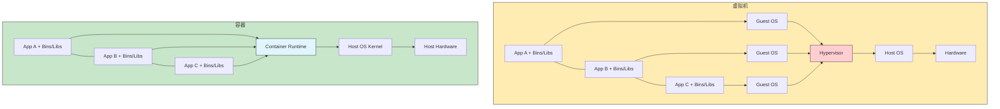
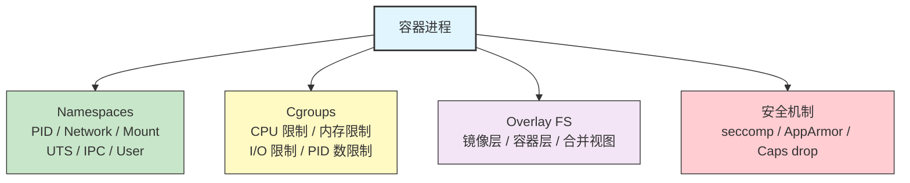

# 37 - Docker 与容器技术

> 容器技术是现代软件开发和运维的基石。它利用 Linux 内核的 namespaces、cgroups、overlayfs 和 seccomp 等原语，在不需要完整虚拟机的前提下实现进程级隔离。本章将从容器底层原理讲起，深入 Docker 和 Podman 的使用，覆盖镜像构建、网络、存储、安全配置，以及 Buildah、Skopeo、Distrobox、systemd-nspawn 等生态工具。

---

## 37.1 容器技术概述

### 37.1.1 容器 vs 虚拟机



| 特性 | 虚拟机 | 容器 |
|------|--------|------|
| 隔离级别 | 硬件级 | 进程级 |
| 启动时间 | 秒~分钟 | 毫秒~秒 |
| 镜像大小 | GB 级 | MB 级 |
| 资源开销 | 高 | 低 |
| 密度 | 低（数十个/主机） | 高（数百~数千/主机） |
| 内核 | 独立内核 | 共享宿主内核 |
| 安全隔离 | 强 | 中等 |
| 适用场景 | 强隔离、异构 OS | 微服务、CI/CD |

---

## 37.2 容器底层原理



```bash
# 手动创建"容器"（理解原理）

# 1. 创建 rootfs
mkdir -p /tmp/container/rootfs
# 使用 pacstrap 创建最小根文件系统
sudo pacstrap -c /tmp/container/rootfs base

# 2. 使用 unshare 创建命名空间并 chroot
sudo unshare --pid --net --mount --uts --ipc --fork \
  chroot /tmp/container/rootfs /bin/bash

# 在"容器"内
mount -t proc proc /proc
mount -t sysfs sysfs /sys
hostname my-container
ps aux    # 只能看到自己的进程
ip addr   # 只有 lo 接口
exit

# 3. 使用 cgroups 限制资源
sudo mkdir /sys/fs/cgroup/my_container
echo 100000 | sudo tee /sys/fs/cgroup/my_container/cpu.max
echo "256M" | sudo tee /sys/fs/cgroup/my_container/memory.max
echo $$ | sudo tee /sys/fs/cgroup/my_container/cgroup.procs
```

---

## 37.3 Docker 在 Arch Linux 上

### 37.3.1 安装

```bash
# 安装 Docker
sudo pacman -S docker docker-compose docker-buildx

# 启动 Docker 服务
sudo systemctl enable --now docker.service

# 将当前用户加入 docker 组（无需 sudo 使用 docker）
sudo usermod -aG docker $USER
# 需要重新登录或使用 newgrp docker

# 验证安装
docker version
docker info

# 运行测试容器
docker run --rm hello-world
```

### 37.3.2 基本操作

```bash
# === 镜像操作 ===
docker pull alpine:latest                # 拉取镜像
docker pull archlinux:latest             # 拉取 Arch Linux 镜像
docker images                            # 列出本地镜像
docker image ls                          # 同上
docker image rm alpine:latest            # 删除镜像
docker image prune                       # 清理悬空镜像
docker image prune -a                    # 清理所有未使用镜像

# === 容器操作 ===
# 运行容器
docker run -it alpine sh                 # 交互式运行
docker run -d --name web nginx           # 后台运行
docker run --rm alpine echo "hello"      # 运行后自动删除

# 端口映射
docker run -d -p 8080:80 --name web nginx
# 宿主机 8080 -> 容器 80

# 环境变量
docker run -e MY_VAR=hello -e DB_HOST=localhost alpine env

# 资源限制
docker run --memory=512m --cpus=1.5 alpine stress-ng --vm 1

# 列出容器
docker ps                                # 运行中的容器
docker ps -a                             # 所有容器

# 容器管理
docker stop web                          # 停止
docker start web                         # 启动
docker restart web                       # 重启
docker rm web                            # 删除
docker rm -f web                         # 强制删除运行中的容器

# 进入运行中的容器
docker exec -it web bash
docker exec -it web sh

# 查看容器日志
docker logs web
docker logs -f web                       # 跟踪日志
docker logs --tail 100 web               # 最后 100 行

# 查看容器详情
docker inspect web
docker inspect --format '{{.State.Pid}}' web

# 容器文件复制
docker cp web:/etc/nginx/nginx.conf ./nginx.conf
docker cp ./index.html web:/usr/share/nginx/html/

# 容器资源使用
docker stats
docker top web

# 清理
docker container prune                   # 清理已停止的容器
docker system prune                      # 清理所有未使用资源
docker system prune -a --volumes         # 深度清理
docker system df                         # 查看磁盘使用
```

### 37.3.3 Dockerfile 编写详解

```dockerfile
# === 基础镜像 ===
FROM archlinux:latest

# === 元数据 ===
LABEL maintainer="user@example.com"
LABEL version="1.0"
LABEL description="My Arch Linux application"

# === 环境变量 ===
ENV APP_HOME=/app
ENV APP_PORT=8080

# === 设置工作目录 ===
WORKDIR $APP_HOME

# === 安装依赖（充分利用缓存层）===
RUN pacman -Syu --noconfirm && \
    pacman -S --noconfirm \
        python \
        python-pip \
        nginx && \
    pacman -Scc --noconfirm

# === 复制依赖文件（利用缓存）===
COPY requirements.txt .
RUN pip install --no-cache-dir -r requirements.txt

# === 复制应用代码 ===
COPY . .

# === 创建非 root 用户 ===
RUN useradd -r -s /usr/bin/nologin appuser
USER appuser

# === 暴露端口 ===
EXPOSE $APP_PORT

# === 健康检查 ===
HEALTHCHECK --interval=30s --timeout=3s --retries=3 \
    CMD curl -f http://localhost:$APP_PORT/health || exit 1

# === 启动命令 ===
ENTRYPOINT ["python"]
CMD ["app.py"]
```

常用指令说明：

| 指令 | 说明 |
|------|------|
| `FROM` | 基础镜像 |
| `RUN` | 构建时执行命令 |
| `COPY` | 复制文件到镜像 |
| `ADD` | 复制文件（支持 URL 和自动解压） |
| `WORKDIR` | 设置工作目录 |
| `ENV` | 设置环境变量 |
| `ARG` | 构建参数（仅构建时可用） |
| `EXPOSE` | 声明端口（文档性质） |
| `USER` | 切换用户 |
| `ENTRYPOINT` | 入口命令（不可被 docker run 参数覆盖） |
| `CMD` | 默认参数（可被 docker run 参数覆盖） |
| `VOLUME` | 声明卷挂载点 |
| `HEALTHCHECK` | 健康检查 |
| `SHELL` | 更改默认 shell |
| `STOPSIGNAL` | 停止信号 |

```bash
# 构建镜像
docker build -t my-app:latest .
docker build -t my-app:v1.0 -f Dockerfile.prod .

# 使用构建参数
docker build --build-arg VERSION=1.0 -t my-app .
```

### 37.3.4 多阶段构建

```dockerfile
# === 阶段 1：构建 ===
FROM archlinux:latest AS builder

RUN pacman -Syu --noconfirm && \
    pacman -S --noconfirm gcc make

WORKDIR /build
COPY . .
RUN make

# === 阶段 2：运行 ===
FROM archlinux:latest

RUN pacman -Syu --noconfirm && \
    pacman -S --noconfirm glibc && \
    pacman -Scc --noconfirm

WORKDIR /app
COPY --from=builder /build/my_app .

RUN useradd -r -s /usr/bin/nologin appuser
USER appuser

ENTRYPOINT ["./my_app"]
```

```dockerfile
# Go 应用多阶段构建（生成静态二进制）
FROM golang:1.22-alpine AS builder
WORKDIR /app
COPY go.mod go.sum ./
RUN go mod download
COPY . .
RUN CGO_ENABLED=0 go build -o server .

FROM scratch
COPY --from=builder /app/server /server
EXPOSE 8080
ENTRYPOINT ["/server"]
```

```dockerfile
# Rust 应用多阶段构建
FROM rust:latest AS builder
WORKDIR /app
COPY Cargo.toml Cargo.lock ./
RUN mkdir src && echo "fn main() {}" > src/main.rs && \
    cargo build --release && rm -rf src
COPY src ./src
RUN cargo build --release

FROM archlinux:latest
RUN pacman -Syu --noconfirm && pacman -Scc --noconfirm
COPY --from=builder /app/target/release/my_app /usr/local/bin/
ENTRYPOINT ["my_app"]
```

### 37.3.5 docker compose 使用

```yaml
# docker-compose.yml (或 compose.yaml)

services:
  web:
    build: .
    ports:
      - "8080:80"
    environment:
      - DB_HOST=db
      - DB_PORT=5432
    volumes:
      - ./app:/app
      - static_data:/app/static
    depends_on:
      db:
        condition: service_healthy
    restart: unless-stopped
    deploy:
      resources:
        limits:
          cpus: '1.0'
          memory: 512M

  db:
    image: postgres:16-alpine
    environment:
      POSTGRES_USER: myuser
      POSTGRES_PASSWORD: mypass
      POSTGRES_DB: mydb
    volumes:
      - db_data:/var/lib/postgresql/data
    ports:
      - "5432:5432"
    healthcheck:
      test: ["CMD-SHELL", "pg_isready -U myuser"]
      interval: 10s
      timeout: 5s
      retries: 5

  redis:
    image: redis:7-alpine
    ports:
      - "6379:6379"
    volumes:
      - redis_data:/data

  nginx:
    image: nginx:alpine
    ports:
      - "80:80"
      - "443:443"
    volumes:
      - ./nginx.conf:/etc/nginx/nginx.conf:ro
      - ./certs:/etc/nginx/certs:ro
    depends_on:
      - web

volumes:
  db_data:
  redis_data:
  static_data:

networks:
  default:
    driver: bridge
    ipam:
      config:
        - subnet: 172.28.0.0/16
```

```bash
# docker compose 命令
docker compose up                   # 启动所有服务
docker compose up -d                # 后台启动
docker compose up --build           # 重新构建并启动
docker compose down                 # 停止并删除容器
docker compose down -v              # 同时删除卷
docker compose ps                   # 查看服务状态
docker compose logs                 # 查看日志
docker compose logs -f web          # 跟踪特定服务日志
docker compose exec web bash        # 进入容器
docker compose restart web          # 重启服务
docker compose pull                 # 拉取最新镜像
docker compose build                # 构建镜像
docker compose config               # 验证配置文件
docker compose top                  # 查看进程
```

### 37.3.6 网络模型

```bash
# === bridge（默认）===
# 容器通过虚拟网桥通信
docker network create my_bridge
docker run -d --network my_bridge --name web1 nginx
docker run -d --network my_bridge --name web2 nginx
# web1 和 web2 可以通过容器名互相访问
docker exec web1 ping web2

# === host ===
# 容器直接使用宿主机网络栈
docker run -d --network host --name web nginx
# 直接访问 localhost:80

# === none ===
# 无网络（完全隔离）
docker run -d --network none --name isolated alpine sleep 3600

# === macvlan ===
# 容器获得独立 MAC 地址，直接接入物理网络
docker network create -d macvlan \
  --subnet=192.168.1.0/24 \
  --gateway=192.168.1.1 \
  -o parent=eth0 my_macvlan

docker run -d --network my_macvlan \
  --ip 192.168.1.100 \
  --name web nginx

# === 网络管理 ===
docker network ls                   # 列出网络
docker network inspect bridge       # 查看网络详情
docker network create my_net        # 创建网络
docker network rm my_net            # 删除网络
docker network connect my_net web   # 将容器加入网络
docker network disconnect my_net web # 将容器从网络移除
docker network prune                # 清理未使用网络
```

### 37.3.7 存储

```bash
# === Volumes（推荐）===
# Docker 管理的存储
docker volume create my_data
docker run -d -v my_data:/app/data --name app alpine
docker volume ls
docker volume inspect my_data
docker volume rm my_data
docker volume prune

# === Bind Mounts ===
# 直接挂载宿主机目录
docker run -d -v /host/path:/container/path --name app alpine
docker run -d -v $(pwd)/config:/app/config:ro --name app alpine  # 只读

# === tmpfs ===
# 内存中的临时文件系统
docker run -d --tmpfs /tmp:size=100m --name app alpine

# === 使用 --mount（更明确的语法）===
docker run -d \
  --mount type=volume,source=my_data,target=/app/data \
  --name app alpine

docker run -d \
  --mount type=bind,source=/host/config,target=/app/config,readonly \
  --name app alpine

docker run -d \
  --mount type=tmpfs,target=/tmp,tmpfs-size=100m \
  --name app alpine
```

### 37.3.8 存储驱动

```bash
# 查看当前存储驱动
docker info | grep "Storage Driver"

# === overlay2（默认，推荐）===
# 基于 OverlayFS，适用于大多数文件系统（ext4、xfs）
# 配置：/etc/docker/daemon.json
{
    "storage-driver": "overlay2"
}

# === btrfs ===
# 如果 Docker 数据目录在 btrfs 分区上
{
    "storage-driver": "btrfs"
}

# 查看层信息
docker image inspect alpine --format '{{.RootFS.Layers}}'

# 查看容器读写层大小
docker ps -s
```

### 37.3.9 Docker rootless 模式

```bash
# 安装依赖
sudo pacman -S fuse-overlayfs slirp4netns

# 确保 subuid/subgid 已配置
grep $USER /etc/subuid
grep $USER /etc/subgid
# 如果没有，添加：
echo "$USER:100000:65536" | sudo tee -a /etc/subuid
echo "$USER:100000:65536" | sudo tee -a /etc/subgid

# 安装 rootless 模式
dockerd-rootless-setuptool.sh install

# 设置环境变量
export PATH=/usr/bin:$PATH
export DOCKER_HOST=unix:///run/user/$(id -u)/docker.sock

# 启动 rootless Docker
systemctl --user start docker

# 设置开机自启
systemctl --user enable docker
sudo loginctl enable-linger $USER

# 验证
docker info | grep -i rootless
# 输出应包含：rootless

# 注意事项：
# - 端口映射：rootless 模式下无法绑定 <1024 端口
# - 网络：使用 slirp4netns 或 pasta
# - 存储：使用 fuse-overlayfs
```

### 37.3.10 安全配置

```bash
# === seccomp profile ===
docker run --security-opt seccomp=my_profile.json alpine

# === 去除所有 capabilities，只添加必要的 ===
docker run --cap-drop=ALL --cap-add=NET_BIND_SERVICE nginx

# === 只读根文件系统 ===
docker run --read-only --tmpfs /tmp alpine

# === 禁止容器获得新权限 ===
docker run --security-opt no-new-privileges alpine

# === 限制资源 ===
docker run \
  --memory=256m \
  --memory-swap=512m \
  --cpus=0.5 \
  --pids-limit=100 \
  alpine

# === 以非 root 用户运行 ===
docker run --user 1000:1000 alpine

# === 禁用进程间通信 ===
docker run --ipc=none alpine

# === 安全加固示例（综合）===
docker run -d \
  --name secure-app \
  --read-only \
  --tmpfs /tmp:size=50m \
  --cap-drop=ALL \
  --cap-add=NET_BIND_SERVICE \
  --security-opt no-new-privileges \
  --security-opt seccomp=default.json \
  --memory=256m \
  --cpus=0.5 \
  --pids-limit=50 \
  --user 1000:1000 \
  --network my_bridge \
  my-app
```

### 37.3.11 性能优化

```bash
# /etc/docker/daemon.json
{
    "storage-driver": "overlay2",
    "log-driver": "json-file",
    "log-opts": {
        "max-size": "10m",
        "max-file": "3"
    },
    "default-ulimits": {
        "nofile": {
            "Name": "nofile",
            "Hard": 65536,
            "Soft": 65536
        }
    },
    "max-concurrent-downloads": 10,
    "max-concurrent-uploads": 5,
    "live-restore": true,
    "userland-proxy": false
}
```

```bash
# .dockerignore 示例（减少构建上下文）
.git
.gitignore
node_modules
*.md
Dockerfile
docker-compose.yml
.env
__pycache__
*.pyc
.vscode
.idea
```

### 37.3.12 BuildKit 使用

```bash
# 启用 BuildKit（Docker 23+ 默认启用）
export DOCKER_BUILDKIT=1

# 或在 /etc/docker/daemon.json 中配置
{
    "features": {
        "buildkit": true
    }
}

# BuildKit 特性

# === 缓存挂载（加速包管理器）===
# syntax=docker/dockerfile:1
FROM archlinux:latest
RUN --mount=type=cache,target=/var/cache/pacman \
    pacman -Syu --noconfirm && \
    pacman -S --noconfirm python

# === Secret 挂载（不会保存到镜像层）===
RUN --mount=type=secret,id=my_secret \
    cat /run/secrets/my_secret

# 构建时传递 secret
docker build --secret id=my_secret,src=./secret.txt .

# === SSH 挂载（用于 git clone 私有仓库）===
RUN --mount=type=ssh git clone git@github.com:user/repo.git

# 构建时转发 SSH agent
docker build --ssh default .

# === 多平台构建 ===
docker buildx create --use
docker buildx build --platform linux/amd64,linux/arm64 -t my-app:latest --push .

# 查看 builder
docker buildx ls

# 构建缓存管理
docker builder prune         # 清理构建缓存
docker builder prune -a      # 清理所有构建缓存
```

---

## 37.4 Podman（Docker 替代方案）

### 37.4.1 无守护进程架构

```
Docker 架构：                    Podman 架构：
┌──────┐   ┌──────────┐        ┌──────┐
│Client│──>│dockerd   │        │podman│──> fork/exec ──> conmon ──> runc
│(CLI) │   │(daemon)  │        │(CLI) │                    │
└──────┘   │  │       │        └──────┘                    │
           │  ▼       │                                    ▼
           │ containerd│                               容器进程
           │  │       │
           │  ▼       │
           │ runc     │
           │  │       │
           │  ▼       │
           │容器进程   │
           └──────────┘
```

```bash
# 安装 Podman
sudo pacman -S podman podman-compose

# 配置（rootless）
sudo pacman -S fuse-overlayfs slirp4netns crun

# 检查 subuid/subgid
grep $USER /etc/subuid /etc/subgid

# 初始化
podman system migrate

# 验证
podman info
```

### 37.4.2 podman vs docker 命令对比

```bash
# Podman 命令与 Docker 基本兼容
# 可以设置别名
alias docker=podman

# 对比表
# Docker                          Podman
# ─────────────────────────────────────────────────
# docker run                      podman run
# docker build                    podman build
# docker pull                     podman pull
# docker push                     podman push
# docker images                   podman images
# docker ps                       podman ps
# docker exec                     podman exec
# docker logs                     podman logs
# docker stop                     podman stop
# docker rm                       podman rm
# docker rmi                      podman rmi
# docker network                  podman network
# docker volume                   podman volume
# docker compose                  podman compose
# docker inspect                  podman inspect

# Podman 独有功能
podman pod                        # Pod 管理
podman generate systemd           # 生成 systemd 单元文件
podman generate kube              # 生成 Kubernetes YAML
podman play kube                  # 从 Kubernetes YAML 运行
podman machine                    # 管理虚拟机（macOS/Windows）
podman system connection          # 远程连接管理
```

### 37.4.3 rootless 容器

```bash
# Podman 默认就是 rootless 的
podman run --rm alpine id
# uid=0(root) gid=0(root)  # 容器内是 root，但映射到宿主机的非特权用户

# 查看用户映射
podman unshare cat /proc/self/uid_map

# rootless 网络
# 默认使用 slirp4netns 或 pasta
podman run -p 8080:80 nginx    # 无需 root 就能端口映射（>1024）

# rootless 存储
# 使用 fuse-overlayfs
cat ~/.config/containers/storage.conf
# [storage]
# driver = "overlay"
# [storage.options.overlay]
# mount_program = "/usr/bin/fuse-overlayfs"
```

### 37.4.4 Pod 概念

```bash
# Pod = 一组共享网络命名空间的容器（类似 Kubernetes Pod）

# 创建 Pod
podman pod create --name my-pod -p 8080:80

# 在 Pod 中运行容器
podman run -d --pod my-pod --name web nginx
podman run -d --pod my-pod --name app my-backend
# web 和 app 共享网络，可以通过 localhost 互相访问

# Pod 管理
podman pod ls                     # 列出 Pod
podman pod inspect my-pod         # 查看 Pod 详情
podman pod stop my-pod            # 停止 Pod
podman pod start my-pod           # 启动 Pod
podman pod rm my-pod              # 删除 Pod
podman pod prune                  # 清理已停止的 Pod

# 从 Pod 生成 Kubernetes YAML
podman generate kube my-pod > my-pod.yaml

# 从 Kubernetes YAML 运行
podman play kube my-pod.yaml
podman play kube --down my-pod.yaml  # 停止并删除
```

### 37.4.5 与 systemd 集成

```bash
# 为容器生成 systemd 服务文件
podman generate systemd --new --name my-web > ~/.config/systemd/user/container-my-web.service

# 启用服务
systemctl --user daemon-reload
systemctl --user enable --now container-my-web.service

# 查看状态
systemctl --user status container-my-web.service

# 让用户服务在登出后继续运行
sudo loginctl enable-linger $USER
```

### 37.4.6 Quadlet（声明式容器服务）

```bash
# Quadlet 是 Podman 4.4+ 内置的声明式容器管理
# 配置文件放在 ~/.config/containers/systemd/ 或 /etc/containers/systemd/

# ~/.config/containers/systemd/my-web.container
[Unit]
Description=My Web Server

[Container]
Image=docker.io/library/nginx:alpine
PublishPort=8080:80
Volume=./html:/usr/share/nginx/html:ro
Environment=TZ=Asia/Shanghai

[Service]
Restart=always

[Install]
WantedBy=default.target
```

```bash
# ~/.config/containers/systemd/my-app.container
[Unit]
Description=My Application
After=my-db.service

[Container]
Image=my-app:latest
PublishPort=3000:3000
Environment=DB_HOST=localhost
Environment=DB_PORT=5432
Network=my-network.network
Secret=db-password,type=env,target=DB_PASSWORD

[Service]
Restart=always

[Install]
WantedBy=default.target
```

```bash
# 网络定义
# ~/.config/containers/systemd/my-network.network
[Network]
Subnet=172.20.0.0/16
Gateway=172.20.0.1
```

```bash
# 重新加载并启动
systemctl --user daemon-reload
systemctl --user start my-web.service
systemctl --user status my-web.service
```

---

## 37.5 Buildah（OCI 镜像构建）

```bash
# 安装
sudo pacman -S buildah

# Buildah 允许不使用 Dockerfile 构建镜像

# === 从头构建镜像 ===
# 创建工作容器
container=$(buildah from scratch)

# 挂载文件系统
mountpoint=$(buildah mount $container)

# 安装软件（使用宿主机的 pacman）
sudo pacstrap -c $mountpoint base python

# 配置
buildah config --cmd "/usr/bin/python3" $container
buildah config --port 8080 $container
buildah config --author "user@example.com" $container

# 提交为镜像
buildah commit $container my-python:latest

# 清理
buildah unmount $container
buildah rm $container

# === 使用 Dockerfile 构建 ===
buildah build -t my-app:latest .

# === 脚本化构建 ===
#!/bin/bash
ctr=$(buildah from alpine:latest)
buildah run $ctr -- apk add --no-cache python3
buildah copy $ctr app.py /app/
buildah config --workingdir /app $ctr
buildah config --entrypoint '["python3", "app.py"]' $ctr
buildah commit $ctr my-app:latest
buildah rm $ctr
```

---

## 37.6 Skopeo（镜像管理）

```bash
# 安装
sudo pacman -S skopeo

# === 查看远程镜像信息（不下载）===
skopeo inspect docker://docker.io/library/alpine:latest

# 只看标签
skopeo inspect docker://docker.io/library/alpine:latest | jq '.RepoTags'

# === 复制镜像（不需要本地 daemon）===
# 从 Docker Hub 复制到私有 registry
skopeo copy docker://docker.io/library/nginx:latest \
  docker://my-registry.local:5000/nginx:latest

# 复制到本地目录
skopeo copy docker://alpine:latest dir:/tmp/alpine

# 复制到 OCI 布局
skopeo copy docker://alpine:latest oci:/tmp/alpine-oci:latest

# 复制到 docker-archive（tar 文件）
skopeo copy docker://alpine:latest docker-archive:/tmp/alpine.tar

# === 删除远程镜像 ===
skopeo delete docker://my-registry.local:5000/old-image:v1

# === 同步镜像 ===
skopeo sync --src docker --dest docker \
  docker.io/library/nginx my-registry.local:5000/

# === 列出远程仓库的所有标签 ===
skopeo list-tags docker://docker.io/library/alpine
```

---

## 37.7 容器运行时

```bash
# === runc ===
# Docker/Podman 默认的 OCI 容器运行时
sudo pacman -S runc
runc --version

# === crun ===
# 用 C 编写的轻量级运行时（Podman 默认）
sudo pacman -S crun
crun --version

# 对比：
# runc：Go 编写，Docker 默认，内存占用较高
# crun：C 编写，更轻量，启动更快，Podman 默认

# === youki ===
# Rust 编写的 OCI 运行时
# 从 AUR 安装
# yay -S youki

# 配置 Docker 使用不同运行时
# /etc/docker/daemon.json
{
    "runtimes": {
        "crun": {
            "path": "/usr/bin/crun"
        }
    },
    "default-runtime": "crun"
}

# Podman 配置运行时
# /etc/containers/containers.conf
# [engine]
# runtime = "crun"
```

---

## 37.8 容器镜像格式（OCI Image Spec）

```bash
# OCI 镜像由以下部分组成：
# 1. Image Manifest - 描述镜像内容
# 2. Image Index - 多平台镜像索引
# 3. Image Layers - 文件系统层（tar+gzip）
# 4. Image Configuration - 运行时配置

# 查看镜像层
docker image inspect alpine --format '{{json .RootFS}}' | jq

# 查看镜像历史（每一层的构建命令）
docker history alpine

# 导出镜像为 OCI 格式
skopeo copy docker://alpine:latest oci:/tmp/alpine-oci:latest
ls /tmp/alpine-oci/
# blobs/  index.json  oci-layout

cat /tmp/alpine-oci/index.json | jq

# 导出容器文件系统
docker export my_container > container.tar
```

---

## 37.9 容器注册表

```bash
# === 搭建私有 registry ===
docker run -d \
  --name registry \
  -p 5000:5000 \
  -v registry_data:/var/lib/registry \
  --restart=unless-stopped \
  registry:2

# 推送镜像到私有 registry
docker tag my-app:latest localhost:5000/my-app:latest
docker push localhost:5000/my-app:latest

# 从私有 registry 拉取
docker pull localhost:5000/my-app:latest

# 查看 registry 中的镜像
curl http://localhost:5000/v2/_catalog
curl http://localhost:5000/v2/my-app/tags/list

# === 带 TLS 和认证的 registry ===
mkdir -p /opt/registry/{certs,auth,data}

# 生成证书
openssl req -newkey rsa:4096 -nodes -sha256 \
  -keyout /opt/registry/certs/domain.key \
  -x509 -days 365 \
  -out /opt/registry/certs/domain.crt \
  -subj '/CN=registry.local'

# 创建认证文件
docker run --rm --entrypoint htpasswd registry:2 \
  -Bbn admin my_password > /opt/registry/auth/htpasswd

# 启动安全 registry
docker run -d \
  --name registry \
  -p 443:5000 \
  -v /opt/registry/data:/var/lib/registry \
  -v /opt/registry/certs:/certs \
  -v /opt/registry/auth:/auth \
  -e REGISTRY_HTTP_TLS_CERTIFICATE=/certs/domain.crt \
  -e REGISTRY_HTTP_TLS_KEY=/certs/domain.key \
  -e REGISTRY_AUTH=htpasswd \
  -e REGISTRY_AUTH_HTPASSWD_REALM="Registry Realm" \
  -e REGISTRY_AUTH_HTPASSWD_PATH=/auth/htpasswd \
  --restart=unless-stopped \
  registry:2

# 登录
docker login registry.local
```

---

## 37.10 Distrobox

```bash
# Distrobox 允许在容器中运行其他 Linux 发行版，与宿主机深度集成

# 安装
sudo pacman -S distrobox

# 创建 Ubuntu 容器
distrobox create --name ubuntu --image ubuntu:24.04

# 创建 Fedora 容器
distrobox create --name fedora --image fedora:40

# 进入容器
distrobox enter ubuntu

# 在容器中：
# - 可以访问宿主机的 $HOME
# - 可以使用宿主机的 X11/Wayland
# - 可以使用宿主机的音频
# - 可以运行 GUI 应用

# 在容器中安装软件
sudo apt install -y firefox      # Ubuntu 容器中
sudo dnf install -y gimp         # Fedora 容器中

# 将容器中的程序导出到宿主机菜单
distrobox-export --app firefox
distrobox-export --app gimp

# 导出命令行工具
distrobox-export --bin /usr/bin/apt --export-path ~/.local/bin

# 管理
distrobox list                    # 列出所有容器
distrobox stop ubuntu             # 停止容器
distrobox rm ubuntu               # 删除容器

# 升级所有容器
distrobox upgrade --all
```

---

## 37.11 systemd-nspawn 与 Docker 对比

```bash
# systemd-nspawn 是 systemd 内置的轻量级容器工具

# === 创建容器 ===
# 方法 1：使用 pacstrap
sudo mkdir -p /var/lib/machines/my-container
sudo pacstrap -c /var/lib/machines/my-container base

# 方法 2：使用 machinectl 从镜像仓库拉取
sudo machinectl pull-tar https://example.com/image.tar.xz my-container

# === 启动容器 ===
# 交互式启动
sudo systemd-nspawn -D /var/lib/machines/my-container

# 以 boot 模式启动（运行 init 系统）
sudo systemd-nspawn -bD /var/lib/machines/my-container

# 使用 machinectl
sudo machinectl start my-container
sudo machinectl login my-container

# === 管理 ===
machinectl list                   # 列出所有机器
machinectl status my-container    # 查看状态
machinectl shell my-container     # 进入 shell
machinectl poweroff my-container  # 关机
machinectl remove my-container    # 删除

# === systemd-nspawn vs Docker ===
# systemd-nspawn：
#   - systemd 原生，无额外守护进程
#   - 适合运行完整 OS 容器
#   - 与 systemd 服务管理深度集成
#   - 无镜像分层（使用目录或 btrfs 子卷）
#   - 主要用于开发/测试

# Docker：
#   - 完整的容器生态系统
#   - 分层镜像，高效存储
#   - 庞大的镜像仓库
#   - 适合微服务部署
#   - 跨平台支持
```

---

## 37.12 QEMU/KVM 虚拟机 vs 容器

```bash
# === 何时选择虚拟机 ===
# - 需要运行不同内核（Windows、BSD 等）
# - 需要强安全隔离（多租户）
# - 需要完整的硬件模拟
# - 运行不受信任的代码

# === 何时选择容器 ===
# - 微服务架构
# - CI/CD 管道
# - 开发环境标准化
# - 需要高密度部署
# - 对启动速度有要求

# === 在 Arch 上安装 QEMU/KVM ===
sudo pacman -S qemu-full libvirt virt-manager
sudo systemctl enable --now libvirtd.service
sudo usermod -aG libvirt $USER

# === Kata Containers（VM 级隔离的容器）===
# 结合虚拟机和容器的优势：每个容器运行在轻量级 VM 中
# 从 AUR 安装
# yay -S kata-containers

# 配置 Docker 使用 Kata
# /etc/docker/daemon.json
{
    "runtimes": {
        "kata": {
            "path": "/usr/bin/kata-runtime"
        }
    }
}

docker run --runtime=kata -it alpine sh
```

---

## 37.13 容器网络进阶

```bash
# === CNI（Container Network Interface）===
# CNI 是容器网络的标准接口
sudo pacman -S cni-plugins

# CNI 插件目录
ls /usr/lib/cni/
# bridge  dhcp  host-local  loopback  macvlan  portmap  tuning  vlan

# CNI 配置目录
ls /etc/cni/net.d/

# 自定义 CNI 配置
cat > /etc/cni/net.d/10-my-bridge.conflist << 'EOF'
{
  "cniVersion": "1.0.0",
  "name": "my-bridge",
  "plugins": [
    {
      "type": "bridge",
      "bridge": "cni0",
      "isGateway": true,
      "ipMasq": true,
      "ipam": {
        "type": "host-local",
        "subnet": "10.88.0.0/16",
        "routes": [
          {"dst": "0.0.0.0/0"}
        ]
      }
    },
    {
      "type": "portmap",
      "capabilities": {"portMappings": true}
    }
  ]
}
EOF

# === slirp4netns ===
# 用户态网络栈，用于 rootless 容器
sudo pacman -S slirp4netns

# 特点：
# - 不需要 root 权限
# - 性能略低于 bridge 网络
# - 支持端口映射

# === pasta（Podman 5+ 默认）===
# passt 的容器变体，替代 slirp4netns
sudo pacman -S passt

# 特点：
# - 比 slirp4netns 性能更好
# - 支持 IPv6
# - 支持 UDP
# - Podman 5+ 默认使用

# 配置 Podman 使用 pasta
# /etc/containers/containers.conf
# [network]
# default_rootless_network_cmd = "pasta"

# === 容器间网络排查 ===
# 查看容器网络命名空间
sudo ls -la /proc/$(docker inspect --format '{{.State.Pid}}' my-container)/ns/net

# 进入容器网络命名空间排查
sudo nsenter -t $(docker inspect --format '{{.State.Pid}}' my-container) -n bash
ip addr
ip route
ss -tlnp
iptables -L -n

# 使用 tcpdump 抓容器流量
# 方法 1：在容器中安装 tcpdump
docker exec my-container tcpdump -i eth0 -nn

# 方法 2：在宿主机上抓 veth 对
# 找到容器的 veth 接口
CONTAINER_PID=$(docker inspect --format '{{.State.Pid}}' my-container)
sudo nsenter -t $CONTAINER_PID -n ip link show eth0
# 根据 ifindex 在宿主机找到对应的 veth
ip link | grep "ifindex"

# 方法 3：使用 nsenter 进入网络命名空间抓包
sudo nsenter -t $CONTAINER_PID -n tcpdump -i eth0 -nn
```

---

## 37.14 容器存储进阶

```bash
# === fuse-overlayfs ===
# 在 rootless 容器中用于替代内核 overlayfs
sudo pacman -S fuse-overlayfs

# 为什么需要：
# 内核 overlayfs 在 user namespace 中需要特殊支持（Linux 5.11+）
# 旧内核需要 fuse-overlayfs 作为替代

# 检查是否支持内核 overlayfs in user ns
cat /proc/sys/kernel/unprivileged_userns_clone
unshare -rm mount -t overlay overlay \
  -o lowerdir=/tmp,upperdir=/tmp/upper,workdir=/tmp/work /tmp/merged 2>&1

# Podman rootless 存储配置
# ~/.config/containers/storage.conf
[storage]
driver = "overlay"

[storage.options.overlay]
mount_program = "/usr/bin/fuse-overlayfs"

# === 容器存储层详解 ===
#
# 镜像层（只读）：
# Layer 1: 基础系统（FROM alpine）
# Layer 2: 安装软件（RUN apk add ...）
# Layer 3: 复制代码（COPY . .）
#
# 容器层（读写）：
# Layer 4: 运行时写入的数据
#
# 合并视图（Union Mount）：
# 所有层合并为统一的文件系统视图

# 查看 overlay 挂载
mount | grep overlay

# 查看容器的 overlay 层
docker inspect my-container --format '{{json .GraphDriver}}' | jq

# === 存储最佳实践 ===
# 1. 持久数据使用 named volumes
docker volume create app_data
docker run -v app_data:/data my-app

# 2. 配置文件使用 bind mount（只读）
docker run -v ./config:/app/config:ro my-app

# 3. 临时数据使用 tmpfs
docker run --tmpfs /tmp:size=100m my-app

# 4. 日志不要写入容器层
# 使用 Docker 日志驱动或挂载卷

# 5. 减少镜像层数（合并 RUN 命令）
# 不好：
# RUN apt update
# RUN apt install -y curl
# RUN rm -rf /var/lib/apt/lists/*

# 好：
# RUN apt update && apt install -y curl && rm -rf /var/lib/apt/lists/*

# 6. 使用 .dockerignore 排除不必要文件
# 7. 多阶段构建减小最终镜像大小
```

---

> **小结**：容器技术的核心是 Linux 内核原语（namespaces、cgroups、overlay fs、seccomp）的组合应用。Docker 是最流行的容器平台，而 Podman 作为无守护进程的替代方案正在快速发展。在 Arch Linux 上推荐安装 `docker docker-compose docker-buildx` 或 `podman podman-compose buildah skopeo` 作为容器工具链。掌握镜像构建优化、网络配置、存储管理和安全加固，是生产环境容器化部署的关键能力。

---

## 37.15 本章测验

> [!example] 📝 自测题目

> [!question]- 选择题 1：Docker 和 Podman 在架构上的最大区别是什么？
> - A. Podman 不支持 OCI 镜像
> - B. Docker 依赖 dockerd 守护进程，Podman 无守护进程（fork/exec 模型）
> - C. Podman 不支持网络功能
> - D. Docker 只能以 root 运行
>
> > [!success]- 点击查看答案
> > **B**
> > Docker 使用 C/S 架构，所有操作通过 dockerd 守护进程处理；Podman 是无守护进程架构，直接 fork/exec 通过 conmon 和 runc/crun 管理容器，避免了单点故障。

> [!question]- 选择题 2：Dockerfile 中 `ENTRYPOINT` 和 `CMD` 的区别是什么？
> - A. 它们功能完全相同
> - B. ENTRYPOINT 是入口命令不可被覆盖，CMD 是默认参数可被覆盖
> - C. CMD 只能用于构建阶段
> - D. ENTRYPOINT 只能是 shell 命令
>
> > [!success]- 点击查看答案
> > **B**
> > `ENTRYPOINT` 定义容器的固定入口命令，`docker run` 的参数不会覆盖它；`CMD` 提供默认参数，可以被 `docker run` 后跟的参数完全替换。

> [!question]- 判断题 3：Docker rootless 模式使用 fuse-overlayfs 和 slirp4netns 来实现无特权的存储和网络功能。
> - A. ✓ 正确
> - B. ✗ 错误
>
> > [!success]- 点击查看答案
> > **A. ✓ 正确**
> > Docker rootless 模式在无 root 权限下运行，使用 fuse-overlayfs 替代需要特权的内核 overlayfs，使用 slirp4netns（或 pasta）实现用户态网络栈。

> [!question]- 选择题 4：多阶段构建（Multi-stage Build）的主要目的是什么？
> - A. 加速构建过程
> - B. 减小最终镜像大小，将构建依赖与运行时分离
> - C. 支持多平台构建
> - D. 自动化测试
>
> > [!success]- 点击查看答案
> > **B**
> > 多阶段构建允许在一个阶段安装编译工具和依赖进行构建，只将最终产物复制到干净的运行时镜像中，大幅减小最终镜像体积。

> [!question]- 选择题 5：以下哪个 Docker 安全加固选项可以去除容器所有 Linux capabilities？
> - A. `--security-opt no-new-privileges`
> - B. `--cap-drop=ALL`
> - C. `--read-only`
> - D. `--network none`
>
> > [!success]- 点击查看答案
> > **B**
> > `--cap-drop=ALL` 移除容器的所有 Linux capabilities，然后可以通过 `--cap-add` 只添加必要的能力，实现最小权限原则。

> [!question]- 判断题 6：Podman 的 Pod 概念类似 Kubernetes Pod，同一 Pod 内的容器共享网络命名空间。
> - A. ✓ 正确
> - B. ✗ 错误
>
> > [!success]- 点击查看答案
> > **A. ✓ 正确**
> > Podman Pod 是一组共享网络命名空间的容器，Pod 内的容器可以通过 localhost 互相访问，与 Kubernetes Pod 的概念一致。

> [!question]- 选择题 7：Docker 的 bridge 网络模式下，容器之间通过什么方式互相通信？
> - A. 宿主机的物理网卡
> - B. 虚拟网桥，可通过容器名进行 DNS 解析
> - C. 共享内存
> - D. Unix socket
>
> > [!success]- 点击查看答案
> > **B**
> > Docker bridge 网络使用虚拟网桥（docker0 或自定义网桥），连接在同一网桥上的容器可以通过容器名进行 DNS 解析来互相通信。

> [!question]- 选择题 8：Distrobox 的核心功能是什么？
> - A. 替代 Docker 进行生产部署
> - B. 在容器中运行其他 Linux 发行版，并与宿主机深度集成（共享 $HOME、显示、音频）
> - C. 管理虚拟机
> - D. 加密容器数据
>
> > [!success]- 点击查看答案
> > **B**
> > Distrobox 让你在容器中运行不同 Linux 发行版（Ubuntu、Fedora 等），同时与宿主机共享 HOME 目录、X11/Wayland 显示和音频，可以无缝运行 GUI 应用。

> [!question]- 判断题 9：BuildKit 的 `--mount=type=cache` 选项可以在多次构建之间缓存包管理器的下载内容，加速重复构建。
> - A. ✓ 正确
> - B. ✗ 错误
>
> > [!success]- 点击查看答案
> > **A. ✓ 正确**
> > `RUN --mount=type=cache,target=/var/cache/pacman` 会将指定目录作为跨构建的持久缓存，包管理器的下载内容不会在每次构建时重新下载。

> [!question]- 选择题 10：crun 与 runc 的主要区别是什么？
> - A. crun 不兼容 OCI 规范
> - B. crun 用 C 编写，更轻量且启动更快；runc 用 Go 编写
> - C. runc 不支持 seccomp
> - D. crun 只能在 Podman 中使用
>
> > [!success]- 点击查看答案
> > **B**
> > crun 用 C 语言编写，相比 Go 编写的 runc 内存占用更低、启动速度更快，是 Podman 的默认 OCI 运行时。两者都完全兼容 OCI 规范。
