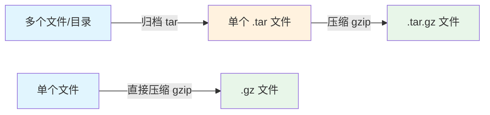
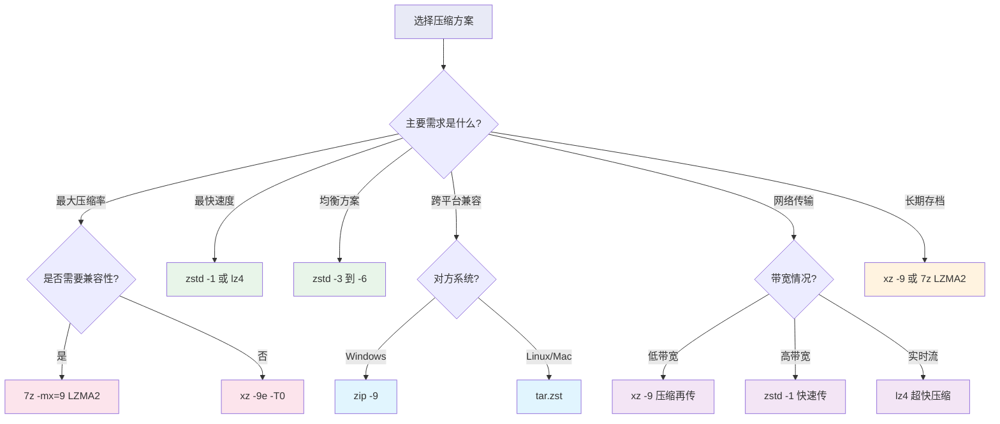

# 41 - 压缩与归档工具大全

> 数据压缩是 Linux 系统管理的基本功。从日常文件打包到企业级备份方案，掌握各种压缩归档工具及其适用场景，能让你在效率与空间之间找到最佳平衡点。本章将系统性地讲解 Arch Linux 下所有主流压缩归档工具的使用方法与最佳实践。

---

## 41.1 归档与压缩的概念区别

很多初学者会把"归档"和"压缩"混为一谈，实际上它们是两个不同的操作：

| 概念 | 说明 | 类比 |
|------|------|------|
| **归档（Archive）** | 将多个文件/目录合并为单个文件 | 把多本书放进一个箱子 |
| **压缩（Compress）** | 通过算法减小文件体积 | 用真空袋压缩衣物体积 |
| **归档+压缩** | 先归档再压缩（最常见操作） | 装箱后抽真空 |



**关键区别：**

- `tar` 本身只做归档（打包），不压缩
- `gzip`、`bzip2`、`xz` 等只做压缩，不归档
- `tar` 可以调用压缩工具实现"归档+压缩"一步完成
- `zip`、`7z` 同时完成归档和压缩

---

## 41.2 tar 完全指南

`tar`（Tape Archive）是 Linux 下最核心的归档工具，几乎所有源代码发行包都使用 tar 格式。

### 41.2.1 基本语法

```bash
tar [操作] [选项] [归档文件] [文件列表...]
```

### 41.2.2 核心操作符

| 操作符 | 含义 | 说明 |
|--------|------|------|
| `-c` | Create | 创建归档 |
| `-x` | Extract | 解压归档 |
| `-t` | List | 列出归档内容 |
| `-r` | Append | 追加文件到归档末尾 |
| `-u` | Update | 更新归档中较旧的文件 |
| `--delete` | Delete | 从归档中删除文件 |

### 41.2.3 常用选项

| 选项 | 含义 |
|------|------|
| `-f` | 指定归档文件名（几乎必须） |
| `-v` | 详细输出（显示处理的文件） |
| `-z` | 使用 gzip 压缩/解压 |
| `-j` | 使用 bzip2 压缩/解压 |
| `-J` | 使用 xz 压缩/解压 |
| `--zstd` | 使用 zstd 压缩/解压 |
| `-C` | 指定解压目标目录 |
| `-p` | 保留权限 |
| `--acls` | 保留 ACL |
| `--xattrs` | 保留扩展属性 |
| `--selinux` | 保留 SELinux 上下文 |

### 41.2.4 最常用命令组合

```bash
# 创建 gzip 压缩归档
tar -czf archive.tar.gz /path/to/directory

# 创建 bzip2 压缩归档
tar -cjf archive.tar.bz2 /path/to/directory

# 创建 xz 压缩归档（最高压缩率）
tar -cJf archive.tar.xz /path/to/directory

# 创建 zstd 压缩归档（速度与压缩率最佳平衡）
tar --zstd -cf archive.tar.zst /path/to/directory

# 解压任意格式（tar 自动识别压缩格式）
tar -xf archive.tar.gz
tar -xf archive.tar.xz
tar -xf archive.tar.zst

# 解压到指定目录
tar -xf archive.tar.gz -C /target/directory

# 查看归档内容（不解压）
tar -tvf archive.tar.gz

# 只解压特定文件
tar -xf archive.tar.gz path/to/specific/file

# 追加文件（仅对未压缩的 .tar）
tar -rf archive.tar newfile.txt
```

### 41.2.5 增量备份

`tar` 支持基于时间戳的增量备份，非常适合定期备份场景：

```bash
# 第一次：完整备份（创建快照文件）
tar --listed-incremental=/backup/snapshot.snar \
    -czf /backup/full-backup-$(date +%F).tar.gz \
    /home/user/documents

# 第二次：增量备份（只备份变化的文件）
tar --listed-incremental=/backup/snapshot.snar \
    -czf /backup/incr-backup-$(date +%F).tar.gz \
    /home/user/documents

# 恢复：先恢复完整备份，再依次恢复增量备份
tar --listed-incremental=/dev/null -xf /backup/full-backup-2024-01-01.tar.gz
tar --listed-incremental=/dev/null -xf /backup/incr-backup-2024-01-02.tar.gz
```

### 41.2.6 排除文件

```bash
# 排除特定文件或目录
tar -czf backup.tar.gz --exclude='*.log' --exclude='.cache' /home/user

# 使用排除文件列表
cat > /tmp/exclude-list.txt << 'EOF'
*.log
*.tmp
.cache
node_modules
__pycache__
.git
EOF
tar -czf backup.tar.gz --exclude-from=/tmp/exclude-list.txt /home/user

# 排除版本控制目录
tar -czf source.tar.gz --exclude-vcs /path/to/project

# 排除特定大小以上的文件
find /data -size +100M > /tmp/bigfiles.txt
tar -czf backup.tar.gz --exclude-from=/tmp/bigfiles.txt /data
```

### 41.2.7 保留权限与属性

```bash
# 完整保留所有元数据（需要 root 权限）
tar --acls --xattrs --xattrs-include='*' --selinux \
    -cpf backup.tar /important/data

# 解压时恢复所有元数据
tar --acls --xattrs --xattrs-include='*' --selinux \
    -xpf backup.tar -C /restore/path

# 保留数字 UID/GID（跨系统迁移时有用）
tar --numeric-owner -cpf backup.tar /data
```

### 41.2.8 分卷压缩

```bash
# 创建归档后用 split 分卷（每卷 4GB）
tar -czf - /large/directory | split -b 4G - backup.tar.gz.part_

# 合并分卷并解压
cat backup.tar.gz.part_* | tar -xzf -

# 指定分卷文件名格式
tar -czf - /large/directory | split -b 2G -d --suffix-length=3 - backup.tar.gz.

# 结果：backup.tar.gz.000, backup.tar.gz.001, ...
```

### 41.2.9 管道操作

```bash
# 通过管道直接传输（不创建中间文件）
tar -czf - /source/dir | tar -xzf - -C /dest/dir

# 配合 pv 显示进度
tar -cf - /large/dir | pv | gzip > backup.tar.gz

# 计算归档大小（不实际创建）
tar -cf - /path/to/dir | wc -c

# 从标准输入读取文件列表
find /data -name "*.conf" -print0 | tar -czf configs.tar.gz --null -T -
```

### 41.2.10 tar 与 SSH 远程归档

```bash
# 本地目录打包传输到远程
tar -czf - /local/data | ssh user@remote "cat > /backup/data.tar.gz"

# 远程目录直接拉到本地解压
ssh user@remote "tar -czf - /remote/data" | tar -xzf - -C /local/path

# 远程到远程的目录复制
ssh user@source "tar -czf - /data" | ssh user@dest "tar -xzf - -C /data"

# 带进度条的远程传输
tar -cf - /large/dir | pv | ssh user@remote "tar -xf - -C /dest"

# 通过 SSH 进行增量备份
tar --listed-incremental=/backup/snap.snar -czf - /data | \
    ssh user@backup-server "cat > /backups/incr-$(date +%F).tar.gz"
```

---

## 41.3 gzip / gunzip / zcat

gzip 是最经典的 Unix 压缩工具，使用 DEFLATE 算法。

```bash
# 安装（通常预装）
sudo pacman -S gzip

# 压缩文件（原文件被替换为 .gz）
gzip file.txt          # -> file.txt.gz

# 保留原文件
gzip -k file.txt       # -> file.txt 和 file.txt.gz 都保留

# 指定压缩级别（1=最快, 9=最小, 默认6）
gzip -9 file.txt       # 最高压缩率
gzip -1 file.txt       # 最快速度

# 解压
gunzip file.txt.gz     # -> file.txt
gzip -d file.txt.gz    # 等效

# 查看压缩文件内容（不解压）
zcat file.txt.gz
zless file.txt.gz      # 分页查看
zgrep "pattern" file.txt.gz  # 直接搜索

# 查看压缩信息
gzip -l file.txt.gz

# 递归压缩目录下所有文件
gzip -r /path/to/dir

# 多线程 gzip（需安装 pigz）
sudo pacman -S pigz
pigz -p 8 file.txt           # 8线程压缩
pigz -dk file.txt.gz         # 解压保留原文件
tar -cf - /data | pigz > data.tar.gz  # 配合 tar
```

---

## 41.4 bzip2 / bunzip2 / bzcat

bzip2 使用 Burrows-Wheeler 算法，压缩率优于 gzip，但速度较慢。

```bash
# 安装（通常预装）
sudo pacman -S bzip2

# 压缩
bzip2 file.txt         # -> file.txt.bz2
bzip2 -k file.txt      # 保留原文件
bzip2 -9 file.txt      # 最高压缩率

# 解压
bunzip2 file.txt.bz2
bzip2 -d file.txt.bz2

# 查看内容
bzcat file.txt.bz2
bzless file.txt.bz2
bzgrep "pattern" file.txt.bz2

# 多线程 bzip2（pbzip2）
sudo pacman -S pbzip2
pbzip2 -p8 file.txt           # 8线程压缩
pbzip2 -dk file.txt.bz2      # 解压
tar -cf - /data | pbzip2 > data.tar.bz2

# 完整性验证
bzip2 -t file.txt.bz2
```

---

## 41.5 xz / unxz / xzcat（LZMA2 算法）

xz 使用 LZMA2 算法，提供最高的压缩率，是 Arch Linux 官方包格式 `.pkg.tar.zst` 的前代方案。

```bash
# 安装（通常预装）
sudo pacman -S xz

# 压缩
xz file.txt            # -> file.txt.xz
xz -k file.txt         # 保留原文件

# 压缩级别（0-9，默认6）
xz -9 file.txt         # 极限压缩（内存占用大）
xz -9e file.txt        # 极限模式（更慢更小）
xz -0 file.txt         # 最快

# 指定线程数
xz -T0 file.txt        # 使用所有 CPU 核心
xz -T4 file.txt        # 4线程

# 解压
unxz file.txt.xz
xz -d file.txt.xz

# 查看内容
xzcat file.txt.xz
xzless file.txt.xz
xzgrep "pattern" file.txt.xz

# 查看压缩信息
xz -l file.txt.xz

# 内存限制（防止OOM）
xz -9 --memlimit=1GiB file.txt

# 完整性验证
xz -t file.txt.xz

# 配合 tar
tar -cJf archive.tar.xz /data
XZ_OPT='-9 -T0' tar -cJf archive.tar.xz /data  # 自定义 xz 参数
```

---

## 41.6 zstd（Zstandard）

zstd 由 Facebook 开发，在速度和压缩率之间取得最佳平衡，是当前推荐的通用压缩工具。Arch Linux 的软件包格式已从 `.pkg.tar.xz` 迁移到 `.pkg.tar.zst`。

```bash
# 安装
sudo pacman -S zstd

# 基本压缩
zstd file.txt          # -> file.txt.zst
zstd -k file.txt       # 保留原文件

# 压缩级别（1-19，默认3）
zstd -1 file.txt       # 最快（比 gzip 快且更小）
zstd -19 file.txt      # 最高常规压缩

# Ultra 模式（级别 20-22，需要更多内存）
zstd --ultra -22 file.txt

# 多线程压缩
zstd -T0 file.txt      # 自动使用所有核心
zstd -T8 -19 file.txt  # 8线程 + 高压缩率

# 解压
zstd -d file.txt.zst
unzstd file.txt.zst

# 查看内容
zstdcat file.txt.zst
zstdless file.txt.zst
zstdgrep "pattern" file.txt.zst

# 查看压缩信息
zstd -l file.txt.zst

# 配合 tar
tar --zstd -cf archive.tar.zst /data
ZSTD_CLEVEL=19 tar --zstd -cf archive.tar.zst /data

# 长距离匹配模式（提高大文件压缩率）
zstd --long=31 file.txt

# 自适应模式（根据I/O速度调整压缩级别）
zstd --adapt file.txt
```

### 41.6.1 字典压缩

对于大量相似的小文件（如 JSON、日志），字典压缩效果惊人：

```bash
# 训练字典（从样本文件中学习模式）
zstd --train /path/to/samples/* -o /tmp/dict

# 使用字典压缩
zstd -D /tmp/dict file.json

# 使用字典解压
zstd -d -D /tmp/dict file.json.zst

# 指定字典大小
zstd --train --maxdict=100KB /path/to/samples/* -o /tmp/small_dict
```

---

## 41.7 7z（p7zip / 7-zip）

7z 是强大的跨平台归档工具，支持多种格式，其 LZMA2 算法压缩率极高。

```bash
# 安装
sudo pacman -S p7zip

# 创建 7z 归档
7z a archive.7z /path/to/files

# 解压
7z x archive.7z              # 保留目录结构
7z e archive.7z              # 解压到当前目录（不保留结构）
7z x archive.7z -o/output    # 指定输出目录

# 列出内容
7z l archive.7z

# 测试完整性
7z t archive.7z

# 指定压缩方法和级别
7z a -mx=9 archive.7z /data          # 极限压缩
7z a -m0=lzma2 -mx=9 archive.7z /data  # LZMA2 极限
7z a -m0=deflate archive.7z /data    # 使用 deflate

# 加密压缩
7z a -p'MySecretPassword' archive.7z /private     # 密码保护
7z a -p -mhe=on archive.7z /private               # 加密文件名

# 分卷压缩
7z a -v100m archive.7z /large/data   # 每卷 100MB
# 结果：archive.7z.001, archive.7z.002, ...

# 解压分卷
7z x archive.7z.001

# 排除文件
7z a archive.7z /data -x'!*.log' -x'!.git'

# 支持的格式
7z a archive.zip /data       # 创建 ZIP
7z a archive.tar /data       # 创建 TAR
7z x anything.rar            # 解压 RAR
7z x anything.iso            # 解压 ISO

# 更新归档中的文件
7z u archive.7z newfile.txt

# 删除归档中的文件
7z d archive.7z unwanted.txt
```

### 41.7.1 LZMA2 vs Deflate 对比

| 特性 | LZMA2 | Deflate |
|------|-------|---------|
| 压缩率 | 极高 | 中等 |
| 压缩速度 | 慢 | 快 |
| 解压速度 | 快 | 快 |
| 内存占用 | 高 | 低 |
| 兼容性 | 7z/xz | zip/gz |

---

## 41.8 zip / unzip

zip 格式是与 Windows 兼容的最佳选择：

```bash
# 安装
sudo pacman -S zip unzip

# 创建 zip
zip archive.zip file1.txt file2.txt
zip -r archive.zip /path/to/directory    # 递归目录

# 压缩级别（0-9）
zip -9 -r archive.zip /data

# 加密
zip -e -r archive.zip /private

# 分卷
zip -s 100m -r archive.zip /large/data

# 解压
unzip archive.zip
unzip archive.zip -d /target/dir

# 列出内容
unzip -l archive.zip

# 测试完整性
unzip -t archive.zip

# 只解压特定文件
unzip archive.zip "*.conf"

# 处理中文文件名（指定编码）
unzip -O CP936 chinese_archive.zip

# 更新/追加
zip -u archive.zip newfile.txt

# 排除文件
zip -r archive.zip /data -x "*.log" "*.tmp"
```

---

## 41.9 rar / unrar

```bash
# 安装
sudo pacman -S unrar    # 仅解压
# rar 在 AUR 中：yay -S rar

# 解压
unrar x archive.rar              # 保留目录结构
unrar e archive.rar              # 解压到当前目录
unrar x archive.rar /target/     # 指定目录

# 列出内容
unrar l archive.rar

# 测试
unrar t archive.rar

# 创建 rar（需要安装 rar）
rar a archive.rar /path/to/files
rar a -m5 archive.rar /data      # 最高压缩
rar a -p archive.rar /private    # 加密
rar a -v100m archive.rar /data   # 分卷
rar a -rr3% archive.rar /data    # 添加恢复记录
```

---

## 41.10 压缩算法对比

| 工具 | 算法 | 压缩率 | 压缩速度 | 解压速度 | 内存占用 | 多线程 |
|------|------|--------|----------|----------|----------|--------|
| gzip | DEFLATE | ★★☆☆☆ | ★★★★☆ | ★★★★★ | 低 | pigz |
| bzip2 | BWT | ★★★☆☆ | ★★☆☆☆ | ★★☆☆☆ | 中 | pbzip2 |
| xz | LZMA2 | ★★★★★ | ★☆☆☆☆ | ★★★☆☆ | 高 | 原生 -T |
| zstd | Zstandard | ★★★★☆ | ★★★★★ | ★★★★★ | 中 | 原生 -T |
| lz4 | LZ4 | ★★☆☆☆ | ★★★★★+ | ★★★★★+ | 极低 | 原生 |
| 7z/LZMA2 | LZMA2 | ★★★★★ | ★☆☆☆☆ | ★★★☆☆ | 高 | 原生 |

### 实际基准测试（1GB 混合数据）

| 工具 + 级别 | 压缩后大小 | 压缩时间 | 解压时间 |
|-------------|-----------|----------|----------|
| gzip -6 | ~340MB | ~12s | ~3s |
| gzip -9 | ~320MB | ~45s | ~3s |
| bzip2 -9 | ~280MB | ~60s | ~25s |
| xz -6 | ~240MB | ~120s | ~8s |
| xz -9 | ~220MB | ~300s | ~8s |
| zstd -3 | ~310MB | ~3s | ~1.5s |
| zstd -19 | ~230MB | ~90s | ~1.5s |
| lz4 | ~420MB | ~1s | ~0.5s |

---

## 41.11 实际场景推荐方案



### 场景推荐表

| 场景 | 推荐方案 | 命令示例 |
|------|----------|----------|
| 日常归档 | tar + zstd | `tar --zstd -cf file.tar.zst dir/` |
| 代码源码包 | tar + xz | `tar -cJf src.tar.xz project/` |
| 快速临时打包 | tar + zstd -1 | `tar --zstd -cf tmp.tar.zst dir/` |
| 发给 Windows 用户 | zip | `zip -r file.zip dir/` |
| 最大压缩率 | 7z LZMA2 | `7z a -m0=lzma2 -mx=9 file.7z dir/` |
| 增量备份 | tar + incremental | 见 41.2.5 节 |
| 数据库备份 | zstd 流式 | `pg_dump | zstd -T0 > db.sql.zst` |
| 日志压缩 | zstd + dict | 训练字典后批量压缩 |
| 网络传输 | tar + ssh + zstd | `tar --zstd -cf - dir \| ssh ...` |
| Docker 镜像层 | zstd | Docker 已原生支持 zstd |

### 完整备份脚本示例

```bash
#!/bin/bash
# Arch Linux 系统备份脚本

BACKUP_DIR="/backup"
DATE=$(date +%F_%H%M)
SNAPSHOT="$BACKUP_DIR/snapshot.snar"

EXCLUDE_FILE="/tmp/backup-exclude.txt"
cat > "$EXCLUDE_FILE" << 'EOF'
/proc/*
/sys/*
/dev/*
/run/*
/tmp/*
/mnt/*
/media/*
/lost+found
/swapfile
/var/cache/pacman/pkg/*
/home/*/.cache/*
EOF

# 增量备份到远程服务器
tar --listed-incremental="$SNAPSHOT" \
    --exclude-from="$EXCLUDE_FILE" \
    --acls --xattrs --xattrs-include='*' \
    --numeric-owner \
    -cf - / | \
    zstd -T0 -6 | \
    ssh backup@server "cat > /backups/arch-$DATE.tar.zst"

echo "Backup completed: arch-$DATE.tar.zst"
```

---

## 41.12 本章测验

> [!example] 📝 自测题目

> [!question]- 选择题 1：tar 的 `-c` 选项表示什么操作？
> - A. 压缩（Compress）
> - B. 创建归档（Create）
> - C. 检查完整性（Check）
> - D. 复制（Copy）
>
> > [!success]- 点击查看答案
> > **B**
> > `-c` 代表 Create，即创建一个新的归档文件。tar 本身不做压缩，压缩由 `-z`、`-j`、`-J` 等选项调用外部压缩程序完成。

> [!question]- 选择题 2：以下哪个命令能创建使用 zstd 压缩的 tar 归档？
> - A. `tar -czf archive.tar.zst dir/`
> - B. `tar --zstd -cf archive.tar.zst dir/`
> - C. `tar -cZf archive.tar.zst dir/`
> - D. `tar -cz --zstd archive.tar.zst dir/`
>
> > [!success]- 点击查看答案
> > **B**
> > zstd 使用 `--zstd` 长选项，不像 gzip(-z)、bzip2(-j)、xz(-J) 有短选项。正确格式是 `tar --zstd -cf`。

> [!question]- 选择题 3：哪种压缩工具在压缩速度和压缩率之间取得最佳平衡？
> - A. gzip
> - B. bzip2
> - C. xz
> - D. zstd
>
> > [!success]- 点击查看答案
> > **D**
> > zstd（Zstandard）由 Facebook 开发，其设计目标就是在速度和压缩率之间取得最佳平衡。默认级别下比 gzip 更快且压缩率更高。

> [!question]- 选择题 4：tar 增量备份使用哪个选项？
> - A. `--incremental`
> - B. `--listed-incremental`
> - C. `--diff`
> - D. `--update-only`
>
> > [!success]- 点击查看答案
> > **B**
> > `--listed-incremental=SNAPSHOT_FILE` 是 GNU tar 实现增量备份的选项，它会创建并维护一个快照文件来记录文件状态。

> [!question]- 选择题 5：7z 加密归档时如果想同时加密文件名，应该使用什么选项？
> - A. `-mhe=on`
> - B. `--encrypt-names`
> - C. `-ef`
> - D. `-h`
>
> > [!success]- 点击查看答案
> > **A**
> > `-mhe=on` 表示 encrypt header（加密头部），这样文件名也会被加密。完整命令：`7z a -p -mhe=on archive.7z files`。

> [!question]- 判断题 6：tar 本身既能归档也能压缩 ✓/✗
> - A. ✓ 正确
> - B. ✗ 错误
>
> > [!success]- 点击查看答案
> > **B. ✗ 错误**
> > tar 本身只做归档（将多个文件合并为一个文件），压缩是通过调用外部程序（gzip、bzip2、xz、zstd 等）来完成的。`-z`、`-j`、`-J` 等选项只是方便地调用这些压缩程序。

> [!question]- 判断题 7：xz -9 的压缩率高于 zstd -19 ✓/✗
> - A. ✓ 正确
> - B. ✗ 错误
>
> > [!success]- 点击查看答案
> > **A. ✓ 正确**
> > 在大多数数据集上，xz -9 的压缩率略高于 zstd -19。但 zstd 的解压速度远快于 xz，且 zstd --ultra -22 可能接近甚至超过 xz -9。

> [!question]- 选择题 8：Arch Linux 官方软件包目前使用什么压缩格式？
> - A. .pkg.tar.gz
> - B. .pkg.tar.xz
> - C. .pkg.tar.zst
> - D. .pkg.tar.bz2
>
> > [!success]- 点击查看答案
> > **C**
> > Arch Linux 于 2020 年将官方软件包格式从 `.pkg.tar.xz` 迁移到 `.pkg.tar.zst`，因为 zstd 解压速度更快，能显著加快软件包安装速度。

> [!question]- 选择题 9：要将本地目录通过 SSH 直接传输到远程服务器并解压，正确的命令是？
> - A. `tar -czf dir/ | ssh user@host "tar -xzf -"`
> - B. `tar -czf - dir/ | ssh user@host "tar -xzf -"`
> - C. `ssh user@host tar -czf dir/ > local.tar.gz`
> - D. `tar -czf dir/ > ssh user@host`
>
> > [!success]- 点击查看答案
> > **B**
> > `-czf -` 中的 `-` 表示输出到标准输出（stdout），然后通过管道传给 ssh，远程端的 `tar -xzf -` 从标准输入（stdin）读取并解压。

> [!question]- 判断题 10：zstd 的字典压缩模式适合压缩大量相似的小文件 ✓/✗
> - A. ✓ 正确
> - B. ✗ 错误
>
> > [!success]- 点击查看答案
> > **A. ✓ 正确**
> > zstd 的字典压缩通过 `--train` 从样本中学习数据模式，特别适合大量结构相似的小文件（如 JSON API 响应、日志条目等），可以显著提高压缩率。
