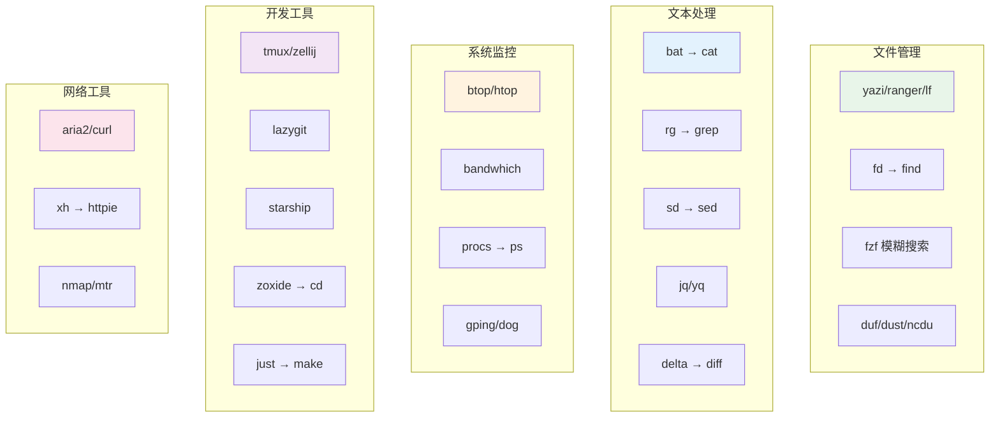

# 42 - 终端常用工具大全

> 现代终端工具生态已经发展出大量优秀的命令行替代品，它们比传统 Unix 工具更快、更美观、更易用。本章收集 Arch Linux 下最实用的终端工具，涵盖文件管理、文本处理、系统监控、开发辅助等方面，帮你打造高效的终端工作流。

---

## 42.1 文件管理类

### 42.1.1 lf / ranger / yazi — 终端文件管理器

```bash
# 安装
sudo pacman -S lf ranger
# yazi 在 community 仓库
sudo pacman -S yazi

# === lf（Go 编写，轻量快速）===
lf                    # 启动
# 快捷键：h/j/k/l 导航，d 删除，y 复制，p 粘贴，/ 搜索

# === ranger（Python 编写，功能丰富）===
ranger               # 启动
# 预览文件需要额外工具
sudo pacman -S highlight w3m   # 语法高亮 + 图片预览

# === yazi（Rust 编写，性能最佳）===
yazi                  # 启动（推荐，速度极快）
# 支持异步 I/O、图片预览、内置终端
```

yazi 配置示例（`~/.config/yazi/yazi.toml`）：

```toml
[manager]
sort_by = "natural"
show_hidden = true

[preview]
max_width = 1000
max_height = 1000
```

### 42.1.2 fd — find 的现代替代

```bash
sudo pacman -S fd

# 基本搜索（自动忽略 .gitignore 中的文件）
fd pattern                    # 搜索文件名匹配 pattern
fd -e rs                      # 搜索所有 .rs 文件
fd -e py -x wc -l            # 找到所有 .py 文件并统计行数

# 高级用法
fd -H pattern                 # 包含隐藏文件
fd -I pattern                 # 不遵循 .gitignore
fd -t f pattern               # 只搜索文件（不含目录）
fd -t d pattern               # 只搜索目录
fd -s Pattern                 # 大小写敏感
fd -d 2 pattern               # 限制深度为 2
fd --changed-within 1d        # 最近 1 天修改的文件
fd -e log --size +10m         # 大于 10MB 的日志文件

# 配合其他工具
fd -e jpg | xargs -I{} cp {} /backup/photos/
fd -t f -0 | xargs -0 wc -l  # 统计所有文件行数
```

### 42.1.3 fzf — 模糊搜索神器

```bash
sudo pacman -S fzf

# 基本使用
fzf                           # 交互式选择文件
cat file | fzf                # 从管道输入中选择
history | fzf                 # 搜索命令历史

# 预览功能
fzf --preview 'bat --color=always {}'
fd -t f | fzf --preview 'bat --color=always --line-range=:100 {}'

# Shell 集成（在 ~/.bashrc 或 ~/.zshrc 中）
source /usr/share/fzf/key-bindings.bash
source /usr/share/fzf/completion.bash
# Ctrl+T：搜索文件
# Ctrl+R：搜索历史命令
# Alt+C：搜索并进入目录

# 高级配置
export FZF_DEFAULT_COMMAND='fd --type f --hidden --follow --exclude .git'
export FZF_DEFAULT_OPTS='--height 40% --layout=reverse --border --preview "bat --color=always --line-range=:50 {}"'

# 实用组合
# 选择进程并 kill
ps aux | fzf | awk '{print $2}' | xargs kill -9
# 选择 git 分支并切换
git branch | fzf | xargs git checkout
# 选择 pacman 包并安装
pacman -Slq | fzf --multi --preview 'pacman -Si {}' | xargs -ro sudo pacman -S
```

### 42.1.4 trash-cli — 安全删除

```bash
sudo pacman -S trash-cli

trash-put file.txt            # 移到回收站
trash-list                    # 列出回收站内容
trash-restore                 # 交互式恢复
trash-empty                   # 清空回收站
trash-empty 30                # 清除 30 天前的垃圾

# 建议设置别名
alias rm='trash-put'
alias tp='trash-put'
```

### 42.1.5 duf — df 的美观替代

```bash
sudo pacman -S duf

duf                           # 显示所有挂载点
duf /home                     # 显示特定路径
duf --only local              # 只显示本地文件系统
duf --sort size               # 按大小排序
duf --json                    # JSON 输出
duf --theme ansi              # 兼容模式
```

### 42.1.6 dust — du 的现代替代

```bash
sudo pacman -S dust

dust                          # 当前目录
dust /var                     # 指定目录
dust -n 20                    # 显示前 20 项
dust -r                       # 反向排序
dust -d 3                     # 限制深度
dust -b                       # 不显示百分比条
```

### 42.1.7 ncdu — 交互式磁盘分析

```bash
sudo pacman -S ncdu

ncdu /                        # 扫描根目录
ncdu --exclude /proc -x /     # 排除并不跨文件系统
# 交互界面：d 删除，n/s/C 排序切换，q 退出

# 导出扫描结果供以后查看
ncdu -o /tmp/scan.json /
ncdu -f /tmp/scan.json
```

---

## 42.2 文本处理类

### 42.2.1 bat — cat 的语法高亮替代

```bash
sudo pacman -S bat

bat file.py                   # 语法高亮 + 行号
bat -n file.py                # 只显示行号
bat -p file.py                # 纯文本（无装饰）
bat -A file.txt               # 显示不可见字符
bat -l json < data            # 指定语言
bat --diff file.py            # 显示 git diff
bat -r 10:20 file.py          # 只显示 10-20 行
bat --theme='Dracula' file.py # 指定主题
bat --list-themes             # 列出所有主题

# 作为 man 的高亮后端
export MANPAGER="sh -c 'col -bx | bat -l man -p'"

# 配合其他工具
alias cat='bat --paging=never'
```

### 42.2.2 ripgrep (rg) — grep 的极速替代

```bash
sudo pacman -S ripgrep

# 基本搜索
rg pattern                    # 递归搜索当前目录
rg -i pattern                 # 忽略大小写
rg -w word                    # 全字匹配
rg -l pattern                 # 只显示文件名
rg -c pattern                 # 显示匹配计数

# 文件类型过滤
rg -t py pattern              # 只搜索 Python 文件
rg -T js pattern              # 排除 JavaScript 文件
rg --type-list                # 列出支持的类型

# 高级选项
rg -C 3 pattern               # 显示前后3行上下文
rg --hidden pattern           # 包含隐藏文件
rg -z pattern                 # 搜索压缩文件
rg --json pattern             # JSON 输出
rg -g '*.conf' pattern        # glob 过滤
rg -F 'literal.string'        # 固定字符串（不解释正则）
rg --replace 'new' 'old'     # 显示替换预览
rg -U 'multi\nline'          # 多行匹配
rg --stats pattern            # 显示统计信息

# 组合使用
rg TODO --glob '!vendor' --glob '!node_modules'
```

### 42.2.3 sd — sed 的简洁替代

```bash
sudo pacman -S sd

# 基本替换（直接修改文件）
sd 'old' 'new' file.txt
sd 'from' 'to' file1.txt file2.txt

# 正则表达式
sd '(\d+)px' '${1}rem' style.css
sd 'Hello (\w+)' 'Hi $1' greet.txt

# 从管道使用
echo "hello world" | sd 'world' 'rust'

# 固定字符串模式（不解释正则）
sd -s 'a.b' 'c.d' file.txt

# 预览模式（不修改文件）
sd -p 'old' 'new' file.txt
```

### 42.2.4 jq — JSON 处理

```bash
sudo pacman -S jq

# 基本操作
echo '{"name":"arch","version":6}' | jq '.'          # 格式化
echo '{"name":"arch"}' | jq '.name'                  # 取字段
echo '[1,2,3]' | jq '.[0]'                           # 取索引

# 过滤和转换
cat data.json | jq '.[] | select(.age > 18)'        # 过滤
cat data.json | jq '.[] | {name, email}'             # 投影
cat data.json | jq '[.[] | .price] | add'            # 求和
cat data.json | jq 'length'                          # 长度
cat data.json | jq 'keys'                            # 获取键

# 修改 JSON
jq '.version = "2.0"' package.json > tmp && mv tmp package.json
jq '.deps += ["newdep"]' config.json | sponge config.json

# 实用示例
curl -s https://api.github.com/repos/archlinux/archinstall/releases/latest | \
    jq -r '.assets[].browser_download_url'

# 从 JSON 生成 CSV
jq -r '.[] | [.name, .age, .city] | @csv' data.json
```

### 42.2.5 yq — YAML 处理

```bash
sudo pacman -S yq

# 读取 YAML
yq '.services.web.image' docker-compose.yml
yq '.spec.containers[0].name' pod.yaml

# 修改 YAML
yq -i '.version = "2.0"' chart.yaml
yq -i '.services.web.ports += ["8080:80"]' docker-compose.yml

# YAML 转 JSON
yq -o=json '.' config.yaml

# JSON 转 YAML
yq -P '.' config.json
```

### 42.2.6 delta — diff 美化工具

```bash
sudo pacman -S git-delta

# 配置为 git 的 diff 工具（~/.gitconfig）
```

```ini
[core]
    pager = delta

[interactive]
    diffFilter = delta --color-only

[delta]
    navigate = true
    side-by-side = true
    line-numbers = true
    syntax-theme = Dracula
```

```bash
# 直接使用
delta file1.txt file2.txt
diff -u old.py new.py | delta
```

### 42.2.7 hexyl — 十六进制查看

```bash
sudo pacman -S hexyl

hexyl file.bin                # 查看二进制文件
hexyl -n 256 file.bin         # 只看前 256 字节
hexyl -s 0x100 file.bin       # 从偏移 0x100 开始
hexyl --border none file.bin  # 无边框
echo "Hello" | hexyl          # 管道输入
```

---

## 42.3 系统监控类

### 42.3.1 btop / htop — 进程监控

```bash
sudo pacman -S btop htop

btop                          # 启动（推荐，最美观）
htop                          # 经典交互式进程管理

# btop 特性：CPU/内存/磁盘/网络一览
# 快捷键：f=过滤, t=树状, k=kill, s=排序
# 支持鼠标操作

# htop 常用快捷键
# F5=树状, F6=排序, F9=kill, F4=过滤, /=搜索
```

### 42.3.2 bandwhich — 网络带宽监控

```bash
sudo pacman -S bandwhich

sudo bandwhich                # 需要 root（监听网络接口）
# 显示：各进程网络使用、远程地址、总带宽
```

### 42.3.3 procs — ps 的现代替代

```bash
sudo pacman -S procs

procs                         # 彩色进程列表
procs --tree                  # 树状显示
procs firefox                 # 搜索进程
procs --sortd cpu             # 按 CPU 降序
procs --watch 1               # 每秒刷新
```

### 42.3.4 dog — dig 的替代

```bash
sudo pacman -S dog

dog example.com               # 查询 A 记录
dog example.com MX            # 查询 MX 记录
dog example.com --json        # JSON 输出
dog @8.8.8.8 example.com     # 指定 DNS 服务器
dog example.com AAAA NS TXT  # 多种记录类型
```

### 42.3.5 gping — ping 美化

```bash
sudo pacman -S gping

gping google.com              # 实时图形化 ping
gping 1.1.1.1 8.8.8.8        # 同时 ping 多个目标比较
gping --cmd "curl -so /dev/null -w '%{time_total}' https://example.com"  # 自定义命令
```

### 42.3.6 hyperfine — 命令基准测试

```bash
sudo pacman -S hyperfine

# 基准测试单个命令
hyperfine 'sleep 0.3'

# 比较多个命令
hyperfine 'fd -e py' 'find . -name "*.py"'
hyperfine --warmup 3 'rg pattern' 'grep -r pattern'

# 参数化测试
hyperfine -P threads 1 8 'sort --parallel={threads} input.txt'

# 导出结果
hyperfine --export-markdown results.md 'cmd1' 'cmd2'
hyperfine --export-json results.json 'cmd1' 'cmd2'

# 准备和清理命令
hyperfine --prepare 'sync; echo 3 | sudo tee /proc/sys/vm/drop_caches' 'cat largefile'
```

---

## 42.4 开发工具类

### 42.4.1 tmux / zellij — 终端复用器

```bash
sudo pacman -S tmux zellij

# === tmux ===
tmux                          # 新建会话
tmux new -s work              # 命名会话
tmux ls                       # 列出会话
tmux attach -t work           # 重新连接
tmux kill-session -t work     # 销毁会话

# tmux 快捷键前缀：Ctrl+b
# Ctrl+b c    新建窗口
# Ctrl+b n/p  下/上一个窗口
# Ctrl+b %    水平分割
# Ctrl+b "    垂直分割
# Ctrl+b d    断开（后台运行）
# Ctrl+b [    进入复制模式
# Ctrl+b z    最大化/还原当前窗格

# === zellij（Rust 编写，更现代）===
zellij                        # 启动（底部显示快捷键提示）
zellij --session work         # 命名会话
zellij attach work            # 重新连接
zellij list-sessions          # 列出会话

# zellij 默认快捷键
# Ctrl+p     窗格模式
# Ctrl+t     标签模式
# Ctrl+n     调整大小模式
# Ctrl+s     滚动模式
# Ctrl+o     会话模式
# Ctrl+q     退出
```

### 42.4.2 lazygit — Git TUI

```bash
sudo pacman -S lazygit

lazygit                       # 在 git 仓库中启动
# 面板：状态/文件/分支/提交/储藏
# 空格=暂存, c=提交, p=推送, P=拉取
# 支持交互式 rebase、cherry-pick、bisect
```

### 42.4.3 tokei — 代码统计

```bash
sudo pacman -S tokei

tokei                         # 统计当前目录
tokei /path/to/project        # 指定项目
tokei --sort lines            # 按行数排序
tokei -e '*.test.js'          # 排除测试文件
tokei --files                 # 显示每个文件的统计
```

### 42.4.4 just — Makefile 的现代替代

```bash
sudo pacman -S just

# 创建 justfile
cat > justfile << 'EOF'
default:
    @echo 'Hello from just!'

build:
    cargo build --release

test *args:
    cargo test {{args}}

deploy env='staging':
    ./deploy.sh {{env}}

fmt:
    cargo fmt
    prettier --write .
EOF

just              # 运行默认 recipe
just build        # 运行 build
just test -- -v   # 传递参数
just --list       # 列出所有 recipe
```

### 42.4.5 direnv — 目录环境变量

```bash
sudo pacman -S direnv

# 添加 hook 到 shell（~/.bashrc 或 ~/.zshrc）
eval "$(direnv hook bash)"    # bash
eval "$(direnv hook zsh)"     # zsh

# 使用
cd /project
cat > .envrc << 'EOF'
export DATABASE_URL="postgres://localhost/mydb"
export API_KEY="dev-key-123"
PATH_add bin
layout python3
EOF

direnv allow                  # 允许加载
# 进入目录时自动加载环境变量，离开时自动卸载
```

### 42.4.6 starship — 跨 Shell 提示符

```bash
sudo pacman -S starship

# 添加到 shell 配置
# ~/.bashrc
eval "$(starship init bash)"
# ~/.zshrc
eval "$(starship init zsh)"

# 配置 ~/.config/starship.toml
cat > ~/.config/starship.toml << 'EOF'
[character]
success_symbol = "[❯](bold green)"
error_symbol = "[❯](bold red)"

[directory]
truncation_length = 3
truncation_symbol = "…/"

[git_branch]
symbol = " "

[python]
symbol = " "

[rust]
symbol = " "

[nodejs]
symbol = " "

[cmd_duration]
min_time = 2_000
show_milliseconds = true
EOF
```

### 42.4.7 zoxide — 智能目录跳转

```bash
sudo pacman -S zoxide

# 添加到 shell（~/.bashrc 或 ~/.zshrc）
eval "$(zoxide init bash)"    # 提供 z 命令
eval "$(zoxide init zsh)"

# 使用
z projects          # 跳转到最常用的匹配 "projects" 的目录
z doc               # 跳转到 ~/Documents 或类似
zi                  # 交互式选择（需要 fzf）
z -                 # 回到上一个目录
zoxide query docs   # 查询数据库
```

---

## 42.5 ASCII / TUI 艺术类

### 42.5.1 neofetch / fastfetch — 系统信息展示

```bash
# fastfetch（C 编写，更快，推荐）
sudo pacman -S fastfetch

fastfetch                     # 显示系统信息
fastfetch --logo arch         # 指定 logo
fastfetch --config examples/8 # 使用预设配置

# neofetch（经典，已停止维护）
sudo pacman -S neofetch
neofetch
neofetch --ascii_distro arch_small
```

### 42.5.2 figlet / toilet — ASCII 艺术字

```bash
sudo pacman -S figlet toilet

figlet "Arch Linux"           # 生成 ASCII 艺术字
figlet -f slant "Hello"       # 使用不同字体
figlet -c "Centered"          # 居中
figlet -w 120 "Wide"          # 指定宽度

toilet "Arch" --metal         # 带色彩的艺术字
toilet -f mono12 "Big"        # 大字体
toilet --filter border "Box"  # 边框效果

# 列出可用字体
figlet -I 2 | xargs ls       # 字体目录
showfigfonts                  # 预览所有字体
```

### 42.5.3 lolcat — 彩虹输出

```bash
sudo pacman -S lolcat

echo "Rainbow!" | lolcat
figlet "Arch Linux" | lolcat
fastfetch | lolcat
fortune | lolcat              # 彩虹名言
```

### 42.5.4 asciinema / vhs — 终端录制

```bash
# asciinema：录制终端操作为文本格式
sudo pacman -S asciinema

asciinema rec demo.cast       # 开始录制
asciinema play demo.cast      # 回放
asciinema upload demo.cast    # 上传到 asciinema.org

# vhs：录制为 GIF/MP4/WebM
sudo pacman -S vhs

# 创建脚本 demo.tape
cat > demo.tape << 'EOF'
Output demo.gif
Set FontSize 14
Set Width 1200
Set Height 600
Type "echo 'Hello, Arch Linux!'"
Enter
Sleep 1s
Type "fastfetch"
Enter
Sleep 3s
EOF

vhs demo.tape                 # 生成 GIF
```

### 42.5.5 终端娱乐工具

```bash
# 黑客帝国效果
sudo pacman -S cmatrix
cmatrix -a -C cyan

# 管道屏保
# 从 AUR 安装：yay -S pipes.sh
pipes.sh -t 0 -p 5

# 盆栽生长动画
sudo pacman -S cbonsai
cbonsai -l                    # 实时生长
cbonsai -p                    # 打印静态盆栽

# 终端时钟
sudo pacman -S tty-clock
tty-clock -s -c -C 4         # 居中、彩色、秒针
```

---

## 42.6 网络工具类

### 42.6.1 curl / wget / aria2 — 下载工具

```bash
sudo pacman -S curl wget aria2

# curl 常用操作
curl -O https://example.com/file.tar.gz       # 下载保留文件名
curl -o output.html https://example.com       # 指定输出文件名
curl -L https://short.url/abc                 # 跟随重定向
curl -C - -O https://example.com/large.iso    # 断点续传
curl -u user:pass https://api.example.com     # 基本认证
curl -X POST -d '{"key":"val"}' -H "Content-Type: application/json" https://api.example.com

# wget
wget https://example.com/file.tar.gz          # 基本下载
wget -c url                                   # 断点续传
wget -r -l 2 https://example.com              # 递归下载（2层深度）
wget -m https://example.com                   # 镜像网站
wget -i urls.txt                              # 从文件读取 URL 列表

# aria2（多线程/多协议下载加速器）
aria2c https://example.com/file.iso           # 基本下载
aria2c -x 16 url                              # 16 线程
aria2c -s 16 -x 16 url                        # 16 连接 + 16 线程
aria2c -i urls.txt                            # 批量下载
aria2c --max-concurrent-downloads=5 -i list   # 最大并发 5
aria2c "magnet:?xt=urn:btih:..."              # 磁力链接
aria2c --seed-time=0 file.torrent             # BT下载不做种
```

### 42.6.2 httpie / xh — 现代 HTTP 客户端

```bash
sudo pacman -S httpie xh

# httpie（Python）
http GET https://api.example.com/users
http POST https://api.example.com/users name=john age:=25
http -f POST https://example.com/login user=admin pass=secret
http --download https://example.com/file.zip

# xh（Rust 重写的 httpie，更快）
xh https://api.example.com/users
xh post https://api.example.com/users name=john
xh -b https://api.example.com/data    # 只显示 body
xh -h https://api.example.com         # 只显示 headers
```

### 42.6.3 nmap — 端口扫描

```bash
sudo pacman -S nmap

nmap 192.168.1.1              # 基本扫描
nmap -sV 192.168.1.1          # 版本检测
nmap -O 192.168.1.1           # 操作系统检测
nmap -p 1-1000 192.168.1.1    # 指定端口范围
nmap -sn 192.168.1.0/24       # Ping 扫描（主机发现）
nmap -A target                # 全面扫描
nmap --script vuln target     # 漏洞扫描
```

### 42.6.4 mtr — traceroute 的增强替代

```bash
sudo pacman -S mtr

mtr google.com                # 实时跟踪路由
mtr -r google.com             # 报告模式
mtr -c 10 google.com          # 发送 10 个包后停止
mtr --tcp -P 443 google.com   # TCP 模式（绕过 ICMP 过滤）
mtr -z google.com             # 显示 ASN
```

---

## 42.7 其他实用工具

### 42.7.1 pass / gopass — 密码管理

```bash
sudo pacman -S pass

# 初始化（使用 GPG 密钥）
pass init "your-gpg-key-id"

# 基本操作
pass insert email/gmail       # 添加密码
pass email/gmail              # 查看密码
pass -c email/gmail           # 复制到剪贴板
pass generate web/github 32   # 生成 32 位随机密码
pass edit email/gmail         # 编辑
pass rm email/gmail           # 删除
pass ls                       # 列出所有
pass git push                 # 同步到 git 远程
```

### 42.7.2 age — 现代文件加密

```bash
sudo pacman -S age

# 生成密钥对
age-keygen -o key.txt

# 使用公钥加密
age -r age1xxxxxxx... secret.txt > secret.txt.age

# 使用密钥文件解密
age -d -i key.txt secret.txt.age > secret.txt

# 使用密码加密（无需密钥）
age -p secret.txt > secret.txt.age

# 多个接收者
age -r age1xxx... -r age1yyy... secret.txt > secret.txt.age

# 加密到 SSH 公钥
age -R ~/.ssh/id_ed25519.pub secret.txt > secret.txt.age
```

### 42.7.3 restic / borg — 备份工具

```bash
sudo pacman -S restic

# restic：去重加密备份
restic init --repo /backup/restic       # 初始化仓库
restic -r /backup/restic backup ~/docs  # 备份
restic -r /backup/restic snapshots      # 列出快照
restic -r /backup/restic restore latest --target /restore  # 恢复
restic -r /backup/restic forget --keep-last 5 --prune      # 保留 5 份
restic -r sftp:user@host:/backup backup ~/docs             # 远程备份

# borg：高效去重备份
sudo pacman -S borg
borg init --encryption=repokey /backup/borg
borg create /backup/borg::'{now}' ~/docs
borg list /backup/borg
borg extract /backup/borg::archive-name
borg prune --keep-daily 7 --keep-weekly 4 /backup/borg
```

---

## 42.8 工具生态总览



---

## 42.9 本章测验

> [!example] 📝 自测题目

> [!question]- 选择题 1：以下哪个工具是 `find` 的现代替代品？
> - A. fzf
> - B. fd
> - C. rg
> - D. sd
>
> > [!success]- 点击查看答案
> > **B**
> > `fd` 是 find 的现代替代，自动忽略 .gitignore 中的文件，语法更简洁，速度更快。fzf 是模糊搜索，rg 是 grep 替代，sd 是 sed 替代。

> [!question]- 选择题 2：fzf 在 bash 中搜索历史命令的默认快捷键是？
> - A. Ctrl+F
> - B. Ctrl+H
> - C. Ctrl+R
> - D. Ctrl+S
>
> > [!success]- 点击查看答案
> > **C**
> > fzf 的 shell 集成中，Ctrl+R 用于模糊搜索命令历史（与 bash 原生的 reverse-search 快捷键相同，fzf 会接管）。Ctrl+T 搜索文件，Alt+C 搜索目录。

> [!question]- 选择题 3：以下哪个工具可以用来做命令基准测试比较？
> - A. time
> - B. benchmark
> - C. hyperfine
> - D. perf
>
> > [!success]- 点击查看答案
> > **C**
> > `hyperfine` 专门设计用于命令基准测试，支持 warmup、参数化测试、统计分析和结果导出。虽然 `time` 也能测量时间，但不支持多次运行统计和多命令比较。

> [!question]- 选择题 4：zoxide 提供的核心功能是？
> - A. 文件搜索
> - B. 智能目录跳转
> - C. 文件压缩
> - D. 进程管理
>
> > [!success]- 点击查看答案
> > **B**
> > zoxide 是 `cd` 的智能替代，它会记住你访问过的目录，通过模糊匹配快速跳转到最常用/最近的目录。

> [!question]- 判断题 5：ripgrep (rg) 默认会搜索 .gitignore 中忽略的文件 ✓/✗
> - A. ✓ 正确
> - B. ✗ 错误
>
> > [!success]- 点击查看答案
> > **B. ✗ 错误**
> > ripgrep 默认遵循 .gitignore 规则，会自动跳过被忽略的文件。如需搜索这些文件，需要加 `--no-ignore` 或 `-u` 选项。

> [!question]- 选择题 6：Arch Linux 官方推荐用什么代替已停止维护的 neofetch？
> - A. screenfetch
> - B. fastfetch
> - C. pfetch
> - D. macchina
>
> > [!success]- 点击查看答案
> > **B**
> > fastfetch 是 C 语言编写的系统信息展示工具，比 neofetch（bash 脚本）快得多，且在积极维护中，已成为事实上的替代品。

> [!question]- 判断题 7：aria2 支持 BitTorrent 和磁力链接下载 ✓/✗
> - A. ✓ 正确
> - B. ✗ 错误
>
> > [!success]- 点击查看答案
> > **A. ✓ 正确**
> > aria2 是多协议下载工具，支持 HTTP/HTTPS、FTP、BitTorrent 和 Metalink，可以直接使用磁力链接下载。

> [!question]- 选择题 8：tmux 中水平分割窗格的快捷键是？
> - A. Ctrl+b %
> - B. Ctrl+b "
> - C. Ctrl+b |
> - D. Ctrl+b -
>
> > [!success]- 点击查看答案
> > **A**
> > tmux 默认快捷键中，`Ctrl+b %` 水平分割（左右分），`Ctrl+b "` 垂直分割（上下分）。注意 tmux 的"水平/垂直"指的是分割线的方向。

> [!question]- 选择题 9：以下哪个工具可以录制终端操作并生成 GIF？
> - A. asciinema
> - B. vhs
> - C. obs
> - D. ffmpeg
>
> > [!success]- 点击查看答案
> > **B**
> > `vhs` 通过编写 .tape 脚本来录制终端操作，可以直接输出 GIF/MP4/WebM 格式。asciinema 录制为文本格式（.cast），需要专门的播放器，不能直接生成 GIF。

> [!question]- 判断题 10：jq 只能处理 JSON 文件，不能处理 YAML ✓/✗
> - A. ✓ 正确
> - B. ✗ 错误
>
> > [!success]- 点击查看答案
> > **A. ✓ 正确**
> > jq 专门处理 JSON 格式。处理 YAML 需要使用 `yq` 工具，它的语法与 jq 类似但支持 YAML（以及 JSON/XML/TOML 之间的转换）。
