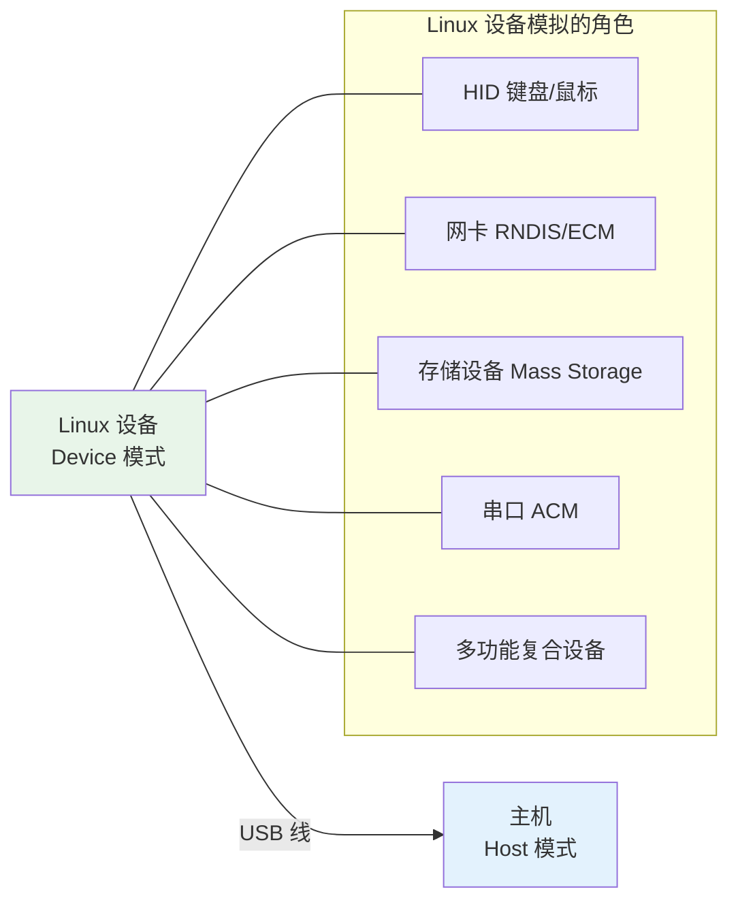
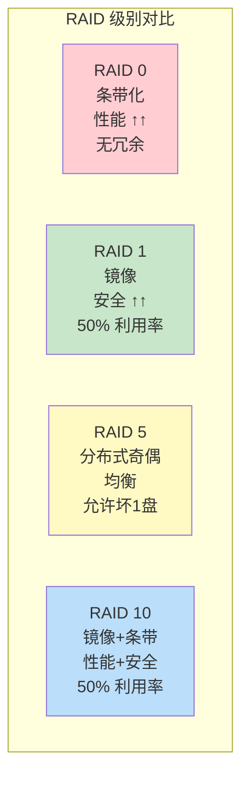
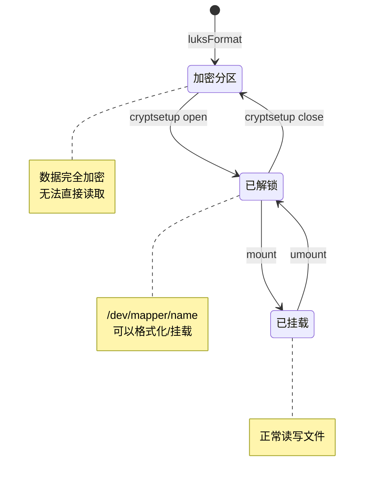
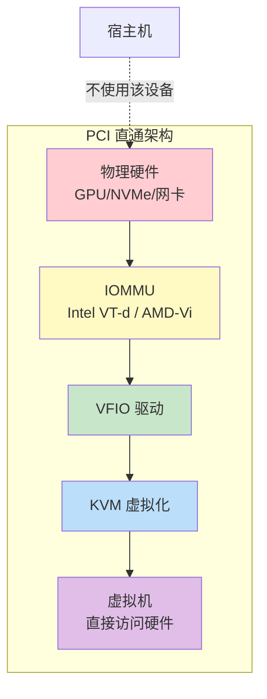

# 43 - 硬件玩法与外设进阶

> Linux 对硬件的控制能力远超其他操作系统。从 USB gadget 模拟、GPIO 操作到 PCI 直通虚拟化，本章将带你深入 Arch Linux 的硬件玩法世界，释放你手中设备的全部潜力。

---

## 43.1 USB Gadget 模式

USB Gadget 模式允许将 Linux 设备（如树莓派、开发板）模拟为各种 USB 外设，包括键盘、鼠标、网卡、存储设备等。

### 43.1.1 原理与前提



前提条件：
- 硬件必须支持 USB Device/OTG 模式（如树莓派 Zero/4、许多 ARM 开发板）
- 内核需要启用 `USB_GADGET` 和 `USB_CONFIGFS` 支持
- 需要加载 `libcomposite` 模块

```bash
# 检查内核支持
zgrep USB_GADGET /proc/config.gz
zgrep CONFIGFS /proc/config.gz

# 加载模块
sudo modprobe libcomposite
sudo modprobe usb_f_hid
sudo modprobe usb_f_mass_storage
sudo modprobe usb_f_rndis
```

### 43.1.2 ConfigFS 配置 USB Gadget

```bash
#!/bin/bash
# 模拟 USB 键盘的完整脚本

GADGET_DIR="/sys/kernel/config/usb_gadget/mykeyboard"

# 创建 gadget
sudo mkdir -p $GADGET_DIR
cd $GADGET_DIR

# 设置 USB 描述符
echo 0x1d6b | sudo tee idVendor      # Linux Foundation
echo 0x0104 | sudo tee idProduct     # Multifunction Composite Gadget
echo 0x0100 | sudo tee bcdDevice
echo 0x0200 | sudo tee bcdUSB

# 设置字符串描述
sudo mkdir -p strings/0x409
echo "fedcba9876543210" | sudo tee strings/0x409/serialnumber
echo "Arch Linux" | sudo tee strings/0x409/manufacturer
echo "Virtual Keyboard" | sudo tee strings/0x409/product

# 创建 HID 功能（键盘）
sudo mkdir -p functions/hid.usb0
echo 1 | sudo tee functions/hid.usb0/protocol        # 键盘
echo 1 | sudo tee functions/hid.usb0/subclass        # Boot Interface
echo 8 | sudo tee functions/hid.usb0/report_length

# HID 报告描述符（标准键盘）
echo -ne '\x05\x01\x09\x06\xa1\x01\x05\x07\x19\xe0\x29\xe7\x15\x00\x25\x01\x75\x01\x95\x08\x81\x02\x95\x01\x75\x08\x81\x03\x95\x05\x75\x01\x05\x08\x19\x01\x29\x05\x91\x02\x95\x01\x75\x03\x91\x03\x95\x06\x75\x08\x15\x00\x25\x65\x05\x07\x19\x00\x29\x65\x81\x00\xc0' | \
    sudo tee functions/hid.usb0/report_desc > /dev/null

# 创建配置
sudo mkdir -p configs/c.1/strings/0x409
echo "Keyboard Config" | sudo tee configs/c.1/strings/0x409/configuration
echo 250 | sudo tee configs/c.1/MaxPower

# 关联功能到配置
sudo ln -s functions/hid.usb0 configs/c.1/

# 绑定 UDC（USB Device Controller）
ls /sys/class/udc | sudo tee UDC
```

### 43.1.3 模拟网卡（RNDIS/ECM）

```bash
#!/bin/bash
# USB 网络共享（模拟为 USB 网卡）

GADGET_DIR="/sys/kernel/config/usb_gadget/usbnet"
sudo mkdir -p $GADGET_DIR
cd $GADGET_DIR

echo 0x1d6b | sudo tee idVendor
echo 0x0104 | sudo tee idProduct
echo 0x0100 | sudo tee bcdDevice
echo 0x0200 | sudo tee bcdUSB

sudo mkdir -p strings/0x409
echo "USB Network" | sudo tee strings/0x409/product

# ECM 函数（Linux/Mac 兼容）
sudo mkdir -p functions/ecm.usb0
echo "aa:bb:cc:dd:ee:f1" | sudo tee functions/ecm.usb0/host_addr
echo "aa:bb:cc:dd:ee:f2" | sudo tee functions/ecm.usb0/dev_addr

# 也可以用 RNDIS（Windows 兼容）
# sudo mkdir -p functions/rndis.usb0

sudo mkdir -p configs/c.1/strings/0x409
echo "ECM Network" | sudo tee configs/c.1/strings/0x409/configuration
sudo ln -s functions/ecm.usb0 configs/c.1/

ls /sys/class/udc | sudo tee UDC

# 启用后配置 IP
sudo ip addr add 10.0.0.1/24 dev usb0
sudo ip link set usb0 up
```

### 43.1.4 模拟 U 盘

```bash
#!/bin/bash
# 模拟 USB 存储设备

# 创建虚拟磁盘镜像
dd if=/dev/zero of=/tmp/usbdisk.img bs=1M count=128
mkfs.vfat /tmp/usbdisk.img

GADGET_DIR="/sys/kernel/config/usb_gadget/usbdisk"
sudo mkdir -p $GADGET_DIR
cd $GADGET_DIR

echo 0x1d6b | sudo tee idVendor
echo 0x0104 | sudo tee idProduct

sudo mkdir -p strings/0x409
echo "USB Mass Storage" | sudo tee strings/0x409/product

sudo mkdir -p functions/mass_storage.usb0
echo /tmp/usbdisk.img | sudo tee functions/mass_storage.usb0/lun.0/file
echo 0 | sudo tee functions/mass_storage.usb0/lun.0/removable

sudo mkdir -p configs/c.1
sudo ln -s functions/mass_storage.usb0 configs/c.1/

ls /sys/class/udc | sudo tee UDC
```

---

## 43.2 串口通信

串口是嵌入式开发和设备调试的基本通信方式。

### 43.2.1 常用串口工具

```bash
# 安装
sudo pacman -S minicom picocom screen

# === picocom（轻量推荐）===
picocom -b 115200 /dev/ttyUSB0
# 退出：Ctrl+A Ctrl+X
# 发送文件：Ctrl+A Ctrl+S

# === minicom（功能全面）===
minicom -s                    # 配置
minicom -D /dev/ttyUSB0 -b 115200
# 退出：Ctrl+A X
# 配置菜单：Ctrl+A O

# === screen（简单直接）===
screen /dev/ttyUSB0 115200
# 退出：Ctrl+A K

# === 权限设置（免 sudo）===
sudo usermod -aG uucp $USER  # Arch 上串口组是 uucp
# 重新登录生效
```

### 43.2.2 串口调试技巧

```bash
# 查看可用串口
ls /dev/tty{USB,ACM,S}*

# 查看串口设备信息
udevadm info /dev/ttyUSB0

# 使用 stty 查看/设置串口参数
stty -F /dev/ttyUSB0 -a
stty -F /dev/ttyUSB0 115200 cs8 -cstopb -parenb

# 原始数据收发（简单测试）
cat /dev/ttyUSB0 &            # 后台接收
echo "AT" > /dev/ttyUSB0      # 发送 AT 命令

# 十六进制发送
echo -ne '\x01\x02\x03' > /dev/ttyUSB0

# 记录串口数据
picocom -b 115200 --logfile serial.log /dev/ttyUSB0
```

---

## 43.3 GPIO 操作

### 43.3.1 libgpiod（现代 GPIO 接口）

```bash
# 安装
sudo pacman -S libgpiod

# 列出 GPIO 芯片
gpiodetect

# 列出某个芯片的所有引脚
gpioinfo gpiochip0

# 读取 GPIO 值
gpioget gpiochip0 17

# 设置 GPIO 输出
gpioset gpiochip0 17=1        # 高电平
gpioset gpiochip0 17=0        # 低电平

# 监控 GPIO 事件（中断）
gpiomon gpiochip0 17          # 监控引脚 17 的变化
gpiomon --rising-edge gpiochip0 17   # 只监控上升沿

# 同时操作多个引脚
gpioset gpiochip0 17=1 18=0 19=1

# LED 闪烁示例
while true; do
    gpioset gpiochip0 17=1
    sleep 0.5
    gpioset gpiochip0 17=0
    sleep 0.5
done
```

### 43.3.2 Python GPIO 控制

```python
#!/usr/bin/env python3
import gpiod
import time

chip = gpiod.Chip('gpiochip0')
line = chip.get_line(17)

line.request(consumer="blink", type=gpiod.LINE_REQ_DIR_OUT)

try:
    while True:
        line.set_value(1)
        time.sleep(0.5)
        line.set_value(0)
        time.sleep(0.5)
finally:
    line.release()
```

---

## 43.4 I2C / SPI 设备操作

### 43.4.1 I2C 工具

```bash
# 安装
sudo pacman -S i2c-tools

# 加载内核模块
sudo modprobe i2c-dev

# 列出 I2C 总线
i2cdetect -l

# 扫描总线上的设备
sudo i2cdetect -y 1           # 扫描 I2C-1 总线

# 读取设备寄存器
sudo i2cget -y 1 0x48 0x00   # 总线1, 地址0x48, 寄存器0x00

# 写入设备寄存器
sudo i2cset -y 1 0x48 0x01 0xFF

# 导出设备所有寄存器
sudo i2cdump -y 1 0x48

# 传输完整消息
sudo i2ctransfer -y 1 w2@0x48 0x00 0x01 r2  # 写2字节后读2字节
```

### 43.4.2 SPI 工具

```bash
# 加载 SPI 设备模块
sudo modprobe spidev

# 查看 SPI 设备
ls /dev/spidev*

# 使用 spi-tools（AUR）
# yay -S spi-tools
spi-config -d /dev/spidev0.0 -q    # 查询配置
spi-pipe -d /dev/spidev0.0 -s 1000000 < data.bin  # 传输数据
```

---

## 43.5 自定义 udev 规则

udev 是 Linux 的设备管理系统，通过编写规则可以自定义设备行为。

### 43.5.1 规则语法

```
# 规则文件位置
/etc/udev/rules.d/          # 本地规则（优先）
/usr/lib/udev/rules.d/      # 系统默认规则

# 命名规范：数字-描述.rules
# 如：99-my-custom.rules
```

规则格式：`匹配条件, ..., 动作, ...`

| 匹配关键字 | 说明 |
|-----------|------|
| `KERNEL` | 内核设备名 |
| `SUBSYSTEM` | 子系统（usb, block, net...） |
| `ATTR{key}` | 设备属性 |
| `ATTRS{key}` | 父设备属性 |
| `ENV{key}` | 环境变量 |
| `ACTION` | 动作（add, remove, change） |
| `DRIVER` | 驱动名 |

| 赋值关键字 | 说明 |
|-----------|------|
| `NAME` | 设备节点名 |
| `SYMLINK` | 创建符号链接 |
| `OWNER` | 所有者 |
| `GROUP` | 所属组 |
| `MODE` | 权限 |
| `RUN` | 触发脚本 |
| `TAG` | 标签 |

### 43.5.2 获取设备信息

```bash
# 查看设备属性（最重要的调试命令）
udevadm info -a /dev/ttyUSB0
udevadm info -a -n /dev/sda

# 监控设备事件
udevadm monitor
udevadm monitor --property

# 测试规则（不实际执行）
udevadm test /sys/class/tty/ttyUSB0
```

### 43.5.3 实际案例

```bash
# === 案例1：USB 串口设备固定名称 ===
# /etc/udev/rules.d/99-usb-serial.rules
SUBSYSTEM=="tty", ATTRS{idVendor}=="1a86", ATTRS{idProduct}=="7523", \
    SYMLINK+="arduino", MODE="0666"

# === 案例2：自动挂载 U 盘 ===
# /etc/udev/rules.d/99-usb-automount.rules
ACTION=="add", SUBSYSTEM=="block", KERNEL=="sd[a-z][0-9]", \
    ENV{ID_FS_TYPE}!="", \
    RUN+="/usr/bin/systemd-mount --no-block --automount=yes /dev/%k /mnt/%k"

ACTION=="remove", SUBSYSTEM=="block", KERNEL=="sd[a-z][0-9]", \
    RUN+="/usr/bin/systemd-umount /mnt/%k"

# === 案例3：游戏手柄权限 ===
# /etc/udev/rules.d/99-gamepad.rules
SUBSYSTEM=="usb", ATTRS{idVendor}=="054c", ATTRS{idProduct}=="0ce6", \
    MODE="0666", TAG+="uaccess"

# === 案例4：禁用 USB 设备自动挂起 ===
# /etc/udev/rules.d/99-usb-power.rules
ACTION=="add", SUBSYSTEM=="usb", TEST=="power/autosuspend", \
    ATTR{power/autosuspend}="-1"

# === 案例5：Android 设备 ADB 权限 ===
# /etc/udev/rules.d/51-android.rules
SUBSYSTEM=="usb", ATTR{idVendor}=="18d1", MODE="0666", GROUP="adbusers"

# 重新加载规则
sudo udevadm control --reload-rules
sudo udevadm trigger
```

---

## 43.6 RAID 配置（mdadm）

```bash
sudo pacman -S mdadm

# === 创建 RAID ===
# RAID 0（条带化，性能优先）
sudo mdadm --create /dev/md0 --level=0 --raid-devices=2 /dev/sdb /dev/sdc

# RAID 1（镜像，安全优先）
sudo mdadm --create /dev/md0 --level=1 --raid-devices=2 /dev/sdb /dev/sdc

# RAID 5（条带+奇偶校验）
sudo mdadm --create /dev/md0 --level=5 --raid-devices=3 /dev/sdb /dev/sdc /dev/sdd

# RAID 10（镜像+条带）
sudo mdadm --create /dev/md0 --level=10 --raid-devices=4 \
    /dev/sdb /dev/sdc /dev/sdd /dev/sde

# === 管理 RAID ===
# 查看状态
cat /proc/mdstat
sudo mdadm --detail /dev/md0

# 添加热备盘
sudo mdadm --add /dev/md0 /dev/sdf

# 模拟磁盘故障
sudo mdadm --fail /dev/md0 /dev/sdb
sudo mdadm --remove /dev/md0 /dev/sdb

# 替换故障盘
sudo mdadm --add /dev/md0 /dev/sdg

# 保存配置
sudo mdadm --detail --scan >> /etc/mdadm.conf
sudo mkinitcpio -P   # 重新生成 initramfs

# === 删除 RAID ===
sudo mdadm --stop /dev/md0
sudo mdadm --zero-superblock /dev/sdb /dev/sdc
```



---

## 43.7 NVMe 管理（nvme-cli）

```bash
sudo pacman -S nvme-cli

# 列出 NVMe 设备
sudo nvme list

# 查看详细信息
sudo nvme id-ctrl /dev/nvme0
sudo nvme id-ns /dev/nvme0n1

# SMART 健康信息
sudo nvme smart-log /dev/nvme0

# 温度信息
sudo nvme smart-log /dev/nvme0 | grep temperature

# 错误日志
sudo nvme error-log /dev/nvme0

# 固件更新
sudo nvme fw-download /dev/nvme0 --fw=firmware.bin
sudo nvme fw-activate /dev/nvme0 --slot=1 --action=1

# 命名空间管理
sudo nvme list-ns /dev/nvme0
sudo nvme create-ns /dev/nvme0 --nsze=1000000 --ncap=1000000 --block-size=4096
sudo nvme attach-ns /dev/nvme0 --namespace-id=2 --controllers=0x41

# 安全擦除
sudo nvme format /dev/nvme0n1 --ses=1

# 性能测试（读取带宽）
sudo nvme read /dev/nvme0n1 --data-size=4096 --data=/dev/null

# 监控温度（持续）
watch -n 1 'sudo nvme smart-log /dev/nvme0 | grep temperature'
```

---

## 43.8 硬盘加密（LUKS 实战）

```bash
# 安装
sudo pacman -S cryptsetup

# === 创建加密分区 ===
# 初始化 LUKS（会清除分区数据！）
sudo cryptsetup luksFormat /dev/sdb1

# 使用更强的参数
sudo cryptsetup luksFormat --type luks2 \
    --cipher aes-xts-plain64 \
    --key-size 512 \
    --hash sha512 \
    --iter-time 5000 \
    /dev/sdb1

# === 打开/使用 ===
sudo cryptsetup open /dev/sdb1 mydata
# 现在 /dev/mapper/mydata 可以使用了

# 创建文件系统
sudo mkfs.ext4 /dev/mapper/mydata
sudo mount /dev/mapper/mydata /mnt/secure

# === 关闭 ===
sudo umount /mnt/secure
sudo cryptsetup close mydata

# === 密钥管理 ===
# 添加备用密钥（最多8个密钥槽）
sudo cryptsetup luksAddKey /dev/sdb1

# 使用密钥文件
dd if=/dev/urandom of=/root/keyfile bs=4096 count=1
chmod 600 /root/keyfile
sudo cryptsetup luksAddKey /dev/sdb1 /root/keyfile

# 打开时使用密钥文件
sudo cryptsetup open --key-file /root/keyfile /dev/sdb1 mydata

# 删除密钥槽
sudo cryptsetup luksRemoveKey /dev/sdb1

# 查看 LUKS 头信息
sudo cryptsetup luksDump /dev/sdb1

# 备份 LUKS 头（重要！）
sudo cryptsetup luksHeaderBackup /dev/sdb1 --header-backup-file header.bak

# === 开机自动解密 ===
# /etc/crypttab
# mydata    /dev/sdb1    /root/keyfile    luks
```



---

## 43.9 键盘自定义

### 43.9.1 keyd — 键位映射守护进程

```bash
sudo pacman -S keyd

# 配置文件 /etc/keyd/default.conf
sudo tee /etc/keyd/default.conf << 'EOF'
[ids]
*

[main]
# CapsLock 映射为 Escape（单击）/ Ctrl（长按）
capslock = overload(control, esc)

# 右 Alt 作为层切换键
rightalt = layer(nav)

[nav]
# 右 Alt + HJKL = 方向键（Vim 风格）
h = left
j = down
k = up
l = right

# 右 Alt + U/D = Page Up/Down
u = pageup
d = pagedown
EOF

# 启用服务
sudo systemctl enable --now keyd
```

### 43.9.2 kanata — 高级键盘定制

```bash
# 从 AUR 安装
# yay -S kanata

# 配置示例（~/.config/kanata/config.kbd）
cat > ~/.config/kanata/config.kbd << 'EOF'
(defsrc
  caps a s d f j k l ;
)

(deflayer default
  @cap a s d f j k l ;
)

(deflayer nav
  _    _    _    _    _    left down up   right
)

(defalias
  cap (tap-hold 200 200 esc lctl)
  nav (layer-toggle nav)
)
EOF

# 运行
sudo kanata -c ~/.config/kanata/config.kbd
```

### 43.9.3 XKB 配置

```bash
# 查看当前 XKB 配置
setxkbmap -query

# 交换 CapsLock 和 Escape
setxkbmap -option caps:escape

# CapsLock 作为额外 Ctrl
setxkbmap -option ctrl:nocaps

# 清除所有选项
setxkbmap -option ''

# 持久化配置（Xorg）
# /etc/X11/xorg.conf.d/00-keyboard.conf
cat << 'EOF'
Section "InputClass"
    Identifier "keyboard"
    MatchIsKeyboard "on"
    Option "XkbLayout" "us"
    Option "XkbOptions" "caps:escape,compose:ralt"
EndSection
EOF

# Wayland (sway) 配置
# input "type:keyboard" {
#     xkb_options caps:escape
# }
```

---

## 43.10 显示器管理

### 43.10.1 wlr-randr / kanshi

```bash
# Wayland 环境
sudo pacman -S wlr-randr kanshi

# 查看显示器
wlr-randr

# 设置分辨率和刷新率
wlr-randr --output DP-1 --mode 2560x1440@144Hz
wlr-randr --output HDMI-A-1 --mode 1920x1080@60Hz

# 位置调整
wlr-randr --output DP-1 --pos 0,0
wlr-randr --output HDMI-A-1 --pos 2560,0

# 缩放
wlr-randr --output DP-1 --scale 1.5

# 旋转
wlr-randr --output DP-1 --transform 90

# 禁用显示器
wlr-randr --output HDMI-A-1 --off

# === kanshi 自动配置 ===
# ~/.config/kanshi/config
cat > ~/.config/kanshi/config << 'EOF'
profile docked {
    output "Dell Inc. U2720Q" mode 3840x2160@60Hz position 0,0 scale 1.5
    output eDP-1 disable
}

profile undocked {
    output eDP-1 mode 2560x1600@120Hz position 0,0 scale 1.25
}

profile presentation {
    output eDP-1 mode 2560x1600@120Hz position 0,0
    output "Unknown HDMI" mode 1920x1080@60Hz position 2560,0
}
EOF

# 启动 kanshi（通常随 sway 启动）
kanshi &
```

---

## 43.11 背光控制

```bash
sudo pacman -S brightnessctl light

# === brightnessctl ===
brightnessctl                 # 查看当前亮度
brightnessctl set 50%         # 设置为 50%
brightnessctl set +10%        # 增加 10%
brightnessctl set 10%-        # 减少 10%
brightnessctl set 255         # 设置绝对值
brightnessctl -l              # 列出所有设备

# 键盘背光
brightnessctl -d '*kbd*' set 2

# === light ===
light -G                      # 获取当前亮度
light -S 50                   # 设置 50%
light -A 10                   # 增加 10%
light -U 10                   # 减少 10%
light -N 5                    # 设置最小亮度 5%（防止全黑）

# Sway 快捷键配置示例
# bindsym XF86MonBrightnessUp exec brightnessctl set +5%
# bindsym XF86MonBrightnessDown exec brightnessctl set 5%-
```

---

## 43.12 电池与电源优化

### 43.12.1 TLP

```bash
sudo pacman -S tlp tlp-rdw

# 启用
sudo systemctl enable --now tlp
sudo systemctl enable --now NetworkManager-dispatcher  # for tlp-rdw

# 查看状态
sudo tlp-stat -s
sudo tlp-stat -b    # 电池信息
sudo tlp-stat -p    # CPU 信息

# 手动切换模式
sudo tlp bat         # 切换到电池模式
sudo tlp ac          # 切换到交流电模式

# 配置文件 /etc/tlp.conf 关键选项
# CPU_SCALING_GOVERNOR_ON_AC=performance
# CPU_SCALING_GOVERNOR_ON_BAT=powersave
# CPU_ENERGY_PERF_POLICY_ON_BAT=power
# STOP_CHARGE_THRESH_BAT0=80    # ThinkPad 电池充电阈值
```

### 43.12.2 powertop

```bash
sudo pacman -S powertop

# 交互式界面
sudo powertop

# 生成 HTML 报告
sudo powertop --html=power_report.html

# 自动调优（一键省电）
sudo powertop --auto-tune

# 开机自动调优
# 创建 systemd 服务
sudo tee /etc/systemd/system/powertop.service << 'EOF'
[Unit]
Description=Powertop auto-tune

[Service]
Type=oneshot
ExecStart=/usr/bin/powertop --auto-tune

[Install]
WantedBy=multi-user.target
EOF
sudo systemctl enable powertop
```

### 43.12.3 auto-cpufreq

```bash
# 从 AUR 安装
# yay -S auto-cpufreq

# 监控模式（查看推荐）
sudo auto-cpufreq --monitor

# 临时启用
sudo auto-cpufreq --live

# 安装为服务
sudo auto-cpufreq --install
```

---

## 43.13 Thunderbolt 安全策略（bolt）

```bash
sudo pacman -S bolt

# 列出 Thunderbolt 设备
boltctl list

# 查看设备详情
boltctl info <device-uuid>

# 授权设备
boltctl authorize <device-uuid>

# 永久信任设备（开机自动授权）
boltctl enroll <device-uuid>

# 撤销信任
boltctl forget <device-uuid>

# 查看/设置安全级别
boltctl domains

# 安全级别：
# none      - 无安全限制
# dponly    - 仅 DisplayPort
# user      - 需要用户授权（推荐）
# secure    - 安全连接（需要密钥交换）
```

---

## 43.14 嵌入式 Linux 入门

### 43.14.1 交叉编译

```bash
# 安装交叉编译工具链
sudo pacman -S arm-none-eabi-gcc arm-none-eabi-binutils arm-none-eabi-newlib
# 或 Linux 用户空间目标
sudo pacman -S aarch64-linux-gnu-gcc

# 交叉编译示例
aarch64-linux-gnu-gcc -o hello hello.c

# 使用 CMake 交叉编译
cat > toolchain-aarch64.cmake << 'EOF'
set(CMAKE_SYSTEM_NAME Linux)
set(CMAKE_SYSTEM_PROCESSOR aarch64)
set(CMAKE_C_COMPILER aarch64-linux-gnu-gcc)
set(CMAKE_CXX_COMPILER aarch64-linux-gnu-g++)
set(CMAKE_FIND_ROOT_PATH /usr/aarch64-linux-gnu)
set(CMAKE_FIND_ROOT_PATH_MODE_PROGRAM NEVER)
set(CMAKE_FIND_ROOT_PATH_MODE_LIBRARY ONLY)
set(CMAKE_FIND_ROOT_PATH_MODE_INCLUDE ONLY)
EOF

cmake -B build -DCMAKE_TOOLCHAIN_FILE=toolchain-aarch64.cmake
cmake --build build
```

### 43.14.2 Buildroot

```bash
# 下载 Buildroot
git clone https://github.com/buildroot/buildroot.git
cd buildroot

# 使用默认配置
make qemu_aarch64_virt_defconfig

# 自定义配置
make menuconfig

# 构建（会下载所有源码并编译整个系统）
make -j$(nproc)

# 输出在 output/images/
# rootfs.ext2, Image（内核）, start-qemu.sh
```

---

## 43.15 QEMU/KVM 硬件直通（PCI Passthrough / VFIO）

PCI 直通允许将物理 PCIe 设备（如 GPU）直接分配给虚拟机，获得接近原生性能。

### 43.15.1 前提检查

```bash
# 检查 IOMMU 支持
dmesg | grep -i iommu

# 内核启动参数（/etc/default/grub 或 直接修改引导配置）
# Intel: intel_iommu=on iommu=pt
# AMD: amd_iommu=on iommu=pt

# 查看 IOMMU 分组
#!/bin/bash
for g in $(find /sys/kernel/iommu_groups/* -maxdepth 0 -type d | sort -V); do
    echo "IOMMU Group ${g##*/}:"
    for d in $g/devices/*; do
        echo -e "\t$(lspci -nns ${d##*/})"
    done
done
```

### 43.15.2 VFIO 配置

```bash
# 1. 确定要直通的设备 ID
lspci -nn | grep -i nvidia
# 01:00.0 VGA compatible controller [0300]: NVIDIA ... [10de:2684]
# 01:00.1 Audio device [0403]: NVIDIA ... [10de:22ba]

# 2. 绑定 VFIO 驱动（/etc/modprobe.d/vfio.conf）
sudo tee /etc/modprobe.d/vfio.conf << 'EOF'
options vfio-pci ids=10de:2684,10de:22ba
softdep nvidia pre: vfio-pci
EOF

# 3. 加载 VFIO 模块（/etc/mkinitcpio.conf）
# MODULES=(vfio_pci vfio vfio_iommu_type1)
sudo mkinitcpio -P

# 4. 重启后验证
lspci -k -s 01:00.0
# Kernel driver in use: vfio-pci  ← 成功

# 5. QEMU 启动命令
qemu-system-x86_64 \
    -enable-kvm \
    -m 16G \
    -cpu host,kvm=off \
    -smp 8,sockets=1,cores=4,threads=2 \
    -device vfio-pci,host=01:00.0,multifunction=on \
    -device vfio-pci,host=01:00.1 \
    -drive file=/vm/win11.qcow2,format=qcow2,if=virtio \
    -net nic,model=virtio -net user
```

### 43.15.3 使用 libvirt/virt-manager

```bash
sudo pacman -S qemu-full libvirt virt-manager dnsmasq

# 启用服务
sudo systemctl enable --now libvirtd

# 将用户加入 libvirt 组
sudo usermod -aG libvirt $USER

# 使用图形界面管理
virt-manager

# 在虚拟机 XML 中添加 PCI 设备直通
# <hostdev mode='subsystem' type='pci' managed='yes'>
#   <source>
#     <address domain='0x0000' bus='0x01' slot='0x00' function='0x0'/>
#   </source>
# </hostdev>
```



---

## 43.16 本章测验

> [!example] 📝 自测题目

> [!question]- 选择题 1：USB Gadget 模式的配置通过什么文件系统进行？
> - A. sysfs
> - B. procfs
> - C. configfs
> - D. devfs
>
> > [!success]- 点击查看答案
> > **C**
> > USB Gadget 通过 configfs（`/sys/kernel/config/usb_gadget/`）进行配置，需要加载 `libcomposite` 内核模块。configfs 提供了一种用户空间创建和管理内核对象的机制。

> [!question]- 选择题 2：在 Arch Linux 中，要免 sudo 使用串口设备需要将用户加入哪个组？
> - A. dialout
> - B. serial
> - C. uucp
> - D. tty
>
> > [!success]- 点击查看答案
> > **C**
> > 在 Arch Linux 中，串口设备的组是 `uucp`（与 Debian/Ubuntu 使用的 `dialout` 不同）。使用 `sudo usermod -aG uucp $USER` 并重新登录即可。

> [!question]- 选择题 3：libgpiod 中用于监控 GPIO 事件（中断）的命令是？
> - A. gpiowatch
> - B. gpiomon
> - C. gpioevt
> - D. gpiolisten
>
> > [!success]- 点击查看答案
> > **B**
> > `gpiomon` 用于监控 GPIO 引脚的电平变化事件，支持 `--rising-edge`、`--falling-edge` 等选项过滤特定事件类型。

> [!question]- 选择题 4：udev 规则文件应放在哪个目录以覆盖系统默认规则？
> - A. /usr/lib/udev/rules.d/
> - B. /etc/udev/rules.d/
> - C. /var/udev/rules.d/
> - D. /run/udev/rules.d/
>
> > [!success]- 点击查看答案
> > **B**
> > `/etc/udev/rules.d/` 是本地自定义规则目录，优先级高于 `/usr/lib/udev/rules.d/`（系统默认规则）。相同编号的规则，`/etc` 下的会覆盖 `/usr/lib` 下的。

> [!question]- 选择题 5：LUKS2 加密分区最多支持多少个密钥槽？
> - A. 4
> - B. 8
> - C. 16
> - D. 32
>
> > [!success]- 点击查看答案
> > **D**
> > LUKS2 支持最多 32 个密钥槽（LUKS1 是 8 个）。每个密钥槽可以存储不同的密码或密钥文件，任何一个都能解锁分区。

> [!question]- 判断题 6：PCI 直通（Passthrough）需要 CPU 支持 IOMMU 技术 ✓/✗
> - A. ✓ 正确
> - B. ✗ 错误
>
> > [!success]- 点击查看答案
> > **A. ✓ 正确**
> > PCI 直通需要 IOMMU 支持：Intel 称之为 VT-d，AMD 称之为 AMD-Vi。需要在 BIOS 中启用，并在内核启动参数中添加 `intel_iommu=on` 或 `amd_iommu=on`。

> [!question]- 选择题 7：RAID 5 最少需要多少块磁盘？
> - A. 2
> - B. 3
> - C. 4
> - D. 5
>
> > [!success]- 点击查看答案
> > **B**
> > RAID 5 使用分布式奇偶校验，最少需要 3 块磁盘。其中一块磁盘的容量用于存储奇偶校验数据（分散在所有磁盘上），允许任意一块磁盘故障。

> [!question]- 判断题 8：keyd 可以实现 CapsLock 单击为 Escape、长按为 Ctrl 的功能 ✓/✗
> - A. ✓ 正确
> - B. ✗ 错误
>
> > [!success]- 点击查看答案
> > **A. ✓ 正确**
> > keyd 支持 `overload` 功能，配置 `capslock = overload(control, esc)` 即可实现：短按 CapsLock 发送 Escape，长按作为 Ctrl 修饰键。这是机械键盘爱好者最常用的映射之一。

> [!question]- 选择题 9：使用 nvme-cli 查看 NVMe 固态硬盘健康状态的命令是？
> - A. `nvme health /dev/nvme0`
> - B. `nvme smart-log /dev/nvme0`
> - C. `nvme status /dev/nvme0`
> - D. `nvme check /dev/nvme0`
>
> > [!success]- 点击查看答案
> > **B**
> > `nvme smart-log /dev/nvme0` 显示 NVMe 设备的 SMART 健康信息，包括温度、已用寿命百分比、数据读写量、电源循环次数等关键指标。

> [!question]- 判断题 10：Thunderbolt 设备在 Linux 下默认无需授权即可使用 ✓/✗
> - A. ✓ 正确
> - B. ✗ 错误
>
> > [!success]- 点击查看答案
> > **B. ✗ 错误**
> > 出于安全考虑（DMA 攻击防护），Thunderbolt 设备默认需要用户授权。可以通过 `boltctl authorize` 临时授权或 `boltctl enroll` 永久信任设备。安全级别由固件/BIOS 设置决定。
