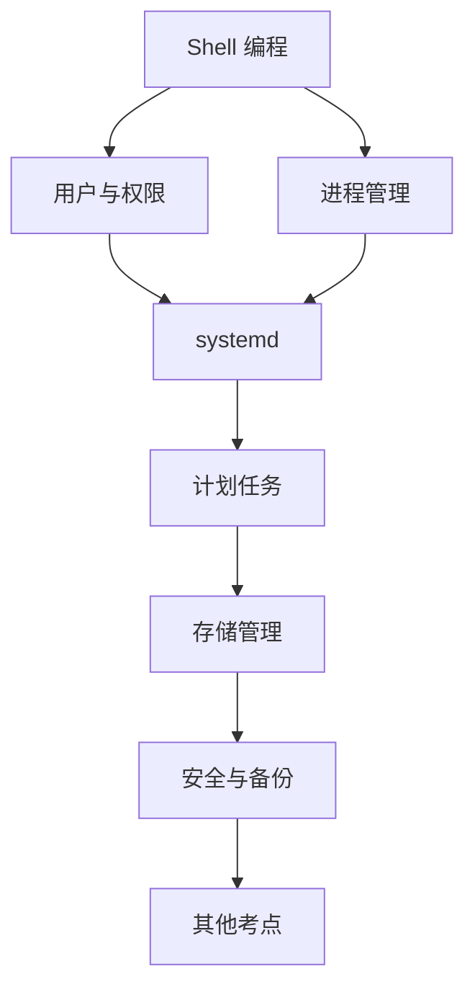
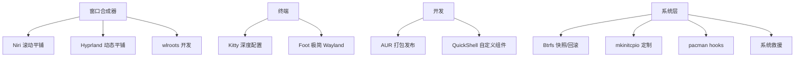

# Linux 免修 + 高级进阶教程

> 基于 Arch Linux，从课程免修到深度系统定制，一站式学习。

---

## 第一部分：免修基础

| 模块 | 内容 | 重要性 |
|------|------|--------|
| [[01-Shell编程基础]] | 变量、条件、循环、函数、文本处理三剑客 | ★★★★★ |
| [[02-用户与权限管理]] | 用户管理、文件权限、SUID/SGID、ACL | ★★★★ |
| [[03-进程管理]] | 前后台进程、信号、优先级 | ★★★★ |
| [[04-systemd服务管理]] | unit 文件、systemctl、journalctl | ★★★ |
| [[05-软件包管理]] | pacman 高级用法、PKGBUILD、源码编译 | ★★★ |
| [[06-计划任务]] | cron、systemd timer | ★★ |
| [[07-存储管理进阶]] | 分区、挂载、LVM、磁盘配额 | ★★★ |
| [[08-安全与备份]] | 防火墙、SSH、rsync、tar | ★★★ |
| [[09-其他考点]] | 环境变量、链接、inode、服务器搭建 | ★★ |

---

## 第二部分：Arch 高级玩法

| 模块 | 内容 | 关键词 |
|------|------|--------|
| [[10-Niri窗口合成器配置]] | KDL 语法、弹簧动画、脚本绑定、壁纸切换、截图音效、强制杀窗 | 滚动合成器 |
| [[11-Hyprland配置详解]] | 动画系统、窗口规则、hyprctl、插件开发、submap | 动态平铺 |
| [[12-Wayland协议与合成器开发]] | wlroots、Smithay、协议 XML、tinywl、DRM 渲染 | 自己写合成器 |
| [[13-终端模拟器高级配置(kitty+foot)]] | Kitty 图形协议、Kitten 开发、Foot 服务器模式、键盘协议 | GPU 终端 |
| [[14-AUR打包与上传完整教程]] | PKGBUILD、.SRCINFO、chroot 测试、Git 推送、CI/CD | 软件发布 |
| [[15-QuickShell开发指南]] | 属性绑定、Layer Shell、面板/启动器/通知开发、动画 | 自定义 Shell |
| [[16-Btrfs高级玩法]] | 子卷布局、快照/回滚、send/receive 备份、压缩、scrub/balance | 文件系统 |
| [[17-ArchLinux深度玩法]] | mkinitcpio 定制、自定义内核、pacman hooks、系统救援、性能优化 | 系统工程 |

---

## 学习路线

### 路线 A：免修（4 周）



### 路线 B：高级玩家（按兴趣选读）



---

## 考试常见题型

- **判断题**：概念理解（指针类比、权限位、进程状态）
- **选择题**：命令功能、配置文件路径、权限计算
- **填空题**：命令参数、配置文件语法
- **操作题**：Shell 脚本编写、服务配置、用户管理
- **简答题**：原理解释（inode、信号、systemd 启动流程）

---

## 环境准备

```bash
# === 基础工具 ===
sudo pacman -S --needed base-devel git vim
sudo pacman -S --needed man-db man-pages
sudo pacman -S --needed acl cronie rsync

# === 高级工具 ===
sudo pacman -S --needed kitty foot
sudo pacman -S --needed niri hyprland
sudo pacman -S --needed quickshell wlroots wayland-protocols
sudo pacman -S --needed rust cargo go python
sudo pacman -S --needed devtools namcap  # AUR 打包
sudo pacman -S --needed btrfs-progs snapper btrfs-assistant  # Btrfs
sudo pacman -S --needed reflector ufw  # 系统工具
```
