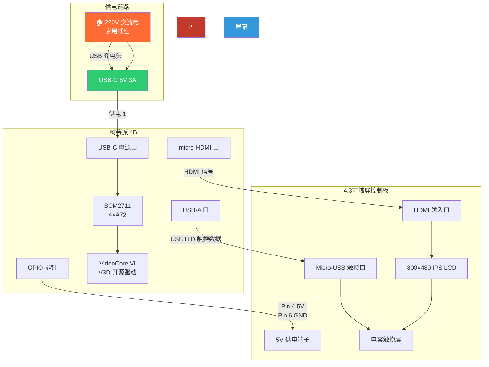
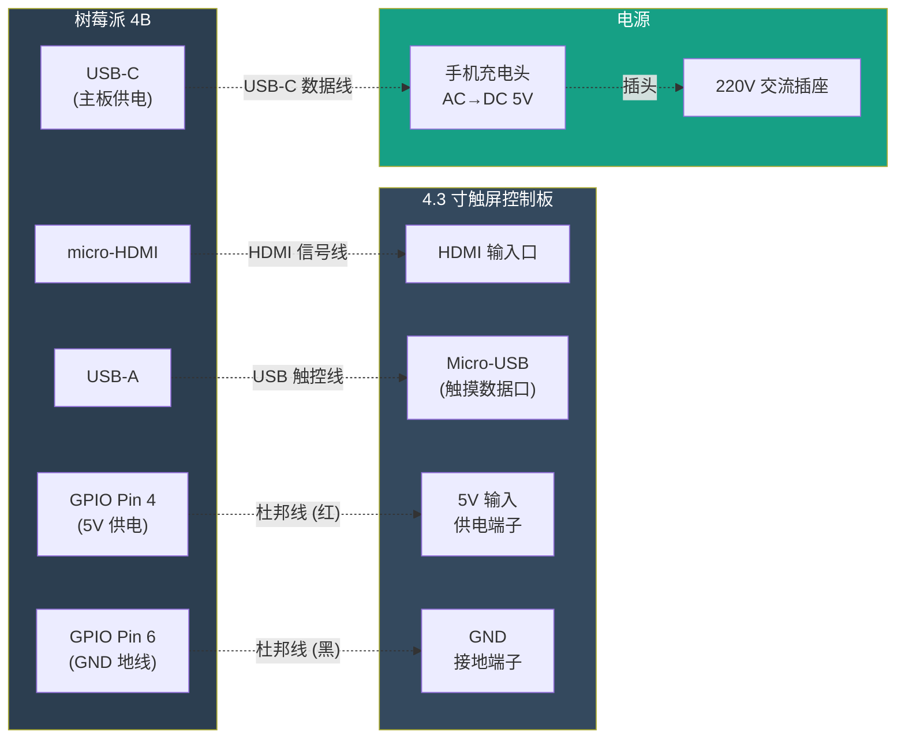
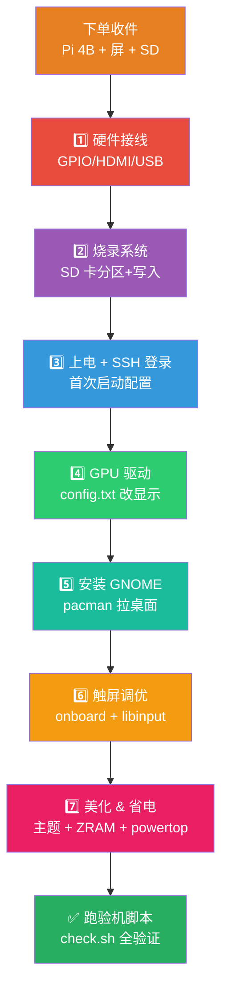
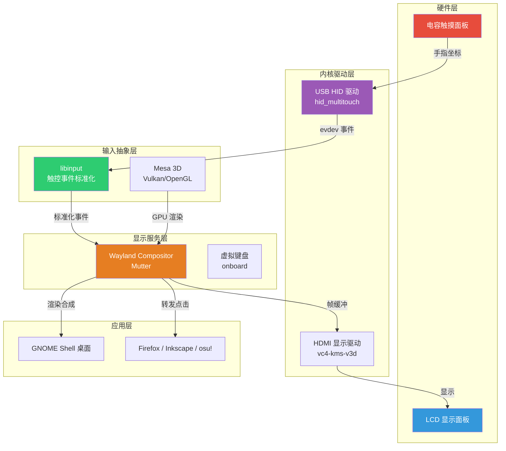
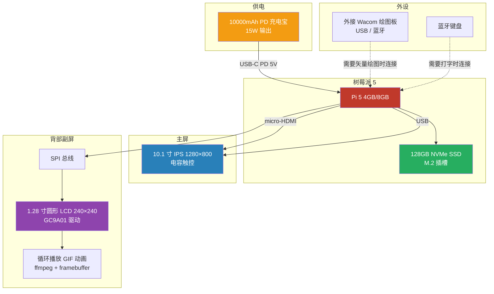

---
tags:
  - diy
  - 树莓派
  - archlinux
  - gnome
  - 触屏
created: 2026-06-12
---

# DIY 触屏平板试验版 — Arch Linux + GNOME 全流程指南

## 物品清单

| 部件 | 型号 / 规格 | 预计价格 | 购买渠道 |
|------|-----------|---------|---------|
| SBC 主板 | Raspberry Pi 4B 2GB 二手 | ¥160-200 | 闲鱼 |
| 显示屏 | 4.3 寸 HDMI IPS 800×480 + 电容触控 | ¥80-110 | 淘宝 |
| MicroSD 卡 | SanDisk Ultra 32GB A1 | ¥22 | 京东 / 淘宝 |
| 电源 | 任意 5V 2.5A 手机充电头 + USB-A 转 USB-C 数据线 | ¥0（用家里现成的） | — |
| 散热 | 小铝散热片 | ¥4 | 淘宝 |
| **总预算** | | **¥266-336** | |

---

## 1. 硬件接线

### 1.0 总体架构



### 1.1 详细接线对照



### 1.2 GPIO 供电接脚位置

| 功能 | GPIO 编号 | 物理 Pin | 线色 |
|------|----------|----------|------|
| 5V 输出 | — | Pin 4 | 🔴 红 |
| GND | — | Pin 6 | ⚫ 黑 |

> [!warning] GPIO 接线注意
> GPIO Pin 4/6 在排针的同一列、紧挨着（外列上端第 2、3 个）。**务必确认 Pin 编号再接线，接错 5V/GND 会烧屏。**

> [!note] 接线提示
> - 4.3 寸屏功耗约 2-3W，建议从 GPIO 取 5V 供电（Pin 4/6），不要和 Pi 共用同一个 USB 口
> - Pi 4B 的 micro-HDMI 口比较挑线，买屏时确认商家附带 micro-HDMI 转 HDMI 线，或自备
> - 如屏幕触控不走 USB 而走 I²C（少见），需要额外接 SDA/SCL

---

## 2. 安装总览流程



---

## 3. 烧录 Arch Linux ARM

### 3.1 下载镜像

```bash
# 在另一台电脑上操作，下载 aarch64 镜像
curl -LO http://os.archlinuxarm.org/os/ArchLinuxARM-rpi-aarch64-latest.tar.gz
```

### 3.2 分区 MicroSD

```bash
DEV=/dev/sdX          # 替换为你的 SD 卡设备名（lsblk 确认）

# 清除分区表
sudo sgdisk --zap-all $DEV

# 创建分区: 200M fat16 启动分区 + 剩余 ext4 根分区
sudo parted -s $DEV mklabel msdos
sudo parted -s $DEV mkpart primary fat16 1MiB 201MiB
sudo parted -s $DEV mkpart primary ext4 201MiB 100%
sudo parted -s $DEV set 1 boot on

# 格式化
sudo mkfs.vfat -F16 ${DEV}1
sudo mkfs.ext4 -F ${DEV}2
```

### 3.3 写入系统

```bash
ROOTFS=/mnt/root
BOOTFS=/mnt/boot

sudo mount ${DEV}2 $ROOTFS
sudo mkdir -p $BOOTFS
sudo mount ${DEV}1 $BOOTFS

# 解压 Arch ARM 镜像
sudo bsdtar -xpf ArchLinuxARM-rpi-aarch64-latest.tar.gz -C $ROOTFS

# 移动 boot 文件
sudo mv $ROOTFS/boot/* $BOOTFS/

sync
sudo umount $BOOTFS $ROOTFS
```

---

## 4. 首次启动与基础配置

### 4.1 启动

将 SD 卡插入 Pi 4B，插上屏幕和键盘（USB），上电。

> **首次开机可能黑屏 **— 4.3" 屏幕分辨率非标准，先接大显示器或 SSH 配置。

### 4.2 SSH 登录（推荐）

```bash
# Pi 默认通过 DHCP 获取 IP，路由器后台查 IP 或用:
ssh alarm@<树莓派IP>

# 默认账号密码
# 用户名: alarm
# 密码:   alarm
# root 密码: root
```

### 4.3 初始化

```bash
# 切换到 root
su -

# 初始化 pacman 密钥环
pacman-key --init
pacman-key --populate archlinuxarm

# 更新系统
pacman -Syu --noconfirm

# 设置时区
timedatectl set-timezone Asia/Shanghai

# 设置 hostname
echo "diytablet" > /etc/hostname
echo "127.0.1.1 diytablet.localdomain diytablet" >> /etc/hosts

# 创建你自己的用户
useradd -m -G wheel -s /bin/bash <你的用户名>
passwd <你的用户名>

# 安装 sudo
pacman -S --noconfirm sudo
echo "%wheel ALL=(ALL: ALL) ALL" >> /etc/sudoers.d/wheel

# 安装 yay（AUR 助手）
pacman -S --noconfirm git base-devel
# 切换到你的用户登录
su - <你的用户名>
git clone https://aur.archlinux.org/yay-bin.git /tmp/yay-bin
cd /tmp/yay-bin && makepkg -si --noconfirm
```

---

## 5. GPU 与显示配置

### 5.1 强制 HDMI 输出 + GPU 加速

编辑 `/boot/config.txt`:

```ini
# GPU 加速
dtoverlay=vc4-kms-v3d
gpu_mem=64

# 强制 HDMI 输出（4.3 寸屏需要）
hdmi_force_hotplug=1
hdmi_group=2
hdmi_mode=87

# 4.3 寸屏固定 800x480
hdmi_cvt=800 480 60 6 0 0 0
framebuffer_width=800
framebuffer_height=480

# 关闭省电灰屏
consoleblank=0

# 提高一点 GPU 频率（可选，小屏的桌面渲染很轻）
# over_voltage=2
# arm_freq=1800

# 关闭不用的接口省电
dtparam=audio=on
disable_overscan=1

# SPI 开启（后期给副屏用）
dtparam=spi=on
```

> **解释:**
> - `vc4-kms-v3d`: 开源 Vulkan/OpenGL 驱动，GNOME 动画和 osu!lazer 全靠它
> - `hdmi_cvt`: 生成 800x480 的 CVT 模式，4.3 寸屏没有 EDID，需要手动注入分辨率
> - `gpu_mem=64`: GNOME 够用，多了浪费 2GB 内存

---

## 6. 安装 GNOME

### 6.0 软件栈 — 触控数据如何到达桌面



安装 GNOME 桌面环境:

```bash
sudo pacman -S --noconfirm \
  gnome \
  gnome-tweaks \
  networkmanager \
  xdg-user-dirs

sudo systemctl enable gdm
sudo systemctl enable NetworkManager
sudo systemctl start NetworkManager
```

### 6.1 第一次进桌面

```bash
sudo reboot
```

启动后 GDM 应该出现在屏幕上。用触摸屏登录。

### 6.2 卸载不需要的 GNOME 软件（省空间、省内存）

```bash
sudo pacman -Rns --noconfirm \
  gnome-contacts \
  gnome-maps \
  gnome-weather \
  gnome-clocks \
  totem \
  epiphany \
  gnome-calendar \
  gnome-boxes \
  evolution-data-server
```

---

## 7. 触屏调优

### 7.1 确认触屏被识别

```bash
sudo pacman -S --noconfirm libinput
sudo libinput list-devices | grep -A 20 -i touch
```

如果看到 "Touchscreen" 设备，说明已识别。

### 7.2 GNOME 触屏设置

```bash
# 自动旋转（需要传感器数据，试验版先跳过，固定横屏）
# 后期配 iio-sensor-proxy

# 在 GNOME 设置里手动:
# Settings → Accessibility → Typing
# 关闭 "Screen Keyboard"（中文输入后面单独配）
```

### 7.3 安装更好的屏幕键盘

GNOME 自带的 OSK 中文支持很差。安装 onboard:

```bash
sudo pacman -S --noconfirm onboard
# 设置开机自启
mkdir -p ~/.config/autostart
cat > ~/.config/autostart/onboard.desktop << EOF
[Desktop Entry]
Type=Application
Name=Onboard
Exec=onboard
X-GNOME-Autostart-enabled=true
NoDisplay=true
EOF
```

### 7.4 ZRAM 内存压缩（2GB 救急措施）

```bash
sudo pacman -S --noconfirm zram-generator

sudo tee /etc/systemd/zram-generator.conf << EOF
[zram0]
zram-size = 512
compression-algorithm = zstd
EOF

sudo systemctl daemon-reload
sudo systemctl start systemd-zram-setup@zram0.service
```

---

## 8. 高性能配置

### 8.1 安装 Firefox（触屏优化版）

```bash
sudo pacman -S --noconfirm firefox
# 在 about:config 里设置:
# dom.w3c_touch_events.enabled = 1
```

### 8.2 美化 GNOME 桌面

```bash
# 安装扩展
sudo pacman -S --noconfirm gnome-shell-extensions

# 安装图标和主题
yay -S --noconfirm orchis-theme-git tela-icon-theme-git

# 装好后在 gnome-tweaks 里切换主题
# 或在命令行设置:
gsettings set org.gnome.desktop.interface gtk-theme "Orchis-Dark"
gsettings set org.gnome.desktop.interface icon-theme "Tela-dark"
gsettings set org.gnome.shell.extensions.user-theme name "Orchis-Dark"
```

### 8.3 省电调优

```bash
sudo pacman -S --noconfirm powertop

# 安装 systemd 自动优化服务
sudo tee /etc/systemd/system/powertop.service << EOF
[Unit]
Description=PowerTOP auto tune

[Service]
Type=oneshot
ExecStart=/usr/sbin/powertop --auto-tune

[Install]
WantedBy=multi-user.target
EOF

sudo systemctl enable powertop
```

---

## 9. 验机脚本

装完后跑这个脚本验证一切正常:

```bash
#!/bin/bash
echo "=== 系统信息 ==="
uname -a
cat /etc/os-release | head -5

echo -e "\n=== GPU 状态 ==="
dmesg | grep -i vc4 | head -5
glxinfo | grep -i "renderer" 2>/dev/null || echo "(需安装 mesa-utils)"

echo -e "\n=== 触屏设备 ==="
sudo libinput list-devices 2>/dev/null | grep -A 5 -i touch || echo "未检测到触屏"

echo -e "\n=== 内存 ==="
free -h
zramctl 2>/dev/null || echo "(zram 未启用)"

echo -e "\n=== 存储 ==="
df -h /
echo

echo "=== 所有验证完成 ==="
```

保存为 `~/check.sh`，`chmod +x ~/check.sh`，然后 `./check.sh`。

---

## 10. 从试验版升级到正式版

### 10.0 正式版目标架构



### 10.1 硬件对比

| 部件 | 试验版 | 正式版 |
|------|--------|--------|
| SBC | Pi 4B 2GB | Pi 5 4GB / 8GB |
| 主屏 | 4.3" 800×480 | 10.1" 1280×800 + 电容触控 |
| 存储 | 32GB SD | 128GB NVMe SSD（Pi 5 M.2 槽） |
| 副屏 | — | 1.28" 圆形 LCD (GC9A01, SPI) |
| 电源 | 充电头 | 10000mAh PD 充电宝 |
| 外壳 | 裸奔 | 3D 打印 PETG |

软件配置 **完全复用**，SD 卡拔过去直接启动。

---

## 11. 故障排除

### 黑屏

1. 确认 HDMI 线兼容（Pi 4B micro-HDMI ≠ 普通 micro-HDMI）
2. 编辑 `/boot/config.txt` 加 `hdmi_safe=1` 临时安全模式启动
3. SSH 进去看 `dmesg | grep -i hdmi`

### 触屏没反应

```bash
# 查看 USB 设备
lsusb

# 应该有一行类似:
# Bus 001 Device 003: ID 0eef:0005 D-WAV Scientific Co., Ltd eGalaxTouch

# 查看 evdev 事件
sudo evtest
# 选触屏设备编号，看移动手指是否有事件输出
```

### GNOME 启动慢 / 内存不足

```bash
# 换成 Xfce 轻量桌面（保底方案）
sudo pacman -S --noconfirm xfce4 xfce4-goodies lightdm lightdm-gtk-greeter
sudo pacman -Rns --noconfirm gnome gnome-tweaks gdm
sudo systemctl enable lightdm
sudo reboot
```

### 供电不足随机重启

```bash
# 查看核心电压
vcgencmd get_throttled

# 如果 bit 0 为 1，说明供电不足
# 换 5V 3A 充电头
# 如果还不行，从充电头直供 Pi，屏幕从 Pi 的 GPIO 取电改为外接独立电源
```

---

## 附: WiFi 配置（无键盘时）

```bash
sudo pacman -S --noconfirm iwd
sudo systemctl enable iwd
sudo systemctl start iwd

# 在 /etc/iwd/main.conf:
# [General]
# EnableNetworkConfiguration=true

# 进入 iwctl 交互式连接:
iwctl
station wlan0 scan
station wlan0 get-networks
station wlan0 connect <SSID>
```

---

**完成后，你拥有:**
- 一台 4.3 寸 Arch Linux ARM 平板
- GNOME 触屏桌面
- GPU 加速 + 屏幕键盘
- 内存压缩 + 省电调优
- 可以开始写副屏驱动、美化主题、装 Linux 绘图工具
